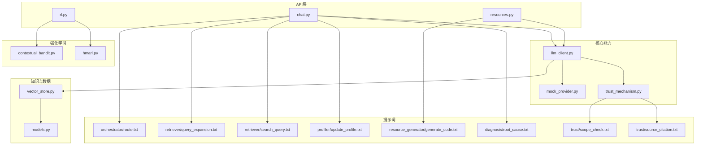
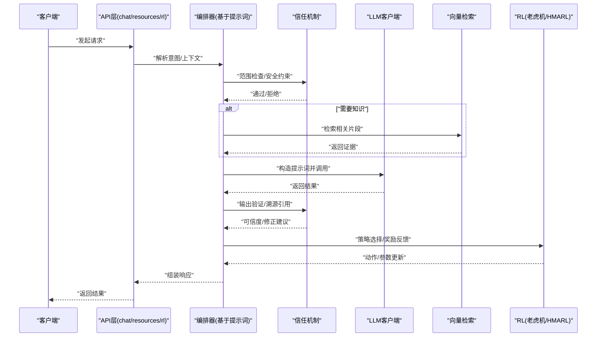
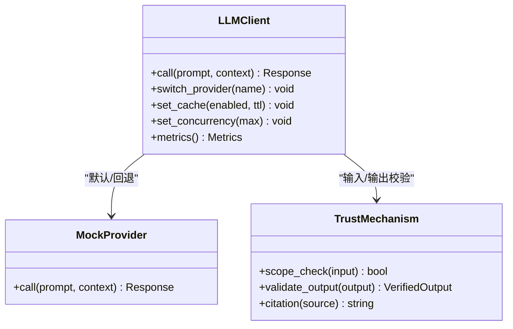
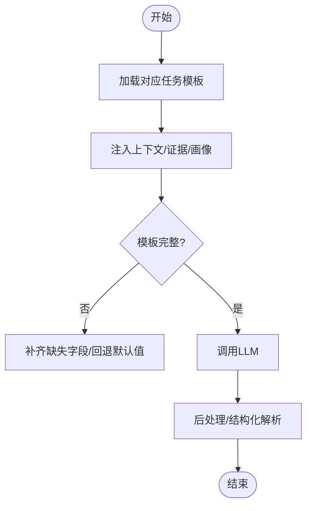
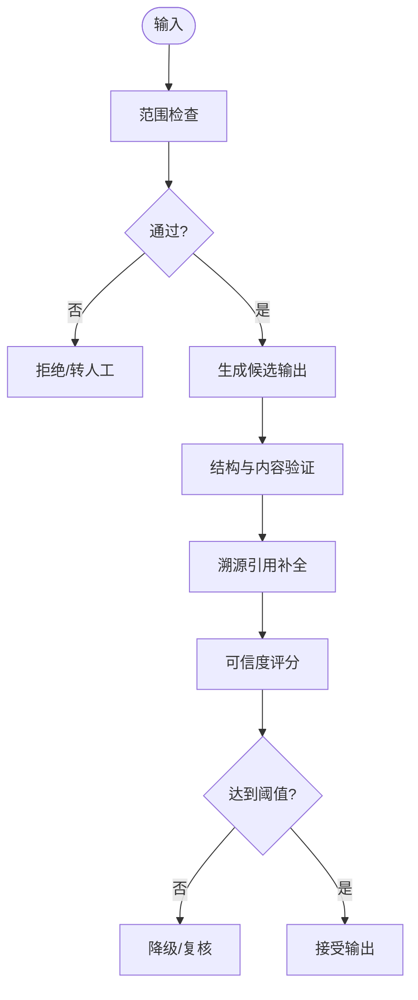
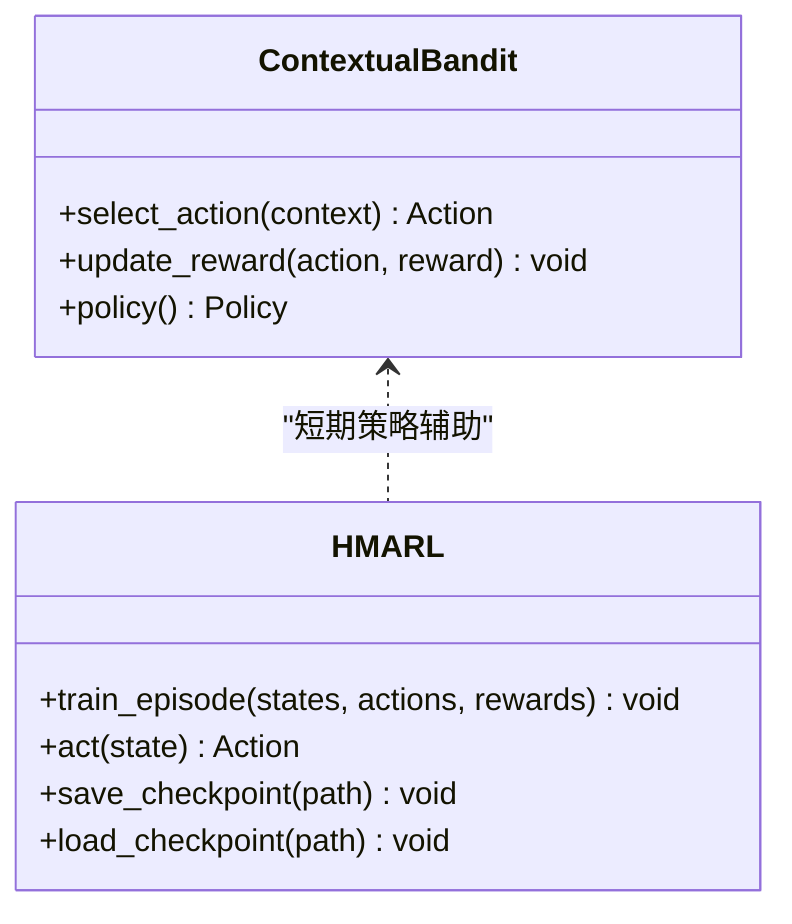
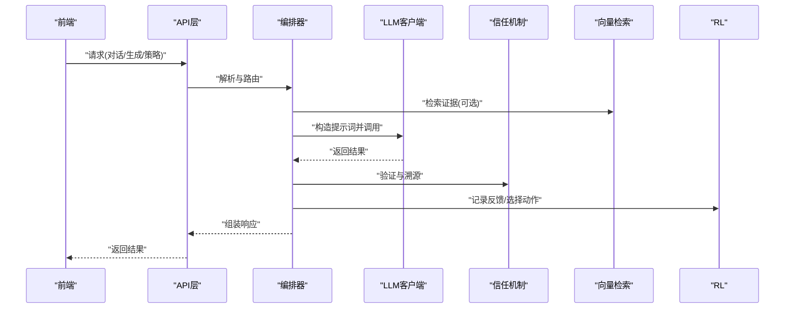
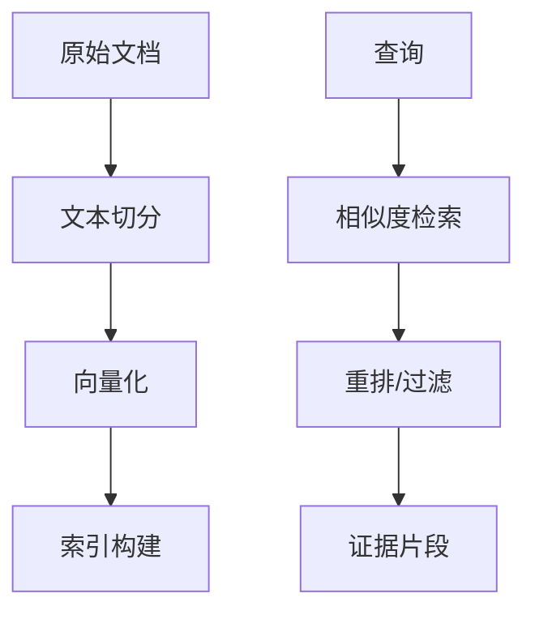
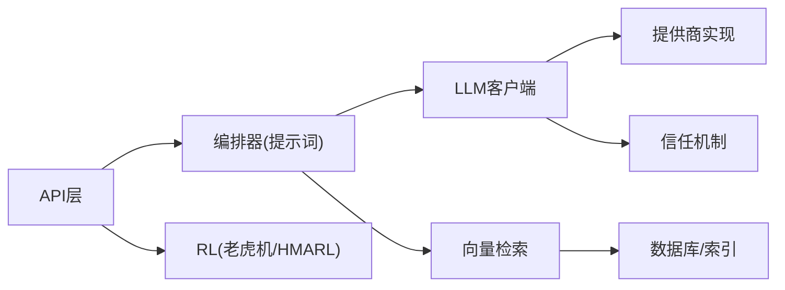

# AI/ML模块

<cite>
**本文引用的文件**   
- [src/loopse/core/llm_client.py](file://src/loopse/core/llm_client.py)
- [src/loopse/core/mock_provider.py](file://src/loopse/core/mock_provider.py)
- [src/loopse/core/trust_mechanism.py](file://src/loopse/core/trust_mechanism.py)
- [src/loopse/rl/contextual_bandit.py](file://src/loopse/rl/contextual_bandit.py)
- [src/loopse/rl/hmarl.py](file://src/loopse/rl/hmarl.py)
- [config/prompts/orchestrator/route.txt](file://config/prompts/orchestrator/route.txt)
- [config/prompts/retriever/query_expansion.txt](file://config/prompts/retriever/query_expansion.txt)
- [config/prompts/retriever/search_query.txt](file://config/prompts/retriever/search_query.txt)
- [config/prompts/profiler/update_profile.txt](file://config/prompts/profiler/update_profile.txt)
- [config/prompts/resource_generator/generate_code.txt](file://config/prompts/resource_generator/generate_code.txt)
- [config/prompts/diagnosis/root_cause.txt](file://config/prompts/diagnosis/root_cause.txt)
- [config/prompts/trust/scope_check.txt](file://config/prompts/trust/scope_check.txt)
- [config/prompts/trust/source_citation.txt](file://config/prompts/trust/source_citation.txt)
- [src/loopse/api/chat.py](file://src/loopse/api/chat.py)
- [src/loopse/api/resources.py](file://src/loopse/api/resources.py)
- [src/loopse/api/rl.py](file://src/loopse/api/rl.py)
- [src/loopse/kb/vector_store.py](file://src/loopse/kb/vector_store.py)
- [src/loopse/db/models.py](file://src/loopse/db/models.py)
- [pyproject.toml](file://pyproject.toml)
</cite>

## 目录
1. [简介](#简介)
2. [项目结构](#项目结构)
3. [核心组件](#核心组件)
4. [架构总览](#架构总览)
5. [详细组件分析](#详细组件分析)
6. [依赖关系分析](#依赖关系分析)
7. [性能与成本优化](#性能与成本优化)
8. [故障排查指南](#故障排查指南)
9. [结论](#结论)
10. [附录](#附录)

## 简介
本技术文档聚焦AI/ML模块，围绕大语言模型集成、提示词工程策略、成本控制机制、强化学习在个性化推荐中的应用（上下文多臂老虎机与HMARL算法）、信任机制设计、模型输出验证与安全性保障、训练数据准备、评估指标与持续学习策略，以及LLM提供商切换、缓存优化与并发处理最佳实践展开。文档同时给出扩展新AI能力与集成第三方机器学习服务的指导。

## 项目结构
AI/ML相关代码主要位于后端服务中：
- LLM客户端与提供商抽象：core/llm_client.py、core/mock_provider.py
- 信任与安全：core/trust_mechanism.py
- 强化学习：rl/contextual_bandit.py、rl/hmarl.py
- API层：api/chat.py、api/resources.py、api/rl.py
- 知识库与检索：kb/vector_store.py
- 持久化与模型定义：db/models.py
- 提示词模板：config/prompts/*
- 依赖声明：pyproject.toml

图表来源
- [src/loopse/api/chat.py](file://src/loopse/api/chat.py)
- [src/loopse/api/resources.py](file://src/loopse/api/resources.py)
- [src/loopse/api/rl.py](file://src/loopse/api/rl.py)
- [src/loopse/core/llm_client.py](file://src/loopse/core/llm_client.py)
- [src/loopse/core/mock_provider.py](file://src/loopse/core/mock_provider.py)
- [src/loopse/core/trust_mechanism.py](file://src/loopse/core/trust_mechanism.py)
- [src/loopse/rl/contextual_bandit.py](file://src/loopse/rl/contextual_bandit.py)
- [src/loopse/rl/hmarl.py](file://src/loopse/rl/hmarl.py)
- [src/loopse/kb/vector_store.py](file://src/loopse/kb/vector_store.py)
- [src/loopse/db/models.py](file://src/loopse/db/models.py)
- [config/prompts/orchestrator/route.txt](file://config/prompts/orchestrator/route.txt)
- [config/prompts/retriever/query_expansion.txt](file://config/prompts/retriever/query_expansion.txt)
- [config/prompts/retriever/search_query.txt](file://config/prompts/retriever/search_query.txt)
- [config/prompts/profiler/update_profile.txt](file://config/prompts/profiler/update_profile.txt)
- [config/prompts/resource_generator/generate_code.txt](file://config/prompts/resource_generator/generate_code.txt)
- [config/prompts/diagnosis/root_cause.txt](file://config/prompts/diagnosis/root_cause.txt)
- [config/prompts/trust/scope_check.txt](file://config/prompts/trust/scope_check.txt)
- [config/prompts/trust/source_citation.txt](file://config/prompts/trust/source_citation.txt)

章节来源
- [src/loopse/core/llm_client.py](file://src/loopse/core/llm_client.py)
- [src/loopse/core/mock_provider.py](file://src/loopse/core/mock_provider.py)
- [src/loopse/core/trust_mechanism.py](file://src/loopse/core/trust_mechanism.py)
- [src/loopse/rl/contextual_bandit.py](file://src/loopse/rl/contextual_bandit.py)
- [src/loopse/rl/hmarl.py](file://src/loopse/rl/hmarl.py)
- [src/loopse/api/chat.py](file://src/loopse/api/chat.py)
- [src/loopse/api/resources.py](file://src/loopse/api/resources.py)
- [src/loopse/api/rl.py](file://src/loopse/api/rl.py)
- [src/loopse/kb/vector_store.py](file://src/loopse/kb/vector_store.py)
- [src/loopse/db/models.py](file://src/loopse/db/models.py)
- [config/prompts/orchestrator/route.txt](file://config/prompts/orchestrator/route.txt)
- [config/prompts/retriever/query_expansion.txt](file://config/prompts/retriever/query_expansion.txt)
- [config/prompts/retriever/search_query.txt](file://config/prompts/retriever/search_query.txt)
- [config/prompts/profiler/update_profile.txt](file://config/prompts/profiler/update_profile.txt)
- [config/prompts/resource_generator/generate_code.txt](file://config/prompts/resource_generator/generate_code.txt)
- [config/prompts/diagnosis/root_cause.txt](file://config/prompts/diagnosis/root_cause.txt)
- [config/prompts/trust/scope_check.txt](file://config/prompts/trust/scope_check.txt)
- [config/prompts/trust/source_citation.txt](file://config/prompts/trust/source_citation.txt)

## 核心组件
- LLM客户端与提供商抽象：统一调用接口、支持多提供商切换、错误重试与降级、可选缓存与并发控制。
- 信任机制：对输入范围检查、输出溯源引用、可信度评分与拒绝策略。
- 强化学习：上下文多臂老虎机用于即时策略选择；HMARL用于长期个性化目标优化。
- 提示词工程：按角色与任务组织模板，驱动编排、检索、画像更新、资源生成与诊断推理。
- 知识库与向量检索：文本切分、向量化、相似度检索，支撑RAG与证据引用。
- API层：将用户请求路由到相应Agent与LLM流程，暴露RL与资源生成等能力。

章节来源
- [src/loopse/core/llm_client.py](file://src/loopse/core/llm_client.py)
- [src/loopse/core/trust_mechanism.py](file://src/loopse/core/trust_mechanism.py)
- [src/loopse/rl/contextual_bandit.py](file://src/loopse/rl/contextual_bandit.py)
- [src/loopse/rl/hmarl.py](file://src/loopse/rl/hmarl.py)
- [config/prompts/orchestrator/route.txt](file://config/prompts/orchestrator/route.txt)
- [config/prompts/retriever/query_expansion.txt](file://config/prompts/retriever/query_expansion.txt)
- [config/prompts/retriever/search_query.txt](file://config/prompts/retriever/search_query.txt)
- [config/prompts/profiler/update_profile.txt](file://config/prompts/profiler/update_profile.txt)
- [config/prompts/resource_generator/generate_code.txt](file://config/prompts/resource_generator/generate_code.txt)
- [config/prompts/diagnosis/root_cause.txt](file://config/prompts/diagnosis/root_cause.txt)
- [config/prompts/trust/scope_check.txt](file://config/prompts/trust/scope_check.txt)
- [config/prompts/trust/source_citation.txt](file://config/prompts/trust/source_citation.txt)

## 架构总览
系统采用“API -> Agent编排 -> LLM/RL/KB”的分层架构。API层接收请求并委派给编排器；编排器根据提示词与上下文决定调用路径（检索、生成、诊断或RL策略）；LLM客户端负责与外部模型交互；信任机制贯穿输入校验与输出验证；RL模块提供个性化策略；知识库提供检索与证据支撑。

图表来源
- [src/loopse/api/chat.py](file://src/loopse/api/chat.py)
- [src/loopse/api/resources.py](file://src/loopse/api/resources.py)
- [src/loopse/api/rl.py](file://src/loopse/api/rl.py)
- [src/loopse/core/llm_client.py](file://src/loopse/core/llm_client.py)
- [src/loopse/core/trust_mechanism.py](file://src/loopse/core/trust_mechanism.py)
- [src/loopse/kb/vector_store.py](file://src/loopse/kb/vector_store.py)
- [src/loopse/rl/contextual_bandit.py](file://src/loopse/rl/contextual_bandit.py)
- [src/loopse/rl/hmarl.py](file://src/loopse/rl/hmarl.py)

## 详细组件分析

### LLM客户端与提供商切换
- 统一接口：封装不同提供商的调用差异，提供一致的请求/响应模型。
- 提供商切换：通过配置或运行时参数选择具体实现，便于A/B测试与容灾。
- 错误处理：超时、限流、重试与回退策略，确保稳定性。
- 缓存与并发：可配置请求级缓存键与并发上限，降低延迟与成本。
- 监控与度量：记录调用耗时、Token用量与错误率，为成本优化提供依据。

图表来源
- [src/loopse/core/llm_client.py](file://src/loopse/core/llm_client.py)
- [src/loopse/core/mock_provider.py](file://src/loopse/core/mock_provider.py)
- [src/loopse/core/trust_mechanism.py](file://src/loopse/core/trust_mechanism.py)

章节来源
- [src/loopse/core/llm_client.py](file://src/loopse/core/llm_client.py)
- [src/loopse/core/mock_provider.py](file://src/loopse/core/mock_provider.py)
- [src/loopse/core/trust_mechanism.py](file://src/loopse/core/trust_mechanism.py)

### 提示词工程策略
- 分层组织：按角色与任务划分模板（编排、检索、画像、资源生成、诊断、信任）。
- 动态注入：将上下文、检索证据、用户画像与约束注入模板，提升可控性。
- 一致性约束：通过模板强制结构化输出，便于下游解析与验证。
- 可观测性：为关键步骤保留提示词版本与变量快照，便于回溯与评测。

图表来源
- [config/prompts/orchestrator/route.txt](file://config/prompts/orchestrator/route.txt)
- [config/prompts/retriever/query_expansion.txt](file://config/prompts/retriever/query_expansion.txt)
- [config/prompts/retriever/search_query.txt](file://config/prompts/retriever/search_query.txt)
- [config/prompts/profiler/update_profile.txt](file://config/prompts/profiler/update_profile.txt)
- [config/prompts/resource_generator/generate_code.txt](file://config/prompts/resource_generator/generate_code.txt)
- [config/prompts/diagnosis/root_cause.txt](file://config/prompts/diagnosis/root_cause.txt)
- [config/prompts/trust/scope_check.txt](file://config/prompts/trust/scope_check.txt)
- [config/prompts/trust/source_citation.txt](file://config/prompts/trust/source_citation.txt)

章节来源
- [config/prompts/orchestrator/route.txt](file://config/prompts/orchestrator/route.txt)
- [config/prompts/retriever/query_expansion.txt](file://config/prompts/retriever/query_expansion.txt)
- [config/prompts/retriever/search_query.txt](file://config/prompts/retriever/search_query.txt)
- [config/prompts/profiler/update_profile.txt](file://config/prompts/profiler/update_profile.txt)
- [config/prompts/resource_generator/generate_code.txt](file://config/prompts/resource_generator/generate_code.txt)
- [config/prompts/diagnosis/root_cause.txt](file://config/prompts/diagnosis/root_cause.txt)
- [config/prompts/trust/scope_check.txt](file://config/prompts/trust/scope_check.txt)
- [config/prompts/trust/source_citation.txt](file://config/prompts/trust/source_citation.txt)

### 信任机制设计与输出验证
- 输入范围检查：限制敏感信息、越权操作与恶意输入。
- 输出验证：格式校验、事实一致性检查、引用完整性。
- 溯源引用：强制附带来源片段，便于审计与纠错。
- 可信度评分：结合置信度与规则打分，触发人工复核或降级策略。

图表来源
- [src/loopse/core/trust_mechanism.py](file://src/loopse/core/trust_mechanism.py)
- [config/prompts/trust/scope_check.txt](file://config/prompts/trust/scope_check.txt)
- [config/prompts/trust/source_citation.txt](file://config/prompts/trust/source_citation.txt)

章节来源
- [src/loopse/core/trust_mechanism.py](file://src/loopse/core/trust_mechanism.py)
- [config/prompts/trust/scope_check.txt](file://config/prompts/trust/scope_check.txt)
- [config/prompts/trust/source_citation.txt](file://config/prompts/trust/source_citation.txt)

### 强化学习：上下文多臂老虎机与HMARL
- 上下文多臂老虎机：根据用户状态与环境特征选择干预或推荐动作，平衡探索与利用。
- HMARL：在多智能体或多目标场景下协调长期回报，适配个性化学习路径与资源推荐。
- 在线学习：实时收集反馈（点击、完成度、满意度），增量更新策略。
- 离线评估：使用历史日志进行反事实评估与策略对比。

图表来源
- [src/loopse/rl/contextual_bandit.py](file://src/loopse/rl/contextual_bandit.py)
- [src/loopse/rl/hmarl.py](file://src/loopse/rl/hmarl.py)

章节来源
- [src/loopse/rl/contextual_bandit.py](file://src/loopse/rl/contextual_bandit.py)
- [src/loopse/rl/hmarl.py](file://src/loopse/rl/hmarl.py)

### API与编排集成
- 聊天与对话：整合编排器、检索与信任机制，提供有证据支持的对话体验。
- 资源生成：基于任务模板与用户画像生成代码、文档、练习等多模态资源。
- RL接口：暴露策略选择与反馈上报端点，支持前端可视化与实验开关。

图表来源
- [src/loopse/api/chat.py](file://src/loopse/api/chat.py)
- [src/loopse/api/resources.py](file://src/loopse/api/resources.py)
- [src/loopse/api/rl.py](file://src/loopse/api/rl.py)
- [src/loopse/core/llm_client.py](file://src/loopse/core/llm_client.py)
- [src/loopse/core/trust_mechanism.py](file://src/loopse/core/trust_mechanism.py)
- [src/loopse/kb/vector_store.py](file://src/loopse/kb/vector_store.py)
- [src/loopse/rl/contextual_bandit.py](file://src/loopse/rl/contextual_bandit.py)
- [src/loopse/rl/hmarl.py](file://src/loopse/rl/hmarl.py)

章节来源
- [src/loopse/api/chat.py](file://src/loopse/api/chat.py)
- [src/loopse/api/resources.py](file://src/loopse/api/resources.py)
- [src/loopse/api/rl.py](file://src/loopse/api/rl.py)

### 知识库与向量检索
- 文本切分与清洗：保证片段质量与语义连贯性。
- 向量化与索引：构建高效相似度检索，支持混合检索与重排。
- 证据引用：与信任机制联动，确保输出可追溯。

图表来源
- [src/loopse/kb/vector_store.py](file://src/loopse/kb/vector_store.py)
- [src/loopse/db/models.py](file://src/loopse/db/models.py)

章节来源
- [src/loopse/kb/vector_store.py](file://src/loopse/kb/vector_store.py)
- [src/loopse/db/models.py](file://src/loopse/db/models.py)

## 依赖关系分析
- 内部依赖：API层依赖编排器与LLM客户端；LLM客户端依赖信任机制与提供商实现；RL模块独立但可与API协作。
- 外部依赖：向量数据库、模型提供商SDK、存储与监控组件。
- 耦合与内聚：LLM客户端与提供商解耦，便于替换；信任机制横切关注点，低耦合高复用。

图表来源
- [src/loopse/api/chat.py](file://src/loopse/api/chat.py)
- [src/loopse/api/resources.py](file://src/loopse/api/resources.py)
- [src/loopse/api/rl.py](file://src/loopse/api/rl.py)
- [src/loopse/core/llm_client.py](file://src/loopse/core/llm_client.py)
- [src/loopse/core/mock_provider.py](file://src/loopse/core/mock_provider.py)
- [src/loopse/core/trust_mechanism.py](file://src/loopse/core/trust_mechanism.py)
- [src/loopse/kb/vector_store.py](file://src/loopse/kb/vector_store.py)
- [src/loopse/db/models.py](file://src/loopse/db/models.py)

章节来源
- [pyproject.toml](file://pyproject.toml)

## 性能与成本优化
- 缓存策略：对高频、确定性请求启用缓存，设置合理TTL与失效策略。
- 并发控制：限制并发数与队列长度，避免雪崩与过载。
- 提供商切换：根据延迟与成本自动选择最优提供商，失败快速回退。
- 提示词裁剪：减少不必要上下文与冗余指令，降低Token消耗。
- 批处理与流式：批量合并相似请求，流式返回以提升用户体验。
- 监控与告警：跟踪延迟、错误率、Token用量与预算，设定阈值告警。

[本节为通用指导，不直接分析具体文件]

## 故障排查指南
- 常见问题
  - 提供商限流/超时：检查重试与回退策略，确认配额与速率限制。
  - 缓存命中异常：核对缓存键生成逻辑与TTL设置。
  - 输出不可解析：检查提示词模板与结构化约束是否一致。
  - 信任机制误拒：调整范围检查阈值与验证规则。
  - RL策略不稳定：检查奖励信号与采样分布，必要时回滚至上一版本。
- 定位方法
  - 查看调用链日志与提示词快照。
  - 对比不同提供商的响应差异。
  - 回放历史会话，复现问题并定位根因。

章节来源
- [src/loopse/core/llm_client.py](file://src/loopse/core/llm_client.py)
- [src/loopse/core/trust_mechanism.py](file://src/loopse/core/trust_mechanism.py)
- [src/loopse/rl/contextual_bandit.py](file://src/loopse/rl/contextual_bandit.py)
- [src/loopse/rl/hmarl.py](file://src/loopse/rl/hmarl.py)

## 结论
本模块以统一的LLM客户端为核心，结合提示词工程、信任机制与知识库检索，形成稳定可控的大模型应用基座。强化学习提供个性化策略能力，配合完善的监控与成本优化手段，可在复杂业务场景中持续演进。通过清晰的扩展点与最佳实践，团队可快速集成新的AI能力与第三方服务。

[本节为总结性内容，不直接分析具体文件]

## 附录
- 训练数据准备
  - 数据来源：课程材料、错题集、问答日志、专家标注。
  - 数据治理：去噪、脱敏、标注规范与版本管理。
  - 数据增强：同义改写、负样本构造、边界用例补充。
- 模型评估指标
  - 准确性：答案正确率、诊断准确率、检索命中率。
  - 效率：首字延迟、端到端延迟、吞吐。
  - 成本：每千Token成本、预算占用、ROI。
  - 可靠性：拒绝率、复核通过率、溯源覆盖率。
- 持续学习策略
  - 在线学习：增量更新策略与轻量微调。
  - 离线评估：A/B测试、反事实评估、漂移检测。
  - 版本管理：提示词、模型、策略与数据的版本化与回滚。
- 扩展新AI能力与第三方服务
  - 新增提供商：实现统一接口并注册到客户端。
  - 新增Agent：定义职责、输入输出契约与提示词模板。
  - 接入第三方ML服务：封装为适配器，纳入信任与监控体系。

[本节为通用指导，不直接分析具体文件]