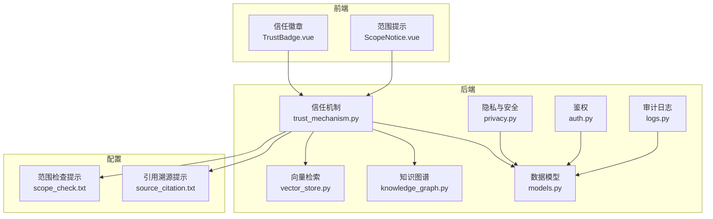
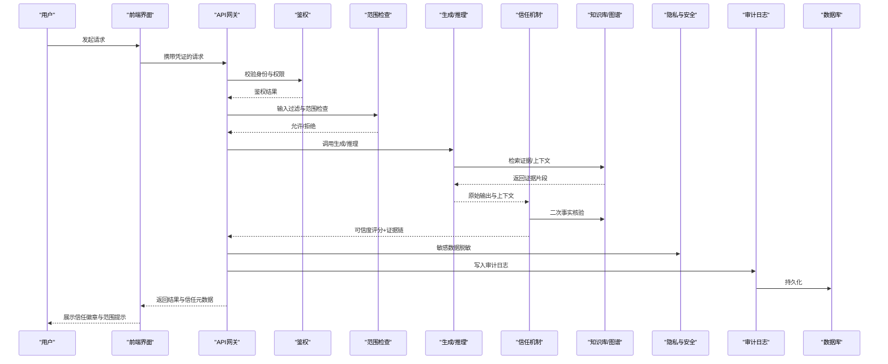
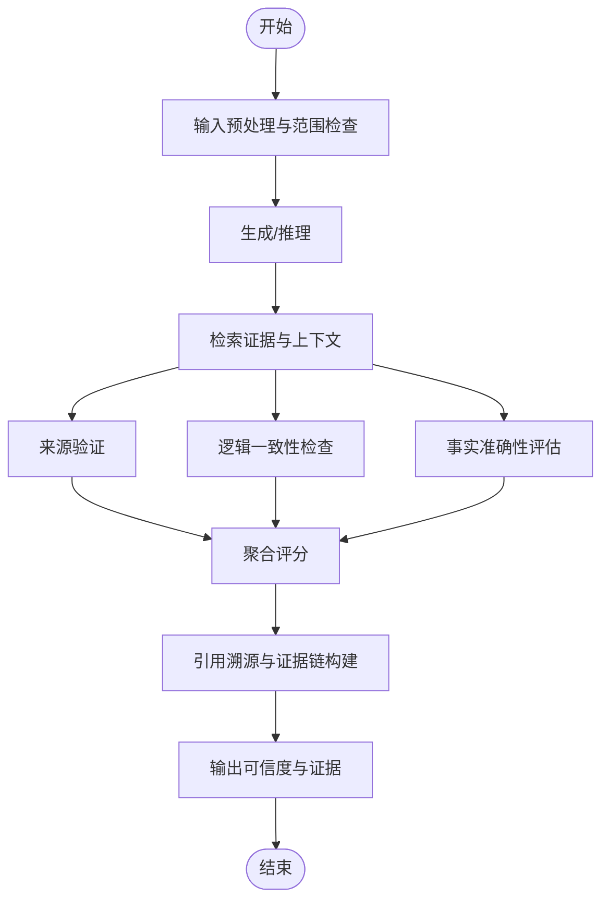
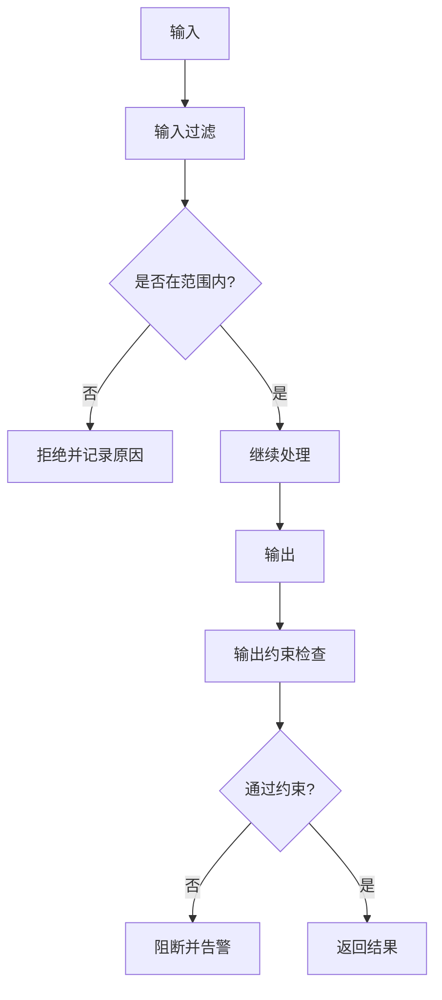
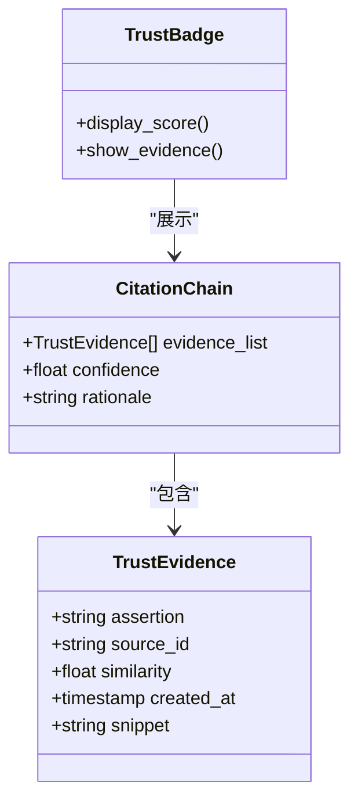
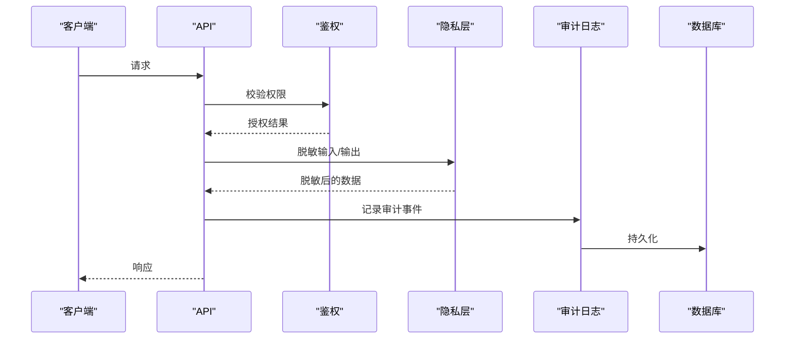
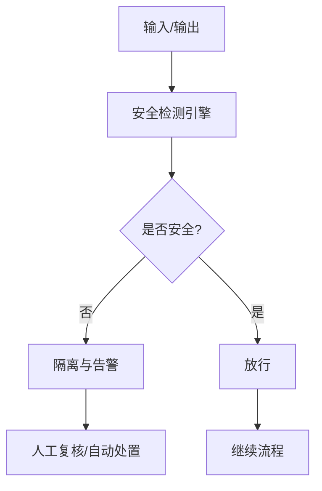
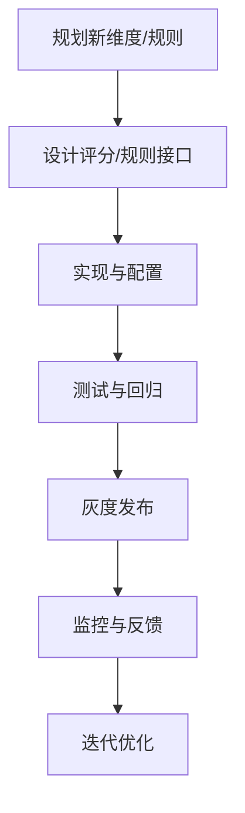
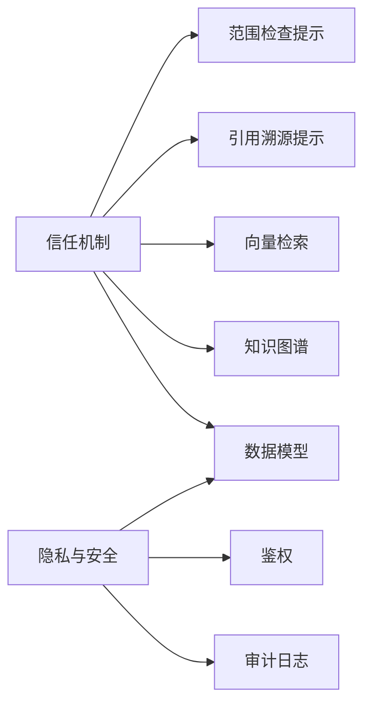

# 信任机制与安全

<cite>
**本文引用的文件**   
- [src/loopse/core/trust_mechanism.py](file://src/loopse/core/trust_mechanism.py)
- [config/prompts/trust/scope_check.txt](file://config/prompts/trust/scope_check.txt)
- [config/prompts/trust/source_citation.txt](file://config/prompts/trust/source_citation.txt)
- [src/loopse/security/privacy.py](file://src/loopse/security/privacy.py)
- [frontend/src/components/resources/TrustBadge.vue](file://frontend/src/components/resources/TrustBadge.vue)
- [frontend/src/components/ScopeNotice.vue](file://frontend/src/components/ScopeNotice.vue)
- [src/loopse/api/auth.py](file://src/loopse/api/auth.py)
- [src/loopse/api/logs.py](file://src/loopse/api/logs.py)
- [src/loopse/db/models.py](file://src/loopse/db/models.py)
- [src/loopse/kb/vector_store.py](file://src/loopse/kb/vector_store.py)
- [src/loopse/kb/knowledge_graph.py](file://src/loopse/kb/knowledge_graph.py)
</cite>

## 目录
1. [简介](#简介)
2. [项目结构](#项目结构)
3. [核心组件](#核心组件)
4. [架构总览](#架构总览)
5. [详细组件分析](#详细组件分析)
6. [依赖关系分析](#依赖关系分析)
7. [性能考虑](#性能考虑)
8. [故障排查指南](#故障排查指南)
9. [结论](#结论)
10. [附录](#附录)

## 简介
本文件聚焦于Socrates-Cube的信任机制与安全模块，系统性阐述AI输出可信度评估体系、范围检查机制、引用溯源系统、隐私保护策略、内容安全与异常检测方案，以及扩展新维度与规则的方法。文档同时提供威胁分析与漏洞防护、合规性检查的最佳实践，帮助工程团队在可解释、可审计、可治理的前提下构建高可信的AI能力。

## 项目结构
与信任和安全相关的代码与配置主要分布在以下位置：
- 核心信任机制实现：src/loopse/core/trust_mechanism.py
- 信任相关提示词模板：config/prompts/trust/*
- 隐私与安全：src/loopse/security/privacy.py
- 前端信任展示：frontend/src/components/resources/TrustBadge.vue、frontend/src/components/ScopeNotice.vue
- 鉴权与审计日志：src/loopse/api/auth.py、src/loopse/api/logs.py
- 数据模型（含审计字段）：src/loopse/db/models.py
- 知识检索与图谱：src/loopse/kb/vector_store.py、src/loopse/kb/knowledge_graph.py

图表来源
- [src/loopse/core/trust_mechanism.py](file://src/loopse/core/trust_mechanism.py)
- [src/loopse/security/privacy.py](file://src/loopse/security/privacy.py)
- [src/loopse/api/auth.py](file://src/loopse/api/auth.py)
- [src/loopse/api/logs.py](file://src/loopse/api/logs.py)
- [src/loopse/kb/vector_store.py](file://src/loopse/kb/vector_store.py)
- [src/loopse/kb/knowledge_graph.py](file://src/loopse/kb/knowledge_graph.py)
- [src/loopse/db/models.py](file://src/loopse/db/models.py)
- [config/prompts/trust/scope_check.txt](file://config/prompts/trust/scope_check.txt)
- [config/prompts/trust/source_citation.txt](file://config/prompts/trust/source_citation.txt)
- [frontend/src/components/resources/TrustBadge.vue](file://frontend/src/components/resources/TrustBadge.vue)
- [frontend/src/components/ScopeNotice.vue](file://frontend/src/components/ScopeNotice.vue)

章节来源
- [src/loopse/core/trust_mechanism.py](file://src/loopse/core/trust_mechanism.py)
- [config/prompts/trust/scope_check.txt](file://config/prompts/trust/scope_check.txt)
- [config/prompts/trust/source_citation.txt](file://config/prompts/trust/source_citation.txt)
- [src/loopse/security/privacy.py](file://src/loopse/security/privacy.py)
- [frontend/src/components/resources/TrustBadge.vue](file://frontend/src/components/resources/TrustBadge.vue)
- [frontend/src/components/ScopeNotice.vue](file://frontend/src/components/ScopeNotice.vue)
- [src/loopse/api/auth.py](file://src/loopse/api/auth.py)
- [src/loopse/api/logs.py](file://src/loopse/api/logs.py)
- [src/loopse/db/models.py](file://src/loopse/db/models.py)
- [src/loopse/kb/vector_store.py](file://src/loopse/kb/vector_store.py)
- [src/loopse/kb/knowledge_graph.py](file://src/loopse/kb/knowledge_graph.py)

## 核心组件
- 信任机制核心：负责将“来源验证”“逻辑一致性检查”“事实准确性评估”“范围检查”“引用溯源”等维度整合为统一的评分与证据链，并输出可解释结果。
- 隐私与安全：提供数据脱敏、访问控制与审计日志记录，确保敏感信息最小化暴露与操作可追溯。
- 前端信任展示：通过信任徽章与范围提示，向用户透明呈现可信度评分、依据与约束边界。
- 知识检索与图谱：为事实核查与一致性校验提供外部证据支撑。
- 鉴权与审计：统一身份认证与请求级审计，形成闭环的可审计链路。

章节来源
- [src/loopse/core/trust_mechanism.py](file://src/loopse/core/trust_mechanism.py)
- [src/loopse/security/privacy.py](file://src/loopse/security/privacy.py)
- [frontend/src/components/resources/TrustBadge.vue](file://frontend/src/components/resources/TrustBadge.vue)
- [frontend/src/components/ScopeNotice.vue](file://frontend/src/components/ScopeNotice.vue)
- [src/loopse/kb/vector_store.py](file://src/loopse/kb/vector_store.py)
- [src/loopse/kb/knowledge_graph.py](file://src/loopse/kb/knowledge_graph.py)
- [src/loopse/api/auth.py](file://src/loopse/api/auth.py)
- [src/loopse/api/logs.py](file://src/loopse/api/logs.py)

## 架构总览
下图展示了从输入到输出的端到端信任与安全流程：输入经范围检查与过滤后进入推理与生成阶段；生成结果由信任机制进行多维评估并附带证据链；隐私层对敏感数据进行脱敏；鉴权与审计贯穿全链路；前端以可视化方式呈现可信度与范围提示。

图表来源
- [src/loopse/core/trust_mechanism.py](file://src/loopse/core/trust_mechanism.py)
- [config/prompts/trust/scope_check.txt](file://config/prompts/trust/scope_check.txt)
- [config/prompts/trust/source_citation.txt](file://config/prompts/trust/source_citation.txt)
- [src/loopse/security/privacy.py](file://src/loopse/security/privacy.py)
- [src/loopse/api/auth.py](file://src/loopse/api/auth.py)
- [src/loopse/api/logs.py](file://src/loopse/api/logs.py)
- [src/loopse/kb/vector_store.py](file://src/loopse/kb/vector_store.py)
- [src/loopse/kb/knowledge_graph.py](file://src/loopse/kb/knowledge_graph.py)
- [src/loopse/db/models.py](file://src/loopse/db/models.py)
- [frontend/src/components/resources/TrustBadge.vue](file://frontend/src/components/resources/TrustBadge.vue)
- [frontend/src/components/ScopeNotice.vue](file://frontend/src/components/ScopeNotice.vue)

## 详细组件分析

### 信任机制核心（可信度评估体系）
- 目标：对AI输出进行多维度评估，包括来源验证、逻辑一致性检查、事实准确性评估，并结合范围检查结果给出综合可信度分数与可解释证据链。
- 关键流程：
  - 输入预处理：执行范围检查与内容过滤，拒绝越界或高风险输入。
  - 生成与检索：结合知识库与图谱获取证据片段，辅助后续评估。
  - 多维评估：
    - 来源验证：比对输出断言与检索到的权威来源，计算来源匹配度。
    - 逻辑一致性：基于图谱关系与规则进行自洽性检查，识别矛盾与冲突。
    - 事实准确性：利用向量检索相似度与图谱路径验证事实断言。
  - 范围检查：根据领域、任务、时间窗口、版本等约束判定是否允许输出。
  - 引用溯源：为每个关键断言生成引用条目，形成证据链。
  - 评分与输出：汇总各维度得分，输出可信度等级、置信区间与证据清单。
- 可扩展性：支持新增评估维度（如时效性、风险等级、伦理合规），通过注册表与权重配置动态组合。

图表来源
- [src/loopse/core/trust_mechanism.py](file://src/loopse/core/trust_mechanism.py)
- [config/prompts/trust/scope_check.txt](file://config/prompts/trust/scope_check.txt)
- [config/prompts/trust/source_citation.txt](file://config/prompts/trust/source_citation.txt)
- [src/loopse/kb/vector_store.py](file://src/loopse/kb/vector_store.py)
- [src/loopse/kb/knowledge_graph.py](file://src/loopse/kb/knowledge_graph.py)

章节来源
- [src/loopse/core/trust_mechanism.py](file://src/loopse/core/trust_mechanism.py)
- [config/prompts/trust/scope_check.txt](file://config/prompts/trust/scope_check.txt)
- [config/prompts/trust/source_citation.txt](file://config/prompts/trust/source_citation.txt)
- [src/loopse/kb/vector_store.py](file://src/loopse/kb/vector_store.py)
- [src/loopse/kb/knowledge_graph.py](file://src/loopse/kb/knowledge_graph.py)

### 范围检查机制（输入过滤、输出约束与安全边界）
- 输入过滤：基于正则、关键词、语义分类等手段拦截恶意或越界输入。
- 输出约束：对生成内容进行长度、格式、敏感词、领域边界限制。
- 安全边界：按角色、场景、时间窗口、版本等策略限定可访问的知识与能力。
- 提示词驱动：使用范围检查提示词模板，保证策略可配置、可审计。

图表来源
- [config/prompts/trust/scope_check.txt](file://config/prompts/trust/scope_check.txt)
- [src/loopse/core/trust_mechanism.py](file://src/loopse/core/trust_mechanism.py)

章节来源
- [config/prompts/trust/scope_check.txt](file://config/prompts/trust/scope_check.txt)
- [src/loopse/core/trust_mechanism.py](file://src/loopse/core/trust_mechanism.py)

### 引用溯源系统（知识来源追踪、证据链构建、透明度展示）
- 知识来源追踪：为每条关键断言绑定来源ID、片段、相似度与时间戳。
- 证据链构建：串联多源证据，形成可验证的推理路径。
- 透明度展示：前端以信任徽章与详情面板展示评分、依据与来源链接。
- 提示词模板：使用引用溯源提示词模板，规范证据格式与完整性要求。

图表来源
- [config/prompts/trust/source_citation.txt](file://config/prompts/trust/source_citation.txt)
- [frontend/src/components/resources/TrustBadge.vue](file://frontend/src/components/resources/TrustBadge.vue)
- [src/loopse/core/trust_mechanism.py](file://src/loopse/core/trust_mechanism.py)

章节来源
- [config/prompts/trust/source_citation.txt](file://config/prompts/trust/source_citation.txt)
- [frontend/src/components/resources/TrustBadge.vue](file://frontend/src/components/resources/TrustBadge.vue)
- [src/loopse/core/trust_mechanism.py](file://src/loopse/core/trust_mechanism.py)

### 隐私保护策略（数据脱敏、访问控制、审计日志）
- 数据脱敏：对PII与敏感字段进行掩码、哈希或泛化处理，降低泄露风险。
- 访问控制：基于角色的细粒度权限控制，限制对敏感资源与操作的访问。
- 审计日志：记录关键操作的主体、动作、对象、时间与结果，支持回溯与合规审查。
- 存储与传输：建议采用加密存储与传输通道，配合密钥管理。

图表来源
- [src/loopse/security/privacy.py](file://src/loopse/security/privacy.py)
- [src/loopse/api/auth.py](file://src/loopse/api/auth.py)
- [src/loopse/api/logs.py](file://src/loopse/api/logs.py)
- [src/loopse/db/models.py](file://src/loopse/db/models.py)

章节来源
- [src/loopse/security/privacy.py](file://src/loopse/security/privacy.py)
- [src/loopse/api/auth.py](file://src/loopse/api/auth.py)
- [src/loopse/api/logs.py](file://src/loopse/api/logs.py)
- [src/loopse/db/models.py](file://src/loopse/db/models.py)

### 内容安全过滤、恶意输入检测与异常行为识别
- 内容安全过滤：对输入输出进行敏感词、违规模式、注入攻击检测。
- 恶意输入检测：结合规则与轻量模型识别提示注入、越狱尝试与对抗样本。
- 异常行为识别：基于频率、时序与行为画像识别自动化滥用与异常会话。
- 联动处置：触发限流、熔断、告警与人工复核。

[此图为概念流程图，不直接映射具体源码文件]

### 扩展新的信任评估维度与安全规则
- 维度扩展：在信任机制中注册新维度（如时效性、风险等级、伦理合规），定义评分函数与阈值。
- 规则扩展：在范围检查与内容安全中添加新规则，支持热更新与灰度发布。
- 配置化：通过配置文件或提示词模板管理策略，便于审计与回滚。
- 测试与回归：为新维度与规则编写单元测试与集成测试，确保稳定性。

[此图为概念流程图，不直接映射具体源码文件]

## 依赖关系分析
- 信任机制依赖：
  - 范围检查提示词模板与引用溯源提示词模板，用于策略与证据格式。
  - 向量检索与知识图谱，提供事实核查与一致性校验的证据基础。
  - 数据模型，用于持久化审计与证据链。
- 隐私与安全依赖：
  - 鉴权模块，确保访问控制与最小权限原则。
  - 审计日志，记录关键操作与决策。
  - 数据模型，承载审计与脱敏数据的持久化。

图表来源
- [src/loopse/core/trust_mechanism.py](file://src/loopse/core/trust_mechanism.py)
- [config/prompts/trust/scope_check.txt](file://config/prompts/trust/scope_check.txt)
- [config/prompts/trust/source_citation.txt](file://config/prompts/trust/source_citation.txt)
- [src/loopse/kb/vector_store.py](file://src/loopse/kb/vector_store.py)
- [src/loopse/kb/knowledge_graph.py](file://src/loopse/kb/knowledge_graph.py)
- [src/loopse/security/privacy.py](file://src/loopse/security/privacy.py)
- [src/loopse/api/auth.py](file://src/loopse/api/auth.py)
- [src/loopse/api/logs.py](file://src/loopse/api/logs.py)
- [src/loopse/db/models.py](file://src/loopse/db/models.py)

章节来源
- [src/loopse/core/trust_mechanism.py](file://src/loopse/core/trust_mechanism.py)
- [config/prompts/trust/scope_check.txt](file://config/prompts/trust/scope_check.txt)
- [config/prompts/trust/source_citation.txt](file://config/prompts/trust/source_citation.txt)
- [src/loopse/kb/vector_store.py](file://src/loopse/kb/vector_store.py)
- [src/loopse/kb/knowledge_graph.py](file://src/loopse/kb/knowledge_graph.py)
- [src/loopse/security/privacy.py](file://src/loopse/security/privacy.py)
- [src/loopse/api/auth.py](file://src/loopse/api/auth.py)
- [src/loopse/api/logs.py](file://src/loopse/api/logs.py)
- [src/loopse/db/models.py](file://src/loopse/db/models.py)

## 性能考虑
- 证据检索优化：对向量检索与图谱查询进行索引与缓存，减少重复计算。
- 评估流水线并行：将来源验证、一致性检查与事实准确性评估并行执行，缩短延迟。
- 增量更新：对证据链与评分进行增量更新，避免全量重算。
- 降级策略：在高负载时启用简化评估与缓存命中优先，保障可用性。

[本节为通用指导，不直接分析具体文件]

## 故障排查指南
- 常见问题定位：
  - 信任评分异常：检查证据链完整性、来源匹配度与一致性检测结果。
  - 范围检查误拒：核对范围策略配置与提示词模板，确认输入特征是否符合预期。
  - 隐私脱敏失败：检查敏感字段识别规则与脱敏策略，确认权限与数据源。
  - 审计日志缺失：确认鉴权与日志中间件是否生效，检查数据库写入与权限。
- 调试建议：
  - 开启详细日志与Trace ID，关联请求与证据链。
  - 使用沙箱环境回放问题输入，逐步缩小范围。
  - 对提示词模板与规则进行A/B对比，定位变更影响。

章节来源
- [src/loopse/core/trust_mechanism.py](file://src/loopse/core/trust_mechanism.py)
- [config/prompts/trust/scope_check.txt](file://config/prompts/trust/scope_check.txt)
- [config/prompts/trust/source_citation.txt](file://config/prompts/trust/source_citation.txt)
- [src/loopse/security/privacy.py](file://src/loopse/security/privacy.py)
- [src/loopse/api/logs.py](file://src/loopse/api/logs.py)
- [src/loopse/db/models.py](file://src/loopse/db/models.py)

## 结论
通过将范围检查、多维可信度评估、引用溯源与隐私安全深度融合，Socrates-Cube构建了可解释、可审计、可治理的AI信任与安全体系。该体系既满足当前业务需求，又具备良好的扩展性与鲁棒性，为持续演进提供了坚实基础。

## 附录
- 最佳实践建议：
  - 安全威胁分析：定期进行提示注入、越狱、数据泄露与供应链风险评估。
  - 漏洞防护：强化输入校验、最小权限、密钥管理与依赖扫描。
  - 合规性检查：遵循数据保护法规与行业规范，完善审计与报告机制。
  - 持续改进：建立度量指标与反馈闭环，推动信任与安全能力的持续优化。

[本节为通用指导，不直接分析具体文件]