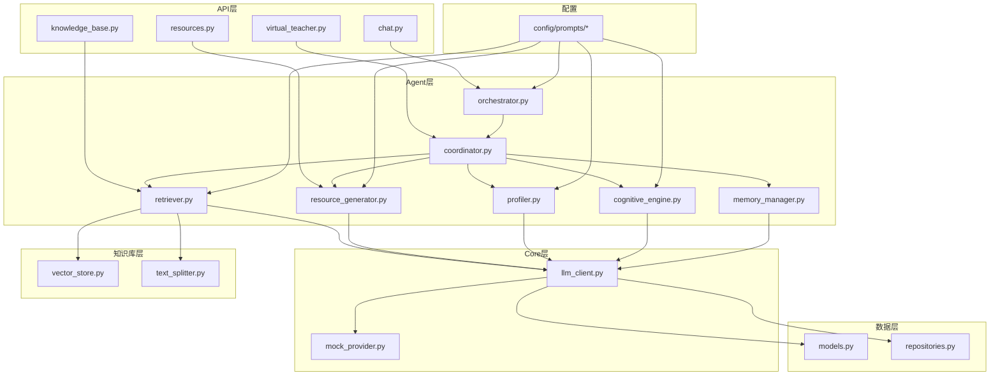
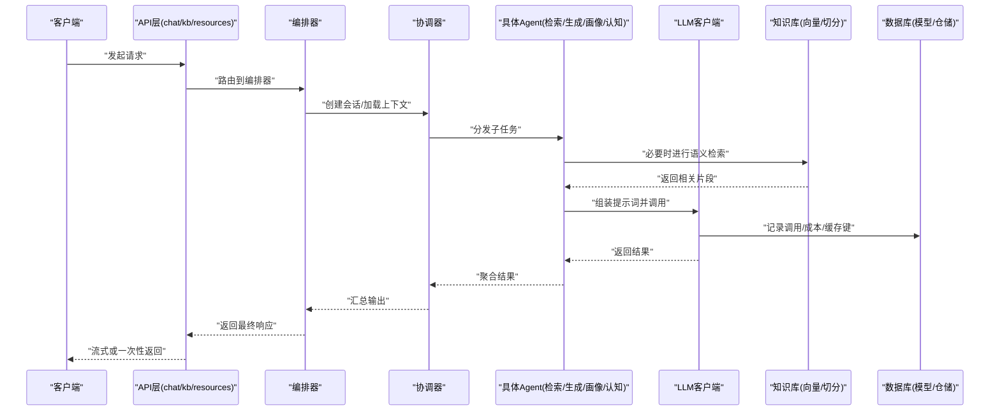
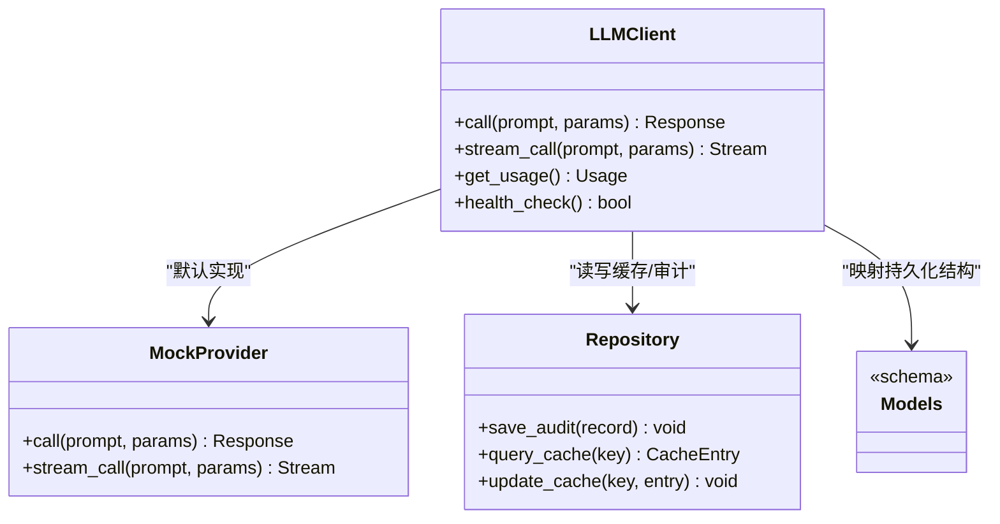
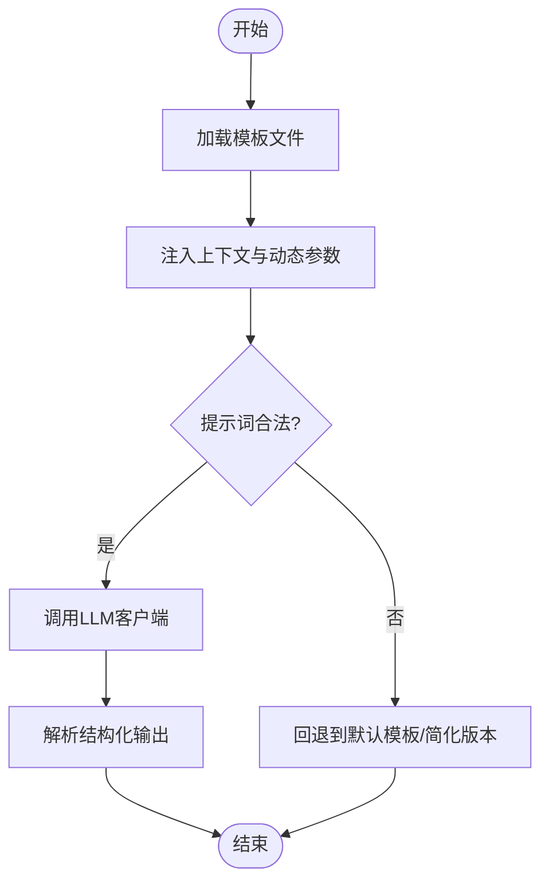
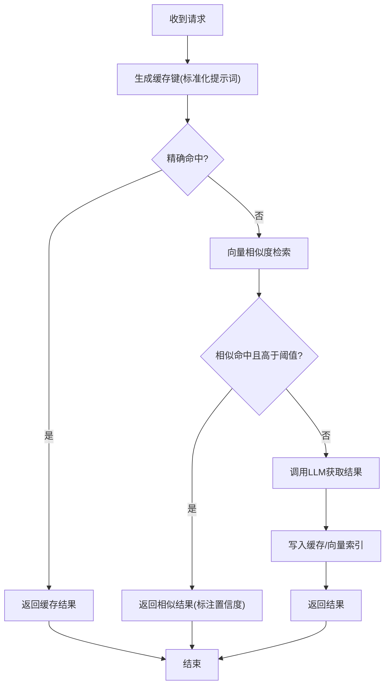
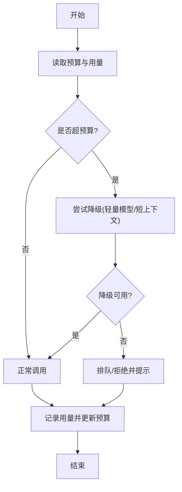
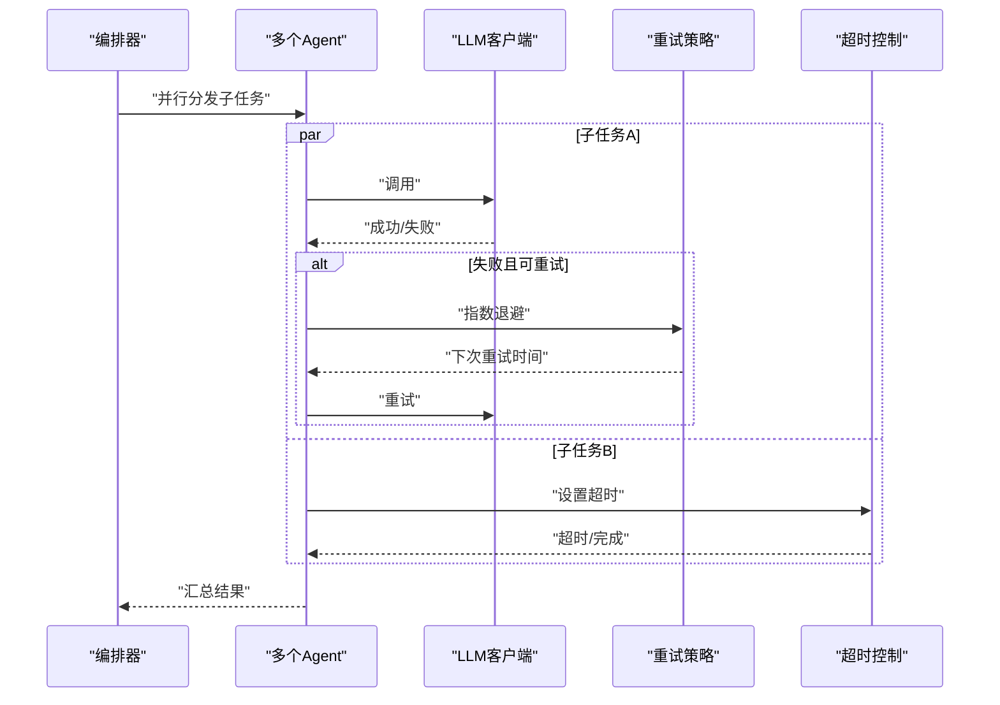
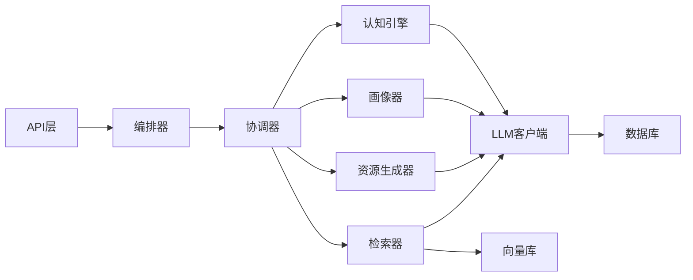

# 大语言模型集成

<cite>
**本文引用的文件**   
- [src/loopse/core/llm_client.py](file://src/loopse/core/llm_client.py)
- [src/loopse/core/mock_provider.py](file://src/loopse/core/mock_provider.py)
- [config/prompts/orchestrator/route.txt](file://config/prompts/orchestrator/route.txt)
- [config/prompts/retriever/query_expansion.txt](file://config/prompts/retriever/query_expansion.txt)
- [config/prompts/retriever/search_query.txt](file://config/prompts/retriever/search_query.txt)
- [config/prompts/resource_generator/generate_code.txt](file://config/prompts/resource_generator/generate_code.txt)
- [config/prompts/resource_generator/generate_doc.txt](file://config/prompts/resource_generator/generate_doc.txt)
- [config/prompts/resource_generator/generate_exercise.txt](file://config/prompts/resource_generator/generate_exercise.txt)
- [config/prompts/resource_generator/generate_infographic.txt](file://config/prompts/resource_generator/generate_infographic.txt)
- [config/prompts/resource_generator/generate_script.txt](file://config/prompts/resource_generator/generate_script.txt)
- [config/prompts/profiler/onboarding.txt](file://config/prompts/profiler/onboarding.txt)
- [config/prompts/profiler/update_profile.txt](file://config/prompts/profiler/update_profile.txt)
- [config/prompts/challenger/](file://config/prompts/challenger/)
- [config/prompts/diagnosis/pattern_match.txt](file://config/prompts/diagnosis/pattern_match.txt)
- [config/prompts/diagnosis/root_cause.txt](file://config/prompts/diagnosis/root_cause.txt)
- [config/prompts/diagnosis/surface_error.txt](file://config/prompts/diagnosis/surface_error.txt)
- [config/prompts/path_planner/plan_path.txt](file://config/prompts/path_planner/plan_path.txt)
- [config/prompts/trust/scope_check.txt](file://config/prompts/trust/scope_check.txt)
- [config/prompts/trust/source_citation.txt](file://config/prompts/trust/source_citation.txt)
- [src/loopse/api/chat.py](file://src/loopse/api/chat.py)
- [src/loopse/api/knowledge_base.py](file://src/loopse/api/knowledge_base.py)
- [src/loopse/api/resources.py](file://src/loopse/api/resources.py)
- [src/loopse/api/virtual_teacher.py](file://src/loopse/api/virtual_teacher.py)
- [src/loopse/agent/coordinator.py](file://src/loopse/agent/coordinator.py)
- [src/loopse/agent/orchestrator.py](file://src/loopse/agent/orchestrator.py)
- [src/loopse/agent/retriever.py](file://src/loopse/agent/retriever.py)
- [src/loopse/agent/resource_generator.py](file://src/loopse/agent/resource_generator.py)
- [src/loopse/agent/profiler.py](file://src/loopse/agent/profiler.py)
- [src/loopse/agent/cognitive_engine.py](file://src/loopse/agent/cognitive_engine.py)
- [src/loopse/agent/memory_manager.py](file://src/loopse/agent/memory_manager.py)
- [src/loopse/db/models.py](file://src/loopse/db/models.py)
- [src/loopse/db/repositories.py](file://src/loopse/db/repositories.py)
- [src/loopse/kb/vector_store.py](file://src/loopse/kb/vector_store.py)
- [src/loopse/kb/text_splitter.py](file://src/loopse/kb/text_splitter.py)
- [tests/unit/test_llm_client.py](file://tests/unit/test_llm_client.py)
</cite>

## 目录
1. [简介](#简介)
2. [项目结构](#项目结构)
3. [核心组件](#核心组件)
4. [架构总览](#架构总览)
5. [详细组件分析](#详细组件分析)
6. [依赖关系分析](#依赖关系分析)
7. [性能与并发优化](#性能与并发优化)
8. [故障排查指南](#故障排查指南)
9. [结论](#结论)
10. [附录](#附录)

## 简介
本技术文档聚焦于“大语言模型（LLM）集成”的设计与实现，围绕以下目标展开：
- LLM客户端架构设计：多提供商支持、请求路由与负载均衡机制
- 提示词工程策略：系统提示词模板、上下文管理与动态参数注入
- 缓存策略：响应缓存、语义相似性匹配与缓存失效
- 成本控制：token使用监控、预算限制与降级策略
- 并发处理优化、错误重试与超时管理
- 扩展新LLM提供商与自定义提示词模板
- 性能监控、日志记录与调试工具

## 项目结构
本项目采用分层与按领域划分相结合的组织方式。与LLM集成密切相关的代码主要分布在如下位置：
- core层：统一LLM客户端抽象与默认Mock实现
- agent层：编排器、检索器、资源生成器、画像器等Agent对LLM的调用
- api层：对外HTTP接口，作为Agent与LLM调用的入口
- kb层：向量存储与文本切分，支撑语义检索与RAG
- db层：持久化模型与仓储，用于缓存、审计与成本统计
- config/prompts：提示词模板按角色与任务分类存放

图表来源
- [src/loopse/api/chat.py](file://src/loopse/api/chat.py)
- [src/loopse/api/knowledge_base.py](file://src/loopse/api/knowledge_base.py)
- [src/loopse/api/resources.py](file://src/loopse/api/resources.py)
- [src/loopse/api/virtual_teacher.py](file://src/loopse/api/virtual_teacher.py)
- [src/loopse/agent/orchestrator.py](file://src/loopse/agent/orchestrator.py)
- [src/loopse/agent/coordinator.py](file://src/loopse/agent/coordinator.py)
- [src/loopse/agent/retriever.py](file://src/loopse/agent/retriever.py)
- [src/loopse/agent/resource_generator.py](file://src/loopse/agent/resource_generator.py)
- [src/loopse/agent/profiler.py](file://src/loopse/agent/profiler.py)
- [src/loopse/agent/cognitive_engine.py](file://src/loopse/agent/cognitive_engine.py)
- [src/loopse/agent/memory_manager.py](file://src/loopse/agent/memory_manager.py)
- [src/loopse/core/llm_client.py](file://src/loopse/core/llm_client.py)
- [src/loopse/core/mock_provider.py](file://src/loopse/core/mock_provider.py)
- [src/loopse/kb/vector_store.py](file://src/loopse/kb/vector_store.py)
- [src/loopse/kb/text_splitter.py](file://src/loopse/kb/text_splitter.py)
- [src/loopse/db/models.py](file://src/loopse/db/models.py)
- [src/loopse/db/repositories.py](file://src/loopse/db/repositories.py)
- [config/prompts/orchestrator/route.txt](file://config/prompts/orchestrator/route.txt)
- [config/prompts/retriever/query_expansion.txt](file://config/prompts/retriever/query_expansion.txt)
- [config/prompts/retriever/search_query.txt](file://config/prompts/retriever/search_query.txt)
- [config/prompts/resource_generator/generate_code.txt](file://config/prompts/resource_generator/generate_code.txt)
- [config/prompts/resource_generator/generate_doc.txt](file://config/prompts/resource_generator/generate_doc.txt)
- [config/prompts/resource_generator/generate_exercise.txt](file://config/prompts/resource_generator/generate_exercise.txt)
- [config/prompts/resource_generator/generate_infographic.txt](file://config/prompts/resource_generator/generate_infographic.txt)
- [config/prompts/resource_generator/generate_script.txt](file://config/prompts/resource_generator/generate_script.txt)
- [config/prompts/profiler/onboarding.txt](file://config/prompts/profiler/onboarding.txt)
- [config/prompts/profiler/update_profile.txt](file://config/prompts/profiler/update_profile.txt)
- [config/prompts/challenger/](file://config/prompts/challenger/)
- [config/prompts/diagnosis/pattern_match.txt](file://config/prompts/diagnosis/pattern_match.txt)
- [config/prompts/diagnosis/root_cause.txt](file://config/prompts/diagnosis/root_cause.txt)
- [config/prompts/diagnosis/surface_error.txt](file://config/prompts/diagnosis/surface_error.txt)
- [config/prompts/path_planner/plan_path.txt](file://config/prompts/path_planner/plan_path.txt)
- [config/prompts/trust/scope_check.txt](file://config/prompts/trust/scope_check.txt)
- [config/prompts/trust/source_citation.txt](file://config/prompts/trust/source_citation.txt)

章节来源
- [src/loopse/core/llm_client.py](file://src/loopse/core/llm_client.py)
- [src/loopse/core/mock_provider.py](file://src/loopse/core/mock_provider.py)
- [src/loopse/agent/orchestrator.py](file://src/loopse/agent/orchestrator.py)
- [src/loopse/agent/coordinator.py](file://src/loopse/agent/coordinator.py)
- [src/loopse/agent/retriever.py](file://src/loopse/agent/retriever.py)
- [src/loopse/agent/resource_generator.py](file://src/loopse/agent/resource_generator.py)
- [src/loopse/agent/profiler.py](file://src/loopse/agent/profiler.py)
- [src/loopse/agent/cognitive_engine.py](file://src/loopse/agent/cognitive_engine.py)
- [src/loopse/agent/memory_manager.py](file://src/loopse/agent/memory_manager.py)
- [src/loopse/kb/vector_store.py](file://src/loopse/kb/vector_store.py)
- [src/loopse/kb/text_splitter.py](file://src/loopse/kb/text_splitter.py)
- [src/loopse/db/models.py](file://src/loopse/db/models.py)
- [src/loopse/db/repositories.py](file://src/loopse/db/repositories.py)
- [config/prompts/orchestrator/route.txt](file://config/prompts/orchestrator/route.txt)
- [config/prompts/retriever/query_expansion.txt](file://config/prompts/retriever/query_expansion.txt)
- [config/prompts/retriever/search_query.txt](file://config/prompts/retriever/search_query.txt)
- [config/prompts/resource_generator/generate_code.txt](file://config/prompts/resource_generator/generate_code.txt)
- [config/prompts/resource_generator/generate_doc.txt](file://config/prompts/resource_generator/generate_doc.txt)
- [config/prompts/resource_generator/generate_exercise.txt](file://config/prompts/resource_generator/generate_exercise.txt)
- [config/prompts/resource_generator/generate_infographic.txt](file://config/prompts/resource_generator/generate_infographic.txt)
- [config/prompts/resource_generator/generate_script.txt](file://config/prompts/resource_generator/generate_script.txt)
- [config/prompts/profiler/onboarding.txt](file://config/prompts/profiler/onboarding.txt)
- [config/prompts/profiler/update_profile.txt](file://config/prompts/profiler/update_profile.txt)
- [config/prompts/challenger/](file://config/prompts/challenger/)
- [config/prompts/diagnosis/pattern_match.txt](file://config/prompts/diagnosis/pattern_match.txt)
- [config/prompts/diagnosis/root_cause.txt](file://config/prompts/diagnosis/root_cause.txt)
- [config/prompts/diagnosis/surface_error.txt](file://config/prompts/diagnosis/surface_error.txt)
- [config/prompts/path_planner/plan_path.txt](file://config/prompts/path_planner/plan_path.txt)
- [config/prompts/trust/scope_check.txt](file://config/prompts/trust/scope_check.txt)
- [config/prompts/trust/source_citation.txt](file://config/prompts/trust/source_citation.txt)

## 核心组件
- LLM客户端抽象与默认实现
  - 提供统一的调用接口，屏蔽不同后端差异
  - 内置Mock Provider便于开发与测试
- Agent编排与执行
  - 编排器负责整体流程控制与子任务调度
  - 协调器负责跨Agent协作与状态同步
  - 检索器、资源生成器、画像器、认知引擎等按需调用LLM
- 知识库与RAG
  - 文本切分与向量化存储，支撑语义检索
- 数据层
  - 模型定义与仓储访问，用于缓存、审计与成本统计

章节来源
- [src/loopse/core/llm_client.py](file://src/loopse/core/llm_client.py)
- [src/loopse/core/mock_provider.py](file://src/loopse/core/mock_provider.py)
- [src/loopse/agent/orchestrator.py](file://src/loopse/agent/orchestrator.py)
- [src/loopse/agent/coordinator.py](file://src/loopse/agent/coordinator.py)
- [src/loopse/agent/retriever.py](file://src/loopse/agent/retriever.py)
- [src/loopse/agent/resource_generator.py](file://src/loopse/agent/resource_generator.py)
- [src/loopse/agent/profiler.py](file://src/loopse/agent/profiler.py)
- [src/loopse/agent/cognitive_engine.py](file://src/loopse/agent/cognitive_engine.py)
- [src/loopse/agent/memory_manager.py](file://src/loopse/agent/memory_manager.py)
- [src/loopse/kb/vector_store.py](file://src/loopse/kb/vector_store.py)
- [src/loopse/kb/text_splitter.py](file://src/loopse/kb/text_splitter.py)
- [src/loopse/db/models.py](file://src/loopse/db/models.py)
- [src/loopse/db/repositories.py](file://src/loopse/db/repositories.py)

## 架构总览
下图展示了从API到Agent再到LLM客户端的端到端调用路径，以及知识库与数据层的参与点。

图表来源
- [src/loopse/api/chat.py](file://src/loopse/api/chat.py)
- [src/loopse/api/knowledge_base.py](file://src/loopse/api/knowledge_base.py)
- [src/loopse/api/resources.py](file://src/loopse/api/resources.py)
- [src/loopse/agent/orchestrator.py](file://src/loopse/agent/orchestrator.py)
- [src/loopse/agent/coordinator.py](file://src/loopse/agent/coordinator.py)
- [src/loopse/agent/retriever.py](file://src/loopse/agent/retriever.py)
- [src/loopse/agent/resource_generator.py](file://src/loopse/agent/resource_generator.py)
- [src/loopse/agent/profiler.py](file://src/loopse/agent/profiler.py)
- [src/loopse/agent/cognitive_engine.py](file://src/loopse/agent/cognitive_engine.py)
- [src/loopse/core/llm_client.py](file://src/loopse/core/llm_client.py)
- [src/loopse/kb/vector_store.py](file://src/loopse/kb/vector_store.py)
- [src/loopse/kb/text_splitter.py](file://src/loopse/kb/text_splitter.py)
- [src/loopse/db/models.py](file://src/loopse/db/models.py)
- [src/loopse/db/repositories.py](file://src/loopse/db/repositories.py)

## 详细组件分析

### LLM客户端与多提供商支持
- 统一接口
  - 提供标准化的调用方法，屏蔽不同后端差异
  - 支持流式与非流式两种返回模式
- 多提供商与路由
  - 通过配置选择提供商，并在客户端内部完成路由
  - 可结合健康检查与权重策略实现简单负载均衡
- 默认Mock实现
  - 在开发/测试环境快速验证流程，无需真实后端
- 成本与审计
  - 记录每次调用的输入输出摘要、耗时与估算token数
  - 将审计信息写入数据库以便后续分析与限流

图表来源
- [src/loopse/core/llm_client.py](file://src/loopse/core/llm_client.py)
- [src/loopse/core/mock_provider.py](file://src/loopse/core/mock_provider.py)
- [src/loopse/db/models.py](file://src/loopse/db/models.py)
- [src/loopse/db/repositories.py](file://src/loopse/db/repositories.py)

章节来源
- [src/loopse/core/llm_client.py](file://src/loopse/core/llm_client.py)
- [src/loopse/core/mock_provider.py](file://src/loopse/core/mock_provider.py)
- [src/loopse/db/models.py](file://src/loopse/db/models.py)
- [src/loopse/db/repositories.py](file://src/loopse/db/repositories.py)

### 提示词工程策略
- 模板组织
  - 按角色与任务分类存放，如编排路由、检索查询、资源生成、画像更新、诊断与信任校验等
- 上下文管理
  - 由编排器与协调器维护会话上下文，包括用户画像、历史对话、检索片段与约束条件
- 动态参数注入
  - 在调用前根据当前任务与上下文填充模板变量，确保提示词具备针对性
- 典型模板示例（路径）
  - 编排路由：[config/prompts/orchestrator/route.txt](file://config/prompts/orchestrator/route.txt)
  - 检索查询与扩写：[config/prompts/retriever/search_query.txt](file://config/prompts/retriever/search_query.txt)、[config/prompts/retriever/query_expansion.txt](file://config/prompts/retriever/query_expansion.txt)
  - 资源生成（代码/文档/练习/信息图/脚本）：[config/prompts/resource_generator/generate_code.txt](file://config/prompts/resource_generator/generate_code.txt)、[config/prompts/resource_generator/generate_doc.txt](file://config/prompts/resource_generator/generate_doc.txt)、[config/prompts/resource_generator/generate_exercise.txt](file://config/prompts/resource_generator/generate_exercise.txt)、[config/prompts/resource_generator/generate_infographic.txt](file://config/prompts/resource_generator/generate_infographic.txt)、[config/prompts/resource_generator/generate_script.txt](file://config/prompts/resource_generator/generate_script.txt)
  - 画像（入门/更新）：[config/prompts/profiler/onboarding.txt](file://config/prompts/profiler/onboarding.txt)、[config/prompts/profiler/update_profile.txt](file://config/prompts/profiler/update_profile.txt)
  - 诊断（表面错误/模式匹配/根因）：[config/prompts/diagnosis/surface_error.txt](file://config/prompts/diagnosis/surface_error.txt)、[config/prompts/diagnosis/pattern_match.txt](file://config/prompts/diagnosis/pattern_match.txt)、[config/prompts/diagnosis/root_cause.txt](file://config/prompts/diagnosis/root_cause.txt)
  - 路径规划：[config/prompts/path_planner/plan_path.txt](file://config/prompts/path_planner/plan_path.txt)
  - 信任（范围检查/来源引用）：[config/prompts/trust/scope_check.txt](file://config/prompts/trust/scope_check.txt)、[config/prompts/trust/source_citation.txt](file://config/prompts/trust/source_citation.txt)
  - 挑战者：[config/prompts/challenger/](file://config/prompts/challenger/)

图表来源
- [config/prompts/orchestrator/route.txt](file://config/prompts/orchestrator/route.txt)
- [config/prompts/retriever/search_query.txt](file://config/prompts/retriever/search_query.txt)
- [config/prompts/retriever/query_expansion.txt](file://config/prompts/retriever/query_expansion.txt)
- [config/prompts/resource_generator/generate_code.txt](file://config/prompts/resource_generator/generate_code.txt)
- [config/prompts/resource_generator/generate_doc.txt](file://config/prompts/resource_generator/generate_doc.txt)
- [config/prompts/resource_generator/generate_exercise.txt](file://config/prompts/resource_generator/generate_exercise.txt)
- [config/prompts/resource_generator/generate_infographic.txt](file://config/prompts/resource_generator/generate_infographic.txt)
- [config/prompts/resource_generator/generate_script.txt](file://config/prompts/resource_generator/generate_script.txt)
- [config/prompts/profiler/onboarding.txt](file://config/prompts/profiler/onboarding.txt)
- [config/prompts/profiler/update_profile.txt](file://config/prompts/profiler/update_profile.txt)
- [config/prompts/diagnosis/surface_error.txt](file://config/prompts/diagnosis/surface_error.txt)
- [config/prompts/diagnosis/pattern_match.txt](file://config/prompts/diagnosis/pattern_match.txt)
- [config/prompts/diagnosis/root_cause.txt](file://config/prompts/diagnosis/root_cause.txt)
- [config/prompts/path_planner/plan_path.txt](file://config/prompts/path_planner/plan_path.txt)
- [config/prompts/trust/scope_check.txt](file://config/prompts/trust/scope_check.txt)
- [config/prompts/trust/source_citation.txt](file://config/prompts/trust/source_citation.txt)
- [config/prompts/challenger/](file://config/prompts/challenger/)

章节来源
- [config/prompts/orchestrator/route.txt](file://config/prompts/orchestrator/route.txt)
- [config/prompts/retriever/search_query.txt](file://config/prompts/retriever/search_query.txt)
- [config/prompts/retriever/query_expansion.txt](file://config/prompts/retriever/query_expansion.txt)
- [config/prompts/resource_generator/generate_code.txt](file://config/prompts/resource_generator/generate_code.txt)
- [config/prompts/resource_generator/generate_doc.txt](file://config/prompts/resource_generator/generate_doc.txt)
- [config/prompts/resource_generator/generate_exercise.txt](file://config/prompts/resource_generator/generate_exercise.txt)
- [config/prompts/resource_generator/generate_infographic.txt](file://config/prompts/resource_generator/generate_infographic.txt)
- [config/prompts/resource_generator/generate_script.txt](file://config/prompts/resource_generator/generate_script.txt)
- [config/prompts/profiler/onboarding.txt](file://config/prompts/profiler/onboarding.txt)
- [config/prompts/profiler/update_profile.txt](file://config/prompts/profiler/update_profile.txt)
- [config/prompts/diagnosis/surface_error.txt](file://config/prompts/diagnosis/surface_error.txt)
- [config/prompts/diagnosis/pattern_match.txt](file://config/prompts/diagnosis/pattern_match.txt)
- [config/prompts/diagnosis/root_cause.txt](file://config/prompts/diagnosis/root_cause.txt)
- [config/prompts/path_planner/plan_path.txt](file://config/prompts/path_planner/plan_path.txt)
- [config/prompts/trust/scope_check.txt](file://config/prompts/trust/scope_check.txt)
- [config/prompts/trust/source_citation.txt](file://config/prompts/trust/source_citation.txt)
- [config/prompts/challenger/](file://config/prompts/challenger/)

### 缓存策略：响应缓存、语义相似性与失效
- 响应缓存
  - 以规范化后的提示词指纹为键，缓存LLM返回结果，避免重复计算
- 语义相似性匹配
  - 基于向量库进行近似检索，命中阈值内直接复用历史答案
- 缓存失效
  - 依据时间窗口、内容变更或业务规则触发失效；画像更新或知识增量入库后主动清理相关条目

图表来源
- [src/loopse/core/llm_client.py](file://src/loopse/core/llm_client.py)
- [src/loopse/kb/vector_store.py](file://src/loopse/kb/vector_store.py)
- [src/loopse/db/repositories.py](file://src/loopse/db/repositories.py)

章节来源
- [src/loopse/core/llm_client.py](file://src/loopse/core/llm_client.py)
- [src/loopse/kb/vector_store.py](file://src/loopse/kb/vector_store.py)
- [src/loopse/db/repositories.py](file://src/loopse/db/repositories.py)

### 成本控制：Token监控、预算限制与降级
- Token使用监控
  - 记录每次调用的输入/输出长度与估算token数，聚合到用户/会话维度
- 预算限制
  - 设置日/周/月预算上限，达到阈值后进入降级或排队
- 降级策略
  - 切换至轻量模型、缩短上下文、启用缓存优先、减少检索深度或降低采样温度

图表来源
- [src/loopse/core/llm_client.py](file://src/loopse/core/llm_client.py)
- [src/loopse/db/models.py](file://src/loopse/db/models.py)
- [src/loopse/db/repositories.py](file://src/loopse/db/repositories.py)

章节来源
- [src/loopse/core/llm_client.py](file://src/loopse/core/llm_client.py)
- [src/loopse/db/models.py](file://src/loopse/db/models.py)
- [src/loopse/db/repositories.py](file://src/loopse/db/repositories.py)

### 并发处理、错误重试与超时管理
- 并发优化
  - 对独立子任务采用并发执行，合并结果后再返回
- 错误重试
  - 针对瞬时错误（网络抖动、限流）实施指数退避重试
- 超时管理
  - 为单次LLM调用与整体流程分别设置超时，防止长尾阻塞

图表来源
- [src/loopse/agent/orchestrator.py](file://src/loopse/agent/orchestrator.py)
- [src/loopse/agent/coordinator.py](file://src/loopse/agent/coordinator.py)
- [src/loopse/core/llm_client.py](file://src/loopse/core/llm_client.py)

章节来源
- [src/loopse/agent/orchestrator.py](file://src/loopse/agent/orchestrator.py)
- [src/loopse/agent/coordinator.py](file://src/loopse/agent/coordinator.py)
- [src/loopse/core/llm_client.py](file://src/loopse/core/llm_client.py)

### 扩展新的LLM提供商与自定义提示词模板
- 新增提供商
  - 在客户端中注册新的后端实现，遵循统一接口
  - 在配置中声明提供商优先级与健康检查策略
- 自定义模板
  - 在对应目录下新增模板文件，并在Agent中按任务加载与注入参数
  - 建议为每个模板提供最小可用版本，便于回退

章节来源
- [src/loopse/core/llm_client.py](file://src/loopse/core/llm_client.py)
- [config/prompts/orchestrator/route.txt](file://config/prompts/orchestrator/route.txt)
- [config/prompts/retriever/search_query.txt](file://config/prompts/retriever/search_query.txt)
- [config/prompts/resource_generator/generate_code.txt](file://config/prompts/resource_generator/generate_code.txt)
- [config/prompts/profiler/onboarding.txt](file://config/prompts/profiler/onboarding.txt)

### 性能监控、日志记录与调试工具
- 指标采集
  - 记录延迟分布、吞吐、错误率、缓存命中率与token消耗
- 日志规范
  - 结构化日志包含请求ID、会话ID、提供商、模板名、耗时与关键中间结果
- 调试工具
  - 单元测试覆盖LLM客户端行为与边界条件
  - 本地Mock Provider用于断言提示词与输出格式

章节来源
- [tests/unit/test_llm_client.py](file://tests/unit/test_llm_client.py)
- [src/loopse/core/mock_provider.py](file://src/loopse/core/mock_provider.py)
- [src/loopse/core/llm_client.py](file://src/loopse/core/llm_client.py)

## 依赖关系分析
- 组件耦合
  - API层仅依赖编排器与协调器，保持薄入口
  - Agent层依赖LLM客户端与知识库，职责清晰
  - 数据层通过仓储被上层复用，避免直连数据库
- 外部依赖
  - 向量库用于语义检索与相似缓存
  - 数据库用于审计、成本与缓存持久化

图表来源
- [src/loopse/api/chat.py](file://src/loopse/api/chat.py)
- [src/loopse/api/knowledge_base.py](file://src/loopse/api/knowledge_base.py)
- [src/loopse/api/resources.py](file://src/loopse/api/resources.py)
- [src/loopse/agent/orchestrator.py](file://src/loopse/agent/orchestrator.py)
- [src/loopse/agent/coordinator.py](file://src/loopse/agent/coordinator.py)
- [src/loopse/agent/retriever.py](file://src/loopse/agent/retriever.py)
- [src/loopse/agent/resource_generator.py](file://src/loopse/agent/resource_generator.py)
- [src/loopse/agent/profiler.py](file://src/loopse/agent/profiler.py)
- [src/loopse/agent/cognitive_engine.py](file://src/loopse/agent/cognitive_engine.py)
- [src/loopse/core/llm_client.py](file://src/loopse/core/llm_client.py)
- [src/loopse/kb/vector_store.py](file://src/loopse/kb/vector_store.py)
- [src/loopse/db/repositories.py](file://src/loopse/db/repositories.py)

## 性能与并发优化
- 并发策略
  - 对无依赖的子任务并行执行，合并阶段做去重与排序
- 缓存优先
  - 先查精确缓存，再查相似缓存，最后才调用LLM
- 上下文裁剪
  - 根据任务需要动态裁剪历史与检索片段，控制token与延迟
- 流式输出
  - 对长回答采用流式返回，提升首字节时延体验

## 故障排查指南
- 常见问题定位
  - 提示词模板缺失或变量未注入：检查模板路径与注入逻辑
  - 缓存未命中：核对缓存键规范化与相似度阈值
  - 成本超标：查看用量聚合与预算阈值配置
  - 超时与重试风暴：调整超时与退避参数，增加熔断
- 调试步骤
  - 开启结构化日志，关注请求ID与耗时分布
  - 使用Mock Provider复现问题，隔离外部依赖
  - 通过单元测试验证边界条件与异常分支

章节来源
- [tests/unit/test_llm_client.py](file://tests/unit/test_llm_client.py)
- [src/loopse/core/mock_provider.py](file://src/loopse/core/mock_provider.py)
- [src/loopse/core/llm_client.py](file://src/loopse/core/llm_client.py)

## 结论
本方案通过统一LLM客户端抽象、清晰的Agent编排与知识库协同，实现了多提供商接入、智能路由与负载均衡能力；配合提示词模板化管理、语义缓存与成本控制策略，兼顾了质量、效率与成本。同时，完善的并发、重试与超时机制提升了系统的稳定性与可观测性。未来可在提供商健康检查、动态权重与更细粒度的预算策略上持续演进。

## 附录
- 关键API入口参考
  - 聊天：[src/loopse/api/chat.py](file://src/loopse/api/chat.py)
  - 知识库：[src/loopse/api/knowledge_base.py](file://src/loopse/api/knowledge_base.py)
  - 资源生成：[src/loopse/api/resources.py](file://src/loopse/api/resources.py)
  - 虚拟教师：[src/loopse/api/virtual_teacher.py](file://src/loopse/api/virtual_teacher.py)
- 核心Agent参考
  - 编排器：[src/loopse/agent/orchestrator.py](file://src/loopse/agent/orchestrator.py)
  - 协调器：[src/loopse/agent/coordinator.py](file://src/loopse/agent/coordinator.py)
  - 检索器：[src/loopse/agent/retriever.py](file://src/loopse/agent/retriever.py)
  - 资源生成器：[src/loopse/agent/resource_generator.py](file://src/loopse/agent/resource_generator.py)
  - 画像器：[src/loopse/agent/profiler.py](file://src/loopse/agent/profiler.py)
  - 认知引擎：[src/loopse/agent/cognitive_engine.py](file://src/loopse/agent/cognitive_engine.py)
  - 记忆管理：[src/loopse/agent/memory_manager.py](file://src/loopse/agent/memory_manager.py)
- 知识库与数据层参考
  - 向量存储：[src/loopse/kb/vector_store.py](file://src/loopse/kb/vector_store.py)
  - 文本切分：[src/loopse/kb/text_splitter.py](file://src/loopse/kb/text_splitter.py)
  - 数据模型：[src/loopse/db/models.py](file://src/loopse/db/models.py)
  - 仓储访问：[src/loopse/db/repositories.py](file://src/loopse/db/repositories.py)