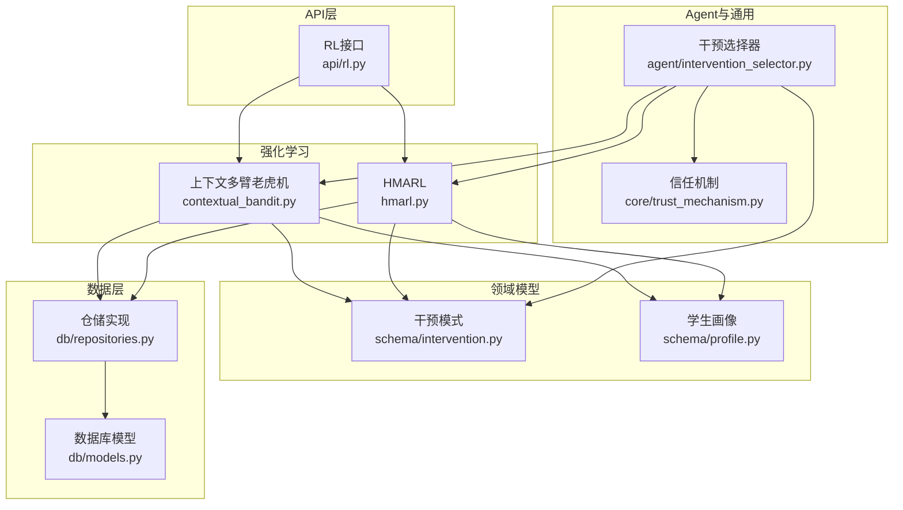
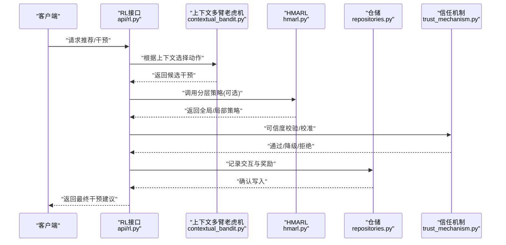
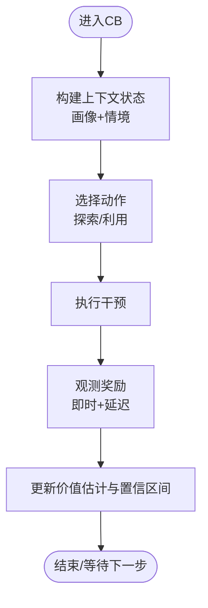
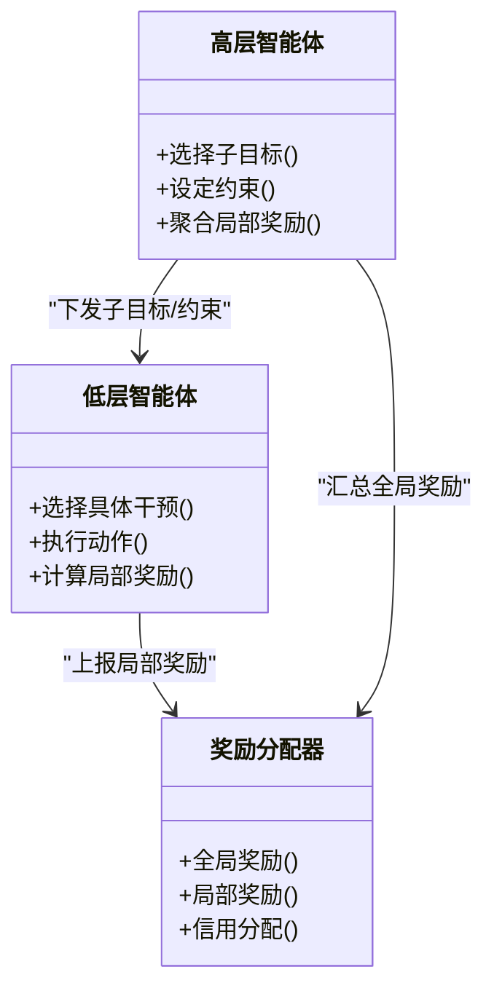
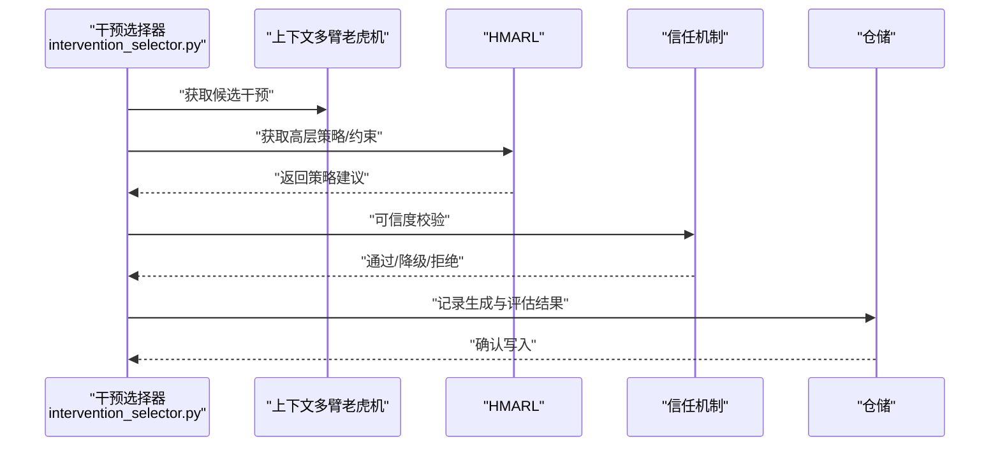
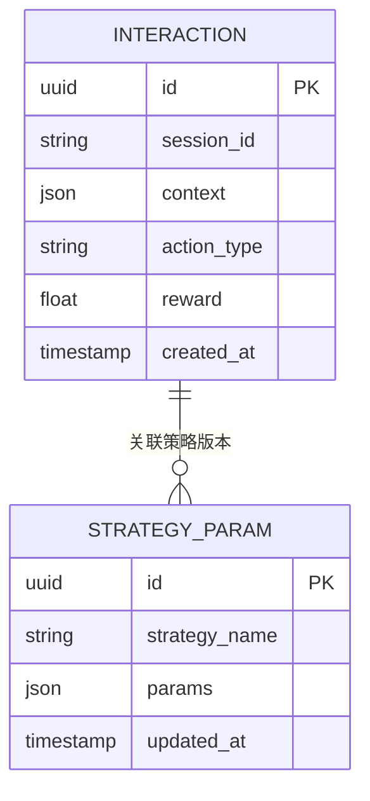
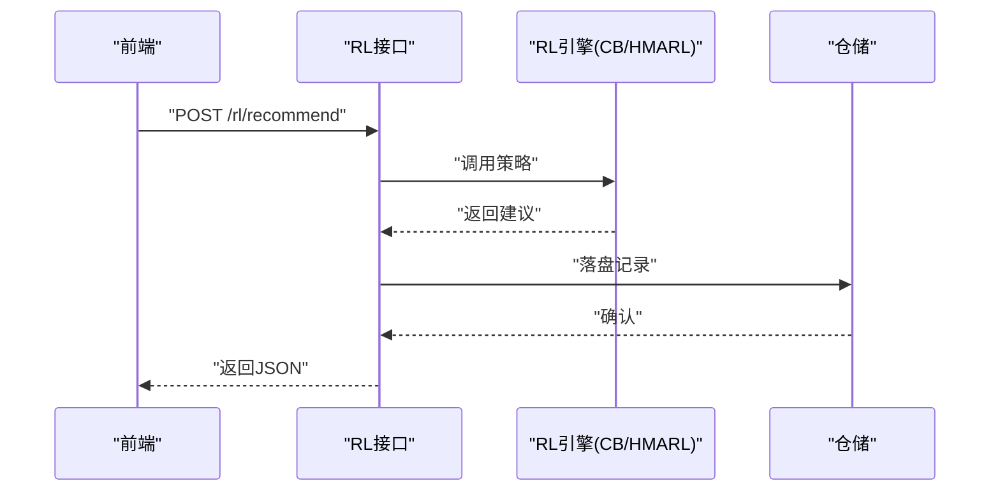
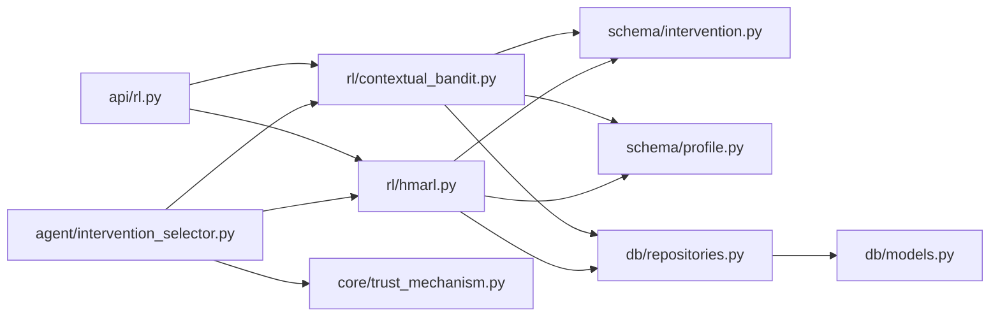

# 强化学习系统

<cite>
**本文引用的文件**   
- [src/loopse/rl/contextual_bandit.py](file://src/loopse/rl/contextual_bandit.py)
- [src/loopse/rl/hmarl.py](file://src/loopse/rl/hmarl.py)
- [src/loopse/api/rl.py](file://src/loopse/api/rl.py)
- [src/loopse/schema/intervention.py](file://src/loopse/schema/intervention.py)
- [src/loopse/schema/profile.py](file://src/loopse/schema/profile.py)
- [src/loopse/db/models.py](file://src/loopse/db/models.py)
- [src/loopse/db/repositories.py](file://src/loopse/db/repositories.py)
- [src/loopse/agent/intervention_selector.py](file://src/loopse/agent/intervention_selector.py)
- [src/loopse/core/trust_mechanism.py](file://src/loopse/core/trust_mechanism.py)
</cite>

## 目录
1. [简介](#简介)
2. [项目结构](#项目结构)
3. [核心组件](#核心组件)
4. [架构总览](#架构总览)
5. [详细组件分析](#详细组件分析)
6. [依赖关系分析](#依赖关系分析)
7. [性能与收敛性](#性能与收敛性)
8. [故障排查指南](#故障排查指南)
9. [结论](#结论)
10. [附录](#附录)

## 简介
本技术文档围绕仓库中的强化学习子系统，系统化阐述上下文多臂老虎机（Contextual Bandit）在个性化推荐中的应用，以及分层多智能体强化学习（HMARL）的实现方案。内容覆盖：
- 状态空间定义、动作选择策略与奖励函数设计
- HMARL的层级结构与全局-局部奖励分配机制
- 干预策略生成器：类型定义、效果评估与学习更新
- 训练数据收集、离线训练与在线学习流程
- 超参数调优、收敛性分析与性能评估指标
- 扩展新干预策略与自定义奖励函数的方法
- 实验设计与A/B测试框架及效果验证方法

## 项目结构
强化学习相关代码主要位于以下模块：
- rl：算法实现（上下文多臂老虎机、HMARL）
- api：对外暴露的RL服务接口
- schema：领域模型（干预、学生画像等）
- db：持久化模型与仓储
- agent：策略选择与编排（如干预选择器）
- core：信任机制等通用能力

图表来源
- [src/loopse/rl/contextual_bandit.py](file://src/loopse/rl/contextual_bandit.py)
- [src/loopse/rl/hmarl.py](file://src/loopse/rl/hmarl.py)
- [src/loopse/api/rl.py](file://src/loopse/api/rl.py)
- [src/loopse/schema/intervention.py](file://src/loopse/schema/intervention.py)
- [src/loopse/schema/profile.py](file://src/loopse/schema/profile.py)
- [src/loopse/db/models.py](file://src/loopse/db/models.py)
- [src/loopse/db/repositories.py](file://src/loopse/db/repositories.py)
- [src/loopse/agent/intervention_selector.py](file://src/loopse/agent/intervention_selector.py)
- [src/loopse/core/trust_mechanism.py](file://src/loopse/core/trust_mechanism.py)

章节来源
- [src/loopse/rl/contextual_bandit.py](file://src/loopse/rl/contextual_bandit.py)
- [src/loopse/rl/hmarl.py](file://src/loopse/rl/hmarl.py)
- [src/loopse/api/rl.py](file://src/loopse/api/rl.py)
- [src/loopse/schema/intervention.py](file://src/loopse/schema/intervention.py)
- [src/loopse/schema/profile.py](file://src/loopse/schema/profile.py)
- [src/loopse/db/models.py](file://src/loopse/db/models.py)
- [src/loopse/db/repositories.py](file://src/loopse/db/repositories.py)
- [src/loopse/agent/intervention_selector.py](file://src/loopse/agent/intervention_selector.py)
- [src/loopse/core/trust_mechanism.py](file://src/loopse/core/trust_mechanism.py)

## 核心组件
- 上下文多臂老虎机（CB）：面向“用户上下文→干预动作”的即时决策，提供探索-利用平衡与在线更新。
- HMARL：分层多智能体，上层负责全局策略（如路径/阶段），下层负责具体干预执行，支持全局-局部奖励分解与协作。
- 干预策略生成器：基于上下文与历史反馈生成候选干预序列，并进行效果评估与策略更新。
- 数据与存储：通过仓储将交互轨迹、奖励信号与策略参数持久化，支撑离线训练与在线回放。
- 信任机制：对策略输出进行可信度约束与校准，降低高风险干预的影响。

章节来源
- [src/loopse/rl/contextual_bandit.py](file://src/loopse/rl/contextual_bandit.py)
- [src/loopse/rl/hmarl.py](file://src/loopse/rl/hmarl.py)
- [src/loopse/agent/intervention_selector.py](file://src/loopse/agent/intervention_selector.py)
- [src/loopse/core/trust_mechanism.py](file://src/loopse/core/trust_mechanism.py)
- [src/loopse/db/repositories.py](file://src/loopse/db/repositories.py)

## 架构总览
整体采用“API → RL引擎 → 领域模型/仓储 → Agent/信任机制”的分层架构。API提供统一入口；RL引擎封装CB与HMARL；领域模型规范干预与画像；仓储负责持久化；Agent负责策略编排与执行；信任机制保障安全与稳健。

图表来源
- [src/loopse/api/rl.py](file://src/loopse/api/rl.py)
- [src/loopse/rl/contextual_bandit.py](file://src/loopse/rl/contextual_bandit.py)
- [src/loopse/rl/hmarl.py](file://src/loopse/rl/hmarl.py)
- [src/loopse/db/repositories.py](file://src/loopse/db/repositories.py)
- [src/loopse/core/trust_mechanism.py](file://src/loopse/core/trust_mechanism.py)

## 详细组件分析

### 上下文多臂老虎机（Contextual Bandit）
- 状态空间：由学生画像与当前情境特征构成，包含知识掌握度、偏好、时间窗口、难度梯度等维度。
- 动作空间：可执行的干预集合（如推送练习、讲解视频、错题回顾、提示线索等）。
- 奖励函数：短期即时奖励（正确率提升、停留时长、完成率）与长期累积奖励（阶段性测评成绩、迁移应用表现）的组合。
- 策略：基于上下文的ε-greedy或UCB类探索-利用策略，支持按用户分层的策略参数。
- 在线更新：每步交互后增量更新各动作的价值估计与置信区间。

图表来源
- [src/loopse/rl/contextual_bandit.py](file://src/loopse/rl/contextual_bandit.py)
- [src/loopse/schema/profile.py](file://src/loopse/schema/profile.py)
- [src/loopse/schema/intervention.py](file://src/loopse/schema/intervention.py)

章节来源
- [src/loopse/rl/contextual_bandit.py](file://src/loopse/rl/contextual_bandit.py)
- [src/loopse/schema/profile.py](file://src/loopse/schema/profile.py)
- [src/loopse/schema/intervention.py](file://src/loopse/schema/intervention.py)

### HMARL（分层多智能体强化学习）
- 层级结构：
  - 高层智能体：负责宏观规划（学习路径、阶段目标、资源组合策略）。
  - 低层智能体：负责微观执行（具体干预的选择与时序编排）。
- 协作机制：高层向低层下发子目标与约束，低层回报执行质量与局部奖励，形成闭环。
- 奖励分配：全局奖励（阶段目标达成、综合测评）与局部奖励（单步干预效果）加权融合，支持信用分配与延迟奖励折现。
- 训练方式：支持离线回放（经验池采样）与在线微调（实时环境反馈）。

图表来源
- [src/loopse/rl/hmarl.py](file://src/loopse/rl/hmarl.py)

章节来源
- [src/loopse/rl/hmarl.py](file://src/loopse/rl/hmarl.py)

### 干预策略生成器
- 干预类型：依据业务语义定义（练习、讲解、提示、复习、测验等），每种类型具备可配置参数与适用条件。
- 生成流程：结合上下文与历史反馈，从候选库中筛选并排序，必要时进行组合与时序编排。
- 效果评估：以短期与长期指标衡量（正确率、耗时、留存、迁移表现），并与基线对比。
- 学习更新：根据评估结果调整生成权重与策略参数，支持在线增量与离线批量更新。

图表来源
- [src/loopse/agent/intervention_selector.py](file://src/loopse/agent/intervention_selector.py)
- [src/loopse/rl/contextual_bandit.py](file://src/loopse/rl/contextual_bandit.py)
- [src/loopse/rl/hmarl.py](file://src/loopse/rl/hmarl.py)
- [src/loopse/core/trust_mechanism.py](file://src/loopse/core/trust_mechanism.py)
- [src/loopse/db/repositories.py](file://src/loopse/db/repositories.py)

章节来源
- [src/loopse/agent/intervention_selector.py](file://src/loopse/agent/intervention_selector.py)
- [src/loopse/core/trust_mechanism.py](file://src/loopse/core/trust_mechanism.py)
- [src/loopse/db/repositories.py](file://src/loopse/db/repositories.py)

### 数据流与持久化
- 采集：每次交互记录上下文、动作、奖励与元信息（时间戳、会话ID、版本）。
- 存储：通过仓储写入数据库模型，支持查询与回放。
- 回放：离线训练时从仓储采样，构造批次用于策略更新。

图表来源
- [src/loopse/db/models.py](file://src/loopse/db/models.py)
- [src/loopse/db/repositories.py](file://src/loopse/db/repositories.py)

章节来源
- [src/loopse/db/models.py](file://src/loopse/db/models.py)
- [src/loopse/db/repositories.py](file://src/loopse/db/repositories.py)

### API集成与服务边界
- 提供统一的RL接口，接收上下文与任务描述，返回干预建议与置信度。
- 内部路由到CB/HMARL，并在返回前经信任机制校验。
- 支持批量与流式响应，便于前端渲染与动态更新。

图表来源
- [src/loopse/api/rl.py](file://src/loopse/api/rl.py)
- [src/loopse/rl/contextual_bandit.py](file://src/loopse/rl/contextual_bandit.py)
- [src/loopse/rl/hmarl.py](file://src/loopse/rl/hmarl.py)
- [src/loopse/db/repositories.py](file://src/loopse/db/repositories.py)

章节来源
- [src/loopse/api/rl.py](file://src/loopse/api/rl.py)

## 依赖关系分析
- 耦合关系：
  - API依赖RL引擎与仓储，RL引擎依赖领域模型与仓储。
  - 干预选择器依赖RL引擎与信任机制，形成“策略-校验-落地”的闭环。
- 外部依赖：
  - 数据库模型与仓储抽象，便于替换后端存储。
  - 信任机制作为横切关注点，贯穿所有策略输出。

图表来源
- [src/loopse/api/rl.py](file://src/loopse/api/rl.py)
- [src/loopse/rl/contextual_bandit.py](file://src/loopse/rl/contextual_bandit.py)
- [src/loopse/rl/hmarl.py](file://src/loopse/rl/hmarl.py)
- [src/loopse/schema/intervention.py](file://src/loopse/schema/intervention.py)
- [src/loopse/schema/profile.py](file://src/loopse/schema/profile.py)
- [src/loopse/db/models.py](file://src/loopse/db/models.py)
- [src/loopse/db/repositories.py](file://src/loopse/db/repositories.py)
- [src/loopse/agent/intervention_selector.py](file://src/loopse/agent/intervention_selector.py)
- [src/loopse/core/trust_mechanism.py](file://src/loopse/core/trust_mechanism.py)

章节来源
- [src/loopse/api/rl.py](file://src/loopse/api/rl.py)
- [src/loopse/rl/contextual_bandit.py](file://src/loopse/rl/contextual_bandit.py)
- [src/loopse/rl/hmarl.py](file://src/loopse/rl/hmarl.py)
- [src/loopse/schema/intervention.py](file://src/loopse/schema/intervention.py)
- [src/loopse/schema/profile.py](file://src/loopse/schema/profile.py)
- [src/loopse/db/models.py](file://src/loopse/db/models.py)
- [src/loopse/db/repositories.py](file://src/loopse/db/repositories.py)
- [src/loopse/agent/intervention_selector.py](file://src/loopse/agent/intervention_selector.py)
- [src/loopse/core/trust_mechanism.py](file://src/loopse/core/trust_mechanism.py)

## 性能与收敛性
- 探索-利用权衡：
  - 调节探索系数与置信上限参数，避免过早收敛于次优策略。
  - 针对冷启动用户采用更高探索强度，随样本量增加逐步降低。
- 奖励设计：
  - 引入延迟奖励折现因子，平衡短期收益与长期学习效果。
  - 使用归一化与平滑处理，减少噪声对价值估计的影响。
- 训练效率：
  - 离线训练采用批采样与并行回放，缩短迭代周期。
  - 在线学习采用增量更新与小步长，保证稳定性。
- 收敛性分析：
  - 监控策略损失与累积奖励曲线，观察是否趋于稳定。
  - 使用滑动平均与置信区间评估波动范围，防止过拟合。

[本节为通用指导，不直接分析具体文件]

## 故障排查指南
- 常见问题：
  - 奖励缺失或异常：检查数据采集链路、时间戳对齐与延迟奖励回填。
  - 策略震荡：降低学习率、增大正则项或提高探索系数。
  - 信任机制误拒：调整阈值与置信度计算，复核输入上下文完整性。
- 定位手段：
  - 查看仓储中的交互记录与策略版本，复现实验场景。
  - 打印关键中间变量（价值估计、置信区间、局部/全局奖励）。
  - 使用最小数据集回归问题，隔离外部依赖影响。

章节来源
- [src/loopse/db/repositories.py](file://src/loopse/db/repositories.py)
- [src/loopse/core/trust_mechanism.py](file://src/loopse/core/trust_mechanism.py)

## 结论
本强化学习系统以上下文多臂老虎机为基础，结合HMARL的分层协作机制，构建了可扩展、可评估、可部署的个性化推荐与干预体系。通过清晰的领域模型与仓储抽象，系统具备良好的工程化能力与实验可重复性。建议在后续迭代中持续完善奖励函数与评估指标，推进更多干预类型的接入与A/B验证。

[本节为总结性内容，不直接分析具体文件]

## 附录

### 超参数调优指南
- 探索系数：控制探索强度，冷启动阶段偏高，成熟期降低。
- 置信上限参数：影响不确定性度量，需与样本量匹配。
- 折扣因子：决定延迟奖励的重要性，通常设置在0.9~0.99之间。
- 学习率：在线更新步长，过小收敛慢，过大易震荡。
- 批大小与回放比例：离线训练时平衡稳定性与效率。

[本节为通用指导，不直接分析具体文件]

### 扩展新干预策略
- 在干预模式中新增类型与参数定义。
- 在CB/HMARL的动作空间中注册新动作。
- 为新模式设计专属奖励分量与评估指标。
- 在干预选择器中纳入新策略的生成与排序逻辑。
- 通过API暴露新策略的配置与切换开关。

章节来源
- [src/loopse/schema/intervention.py](file://src/loopse/schema/intervention.py)
- [src/loopse/rl/contextual_bandit.py](file://src/loopse/rl/contextual_bandit.py)
- [src/loopse/rl/hmarl.py](file://src/loopse/rl/hmarl.py)
- [src/loopse/agent/intervention_selector.py](file://src/loopse/agent/intervention_selector.py)
- [src/loopse/api/rl.py](file://src/loopse/api/rl.py)

### 自定义奖励函数
- 明确短期与长期指标，定义权重与归一化方式。
- 考虑延迟奖励回填与平滑处理。
- 在CB/HMARL中注入奖励计算钩子，支持按用户分层。
- 通过仓储记录奖励明细，便于回溯与分析。

章节来源
- [src/loopse/rl/contextual_bandit.py](file://src/loopse/rl/contextual_bandit.py)
- [src/loopse/rl/hmarl.py](file://src/loopse/rl/hmarl.py)
- [src/loopse/db/repositories.py](file://src/loopse/db/repositories.py)

### 实验设计与A/B测试框架
- 分组策略：随机分流，确保组间基线一致。
- 指标体系：短期（正确率、完成时长）、中期（阶段测评）、长期（迁移与应用）。
- 统计检验：显著性检验与效应量评估，避免假阳性。
- 回滚机制：当指标恶化时快速回退至上一稳定版本。

[本节为通用指导，不直接分析具体文件]

### 效果验证方法
- 离线评估：使用历史数据进行回放评估，比较不同策略的累积奖励与稳定性。
- 在线评估：小流量灰度发布，监测关键指标变化。
- 因果推断：在可行范围内采用工具变量或双重差分等方法，增强结论可靠性。

[本节为通用指导，不直接分析具体文件]