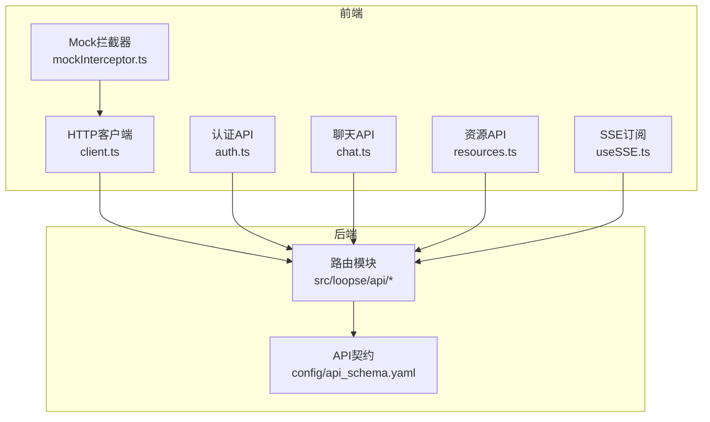
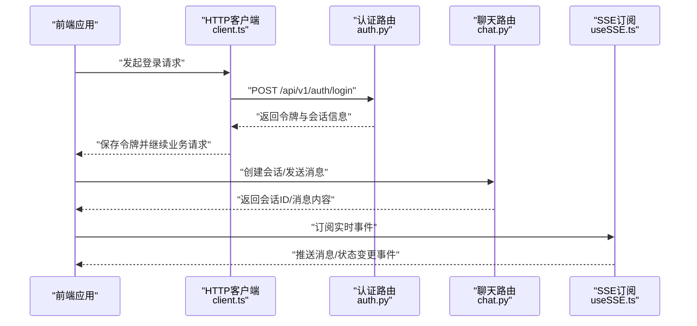
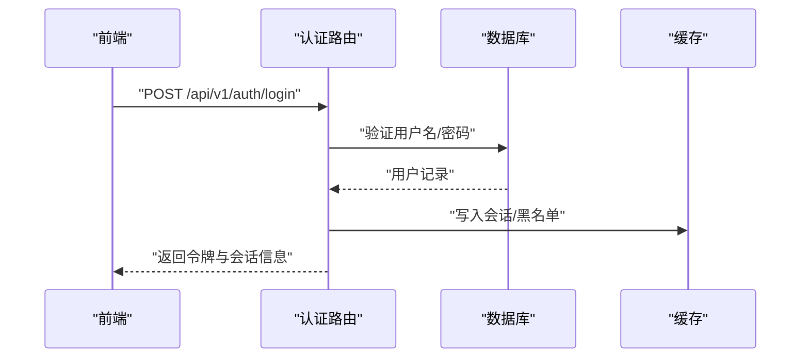
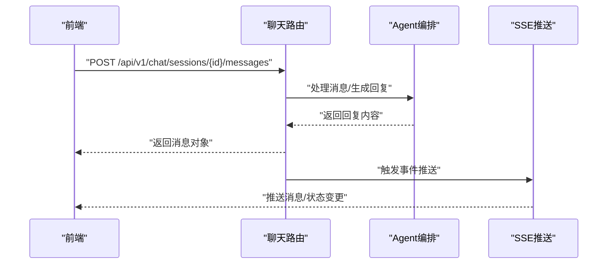
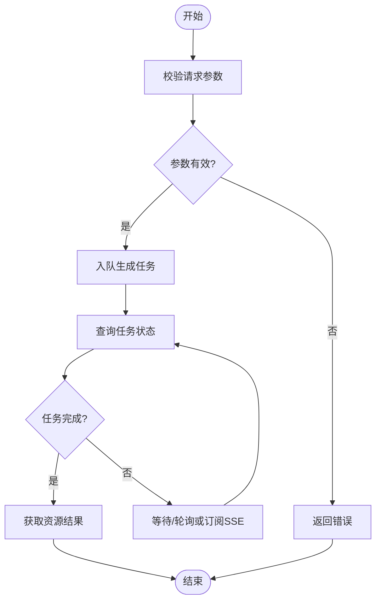
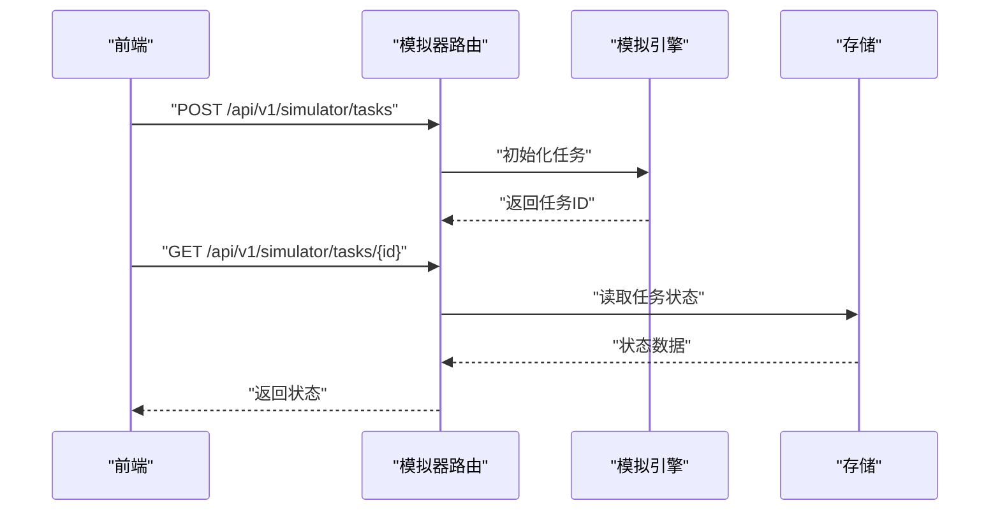
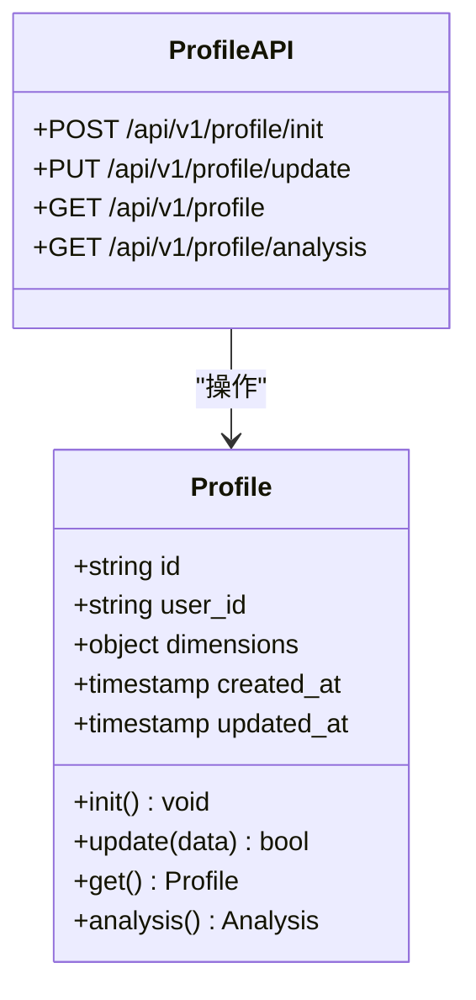
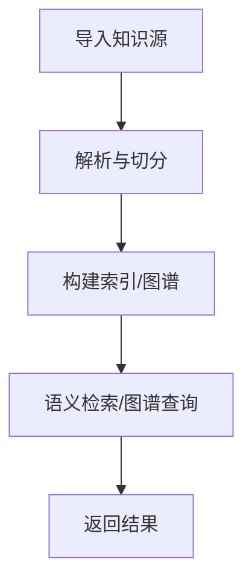
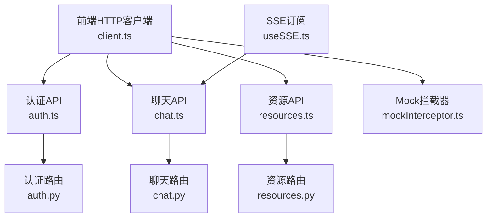

# API接口文档

<cite>
**本文引用的文件**   
- [src/loopse/api/auth.py](file://src/loopse/api/auth.py)
- [src/loopse/api/chat.py](file://src/loopse/api/chat.py)
- [src/loopse/api/resources.py](file://src/loopse/api/resources.py)
- [src/loopse/api/simulator.py](file://src/loopse/api/simulator.py)
- [src/loopse/api/profile.py](file://src/loopse/api/profile.py)
- [src/loopse/api/onboarding.py](file://src/loopse/api/onboarding.py)
- [src/loopse/api/knowledge_base.py](file://src/loopse/api/knowledge_base.py)
- [src/loopse/api/search.py](file://src/loopse/api/search.py)
- [src/loopse/api/books.py](file://src/loopse/api/books.py)
- [src/loopse/api/career.py](file://src/loopse/api/career.py)
- [src/loopse/api/exam.py](file://src/loopse/api/exam.py)
- [src/loopse/api/homework.py](file://src/loopse/api/homework.py)
- [src/loopse/api/lesson.py](file://src/loopse/api/lesson.py)
- [src/loopse/api/scenario.py](file://src/loopse/api/scenario.py)
- [src/loopse/api/virtual_teacher.py](file://src/loopse/api/virtual_teacher.py)
- [src/loopse/api/challenger.py](file://src/loopse/api/challenger.py)
- [src/loopse/api/health.py](file://src/loopse/api/health.py)
- [src/loopse/api/logs.py](file://src/loopse/api/logs.py)
- [src/loopse/api/export.py](file://src/loopse/api/export.py)
- [src/loopse/api/federated_privacy.py](file://src/loopse/api/federated_privacy.py)
- [src/loopse/api/generate_media.py](file://src/loopse/api/generate_media.py)
- [src/loopse/api/infographic.py](file://src/loopse/api/infographic.py)
- [src/loopse/api/persona.py](file://src/loopse/api/persona.py)
- [src/loopse/api/path.py](file://src/loopse/api/path.py)
- [src/loopse/api/automation.py](file://src/loopse/api/automation.py)
- [src/loopse/api/rl.py](file://src/loopse/api/rl.py)
- [config/api_schema.yaml](file://config/api_schema.yaml)
- [frontend/src/api/client.ts](file://frontend/src/api/client.ts)
- [frontend/src/api/auth.ts](file://frontend/src/api/auth.ts)
- [frontend/src/api/chat.ts](file://frontend/src/api/chat.ts)
- [frontend/src/api/resources.ts](file://frontend/src/api/resources.ts)
- [frontend/src/api/mockInterceptor.ts](file://frontend/src/api/mockInterceptor.ts)
- [frontend/src/composables/useSSE.ts](file://frontend/src/composables/useSSE.ts)
</cite>

## 目录
1. [简介](#简介)
2. [项目结构](#项目结构)
3. [核心组件](#核心组件)
4. [架构总览](#架构总览)
5. [详细组件分析](#详细组件分析)
6. [依赖分析](#依赖分析)
7. [性能考虑](#性能考虑)
8. [故障排查指南](#故障排查指南)
9. [结论](#结论)
10. [附录](#附录)

## 简介
本文件为 Socrates-Cube 项目的完整API接口参考文档，覆盖认证授权、聊天对话、资源管理、模拟器控制、用户画像等核心能力。文档包含：
- RESTful 端点规范（HTTP方法、URL模式、请求/响应格式、认证方式）
- WebSocket与SSE实时通信协议、消息格式与事件类型
- 参数说明、返回值定义与错误码列表
- 实际请求/响应示例与客户端集成片段路径
- API版本管理、限流策略与安全最佳实践

## 项目结构
后端采用模块化API设计，按功能域划分路由模块；前端通过统一HTTP客户端与拦截器访问后端，并提供Mock支持。关键入口与组织如下：
- 后端API模块：位于 src/loopse/api 下，每个文件对应一个功能域的路由集合
- 配置契约：config/api_schema.yaml 提供API契约描述
- 前端客户端：frontend/src/api 下的 client.ts 封装基础请求，auth.ts、chat.ts、resources.ts 等按域组织调用
- 实时通信：useSSE.ts 封装服务端推送事件订阅

**图表来源**
- [frontend/src/api/client.ts](file://frontend/src/api/client.ts)
- [frontend/src/api/auth.ts](file://frontend/src/api/auth.ts)
- [frontend/src/api/chat.ts](file://frontend/src/api/chat.ts)
- [frontend/src/api/resources.ts](file://frontend/src/api/resources.ts)
- [frontend/src/api/mockInterceptor.ts](file://frontend/src/api/mockInterceptor.ts)
- [frontend/src/composables/useSSE.ts](file://frontend/src/composables/useSSE.ts)
- [config/api_schema.yaml](file://config/api_schema.yaml)

**章节来源**
- [config/api_schema.yaml](file://config/api_schema.yaml)
- [frontend/src/api/client.ts](file://frontend/src/api/client.ts)
- [frontend/src/api/auth.ts](file://frontend/src/api/auth.ts)
- [frontend/src/api/chat.ts](file://frontend/src/api/chat.ts)
- [frontend/src/api/resources.ts](file://frontend/src/api/resources.ts)
- [frontend/src/api/mockInterceptor.ts](file://frontend/src/api/mockInterceptor.ts)
- [frontend/src/composables/useSSE.ts](file://frontend/src/composables/useSSE.ts)

## 核心组件
本节概述各核心API模块的职责与典型交互流程，后续章节将给出更详细的端点规范与示例。

- 认证授权：负责登录、注册、令牌签发与校验、会话管理
- 聊天对话：提供会话创建、消息发送/接收、历史查询、状态同步
- 资源管理：资源的生成、检索、更新、删除与权限控制
- 模拟器控制：模拟任务启动、参数配置、进度与结果获取
- 用户画像：画像初始化、更新、查询与分析维度聚合
- 知识图谱与搜索：知识库导入、图谱查询、语义检索
- 学习辅助：课程、作业、考试、场景、虚拟教师、挑战者等教学相关能力

**章节来源**
- [src/loopse/api/auth.py](file://src/loopse/api/auth.py)
- [src/loopse/api/chat.py](file://src/loopse/api/chat.py)
- [src/loopse/api/resources.py](file://src/loopse/api/resources.py)
- [src/loopse/api/simulator.py](file://src/loopse/api/simulator.py)
- [src/loopse/api/profile.py](file://src/loopse/api/profile.py)
- [src/loopse/api/knowledge_base.py](file://src/loopse/api/knowledge_base.py)
- [src/loopse/api/search.py](file://src/loopse/api/search.py)
- [src/loopse/api/books.py](file://src/loopse/api/books.py)
- [src/loopse/api/homework.py](file://src/loopse/api/homework.py)
- [src/loopse/api/exam.py](file://src/loopse/api/exam.py)
- [src/loopse/api/lesson.py](file://src/loopse/api/lesson.py)
- [src/loopse/api/scenario.py](file://src/loopse/api/scenario.py)
- [src/loopse/api/virtual_teacher.py](file://src/loopse/api/virtual_teacher.py)
- [src/loopse/api/challenger.py](file://src/loopse/api/challenger.py)

## 架构总览
下图展示从前端到后端的整体交互，包括REST调用与实时推送（SSE/WebSocket）。

**图表来源**
- [frontend/src/api/client.ts](file://frontend/src/api/client.ts)
- [src/loopse/api/auth.py](file://src/loopse/api/auth.py)
- [src/loopse/api/chat.py](file://src/loopse/api/chat.py)
- [frontend/src/composables/useSSE.ts](file://frontend/src/composables/useSSE.ts)

## 详细组件分析

### 认证与授权
- 主要职责：用户注册/登录、令牌签发与校验、权限范围检查、会话生命周期管理
- 典型端点：
  - POST /api/v1/auth/register：注册用户
  - POST /api/v1/auth/login：用户登录
  - GET /api/v1/auth/me：当前用户信息
  - POST /api/v1/auth/refresh：刷新令牌
  - POST /api/v1/auth/logout：登出
- 认证方式：基于令牌的鉴权（如JWT），需在请求头携带令牌
- 安全建议：
  - 使用HTTPS传输
  - 设置合理的令牌过期时间与刷新机制
  - 对敏感操作进行二次确认或额外校验

**图表来源**
- [src/loopse/api/auth.py](file://src/loopse/api/auth.py)

**章节来源**
- [src/loopse/api/auth.py](file://src/loopse/api/auth.py)
- [frontend/src/api/auth.ts](file://frontend/src/api/auth.ts)

### 聊天对话
- 主要职责：会话管理、消息收发、历史记录、状态同步、实时推送
- 典型端点：
  - POST /api/v1/chat/sessions：创建会话
  - GET /api/v1/chat/sessions/{id}：获取会话详情
  - POST /api/v1/chat/sessions/{id}/messages：发送消息
  - GET /api/v1/chat/sessions/{id}/history：获取历史消息
  - DELETE /api/v1/chat/sessions/{id}：删除会话
- 实时通信：
  - SSE：用于增量消息推送与状态变更
  - WebSocket：可选用于双向实时交互（若启用）
- 消息格式：
  - 文本消息、富媒体消息、结构化指令（如工具调用）
  - 事件类型：message_sent、message_received、typing、error

**图表来源**
- [src/loopse/api/chat.py](file://src/loopse/api/chat.py)
- [frontend/src/composables/useSSE.ts](file://frontend/src/composables/useSSE.ts)

**章节来源**
- [src/loopse/api/chat.py](file://src/loopse/api/chat.py)
- [frontend/src/api/chat.ts](file://frontend/src/api/chat.ts)
- [frontend/src/composables/useSSE.ts](file://frontend/src/composables/useSSE.ts)

### 资源管理
- 主要职责：教学资源（代码、文档、练习、思维导图、脚本等）的生成、检索、更新、删除与权限控制
- 典型端点：
  - POST /api/v1/resources/generate：生成资源
  - GET /api/v1/resources：列出资源
  - GET /api/v1/resources/{id}：获取资源详情
  - PUT /api/v1/resources/{id}：更新资源
  - DELETE /api/v1/resources/{id}：删除资源
- 生成类型：code、doc、exercise、mindmap、script、infographic
- 进度跟踪：
  - 异步任务状态查询
  - SSE/WebSocket推送生成进度

**图表来源**
- [src/loopse/api/resources.py](file://src/loopse/api/resources.py)

**章节来源**
- [src/loopse/api/resources.py](file://src/loopse/api/resources.py)
- [frontend/src/api/resources.ts](file://frontend/src/api/resources.ts)

### 模拟器控制
- 主要职责：模拟任务启动、参数配置、进度监控、结果获取与回放
- 典型端点：
  - POST /api/v1/simulator/tasks：创建模拟任务
  - GET /api/v1/simulator/tasks/{id}：获取任务状态
  - POST /api/v1/simulator/tasks/{id}/start：启动任务
  - POST /api/v1/simulator/tasks/{id}/stop：停止任务
  - GET /api/v1/simulator/tasks/{id}/results：获取结果
- 事件推送：
  - 任务状态变更、日志输出、进度百分比
- 错误处理：
  - 超时、资源不足、参数非法等异常分支

**图表来源**
- [src/loopse/api/simulator.py](file://src/loopse/api/simulator.py)

**章节来源**
- [src/loopse/api/simulator.py](file://src/loopse/api/simulator.py)

### 用户画像
- 主要职责：画像初始化、更新、查询与分析维度聚合
- 典型端点：
  - POST /api/v1/profile/init：初始化画像
  - PUT /api/v1/profile/update：更新画像
  - GET /api/v1/profile：获取画像
  - GET /api/v1/profile/analysis：画像分析摘要
- 维度字段：认知水平、兴趣偏好、学习风格、目标领域等
- 隐私保护：
  - 最小化采集原则
  - 可导出与删除个人数据

**图表来源**
- [src/loopse/api/profile.py](file://src/loopse/api/profile.py)

**章节来源**
- [src/loopse/api/profile.py](file://src/loopse/api/profile.py)

### 知识图谱与搜索
- 主要职责：知识库导入、图谱构建与查询、语义检索
- 典型端点：
  - POST /api/v1/knowledge/import：导入知识源
  - GET /api/v1/knowledge/graph：查询图谱关系
  - POST /api/v1/search/query：语义检索
- 数据模型：节点、边、标签、权重、元数据
- 性能优化：
  - 向量索引与缓存
  - 分页与过滤

**图表来源**
- [src/loopse/api/knowledge_base.py](file://src/loopse/api/knowledge_base.py)
- [src/loopse/api/search.py](file://src/loopse/api/search.py)

**章节来源**
- [src/loopse/api/knowledge_base.py](file://src/loopse/api/knowledge_base.py)
- [src/loopse/api/search.py](file://src/loopse/api/search.py)

### 学习辅助能力
- 书籍与课程：
  - GET /api/v1/books：列出书籍
  - GET /api/v1/books/{id}：获取书籍详情
  - GET /api/v1/lessons：列出课程
  - GET /api/v1/lessons/{id}：获取课程详情
- 作业与考试：
  - POST /api/v1/homework/submit：提交作业
  - GET /api/v1/exam/results：获取考试成绩
- 场景与虚拟教师：
  - POST /api/v1/scenarios/run：运行教学场景
  - GET /api/v1/virtual-teacher/advice：获取个性化建议
- 职业导航与挑战者：
  - GET /api/v1/career/path：获取职业路径
  - POST /api/v1/challenger/quiz：发起挑战测验

**章节来源**
- [src/loopse/api/books.py](file://src/loopse/api/books.py)
- [src/loopse/api/lesson.py](file://src/loopse/api/lesson.py)
- [src/loopse/api/homework.py](file://src/loopse/api/homework.py)
- [src/loopse/api/exam.py](file://src/loopse/api/exam.py)
- [src/loopse/api/scenario.py](file://src/loopse/api/scenario.py)
- [src/loopse/api/virtual_teacher.py](file://src/loopse/api/virtual_teacher.py)
- [src/loopse/api/career.py](file://src/loopse/api/career.py)
- [src/loopse/api/challenger.py](file://src/loopse/api/challenger.py)

### 系统与健康
- 健康检查：
  - GET /api/v1/health：服务健康状态
- 日志与审计：
  - GET /api/v1/logs：查询系统日志
- 导出与隐私：
  - GET /api/v1/export/data：导出个人数据
  - POST /api/v1/federated-privacy/opt-in：选择加入联邦隐私

**章节来源**
- [src/loopse/api/health.py](file://src/loopse/api/health.py)
- [src/loopse/api/logs.py](file://src/loopse/api/logs.py)
- [src/loopse/api/export.py](file://src/loopse/api/export.py)
- [src/loopse/api/federated_privacy.py](file://src/loopse/api/federated_privacy.py)

### 其他能力
- 媒体生成：图片、视频、信息图
- 角色与人格：角色设定、人格切换
- 路径规划：学习路径推荐
- 自动化与强化学习：自动化任务、RL策略调优

**章节来源**
- [src/loopse/api/generate_media.py](file://src/loopse/api/generate_media.py)
- [src/loopse/api/infographic.py](file://src/loopse/api/infographic.py)
- [src/loopse/api/persona.py](file://src/loopse/api/persona.py)
- [src/loopse/api/path.py](file://src/loopse/api/path.py)
- [src/loopse/api/automation.py](file://src/loopse/api/automation.py)
- [src/loopse/api/rl.py](file://src/loopse/api/rl.py)

## 依赖分析
前后端通过HTTP/SSE进行解耦交互，前端使用统一客户端与拦截器增强健壮性与可测试性。

**图表来源**
- [frontend/src/api/client.ts](file://frontend/src/api/client.ts)
- [frontend/src/api/auth.ts](file://frontend/src/api/auth.ts)
- [frontend/src/api/chat.ts](file://frontend/src/api/chat.ts)
- [frontend/src/api/resources.ts](file://frontend/src/api/resources.ts)
- [frontend/src/api/mockInterceptor.ts](file://frontend/src/api/mockInterceptor.ts)
- [frontend/src/composables/useSSE.ts](file://frontend/src/composables/useSSE.ts)
- [src/loopse/api/auth.py](file://src/loopse/api/auth.py)
- [src/loopse/api/chat.py](file://src/loopse/api/chat.py)
- [src/loopse/api/resources.py](file://src/loopse/api/resources.py)

**章节来源**
- [frontend/src/api/client.ts](file://frontend/src/api/client.ts)
- [frontend/src/api/mockInterceptor.ts](file://frontend/src/api/mockInterceptor.ts)
- [frontend/src/composables/useSSE.ts](file://frontend/src/composables/useSSE.ts)

## 性能考虑
- 缓存策略：热点数据（如图谱查询、资源列表）使用缓存层
- 分页与过滤：列表接口默认分页，支持按条件过滤
- 异步任务：资源生成、模拟任务采用异步队列，避免阻塞
- 连接复用：HTTP客户端保持连接池，减少握手开销
- 压缩传输：启用Gzip/Brotli压缩大体积响应

[本节为通用指导，不直接分析具体文件]

## 故障排查指南
- 常见问题：
  - 认证失败：检查令牌是否过期、请求头是否正确
  - 聊天无响应：确认SSE连接是否正常、网络是否稳定
  - 资源生成超时：查看任务队列与引擎状态
- 诊断步骤：
  - 使用健康检查端点验证服务可用性
  - 查询日志定位错误堆栈
  - 复现最小用例并逐步缩小范围

**章节来源**
- [src/loopse/api/health.py](file://src/loopse/api/health.py)
- [src/loopse/api/logs.py](file://src/loopse/api/logs.py)

## 结论
本文档系统化梳理了Socrates-Cube的API接口体系，涵盖认证、聊天、资源、模拟器、画像及学习辅助等核心能力，并提供架构图、流程图与客户端集成指引。建议在开发中遵循版本管理、限流与安全最佳实践，确保系统的稳定性与可扩展性。

[本节为总结性内容，不直接分析具体文件]

## 附录

### API版本管理
- 版本前缀：/api/v1
- 兼容性策略：向后兼容小版本更新，破坏性变更升级主版本
- 废弃通知：在响应头或文档中标注废弃端点

**章节来源**
- [config/api_schema.yaml](file://config/api_schema.yaml)

### 限流策略
- 全局限流：按IP或用户ID限制QPS
- 端点级限流：对高负载接口单独限流
- 降级策略：当超过阈值时返回友好提示或排队等待

[本节为通用指导，不直接分析具体文件]

### 安全最佳实践
- 传输安全：强制HTTPS
- 身份认证：基于令牌的鉴权，短有效期+刷新机制
- 输入校验：服务端严格校验所有输入
- 权限控制：RBAC或ABAC细粒度授权
- 审计日志：记录关键操作与异常

[本节为通用指导，不直接分析具体文件]

### 错误码列表
- 2xx：成功
- 4xx：客户端错误（参数无效、未授权等）
- 5xx：服务端错误（内部异常、资源不可用等）
- 自定义业务码：在响应体中附带code/msg/detail

[本节为通用指导，不直接分析具体文件]

### 客户端集成片段路径
- 认证调用示例：[frontend/src/api/auth.ts](file://frontend/src/api/auth.ts)
- 聊天调用示例：[frontend/src/api/chat.ts](file://frontend/src/api/chat.ts)
- 资源调用示例：[frontend/src/api/resources.ts](file://frontend/src/api/resources.ts)
- Mock拦截器配置：[frontend/src/api/mockInterceptor.ts](file://frontend/src/api/mockInterceptor.ts)
- SSE订阅封装：[frontend/src/composables/useSSE.ts](file://frontend/src/composables/useSSE.ts)

**章节来源**
- [frontend/src/api/auth.ts](file://frontend/src/api/auth.ts)
- [frontend/src/api/chat.ts](file://frontend/src/api/chat.ts)
- [frontend/src/api/resources.ts](file://frontend/src/api/resources.ts)
- [frontend/src/api/mockInterceptor.ts](file://frontend/src/api/mockInterceptor.ts)
- [frontend/src/composables/useSSE.ts](file://frontend/src/composables/useSSE.ts)