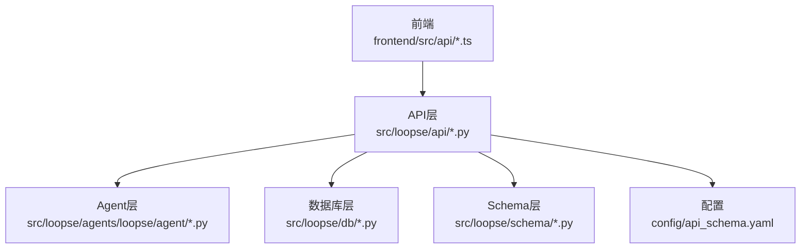
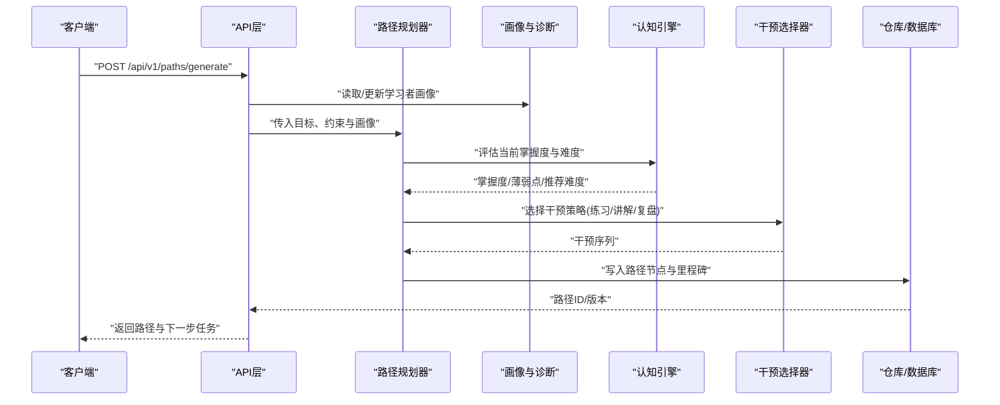
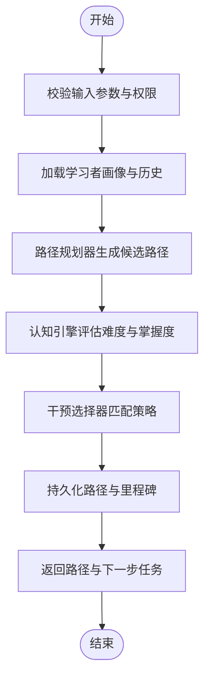
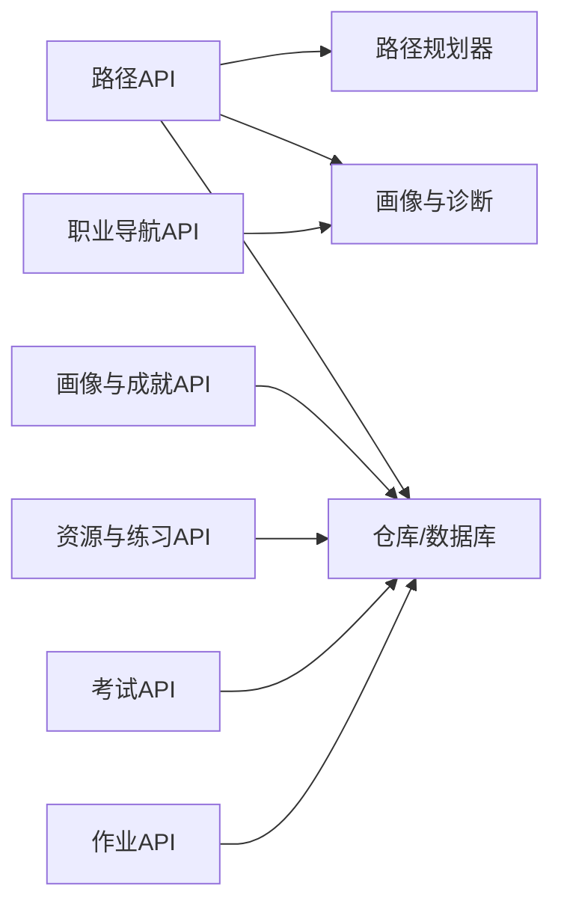

# 学习管理API

<cite>
**本文档引用的文件**   
- [src/loopse/api/path.py](file://src/loopse/api/path.py)
- [src/loopse/api/career.py](file://src/loopse/api/career.py)
- [src/loopse/api/profile.py](file://src/loopse/api/profile.py)
- [src/loopse/api/resources.py](file://src/loopse/api/resources.py)
- [src/loopse/api/exam.py](file://src/loopse/api/exam.py)
- [src/loopse/api/homework.py](file://src/loopse/api/homework.py)
- [src/loopse/db/models.py](file://src/loopse/db/models.py)
- [src/loopse/db/repositories.py](file://src/loopse/db/repositories.py)
- [src/loopse/agents/student/__init__.py](file://src/loopse/agents/student/__init__.py)
- [src/loopse/agents/loopse/agent/path_planner.py](file://src/loopse/agents/loopse/agent/path_planner.py)
- [src/loopse/agents/loopse/agent/profiler.py](file://src/loopse/agents/loopse/agent/profiler.py)
- [src/loopse/agents/loopse/agent/cognitive_engine.py](file://src/loopse/agents/loopse/agent/cognitive_engine.py)
- [src/loopse/agents/loopse/agent/intervention_selector.py](file://src/loopse/agents/loopse/agent/intervention_selector.py)
- [src/loopse/schema/profile.py](file://src/loopse/schema/profile.py)
- [config/api_schema.yaml](file://config/api_schema.yaml)
- [frontend/src/api/path.ts](file://frontend/src/api/path.ts)
- [frontend/src/types/path.ts](file://frontend/src/types/path.ts)
</cite>

## 目录
1. [简介](#简介)
2. [项目结构](#项目结构)
3. [核心组件](#核心组件)
4. [架构总览](#架构总览)
5. [详细组件分析](#详细组件分析)
6. [依赖分析](#依赖分析)
7. [性能考虑](#性能考虑)
8. [故障排查指南](#故障排查指南)
9. [结论](#结论)
10. [附录](#附录)

## 简介
本文件为“学习管理API”的权威技术文档，覆盖学习路径规划、进度跟踪、成就系统、职业导航等能力。文档面向开发者与产品人员，提供：
- HTTP方法、URL模式与数据格式规范
- 个性化学习算法、难度评估模型与推荐策略说明
- 学习状态同步、里程碑记录与技能树管理
- 完整的路径生成、进度更新与统计分析接口清单
- 实际学习场景示例、数据模型定义与业务规则

## 项目结构
后端采用分层设计：API层暴露HTTP接口，Agent层实现个性化学习与干预策略，DB层负责持久化与查询，Schema层定义数据结构，前端通过TS API调用后端。

图表来源
- [src/loopse/api/path.py](file://src/loopse/api/path.py)
- [src/loopse/api/career.py](file://src/loopse/api/career.py)
- [src/loopse/api/profile.py](file://src/loopse/api/profile.py)
- [src/loopse/api/resources.py](file://src/loopse/api/resources.py)
- [src/loopse/api/exam.py](file://src/loopse/api/exam.py)
- [src/loopse/api/homework.py](file://src/loopse/api/homework.py)
- [src/loopse/db/models.py](file://src/loopse/db/models.py)
- [src/loopse/db/repositories.py](file://src/loopse/db/repositories.py)
- [src/loopse/agents/loopse/agent/path_planner.py](file://src/loopse/agents/loopse/agent/path_planner.py)
- [src/loopse/agents/loopse/agent/profiler.py](file://src/loopse/agents/loopse/agent/profiler.py)
- [src/loopse/agents/loopse/agent/cognitive_engine.py](file://src/loopse/agents/loopse/agent/cognitive_engine.py)
- [src/loopse/agents/loopse/agent/intervention_selector.py](file://src/loopse/agents/loopse/agent/intervention_selector.py)
- [src/loopse/schema/profile.py](file://src/loopse/schema/profile.py)
- [config/api_schema.yaml](file://config/api_schema.yaml)
- [frontend/src/api/path.ts](file://frontend/src/api/path.ts)
- [frontend/src/types/path.ts](file://frontend/src/types/path.ts)

章节来源
- [src/loopse/api/path.py](file://src/loopse/api/path.py)
- [src/loopse/api/career.py](file://src/loopse/api/career.py)
- [src/loopse/api/profile.py](file://src/loopse/api/profile.py)
- [src/loopse/api/resources.py](file://src/loopse/api/resources.py)
- [src/loopse/api/exam.py](file://src/loopse/api/exam.py)
- [src/loopse/api/homework.py](file://src/loopse/api/homework.py)
- [src/loopse/db/models.py](file://src/loopse/db/models.py)
- [src/loopse/db/repositories.py](file://src/loopse/db/repositories.py)
- [src/loopse/agents/loopse/agent/path_planner.py](file://src/loopse/agents/loopse/agent/path_planner.py)
- [src/loopse/agents/loopse/agent/profiler.py](file://src/loopse/agents/loopse/agent/profiler.py)
- [src/loopse/agents/loopse/agent/cognitive_engine.py](file://src/loopse/agents/loopse/agent/cognitive_engine.py)
- [src/loopse/agents/loopse/agent/intervention_selector.py](file://src/loopse/agents/loopse/agent/intervention_selector.py)
- [src/loopse/schema/profile.py](file://src/loopse/schema/profile.py)
- [config/api_schema.yaml](file://config/api_schema.yaml)
- [frontend/src/api/path.ts](file://frontend/src/api/path.ts)
- [frontend/src/types/path.ts](file://frontend/src/types/path.ts)

## 核心组件
- 路径规划API：提供学习路径生成、更新、回溯与版本对比
- 职业导航API：基于目标岗位/方向进行能力映射与路径建议
- 学习者画像与成就API：维护学习者画像、里程碑与成就
- 资源与练习API：根据路径动态生成或检索资源、练习与测评
- 考试与作业API：提交作答、评分与反馈，驱动进度与难度调整
- 统计与分析API：汇总学习行为、掌握度与瓶颈点

章节来源
- [src/loopse/api/path.py](file://src/loopse/api/path.py)
- [src/loopse/api/career.py](file://src/loopse/api/career.py)
- [src/loopse/api/profile.py](file://src/loopse/api/profile.py)
- [src/loopse/api/resources.py](file://src/loopse/api/resources.py)
- [src/loopse/api/exam.py](file://src/loopse/api/exam.py)
- [src/loopse/api/homework.py](file://src/loopse/api/homework.py)

## 架构总览
学习管理API以“请求-编排-执行-持久化-响应”为主线，结合Agent智能体完成个性化决策。

图表来源
- [src/loopse/api/path.py](file://src/loopse/api/path.py)
- [src/loopse/agents/loopse/agent/path_planner.py](file://src/loopse/agents/loopse/agent/path_planner.py)
- [src/loopse/agents/loopse/agent/profiler.py](file://src/loopse/agents/loopse/agent/profiler.py)
- [src/loopse/agents/loopse/agent/cognitive_engine.py](file://src/loopse/agents/loopse/agent/cognitive_engine.py)
- [src/loopse/agents/loopse/agent/intervention_selector.py](file://src/loopse/agents/loopse/agent/intervention_selector.py)
- [src/loopse/db/repositories.py](file://src/loopse/db/repositories.py)

## 详细组件分析

### 学习路径规划API
- 功能要点
  - 生成学习路径（支持多目标、先修关系、时间预算）
  - 增量更新路径（新增知识点、跳过已掌握内容）
  - 路径版本管理与回滚
  - 与资源/练习/测评联动
- 典型接口
  - POST /api/v1/paths/generate
  - GET /api/v1/paths/{path_id}
  - PUT /api/v1/paths/{path_id}/update
  - DELETE /api/v1/paths/{path_id}
  - POST /api/v1/paths/{path_id}/rollback
- 输入输出
  - 输入包含：学习目标、先修条件、时间预算、偏好风格、历史表现摘要
  - 输出包含：路径节点序列、每步资源/练习/测评、里程碑、预计时长、风险点
- 业务规则
  - 节点需满足先修依赖；同一阶段并行节点数受预算限制
  - 难度随掌握度自适应调整；失败重试次数上限
  - 路径版本变更保留审计日志

图表来源
- [src/loopse/api/path.py](file://src/loopse/api/path.py)
- [src/loopse/agents/loopse/agent/path_planner.py](file://src/loopse/agents/loopse/agent/path_planner.py)
- [src/loopse/agents/loopse/agent/cognitive_engine.py](file://src/loopse/agents/loopse/agent/cognitive_engine.py)
- [src/loopse/agents/loopse/agent/intervention_selector.py](file://src/loopse/agents/loopse/agent/intervention_selector.py)
- [src/loopse/db/repositories.py](file://src/loopse/db/repositories.py)

章节来源
- [src/loopse/api/path.py](file://src/loopse/api/path.py)
- [src/loopse/agents/loopse/agent/path_planner.py](file://src/loopse/agents/loopse/agent/path_planner.py)
- [src/loopse/agents/loopse/agent/cognitive_engine.py](file://src/loopse/agents/loopse/agent/cognitive_engine.py)
- [src/loopse/agents/loopse/agent/intervention_selector.py](file://src/loopse/agents/loopse/agent/intervention_selector.py)
- [src/loopse/db/repositories.py](file://src/loopse/db/repositories.py)

### 职业导航API
- 功能要点
  - 基于岗位/方向的能力图谱映射
  - 生成从现状到目标的差异化路径
  - 提供阶段性能力达标建议
- 典型接口
  - POST /api/v1/careers/map
  - GET /api/v1/careers/{career_id}/gap
  - POST /api/v1/careers/{career_id}/plan
- 输入输出
  - 输入：目标职业/方向、期望时长、可投入时间、已有证书/经历
  - 输出：能力差距矩阵、推荐路径、关键里程碑与资源包
- 业务规则
  - 能力项权重按行业趋势与平台数据动态校准
  - 对高风险缺口优先安排强化训练

章节来源
- [src/loopse/api/career.py](file://src/loopse/api/career.py)

### 学习者画像与成就API
- 功能要点
  - 维护学习者画像（知识维度、技能维度、学习风格、动机因子）
  - 里程碑记录与成就解锁
  - 画像更新触发路径再规划
- 典型接口
  - GET /api/v1/profiles/{user_id}
  - PUT /api/v1/profiles/{user_id}
  - POST /api/v1/profiles/{user_id}/milestones
  - GET /api/v1/profiles/{user_id}/achievements
- 输入输出
  - 输入：画像字段、里程碑事件、成就判定条件
  - 输出：画像快照、里程碑列表、成就等级与解锁时间线
- 业务规则
  - 成就遵循“不可逆+防刷”策略
  - 里程碑与路径节点强关联，确保一致性

章节来源
- [src/loopse/api/profile.py](file://src/loopse/api/profile.py)
- [src/loopse/schema/profile.py](file://src/loopse/schema/profile.py)

### 资源与练习API
- 功能要点
  - 根据路径节点动态生成或检索资源（文档、代码、视频、思维导图等）
  - 练习与测评的发放、提交与解析
- 典型接口
  - GET /api/v1/resources?node_id=...&type=...
  - POST /api/v1/resources/generate
  - POST /api/v1/exams/submit
  - POST /api/v1/homework/submit
- 输入输出
  - 输入：节点ID、资源类型、题目/作业内容
  - 输出：资源元数据与内容、评测结果与解析、错误归因
- 业务规则
  - 资源生成遵循质量阈值与版权合规
  - 评测结果用于画像与难度模型更新

章节来源
- [src/loopse/api/resources.py](file://src/loopse/api/resources.py)
- [src/loopse/api/exam.py](file://src/loopse/api/exam.py)
- [src/loopse/api/homework.py](file://src/loopse/api/homework.py)

### 统计与分析API
- 功能要点
  - 学习时长、完成率、正确率、停留时长、错题分布
  - 瓶颈识别与干预效果评估
- 典型接口
  - GET /api/v1/analytics/summary?user_id=...&range=...
  - GET /api/v1/analytics/bottlenecks?user_id=...
  - GET /api/v1/analytics/intervention_effect?intervention_id=...
- 输入输出
  - 输入：用户ID、时间范围、指标维度
  - 输出：聚合指标、趋势图数据、洞察与建议
- 业务规则
  - 隐私脱敏与最小可用原则
  - 指标口径统一，避免重复计算

章节来源
- [src/loopse/api/path.py](file://src/loopse/api/path.py)
- [src/loopse/api/profile.py](file://src/loopse/api/profile.py)
- [src/loopse/api/resources.py](file://src/loopse/api/resources.py)

### 个性化学习算法、难度评估与推荐策略
- 个性化学习算法
  - 画像驱动的自适应路径：依据掌握度、遗忘曲线与学习风格排序
  - 上下文多臂老虎机：在资源/练习间做在线探索与利用平衡
- 难度评估模型
  - 基于IRT/贝叶斯知识追踪的掌握度估计
  - 动态难度调节：根据连续正确率与反应时调整下一题难度
- 推荐策略
  - 协同过滤+知识图谱邻域：相似学习者成功路径迁移
  - 干预选择器：讲解、示例、变式练习、复盘四象限组合

章节来源
- [src/loopse/agents/loopse/agent/cognitive_engine.py](file://src/loopse/agents/loopse/agent/cognitive_engine.py)
- [src/loopse/agents/loopse/agent/intervention_selector.py](file://src/loopse/agents/loopse/agent/intervention_selector.py)
- [src/loopse/agents/loopse/agent/path_planner.py](file://src/loopse/agents/loopse/agent/path_planner.py)

### 学习状态同步、里程碑记录与技能树管理
- 学习状态同步
  - 幂等提交：使用操作ID去重，保证离线断网后恢复一致
  - 冲突解决：服务端权威时间戳与版本号合并
- 里程碑记录
  - 事件驱动：完成节点、通过测评、连续打卡等触发
  - 防抖与批量上报：减少网络抖动影响
- 技能树管理
  - 有向无环图表示先修关系
  - 可视化渲染与可达性检查

章节来源
- [src/loopse/db/models.py](file://src/loopse/db/models.py)
- [src/loopse/db/repositories.py](file://src/loopse/db/repositories.py)
- [src/loopse/api/profile.py](file://src/loopse/api/profile.py)

### 前端集成要点
- 前端API封装
  - 统一的请求拦截与重试策略
  - SSE/长轮询用于实时进度推送
- 类型定义
  - 路径、资源、画像等类型在前端TS中严格定义，保障前后端契约一致

章节来源
- [frontend/src/api/path.ts](file://frontend/src/api/path.ts)
- [frontend/src/types/path.ts](file://frontend/src/types/path.ts)

## 依赖分析
- 模块耦合
  - API层依赖Agent层进行决策，依赖DB层进行持久化
  - Schema层作为契约，贯穿前后端
- 外部依赖
  - LLM/向量库/知识图谱用于资源生成与检索
  - 时序存储用于指标聚合

图表来源
- [src/loopse/api/path.py](file://src/loopse/api/path.py)
- [src/loopse/api/career.py](file://src/loopse/api/career.py)
- [src/loopse/api/profile.py](file://src/loopse/api/profile.py)
- [src/loopse/api/resources.py](file://src/loopse/api/resources.py)
- [src/loopse/api/exam.py](file://src/loopse/api/exam.py)
- [src/loopse/api/homework.py](file://src/loopse/api/homework.py)
- [src/loopse/db/repositories.py](file://src/loopse/db/repositories.py)

章节来源
- [src/loopse/api/path.py](file://src/loopse/api/path.py)
- [src/loopse/api/career.py](file://src/loopse/api/career.py)
- [src/loopse/api/profile.py](file://src/loopse/api/profile.py)
- [src/loopse/api/resources.py](file://src/loopse/api/resources.py)
- [src/loopse/api/exam.py](file://src/loopse/api/exam.py)
- [src/loopse/api/homework.py](file://src/loopse/api/homework.py)
- [src/loopse/db/repositories.py](file://src/loopse/db/repositories.py)

## 性能考虑
- 缓存热点
  - 路径模板与资源元数据缓存，降低LLM与检索开销
- 异步处理
  - 资源生成、评测解析走消息队列，避免阻塞主流程
- 批量化
  - 里程碑与成就批量计算，减少事务次数
- 索引优化
  - 针对用户ID、节点ID、时间范围建立复合索引

[本节为通用指导，不直接分析具体文件]

## 故障排查指南
- 常见问题
  - 路径生成超时：检查LLM/向量库可用性、并发与缓存命中率
  - 进度不同步：核对幂等键、版本号与服务端时间戳
  - 成就未解锁：验证前置条件与防刷策略
- 定位手段
  - 查看API访问日志与Agent执行轨迹
  - 比对DB审计表与前端上报操作ID
  - 复现实验：固定种子与输入，回放Agent决策

章节来源
- [src/loopse/api/path.py](file://src/loopse/api/path.py)
- [src/loopse/api/profile.py](file://src/loopse/api/profile.py)
- [src/loopse/db/repositories.py](file://src/loopse/db/repositories.py)

## 结论
学习管理API围绕“路径-画像-资源-评测-统计”闭环构建，结合个性化算法与干预策略，实现自适应学习体验。通过清晰的接口契约、稳健的状态同步与完善的监控，支撑大规模个性化教学场景。

[本节为总结性内容，不直接分析具体文件]

## 附录

### 数据模型定义（节选）
- 学习者画像
  - 字段：知识维度得分、技能维度得分、学习风格、动机因子、最近活跃时间
- 路径节点
  - 字段：节点ID、类型（讲解/练习/测评）、先修集合、难度、预计时长、资源ID集合
- 里程碑与成就
  - 字段：事件类型、触发条件、奖励、时间戳、是否可逆
- 资源与评测
  - 字段：资源类型、内容URI、质量分、适用人群、评测答案与解析

章节来源
- [src/loopse/db/models.py](file://src/loopse/db/models.py)
- [src/loopse/schema/profile.py](file://src/loopse/schema/profile.py)

### 实际学习场景示例
- 场景一：从零到一入门
  - 输入：目标“Web前端开发”，时间预算“每周10小时”
  - 过程：生成基础路径→完成概念讲解→配套练习→阶段测评→里程碑解锁
  - 输出：路径版本V1，下一步任务“DOM操作实战”
- 场景二：进阶提升
  - 输入：已有React基础，目标“性能优化”
  - 过程：诊断薄弱点→插入专项资源→变式练习→复盘报告
  - 输出：路径版本V2，瓶颈点“渲染优化”

[本节为概念性示例，不直接分析具体文件]

### 业务规则说明
- 幂等与一致性
  - 所有写操作需携带幂等键；服务端维护最终一致视图
- 安全与隐私
  - 敏感字段加密存储；统计聚合默认匿名化
- 质量门槛
  - 资源生成需通过质量阈值；评测解析需人工抽检

章节来源
- [config/api_schema.yaml](file://config/api_schema.yaml)
- [src/loopse/db/models.py](file://src/loopse/db/models.py)