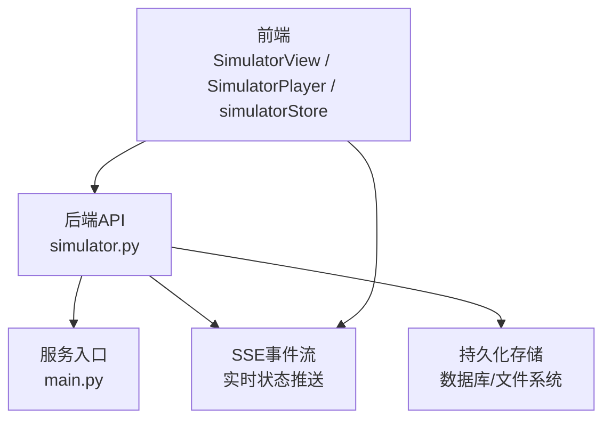
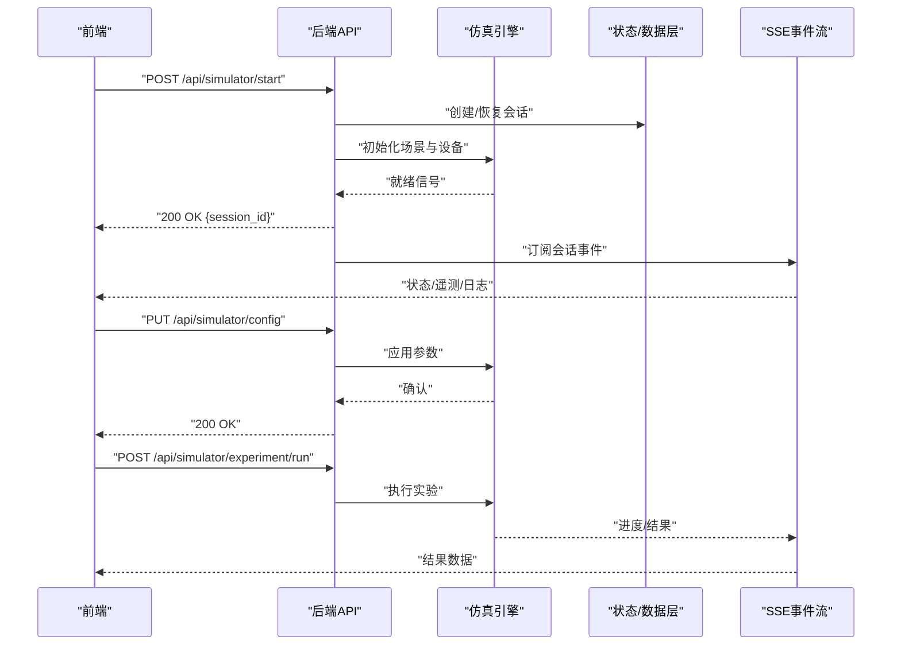
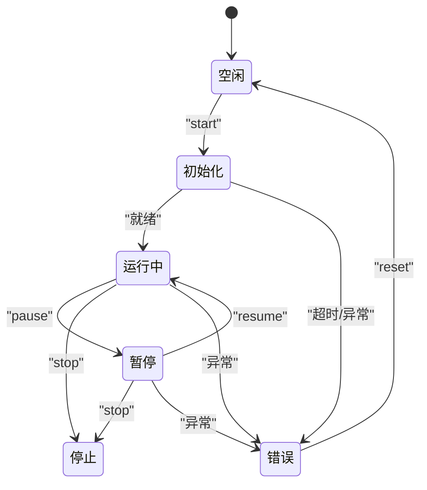
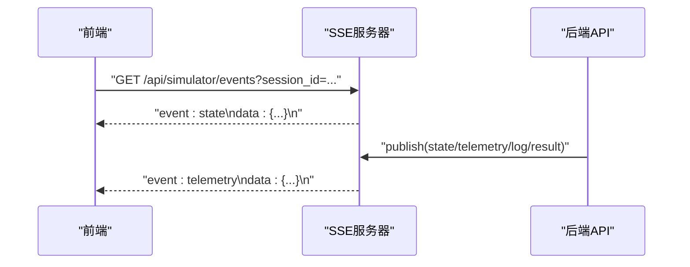
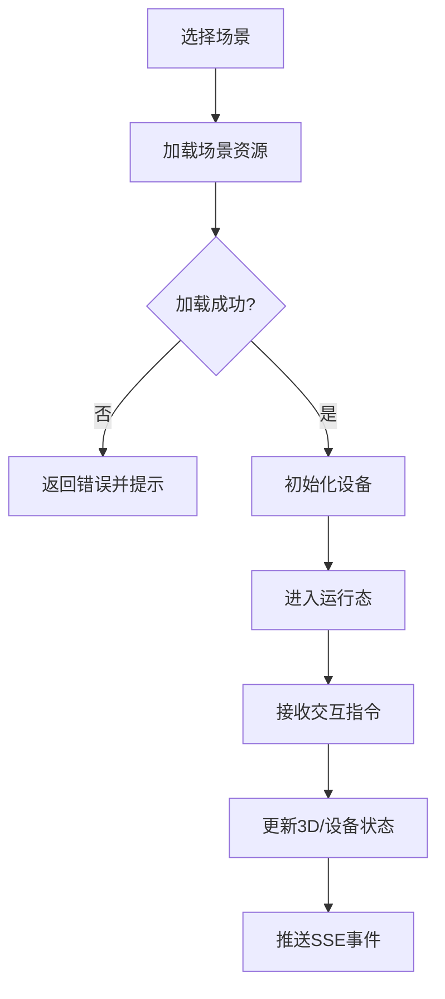
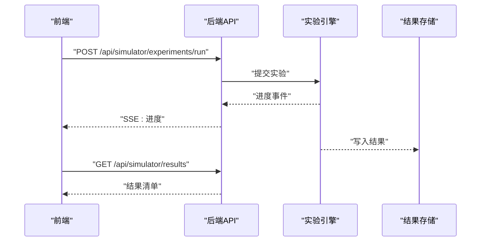
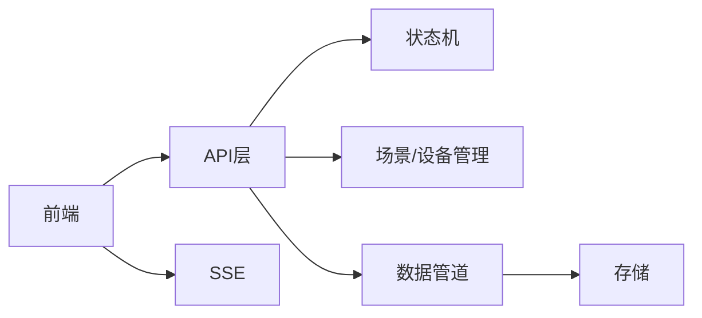

# 模拟器控制API

<cite>
**本文引用的文件**   
- [src/loopse/api/simulator.py](file://src/loopse/api/simulator.py)
- [src/loopse/main.py](file://src/loopse/main.py)
- [frontend/src/stores/simulatorStore.ts](file://frontend/src/stores/simulatorStore.ts)
- [frontend/src/components/SimulatorPlayer.vue](file://frontend/src/components/SimulatorPlayer.vue)
- [frontend/src/views/SimulatorView.vue](file://frontend/src/views/SimulatorView.vue)
- [config/api_schema.yaml](file://config/api_schema.yaml)
</cite>

## 目录
1. [简介](#简介)
2. [项目结构](#项目结构)
3. [核心组件](#核心组件)
4. [架构总览](#架构总览)
5. [详细组件分析](#详细组件分析)
6. [依赖分析](#依赖分析)
7. [性能考虑](#性能考虑)
8. [故障排查指南](#故障排查指南)
9. [结论](#结论)
10. [附录](#附录) 

## 简介
本文件面向“模拟器控制API”的完整文档，覆盖3D场景模拟、硬件设备仿真与实验环境控制的HTTP接口与实时通信协议。内容包含：
- 模拟器生命周期管理（启动/停止/重置）
- 参数配置与场景切换
- 交互控制与指令下发
- 状态查询与实时监控（SSE）
- 虚拟实验执行、数据采集、结果分析与可视化展示
- 前端集成要点与示例流程

## 项目结构
后端以FastAPI提供REST API与SSE事件流；前端通过Vue应用调用API并渲染3D/硬件仿真界面。关键路径如下：
- 后端API路由定义：src/loopse/api/simulator.py
- 服务入口与中间件挂载：src/loopse/main.py
- 前端状态管理与视图：frontend/src/stores/simulatorStore.ts、frontend/src/components/SimulatorPlayer.vue、frontend/src/views/SimulatorView.vue
- API契约参考：config/api_schema.yaml

图表来源
- [src/loopse/api/simulator.py](file://src/loopse/api/simulator.py)
- [src/loopse/main.py](file://src/loopse/main.py)
- [frontend/src/stores/simulatorStore.ts](file://frontend/src/stores/simulatorStore.ts)
- [frontend/src/components/SimulatorPlayer.vue](file://frontend/src/components/SimulatorPlayer.vue)
- [frontend/src/views/SimulatorView.vue](file://frontend/src/views/SimulatorView.vue)

章节来源
- [src/loopse/api/simulator.py](file://src/loopse/api/simulator.py)
- [src/loopse/main.py](file://src/loopse/main.py)
- [frontend/src/stores/simulatorStore.ts](file://frontend/src/stores/simulatorStore.ts)
- [frontend/src/components/SimulatorPlayer.vue](file://frontend/src/components/SimulatorPlayer.vue)
- [frontend/src/views/SimulatorView.vue](file://frontend/src/views/SimulatorView.vue)
- [config/api_schema.yaml](file://config/api_schema.yaml)

## 核心组件
- 模拟器控制器（后端）
  - 负责解析请求、校验参数、调度仿真引擎、维护会话状态、推送SSE事件。
- 模拟器状态机（后端）
  - 管理运行态（空闲/初始化/运行中/暂停/错误/停止），保证并发安全与幂等性。
- 场景与设备管理器（后端）
  - 加载3D场景、设备模型与参数模板，支持热切换与增量更新。
- 数据管道（后端）
  - 采集传感器/日志/指标，聚合为统一事件格式，经SSE或HTTP返回。
- 前端播放器与状态库
  - 封装API调用、连接SSE、驱动3D/硬件UI更新、回放与导出。

章节来源
- [src/loopse/api/simulator.py](file://src/loopse/api/simulator.py)
- [src/loopse/main.py](file://src/loopse/main.py)
- [frontend/src/stores/simulatorStore.ts](file://frontend/src/stores/simulatorStore.ts)
- [frontend/src/components/SimulatorPlayer.vue](file://frontend/src/components/SimulatorPlayer.vue)

## 架构总览
整体采用“REST + SSE”的双通道模式：
- REST用于命令式操作（启动/停止/参数设置/场景切换/实验执行）
- SSE用于响应式状态与数据推送（状态变更、遥测、日志、结果）

图表来源
- [src/loopse/api/simulator.py](file://src/loopse/api/simulator.py)
- [src/loopse/main.py](file://src/loopse/main.py)
- [frontend/src/stores/simulatorStore.ts](file://frontend/src/stores/simulatorStore.ts)

## 详细组件分析

### 模拟器控制器（后端）
职责
- 暴露REST端点：生命周期、参数、场景、交互、实验、数据、监控
- 校验与落盘参数，维护会话上下文
- 分发指令至仿真引擎与设备抽象层
- 生成并广播SSE事件

关键端点（按功能分组）
- 生命周期
  - POST /api/simulator/start
  - POST /api/simulator/stop
  - POST /api/simulator/reset
- 参数与配置
  - GET /api/simulator/config
  - PUT /api/simulator/config
  - GET /api/simulator/config/templates
- 场景与设备
  - GET /api/simulator/scenes
  - POST /api/simulator/scenes/load
  - GET /api/simulator/devices
  - POST /api/simulator/devices/configure
- 交互与控制
  - POST /api/simulator/actions
  - GET /api/simulator/state
- 实验与数据
  - POST /api/simulator/experiments/run
  - GET /api/simulator/data/stream
  - GET /api/simulator/results
- 监控与日志
  - GET /api/simulator/logs
  - GET /api/simulator/metrics

典型请求/响应字段说明（节选）
- 启动请求体
  - session_id: 可选，复用已有会话
  - scene_id: 场景标识
  - device_ids: 设备列表
  - config: 全局参数
- 状态对象
  - status: 枚举（idle/initializing/running/paused/error/stopped）
  - progress: 数值型进度
  - metrics: 指标快照
  - events: 最近事件摘要
- 实验执行
  - experiment_id: 唯一ID
  - steps: 步骤序列
  - outputs: 输出项集合
- 数据流
  - type: 事件类型（state/telemetry/log/result）
  - payload: 具体载荷
  - ts: 时间戳

章节来源
- [src/loopse/api/simulator.py](file://src/loopse/api/simulator.py)

### 服务入口与中间件
职责
- 注册路由、挂载CORS、异常处理、SSE连接池
- 启动/关闭仿真进程与资源清理

章节来源
- [src/loopse/main.py](file://src/loopse/main.py)

### 前端集成（状态与播放器）
职责
- 封装API调用与重试策略
- 建立SSE连接，维护本地状态树
- 驱动3D/硬件UI更新与回放

关键模块
- simulatorStore.ts：集中管理会话、状态、参数、事件订阅
- SimulatorPlayer.vue：播放控制、参数面板、交互按钮
- SimulatorView.vue：页面级布局与导航

章节来源
- [frontend/src/stores/simulatorStore.ts](file://frontend/src/stores/simulatorStore.ts)
- [frontend/src/components/SimulatorPlayer.vue](file://frontend/src/components/SimulatorPlayer.vue)
- [frontend/src/views/SimulatorView.vue](file://frontend/src/views/SimulatorView.vue)

### 状态机与并发控制
- 状态转换
  - idle → initializing → running → paused → running → stopped
  - 任意状态 → error（需reset恢复）
- 并发与幂等
  - 同一session_id串行化操作
  - start/stop/reset具备幂等保护
- 超时与回滚
  - 初始化/加载场景设置超时
  - 失败时回滚到上一稳定状态

图表来源
- [src/loopse/api/simulator.py](file://src/loopse/api/simulator.py)

### 实时通信协议（SSE）
- 连接方式
  - GET /api/simulator/events?session_id=...
- 事件类型
  - state：状态变更
  - telemetry：遥测数据（传感器/指标）
  - log：系统日志
  - result：实验结果片段
- 可靠性
  - 断线重连与last_event_id
  - 心跳保活

图表来源
- [src/loopse/api/simulator.py](file://src/loopse/api/simulator.py)
- [src/loopse/main.py](file://src/loopse/main.py)

### 3D场景与设备仿真
- 场景管理
  - 列出可用场景、加载指定场景、切换参数集
- 设备管理
  - 列举设备、批量配置、在线自检
- 交互控制
  - 动作指令（点击/拖拽/旋钮/开关）、坐标/角度/力值等参数

图表来源
- [src/loopse/api/simulator.py](file://src/loopse/api/simulator.py)

### 虚拟实验执行与数据分析
- 实验定义
  - 步骤序列、输入参数、预期输出
- 执行流程
  - 提交实验 → 分步执行 → 收集数据 → 生成报告
- 结果与分析
  - 结构化结果、可视化图表、导出CSV/JSON

图表来源
- [src/loopse/api/simulator.py](file://src/loopse/api/simulator.py)

## 依赖分析
- 模块耦合
  - API层依赖状态机、场景/设备管理器、数据管道
  - 前端依赖API与SSE客户端
- 外部依赖
  - 3D渲染SDK（前端）
  - 设备驱动/仿真器（后端）
  - 消息总线/事件队列（可选）

图表来源
- [src/loopse/api/simulator.py](file://src/loopse/api/simulator.py)
- [src/loopse/main.py](file://src/loopse/main.py)
- [frontend/src/stores/simulatorStore.ts](file://frontend/src/stores/simulatorStore.ts)

章节来源
- [src/loopse/api/simulator.py](file://src/loopse/api/simulator.py)
- [src/loopse/main.py](file://src/loopse/main.py)
- [frontend/src/stores/simulatorStore.ts](file://frontend/src/stores/simulatorStore.ts)

## 性能考虑
- 批处理与节流
  - 遥测数据合并上报，避免高频小包
- 缓存与会话复用
  - 场景与设备模板缓存，减少重复加载
- 异步与背压
  - SSE使用缓冲与丢弃策略，防止内存膨胀
- 资源隔离
  - 多会话隔离，限制CPU/内存配额

[本节为通用指导，不直接分析具体文件]

## 故障排查指南
常见问题与定位
- 启动失败
  - 检查场景/设备是否存在、参数是否合法
  - 查看初始化阶段SSE事件与日志
- 无状态推送
  - 确认SSE连接是否建立、last_event_id是否正确
  - 检查服务端事件发布链路
- 实验执行卡住
  - 检查步骤超时与重试策略
  - 核对输入数据与设备能力匹配
- 3D渲染异常
  - 检查资源路径与权限
  - 浏览器控制台报错与网络请求

章节来源
- [src/loopse/api/simulator.py](file://src/loopse/api/simulator.py)
- [src/loopse/main.py](file://src/loopse/main.py)
- [frontend/src/stores/simulatorStore.ts](file://frontend/src/stores/simulatorStore.ts)

## 结论
本API以REST+SSE为核心，提供完整的模拟器控制能力：从场景与设备管理、参数配置、交互控制，到实验执行与结果分析。通过明确的状态机与事件协议，确保前后端协作稳定可靠。建议在生产环境启用限流、缓存与监控告警，以提升稳定性与可观测性。

[本节为总结性内容，不直接分析具体文件]

## 附录

### 常用接口速查表
- 生命周期
  - POST /api/simulator/start
  - POST /api/simulator/stop
  - POST /api/simulator/reset
- 配置
  - GET /api/simulator/config
  - PUT /api/simulator/config
  - GET /api/simulator/config/templates
- 场景与设备
  - GET /api/simulator/scenes
  - POST /api/simulator/scenes/load
  - GET /api/simulator/devices
  - POST /api/simulator/devices/configure
- 交互与状态
  - POST /api/simulator/actions
  - GET /api/simulator/state
- 实验与数据
  - POST /api/simulator/experiments/run
  - GET /api/simulator/data/stream
  - GET /api/simulator/results
- 监控
  - GET /api/simulator/logs
  - GET /api/simulator/metrics
- 实时事件
  - GET /api/simulator/events?session_id=...

章节来源
- [src/loopse/api/simulator.py](file://src/loopse/api/simulator.py)
- [config/api_schema.yaml](file://config/api_schema.yaml)

### 实际模拟场景示例
- 示例一：3D装配仿真
  - 加载装配场景 → 配置零件与工具 → 下发装配动作 → 观察扭矩/位移曲线 → 导出报告
- 示例二：硬件设备调试
  - 连接设备 → 读取寄存器 → 调整阈值 → 触发测试 → 采集波形 → 保存结果
- 示例三：实验流水线
  - 选择实验模板 → 设置样本与参数 → 批量执行 → 汇总统计 → 可视化对比

[本节为概念性示例，不直接分析具体文件]