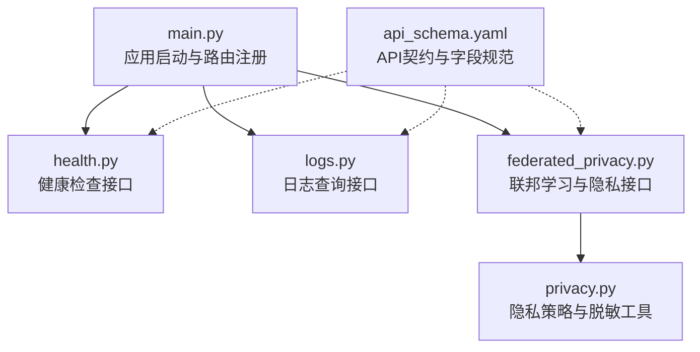
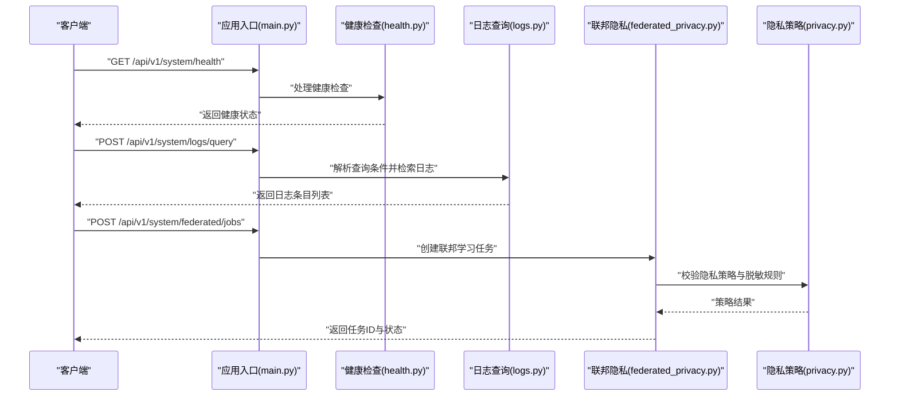
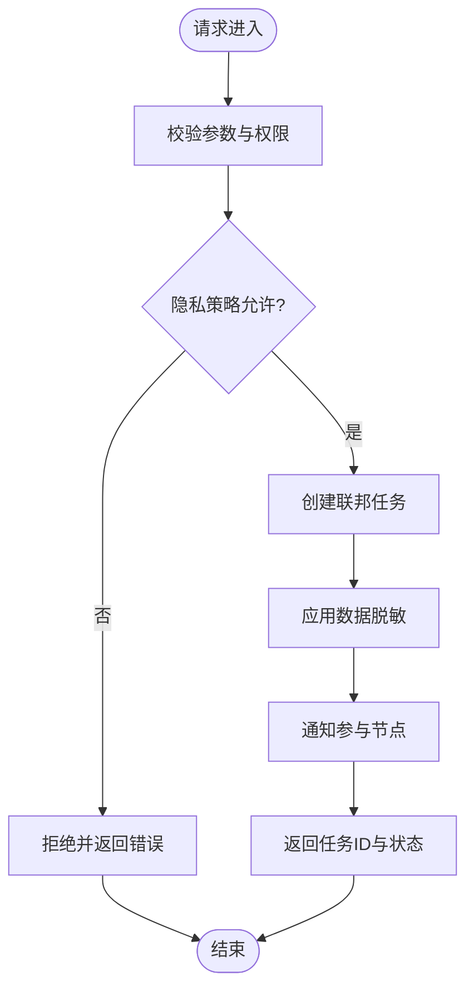
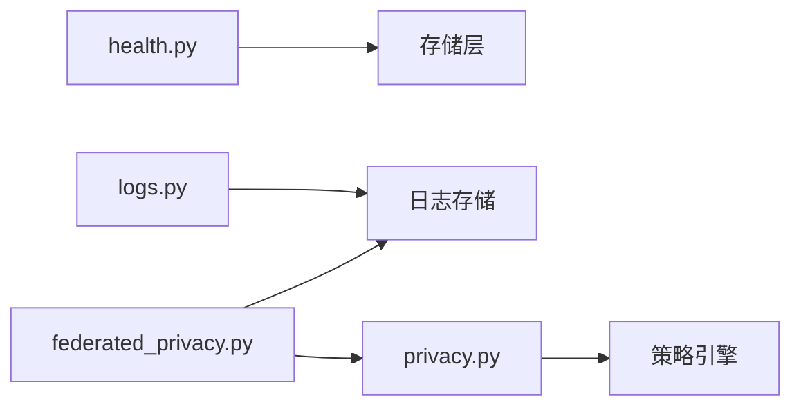

# 系统管理API

<cite>
**本文引用的文件**   
- [src/loopse/api/health.py](file://src/loopse/api/health.py)
- [src/loopse/api/logs.py](file://src/loopse/api/logs.py)
- [src/loopse/api/federated_privacy.py](file://src/loopse/api/federated_privacy.py)
- [src/loopse/security/privacy.py](file://src/loopse/security/privacy.py)
- [config/api_schema.yaml](file://config/api_schema.yaml)
- [src/loopse/main.py](file://src/loopse/main.py)
</cite>

## 目录
1. [简介](#简介)
2. [项目结构](#项目结构)
3. [核心组件](#核心组件)
4. [架构总览](#架构总览)
5. [详细组件分析](#详细组件分析)
6. [依赖分析](#依赖分析)
7. [性能考虑](#性能考虑)
8. [故障排查指南](#故障排查指南)
9. [结论](#结论)
10. [附录](#附录)

## 简介
本文件面向运维与平台工程师，系统化梳理 Socrates-Cube 后端“系统管理API”的能力边界、HTTP接口契约、数据模型与安全合规要点。覆盖范围包括：
- 系统健康检查与服务状态监控
- 日志查询与审计日志能力
- 隐私保护机制（含联邦学习相关接口）
- 配置管理与服务发现（概念性说明）
- 错误追踪与可观测性建议
- 安全与合规要求、运维示例与监控指标定义

## 项目结构
系统管理API主要位于后端Python模块的api层，并与安全与配置模块协同工作。下图展示与管理API相关的核心文件关系。

图表来源
- [src/loopse/main.py](file://src/loopse/main.py)
- [src/loopse/api/health.py](file://src/loopse/api/health.py)
- [src/loopse/api/logs.py](file://src/loopse/api/logs.py)
- [src/loopse/api/federated_privacy.py](file://src/loopse/api/federated_privacy.py)
- [src/loopse/security/privacy.py](file://src/loopse/security/privacy.py)
- [config/api_schema.yaml](file://config/api_schema.yaml)

章节来源
- [src/loopse/main.py](file://src/loopse/main.py)
- [config/api_schema.yaml](file://config/api_schema.yaml)

## 核心组件
- 健康检查与健康度汇总：提供进程存活、依赖可用性与整体就绪状态的查询能力，便于负载均衡与编排系统探测。
- 日志查询与审计：支持按时间窗口、级别、来源等维度检索运行日志；对关键操作提供审计记录能力。
- 隐私与联邦学习：提供联邦训练任务生命周期管理、参与节点信息、差分隐私参数与数据脱敏策略控制。
- 配置与服务发现（概念）：通过配置中心或环境变量注入系统行为；在集群环境下配合服务发现实现动态路由。

章节来源
- [src/loopse/api/health.py](file://src/loopse/api/health.py)
- [src/loopse/api/logs.py](file://src/loopse/api/logs.py)
- [src/loopse/api/federated_privacy.py](file://src/loopse/api/federated_privacy.py)
- [src/loopse/security/privacy.py](file://src/loopse/security/privacy.py)
- [config/api_schema.yaml](file://config/api_schema.yaml)

## 架构总览
系统管理API作为独立子域，遵循“薄控制器+领域逻辑”的分层设计。对外暴露REST风格接口，内部调用安全与隐私策略模块，统一由应用入口注册路由。

图表来源
- [src/loopse/main.py](file://src/loopse/main.py)
- [src/loopse/api/health.py](file://src/loopse/api/health.py)
- [src/loopse/api/logs.py](file://src/loopse/api/logs.py)
- [src/loopse/api/federated_privacy.py](file://src/loopse/api/federated_privacy.py)
- [src/loopse/security/privacy.py](file://src/loopse/security/privacy.py)

## 详细组件分析

### 健康检查接口
- 目标：为编排系统与网关提供快速存活与就绪探测，支撑滚动升级与弹性伸缩。
- 典型能力：
  - 进程级存活检测
  - 关键依赖可用性（如数据库、向量库、外部LLM）
  - 业务就绪标志（是否完成初始化、热加载完成）
- 输出字段（概念）：
  - 状态码：成功/失败
  - 健康等级：ok/warning/degraded/unhealthy
  - 依赖项清单：名称、类型、状态、延迟
  - 时间戳与版本信息
- 使用建议：
  - 探针间隔与超时需结合部署环境调优
  - 将“就绪”与“存活”分离，避免误判导致流量中断

章节来源
- [src/loopse/api/health.py](file://src/loopse/api/health.py)
- [config/api_schema.yaml](file://config/api_schema.yaml)

### 日志查询接口
- 目标：提供统一的日志检索入口，支持运行时诊断与审计追溯。
- 典型能力：
  - 按时间范围、日志级别、来源模块过滤
  - 关键字匹配与分页
  - 审计日志聚合（用户操作、权限变更、敏感访问）
- 输入参数（概念）：
  - 起始/结束时间
  - 级别（info/warn/error/debug）
  - 来源（模块/组件）
  - 关键词、页码、每页条数
- 输出字段（概念）：
  - 日志条目集合（时间、级别、来源、消息、上下文）
  - 总数、分页信息
- 注意事项：
  - 对包含敏感信息的日志进行脱敏
  - 大查询需限制最大时间窗口与分页上限

章节来源
- [src/loopse/api/logs.py](file://src/loopse/api/logs.py)
- [src/loopse/security/privacy.py](file://src/loopse/security/privacy.py)
- [config/api_schema.yaml](file://config/api_schema.yaml)

### 联邦学习与隐私保护接口
- 目标：在多方协作场景下，提供安全的联邦训练任务管理与隐私策略控制。
- 典型能力：
  - 任务生命周期：创建、暂停、恢复、终止、查询
  - 参与节点管理：加入、退出、健康检查
  - 隐私策略：差分隐私噪声强度、采样率、加密开关
  - 数据脱敏：字段级掩码、哈希化、泛化
- 输入参数（概念）：
  - 任务元数据（名称、描述、策略、数据集标识）
  - 节点列表与角色
  - 隐私参数（epsilon、delta、top_k等）
- 输出字段（概念）：
  - 任务ID、状态、进度、错误信息
  - 策略摘要与合规标记
- 流程图（任务创建）：

图表来源
- [src/loopse/api/federated_privacy.py](file://src/loopse/api/federated_privacy.py)
- [src/loopse/security/privacy.py](file://src/loopse/security/privacy.py)

章节来源
- [src/loopse/api/federated_privacy.py](file://src/loopse/api/federated_privacy.py)
- [src/loopse/security/privacy.py](file://src/loopse/security/privacy.py)
- [config/api_schema.yaml](file://config/api_schema.yaml)

### 配置管理与服务发现（概念）
- 配置管理：
  - 通过配置文件与环境变量注入系统行为（端口、日志级别、隐私参数）
  - 支持热更新与灰度发布时的差异化配置
- 服务发现：
  - 在容器化环境中，通过DNS或服务网格实现动态路由
  - 健康检查与熔断策略联动，提升鲁棒性

章节来源
- [config/api_schema.yaml](file://config/api_schema.yaml)

## 依赖分析
- 耦合关系：
  - 健康检查与日志查询相对独立，便于横向扩展
  - 联邦隐私接口强依赖隐私策略模块，确保策略一致性
- 外部依赖：
  - 存储（日志持久化、任务状态）
  - 外部LLM与向量库（用于生成与检索）
  - 认证与授权（鉴权中间件）
- 潜在风险：
  - 日志查询在高并发下的I/O压力
  - 联邦任务调度与网络抖动导致的重试风暴

图表来源
- [src/loopse/api/health.py](file://src/loopse/api/health.py)
- [src/loopse/api/logs.py](file://src/loopse/api/logs.py)
- [src/loopse/api/federated_privacy.py](file://src/loopse/api/federated_privacy.py)
- [src/loopse/security/privacy.py](file://src/loopse/security/privacy.py)

章节来源
- [src/loopse/api/health.py](file://src/loopse/api/health.py)
- [src/loopse/api/logs.py](file://src/loopse/api/logs.py)
- [src/loopse/api/federated_privacy.py](file://src/loopse/api/federated_privacy.py)
- [src/loopse/security/privacy.py](file://src/loopse/security/privacy.py)

## 性能考虑
- 健康检查：
  - 轻量级、无副作用，避免引入额外I/O
  - 依赖探测采用短超时与缓存策略
- 日志查询：
  - 索引优化（时间、级别、来源）
  - 分页与限流，防止全表扫描
- 联邦隐私：
  - 异步任务队列解耦
  - 差分隐私参数调优平衡精度与开销
  - 批量脱敏与向量化处理降低CPU占用

[本节为通用指导，不直接分析具体文件]

## 故障排查指南
- 健康检查异常：
  - 检查依赖服务连通性与证书有效性
  - 查看进程资源使用与GC停顿
- 日志查询缓慢：
  - 确认索引命中与查询条件合理性
  - 调整分页大小与时间窗口
- 联邦任务失败：
  - 核对隐私策略与节点权限
  - 检查网络分区与重试退避策略
- 审计日志缺失：
  - 确认审计开关与写入路径权限
  - 验证脱敏规则未过滤必要字段

章节来源
- [src/loopse/api/logs.py](file://src/loopse/api/logs.py)
- [src/loopse/api/federated_privacy.py](file://src/loopse/api/federated_privacy.py)
- [src/loopse/security/privacy.py](file://src/loopse/security/privacy.py)

## 结论
系统管理API以健康检查、日志查询与联邦隐私为核心，形成可观测、可治理、可合规的管理面。通过清晰的接口契约与策略驱动的安全机制，满足生产环境的稳定性与合规需求。建议在部署中完善指标采集、告警与演练，持续提升系统的韧性。

[本节为总结性内容，不直接分析具体文件]

## 附录

### 运维示例（概念）
- 健康检查探针：
  - 周期性GET健康端点，根据返回状态决定流量接入
- 日志轮转与归档：
  - 基于时间窗口导出日志，保留策略与脱敏后归档
- 联邦任务编排：
  - 创建任务→分配节点→监控进度→异常回滚→结果汇总

[本节为概念性说明，不直接分析具体文件]

### 监控指标定义（概念）
- 健康类：
  - 存活/就绪计数、依赖延迟分布、错误率
- 日志类：
  - 查询QPS、平均响应时延、P95/P99、分页命中率
- 联邦类：
  - 任务成功率、节点在线率、隐私参数影响度量（噪声方差）

[本节为概念性说明，不直接分析具体文件]

### 安全与合规要求（概念）
- 最小权限原则与RBAC
- 数据脱敏与匿名化
- 审计留痕与不可抵赖
- 传输加密与密钥轮换

[本节为概念性说明，不直接分析具体文件]