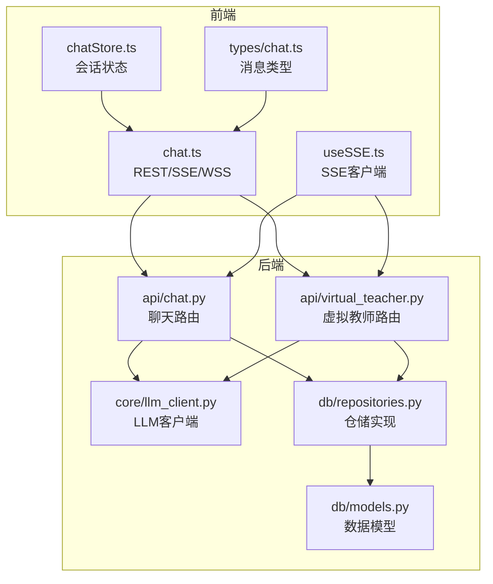
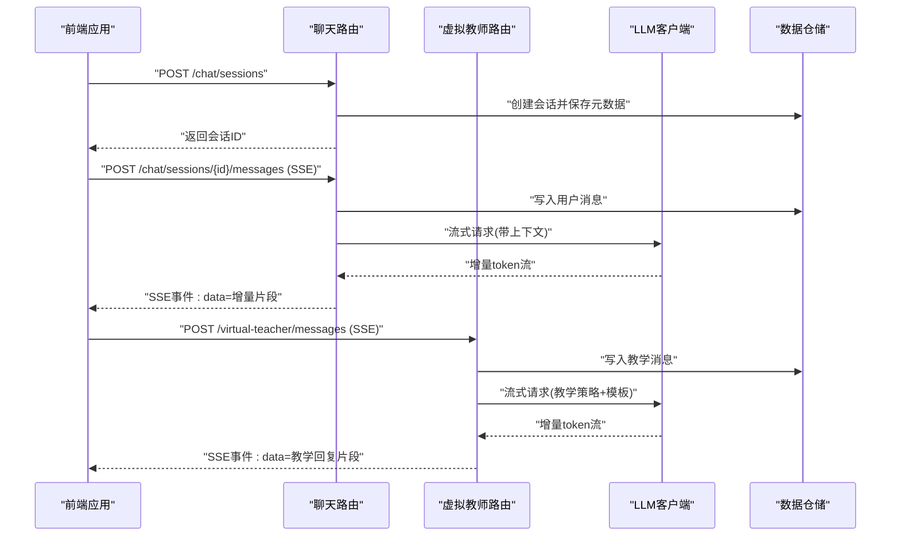
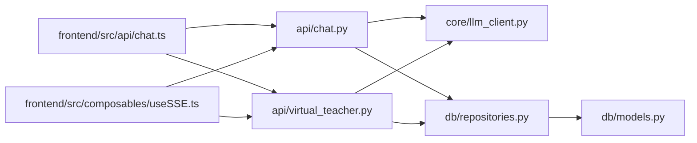

# 聊天对话API

<cite>
**本文引用的文件**   
- [src/loopse/api/chat.py](file://src/loopse/api/chat.py)
- [src/loopse/api/virtual_teacher.py](file://src/loopse/api/virtual_teacher.py)
- [src/loopse/core/llm_client.py](file://src/loopse/core/llm_client.py)
- [src/loopse/db/models.py](file://src/loopse/db/models.py)
- [src/loopse/db/repositories.py](file://src/loopse/db/repositories.py)
- [frontend/src/api/chat.ts](file://frontend/src/api/chat.ts)
- [frontend/src/composables/useSSE.ts](file://frontend/src/composables/useSSE.ts)
- [frontend/src/stores/chatStore.ts](file://frontend/src/stores/chatStore.ts)
- [frontend/src/types/chat.ts](file://frontend/src/types/chat.ts)
- [config/api_schema.yaml](file://config/api_schema.yaml)
</cite>

## 目录
1. [简介](#简介)
2. [项目结构](#项目结构)
3. [核心组件](#核心组件)
4. [架构总览](#架构总览)
5. [详细组件分析](#详细组件分析)
6. [依赖关系分析](#依赖关系分析)
7. [性能考虑](#性能考虑)
8. [故障排查指南](#故障排查指南)
9. [结论](#结论)
10. [附录](#附录)

## 简介
本文件面向开发者与集成方，系统化梳理聊天对话API的HTTP与WebSocket协议、SSE流式响应、消息格式、事件类型、对话历史管理、上下文保持与多轮状态维护，并提供智能体路由逻辑说明、连接示例、订阅模式与错误重连机制。文档同时覆盖通用AI助手对话与虚拟教师交互两类场景。

## 项目结构
后端采用FastAPI风格的路由组织，聊天相关接口集中在API层；LLM客户端封装在core层；持久化通过db层完成。前端提供REST调用、SSE消费、WebSocket连接与状态管理。

图表来源
- [src/loopse/api/chat.py](file://src/loopse/api/chat.py)
- [src/loopse/api/virtual_teacher.py](file://src/loopse/api/virtual_teacher.py)
- [src/loopse/core/llm_client.py](file://src/loopse/core/llm_client.py)
- [src/loopse/db/models.py](file://src/loopse/db/models.py)
- [src/loopse/db/repositories.py](file://src/loopse/db/repositories.py)
- [frontend/src/api/chat.ts](file://frontend/src/api/chat.ts)
- [frontend/src/composables/useSSE.ts](file://frontend/src/composables/useSSE.ts)
- [frontend/src/stores/chatStore.ts](file://frontend/src/stores/chatStore.ts)
- [frontend/src/types/chat.ts](file://frontend/src/types/chat.ts)

章节来源
- [src/loopse/api/chat.py](file://src/loopse/api/chat.py)
- [src/loopse/api/virtual_teacher.py](file://src/loopse/api/virtual_teacher.py)
- [src/loopse/core/llm_client.py](file://src/loopse/core/llm_client.py)
- [src/loopse/db/models.py](file://src/loopse/db/models.py)
- [src/loopse/db/repositories.py](file://src/loopse/db/repositories.py)
- [frontend/src/api/chat.ts](file://frontend/src/api/chat.ts)
- [frontend/src/composables/useSSE.ts](file://frontend/src/composables/useSSE.ts)
- [frontend/src/stores/chatStore.ts](file://frontend/src/stores/chatStore.ts)
- [frontend/src/types/chat.ts](file://frontend/src/types/chat.ts)

## 核心组件
- 聊天路由（HTTP + SSE + WebSocket）：提供创建会话、发送消息、获取历史、流式增量输出、实时双向通信等能力。
- 虚拟教师路由：面向教学场景的专用对话入口，支持教学策略、提示词模板与资源生成联动。
- LLM客户端：统一封装大模型调用、流式读取、重试与超时控制。
- 数据仓储：负责对话历史、上下文片段、会话元数据的持久化与查询。
- 前端SDK与状态：封装REST/SSE/WSS调用，维护会话上下文与UI渲染。

章节来源
- [src/loopse/api/chat.py](file://src/loopse/api/chat.py)
- [src/loopse/api/virtual_teacher.py](file://src/loopse/api/virtual_teacher.py)
- [src/loopse/core/llm_client.py](file://src/loopse/core/llm_client.py)
- [src/loopse/db/repositories.py](file://src/loopse/db/repositories.py)
- [frontend/src/api/chat.ts](file://frontend/src/api/chat.ts)
- [frontend/src/composables/useSSE.ts](file://frontend/src/composables/useSSE.ts)
- [frontend/src/stores/chatStore.ts](file://frontend/src/stores/chatStore.ts)

## 架构总览
整体采用“前端SDK -> HTTP/SSE/WebSocket -> 路由层 -> LLM客户端/仓储”的分层架构。SSE用于服务端到客户端的增量文本推送；WebSocket用于需要双向实时能力的场景（如协作、语音转写回传、教学互动）。

图表来源
- [src/loopse/api/chat.py](file://src/loopse/api/chat.py)
- [src/loopse/api/virtual_teacher.py](file://src/loopse/api/virtual_teacher.py)
- [src/loopse/core/llm_client.py](file://src/loopse/core/llm_client.py)
- [src/loopse/db/repositories.py](file://src/loopse/db/repositories.py)

## 详细组件分析

### 聊天路由（HTTP + SSE + WebSocket）
- 功能要点
  - 会话管理：创建、关闭、重置上下文。
  - 消息收发：用户消息入队，系统消息出队。
  - 流式响应：SSE推送增量文本片段，前端按片段拼接。
  - 实时通信：可选WebSocket通道，用于双向事件（如中断、进度、工具调用结果）。
  - 历史查询：分页或时间范围拉取。
- 关键端点（概念性描述）
  - POST /chat/sessions：创建新会话，返回会话标识。
  - POST /chat/sessions/{id}/messages：发送消息，返回SSE流。
  - GET /chat/sessions/{id}/history：获取历史消息列表。
  - WS /chat/ws/{id}：建立实时通道，订阅事件。
- 消息格式（概念性）
  - 请求体包含：角色、内容、附件/工具参数、上下文标记等。
  - SSE事件包含：事件类型、会话ID、增量文本、状态码、错误信息等。
- 错误处理
  - 网络异常、LLM超时、鉴权失败、会话不存在等均有明确事件或HTTP状态码。
- 前端对接
  - REST用于会话管理与历史拉取。
  - SSE用于增量文本渲染。
  - WebSocket用于高级实时能力。

章节来源
- [src/loopse/api/chat.py](file://src/loopse/api/chat.py)
- [frontend/src/api/chat.ts](file://frontend/src/api/chat.ts)
- [frontend/src/composables/useSSE.ts](file://frontend/src/composables/useSSE.ts)
- [frontend/src/stores/chatStore.ts](file://frontend/src/stores/chatStore.ts)

### 虚拟教师路由（教学场景）
- 功能要点
  - 教学策略注入：根据学生画像与课程阶段动态调整提示词。
  - 资源联动：可触发资源生成（代码、文档、练习、脚本等）。
  - 评估与反馈：结合诊断与路径规划，给出学习建议。
- 关键端点（概念性描述）
  - POST /virtual-teacher/messages：教学对话，SSE流式返回。
  - POST /virtual-teacher/resources/generate：按需生成教学资源。
- 消息格式（概念性）
  - 除基础消息字段外，包含教学意图、目标知识点、难度等级、是否启用资源生成等。
- 智能体路由逻辑（概念性）
  - 基于意图识别与规则引擎选择不同子代理（检索、生成、诊断、路径规划等），组合成最终回答。

章节来源
- [src/loopse/api/virtual_teacher.py](file://src/loopse/api/virtual_teacher.py)
- [config/api_schema.yaml](file://config/api_schema.yaml)

### LLM客户端（流式与重试）
- 功能要点
  - 统一封装不同模型的流式接口。
  - 自动重试、指数退避、超时控制。
  - 上下文组装：将历史摘要、检索结果、系统提示合并为一次请求。
- 错误与降级
  - 对上游不可用进行快速失败与降级策略（如返回缓存或默认回复）。

章节来源
- [src/loopse/core/llm_client.py](file://src/loopse/core/llm_client.py)

### 数据仓储（历史与上下文）
- 功能要点
  - 会话与消息持久化，支持分页与过滤。
  - 上下文片段存储，便于快速重建对话上下文。
  - 索引优化：按会话ID、时间戳、标签等维度查询。
- 一致性
  - 读写分离与事务边界清晰，避免并发写入冲突。

章节来源
- [src/loopse/db/models.py](file://src/loopse/db/models.py)
- [src/loopse/db/repositories.py](file://src/loopse/db/repositories.py)

### 前端SDK与状态管理
- 功能要点
  - REST封装：会话管理、历史拉取、资源生成。
  - SSE封装：自动重连、断线恢复、增量拼接。
  - WebSocket封装：事件订阅、心跳保活、错误上报。
  - 状态管理：会话上下文、消息队列、渲染节流。
- 类型定义
  - 统一的TS类型约束，确保前后端契约一致。

章节来源
- [frontend/src/api/chat.ts](file://frontend/src/api/chat.ts)
- [frontend/src/composables/useSSE.ts](file://frontend/src/composables/useSSE.ts)
- [frontend/src/stores/chatStore.ts](file://frontend/src/stores/chatStore.ts)
- [frontend/src/types/chat.ts](file://frontend/src/types/chat.ts)

## 依赖关系分析
- 模块耦合
  - 路由层依赖LLM客户端与仓储，职责单一且内聚度高。
  - 前端SDK仅依赖后端公开契约，解耦良好。
- 外部依赖
  - LLM服务、向量检索、知识图谱、资源生成器等通过抽象接口接入。
- 潜在环依赖
  - 当前分层清晰，未见循环导入风险。

图表来源
- [src/loopse/api/chat.py](file://src/loopse/api/chat.py)
- [src/loopse/api/virtual_teacher.py](file://src/loopse/api/virtual_teacher.py)
- [src/loopse/core/llm_client.py](file://src/loopse/core/llm_client.py)
- [src/loopse/db/repositories.py](file://src/loopse/db/repositories.py)
- [src/loopse/db/models.py](file://src/loopse/db/models.py)
- [frontend/src/api/chat.ts](file://frontend/src/api/chat.ts)
- [frontend/src/composables/useSSE.ts](file://frontend/src/composables/useSSE.ts)

章节来源
- [src/loopse/api/chat.py](file://src/loopse/api/chat.py)
- [src/loopse/api/virtual_teacher.py](file://src/loopse/api/virtual_teacher.py)
- [src/loopse/core/llm_client.py](file://src/loopse/core/llm_client.py)
- [src/loopse/db/repositories.py](file://src/loopse/db/repositories.py)
- [src/loopse/db/models.py](file://src/loopse/db/models.py)
- [frontend/src/api/chat.ts](file://frontend/src/api/chat.ts)
- [frontend/src/composables/useSSE.ts](file://frontend/src/composables/useSSE.ts)

## 性能考虑
- 流式传输
  - 使用SSE减少首字节延迟，提升用户体验。
  - 合理设置增量大小与合并阈值，避免频繁重绘。
- 上下文窗口
  - 采用滑动窗口与摘要压缩，控制请求长度与成本。
- 并发与限流
  - 对热点会话与高频请求实施令牌桶限流。
- 缓存与预取
  - 对常见问答与资源生成结果进行短期缓存。
- 连接复用
  - WebSocket长连接复用，降低握手开销。

[本节为通用指导，不直接分析具体文件]

## 故障排查指南
- 常见问题
  - SSE断开：检查网络稳定性与服务端心跳配置。
  - WebSocket连接失败：确认端口、跨域与安全证书。
  - 历史加载缓慢：检查分页参数与数据库索引。
  - 流式卡顿：调整增量大小与前端渲染节流。
- 定位步骤
  - 查看前端控制台日志与会话ID。
  - 核对后端错误日志与上游LLM状态。
  - 复现最小用例，逐步隔离问题域。
- 恢复策略
  - 自动重连与指数退避。
  - 会话快照与断点续传。
  - 降级至非流式或缓存答案。

章节来源
- [frontend/src/composables/useSSE.ts](file://frontend/src/composables/useSSE.ts)
- [frontend/src/api/chat.ts](file://frontend/src/api/chat.ts)
- [src/loopse/core/llm_client.py](file://src/loopse/core/llm_client.py)

## 结论
本API以清晰的层次与稳定的契约，提供高可用的聊天对话能力。通过SSE与WebSocket的组合，兼顾低延迟与双向实时需求；借助仓储与LLM客户端的解耦设计，具备良好的扩展性与容错性。建议在集成时严格遵循消息契约与错误处理规范，并结合业务特性优化上下文窗口与流式渲染策略。

[本节为总结性内容，不直接分析具体文件]

## 附录

### 协议与消息约定（概念性）
- HTTP方法
  - POST：创建会话、发送消息、触发资源生成。
  - GET：拉取历史、查询会话信息。
- SSE事件类型（概念性）
  - message_start：开始接收消息。
  - delta：增量文本片段。
  - message_end：消息结束。
  - error：错误事件。
- WebSocket事件（概念性）
  - join/leave：加入/离开会话。
  - typing：输入状态同步。
  - tool_call：工具调用通知。
  - heartbeat：心跳保活。
- 消息字段（概念性）
  - 会话ID、角色、内容、时间戳、附件、工具参数、上下文标记等。

章节来源
- [config/api_schema.yaml](file://config/api_schema.yaml)
- [frontend/src/types/chat.ts](file://frontend/src/types/chat.ts)

### 实际连接示例（概念性）
- SSE连接
  - 使用GET或POST发起请求，指定Accept: text/event-stream。
  - 监听data事件，按delta拼接完整回复。
- WebSocket连接
  - 使用ws://或wss://建立连接，携带会话ID与鉴权头。
  - 订阅join、typing、tool_call等事件，实现实时交互。

章节来源
- [frontend/src/api/chat.ts](file://frontend/src/api/chat.ts)
- [frontend/src/composables/useSSE.ts](file://frontend/src/composables/useSSE.ts)

### 错误重连机制（概念性）
- 指数退避：初始间隔短，逐步增大上限。
- 最大重试次数：超过阈值后上报错误并提示用户。
- 断点续传：记录最后成功位置，恢复后继续拉取。
- 心跳检测：定期ping/pong，异常立即触发重连。

章节来源
- [frontend/src/composables/useSSE.ts](file://frontend/src/composables/useSSE.ts)
- [frontend/src/api/chat.ts](file://frontend/src/api/chat.ts)