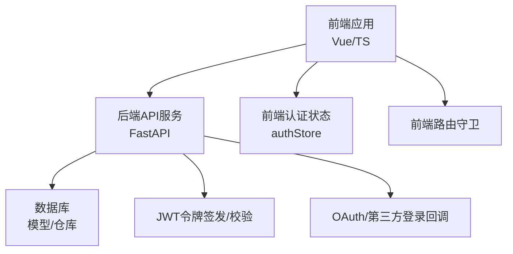
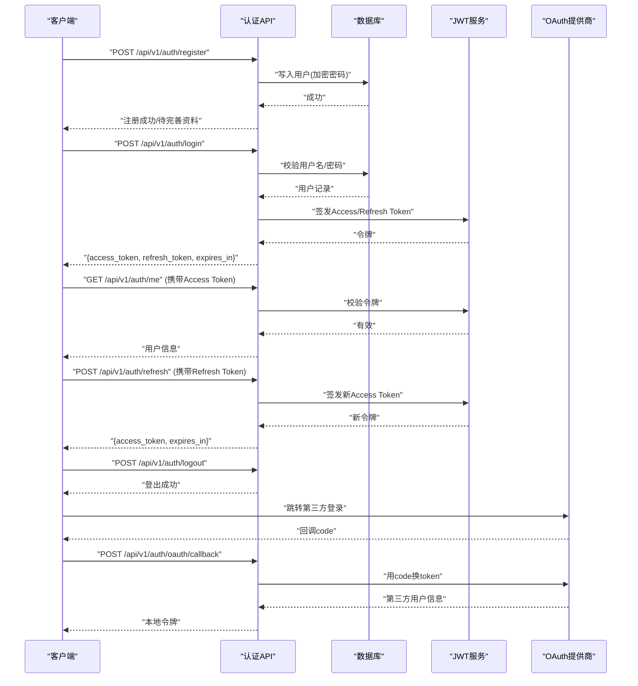
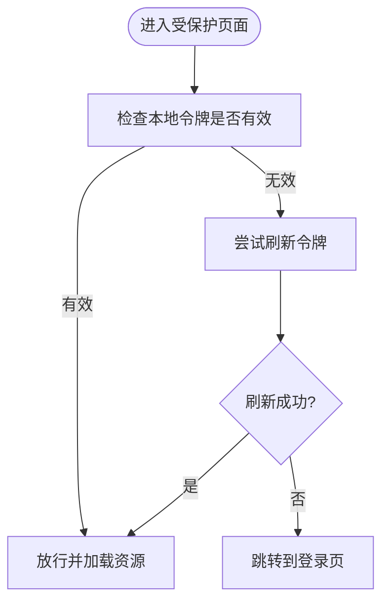
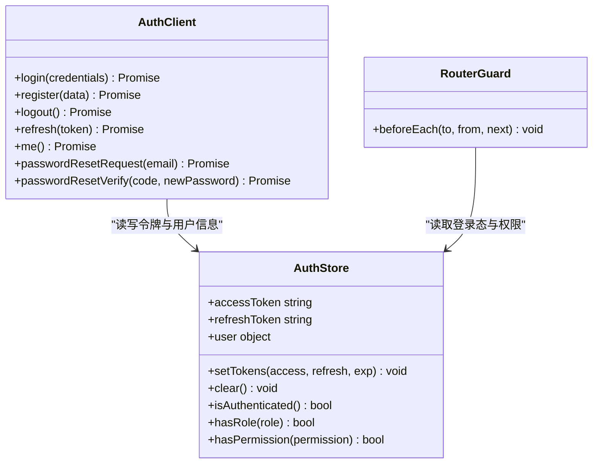
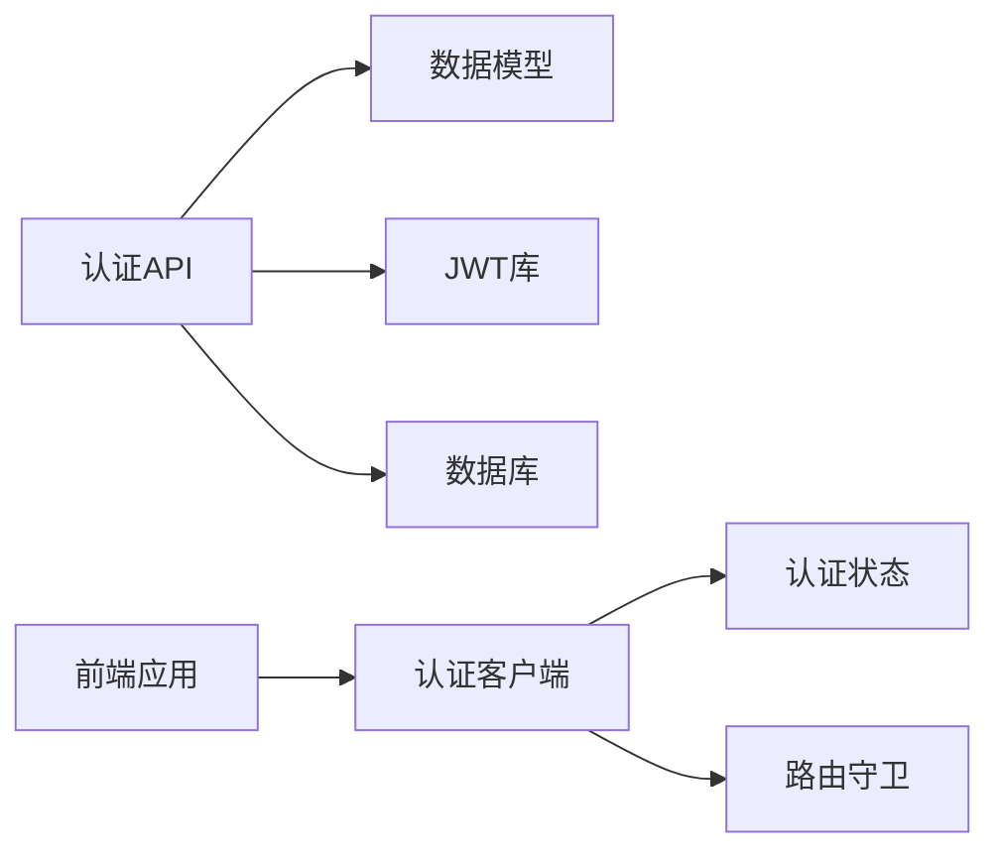

# 认证授权API

<cite>
**本文引用的文件**   
- [src/loopse/api/auth.py](file://src/loopse/api/auth.py)
- [frontend/src/api/auth.ts](file://frontend/src/api/auth.ts)
- [frontend/src/stores/authStore.ts](file://frontend/src/stores/authStore.ts)
- [frontend/src/views/LoginView.vue](file://frontend/src/views/LoginView.vue)
- [frontend/src/views/OAuthCallbackView.vue](file://frontend/src/views/OAuthCallbackView.vue)
- [src/loopse/db/models.py](file://src/loopse/db/models.py)
- [config/api_schema.yaml](file://config/api_schema.yaml)
</cite>

## 目录
1. [简介](#简介)
2. [项目结构](#项目结构)
3. [核心组件](#核心组件)
4. [架构总览](#架构总览)
5. [详细组件分析](#详细组件分析)
6. [依赖分析](#依赖分析)
7. [性能考虑](#性能考虑)
8. [故障排查指南](#故障排查指南)
9. [结论](#结论)
10. [附录](#附录)

## 简介
本文件面向开发者与集成方，系统化文档化认证与授权相关API，覆盖用户注册、登录、登出、密码重置、令牌刷新、权限控制、会话管理、角色校验、OAuth集成与第三方登录、安全策略与防攻击措施。文档同时给出请求/响应示例、错误处理建议与最佳实践，帮助快速对接与安全落地。

## 项目结构
本项目采用前后端分离架构：
- 后端（FastAPI）提供REST API，包含认证路由、数据模型与数据库访问。
- 前端（Vue + TypeScript）封装HTTP调用、本地状态管理与路由守卫，实现登录态维护与页面保护。

图表来源
- [src/loopse/api/auth.py](file://src/loopse/api/auth.py)
- [frontend/src/api/auth.ts](file://frontend/src/api/auth.ts)
- [frontend/src/stores/authStore.ts](file://frontend/src/stores/authStore.ts)
- [src/loopse/db/models.py](file://src/loopse/db/models.py)

章节来源
- [src/loopse/api/auth.py](file://src/loopse/api/auth.py)
- [frontend/src/api/auth.ts](file://frontend/src/api/auth.ts)
- [frontend/src/stores/authStore.ts](file://frontend/src/stores/authStore.ts)
- [src/loopse/db/models.py](file://src/loopse/db/models.py)

## 核心组件
- 认证API模块：定义注册、登录、登出、密码重置、令牌刷新等接口；负责JWT签发与校验、密码哈希验证、会话上下文注入。
- 前端认证客户端：统一封装认证相关HTTP调用，处理Token存储、自动刷新与拦截器。
- 前端认证状态管理：集中保存登录态、用户信息、过期时间，驱动路由守卫与UI展示。
- 数据模型：用户实体、角色与权限字段、密码哈希存储等。

章节来源
- [src/loopse/api/auth.py](file://src/loopse/api/auth.py)
- [frontend/src/api/auth.ts](file://frontend/src/api/auth.ts)
- [frontend/src/stores/authStore.ts](file://frontend/src/stores/authStore.ts)
- [src/loopse/db/models.py](file://src/loopse/db/models.py)

## 架构总览
认证授权整体流程包括：
- 注册：创建用户并返回基础信息或引导完成资料完善。
- 登录：校验凭据，签发短期Access Token与可选Refresh Token，前端持久化。
- 鉴权：受保护接口通过中间件校验JWT，提取用户身份与角色，进行RBAC检查。
- 刷新：使用Refresh Token换取新Access Token，避免频繁登录。
- 登出：服务端注销或失效令牌（若支持），前端清理本地状态。
- 密码重置：发送重置链接/验证码，校验后更新密码。
- OAuth/第三方登录：跳转至提供商，回调中交换令牌并建立本地会话。

图表来源
- [src/loopse/api/auth.py](file://src/loopse/api/auth.py)
- [frontend/src/api/auth.ts](file://frontend/src/api/auth.ts)
- [frontend/src/stores/authStore.ts](file://frontend/src/stores/authStore.ts)
- [src/loopse/db/models.py](file://src/loopse/db/models.py)

## 详细组件分析

### 认证API（后端）
- 注册
  - 方法/路径：POST /api/v1/auth/register
  - 请求体：用户名、邮箱、密码、可选昵称/头像等
  - 响应：用户基本信息或“待完善资料”提示
  - 错误：重复用户名/邮箱、参数校验失败
- 登录
  - 方法/路径：POST /api/v1/auth/login
  - 请求体：用户名或邮箱、密码
  - 响应：access_token、refresh_token、expires_in、用户基础信息
  - 错误：凭据错误、账户锁定、系统异常
- 获取当前用户
  - 方法/路径：GET /api/v1/auth/me
  - 头部：Authorization: Bearer <access_token>
  - 响应：用户详情、角色、权限集合
- 刷新令牌
  - 方法/路径：POST /api/v1/auth/refresh
  - 请求体：refresh_token
  - 响应：新的access_token与过期时间
  - 错误：无效/过期refresh_token
- 登出
  - 方法/路径：POST /api/v1/auth/logout
  - 行为：服务端使令牌失效（若支持黑名单/撤销），前端清理本地状态
- 密码重置
  - 方法/路径：POST /api/v1/auth/password-reset/request、POST /api/v1/auth/password-reset/verify、POST /api/v1/auth/password-reset/update
  - 流程：发送重置码/链接 -> 校验 -> 更新密码
- OAuth/第三方登录
  - 方法/路径：POST /api/v1/auth/oauth/callback
  - 流程：前端接收code -> 调用后端 -> 后端与第三方交换令牌 -> 建立本地会话并返回令牌

图表来源
- [frontend/src/api/auth.ts](file://frontend/src/api/auth.ts)
- [frontend/src/stores/authStore.ts](file://frontend/src/stores/authStore.ts)

章节来源
- [src/loopse/api/auth.py](file://src/loopse/api/auth.py)

### 前端认证客户端与状态管理
- HTTP封装
  - 统一在请求头附加Authorization: Bearer token
  - 全局拦截器处理401：自动触发刷新逻辑或跳转登录
- 本地存储
  - 存储access_token、refresh_token、过期时间戳、用户信息
  - 提供isAuthenticated、hasRole、hasPermission等便捷方法
- 路由守卫
  - 未登录重定向到登录页
  - 按角色/权限限制访问特定页面

图表来源
- [frontend/src/api/auth.ts](file://frontend/src/api/auth.ts)
- [frontend/src/stores/authStore.ts](file://frontend/src/stores/authStore.ts)

章节来源
- [frontend/src/api/auth.ts](file://frontend/src/api/auth.ts)
- [frontend/src/stores/authStore.ts](file://frontend/src/stores/authStore.ts)
- [frontend/src/views/LoginView.vue](file://frontend/src/views/LoginView.vue)
- [frontend/src/views/OAuthCallbackView.vue](file://frontend/src/views/OAuthCallbackView.vue)

### 数据模型与权限
- 用户模型
  - 关键字段：id、username、email、password_hash、role、permissions、created_at、updated_at
  - 安全：密码使用强哈希算法存储，禁止明文
- 角色与权限
  - 角色：如admin、teacher、student等
  - 权限：细粒度操作标识，如resource:create、exam:view等
- 校验与约束
  - 唯一性：username/email
  - 密码强度：长度、复杂度要求
  - 输入清洗：防止注入与XSS

章节来源
- [src/loopse/db/models.py](file://src/loopse/db/models.py)

## 依赖分析
- 后端依赖
  - FastAPI路由与中间件：用于JWT校验与权限装饰器
  - 数据库层：用户查询、密码校验、会话/黑名单（可选）
  - 第三方库：JWT签名库、密码哈希库、OAuth客户端
- 前端依赖
  - Axios/Fetch封装：统一请求头与错误处理
  - 状态管理：Pinia/Vuex或自定义store
  - 路由：Vue Router守卫

图表来源
- [src/loopse/api/auth.py](file://src/loopse/api/auth.py)
- [src/loopse/db/models.py](file://src/loopse/db/models.py)
- [frontend/src/api/auth.ts](file://frontend/src/api/auth.ts)
- [frontend/src/stores/authStore.ts](file://frontend/src/stores/authStore.ts)

章节来源
- [src/loopse/api/auth.py](file://src/loopse/api/auth.py)
- [frontend/src/api/auth.ts](file://frontend/src/api/auth.ts)

## 性能考虑
- 令牌刷新
  - 短生命周期Access Token配合Refresh Token减少重登录
  - 刷新接口幂等且限流，避免被滥用
- 缓存与索引
  - 用户表对username/email建立唯一索引，加速登录校验
- 并发与锁
  - 密码重置与令牌刷新需加锁，防止竞态条件
- 前端优化
  - 批量刷新：多个401请求合并为一次刷新
  - 预取用户信息：登录后立即拉取/me，减少后续等待

[本节为通用指导，无需代码来源]

## 故障排查指南
- 常见错误码与含义
  - 400：参数校验失败（用户名/邮箱格式、密码强度）
  - 401：未认证或令牌无效/过期
  - 403：无权限访问资源
  - 404：资源不存在
  - 409：用户名/邮箱已存在
  - 429：请求过于频繁（限流）
  - 500：服务器内部错误
- 调试要点
  - 检查请求头Authorization是否正确携带Bearer令牌
  - 确认前端刷新逻辑是否触发，网络是否允许跨域
  - 查看后端日志中的JWT校验失败原因（签名不匹配、过期、黑名单）
  - 核对数据库用户记录是否存在、密码哈希是否一致
- 安全事件
  - 检测到暴力破解：启用账户锁定与验证码
  - 发现令牌泄露：强制刷新所有会话并吊销旧令牌

章节来源
- [src/loopse/api/auth.py](file://src/loopse/api/auth.py)

## 结论
本认证授权方案以JWT为核心，结合前端状态管理与路由守卫，实现了完整的注册、登录、登出、密码重置与令牌刷新流程，并通过角色与权限控制保障资源访问安全。OAuth集成提供了第三方登录能力。建议在生产环境严格实施安全策略与监控告警，持续优化用户体验与系统稳定性。

[本节为总结，无需代码来源]

## 附录

### API契约参考
- 接口规范与字段定义可参考配置文档，确保前后端一致性。

章节来源
- [config/api_schema.yaml](file://config/api_schema.yaml)

### 请求与响应示例（说明性）
- 登录
  - 请求：POST /api/v1/auth/login
  - 请求体：{ "username": "string", "password": "string" }
  - 响应：{ "access_token": "string", "refresh_token": "string", "expires_in": number, "user": { "id": "string", "username": "string", "role": "string", "permissions": ["string"] } }
- 刷新令牌
  - 请求：POST /api/v1/auth/refresh
  - 请求体：{ "refresh_token": "string" }
  - 响应：{ "access_token": "string", "expires_in": number }
- 获取当前用户
  - 请求：GET /api/v1/auth/me
  - 头部：Authorization: Bearer <access_token>
  - 响应：{ "id": "string", "username": "string", "email": "string", "role": "string", "permissions": ["string"] }
- 登出
  - 请求：POST /api/v1/auth/logout
  - 头部：Authorization: Bearer <access_token>
  - 响应：{ "message": "登出成功" }
- 密码重置
  - 请求：POST /api/v1/auth/password-reset/request
  - 请求体：{ "email": "string" }
  - 响应：{ "message": "重置邮件已发送" }
  - 请求：POST /api/v1/auth/password-reset/verify
  - 请求体：{ "code": "string", "new_password": "string" }
  - 响应：{ "message": "密码重置成功" }

[本节为说明性示例，便于对接理解]

### 安全最佳实践
- 传输安全
  - 全站HTTPS，启用HSTS
  - 敏感Cookie设置Secure、HttpOnly、SameSite
- 令牌安全
  - Access Token短时效，Refresh Token定期轮换
  - 服务端校验签名、过期时间与黑名单
- 密码安全
  - 使用强哈希算法（如bcrypt/argon2）
  - 强制密码复杂度与历史去重
- 防攻击
  - 登录与刷新接口限流与验证码
  - 防CSRF：同源策略、Samesite Cookie、双重提交Cookie
  - 防XSS：输出编码、CSP策略
  - 防暴力破解：账户锁定、IP封禁、审计日志
- 合规与隐私
  - 最小权限原则，按需收集个人信息
  - 数据脱敏与审计追踪

[本节为通用安全建议，无需代码来源]