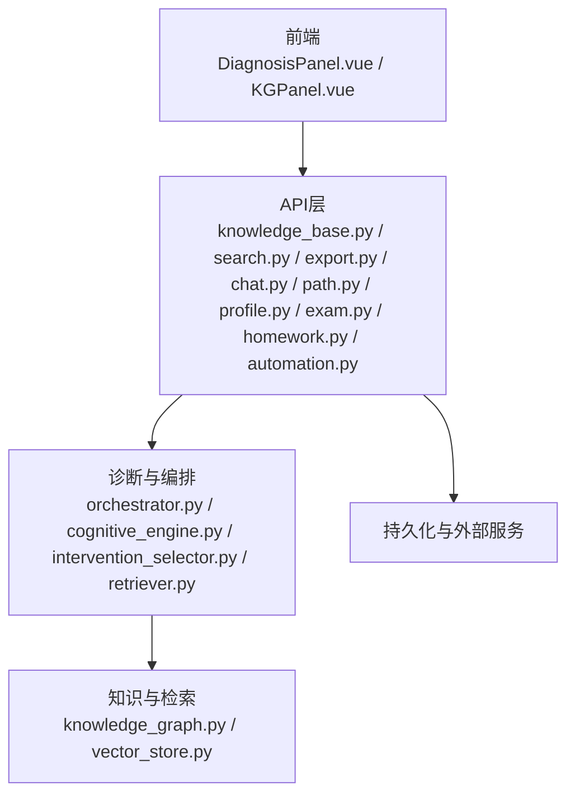
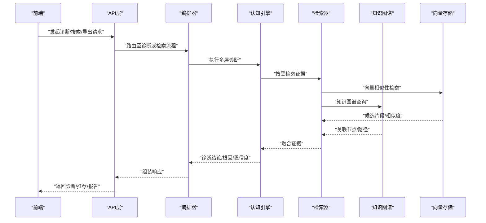
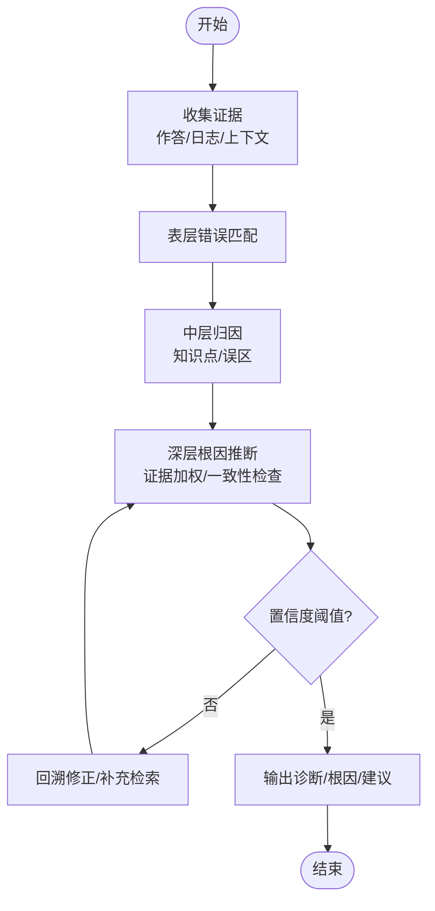
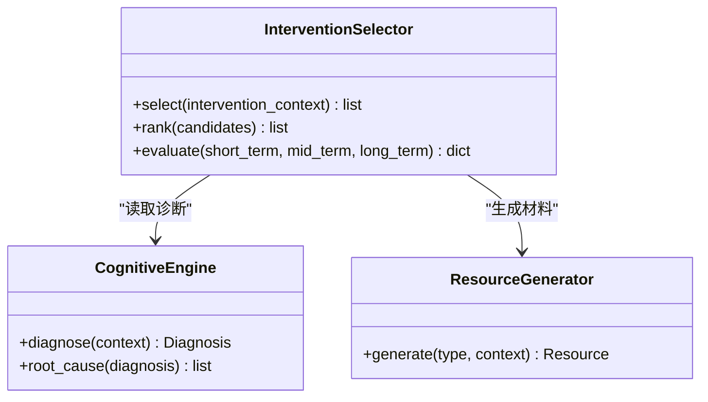
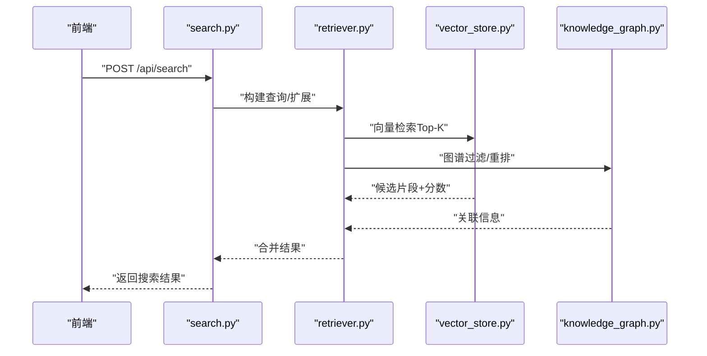
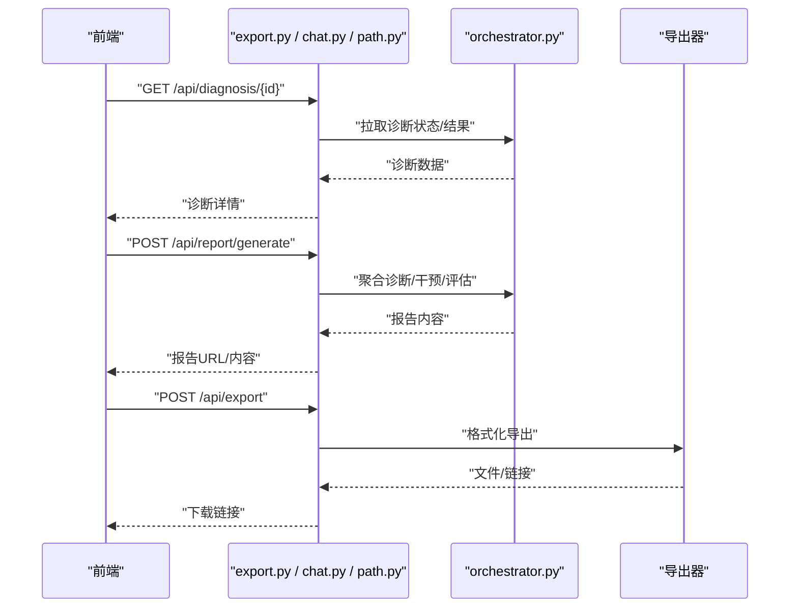
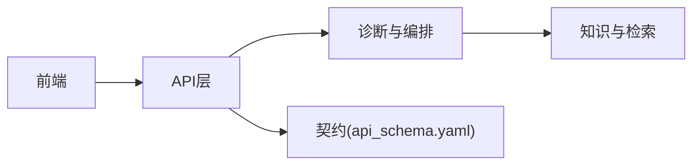

# 诊断分析API

<cite>
**本文引用的文件**   
- [src/loopse/api/knowledge_base.py](file://src/loopse/api/knowledge_base.py)
- [src/loopse/api/search.py](file://src/loopse/api/search.py)
- [src/loopse/api/export.py](file://src/loopse/api/export.py)
- [src/loopse/api/chat.py](file://src/loopse/api/chat.py)
- [src/loopse/api/path.py](file://src/loopse/api/path.py)
- [src/loopse/api/profile.py](file://src/loopse/api/profile.py)
- [src/loopse/api/exam.py](file://src/loopse/api/exam.py)
- [src/loopse/api/homework.py](file://src/loopse/api/homework.py)
- [src/loopse/api/automation.py](file://src/loopse/api/automation.py)
- [src/loopse/agent/cognitive_engine.py](file://src/loopse/agent/cognitive_engine.py)
- [src/loopse/agent/intervention_selector.py](file://src/loopse/agent/intervention_selector.py)
- [src/loopse/agent/orchestrator.py](file://src/loopse/agent/orchestrator.py)
- [src/loopse/agent/retriever.py](file://src/loopse/agent/retriever.py)
- [src/loopse/kb/knowledge_graph.py](file://src/loopse/kb/knowledge_graph.py)
- [src/loopse/kb/vector_store.py](file://src/loopse/kb/vector_store.py)
- [config/api_schema.yaml](file://config/api_schema.yaml)
- [frontend/src/types/diagnosis.ts](file://frontend/src/types/diagnosis.ts)
- [frontend/src/components/DiagnosisPanel.vue](file://frontend/src/components/DiagnosisPanel.vue)
- [frontend/src/components/KGPanel.vue](file://frontend/src/components/KGPanel.vue)
- [scripts/run_diagnosis_accuracy_test.py](file://scripts/run_diagnosis_accuracy_test.py)
</cite>

## 目录
1. [简介](#简介)
2. [项目结构](#项目结构)
3. [核心组件](#核心组件)
4. [架构总览](#架构总览)
5. [详细组件分析](#详细组件分析)
6. [依赖关系分析](#依赖关系分析)
7. [性能考虑](#性能考虑)
8. [故障排查指南](#故障排查指南)
9. [结论](#结论)
10. [附录](#附录)

## 简介
本文件面向“诊断分析API”的开发者与使用者，系统化记录认知诊断、错误分析、知识图谱查询、语义搜索等接口的HTTP方法与数据结构；阐述多层诊断算法、根因分析方法、干预策略生成与效果评估流程；并提供知识库检索、相似性搜索、智能推荐、诊断结果查询、分析报告生成与数据导出等能力说明。文档同时给出诊断流程示例、分析维度定义与报告格式规范，帮助读者快速理解并集成使用。

## 项目结构
围绕诊断分析API，后端主要位于 src/loopse/api 与 src/loopse/agent、src/loopse/kb 等模块；前端通过类型定义与组件调用相关接口。关键文件包括：
- API层：knowledge_base.py、search.py、export.py、chat.py、path.py、profile.py、exam.py、homework.py、automation.py
- 诊断与推理：cognitive_engine.py、intervention_selector.py、orchestrator.py、retriever.py
- 知识与向量：knowledge_graph.py、vector_store.py
- 契约与类型：config/api_schema.yaml、frontend/src/types/diagnosis.ts
- 前端交互：DiagnosisPanel.vue、KGPanel.vue
- 测试与验证：run_diagnosis_accuracy_test.py

图表来源
- [src/loopse/api/knowledge_base.py](file://src/loopse/api/knowledge_base.py)
- [src/loopse/api/search.py](file://src/loopse/api/search.py)
- [src/loopse/api/export.py](file://src/loopse/api/export.py)
- [src/loopse/api/chat.py](file://src/loopse/api/chat.py)
- [src/loopse/api/path.py](file://src/loopse/api/path.py)
- [src/loopse/api/profile.py](file://src/loopse/api/profile.py)
- [src/loopse/api/exam.py](file://src/loopse/api/exam.py)
- [src/loopse/api/homework.py](file://src/loopse/api/homework.py)
- [src/loopse/api/automation.py](file://src/loopse/api/automation.py)
- [src/loopse/agent/orchestrator.py](file://src/loopse/agent/orchestrator.py)
- [src/loopse/agent/cognitive_engine.py](file://src/loopse/agent/cognitive_engine.py)
- [src/loopse/agent/intervention_selector.py](file://src/loopse/agent/intervention_selector.py)
- [src/loopse/agent/retriever.py](file://src/loopse/agent/retriever.py)
- [src/loopse/kb/knowledge_graph.py](file://src/loopse/kb/knowledge_graph.py)
- [src/loopse/kb/vector_store.py](file://src/loopse/kb/vector_store.py)

章节来源
- [config/api_schema.yaml](file://config/api_schema.yaml)
- [frontend/src/types/diagnosis.ts](file://frontend/src/types/diagnosis.ts)
- [frontend/src/components/DiagnosisPanel.vue](file://frontend/src/components/DiagnosisPanel.vue)
- [frontend/src/components/KGPanel.vue](file://frontend/src/components/KGPanel.vue)

## 核心组件
- 诊断编排器（Orchestrator）：统一调度认知引擎、检索器、干预选择器等，形成端到端诊断工作流。
- 认知引擎（Cognitive Engine）：实现多层诊断算法，聚合证据、进行归因与置信度评估。
- 干预选择器（Intervention Selector）：基于诊断结果生成个性化干预策略，支持多模态资源推荐。
- 检索器（Retriever）：负责语义检索、查询扩展与召回排序，对接向量库与知识图谱。
- 知识图谱（Knowledge Graph）：提供概念、先决条件、误区、路径等结构化知识查询。
- 向量存储（Vector Store）：承载文本/代码/题目等嵌入，支撑相似性搜索与智能推荐。
- API网关与控制器：暴露REST/SSE接口，封装请求校验、参数映射、响应序列化与错误处理。

章节来源
- [src/loopse/agent/orchestrator.py](file://src/loopse/agent/orchestrator.py)
- [src/loopse/agent/cognitive_engine.py](file://src/loopse/agent/cognitive_engine.py)
- [src/loopse/agent/intervention_selector.py](file://src/loopse/agent/intervention_selector.py)
- [src/loopse/agent/retriever.py](file://src/loopse/agent/retriever.py)
- [src/loopse/kb/knowledge_graph.py](file://src/loopse/kb/knowledge_graph.py)
- [src/loopse/kb/vector_store.py](file://src/loopse/kb/vector_store.py)

## 架构总览
下图展示从前端到后端API、诊断编排、知识与检索、以及返回结果的完整链路。

图表来源
- [src/loopse/api/knowledge_base.py](file://src/loopse/api/knowledge_base.py)
- [src/loopse/api/search.py](file://src/loopse/api/search.py)
- [src/loopse/api/export.py](file://src/loopse/api/export.py)
- [src/loopse/agent/orchestrator.py](file://src/loopse/agent/orchestrator.py)
- [src/loopse/agent/cognitive_engine.py](file://src/loopse/agent/cognitive_engine.py)
- [src/loopse/agent/retriever.py](file://src/loopse/agent/retriever.py)
- [src/loopse/kb/knowledge_graph.py](file://src/loopse/kb/knowledge_graph.py)
- [src/loopse/kb/vector_store.py](file://src/loopse/kb/vector_store.py)

## 详细组件分析

### 认知诊断与多层诊断算法
- 输入：学生作答、历史轨迹、上下文提示、评测指标等。
- 过程：
  - 表层错误识别：匹配常见错误模式与症状。
  - 中层归因：结合先决知识与误区注册表，定位薄弱知识点。
  - 深层根因：利用证据链与权重评分，输出根因假设及置信度。
- 输出：诊断结论、根因列表、置信度、证据摘要、建议学习路径。

图表来源
- [src/loopse/agent/cognitive_engine.py](file://src/loopse/agent/cognitive_engine.py)
- [src/loopse/agent/retriever.py](file://src/loopse/agent/retriever.py)
- [src/loopse/kb/misconception_registry.py](file://src/loopse/kb/misconception_registry.py)

章节来源
- [src/loopse/agent/cognitive_engine.py](file://src/loopse/agent/cognitive_engine.py)
- [src/loopse/agent/retriever.py](file://src/loopse/agent/retriever.py)

### 根因分析方法
- 方法要点：
  - 证据聚合：来自作答、对话、练习、测评等多源信号。
  - 因果图/路径：在知识图谱上定位前置依赖缺失与误区传播。
  - 置信度计算：基于证据强度、一致性与历史稳定性。
- 输出：根因节点、影响范围、修复优先级。

章节来源
- [src/loopse/agent/cognitive_engine.py](file://src/loopse/agent/cognitive_engine.py)
- [src/loopse/kb/knowledge_graph.py](file://src/loopse/kb/knowledge_graph.py)

### 干预策略生成与效果评估
- 生成：
  - 基于诊断结果与用户画像，选择合适干预（讲解、练习、可视化、模拟等）。
  - 结合资源生成器产出个性化材料。
- 评估：
  - 短期：即时反馈正确率、停留时长、重试次数。
  - 中期：知识点掌握曲线、迁移表现。
  - 长期：综合成绩与能力雷达变化。

图表来源
- [src/loopse/agent/intervention_selector.py](file://src/loopse/agent/intervention_selector.py)
- [src/loopse/agent/cognitive_engine.py](file://src/loopse/agent/cognitive_engine.py)

章节来源
- [src/loopse/agent/intervention_selector.py](file://src/loopse/agent/intervention_selector.py)

### 知识库检索与相似性搜索
- 功能：
  - 语义检索：自然语言/代码片段/题目描述检索。
  - 相似性搜索：向量相似度Top-K，支持过滤与重排。
  - 查询扩展：同义词、上下位词、相关概念增强。
- 数据源：
  - 向量存储：文本/代码/题目的嵌入表示。
  - 知识图谱：概念、先决条件、误区、路径等。

图表来源
- [src/loopse/api/search.py](file://src/loopse/api/search.py)
- [src/loopse/agent/retriever.py](file://src/loopse/agent/retriever.py)
- [src/loopse/kb/vector_store.py](file://src/loopse/kb/vector_store.py)
- [src/loopse/kb/knowledge_graph.py](file://src/loopse/kb/knowledge_graph.py)

章节来源
- [src/loopse/api/search.py](file://src/loopse/api/search.py)
- [src/loopse/agent/retriever.py](file://src/loopse/agent/retriever.py)
- [src/loopse/kb/vector_store.py](file://src/loopse/kb/vector_store.py)
- [src/loopse/kb/knowledge_graph.py](file://src/loopse/kb/knowledge_graph.py)

### 智能推荐
- 依据：
  - 当前诊断结论与根因。
  - 用户画像与历史偏好。
  - 资源质量与难度梯度。
- 输出：
  - 个性化学习路径、资源卡片、练习题、讲解视频脚本等。

章节来源
- [src/loopse/api/path.py](file://src/loopse/api/path.py)
- [src/loopse/api/resources.py](file://src/loopse/api/resources.py)
- [src/loopse/agent/intervention_selector.py](file://src/loopse/agent/intervention_selector.py)

### 诊断结果查询、分析报告生成与数据导出
- 诊断结果查询：按会话/任务ID获取诊断详情、证据与置信度。
- 分析报告生成：汇总诊断、根因、干预与效果评估，输出结构化报告。
- 数据导出：支持JSON/CSV/PDF等格式，便于归档与二次分析。

图表来源
- [src/loopse/api/export.py](file://src/loopse/api/export.py)
- [src/loopse/api/chat.py](file://src/loopse/api/chat.py)
- [src/loopse/api/path.py](file://src/loopse/api/path.py)
- [src/loopse/agent/orchestrator.py](file://src/loopse/agent/orchestrator.py)

章节来源
- [src/loopse/api/export.py](file://src/loopse/api/export.py)
- [src/loopse/api/chat.py](file://src/loopse/api/chat.py)
- [src/loopse/api/path.py](file://src/loopse/api/path.py)

### 诊断流程示例
- 典型流程：
  1) 提交作答/问题 -> 2) 触发诊断编排 -> 3) 多层诊断与检索 -> 4) 根因分析与置信度 -> 5) 生成干预与推荐 -> 6) 输出报告与导出。
- 前端交互：
  - DiagnosisPanel.vue 负责诊断表单与结果展示。
  - KGPanel.vue 用于知识图谱可视化与导航。

章节来源
- [frontend/src/components/DiagnosisPanel.vue](file://frontend/src/components/DiagnosisPanel.vue)
- [frontend/src/components/KGPanel.vue](file://frontend/src/components/KGPanel.vue)

### 分析维度定义
- 知识维度：概念、技能、先决条件、误区。
- 行为维度：作答时间、重试次数、错误模式、探索路径。
- 能力维度：掌握度、迁移能力、稳定性。
- 资源维度：难度、类型、质量、适配度。

章节来源
- [src/loopse/schema/student_profile_schema.py](file://src/loopse/schema/student_profile_schema.py)
- [src/loopse/schema/intervention.py](file://src/loopse/schema/intervention.py)

### 报告格式规范
- 字段建议：
  - 基本信息：会话ID、时间戳、学生ID、课程/章节。
  - 诊断摘要：结论、置信度、关键证据。
  - 根因分析：根因节点、影响范围、修复优先级。
  - 干预策略：推荐资源、学习路径、预期目标。
  - 效果评估：短期/中期/长期指标对比。
  - 附件：原始数据、导出文件链接。
- 导出格式：JSON（结构化）、CSV（表格）、PDF（阅读版）。

章节来源
- [config/api_schema.yaml](file://config/api_schema.yaml)
- [src/loopse/api/export.py](file://src/loopse/api/export.py)

## 依赖关系分析
- 耦合与内聚：
  - API层对Agent与KB解耦，通过明确的数据契约（api_schema.yaml）降低耦合。
  - 编排器集中协调，提升内聚性。
- 外部依赖：
  - 向量存储与知识图谱为外部子系统，需关注可用性、延迟与容量。
- 潜在循环依赖：
  - 避免Agent与API直接互相引用，统一通过数据模型与消息传递。

图表来源
- [config/api_schema.yaml](file://config/api_schema.yaml)
- [src/loopse/api/knowledge_base.py](file://src/loopse/api/knowledge_base.py)
- [src/loopse/agent/orchestrator.py](file://src/loopse/agent/orchestrator.py)

章节来源
- [config/api_schema.yaml](file://config/api_schema.yaml)

## 性能考虑
- 缓存与预取：
  - 对高频检索结果与图谱子图进行缓存。
  - 诊断中间结果可异步落盘，支持断点续算。
- 并发与批处理：
  - 批量导入与向量化采用异步队列。
  - 检索Top-K与重排并行化。
- 索引与分片：
  - 向量索引按主题/难度分片，减少扫描范围。
  - 图谱热点节点建立二级索引。
- 限流与降级：
  - 对LLM与外部检索设置超时与熔断。
  - 降级策略：返回近似结果与保守置信度。

[本节为通用指导，不直接分析具体文件]

## 故障排查指南
- 常见问题：
  - 检索无结果：检查向量索引是否更新、查询扩展是否生效、图谱过滤条件是否过严。
  - 诊断耗时过长：确认并发配置、缓存命中率、LLM调用频率限制。
  - 报告导出失败：核对导出格式模板、权限与存储空间。
- 调试手段：
  - 启用SSE事件流查看中间步骤。
  - 打印证据链与置信度分布，定位异常分支。
  - 使用准确性测试脚本验证诊断质量。

章节来源
- [scripts/run_diagnosis_accuracy_test.py](file://scripts/run_diagnosis_accuracy_test.py)
- [src/loopse/api/chat.py](file://src/loopse/api/chat.py)

## 结论
诊断分析API以编排器为核心，串联认知诊断、根因分析、干预生成与效果评估，并通过知识图谱与向量检索提供强大的证据支撑。通过清晰的API契约与模块化设计，系统具备良好的可扩展性与可维护性。建议在生产环境完善缓存、监控与降级策略，持续优化检索与诊断性能。

## 附录
- 前端类型定义参考：
  - diagnosis.ts 定义了诊断相关的数据结构与字段约定，便于前后端对齐。
- 自动化与集成：
  - automation.py 提供批量诊断与任务编排能力，适合离线分析与评测。

章节来源
- [frontend/src/types/diagnosis.ts](file://frontend/src/types/diagnosis.ts)
- [src/loopse/api/automation.py](file://src/loopse/api/automation.py)