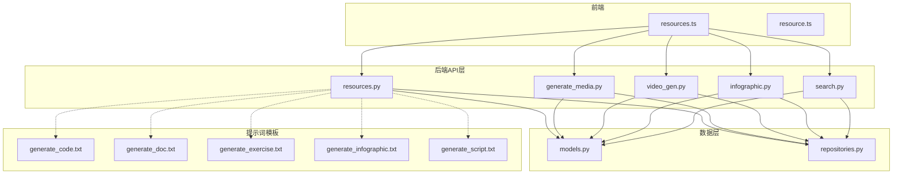
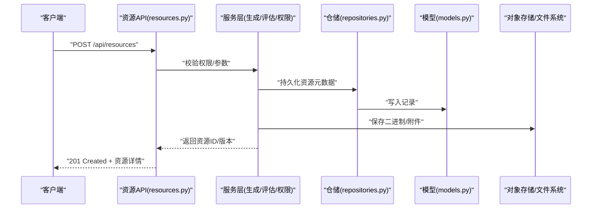
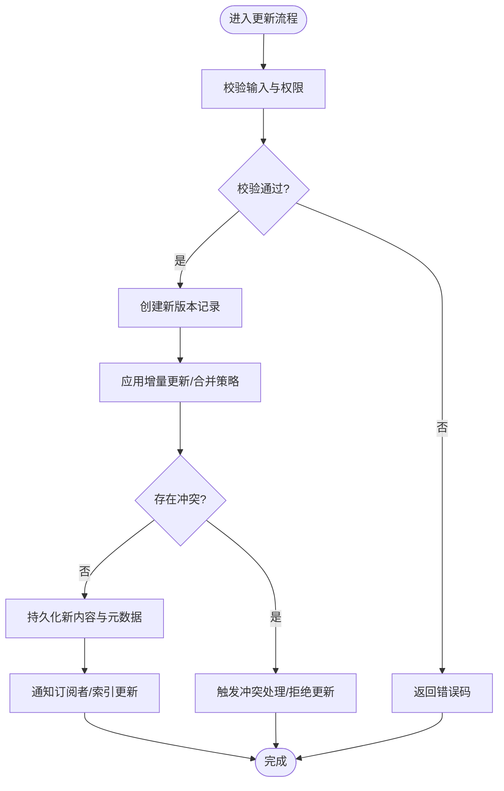
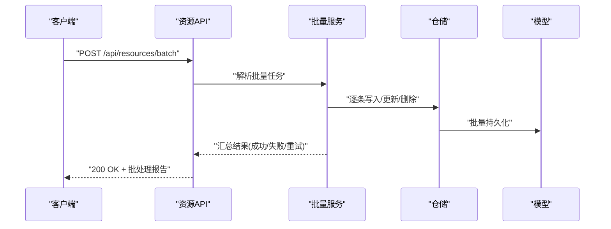
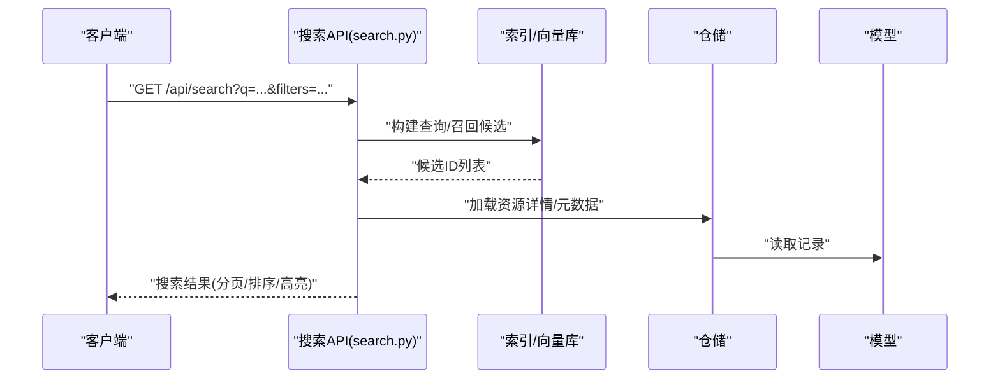
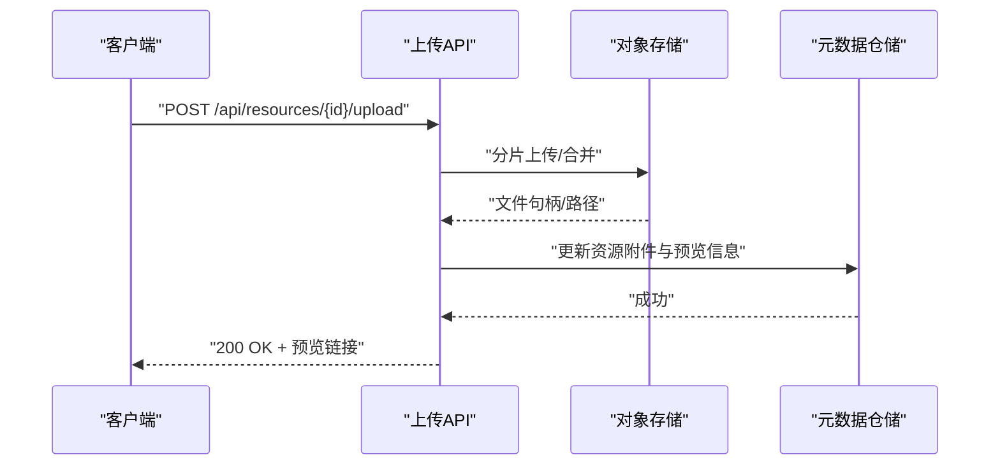
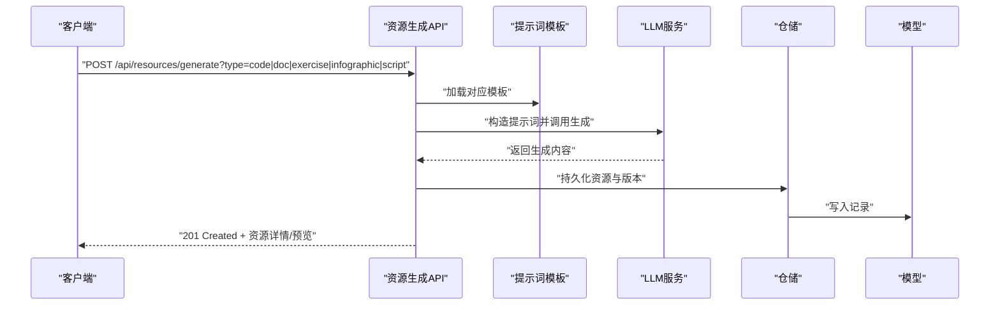
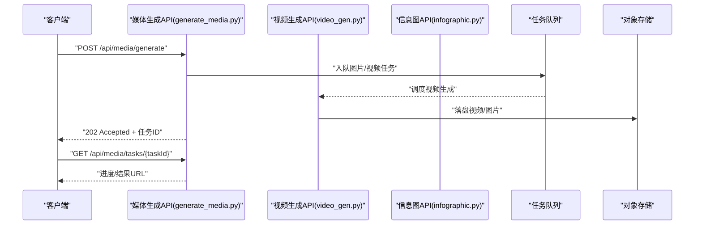
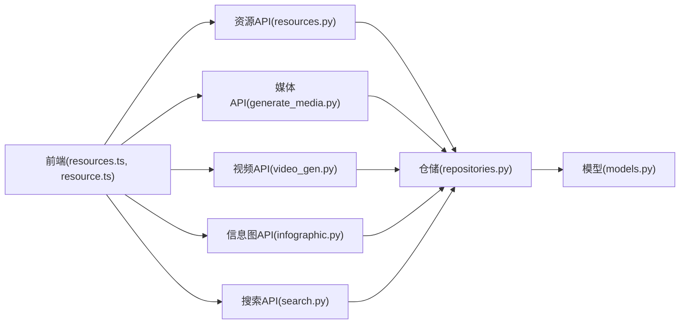

# 资源管理API

<cite>
**本文引用的文件**   
- [src/loopse/api/resources.py](file://src/loopse/api/resources.py)
- [src/loopse/api/generate_media.py](file://src/loopse/api/generate_media.py)
- [src/loopse/api/video_gen.py](file://src/loopse/api/video_gen.py)
- [src/loopse/api/infographic.py](file://src/loopse/api/infographic.py)
- [src/loopse/api/search.py](file://src/loopse/api/search.py)
- [src/loopse/db/models.py](file://src/loopse/db/models.py)
- [src/loopse/db/repositories.py](file://src/loopse/db/repositories.py)
- [config/prompts/resource_generator/generate_code.txt](file://config/prompts/resource_generator/generate_code.txt)
- [config/prompts/resource_generator/generate_doc.txt](file://config/prompts/resource_generator/generate_doc.txt)
- [config/prompts/resource_generator/generate_exercise.txt](file://config/prompts/resource_generator/generate_exercise.txt)
- [config/prompts/resource_generator/generate_infographic.txt](file://config/prompts/resource_generator/generate_infographic.txt)
- [config/prompts/resource_generator/generate_script.txt](file://config/prompts/resource_generator/generate_script.txt)
- [frontend/src/api/resources.ts](file://frontend/src/api/resources.ts)
- [frontend/src/types/resource.ts](file://frontend/src/types/resource.ts)
</cite>

## 目录
1. [简介](#简介)
2. [项目结构](#项目结构)
3. [核心组件](#核心组件)
4. [架构总览](#架构总览)
5. [详细组件分析](#详细组件分析)
6. [依赖关系分析](#依赖关系分析)
7. [性能考虑](#性能考虑)
8. [故障排查指南](#故障排查指南)
9. [结论](#结论)
10. [附录](#附录)

## 简介
本文件为“资源管理API”的完整技术文档，覆盖教学资源的CRUD、批量管理、版本控制、分类与标签、搜索检索、权限控制、上传下载、预览生成、质量评估，以及多种资源类型（代码、文档、练习、信息图、脚本等）和媒体内容（视频、图片）的生成接口。同时提供实际示例、模板配置说明与批量操作指南，帮助开发者快速集成与扩展。

## 项目结构
后端资源相关API主要位于 src/loopse/api 下，数据模型与仓储位于 src/loopse/db，提示词模板位于 config/prompts/resource_generator，前端调用封装位于 frontend/src/api 与类型定义位于 frontend/src/types。

图表来源
- [src/loopse/api/resources.py](file://src/loopse/api/resources.py)
- [src/loopse/api/generate_media.py](file://src/loopse/api/generate_media.py)
- [src/loopse/api/video_gen.py](file://src/loopse/api/video_gen.py)
- [src/loopse/api/infographic.py](file://src/loopse/api/infographic.py)
- [src/loopse/api/search.py](file://src/loopse/api/search.py)
- [src/loopse/db/models.py](file://src/loopse/db/models.py)
- [src/loopse/db/repositories.py](file://src/loopse/db/repositories.py)
- [config/prompts/resource_generator/generate_code.txt](file://config/prompts/resource_generator/generate_code.txt)
- [config/prompts/resource_generator/generate_doc.txt](file://config/prompts/resource_generator/generate_doc.txt)
- [config/prompts/resource_generator/generate_exercise.txt](file://config/prompts/resource_generator/generate_exercise.txt)
- [config/prompts/resource_generator/generate_infographic.txt](file://config/prompts/resource_generator/generate_infographic.txt)
- [config/prompts/resource_generator/generate_script.txt](file://config/prompts/resource_generator/generate_script.txt)
- [frontend/src/api/resources.ts](file://frontend/src/api/resources.ts)
- [frontend/src/types/resource.ts](file://frontend/src/types/resource.ts)

章节来源
- [src/loopse/api/resources.py](file://src/loopse/api/resources.py)
- [src/loopse/api/generate_media.py](file://src/loopse/api/generate_media.py)
- [src/loopse/api/video_gen.py](file://src/loopse/api/video_gen.py)
- [src/loopse/api/infographic.py](file://src/loopse/api/infographic.py)
- [src/loopse/api/search.py](file://src/loopse/api/search.py)
- [src/loopse/db/models.py](file://src/loopse/db/models.py)
- [src/loopse/db/repositories.py](file://src/loopse/db/repositories.py)
- [config/prompts/resource_generator/generate_code.txt](file://config/prompts/resource_generator/generate_code.txt)
- [config/prompts/resource_generator/generate_doc.txt](file://config/prompts/resource_generator/generate_doc.txt)
- [config/prompts/resource_generator/generate_exercise.txt](file://config/prompts/resource_generator/generate_exercise.txt)
- [config/prompts/resource_generator/generate_infographic.txt](file://config/prompts/resource_generator/generate_infographic.txt)
- [config/prompts/resource_generator/generate_script.txt](file://config/prompts/resource_generator/generate_script.txt)
- [frontend/src/api/resources.ts](file://frontend/src/api/resources.ts)
- [frontend/src/types/resource.ts](file://frontend/src/types/resource.ts)

## 核心组件
- 资源CRUD与版本：提供资源的创建、查询、更新、删除、列表分页、按条件筛选、版本化与回滚能力。
- 批量管理：支持批量创建、批量更新、批量删除、批量打标签/分类。
- 分类与标签：资源可关联分类与标签，支持增删改查及聚合统计。
- 搜索检索：全文检索、关键词过滤、分类/标签过滤、排序与分页。
- 权限控制：基于角色的访问控制（RBAC），对资源的读写与生成进行鉴权。
- 上传下载：二进制文件上传、分片上传、断点续传、下载与预览链接生成。
- 预览生成：根据资源元数据或内容自动生成缩略图/封面/摘要。
- 质量评估：对生成资源进行质量评分与指标输出，支持人工复核与自动校验。
- 多类型资源生成：代码、文档、练习、信息图、脚本等；媒体内容：视频、图片。
- 模板配置：通过提示词模板驱动不同资源类型的生成策略。

章节来源
- [src/loopse/api/resources.py](file://src/loopse/api/resources.py)
- [src/loopse/api/generate_media.py](file://src/loopse/api/generate_media.py)
- [src/loopse/api/video_gen.py](file://src/loopse/api/video_gen.py)
- [src/loopse/api/infographic.py](file://src/loopse/api/infographic.py)
- [src/loopse/api/search.py](file://src/loopse/api/search.py)
- [src/loopse/db/models.py](file://src/loopse/db/models.py)
- [src/loopse/db/repositories.py](file://src/loopse/db/repositories.py)
- [config/prompts/resource_generator/generate_code.txt](file://config/prompts/resource_generator/generate_code.txt)
- [config/prompts/resource_generator/generate_doc.txt](file://config/prompts/resource_generator/generate_doc.txt)
- [config/prompts/resource_generator/generate_exercise.txt](file://config/prompts/resource_generator/generate_exercise.txt)
- [config/prompts/resource_generator/generate_infographic.txt](file://config/prompts/resource_generator/generate_infographic.txt)
- [config/prompts/resource_generator/generate_script.txt](file://config/prompts/resource_generator/generate_script.txt)

## 架构总览
资源管理API采用分层架构：API层负责HTTP路由与请求校验，服务层编排业务逻辑（含生成器、质量评估、权限检查），数据层通过仓储访问数据库模型。

图表来源
- [src/loopse/api/resources.py](file://src/loopse/api/resources.py)
- [src/loopse/db/repositories.py](file://src/loopse/db/repositories.py)
- [src/loopse/db/models.py](file://src/loopse/db/models.py)

## 详细组件分析

### 资源CRUD与版本控制
- 创建资源：支持文本/结构化内容、附件、分类、标签、元数据；返回资源ID与初始版本。
- 查询资源：按ID获取详情，支持包含版本历史与附件清单。
- 更新资源：增量更新字段，自动创建新版本；支持合并策略与冲突检测。
- 删除资源：软删除标记，保留版本历史；支持硬删除需管理员权限。
- 列表与分页：支持按分类、标签、状态、时间范围、作者等筛选；排序与分页。
- 版本控制：每次更新产生新版本；支持查看差异、回滚到指定版本、锁定版本。

图表来源
- [src/loopse/api/resources.py](file://src/loopse/api/resources.py)
- [src/loopse/db/repositories.py](file://src/loopse/db/repositories.py)
- [src/loopse/db/models.py](file://src/loopse/db/models.py)

章节来源
- [src/loopse/api/resources.py](file://src/loopse/api/resources.py)
- [src/loopse/db/repositories.py](file://src/loopse/db/repositories.py)
- [src/loopse/db/models.py](file://src/loopse/db/models.py)

### 批量管理
- 批量创建：提交资源数组，支持事务性写入与失败重试；返回成功/失败明细。
- 批量更新：按ID映射更新字段，支持幂等键避免重复执行。
- 批量删除：支持软删除与级联清理；返回受影响数量与未处理项。
- 批量标签/分类：追加或替换标签/分类集合；支持去重与校验。

图表来源
- [src/loopse/api/resources.py](file://src/loopse/api/resources.py)
- [src/loopse/db/repositories.py](file://src/loopse/db/repositories.py)
- [src/loopse/db/models.py](file://src/loopse/db/models.py)

章节来源
- [src/loopse/api/resources.py](file://src/loopse/api/resources.py)
- [src/loopse/db/repositories.py](file://src/loopse/db/repositories.py)
- [src/loopse/db/models.py](file://src/loopse/db/models.py)

### 分类与标签管理
- 分类：树形结构，支持层级、别名、可见性与排序。
- 标签：扁平集合，支持同义词、权重与使用统计。
- 关联：资源与分类/标签多对多关联，支持批量绑定与解绑。
- 统计：按分类/标签聚合资源数量、最近更新、热度。

章节来源
- [src/loopse/api/resources.py](file://src/loopse/api/resources.py)
- [src/loopse/db/models.py](file://src/loopse/db/models.py)
- [src/loopse/db/repositories.py](file://src/loopse/db/repositories.py)

### 搜索与检索
- 全文检索：关键词匹配、模糊搜索、高亮片段。
- 过滤：按分类、标签、类型、状态、时间、作者等组合过滤。
- 排序：相关性、时间、热度、评分等多维度排序。
- 分页：游标或偏移分页，支持每页大小与最大限制。

图表来源
- [src/loopse/api/search.py](file://src/loopse/api/search.py)
- [src/loopse/db/repositories.py](file://src/loopse/db/repositories.py)
- [src/loopse/db/models.py](file://src/loopse/db/models.py)

章节来源
- [src/loopse/api/search.py](file://src/loopse/api/search.py)
- [src/loopse/db/repositories.py](file://src/loopse/db/repositories.py)
- [src/loopse/db/models.py](file://src/loopse/db/models.py)

### 权限控制
- 角色与范围：基于角色的访问控制，支持资源级作用域与继承。
- 鉴权流程：请求头携带令牌，服务端校验角色与资源权限。
- 审计日志：记录关键操作的主体、动作、资源与时间戳。

章节来源
- [src/loopse/api/resources.py](file://src/loopse/api/resources.py)
- [src/loopse/api/search.py](file://src/loopse/api/search.py)

### 上传与下载
- 上传：单文件/多文件、分片上传、断点续传、并发校验。
- 下载：直链下载、签名URL、流式传输、限速与防盗链。
- 预览：生成缩略图/封面、文本摘要、在线预览链接。

图表来源
- [src/loopse/api/resources.py](file://src/loopse/api/resources.py)

章节来源
- [src/loopse/api/resources.py](file://src/loopse/api/resources.py)

### 预览生成
- 文本类：提取首段/标题/关键字，生成摘要与封面。
- 多媒体类：抽取帧/缩略图，计算时长/分辨率等元数据。
- 异步任务：大体积或复杂预览走异步队列，返回任务ID与进度。

章节来源
- [src/loopse/api/resources.py](file://src/loopse/api/resources.py)

### 质量评估
- 自动评估：完整性、可读性、一致性、合规性、相似度查重。
- 指标输出：综合评分、分项得分、改进建议。
- 人工复核：支持标注与反馈闭环，持续优化评估模型。

章节来源
- [src/loopse/api/resources.py](file://src/loopse/api/resources.py)

### 多类型资源生成（代码、文档、练习、信息图、脚本）
- 代码生成：依据主题/知识点/难度生成可运行代码与注释。
- 文档生成：结构化文档、教程、FAQ、知识卡片。
- 练习生成：选择题、填空题、编程题，附带答案与解析。
- 信息图生成：可视化图表、流程图、思维导图。
- 脚本生成：演示脚本、自动化脚本、评测脚本。

图表来源
- [src/loopse/api/resources.py](file://src/loopse/api/resources.py)
- [config/prompts/resource_generator/generate_code.txt](file://config/prompts/resource_generator/generate_code.txt)
- [config/prompts/resource_generator/generate_doc.txt](file://config/prompts/resource_generator/generate_doc.txt)
- [config/prompts/resource_generator/generate_exercise.txt](file://config/prompts/resource_generator/generate_exercise.txt)
- [config/prompts/resource_generator/generate_infographic.txt](file://config/prompts/resource_generator/generate_infographic.txt)
- [config/prompts/resource_generator/generate_script.txt](file://config/prompts/resource_generator/generate_script.txt)

章节来源
- [src/loopse/api/resources.py](file://src/loopse/api/resources.py)
- [config/prompts/resource_generator/generate_code.txt](file://config/prompts/resource_generator/generate_code.txt)
- [config/prompts/resource_generator/generate_doc.txt](file://config/prompts/resource_generator/generate_doc.txt)
- [config/prompts/resource_generator/generate_exercise.txt](file://config/prompts/resource_generator/generate_exercise.txt)
- [config/prompts/resource_generator/generate_infographic.txt](file://config/prompts/resource_generator/generate_infographic.txt)
- [config/prompts/resource_generator/generate_script.txt](file://config/prompts/resource_generator/generate_script.txt)

### 媒体内容生成（视频、图片）
- 图片生成：风格化图片、教学插图、封面图；支持尺寸/比例/水印配置。
- 视频生成：讲解视频、动画演示、字幕合成；支持分段渲染与拼接。
- 异步任务：长耗时任务返回任务ID，支持进度查询与回调。

图表来源
- [src/loopse/api/generate_media.py](file://src/loopse/api/generate_media.py)
- [src/loopse/api/video_gen.py](file://src/loopse/api/video_gen.py)
- [src/loopse/api/infographic.py](file://src/loopse/api/infographic.py)

章节来源
- [src/loopse/api/generate_media.py](file://src/loopse/api/generate_media.py)
- [src/loopse/api/video_gen.py](file://src/loopse/api/video_gen.py)
- [src/loopse/api/infographic.py](file://src/loopse/api/infographic.py)

### 前端集成要点
- 资源API封装：统一请求拦截、错误处理、重试机制。
- 类型定义：资源实体、版本、标签、分类、搜索参数等TS类型。
- 交互体验：进度条、占位骨架屏、错误提示与重试按钮。

章节来源
- [frontend/src/api/resources.ts](file://frontend/src/api/resources.ts)
- [frontend/src/types/resource.ts](file://frontend/src/types/resource.ts)

## 依赖关系分析
- API层依赖仓储层进行数据持久化与查询。
- 仓储层依赖模型层定义的数据结构与约束。
- 生成类API依赖提示词模板与外部LLM/媒体服务。
- 前端通过API封装与类型定义与后端交互。

图表来源
- [src/loopse/api/resources.py](file://src/loopse/api/resources.py)
- [src/loopse/api/generate_media.py](file://src/loopse/api/generate_media.py)
- [src/loopse/api/video_gen.py](file://src/loopse/api/video_gen.py)
- [src/loopse/api/infographic.py](file://src/loopse/api/infographic.py)
- [src/loopse/api/search.py](file://src/loopse/api/search.py)
- [src/loopse/db/repositories.py](file://src/loopse/db/repositories.py)
- [src/loopse/db/models.py](file://src/loopse/db/models.py)
- [frontend/src/api/resources.ts](file://frontend/src/api/resources.ts)
- [frontend/src/types/resource.ts](file://frontend/src/types/resource.ts)

章节来源
- [src/loopse/api/resources.py](file://src/loopse/api/resources.py)
- [src/loopse/api/generate_media.py](file://src/loopse/api/generate_media.py)
- [src/loopse/api/video_gen.py](file://src/loopse/api/video_gen.py)
- [src/loopse/api/infographic.py](file://src/loopse/api/infographic.py)
- [src/loopse/api/search.py](file://src/loopse/api/search.py)
- [src/loopse/db/repositories.py](file://src/loopse/db/repositories.py)
- [src/loopse/db/models.py](file://src/loopse/db/models.py)
- [frontend/src/api/resources.ts](file://frontend/src/api/resources.ts)
- [frontend/src/types/resource.ts](file://frontend/src/types/resource.ts)

## 性能考虑
- 分页与游标：大数据量场景优先使用游标分页，减少深翻页开销。
- 缓存策略：热点资源与搜索结果缓存，设置合理TTL与失效策略。
- 异步任务：生成与预览任务异步化，提升响应速度与吞吐。
- 索引优化：搜索字段建立合适索引，避免全表扫描。
- 限流与熔断：对生成类接口实施限流，保护下游服务稳定。

[本节为通用指导，不直接分析具体文件]

## 故障排查指南
- 权限错误：检查令牌有效性、角色与资源作用域配置。
- 生成失败：核对提示词模板与参数，确认LLM服务可用性与配额。
- 上传失败：检查分片大小、网络稳定性与对象存储权限。
- 搜索无结果：验证索引是否同步、过滤条件是否正确。
- 批量任务异常：查看批处理报告中的失败明细与重试策略。

章节来源
- [src/loopse/api/resources.py](file://src/loopse/api/resources.py)
- [src/loopse/api/search.py](file://src/loopse/api/search.py)
- [src/loopse/api/generate_media.py](file://src/loopse/api/generate_media.py)

## 结论
资源管理API提供了完善的教学资源生命周期管理能力，涵盖CRUD、版本控制、分类标签、搜索、权限、上传下载、预览与质量评估，并支持多种资源类型与媒体内容的生成。通过分层架构与异步任务设计，系统具备良好的可扩展性与稳定性。结合前端封装与类型定义，可实现高效稳定的集成体验。

[本节为总结性内容，不直接分析具体文件]

## 附录

### 接口速览（方法与路径）
- 资源CRUD
  - POST /api/resources
  - GET /api/resources/{id}
  - PUT /api/resources/{id}
  - DELETE /api/resources/{id}
  - GET /api/resources?filters&page=...
- 版本控制
  - GET /api/resources/{id}/versions
  - POST /api/resources/{id}/rollback?version=...
- 批量管理
  - POST /api/resources/batch
- 分类与标签
  - GET /api/categories
  - GET /api/tags
  - POST /api/resources/{id}/tags
  - POST /api/resources/{id}/categories
- 搜索
  - GET /api/search?q=...&filters=...
- 上传下载
  - POST /api/resources/{id}/upload
  - GET /api/resources/{id}/download
  - GET /api/resources/{id}/preview
- 质量评估
  - POST /api/resources/{id}/evaluate
- 多类型生成
  - POST /api/resources/generate?type=code|doc|exercise|infographic|script
- 媒体生成
  - POST /api/media/generate
  - GET /api/media/tasks/{taskId}

章节来源
- [src/loopse/api/resources.py](file://src/loopse/api/resources.py)
- [src/loopse/api/generate_media.py](file://src/loopse/api/generate_media.py)
- [src/loopse/api/video_gen.py](file://src/loopse/api/video_gen.py)
- [src/loopse/api/infographic.py](file://src/loopse/api/infographic.py)
- [src/loopse/api/search.py](file://src/loopse/api/search.py)

### 数据模型概览
- 资源实体：标识、名称、类型、状态、作者、时间戳、元数据、附件清单、版本历史。
- 版本实体：版本号、变更摘要、创建时间、回滚标记。
- 分类实体：层级、别名、可见性、排序。
- 标签实体：名称、同义词、权重、使用统计。
- 搜索索引：关键词、分类/标签、类型、时间、作者、相关性分数。

章节来源
- [src/loopse/db/models.py](file://src/loopse/db/models.py)
- [src/loopse/db/repositories.py](file://src/loopse/db/repositories.py)

### 模板配置说明
- 代码生成模板：用于构造代码生成的上下文与约束。
- 文档生成模板：用于组织文档结构与风格。
- 练习生成模板：用于题型、难度与答案解析的配置。
- 信息图生成模板：用于可视化元素与布局规则。
- 脚本生成模板：用于演示脚本与自动化流程。

章节来源
- [config/prompts/resource_generator/generate_code.txt](file://config/prompts/resource_generator/generate_code.txt)
- [config/prompts/resource_generator/generate_doc.txt](file://config/prompts/resource_generator/generate_doc.txt)
- [config/prompts/resource_generator/generate_exercise.txt](file://config/prompts/resource_generator/generate_exercise.txt)
- [config/prompts/resource_generator/generate_infographic.txt](file://config/prompts/resource_generator/generate_infographic.txt)
- [config/prompts/resource_generator/generate_script.txt](file://config/prompts/resource_generator/generate_script.txt)

### 前端类型与调用示例
- 资源类型定义：资源实体、版本、标签、分类、搜索参数等。
- API封装：统一请求方法、错误处理、重试与取消。
- 交互示例：创建资源、批量操作、进度查询、预览与下载。

章节来源
- [frontend/src/types/resource.ts](file://frontend/src/types/resource.ts)
- [frontend/src/api/resources.ts](file://frontend/src/api/resources.ts)