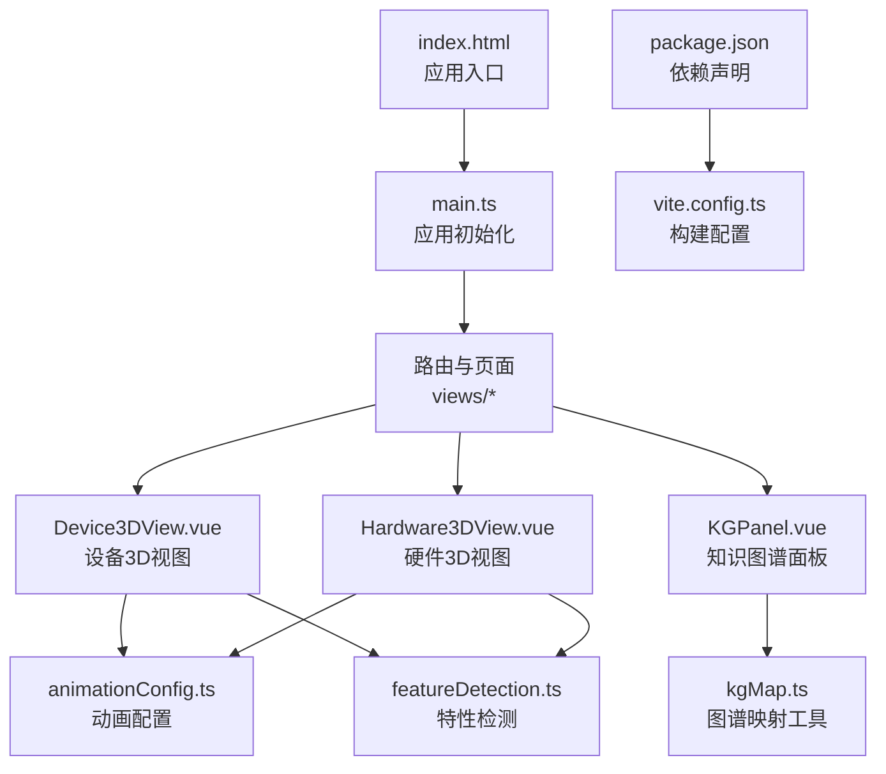
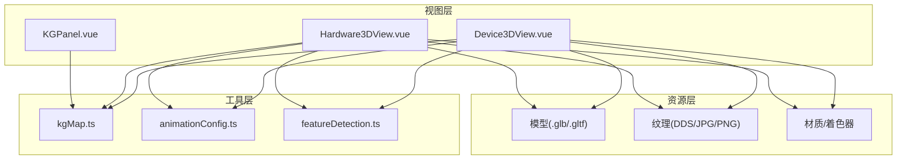
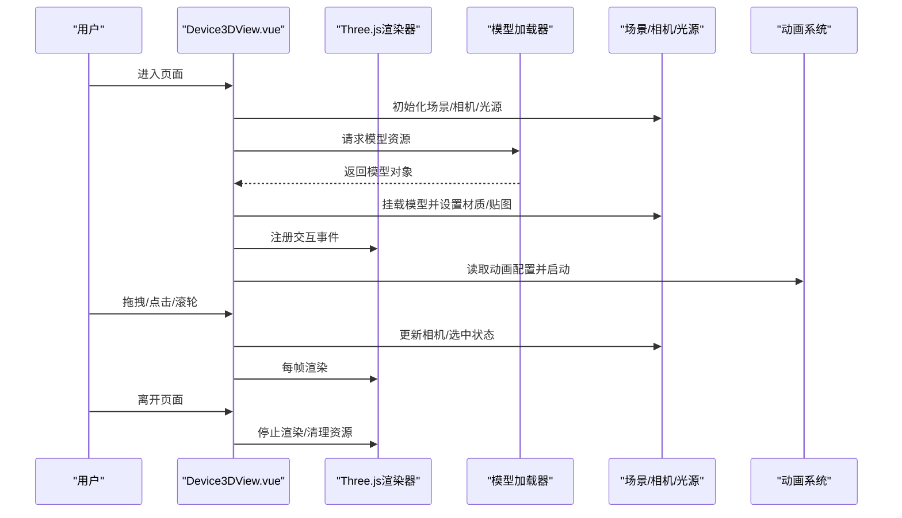
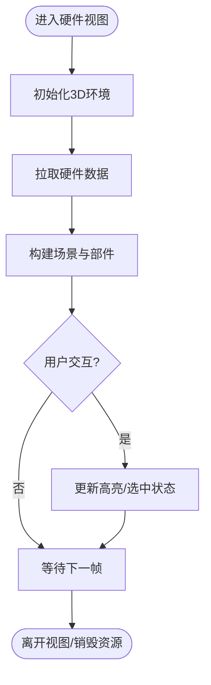
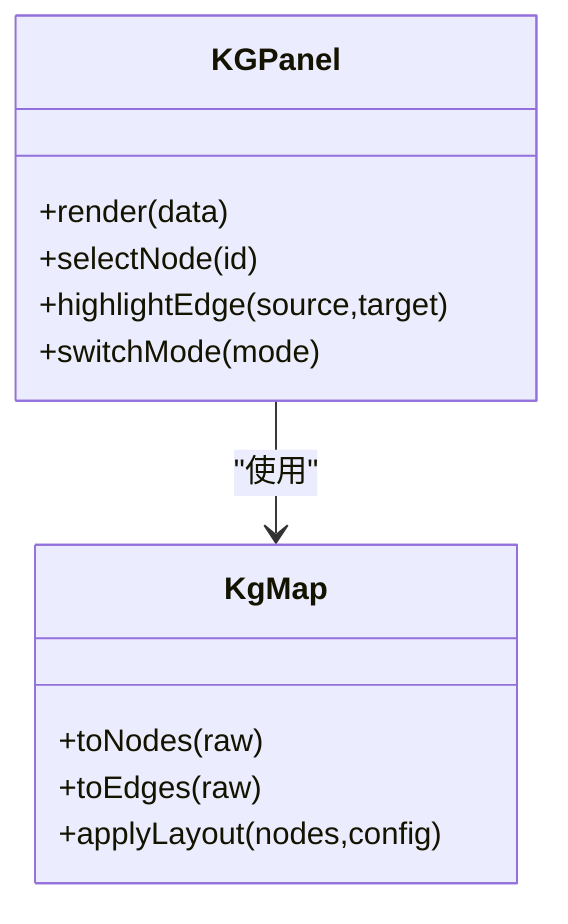
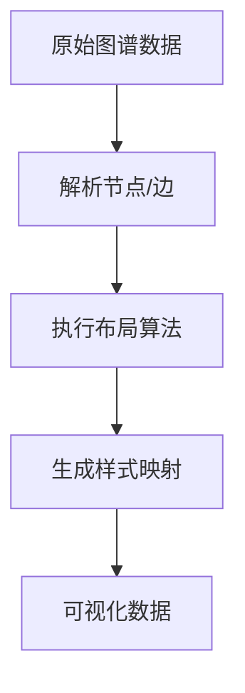
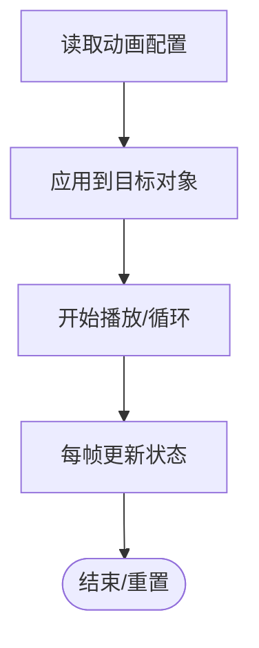
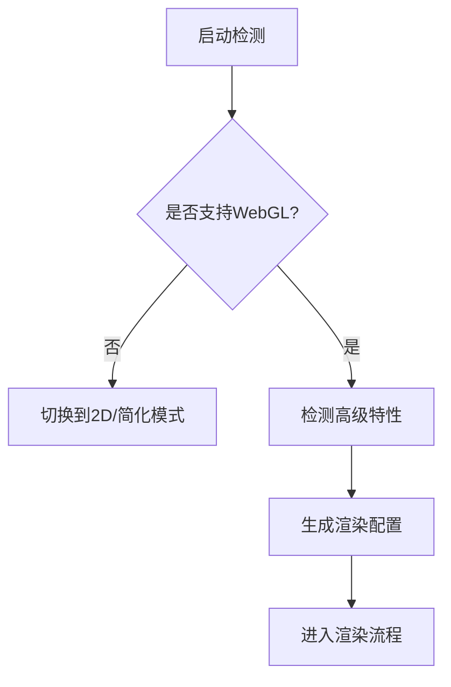
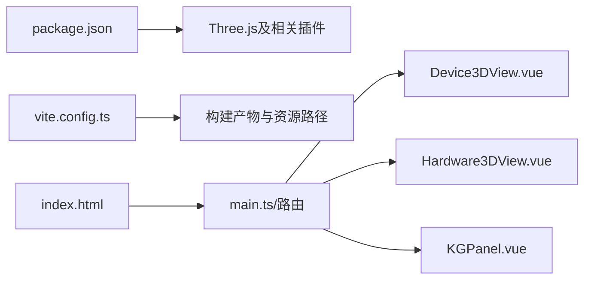

# 3D可视化系统

<cite>
**本文引用的文件**   
- [frontend/src/views/Device3DView.vue](file://frontend/src/views/Device3DView.vue)
- [frontend/src/views/Hardware3DView.vue](file://frontend/src/views/Hardware3DView.vue)
- [frontend/src/components/KGPanel.vue](file://frontend/src/components/KGPanel.vue)
- [frontend/src/utils/kgMap.ts](file://frontend/src/utils/kgMap.ts)
- [frontend/src/utils/animationConfig.ts](file://frontend/src/utils/animationConfig.ts)
- [frontend/src/utils/featureDetection.ts](file://frontend/src/utils/featureDetection.ts)
- [frontend/package.json](file://frontend/package.json)
- [frontend/vite.config.ts](file://frontend/vite.config.ts)
- [frontend/index.html](file://frontend/index.html)
</cite>

## 目录
1. [简介](#简介)
2. [项目结构](#项目结构)
3. [核心组件](#核心组件)
4. [架构总览](#架构总览)
5. [详细组件分析](#详细组件分析)
6. [依赖分析](#依赖分析)
7. [性能考虑](#性能考虑)
8. [故障排查指南](#故障排查指南)
9. [结论](#结论)
10. [附录](#附录)

## 简介
本文件面向3D可视化子系统，聚焦Three.js集成方案与WebGL渲染管线配置，覆盖模型加载、材质与光照、相机控制、交互事件、动画系统、场景优化、纹理与内存管理、3D数据可视化（图谱渲染与空间布局）、交互式3D界面与响应式视图，以及性能调优与跨浏览器兼容性策略。文档以仓库中前端代码为依据，结合工程化配置进行系统化说明。

## 项目结构
前端采用Vue 3 + Vite构建，3D相关能力集中在若干视图与工具模块：
- 视图层：设备3D视图、硬件3D视图、知识图谱面板
- 工具层：图谱映射、动画配置、特性检测
- 工程化：Vite配置、包依赖、入口HTML

图表来源
- [frontend/index.html](file://frontend/index.html)
- [frontend/src/views/Device3DView.vue](file://frontend/src/views/Device3DView.vue)
- [frontend/src/views/Hardware3DView.vue](file://frontend/src/views/Hardware3DView.vue)
- [frontend/src/components/KGPanel.vue](file://frontend/src/components/KGPanel.vue)
- [frontend/src/utils/kgMap.ts](file://frontend/src/utils/kgMap.ts)
- [frontend/src/utils/animationConfig.ts](file://frontend/src/utils/animationConfig.ts)
- [frontend/src/utils/featureDetection.ts](file://frontend/src/utils/featureDetection.ts)
- [frontend/package.json](file://frontend/package.json)
- [frontend/vite.config.ts](file://frontend/vite.config.ts)

章节来源
- [frontend/index.html](file://frontend/index.html)
- [frontend/package.json](file://frontend/package.json)
- [frontend/vite.config.ts](file://frontend/vite.config.ts)

## 核心组件
- 设备3D视图：负责设备模型的加载、材质与光照、相机与交互、动画播放与生命周期管理。
- 硬件3D视图：复用通用3D能力，侧重硬件拓扑或部件的展示与交互。
- 知识图谱面板：将图谱数据映射为可交互的2D/3D可视化元素，提供节点选择、连线高亮等交互。
- 图谱映射工具：提供数据结构到可视元素的转换逻辑，支持布局算法参数与样式映射。
- 动画配置：集中定义缓动曲线、时长、循环策略等动画元信息。
- 特性检测：在运行时判断WebGL、纹理压缩、阴影等能力，驱动降级策略。

章节来源
- [frontend/src/views/Device3DView.vue](file://frontend/src/views/Device3DView.vue)
- [frontend/src/views/Hardware3DView.vue](file://frontend/src/views/Hardware3DView.vue)
- [frontend/src/components/KGPanel.vue](file://frontend/src/components/KGPanel.vue)
- [frontend/src/utils/kgMap.ts](file://frontend/src/utils/kgMap.ts)
- [frontend/src/utils/animationConfig.ts](file://frontend/src/utils/animationConfig.ts)
- [frontend/src/utils/featureDetection.ts](file://frontend/src/utils/featureDetection.ts)

## 架构总览
3D可视化子系统遵循“视图-工具-资源”分层：
- 视图层：封装业务场景（设备、硬件），管理Three.js场景、相机、渲染器、控制器与动画循环。
- 工具层：提供图谱映射、动画配置、特性检测等通用能力。
- 资源层：模型、纹理、材质等资源通过静态资源路径或API加载，配合缓存与懒加载策略。

图表来源
- [frontend/src/views/Device3DView.vue](file://frontend/src/views/Device3DView.vue)
- [frontend/src/views/Hardware3DView.vue](file://frontend/src/views/Hardware3DView.vue)
- [frontend/src/components/KGPanel.vue](file://frontend/src/components/KGPanel.vue)
- [frontend/src/utils/kgMap.ts](file://frontend/src/utils/kgMap.ts)
- [frontend/src/utils/animationConfig.ts](file://frontend/src/utils/animationConfig.ts)
- [frontend/src/utils/featureDetection.ts](file://frontend/src/utils/featureDetection.ts)

## 详细组件分析

### 设备3D视图（Device3DView）
职责与流程：
- 初始化Three.js渲染器、场景、相机、控制器与光源。
- 加载3D模型并设置材质、贴图与法线贴图。
- 注册鼠标/触摸事件，实现点击拾取、悬停高亮、拖拽旋转与缩放。
- 启动动画循环，按配置驱动模型动画或自定义过渡。
- 监听窗口尺寸变化，更新投影矩阵与渲染分辨率。
- 在组件卸载时释放几何体、材质、纹理与事件监听，避免内存泄漏。

图表来源
- [frontend/src/views/Device3DView.vue](file://frontend/src/views/Device3DView.vue)

章节来源
- [frontend/src/views/Device3DView.vue](file://frontend/src/views/Device3DView.vue)

### 硬件3D视图（Hardware3DView）
职责与流程：
- 复用设备视图的3D基础能力，针对硬件拓扑进行差异化展示。
- 根据数据动态生成或替换子部件，支持局部高亮与详情弹窗。
- 与后端数据联动，实时更新部件状态与连接关系。

图表来源
- [frontend/src/views/Hardware3DView.vue](file://frontend/src/views/Hardware3DView.vue)

章节来源
- [frontend/src/views/Hardware3DView.vue](file://frontend/src/views/Hardware3DView.vue)

### 知识图谱面板（KGPanel）
职责与流程：
- 接收图谱数据，调用映射工具转换为可视元素集合。
- 提供节点选择、连线过滤、搜索定位等交互。
- 可选切换2D/3D视图模式，适配不同展示需求。

图表来源
- [frontend/src/components/KGPanel.vue](file://frontend/src/components/KGPanel.vue)
- [frontend/src/utils/kgMap.ts](file://frontend/src/utils/kgMap.ts)

章节来源
- [frontend/src/components/KGPanel.vue](file://frontend/src/components/KGPanel.vue)
- [frontend/src/utils/kgMap.ts](file://frontend/src/utils/kgMap.ts)

### 图谱映射工具（kgMap）
职责与流程：
- 将原始图谱数据转换为节点与边集合。
- 应用布局算法（如力导向或网格布局）计算坐标。
- 输出样式映射（颜色、大小、标签）供视图渲染。

图表来源
- [frontend/src/utils/kgMap.ts](file://frontend/src/utils/kgMap.ts)

章节来源
- [frontend/src/utils/kgMap.ts](file://frontend/src/utils/kgMap.ts)

### 动画配置（animationConfig）
职责与流程：
- 集中管理动画类型、缓动函数、持续时间、循环策略。
- 为不同视图提供默认配置与覆盖项。
- 与视图层的动画系统对接，驱动关键帧或属性插值。

图表来源
- [frontend/src/utils/animationConfig.ts](file://frontend/src/utils/animationConfig.ts)

章节来源
- [frontend/src/utils/animationConfig.ts](file://frontend/src/utils/animationConfig.ts)

### 特性检测（featureDetection）
职责与流程：
- 检测WebGL可用性、纹理压缩格式、阴影与抗锯齿支持。
- 根据检测结果启用降级策略（如关闭阴影、降低采样率）。
- 向视图暴露能力开关，影响渲染质量与性能。

图表来源
- [frontend/src/utils/featureDetection.ts](file://frontend/src/utils/featureDetection.ts)

章节来源
- [frontend/src/utils/featureDetection.ts](file://frontend/src/utils/featureDetection.ts)

## 依赖分析
- 包依赖：Three.js及其生态（如OrbitControls、GLTFLoader、DRACOLoader等）由package.json声明，确保版本稳定与按需引入。
- 构建配置：Vite用于资源打包、静态资源路径处理与开发服务器；可按需开启预构建与分包策略。
- 入口与路由：index.html作为应用入口，路由将页面映射至具体视图组件。

图表来源
- [frontend/package.json](file://frontend/package.json)
- [frontend/vite.config.ts](file://frontend/vite.config.ts)
- [frontend/index.html](file://frontend/index.html)

章节来源
- [frontend/package.json](file://frontend/package.json)
- [frontend/vite.config.ts](file://frontend/vite.config.ts)
- [frontend/index.html](file://frontend/index.html)

## 性能考虑
- 模型与纹理
  - 使用GLB/GLTF与Draco压缩减少体积；按需加载与延迟加载大模型。
  - 纹理采用合适分辨率与压缩格式（如KTX/DDS），避免重复创建与未释放。
- 渲染管线
  - 合理设置像素比与抗锯齿等级；在低端设备上关闭阴影或降低采样。
  - 合并静态几何体，减少Draw Call；使用实例化渲染批量绘制重复对象。
- 内存管理
  - 组件卸载时显式释放Geometry、Material、Texture与EventListeners。
  - 使用对象池复用频繁创建销毁的对象（如粒子、标记点）。
- 动画与交互
  - 限制每帧计算量，避免主线程阻塞；将复杂计算移至Web Worker。
  - 节流/防抖交互事件，减少不必要的重绘。
- 资源缓存
  - 利用浏览器缓存与HTTP缓存头；对静态资源启用长缓存与版本化命名。
- 降级策略
  - 基于特性检测结果自动降级渲染质量，保证基本可用性与流畅度。

[本节为通用指导，不直接分析具体文件]

## 故障排查指南
- 黑屏或无法渲染
  - 检查WebGL是否可用与驱动版本；确认canvas尺寸非零且可见。
  - 查看控制台错误，定位资源加载失败或着色器编译错误。
- 模型显示异常
  - 校验模型坐标系与单位；检查材质贴图路径与MIME类型。
  - 确认光源方向与强度，避免全黑场景。
- 交互无响应
  - 检查射线检测层级与碰撞体；确认事件监听未被移除。
  - 验证Pointer Events与Touch Events兼容性问题。
- 性能卡顿
  - 使用性能面板分析GPU/CPU占用；识别高Draw Call与过密几何体。
  - 降低像素比、关闭不必要后处理效果。
- 内存泄漏
  - 确认组件销毁时释放所有Three.js对象与事件。
  - 监控纹理与几何体数量增长趋势。

章节来源
- [frontend/src/utils/featureDetection.ts](file://frontend/src/utils/featureDetection.ts)
- [frontend/src/views/Device3DView.vue](file://frontend/src/views/Device3DView.vue)
- [frontend/src/views/Hardware3DView.vue](file://frontend/src/views/Hardware3DView.vue)

## 结论
本3D可视化子系统以Vue 3与Three.js为核心，围绕设备与硬件场景提供完整的3D展示与交互能力。通过工具层抽象图谱映射、动画配置与特性检测，实现了良好的可扩展性与可维护性。在生产环境中，应重点关注资源压缩、渲染质量与内存管理，并结合特性检测实施降级策略，以确保跨设备与跨浏览器的稳定体验。

[本节为总结性内容，不直接分析具体文件]

## 附录
- 术语
  - Draw Call：每次渲染调用，过多会导致性能瓶颈。
  - 实例化渲染：通过一次调用绘制多个相同对象，提升性能。
  - 射线检测：从相机发射射线与场景对象求交，用于拾取交互。
- 参考实践
  - 模型与纹理：优先使用GLTF/Draco与KTX/DDS；按需加载与分片加载。
  - 交互：统一事件总线与状态机管理，避免竞态条件。
  - 动画：集中配置与回放控制，便于调试与回放。

[本节为补充信息，不直接分析具体文件]