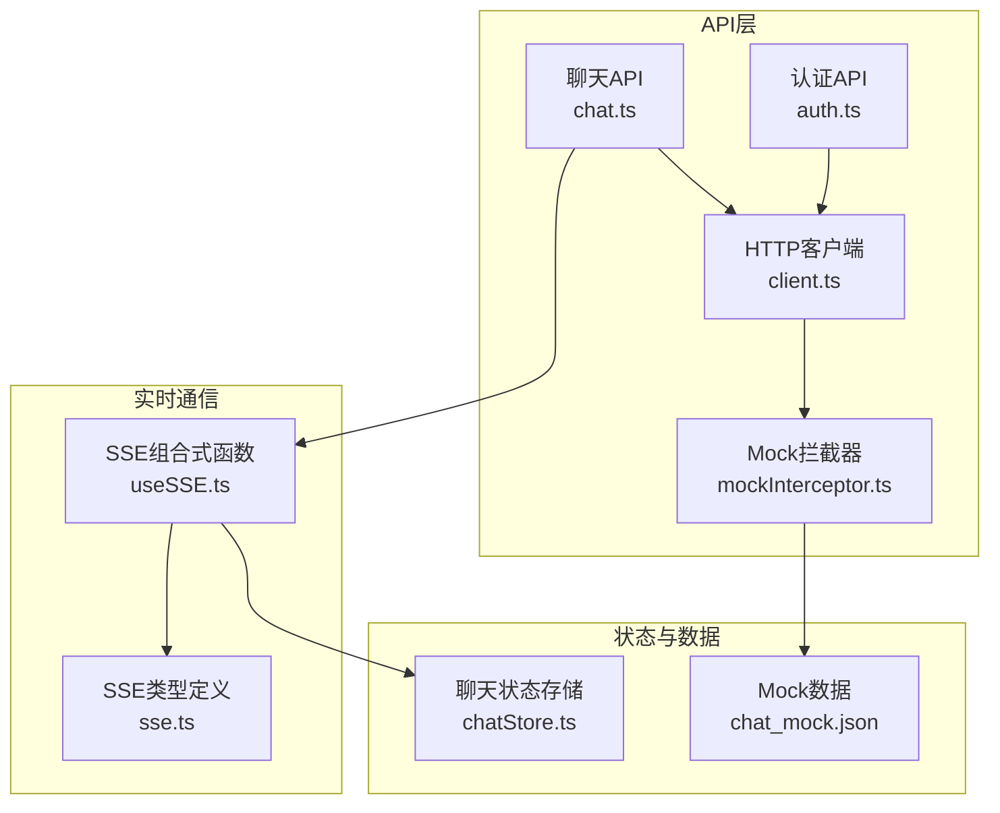
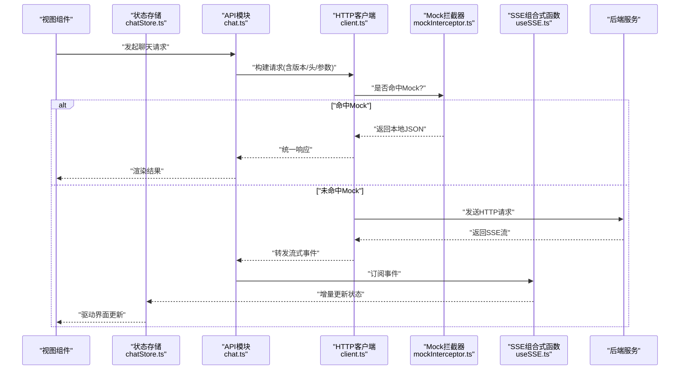
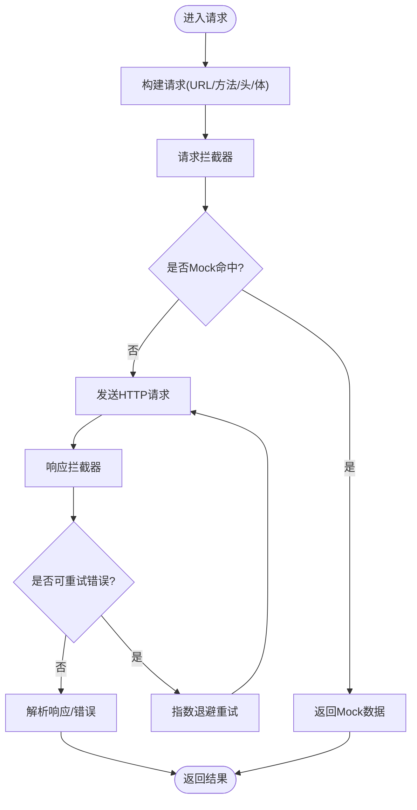
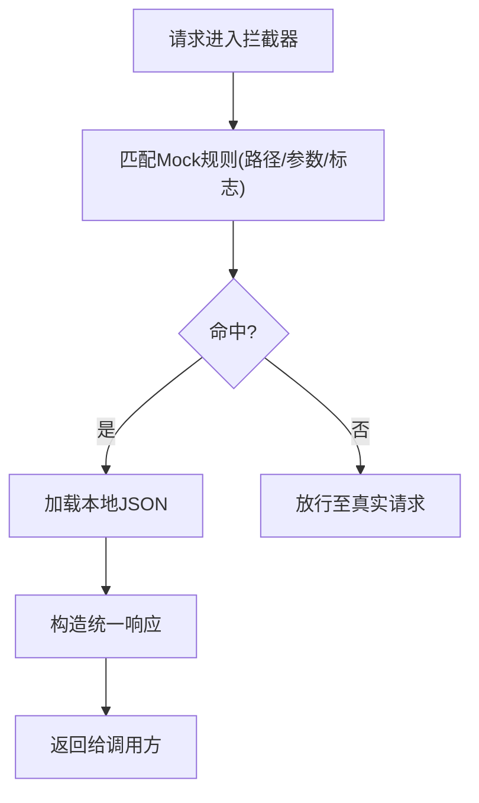
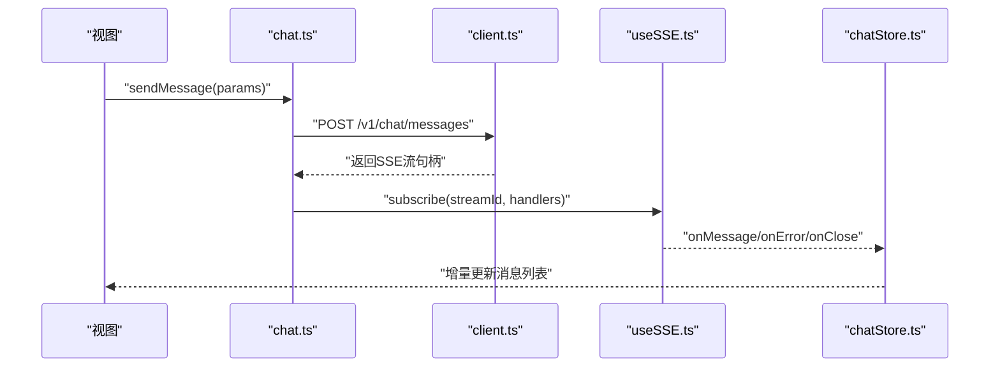
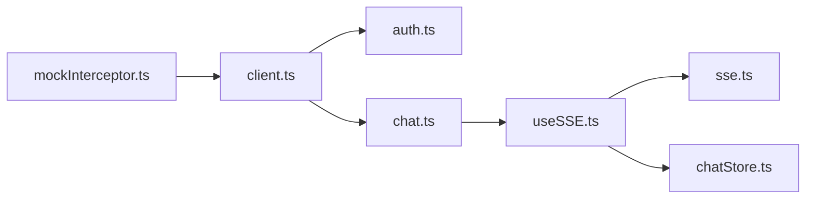

# API客户端集成

<cite>
**本文引用的文件**   
- [frontend/src/api/client.ts](file://frontend/src/api/client.ts)
- [frontend/src/api/mockInterceptor.ts](file://frontend/src/api/mockInterceptor.ts)
- [frontend/src/api/auth.ts](file://frontend/src/api/auth.ts)
- [frontend/src/api/chat.ts](file://frontend/src/api/chat.ts)
- [frontend/src/composables/useSSE.ts](file://frontend/src/composables/useSSE.ts)
- [frontend/src/types/sse.ts](file://frontend/src/types/sse.ts)
- [frontend/src/stores/chatStore.ts](file://frontend/src/stores/chatStore.ts)
- [frontend/public/mock/chat_mock.json](file://frontend/public/mock/chat_mock.json)
</cite>

## 目录
1. [简介](#简介)
2. [项目结构](#项目结构)
3. [核心组件](#核心组件)
4. [架构总览](#架构总览)
5. [详细组件分析](#详细组件分析)
6. [依赖关系分析](#依赖关系分析)
7. [性能考虑](#性能考虑)
8. [故障排查指南](#故障排查指南)
9. [结论](#结论)
10. [附录](#附录)

## 简介
本文件面向前端API客户端集成，系统化说明HTTP客户端封装、请求拦截器与响应处理机制；阐述RESTful调用模式、错误处理与重试策略；文档化SSE实时通信实现、WebSocket连接管理与消息队列处理；并覆盖API版本控制、缓存策略与离线支持。同时提供调试工具使用、Mock数据开发与接口测试方法，以及扩展新API模块与复杂网络请求场景的实践建议。

## 项目结构
前端API相关代码集中在以下位置：
- HTTP客户端与拦截器：api/client.ts、api/mockInterceptor.ts
- 业务API模块：api/auth.ts、api/chat.ts 等
- SSE能力：composables/useSSE.ts、types/sse.ts
- 状态管理：stores/chatStore.ts（用于聚合SSE事件与UI状态）
- Mock数据：public/mock/*.json

图表来源
- [frontend/src/api/client.ts](file://frontend/src/api/client.ts)
- [frontend/src/api/mockInterceptor.ts](file://frontend/src/api/mockInterceptor.ts)
- [frontend/src/api/auth.ts](file://frontend/src/api/auth.ts)
- [frontend/src/api/chat.ts](file://frontend/src/api/chat.ts)
- [frontend/src/composables/useSSE.ts](file://frontend/src/composables/useSSE.ts)
- [frontend/src/types/sse.ts](file://frontend/src/types/sse.ts)
- [frontend/src/stores/chatStore.ts](file://frontend/src/stores/chatStore.ts)
- [frontend/public/mock/chat_mock.json](file://frontend/public/mock/chat_mock.json)

章节来源
- [frontend/src/api/client.ts](file://frontend/src/api/client.ts)
- [frontend/src/api/mockInterceptor.ts](file://frontend/src/api/mockInterceptor.ts)
- [frontend/src/api/auth.ts](file://frontend/src/api/auth.ts)
- [frontend/src/api/chat.ts](file://frontend/src/api/chat.ts)
- [frontend/src/composables/useSSE.ts](file://frontend/src/composables/useSSE.ts)
- [frontend/src/types/sse.ts](file://frontend/src/types/sse.ts)
- [frontend/src/stores/chatStore.ts](file://frontend/src/stores/chatStore.ts)
- [frontend/public/mock/chat_mock.json](file://frontend/public/mock/chat_mock.json)

## 核心组件
- HTTP客户端封装
  - 统一实例配置：基础URL、超时、默认头、Content-Type等
  - 请求/响应拦截器：注入鉴权头、统一错误码映射、日志记录
  - 重试与退避：对瞬时失败进行指数退避重试，可配置最大次数与间隔
  - 取消与防抖：基于AbortController的请求取消与并发控制
- 拦截器体系
  - Mock拦截器：在开发环境或特定路由下返回本地JSON数据
  - 鉴权拦截器：自动附加Token并在必要时刷新
  - 错误拦截器：将后端错误转换为统一异常对象，便于上层处理
- RESTful调用模式
  - 资源导向的命名与路径设计
  - 幂等性保障：GET/PUT/DELETE语义一致性与去重键
  - 分页与过滤：查询参数标准化
- 错误处理与重试策略
  - 分类错误：网络错误、超时、服务端错误、业务错误
  - 重试条件：仅对可恢复错误触发，避免副作用接口重复执行
  - 退避算法：指数退避+抖动，防止雪崩
- SSE实时通信
  - 连接生命周期：建立、心跳保活、断线重连、优雅关闭
  - 事件解析：按事件类型分发到不同处理器
  - 状态同步：将流式增量更新合并到状态存储
- WebSocket连接管理（概念性）
  - 连接池与多路复用
  - 心跳与自动重连
  - 消息编解码与协议版本协商
- 消息队列处理（概念性）
  - 入队/出队顺序保证
  - 背压与限流
  - 持久化与离线队列
- API版本控制
  - URL前缀版本化：/v1/...
  - 兼容策略：向后兼容字段、弃用告警
- 缓存策略与离线支持
  - 内存缓存：LRU/TTL
  - 持久化缓存：IndexedDB/LocalStorage
  - 离线优先：先读缓存，再异步刷新
- 调试、Mock与测试
  - 浏览器开发者工具抓包
  - 本地Mock服务与静态JSON
  - 单元测试与端到端测试用例

章节来源
- [frontend/src/api/client.ts](file://frontend/src/api/client.ts)
- [frontend/src/api/mockInterceptor.ts](file://frontend/src/api/mockInterceptor.ts)
- [frontend/src/api/auth.ts](file://frontend/src/api/auth.ts)
- [frontend/src/api/chat.ts](file://frontend/src/api/chat.ts)
- [frontend/src/composables/useSSE.ts](file://frontend/src/composables/useSSE.ts)
- [frontend/src/types/sse.ts](file://frontend/src/types/sse.ts)
- [frontend/src/stores/chatStore.ts](file://frontend/src/stores/chatStore.ts)
- [frontend/public/mock/chat_mock.json](file://frontend/public/mock/chat_mock.json)

## 架构总览
下图展示了从页面到后端的全链路交互，包括HTTP请求、SSE流式响应、Mock拦截与状态同步。

图表来源
- [frontend/src/api/chat.ts](file://frontend/src/api/chat.ts)
- [frontend/src/api/client.ts](file://frontend/src/api/client.ts)
- [frontend/src/api/mockInterceptor.ts](file://frontend/src/api/mockInterceptor.ts)
- [frontend/src/composables/useSSE.ts](file://frontend/src/composables/useSSE.ts)
- [frontend/src/stores/chatStore.ts](file://frontend/src/stores/chatStore.ts)

## 详细组件分析

### HTTP客户端封装（client.ts）
- 职责
  - 创建并导出统一的HTTP实例
  - 注册全局拦截器（请求/响应）
  - 提供通用方法：get/post/put/delete/stream
  - 暴露配置项：baseURL、超时、重试次数、退避策略
- 关键特性
  - 请求拦截器：注入鉴权头、追踪ID、请求体序列化
  - 响应拦截器：统一错误码转换、成功态包装、日志埋点
  - 重试机制：针对网络错误与5xx错误进行指数退避重试
  - 取消控制：通过AbortController支持用户主动取消
- 复杂度与性能
  - 重试退避时间复杂度O(k)，k为重试次数
  - 大响应流式处理降低峰值内存占用

图表来源
- [frontend/src/api/client.ts](file://frontend/src/api/client.ts)
- [frontend/src/api/mockInterceptor.ts](file://frontend/src/api/mockInterceptor.ts)

章节来源
- [frontend/src/api/client.ts](file://frontend/src/api/client.ts)

### 请求拦截器与Mock（mockInterceptor.ts）
- 职责
  - 在请求阶段判断是否命中Mock规则（路径/域名/标志位）
  - 若命中，直接返回本地JSON，跳过真实网络请求
  - 记录Mock命中日志，便于调试
- 适用场景
  - 前端联调期快速验证
  - 无后端时的独立开发
  - 稳定性测试中的确定性输入

图表来源
- [frontend/src/api/mockInterceptor.ts](file://frontend/src/api/mockInterceptor.ts)
- [frontend/public/mock/chat_mock.json](file://frontend/public/mock/chat_mock.json)

章节来源
- [frontend/src/api/mockInterceptor.ts](file://frontend/src/api/mockInterceptor.ts)
- [frontend/public/mock/chat_mock.json](file://frontend/public/mock/chat_mock.json)

### 认证API（auth.ts）
- 职责
  - 登录、注册、刷新Token、退出等认证相关接口
  - 与鉴权拦截器协作，自动附加/刷新Token
- 关键点
  - Token失效时触发刷新流程
  - 敏感操作二次确认与幂等键
  - 错误码映射到用户友好提示

章节来源
- [frontend/src/api/auth.ts](file://frontend/src/api/auth.ts)

### 聊天API与SSE（chat.ts + useSSE.ts）
- 职责
  - chat.ts：封装聊天相关的REST接口，如会话创建、历史拉取、消息发送
  - useSSE.ts：封装SSE连接、事件订阅、断线重连、心跳保活
- 交互流程
  - 调用chat.ts发起请求
  - 服务端返回SSE流
  - useSSE.ts解析事件并推送至chatStore.ts
  - 视图组件监听store变化进行渲染

图表来源
- [frontend/src/api/chat.ts](file://frontend/src/api/chat.ts)
- [frontend/src/composables/useSSE.ts](file://frontend/src/composables/useSSE.ts)
- [frontend/src/stores/chatStore.ts](file://frontend/src/stores/chatStore.ts)

章节来源
- [frontend/src/api/chat.ts](file://frontend/src/api/chat.ts)
- [frontend/src/composables/useSSE.ts](file://frontend/src/composables/useSSE.ts)
- [frontend/src/stores/chatStore.ts](file://frontend/src/stores/chatStore.ts)

### SSE类型定义（sse.ts）
- 职责
  - 定义SSE事件类型、数据结构、状态枚举
  - 为useSSE.ts与chatStore.ts提供强类型约束
- 关键点
  - 事件名与载荷结构稳定
  - 错误事件包含诊断信息（错误码、重试建议）

章节来源
- [frontend/src/types/sse.ts](file://frontend/src/types/sse.ts)

### 状态存储（chatStore.ts）
- 职责
  - 维护聊天会话状态、消息列表、错误状态
  - 接收SSE事件并进行增量合并
  - 提供撤销/重放能力（可选）
- 关键点
  - 不可变更新策略，确保UI一致性
  - 批量更新减少重渲染

章节来源
- [frontend/src/stores/chatStore.ts](file://frontend/src/stores/chatStore.ts)

### 概念性组件：WebSocket连接管理
- 连接管理
  - 单例连接池，按通道/房间隔离
  - 自动重连与指数退避
- 消息处理
  - 协议版本协商
  - 消息编解码与校验
- 可靠性
  - 心跳检测与超时断开
  - 消息ACK与重发

[本节为概念性内容，不直接分析具体文件]

### 概念性组件：消息队列处理
- 入队/出队
  - FIFO保证，支持优先级队列
- 背压与限流
  - 根据消费者处理能力动态限速
- 持久化
  - 离线队列落盘，在线后补发

[本节为概念性内容，不直接分析具体文件]

## 依赖关系分析
- 模块耦合
  - api/* 依赖 client.ts 提供的HTTP能力
  - composables/useSSE.ts 依赖 types/sse.ts 的类型定义
  - stores/* 消费API与SSE产生的事件，驱动UI
- 外部依赖
  - 浏览器原生Fetch/SSE/WebSocket
  - 可选第三方库：Axios、EventSource、ws等

图表来源
- [frontend/src/api/client.ts](file://frontend/src/api/client.ts)
- [frontend/src/api/auth.ts](file://frontend/src/api/auth.ts)
- [frontend/src/api/chat.ts](file://frontend/src/api/chat.ts)
- [frontend/src/composables/useSSE.ts](file://frontend/src/composables/useSSE.ts)
- [frontend/src/types/sse.ts](file://frontend/src/types/sse.ts)
- [frontend/src/stores/chatStore.ts](file://frontend/src/stores/chatStore.ts)
- [frontend/src/api/mockInterceptor.ts](file://frontend/src/api/mockInterceptor.ts)

章节来源
- [frontend/src/api/client.ts](file://frontend/src/api/client.ts)
- [frontend/src/api/auth.ts](file://frontend/src/api/auth.ts)
- [frontend/src/api/chat.ts](file://frontend/src/api/chat.ts)
- [frontend/src/composables/useSSE.ts](file://frontend/src/composables/useSSE.ts)
- [frontend/src/types/sse.ts](file://frontend/src/types/sse.ts)
- [frontend/src/stores/chatStore.ts](file://frontend/src/stores/chatStore.ts)
- [frontend/src/api/mockInterceptor.ts](file://frontend/src/api/mockInterceptor.ts)

## 性能考虑
- 请求级优化
  - 合理设置超时与重试上限，避免长尾阻塞
  - 使用压缩与分块传输（流式）
- 缓存策略
  - 热点数据采用TTL与LRU策略
  - 差异更新与增量合并，减少全量刷新
- 并发控制
  - 限制并发数，避免打满带宽
  - 任务队列与优先级调度
- 内存与CPU
  - 及时释放SSE/WebSocket连接
  - 大数据集分页与虚拟滚动

[本节提供一般性指导，无需特定文件引用]

## 故障排查指南
- 常见问题定位
  - 网络错误：检查代理、跨域、证书与DNS
  - 鉴权失败：确认Token有效期与刷新逻辑
  - SSE断连：观察心跳与重连日志
  - Mock未生效：核对拦截器规则与请求路径
- 调试工具
  - 浏览器开发者工具Network面板查看请求/响应
  - Console输出统一错误对象与追踪ID
  - 使用Mock数据快速复现问题
- 日志与埋点
  - 请求/响应耗时、错误码分布
  - SSE事件统计：成功率、延迟、重连次数

章节来源
- [frontend/src/api/mockInterceptor.ts](file://frontend/src/api/mockInterceptor.ts)
- [frontend/src/composables/useSSE.ts](file://frontend/src/composables/useSSE.ts)
- [frontend/src/api/client.ts](file://frontend/src/api/client.ts)

## 结论
本方案以统一的HTTP客户端为核心，结合拦截器与Mock机制，构建了可扩展、可观测的前端API集成层。通过SSE实现低延迟的实时通信，配合状态存储完成UI增量更新。在此基础上，可平滑扩展WebSocket与消息队列能力，并完善版本控制、缓存与离线支持，以满足复杂业务场景的需求。

## 附录
- API版本控制实践
  - URL前缀版本化：/v1/...
  - 兼容性矩阵与弃用策略
- 缓存与离线
  - IndexedDB持久化与迁移策略
  - 离线优先与冲突解决
- 接口测试方法
  - 单元与集成测试：模拟网络与SSE事件
  - 端到端测试：自动化脚本驱动真实/Mock环境
- 扩展新API模块步骤
  - 新增api/*模块，复用client.ts能力
  - 定义类型与错误映射
  - 编写测试与Mock数据
  - 接入状态管理与UI

[本节为补充性内容，不直接分析具体文件]