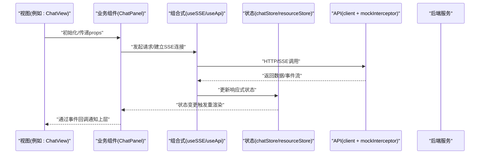
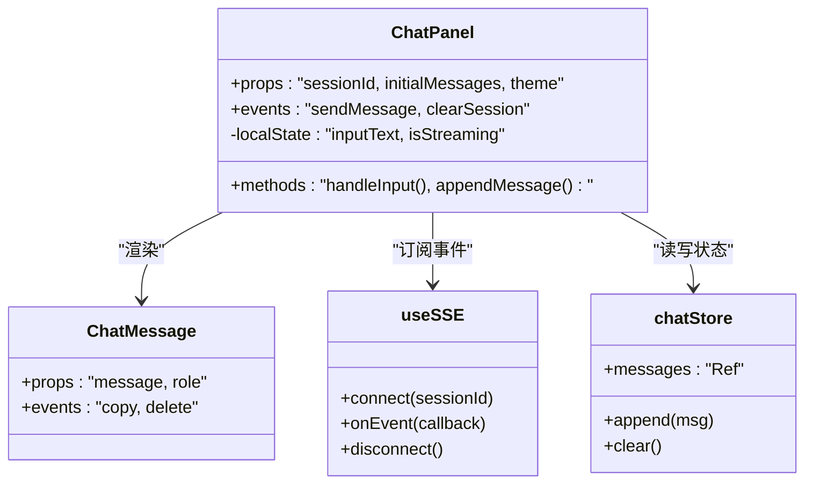
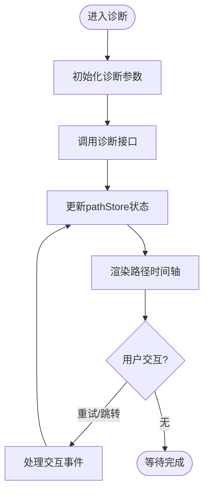
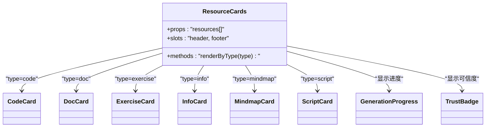
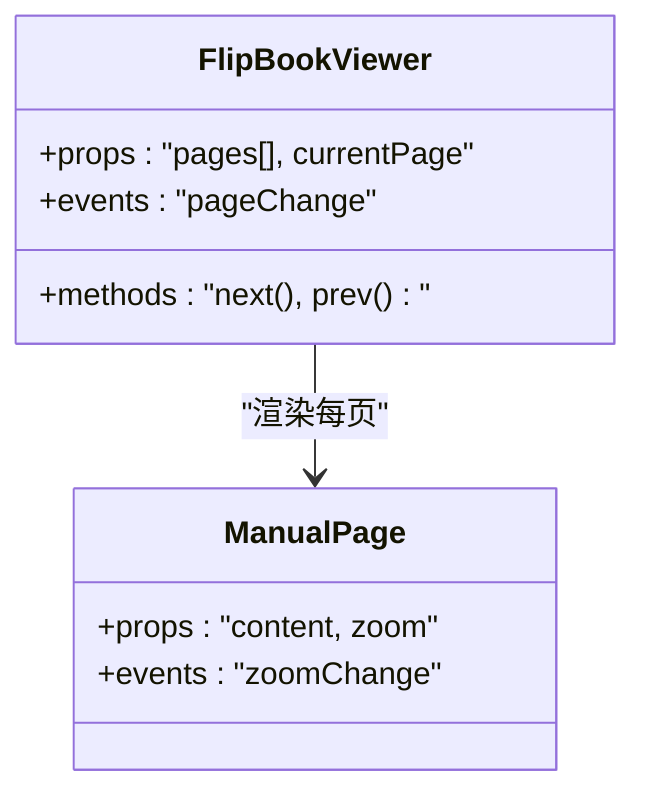
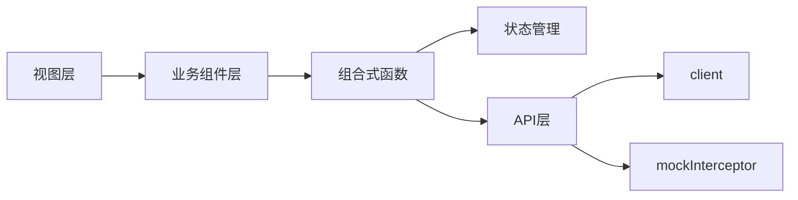

# Vue3组件架构

<cite>
**本文引用的文件**   
- [frontend/src/main.ts](file://frontend/src/main.ts)
- [frontend/src/App.vue](file://frontend/src/App.vue)
- [frontend/src/router/index.ts](file://frontend/src/router/index.ts)
- [frontend/src/components/ChatPanel.vue](file://frontend/src/components/ChatPanel.vue)
- [frontend/src/components/ChatMessage.vue](file://frontend/src/components/ChatMessage.vue)
- [frontend/src/components/DiagnosisPanel.vue](file://frontend/src/components/DiagnosisPanel.vue)
- [frontend/src/components/path/PathTimeline.vue](file://frontend/src/components/path/PathTimeline.vue)
- [frontend/src/components/resources/ResourceCards.vue](file://frontend/src/components/resources/ResourceCards.vue)
- [frontend/src/components/resources/CodeCard.vue](file://frontend/src/components/resources/CodeCard.vue)
- [frontend/src/components/resources/DocCard.vue](file://frontend/src/components/resources/DocCard.vue)
- [frontend/src/components/resources/ExerciseCard.vue](file://frontend/src/components/resources/ExerciseCard.vue)
- [frontend/src/components/resources/InfoCard.vue](file://frontend/src/components/resources/InfoCard.vue)
- [frontend/src/components/resources/MindmapCard.vue](file://frontend/src/components/resources/MindmapCard.vue)
- [frontend/src/components/resources/ScriptCard.vue](file://frontend/src/components/resources/ScriptCard.vue)
- [frontend/src/components/resources/GenerationProgress.vue](file://frontend/src/components/resources/GenerationProgress.vue)
- [frontend/src/components/resources/TrustBadge.vue](file://frontend/src/components/resources/TrustBadge.vue)
- [frontend/src/components/FlipBook/FlipBookViewer.vue](file://frontend/src/components/FlipBook/FlipBookViewer.vue)
- [frontend/src/components/FlipBook/ManualPage.vue](file://frontend/src/components/FlipBook/ManualPage.vue)
- [frontend/src/composables/useApi.ts](file://frontend/src/composables/useApi.ts)
- [frontend/src/composables/useSSE.ts](file://frontend/src/composables/useSSE.ts)
- [frontend/src/composables/useVirtualTeacher.ts](file://frontend/src/composables/useVirtualTeacher.ts)
- [frontend/src/stores/authStore.ts](file://frontend/src/stores/authStore.ts)
- [frontend/src/stores/chatStore.ts](file://frontend/src/stores/chatStore.ts)
- [frontend/src/stores/pathStore.ts](file://frontend/src/stores/pathStore.ts)
- [frontend/src/stores/resourceStore.ts](file://frontend/src/stores/resourceStore.ts)
- [frontend/src/stores/simulatorStore.ts](file://frontend/src/stores/simulatorStore.ts)
- [frontend/src/stores/userStore.ts](file://frontend/src/stores/userStore.ts)
- [frontend/src/api/client.ts](file://frontend/src/api/client.ts)
- [frontend/src/api/mockInterceptor.ts](file://frontend/src/api/mockInterceptor.ts)
- [frontend/src/types/index.ts](file://frontend/src/types/index.ts)
- [frontend/src/views/HomeView.vue](file://frontend/src/views/HomeView.vue)
- [frontend/src/views/ChatView.vue](file://frontend/src/views/ChatView.vue)
- [frontend/src/views/DiagnosisView.vue](file://frontend/src/views/DiagnosisView.vue)
- [frontend/src/views/ResourcesView.vue](file://frontend/src/views/ResourcesView.vue)
</cite>

## 目录
1. [简介](#简介)
2. [项目结构](#项目结构)
3. [核心组件](#核心组件)
4. [架构总览](#架构总览)
5. [详细组件分析](#详细组件分析)
6. [依赖关系分析](#依赖关系分析)
7. [性能考虑](#性能考虑)
8. [故障排查指南](#故障排查指南)
9. [结论](#结论)
10. [附录](#附录)

## 简介
本文件面向Vue3前端工程，系统化梳理组件分层设计、通信机制、插槽与组合式API最佳实践、命名规范与目录组织原则，并覆盖生命周期管理、错误边界处理、性能优化策略、测试方法与调试技巧。文档以实际代码为依据，结合可视化图示帮助读者快速理解整体架构与关键流程。

## 项目结构
前端采用“视图层-业务组件层-基础组件层”的分层模式：
- 视图层（views）：页面级容器，负责路由映射、布局编排与状态装配。
- 业务组件层（components）：按功能域划分，封装具体业务交互与展示逻辑。
- 基础组件层（components 子目录）：通用UI能力，如卡片、进度条、徽章等。
- 组合式函数（composables）：可复用逻辑单元，如网络请求、SSE、虚拟教师等。
- 状态管理（stores）：基于响应式状态集中管理跨组件数据。
- API层（api）：HTTP客户端、拦截器与接口定义。
- 类型定义（types）：TS类型与接口契约。

```mermaid
graph TB
subgraph "视图层"
Home["HomeView"]
ChatV["ChatView"]
DiagV["DiagnosisView"]
ResV["ResourcesView"]
end
subgraph "业务组件层"
ChatP["ChatPanel"]
Msg["ChatMessage"]
DiagP["DiagnosisPanel"]
PathT["path/PathTimeline"]
RCards["resources/ResourceCards"]
end
subgraph "基础组件层"
CodeC["resources/CodeCard"]
DocC["resources/DocCard"]
ExeC["resources/ExerciseCard"]
InfoC["resources/InfoCard"]
MindC["resources/MindmapCard"]
ScrC["resources/ScriptCard"]
GenProg["resources/GenerationProgress"]
TrustB["resources/TrustBadge"]
Flip["FlipBook/FlipBookViewer"]
Manual["FlipBook/ManualPage"]
end
subgraph "组合式函数"
useApi["useApi"]
useSSE["useSSE"]
useVT["useVirtualTeacher"]
end
subgraph "状态管理"
authS["authStore"]
chatS["chatStore"]
pathS["pathStore"]
resS["resourceStore"]
simS["simulatorStore"]
userS["userStore"]
end
subgraph "API层"
client["api/client"]
mockI["api/mockInterceptor"]
end
Home --> ChatV
Home --> DiagV
Home --> ResV
ChatV --> ChatP
ChatP --> Msg
DiagV --> DiagP
DiagP --> PathT
ResV --> RCards
RCards --> CodeC
RCards --> DocC
RCards --> ExeC
RCards --> InfoC
RCards --> MindC
RCards --> ScrC
RCards --> GenProg
RCards --> TrustB
ChatP --> useSSE
DiagP --> useApi
RCards --> useApi
RCards --> resS
ChatP --> chatS
DiagP --> pathS
AuthFlow["登录/鉴权"] --> authS
ClientCall["HTTP调用"] --> client
Mock["Mock拦截"] --> mockI
```

图表来源
- [frontend/src/views/HomeView.vue](file://frontend/src/views/HomeView.vue)
- [frontend/src/views/ChatView.vue](file://frontend/src/views/ChatView.vue)
- [frontend/src/views/DiagnosisView.vue](file://frontend/src/views/DiagnosisView.vue)
- [frontend/src/views/ResourcesView.vue](file://frontend/src/views/ResourcesView.vue)
- [frontend/src/components/ChatPanel.vue](file://frontend/src/components/ChatPanel.vue)
- [frontend/src/components/ChatMessage.vue](file://frontend/src/components/ChatMessage.vue)
- [frontend/src/components/DiagnosisPanel.vue](file://frontend/src/components/DiagnosisPanel.vue)
- [frontend/src/components/path/PathTimeline.vue](file://frontend/src/components/path/PathTimeline.vue)
- [frontend/src/components/resources/ResourceCards.vue](file://frontend/src/components/resources/ResourceCards.vue)
- [frontend/src/components/resources/CodeCard.vue](file://frontend/src/components/resources/CodeCard.vue)
- [frontend/src/components/resources/DocCard.vue](file://frontend/src/components/resources/DocCard.vue)
- [frontend/src/components/resources/ExerciseCard.vue](file://frontend/src/components/resources/ExerciseCard.vue)
- [frontend/src/components/resources/InfoCard.vue](file://frontend/src/components/resources/InfoCard.vue)
- [frontend/src/components/resources/MindmapCard.vue](file://frontend/src/components/resources/resources/MindmapCard.vue)
- [frontend/src/components/resources/ScriptCard.vue](file://frontend/src/components/resources/ScriptCard.vue)
- [frontend/src/components/resources/GenerationProgress.vue](file://frontend/src/components/resources/GenerationProgress.vue)
- [frontend/src/components/resources/TrustBadge.vue](file://frontend/src/components/resources/TrustBadge.vue)
- [frontend/src/components/FlipBook/FlipBookViewer.vue](file://frontend/src/components/FlipBook/FlipBookViewer.vue)
- [frontend/src/components/FlipBook/ManualPage.vue](file://frontend/src/components/FlipBook/ManualPage.vue)
- [frontend/src/composables/useApi.ts](file://frontend/src/composables/useApi.ts)
- [frontend/src/composables/useSSE.ts](file://frontend/src/composables/useSSE.ts)
- [frontend/src/composables/useVirtualTeacher.ts](file://frontend/src/composables/useVirtualTeacher.ts)
- [frontend/src/stores/authStore.ts](file://frontend/src/stores/authStore.ts)
- [frontend/src/stores/chatStore.ts](file://frontend/src/stores/chatStore.ts)
- [frontend/src/stores/pathStore.ts](file://frontend/src/stores/pathStore.ts)
- [frontend/src/stores/resourceStore.ts](file://frontend/src/stores/resourceStore.ts)
- [frontend/src/stores/simulatorStore.ts](file://frontend/src/stores/simulatorStore.ts)
- [frontend/src/stores/userStore.ts](file://frontend/src/stores/userStore.ts)
- [frontend/src/api/client.ts](file://frontend/src/api/client.ts)
- [frontend/src/api/mockInterceptor.ts](file://frontend/src/api/mockInterceptor.ts)

章节来源
- [frontend/src/main.ts](file://frontend/src/main.ts)
- [frontend/src/App.vue](file://frontend/src/App.vue)
- [frontend/src/router/index.ts](file://frontend/src/router/index.ts)

## 核心组件
- 聊天面板（ChatPanel）：聚合消息列表、输入区与流式渲染；通过组合式函数订阅服务端事件，驱动消息增量更新。
- 消息项（ChatMessage）：单条消息的展示与交互，支持不同角色样式与操作按钮。
- 诊断面板（DiagnosisPanel）：诊断流程编排，串联路径时间轴与资源生成任务。
- 路径时间轴（path/PathTimeline）：可视化学习路径节点与状态流转。
- 资源卡片集合（resources/ResourceCards）：统一承载多种资源卡片，按类型分发渲染。
- 资源卡片族（CodeCard/DocCard/ExerciseCard/InfoCard/MindmapCard/ScriptCard）：针对特定资源类型的展示与交互。
- 生成进度（GenerationProgress）：异步任务进度反馈与状态提示。
- 信任徽章（TrustBadge）：资源可信度标识。
- 翻页书（FlipBookViewer/ManualPage）：手册类内容的翻页阅读体验。

章节来源
- [frontend/src/components/ChatPanel.vue](file://frontend/src/components/ChatPanel.vue)
- [frontend/src/components/ChatMessage.vue](file://frontend/src/components/ChatMessage.vue)
- [frontend/src/components/DiagnosisPanel.vue](file://frontend/src/components/DiagnosisPanel.vue)
- [frontend/src/components/path/PathTimeline.vue](file://frontend/src/components/path/PathTimeline.vue)
- [frontend/src/components/resources/ResourceCards.vue](file://frontend/src/components/resources/ResourceCards.vue)
- [frontend/src/components/resources/CodeCard.vue](file://frontend/src/components/resources/CodeCard.vue)
- [frontend/src/components/resources/DocCard.vue](file://frontend/src/components/resources/DocCard.vue)
- [frontend/src/components/resources/ExerciseCard.vue](file://frontend/src/components/resources/ExerciseCard.vue)
- [frontend/src/components/resources/InfoCard.vue](file://frontend/src/components/resources/InfoCard.vue)
- [frontend/src/components/resources/MindmapCard.vue](file://frontend/src/components/resources/MindmapCard.vue)
- [frontend/src/components/resources/ScriptCard.vue](file://frontend/src/components/resources/ScriptCard.vue)
- [frontend/src/components/resources/GenerationProgress.vue](file://frontend/src/components/resources/GenerationProgress.vue)
- [frontend/src/components/resources/TrustBadge.vue](file://frontend/src/components/resources/TrustBadge.vue)
- [frontend/src/components/FlipBook/FlipBookViewer.vue](file://frontend/src/components/FlipBook/FlipBookViewer.vue)
- [frontend/src/components/FlipBook/ManualPage.vue](file://frontend/src/components/FlipBook/ManualPage.vue)

## 架构总览
下图展示了从视图到组件、组合式函数、状态管理与API层的调用链路与数据流向。

图表来源
- [frontend/src/views/ChatView.vue](file://frontend/src/views/ChatView.vue)
- [frontend/src/components/ChatPanel.vue](file://frontend/src/components/ChatPanel.vue)
- [frontend/src/composables/useSSE.ts](file://frontend/src/composables/useSSE.ts)
- [frontend/src/composables/useApi.ts](file://frontend/src/composables/useApi.ts)
- [frontend/src/stores/chatStore.ts](file://frontend/src/stores/chatStore.ts)
- [frontend/src/api/client.ts](file://frontend/src/api/client.ts)
- [frontend/src/api/mockInterceptor.ts](file://frontend/src/api/mockInterceptor.ts)

## 详细组件分析

### 聊天面板（ChatPanel）
职责与协作
- 负责消息列表渲染、用户输入处理、发送消息与接收服务端推送。
- 通过组合式函数订阅SSE事件，将新消息追加至状态，驱动视图更新。
- 向上层视图暴露事件（如清空对话、切换会话），便于页面级控制。

通信机制
- props：接收会话ID、初始消息集、主题配置等。
- events：向父组件派发“发送消息”、“清空会话”等事件。
- provide/inject：在复杂聊天场景下，可将全局聊天上下文（如当前会话、主题）注入给深层子组件。
- 组合式API：使用ref/reactive维护本地状态，watch监听外部变化，onUnmounted清理SSE连接。

图表来源
- [frontend/src/components/ChatPanel.vue](file://frontend/src/components/ChatPanel.vue)
- [frontend/src/components/ChatMessage.vue](file://frontend/src/components/ChatMessage.vue)
- [frontend/src/composables/useSSE.ts](file://frontend/src/composables/useSSE.ts)
- [frontend/src/stores/chatStore.ts](file://frontend/src/stores/chatStore.ts)

章节来源
- [frontend/src/components/ChatPanel.vue](file://frontend/src/components/ChatPanel.vue)
- [frontend/src/components/ChatMessage.vue](file://frontend/src/components/ChatMessage.vue)
- [frontend/src/composables/useSSE.ts](file://frontend/src/composables/useSSE.ts)
- [frontend/src/stores/chatStore.ts](file://frontend/src/stores/chatStore.ts)

### 诊断面板（DiagnosisPanel）与路径时间轴（PathTimeline）
职责与协作
- 诊断面板协调诊断流程，驱动路径节点推进与资源生成任务。
- 路径时间轴可视化节点状态（待开始、进行中、已完成、失败），并提供点击跳转或重试能力。

数据流
- 通过组合式函数发起诊断任务，更新pathStore中的路径状态。
- 路径时间轴读取pathStore，渲染节点与状态，并向诊断面板派发交互事件。

图表来源
- [frontend/src/components/DiagnosisPanel.vue](file://frontend/src/components/DiagnosisPanel.vue)
- [frontend/src/components/path/PathTimeline.vue](file://frontend/src/components/path/PathTimeline.vue)
- [frontend/src/stores/pathStore.ts](file://frontend/src/stores/pathStore.ts)
- [frontend/src/composables/useApi.ts](file://frontend/src/composables/useApi.ts)

章节来源
- [frontend/src/components/DiagnosisPanel.vue](file://frontend/src/components/DiagnosisPanel.vue)
- [frontend/src/components/path/PathTimeline.vue](file://frontend/src/components/path/PathTimeline.vue)
- [frontend/src/stores/pathStore.ts](file://frontend/src/stores/pathStore.ts)
- [frontend/src/composables/useApi.ts](file://frontend/src/composables/useApi.ts)

### 资源卡片族（ResourceCards与各类型卡片）
职责与协作
- ResourceCards作为容器，根据资源类型分发到对应卡片组件。
- 各类型卡片专注自身展示与交互（如代码高亮、文档预览、练习作答、思维导图查看、脚本播放）。
- 共享生成进度与信任徽章，提供一致的加载与可信度提示。

插槽与组合式API
- 使用具名插槽扩展卡片头部/尾部内容。
- 通过组合式函数获取资源详情、执行生成任务、上报信任评分。

图表来源
- [frontend/src/components/resources/ResourceCards.vue](file://frontend/src/components/resources/ResourceCards.vue)
- [frontend/src/components/resources/CodeCard.vue](file://frontend/src/components/resources/CodeCard.vue)
- [frontend/src/components/resources/DocCard.vue](file://frontend/src/components/resources/DocCard.vue)
- [frontend/src/components/resources/ExerciseCard.vue](file://frontend/src/components/resources/ExerciseCard.vue)
- [frontend/src/components/resources/InfoCard.vue](file://frontend/src/components/resources/InfoCard.vue)
- [frontend/src/components/resources/MindmapCard.vue](file://frontend/src/components/resources/MindmapCard.vue)
- [frontend/src/components/resources/ScriptCard.vue](file://frontend/src/components/resources/ScriptCard.vue)
- [frontend/src/components/resources/GenerationProgress.vue](file://frontend/src/components/resources/GenerationProgress.vue)
- [frontend/src/components/resources/TrustBadge.vue](file://frontend/src/components/resources/TrustBadge.vue)

章节来源
- [frontend/src/components/resources/ResourceCards.vue](file://frontend/src/components/resources/ResourceCards.vue)
- [frontend/src/components/resources/CodeCard.vue](file://frontend/src/components/resources/CodeCard.vue)
- [frontend/src/components/resources/DocCard.vue](file://frontend/src/components/resources/DocCard.vue)
- [frontend/src/components/resources/ExerciseCard.vue](file://frontend/src/components/resources/ExerciseCard.vue)
- [frontend/src/components/resources/InfoCard.vue](file://frontend/src/components/resources/InfoCard.vue)
- [frontend/src/components/resources/MindmapCard.vue](file://frontend/src/components/resources/MindmapCard.vue)
- [frontend/src/components/resources/ScriptCard.vue](file://frontend/src/components/resources/ScriptCard.vue)
- [frontend/src/components/resources/GenerationProgress.vue](file://frontend/src/components/resources/GenerationProgress.vue)
- [frontend/src/components/resources/TrustBadge.vue](file://frontend/src/components/resources/TrustBadge.vue)

### 翻页书（FlipBookViewer/ManualPage）
职责与协作
- FlipBookViewer负责翻页动画与页面容器管理。
- ManualPage渲染单个手册页内容，支持缩放与导航。

图表来源
- [frontend/src/components/FlipBook/FlipBookViewer.vue](file://frontend/src/components/FlipBook/FlipBookViewer.vue)
- [frontend/src/components/FlipBook/ManualPage.vue](file://frontend/src/components/FlipBook/ManualPage.vue)

章节来源
- [frontend/src/components/FlipBook/FlipBookViewer.vue](file://frontend/src/components/FlipBook/FlipBookViewer.vue)
- [frontend/src/components/FlipBook/ManualPage.vue](file://frontend/src/components/FlipBook/ManualPage.vue)

## 依赖关系分析
- 视图依赖业务组件，业务组件依赖组合式函数与状态管理。
- 组合式函数依赖API层，API层通过client与mockInterceptor进行请求与拦截。
- 状态管理模块被多个业务组件共享，确保跨组件数据一致性。

图表来源
- [frontend/src/views/HomeView.vue](file://frontend/src/views/HomeView.vue)
- [frontend/src/views/ChatView.vue](file://frontend/src/views/ChatView.vue)
- [frontend/src/views/DiagnosisView.vue](file://frontend/src/views/DiagnosisView.vue)
- [frontend/src/views/ResourcesView.vue](file://frontend/src/views/ResourcesView.vue)
- [frontend/src/components/ChatPanel.vue](file://frontend/src/components/ChatPanel.vue)
- [frontend/src/components/DiagnosisPanel.vue](file://frontend/src/components/DiagnosisPanel.vue)
- [frontend/src/components/resources/ResourceCards.vue](file://frontend/src/components/resources/ResourceCards.vue)
- [frontend/src/composables/useApi.ts](file://frontend/src/composables/useApi.ts)
- [frontend/src/composables/useSSE.ts](file://frontend/src/composables/useSSE.ts)
- [frontend/src/stores/chatStore.ts](file://frontend/src/stores/chatStore.ts)
- [frontend/src/stores/pathStore.ts](file://frontend/src/stores/pathStore.ts)
- [frontend/src/stores/resourceStore.ts](file://frontend/src/stores/resourceStore.ts)
- [frontend/src/api/client.ts](file://frontend/src/api/client.ts)
- [frontend/src/api/mockInterceptor.ts](file://frontend/src/api/mockInterceptor.ts)

章节来源
- [frontend/src/router/index.ts](file://frontend/src/router/index.ts)
- [frontend/src/types/index.ts](file://frontend/src/types/index.ts)

## 性能考虑
- 列表渲染优化：对长列表使用key稳定标识，避免不必要的重渲染；必要时使用虚拟滚动。
- 计算属性缓存：将复杂计算放入computed，减少重复计算。
- 懒加载与按需引入：图片、视频、第三方库按需加载，降低首屏体积。
- SSE与事件去抖：对高频事件进行节流/防抖，避免频繁状态更新。
- 组件拆分与惰性加载：将大组件拆分为子组件，并使用动态导入实现路由级或条件级懒加载。
- 状态粒度控制：将状态细化到最小必要范围，避免全局状态过大导致全量重渲染。

[本节为通用指导，不直接分析具体文件]

## 故障排查指南
- 网络问题定位：检查API层拦截器日志与错误码，确认mock是否启用。
- SSE连接异常：确认连接建立与断开时机，监听error/close事件并实现重连策略。
- 状态不一致：对比stores中状态与组件本地状态，使用watch调试差异来源。
- 插槽未生效：检查具名插槽名称与父组件slot绑定是否一致。
- 事件冒泡冲突：在子组件中明确emit事件，避免与父组件默认行为冲突。

章节来源
- [frontend/src/api/mockInterceptor.ts](file://frontend/src/api/mockInterceptor.ts)
- [frontend/src/composables/useSSE.ts](file://frontend/src/composables/useSSE.ts)
- [frontend/src/stores/chatStore.ts](file://frontend/src/stores/chatStore.ts)
- [frontend/src/stores/pathStore.ts](file://frontend/src/stores/pathStore.ts)
- [frontend/src/stores/resourceStore.ts](file://frontend/src/stores/resourceStore.ts)

## 结论
本项目采用清晰的分层架构与组合式API范式，通过状态管理与组合式函数解耦业务逻辑与视图渲染，配合统一的API层与拦截器保障前后端交互稳定性。遵循本文的命名规范、目录组织与最佳实践，有助于提升组件的可复用性、可维护性与性能表现。

## 附录

### 组件分层与职责划分
- 基础组件：纯展示与简单交互，无业务耦合，适合跨页面复用。
- 业务组件：封装领域内交互与数据流，依赖组合式函数与状态管理。
- 页面组件：负责路由与布局，组装业务组件，协调跨域状态。

### 组件通信机制
- props：自上而下传递不可变数据，保持单向数据流。
- events：自下而上通知父组件，避免子组件直接修改父状态。
- provide/inject：在深层嵌套时传递上下文（如主题、语言、会话信息）。
- 组合式函数：抽取跨组件复用的逻辑（网络、SSE、动画等）。
- 状态管理：集中管理跨组件共享状态，保证一致性。

### 插槽使用最佳实践
- 优先使用具名插槽与作用域插槽，增强组件扩展性。
- 为插槽提供默认内容与类型约束，提升可用性。
- 在基础组件中预留插槽点，便于业务定制。

### 组合式API最佳实践
- 将副作用与生命周期管理封装在组合式函数中，保持组件简洁。
- 使用ref/reactive管理状态，computed派生值，watch监听变化。
- 在onUnmounted中清理定时器、事件监听与网络连接。

### 命名规范与目录组织
- 组件命名：PascalCase，语义化命名，体现职责与领域。
- 目录组织：按功能域划分（如resources、path、FlipBook），基础组件独立存放。
- 文件组织：每个组件一个文件，配套类型与样式就近管理。
- 组合式函数：use前缀，单一职责，可独立测试。

### 生命周期管理与错误边界
- 合理使用生命周期钩子，避免在setup中执行耗时操作。
- 使用错误边界组件捕获渲染错误，提供降级展示与重试入口。
- 对异步操作增加超时与重试策略，提升用户体验。

### 性能优化策略
- 列表虚拟化、图片懒加载、资源按需引入。
- 计算属性缓存、事件节流/防抖、状态细粒度更新。
- 组件懒加载与路由级代码分割。

### 测试方法与调试技巧
- 单元测试：对组合式函数与工具方法进行断言，模拟网络与SSE事件。
- 组件测试：使用mount/shallowMount验证props/events与插槽渲染。
- 集成测试：端到端验证关键业务流程（登录、诊断、资源生成）。
- 调试技巧：浏览器开发者工具观察状态树与事件流，打印关键日志。

### 创建可复用UI组件与业务逻辑组件
- UI组件：关注展示与交互，提供清晰的props与插槽接口。
- 业务逻辑组件：封装领域流程，组合状态与API调用，对外暴露事件与回调。
- 文档化：为每个组件编写使用说明、示例与注意事项。