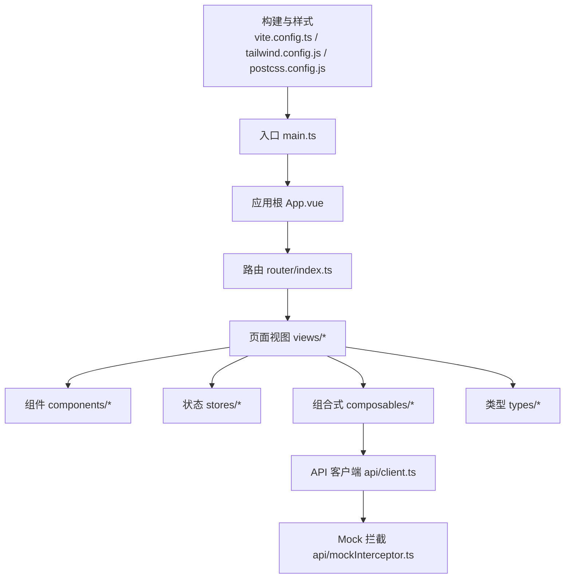
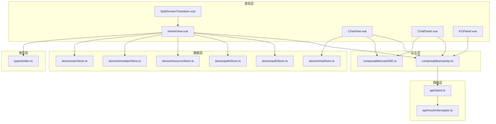
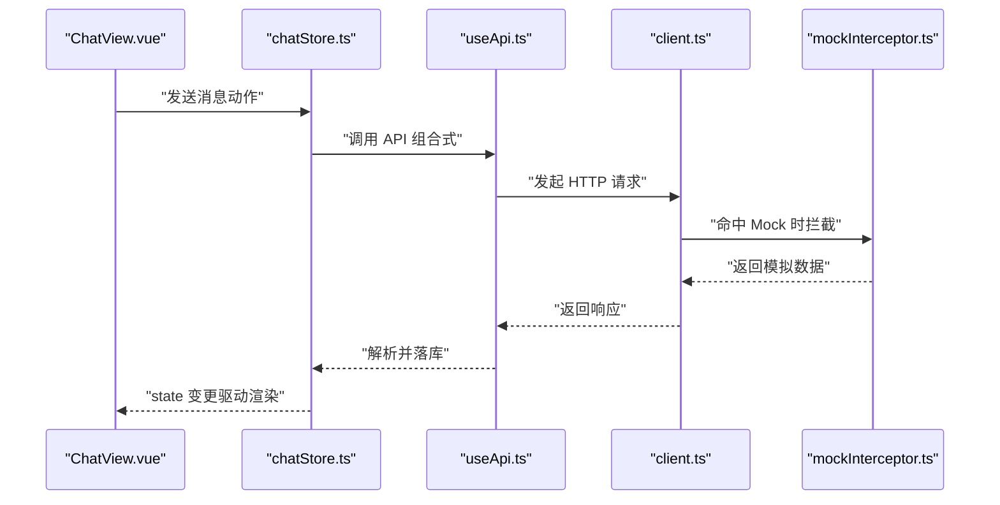
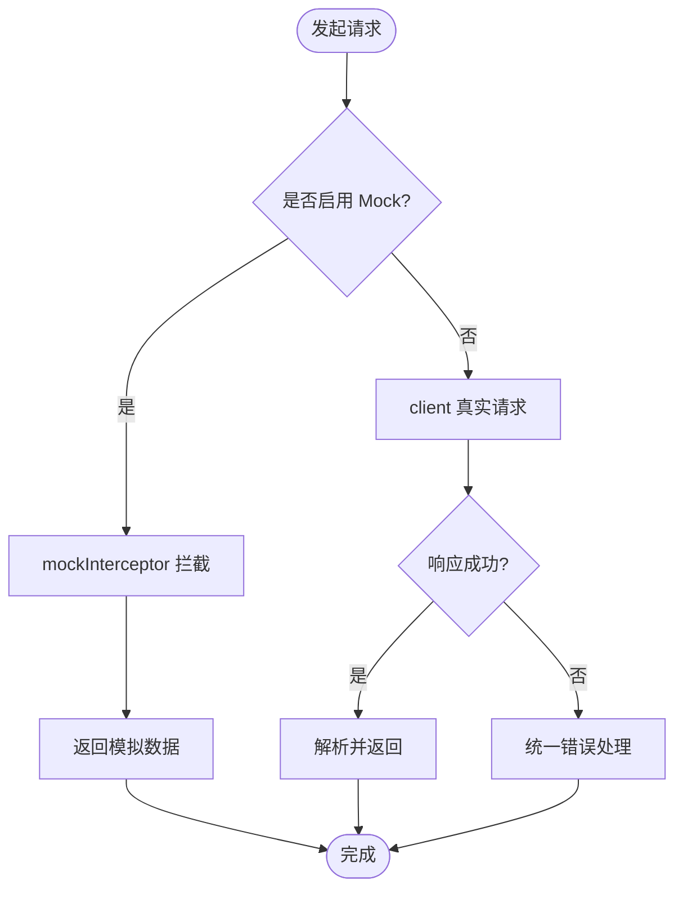
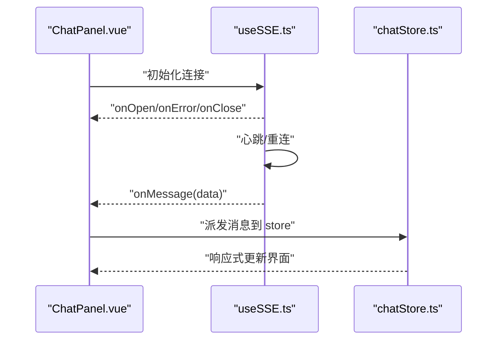
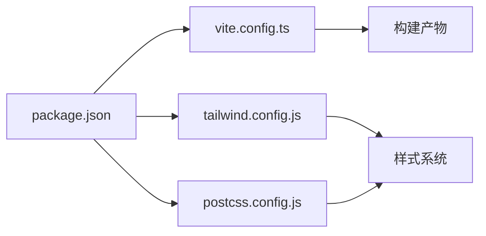

# 前端应用架构

<cite>
**本文引用的文件**   
- [frontend/src/main.ts](file://frontend/src/main.ts)
- [frontend/src/App.vue](file://frontend/src/App.vue)
- [frontend/src/router/index.ts](file://frontend/src/router/index.ts)
- [frontend/tailwind.config.js](file://frontend/tailwind.config.js)
- [frontend/postcss.config.js](file://frontend/postcss.config.js)
- [frontend/vite.config.ts](file://frontend/vite.config.ts)
- [frontend/package.json](file://frontend/package.json)
- [frontend/src/api/client.ts](file://frontend/src/api/client.ts)
- [frontend/src/api/mockInterceptor.ts](file://frontend/src/api/mockInterceptor.ts)
- [frontend/src/composables/useApi.ts](file://frontend/src/composables/useApi.ts)
- [frontend/src/composables/useSSE.ts](file://frontend/src/composables/useSSE.ts)
- [frontend/src/stores/authStore.ts](file://frontend/src/stores/authStore.ts)
- [frontend/src/stores/chatStore.ts](file://frontend/src/stores/chatStore.ts)
- [frontend/src/stores/pathStore.ts](file://frontend/src/stores/pathStore.ts)
- [frontend/src/stores/resourceStore.ts](file://frontend/src/stores/resourceStore.ts)
- [frontend/src/stores/simulatorStore.ts](file://frontend/src/stores/simulatorStore.ts)
- [frontend/src/stores/userStore.ts](file://frontend/src/stores/userStore.ts)
- [frontend/src/types/index.ts](file://frontend/src/types/index.ts)
- [frontend/src/views/HomeView.vue](file://frontend/src/views/HomeView.vue)
- [frontend/src/views/ChatView.vue](file://frontend/src/views/ChatView.vue)
- [frontend/src/components/ChatPanel.vue](file://frontend/src/components/ChatPanel.vue)
- [frontend/src/components/KGPanel.vue](file://frontend/src/components/KGPanel.vue)
- [frontend/src/components/SplitScreenTransition.vue](file://frontend/src/components/SplitScreenTransition.vue)
</cite>

## 目录
1. [简介](#简介)
2. [项目结构](#项目结构)
3. [核心组件](#核心组件)
4. [架构总览](#架构总览)
5. [详细组件分析](#详细组件分析)
6. [依赖分析](#依赖分析)
7. [性能考虑](#性能考虑)
8. [故障排查指南](#故障排查指南)
9. [结论](#结论)
10. [附录](#附录)

## 简介
本文件面向 Socrates-Cube 前端工程，系统化梳理基于 Vue3 + TypeScript + Tailwind CSS 的架构设计与实现规范。文档覆盖：
- 技术栈选择与工程化配置（Vite、Tailwind、PostCSS、TypeScript）
- 状态管理（Pinia stores）、路由与页面组织
- API 客户端封装与 Mock 拦截策略
- 实时通信（SSE）集成模式
- 3D 可视化系统集成思路与入口
- 响应式布局与主题定制方法
- 组件复用模式、样式系统与可维护性
- 性能优化、错误处理与用户体验提升
- 如何扩展新页面视图与通用组件

## 项目结构
前端位于 frontend 子目录，采用按“能力域”划分的目录组织方式：
- src/api：HTTP 客户端与各业务接口定义
- src/composables：组合式函数（API 调用、SSE 等）
- src/stores：Pinia 状态模块
- src/components：可复用 UI 组件
- src/views：页面级视图
- src/types：全局类型定义
- 根配置：vite.config.ts、tailwind.config.js、postcss.config.js、package.json

图表来源
- [frontend/src/main.ts](file://frontend/src/main.ts)
- [frontend/src/App.vue](file://frontend/src/App.vue)
- [frontend/src/router/index.ts](file://frontend/src/router/index.ts)
- [frontend/vite.config.ts](file://frontend/vite.config.ts)
- [frontend/tailwind.config.js](file://frontend/tailwind.config.js)
- [frontend/postcss.config.js](file://frontend/postcss.config.js)

章节来源
- [frontend/src/main.ts](file://frontend/src/main.ts)
- [frontend/src/App.vue](file://frontend/src/App.vue)
- [frontend/src/router/index.ts](file://frontend/src/router/index.ts)
- [frontend/vite.config.ts](file://frontend/vite.config.ts)
- [frontend/tailwind.config.js](file://frontend/tailwind.config.js)
- [frontend/postcss.config.js](file://frontend/postcss.config.js)
- [frontend/package.json](file://frontend/package.json)

## 核心组件
- 应用壳与路由挂载
  - 入口初始化应用、挂载根组件与插件（如路由、状态管理等）
  - 根组件承载全局布局、导航与过渡效果
- 页面视图
  - 首页、聊天、路径、资源、模拟器、3D 设备/硬件视图等
- 通用组件
  - 聊天面板、知识图谱面板、分屏过渡、骨架屏、空态、错误态等

章节来源
- [frontend/src/main.ts](file://frontend/src/main.ts)
- [frontend/src/App.vue](file://frontend/src/App.vue)
- [frontend/src/views/HomeView.vue](file://frontend/src/views/HomeView.vue)
- [frontend/src/components/ChatPanel.vue](file://frontend/src/components/ChatPanel.vue)
- [frontend/src/components/KGPanel.vue](file://frontend/src/components/KGPanel.vue)
- [frontend/src/components/SplitScreenTransition.vue](file://frontend/src/components/SplitScreenTransition.vue)

## 架构总览
整体分层：
- 表现层：Vue 单文件组件（views + components）
- 交互层：组合式函数（useApi、useSSE）
- 数据层：Pinia stores（auth、chat、path、resource、simulator、user）
- 网络层：统一 HTTP 客户端与 Mock 拦截器
- 类型层：集中类型定义
- 构建与样式：Vite + Tailwind + PostCSS

图表来源
- [frontend/src/views/HomeView.vue](file://frontend/src/views/HomeView.vue)
- [frontend/src/views/ChatView.vue](file://frontend/src/views/ChatView.vue)
- [frontend/src/components/ChatPanel.vue](file://frontend/src/components/ChatPanel.vue)
- [frontend/src/components/KGPanel.vue](file://frontend/src/components/KGPanel.vue)
- [frontend/src/components/SplitScreenTransition.vue](file://frontend/src/components/SplitScreenTransition.vue)
- [frontend/src/composables/useApi.ts](file://frontend/src/composables/useApi.ts)
- [frontend/src/composables/useSSE.ts](file://frontend/src/composables/useSSE.ts)
- [frontend/src/stores/authStore.ts](file://frontend/src/stores/authStore.ts)
- [frontend/src/stores/chatStore.ts](file://frontend/src/stores/chatStore.ts)
- [frontend/src/stores/pathStore.ts](file://frontend/src/stores/pathStore.ts)
- [frontend/src/stores/resourceStore.ts](file://frontend/src/stores/resourceStore.ts)
- [frontend/src/stores/simulatorStore.ts](file://frontend/src/stores/simulatorStore.ts)
- [frontend/src/stores/userStore.ts](file://frontend/src/stores/userStore.ts)
- [frontend/src/api/client.ts](file://frontend/src/api/client.ts)
- [frontend/src/api/mockInterceptor.ts](file://frontend/src/api/mockInterceptor.ts)
- [frontend/src/types/index.ts](file://frontend/src/types/index.ts)

## 详细组件分析

### 路由与页面组织
- 路由职责：集中声明页面路由、懒加载与守卫逻辑（如需鉴权）
- 页面组织：按功能域划分 views，每个视图聚焦单一场景
- 推荐实践：
  - 使用异步组件按需加载
  - 在路由元信息中描述权限、标题、图标等
  - 对需要登录的路由添加前置守卫

章节来源
- [frontend/src/router/index.ts](file://frontend/src/router/index.ts)
- [frontend/src/views/HomeView.vue](file://frontend/src/views/HomeView.vue)
- [frontend/src/views/ChatView.vue](file://frontend/src/views/ChatView.vue)

### 状态管理模式（Pinia）
- 设计原则：
  - 以领域为中心拆分 store（认证、聊天、路径、资源、模拟器、用户）
  - 将副作用（网络请求、事件监听）集中在组合式函数或 store actions 中
  - 保持 state 最小化，派生状态通过 getters 计算
- 典型流程：
  - 组件触发 action -> 调用 useApi -> 更新 store -> 视图响应式更新

图表来源
- [frontend/src/views/ChatView.vue](file://frontend/src/views/ChatView.vue)
- [frontend/src/stores/chatStore.ts](file://frontend/src/stores/chatStore.ts)
- [frontend/src/composables/useApi.ts](file://frontend/src/composables/useApi.ts)
- [frontend/src/api/client.ts](file://frontend/src/api/client.ts)
- [frontend/src/api/mockInterceptor.ts](file://frontend/src/api/mockInterceptor.ts)

章节来源
- [frontend/src/stores/authStore.ts](file://frontend/src/stores/authStore.ts)
- [frontend/src/stores/chatStore.ts](file://frontend/src/stores/chatStore.ts)
- [frontend/src/stores/pathStore.ts](file://frontend/src/stores/pathStore.ts)
- [frontend/src/stores/resourceStore.ts](file://frontend/src/stores/resourceStore.ts)
- [frontend/src/stores/simulatorStore.ts](file://frontend/src/stores/simulatorStore.ts)
- [frontend/src/stores/userStore.ts](file://frontend/src/stores/userStore.ts)
- [frontend/src/composables/useApi.ts](file://frontend/src/composables/useApi.ts)

### API 客户端与 Mock 拦截
- 统一客户端：
  - 封装基础 URL、超时、重试、错误码处理、鉴权头注入
  - 提供类型安全的请求方法
- Mock 策略：
  - 通过拦截器在开发环境或特定条件下返回模拟数据
  - 便于联调与离线演示

图表来源
- [frontend/src/api/client.ts](file://frontend/src/api/client.ts)
- [frontend/src/api/mockInterceptor.ts](file://frontend/src/api/mockInterceptor.ts)

章节来源
- [frontend/src/api/client.ts](file://frontend/src/api/client.ts)
- [frontend/src/api/mockInterceptor.ts](file://frontend/src/api/mockInterceptor.ts)
- [frontend/src/composables/useApi.ts](file://frontend/src/composables/useApi.ts)

### 实时通信（SSE）
- 使用组合式函数封装 SSE 连接生命周期：建立、心跳、重连、断线提示、消息分发
- 与 store 联动：收到服务端推送后更新对应状态
- 注意事项：
  - 组件销毁时主动关闭连接，避免内存泄漏
  - 对重复订阅进行去抖/节流控制

图表来源
- [frontend/src/composables/useSSE.ts](file://frontend/src/composables/useSSE.ts)
- [frontend/src/components/ChatPanel.vue](file://frontend/src/components/ChatPanel.vue)
- [frontend/src/stores/chatStore.ts](file://frontend/src/stores/chatStore.ts)

章节来源
- [frontend/src/composables/useSSE.ts](file://frontend/src/composables/useSSE.ts)
- [frontend/src/components/ChatPanel.vue](file://frontend/src/components/ChatPanel.vue)
- [frontend/src/stores/chatStore.ts](file://frontend/src/stores/chatStore.ts)

### 3D 可视化系统集成
- 集成思路：
  - 在 3D 视图中引入 3D 引擎 SDK（例如 Three.js 或专用 WebSDK）
  - 将模型加载、相机控制、交互事件封装为独立组件
  - 通过 store 同步 3D 场景状态（选中对象、视角参数等）
- 入口视图：
  - 设备 3D 视图、硬件 3D 视图作为具体落地页
- 建议：
  - 使用懒加载与资源预取降低首屏压力
  - 对大模型进行 Draco/GLTF 压缩与分片加载

章节来源
- [frontend/src/views/Device3DView.vue](file://frontend/src/views/Device3DView.vue)
- [frontend/src/views/Hardware3DView.vue](file://frontend/src/views/Hardware3DView.vue)

### 知识图谱与可视化
- KG 面板负责渲染知识图谱节点与关系，支持缩放、拖拽、点击交互
- 与后端图谱数据对接，结合 store 缓存与增量更新
- 性能要点：
  - 节点数量较大时使用虚拟渲染或层级聚合
  - 事件委托减少监听器数量

章节来源
- [frontend/src/components/KGPanel.vue](file://frontend/src/components/KGPanel.vue)

### 分屏与过渡
- 分屏过渡组件用于左右/上下分栏布局切换，配合路由或状态驱动
- 适用于对比展示、教学步骤引导等场景

章节来源
- [frontend/src/components/SplitScreenTransition.vue](file://frontend/src/components/SplitScreenTransition.vue)

## 依赖分析
- 运行时依赖
  - Vue3 生态：vue-router、pinia、@vueuse/core（可选）
  - 样式：tailwindcss、autoprefixer、postcss
  - 构建：vite、typescript
- 关键配置文件
  - vite.config.ts：别名、代理、插件、构建优化
  - tailwind.config.js：主题色、字体、断点、自定义工具类
  - postcss.config.js：Tailwind 与 Autoprefixer 管线
  - package.json：脚本命令与依赖版本

图表来源
- [frontend/package.json](file://frontend/package.json)
- [frontend/vite.config.ts](file://frontend/vite.config.ts)
- [frontend/tailwind.config.js](file://frontend/tailwind.config.js)
- [frontend/postcss.config.js](file://frontend/postcss.config.js)

章节来源
- [frontend/package.json](file://frontend/package.json)
- [frontend/vite.config.ts](file://frontend/vite.config.ts)
- [frontend/tailwind.config.js](file://frontend/tailwind.config.js)
- [frontend/postcss.config.js](file://frontend/postcss.config.js)

## 性能考虑
- 代码分割与懒加载
  - 路由级与组件级异步加载，减少首屏体积
- 资源优化
  - 图片/视频压缩与懒加载；3D 模型使用 glTF/Draco
- 渲染优化
  - 列表虚拟化、防抖/节流、避免不必要的 re-render
- 网络优化
  - 请求合并、缓存策略、错误重试与退避
- 构建优化
  - Tree-shaking、生产环境移除调试日志、开启 gzip/brotli

[本节为通用指导，不直接分析具体文件]

## 故障排查指南
- 常见问题定位
  - 网络请求失败：检查 client 错误处理与 mock 开关
  - SSE 断线：查看 useSSE 重连逻辑与 onerror 回调
  - 状态不同步：确认 store actions 与组件订阅是否正确
  - 样式未生效：检查 Tailwind 扫描路径与 PostCSS 插件顺序
- 调试技巧
  - 使用浏览器开发者工具 Network/Performance/Console
  - 在关键路径打印结构化日志（注意生产环境脱敏）

章节来源
- [frontend/src/api/client.ts](file://frontend/src/api/client.ts)
- [frontend/src/api/mockInterceptor.ts](file://frontend/src/api/mockInterceptor.ts)
- [frontend/src/composables/useSSE.ts](file://frontend/src/composables/useSSE.ts)

## 结论
本项目采用清晰的层次化架构与模块化组织，结合 Pinia 的状态管理与统一的 API/Mock 策略，具备良好的可维护性与可扩展性。通过 Tailwind 的原子化样式与 Vite 的高效构建，能够快速迭代并保障体验。后续可在 3D 可视化、实时通信与性能优化方面持续深化。

[本节为总结性内容，不直接分析具体文件]

## 附录

### 技术栈与工程化清单
- 框架与语言：Vue3、TypeScript
- 构建工具：Vite
- 样式方案：Tailwind CSS + PostCSS + Autoprefixer
- 状态管理：Pinia
- 路由：vue-router
- 实时通信：SSE（组合式封装）

章节来源
- [frontend/package.json](file://frontend/package.json)
- [frontend/vite.config.ts](file://frontend/vite.config.ts)
- [frontend/tailwind.config.js](file://frontend/tailwind.config.js)
- [frontend/postcss.config.js](file://frontend/postcss.config.js)

### 样式系统与主题定制
- 主题色、字体、圆角、阴影等在 tailwind.config.js 中集中定义
- 通过 PostCSS 管线确保跨浏览器兼容
- 建议在组件内优先使用语义化类名，复杂样式下沉至主题变量

章节来源
- [frontend/tailwind.config.js](file://frontend/tailwind.config.js)
- [frontend/postcss.config.js](file://frontend/postcss.config.js)

### 扩展新页面视图的步骤
- 新增视图文件于 views 目录
- 在路由中注册并配置元信息（标题、权限等）
- 根据需要创建或复用组件与 store
- 接入 API 与 SSE（如有实时需求）
- 编写必要的错误与空态处理

章节来源
- [frontend/src/router/index.ts](file://frontend/src/router/index.ts)
- [frontend/src/views/HomeView.vue](file://frontend/src/views/HomeView.vue)
- [frontend/src/composables/useApi.ts](file://frontend/src/composables/useApi.ts)
- [frontend/src/composables/useSSE.ts](file://frontend/src/composables/useSSE.ts)

### 可复用组件设计规范
- 单一职责：一个组件只做一件事
- Props/Emits 明确类型，尽量使用具名插槽
- 与 store 解耦：通过 props 与事件通信
- 可访问性：键盘可达、ARIA 属性完善
- 测试友好：纯函数逻辑抽离为 utils/composables

章节来源
- [frontend/src/components/ChatPanel.vue](file://frontend/src/components/ChatPanel.vue)
- [frontend/src/components/KGPanel.vue](file://frontend/src/components/KGPanel.vue)
- [frontend/src/components/SplitScreenTransition.vue](file://frontend/src/components/SplitScreenTransition.vue)