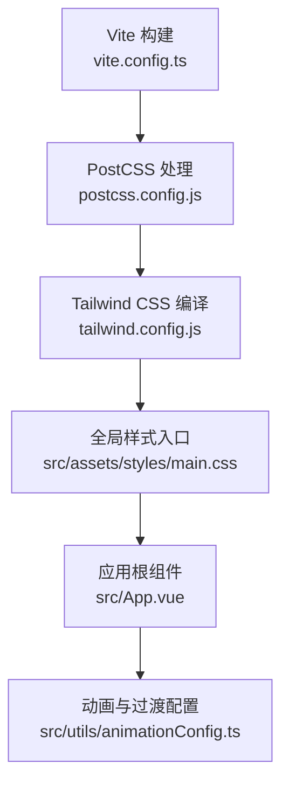
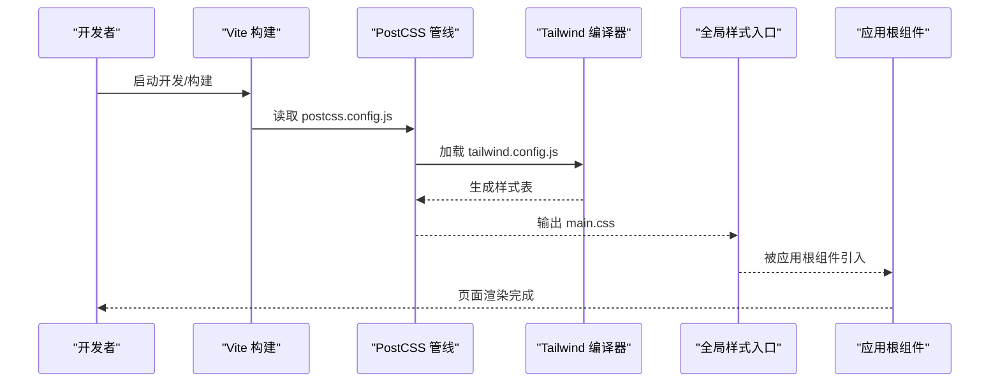
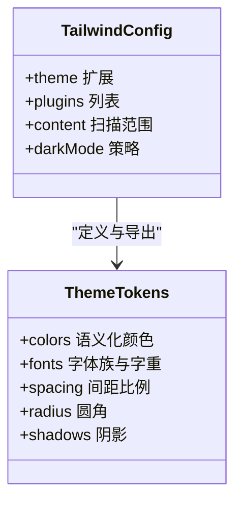
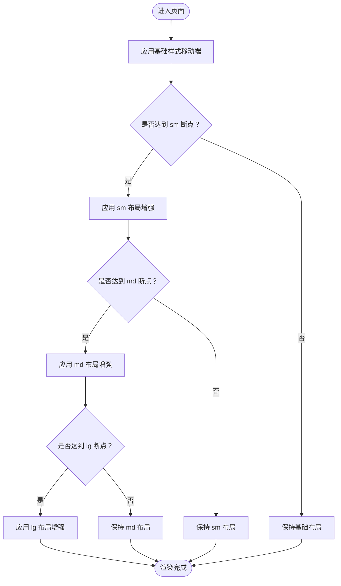
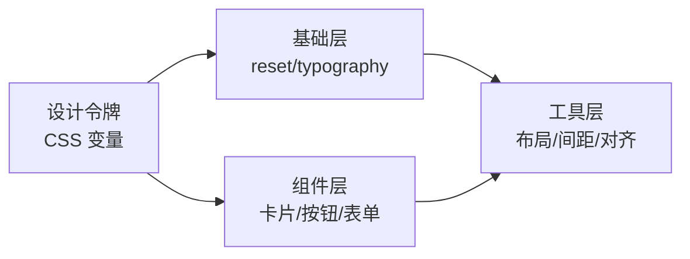
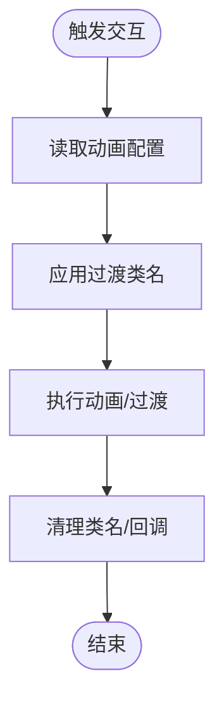
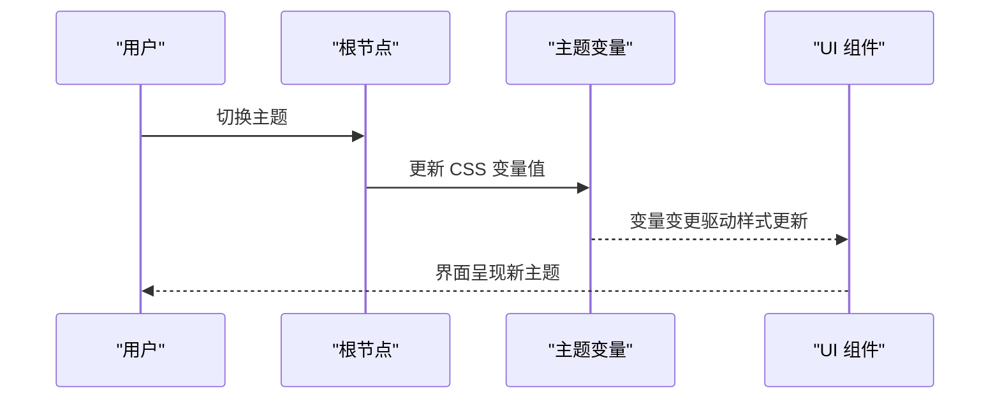
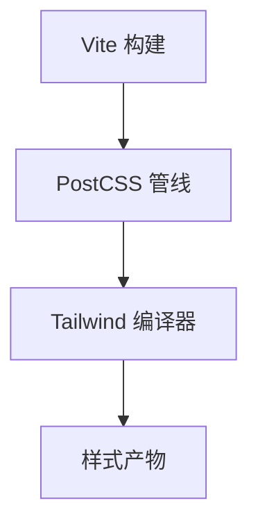
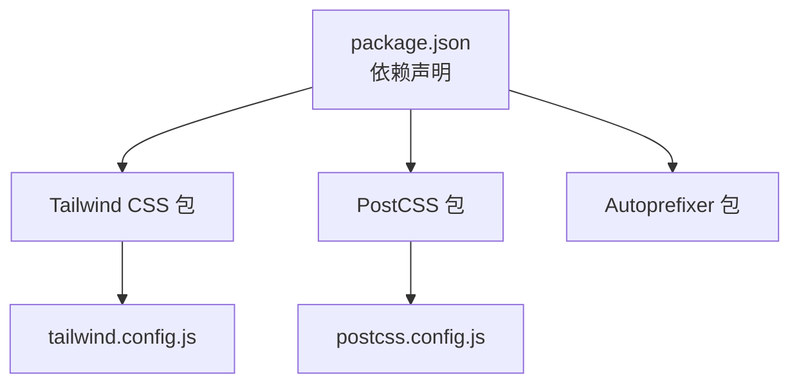

# 响应式设计样式

<cite>
**本文引用的文件**   
- [tailwind.config.js](file://frontend/tailwind.config.js)
- [postcss.config.js](file://frontend/postcss.config.js)
- [main.css](file://frontend/src/assets/styles/main.css)
- [package.json](file://frontend/package.json)
- [vite.config.ts](file://frontend/vite.config.ts)
- [App.vue](file://frontend/src/App.vue)
- [animationConfig.ts](file://frontend/src/utils/animationConfig.ts)
</cite>

## 目录
1. [简介](#简介)
2. [项目结构](#项目结构)
3. [核心组件](#核心组件)
4. [架构总览](#架构总览)
5. [详细组件分析](#详细组件分析)
6. [依赖分析](#依赖分析)
7. [性能考虑](#性能考虑)
8. [故障排查指南](#故障排查指南)
9. [结论](#结论)
10. [附录](#附录)

## 简介
本文件聚焦于前端样式体系与响应式设计的落地方案，围绕 Tailwind CSS 的配置与使用、自定义主题（颜色系统与字体）、响应式断点与移动优先策略、CSS 模块化与复用、设计令牌管理、动画与微交互、样式性能优化与按需加载、可定制主题与暗色模式、跨浏览器兼容性与无障碍访问等主题进行系统化说明。文档以仓库中的实际配置与源码为依据，提供可视化图示与最佳实践建议，帮助团队在统一的设计语言下高效构建一致、可维护且高性能的用户界面。

## 项目结构
前端采用 Vite + Vue 3 工程化方案，样式层基于 Tailwind CSS 与 PostCSS 构建。关键样式相关文件如下：
- 构建与工具链：PostCSS 配置、Tailwind 配置、Vite 配置
- 入口样式：全局样式入口
- 应用根组件：挂载全局样式与主题变量
- 动画配置：集中化的动画与过渡参数

**图表来源**
- [vite.config.ts](file://frontend/vite.config.ts)
- [postcss.config.js](file://frontend/postcss.config.js)
- [tailwind.config.js](file://frontend/tailwind.config.js)
- [main.css](file://frontend/src/assets/styles/main.css)
- [App.vue](file://frontend/src/App.vue)
- [animationConfig.ts](file://frontend/src/utils/animationConfig.ts)

**章节来源**
- [vite.config.ts](file://frontend/vite.config.ts)
- [postcss.config.js](file://frontend/postcss.config.js)
- [tailwind.config.js](file://frontend/tailwind.config.js)
- [main.css](file://frontend/src/assets/styles/main.css)
- [App.vue](file://frontend/src/App.vue)
- [animationConfig.ts](file://frontend/src/utils/animationConfig.ts)

## 核心组件
本节从“样式系统”的角度梳理核心构件及其职责：
- Tailwind 配置中心：定义主题、断点、插件与生成规则
- PostCSS 管线：串联 Tailwind、Autoprefixer、CSS 变量注入等
- 全局样式入口：导入 Tailwind 基础层、组件层与工具层，并声明设计令牌
- 应用根组件：挂载全局样式、初始化主题上下文（如暗色模式）
- 动画配置：集中管理缓动曲线、时长与关键帧，供组件复用

要点：
- 通过 Tailwind 的 theme 扩展实现颜色系统与字体的统一管理
- 使用 CSS 自定义属性作为设计令牌，配合 Tailwind 的 utility 类快速消费
- 将动画与过渡参数集中到配置模块，避免散落在组件中

**章节来源**
- [tailwind.config.js](file://frontend/tailwind.config.js)
- [postcss.config.js](file://frontend/postcss.config.js)
- [main.css](file://frontend/src/assets/styles/main.css)
- [App.vue](file://frontend/src/App.vue)
- [animationConfig.ts](file://frontend/src/utils/animationConfig.ts)

## 架构总览
下图展示了样式从构建到渲染的关键路径，以及各配置文件之间的协作关系。

**图表来源**
- [vite.config.ts](file://frontend/vite.config.ts)
- [postcss.config.js](file://frontend/postcss.config.js)
- [tailwind.config.js](file://frontend/tailwind.config.js)
- [main.css](file://frontend/src/assets/styles/main.css)
- [App.vue](file://frontend/src/App.vue)

## 详细组件分析

### Tailwind 配置与主题系统
- 主题扩展：在配置文件中扩展颜色、字体、间距、圆角、阴影等，形成统一的设计令牌
- 颜色系统：建议按语义化命名（如 primary、secondary、surface、on-surface），并通过 CSS 变量暴露给运行时
- 字体配置：定义字体族、字重与行高，确保多端一致性
- 插件与自定义指令：按需启用插件，减少未使用样式体积

**图表来源**
- [tailwind.config.js](file://frontend/tailwind.config.js)

**章节来源**
- [tailwind.config.js](file://frontend/tailwind.config.js)

### 响应式断点与移动优先
- 断点策略：遵循移动优先，默认样式针对小屏，使用 sm/md/lg/xl 等前缀逐步增强布局
- 布局适配：利用栅格与弹性布局组合，保证在不同屏幕下的可读性与可用性
- 组件级适配：在组件内通过条件类名或状态切换实现局部自适应

[此图为概念流程示意，不直接映射具体源码文件]

### CSS 模块化与样式复用
- 分层组织：将样式拆分为基础层、组件层与工具层，便于维护与覆盖
- 设计令牌：通过 CSS 变量集中管理颜色、字号、间距等，组件以变量消费
- 复用策略：封装通用原子类与组合类，减少重复代码

[此图为概念结构示意，不直接映射具体源码文件]

### 动画效果、过渡与微交互
- 集中配置：将缓动曲线、时长、延迟等放入动画配置模块，供组件统一引用
- 过渡策略：为常见交互（打开/关闭、显示/隐藏）提供一致的过渡体验
- 性能注意：优先使用 transform 与 opacity，避免触发重排

**图表来源**
- [animationConfig.ts](file://frontend/src/utils/animationConfig.ts)

**章节来源**
- [animationConfig.ts](file://frontend/src/utils/animationConfig.ts)

### 暗色模式与可定制主题
- 暗色模式策略：在配置中启用 darkMode（如 class 策略），通过根节点切换主题类
- 主题变量：使用 CSS 变量承载明/暗两套调色板，运行时动态替换
- 组件适配：组件内部仅消费语义化变量，无需关心明/暗细节

**图表来源**
- [tailwind.config.js](file://frontend/tailwind.config.js)
- [main.css](file://frontend/src/assets/styles/main.css)
- [App.vue](file://frontend/src/App.vue)

**章节来源**
- [tailwind.config.js](file://frontend/tailwind.config.js)
- [main.css](file://frontend/src/assets/styles/main.css)
- [App.vue](file://frontend/src/App.vue)

### 构建与样式管线
- PostCSS 插件：串联 Tailwind、Autoprefixer、CSS 变量注入等
- Vite 集成：在构建阶段按需处理样式资源，支持热更新与增量编译
- 产物优化：开启 Purge/Tailwind 的 JIT 模式，剔除未使用的样式

**图表来源**
- [vite.config.ts](file://frontend/vite.config.ts)
- [postcss.config.js](file://frontend/postcss.config.js)
- [tailwind.config.js](file://frontend/tailwind.config.js)

**章节来源**
- [vite.config.ts](file://frontend/vite.config.ts)
- [postcss.config.js](file://frontend/postcss.config.js)
- [tailwind.config.js](file://frontend/tailwind.config.js)

## 依赖分析
样式相关依赖与版本由包管理器管理，确保构建工具链与 Tailwind 版本兼容。

**图表来源**
- [package.json](file://frontend/package.json)
- [tailwind.config.js](file://frontend/tailwind.config.js)
- [postcss.config.js](file://frontend/postcss.config.js)

**章节来源**
- [package.json](file://frontend/package.json)

## 性能考虑
- 按需生成：启用 Tailwind 的 JIT 模式，结合 content 扫描范围，最小化样式体积
- 资源分割：将第三方库样式与应用样式分离，提升缓存命中率
- 动画优化：优先使用 GPU 加速属性（transform、opacity），避免频繁重排
- 懒加载：对非首屏组件的样式按需引入，缩短首屏时间
- 预取与预连接：对关键字体与图标资源进行预取，降低阻塞

[本节为通用性能建议，不直接分析具体文件]

## 故障排查指南
- 样式未生效
  - 检查 Tailwind 的 content 扫描范围是否包含对应文件
  - 确认 PostCSS 已正确加载 Tailwind 插件
- 暗色模式无效
  - 验证根节点是否正确切换主题类
  - 检查 CSS 变量是否在明/暗两套主题下均有定义
- 动画卡顿
  - 审查是否触发了重排（修改 width/height/top/left 等）
  - 改用 transform 与 opacity 提升性能
- 构建产物过大
  - 确认 JIT 模式已启用
  - 缩小 content 扫描范围，避免扫描 node_modules

**章节来源**
- [tailwind.config.js](file://frontend/tailwind.config.js)
- [postcss.config.js](file://frontend/postcss.config.js)
- [main.css](file://frontend/src/assets/styles/main.css)
- [App.vue](file://frontend/src/App.vue)

## 结论
通过将设计令牌集中管理、遵循移动优先与响应式断点、规范 CSS 分层与复用策略，并结合 Tailwind 的 JIT 与 PostCSS 管线，本项目实现了可扩展、可维护且高性能的样式体系。同时，统一的动画与过渡配置提升了交互一致性，暗色模式与可定制主题增强了用户体验与品牌表达。建议在后续迭代中持续优化内容扫描范围、细化组件级样式拆分，并完善无障碍与跨浏览器测试用例。

[本节为总结性内容，不直接分析具体文件]

## 附录
- 术语
  - 设计令牌：用于描述视觉与交互属性的抽象值（颜色、字号、间距等）
  - 移动优先：先编写移动端样式，再在大屏上逐步增强
  - JIT：即时生成，按需产出样式，减小体积
- 参考路径
  - 主题与断点：[tailwind.config.js](file://frontend/tailwind.config.js)
  - 构建管线：[postcss.config.js](file://frontend/postcss.config.js)、[vite.config.ts](file://frontend/vite.config.ts)
  - 全局样式：[main.css](file://frontend/src/assets/styles/main.css)
  - 应用根组件：[App.vue](file://frontend/src/App.vue)
  - 动画配置：[animationConfig.ts](file://frontend/src/utils/animationConfig.ts)
  - 依赖清单：[package.json](file://frontend/package.json)