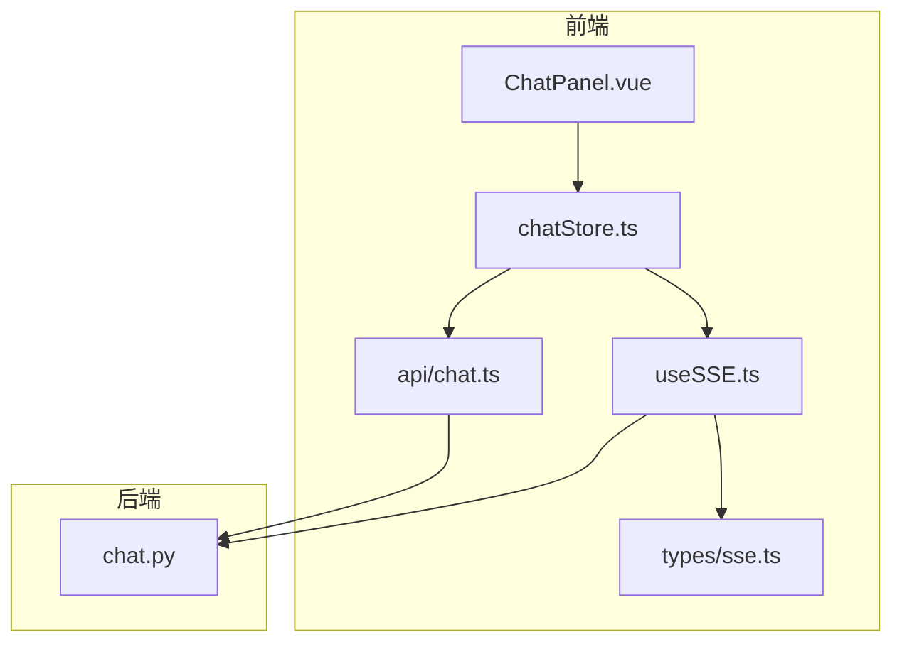
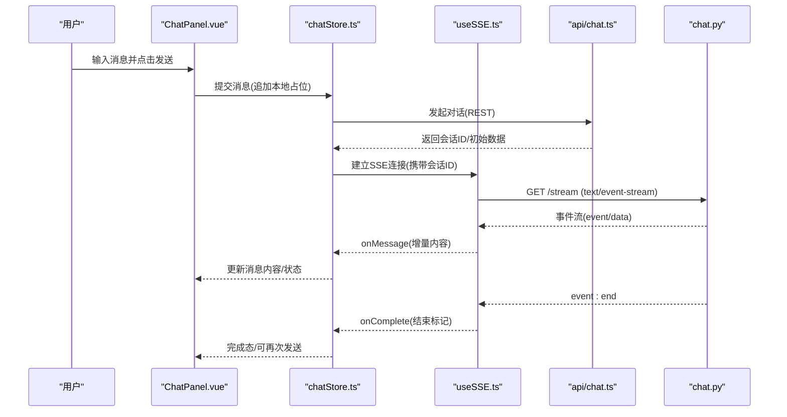
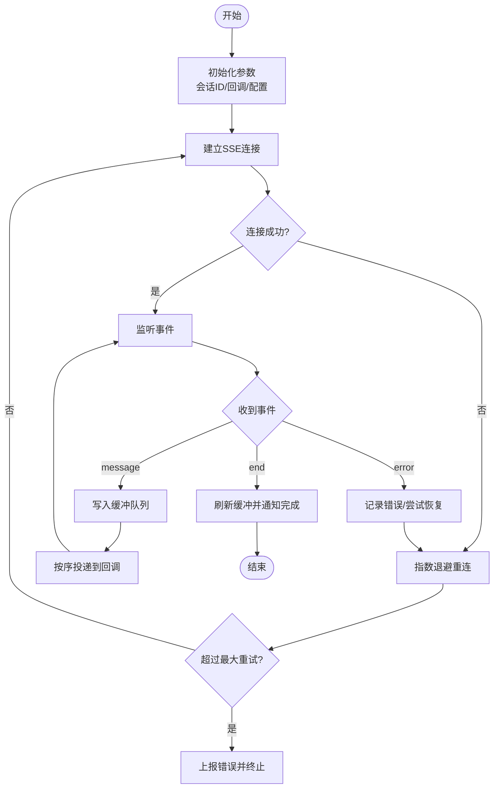
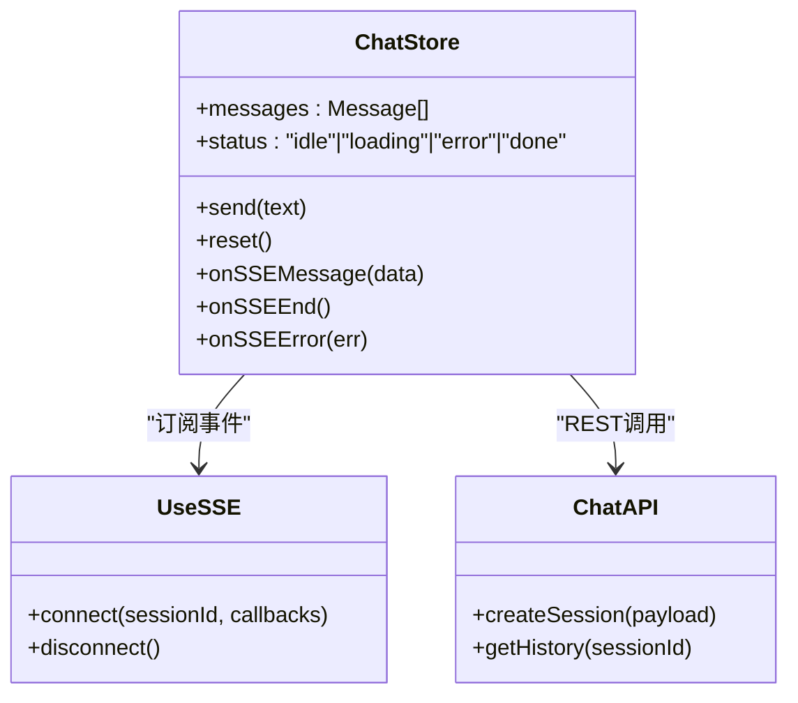
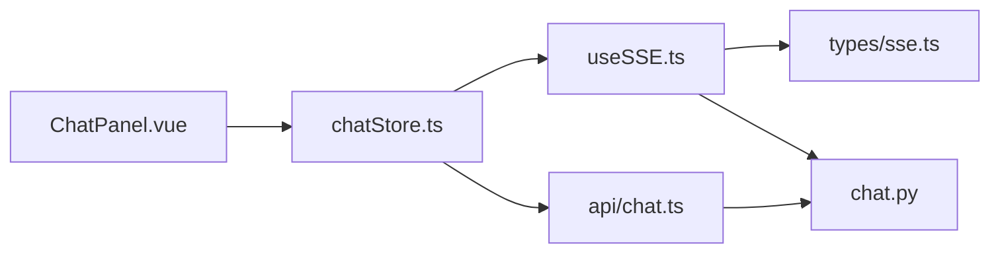

# 实时通信

<cite>
**本文引用的文件**   
- [useSSE.ts](file://frontend/src/composables/useSSE.ts)
- [sse.ts](file://frontend/src/types/sse.ts)
- [chatStore.ts](file://frontend/src/stores/chatStore.ts)
- [chat.ts](file://frontend/src/api/chat.ts)
- [ChatPanel.vue](file://frontend/src/components/ChatPanel.vue)
- [ChatMessage.vue](file://frontend/src/components/ChatMessage.vue)
- [chat.py](file://src/loopse/api/chat.py)
</cite>

## 目录
1. [简介](#简介)
2. [项目结构](#项目结构)
3. [核心组件](#核心组件)
4. [架构总览](#架构总览)
5. [详细组件分析](#详细组件分析)
6. [依赖关系分析](#依赖关系分析)
7. [性能考虑](#性能考虑)
8. [故障排查指南](#故障排查指南)
9. [结论](#结论)
10. [附录](#附录)

## 简介
本文件面向“实时通信”子系统，聚焦于 Server-Sent Events（SSE）在前端与后端的实现、连接管理、消息格式定义、事件类型与状态同步机制。文档同时覆盖断线重连、消息缓冲、错误恢复策略，并给出实时聊天功能的端到端流程（发送、接收、显示）、UI反馈与体验优化建议、高并发连接处理与性能监控方法，以及安全与调试要点。

## 项目结构
前端采用组合式函数封装 SSE 能力，配合 Store 管理会话状态；后端提供 REST 接口用于触发流式输出或查询历史。关键文件分布如下：
- 前端
  - composables/useSSE.ts：SSE 客户端封装（连接、事件订阅、重连、缓冲等）
  - types/sse.ts：SSE 事件与消息类型定义
  - stores/chatStore.ts：聊天会话状态与 UI 交互逻辑
  - api/chat.ts：REST 调用（如发起对话、拉取历史）
  - components/ChatPanel.vue、ChatMessage.vue：聊天面板与消息渲染
- 后端
  - src/loopse/api/chat.py：聊天相关 API（含 SSE 流式响应）

图表来源
- [useSSE.ts](file://frontend/src/composables/useSSE.ts)
- [sse.ts](file://frontend/src/types/sse.ts)
- [chatStore.ts](file://frontend/src/stores/chatStore.ts)
- [chat.ts](file://frontend/src/api/chat.ts)
- [ChatPanel.vue](file://frontend/src/components/ChatPanel.vue)
- [ChatMessage.vue](file://frontend/src/components/ChatMessage.vue)
- [chat.py](file://src/loopse/api/chat.py)

章节来源
- [useSSE.ts](file://frontend/src/composables/useSSE.ts)
- [sse.ts](file://frontend/src/types/sse.ts)
- [chatStore.ts](file://frontend/src/stores/chatStore.ts)
- [chat.ts](file://frontend/src/api/chat.ts)
- [ChatPanel.vue](file://frontend/src/components/ChatPanel.vue)
- [ChatMessage.vue](file://frontend/src/components/ChatMessage.vue)
- [chat.py](file://src/loopse/api/chat.py)

## 核心组件
- useSSE.ts：负责建立与服务器的 SSE 连接、解析事件、分发到回调、处理断线重连与消息缓冲。
- sse.ts：定义事件类型、消息结构、状态字段等 TypeScript 类型。
- chatStore.ts：维护聊天会话状态（消息列表、加载态、错误态），协调 REST 与 SSE 的协作。
- chat.ts：封装 REST 请求，如创建会话、获取历史消息等。
- ChatPanel.vue / ChatMessage.vue：用户界面，展示消息、输入框、加载指示与错误提示。
- chat.py：后端聊天 API，包含 SSE 流式响应的生成与推送。

章节来源
- [useSSE.ts](file://frontend/src/composables/useSSE.ts)
- [sse.ts](file://frontend/src/types/sse.ts)
- [chatStore.ts](file://frontend/src/stores/chatStore.ts)
- [chat.ts](file://frontend/src/api/chat.ts)
- [ChatPanel.vue](file://frontend/src/components/ChatPanel.vue)
- [ChatMessage.vue](file://frontend/src/components/ChatMessage.vue)
- [chat.py](file://src/loopse/api/chat.py)

## 架构总览
下图展示了从用户输入到消息显示的完整时序，包括 REST 初始化与 SSE 流式更新。

图表来源
- [ChatPanel.vue](file://frontend/src/components/ChatPanel.vue)
- [chatStore.ts](file://frontend/src/stores/chatStore.ts)
- [useSSE.ts](file://frontend/src/composables/useSSE.ts)
- [chat.ts](file://frontend/src/api/chat.ts)
- [chat.py](file://src/loopse/api/chat.py)

## 详细组件分析

### SSE 客户端封装（useSSE.ts）
职责
- 建立与关闭 SSE 连接
- 解析事件流（event/data）
- 将事件转发给上层回调
- 断线检测与指数退避重连
- 消息缓冲与顺序保证
- 错误上报与重试上限控制

关键流程
- 连接生命周期：初始化 -> 监听事件 -> 异常/关闭 -> 重连 -> 销毁
- 事件分发：根据事件名路由到不同处理器（如 message、end、error）
- 缓冲策略：在连接不稳定时缓存未确认的消息，待重连成功后按序投递
- 重连策略：指数退避 + 抖动，避免雪崩；达到最大重试次数则上报失败

图表来源
- [useSSE.ts](file://frontend/src/composables/useSSE.ts)

章节来源
- [useSSE.ts](file://frontend/src/composables/useSSE.ts)

### 类型定义（sse.ts）
职责
- 定义事件类型枚举（如 message、end、error）
- 定义消息体结构（内容、片段、元数据、时间戳等）
- 定义连接配置（超时、重试、缓冲大小等）

设计要点
- 使用强类型约束前后端契约，减少运行时错误
- 为扩展性预留字段（如 agentId、traceId）
- 明确必填与可选字段，便于校验与降级

章节来源
- [sse.ts](file://frontend/src/types/sse.ts)

### 聊天状态管理（chatStore.ts）
职责
- 维护消息列表、当前会话状态（loading、error、done）
- 协调 REST 与 SSE：先通过 REST 创建会话，再订阅 SSE 增量更新
- 提供 UI 所需的状态与方法（发送、清空、重置）

交互流程
- 发送：追加本地占位消息 -> 调用 REST -> 建立 SSE -> 增量更新 -> 完成
- 错误：捕获网络/协议错误 -> 设置错误态 -> 提供重试入口
- 历史：通过 REST 拉取历史消息 -> 合并到本地列表

图表来源
- [chatStore.ts](file://frontend/src/stores/chatStore.ts)
- [useSSE.ts](file://frontend/src/composables/useSSE.ts)
- [chat.ts](file://frontend/src/api/chat.ts)

章节来源
- [chatStore.ts](file://frontend/src/stores/chatStore.ts)
- [chat.ts](file://frontend/src/api/chat.ts)

### 聊天面板与消息渲染（ChatPanel.vue / ChatMessage.vue）
职责
- 展示消息列表、输入框、发送按钮
- 显示加载态、错误提示、空态
- 滚动到底部、自动聚焦、键盘快捷键

用户体验优化
- 骨架屏/占位消息提升感知速度
- 增量渲染避免整页重排
- 错误友好提示与一键重试

章节来源
- [ChatPanel.vue](file://frontend/src/components/ChatPanel.vue)
- [ChatMessage.vue](file://frontend/src/components/ChatMessage.vue)

### 后端 SSE 服务（chat.py）
职责
- 提供 REST 接口用于创建会话与获取历史
- 提供 SSE 流式接口，按事件推送增量内容
- 处理连接生命周期与错误码

关键点
- 正确设置 Content-Type 为 text/event-stream
- 事件命名规范（如 message、end、error）
- 心跳/保活机制（可选）防止中间层超时
- 限流与资源清理（断开连接及时释放）

章节来源
- [chat.py](file://src/loopse/api/chat.py)

## 依赖关系分析
- 前端内部依赖
  - ChatPanel.vue 依赖 chatStore.ts
  - chatStore.ts 依赖 useSSE.ts 与 api/chat.ts
  - useSSE.ts 依赖 types/sse.ts
- 前后端依赖
  - 前端通过 REST 与 SSE 与后端 chat.py 交互

图表来源
- [ChatPanel.vue](file://frontend/src/components/ChatPanel.vue)
- [chatStore.ts](file://frontend/src/stores/chatStore.ts)
- [useSSE.ts](file://frontend/src/composables/useSSE.ts)
- [sse.ts](file://frontend/src/types/sse.ts)
- [chat.ts](file://frontend/src/api/chat.ts)
- [chat.py](file://src/loopse/api/chat.py)

章节来源
- [ChatPanel.vue](file://frontend/src/components/ChatPanel.vue)
- [chatStore.ts](file://frontend/src/stores/chatStore.ts)
- [useSSE.ts](file://frontend/src/composables/useSSE.ts)
- [sse.ts](file://frontend/src/types/sse.ts)
- [chat.ts](file://frontend/src/api/chat.ts)
- [chat.py](file://src/loopse/api/chat.py)

## 性能考虑
- 连接复用与会话隔离
  - 同一会话复用单一 SSE 连接，避免重复建立
  - 多会话场景下为每个会话独立连接，合理限制并发数
- 消息缓冲与批处理
  - 前端对高频事件进行节流/合并，降低渲染压力
  - 后端按需聚合小片段，减少事件数量
- 网络与中间件
  - 配置代理/网关的 SSE 超时与缓冲策略
  - 启用压缩（谨慎评估 CPU 开销）
- 前端渲染优化
  - 虚拟列表/分页加载长消息
  - 增量更新 DOM，避免全量重绘
- 监控指标
  - 连接成功率、平均延迟、重连次数、事件吞吐、内存占用
  - 服务端：活跃连接数、CPU/IO 利用率、错误率

[本节为通用指导，不直接分析具体文件]

## 故障排查指南
- 常见问题定位
  - 连接失败：检查 CORS、代理、网关超时、认证头
  - 事件丢失：核对事件命名与解析逻辑，检查缓冲队列长度
  - 重连风暴：调整退避参数与最大重试次数
- 日志与追踪
  - 前端：记录连接状态、事件序列、错误堆栈
  - 后端：记录会话 ID、事件 ID、耗时与异常
- 工具与技巧
  - 浏览器开发者工具 Network 面板查看事件流
  - 抓包工具验证事件格式与编码
  - 模拟弱网/丢包验证重连与缓冲

章节来源
- [useSSE.ts](file://frontend/src/composables/useSSE.ts)
- [chatStore.ts](file://frontend/src/stores/chatStore.ts)
- [chat.py](file://src/loopse/api/chat.py)

## 结论
本方案以 useSSE.ts 为核心，结合 chatStore.ts 的状态管理与 chat.py 的后端 SSE 支持，实现了稳定、可扩展的实时通信链路。通过类型化契约、缓冲与重连策略、UI 渐进反馈与完善的监控/排障手段，可在高并发场景下保障良好的用户体验与系统稳定性。

[本节为总结，不直接分析具体文件]

## 附录

### 消息格式与事件类型（约定）
- 事件类型
  - message：增量内容片段
  - end：流结束标记
  - error：错误事件（含错误码与简要信息）
- 消息体关键字段
  - content：文本内容
  - metadata：附加信息（如来源、版本）
  - timestamp：时间戳
  - id：事件唯一标识（可用于去重与幂等）
- 连接配置
  - timeout：连接超时
  - maxRetries：最大重试次数
  - bufferMaxSize：缓冲上限

章节来源
- [sse.ts](file://frontend/src/types/sse.ts)

### 安全考虑
- 传输安全
  - 全站 HTTPS，避免明文传输
- 鉴权与授权
  - 会话令牌随连接传递（如 URL 参数或自定义头）
  - 服务端校验权限与速率限制
- 输入校验与输出过滤
  - 对用户输入做白名单校验
  - 对输出内容进行 XSS 防护
- 敏感信息脱敏
  - 日志中避免打印 token、隐私数据

[本节为通用指导，不直接分析具体文件]

### 调试方法清单
- 前端
  - 控制台打印事件流与状态变化
  - 使用断点跟踪重连与缓冲逻辑
- 后端
  - 打印事件生成与推送日志
  - 监控连接池与资源释放
- 网络层
  - 检查代理/网关是否拦截或改写事件流
  - 验证 Content-Type 与字符编码

[本节为通用指导，不直接分析具体文件]