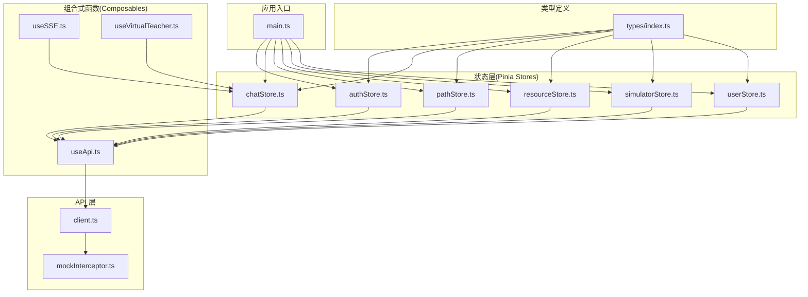
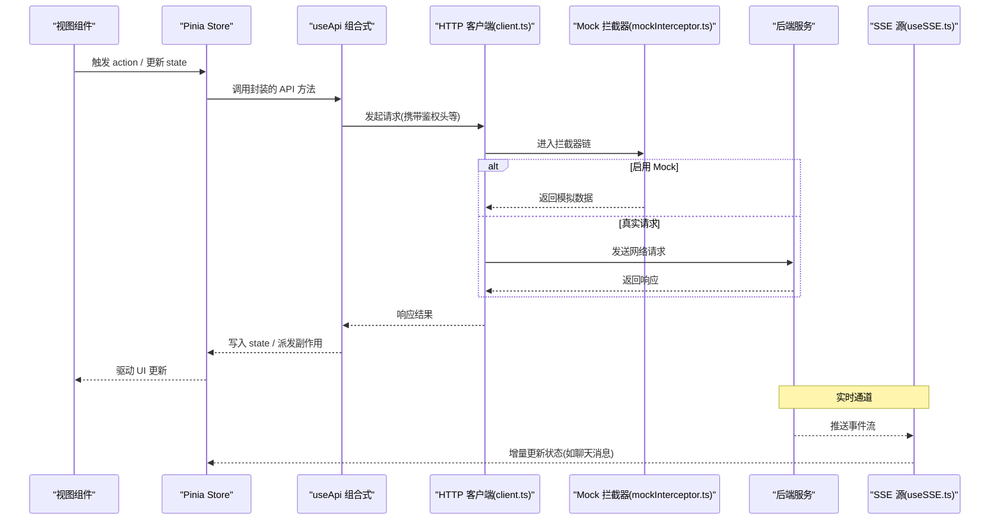
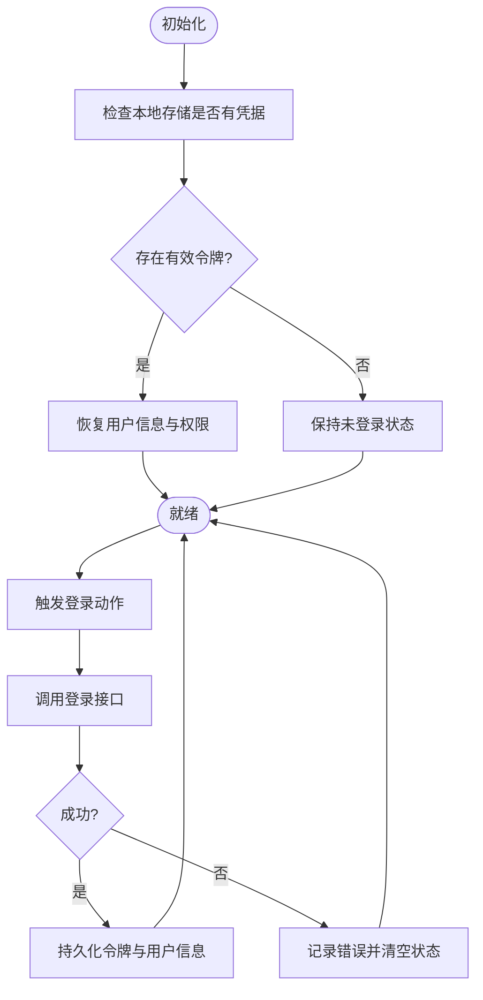
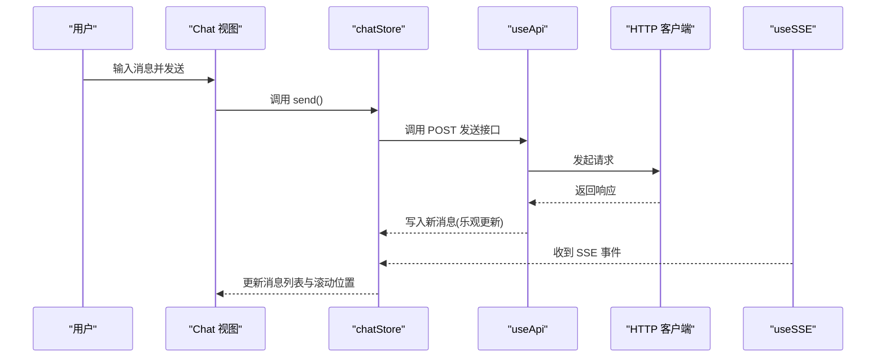
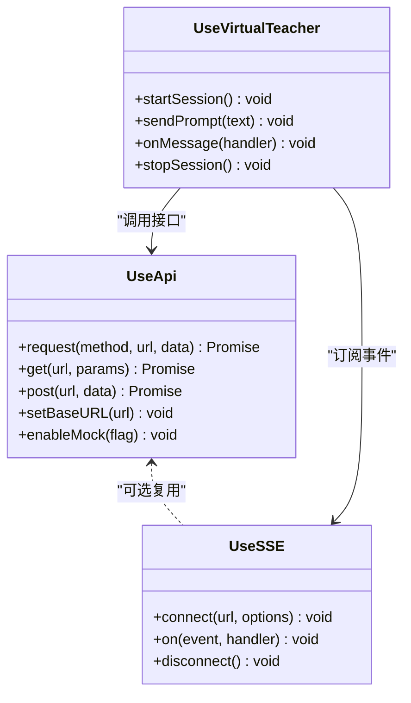
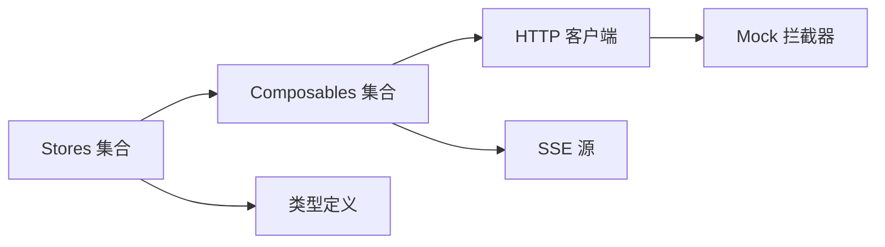

# 状态管理模式

<cite>
**本文引用的文件**   
- [frontend/src/main.ts](file://frontend/src/main.ts)
- [frontend/src/stores/authStore.ts](file://frontend/src/stores/authStore.ts)
- [frontend/src/stores/chatStore.ts](file://frontend/src/stores/chatStore.ts)
- [frontend/src/stores/pathStore.ts](file://frontend/src/stores/pathStore.ts)
- [frontend/src/stores/resourceStore.ts](file://frontend/src/stores/resourceStore.ts)
- [frontend/src/stores/simulatorStore.ts](file://frontend/src/stores/simulatorStore.ts)
- [frontend/src/stores/userStore.ts](file://frontend/src/stores/userStore.ts)
- [frontend/src/composables/useApi.ts](file://frontend/src/composables/useApi.ts)
- [frontend/src/composables/useSSE.ts](file://frontend/src/composables/useSSE.ts)
- [frontend/src/composables/useVirtualTeacher.ts](file://frontend/src/composables/useVirtualTeacher.ts)
- [frontend/src/api/client.ts](file://frontend/src/api/client.ts)
- [frontend/src/api/mockInterceptor.ts](file://frontend/src/api/mockInterceptor.ts)
- [frontend/src/types/index.ts](file://frontend/src/types/index.ts)
</cite>

## 目录
1. [简介](#简介)
2. [项目结构](#项目结构)
3. [核心组件](#核心组件)
4. [架构总览](#架构总览)
5. [详细组件分析](#详细组件分析)
6. [依赖关系分析](#依赖关系分析)
7. [性能考虑](#性能考虑)
8. [故障排查指南](#故障排查指南)
9. [结论](#结论)
10. [附录](#附录)

## 简介
本文件聚焦前端状态管理，围绕基于 Pinia 的 store 设计、组合式函数 composables 的业务封装、状态持久化与异步处理、跨组件数据共享与事件同步机制，以及调试、监控与优化策略进行系统化说明。文档同时覆盖复杂场景（表单、全局配置、用户会话）的落地方案与实践建议。

## 项目结构
前端采用按领域划分的 store 组织方式，配合 composables 封装通用能力（如 API 调用、SSE 流、虚拟教师交互），并通过统一的 HTTP 客户端与拦截器完成请求/响应处理。类型定义集中在 types 目录，便于前后端契约一致性与 IDE 提示。

图表来源
- [frontend/src/main.ts](file://frontend/src/main.ts)
- [frontend/src/stores/authStore.ts](file://frontend/src/stores/authStore.ts)
- [frontend/src/stores/chatStore.ts](file://frontend/src/stores/chatStore.ts)
- [frontend/src/stores/pathStore.ts](file://frontend/src/stores/pathStore.ts)
- [frontend/src/stores/resourceStore.ts](file://frontend/src/stores/resourceStore.ts)
- [frontend/src/stores/simulatorStore.ts](file://frontend/src/stores/simulatorStore.ts)
- [frontend/src/stores/userStore.ts](file://frontend/src/stores/userStore.ts)
- [frontend/src/composables/useApi.ts](file://frontend/src/composables/useApi.ts)
- [frontend/src/composables/useSSE.ts](file://frontend/src/composables/useSSE.ts)
- [frontend/src/composables/useVirtualTeacher.ts](file://frontend/src/composables/useVirtualTeacher.ts)
- [frontend/src/api/client.ts](file://frontend/src/api/client.ts)
- [frontend/src/api/mockInterceptor.ts](file://frontend/src/api/mockInterceptor.ts)
- [frontend/src/types/index.ts](file://frontend/src/types/index.ts)

章节来源
- [frontend/src/main.ts](file://frontend/src/main.ts)
- [frontend/src/stores/authStore.ts](file://frontend/src/stores/authStore.ts)
- [frontend/src/stores/chatStore.ts](file://frontend/src/stores/chatStore.ts)
- [frontend/src/stores/pathStore.ts](file://frontend/src/stores/pathStore.ts)
- [frontend/src/stores/resourceStore.ts](file://frontend/src/stores/resourceStore.ts)
- [frontend/src/stores/simulatorStore.ts](file://frontend/src/stores/simulatorStore.ts)
- [frontend/src/stores/userStore.ts](file://frontend/src/stores/userStore.ts)
- [frontend/src/composables/useApi.ts](file://frontend/src/composables/useApi.ts)
- [frontend/src/composables/useSSE.ts](file://frontend/src/composables/useSSE.ts)
- [frontend/src/composables/useVirtualTeacher.ts](file://frontend/src/composables/useVirtualTeacher.ts)
- [frontend/src/api/client.ts](file://frontend/src/api/client.ts)
- [frontend/src/api/mockInterceptor.ts](file://frontend/src/api/mockInterceptor.ts)
- [frontend/src/types/index.ts](file://frontend/src/types/index.ts)

## 核心组件
- Pinia Store 集合：按业务域拆分，职责清晰，避免单例臃肿。典型包括认证、聊天、路径规划、资源生成、模拟器、用户信息等。
- Composables：将跨组件复用的逻辑抽离为可组合函数，例如统一 API 调用、SSE 订阅、虚拟教师交互等。
- API 客户端与拦截器：集中处理基础 URL、鉴权头、错误码映射、Mock 开关等。
- 类型系统：通过 types 目录统一前后端数据结构，提升可维护性与开发体验。

章节来源
- [frontend/src/stores/authStore.ts](file://frontend/src/stores/authStore.ts)
- [frontend/src/stores/chatStore.ts](file://frontend/src/stores/chatStore.ts)
- [frontend/src/stores/pathStore.ts](file://frontend/src/stores/pathStore.ts)
- [frontend/src/stores/resourceStore.ts](file://frontend/src/stores/resourceStore.ts)
- [frontend/src/stores/simulatorStore.ts](file://frontend/src/stores/simulatorStore.ts)
- [frontend/src/stores/userStore.ts](file://frontend/src/stores/userStore.ts)
- [frontend/src/composables/useApi.ts](file://frontend/src/composables/useApi.ts)
- [frontend/src/composables/useSSE.ts](file://frontend/src/composables/useSSE.ts)
- [frontend/src/composables/useVirtualTeacher.ts](file://frontend/src/composables/useVirtualTeacher.ts)
- [frontend/src/api/client.ts](file://frontend/src/api/client.ts)
- [frontend/src/api/mockInterceptor.ts](file://frontend/src/api/mockInterceptor.ts)
- [frontend/src/types/index.ts](file://frontend/src/types/index.ts)

## 架构总览
下图展示从视图到状态再到后端的完整链路，包含 SSE 实时消息与 Mock 拦截流程。

图表来源
- [frontend/src/stores/chatStore.ts](file://frontend/src/stores/chatStore.ts)
- [frontend/src/composables/useApi.ts](file://frontend/src/composables/useApi.ts)
- [frontend/src/api/client.ts](file://frontend/src/api/client.ts)
- [frontend/src/api/mockInterceptor.ts](file://frontend/src/api/mockInterceptor.ts)
- [frontend/src/composables/useSSE.ts](file://frontend/src/composables/useSSE.ts)

## 详细组件分析

### 认证状态管理(authStore)
- 职责：登录/登出、令牌刷新、权限判断、用户信息缓存。
- 状态设计：token、用户基本信息、是否已认证、加载态与错误信息。
- 持久化：在初始化时从本地存储恢复；在变更时写回本地存储。
- 异步处理：登录成功后保存 token，必要时刷新用户信息；失败时清理状态并提示。
- 与其他模块协作：路由守卫读取认证状态；其他 store 在需要时校验权限。

图表来源
- [frontend/src/stores/authStore.ts](file://frontend/src/stores/authStore.ts)
- [frontend/src/composables/useApi.ts](file://frontend/src/composables/useApi.ts)
- [frontend/src/api/client.ts](file://frontend/src/api/client.ts)

章节来源
- [frontend/src/stores/authStore.ts](file://frontend/src/stores/authStore.ts)
- [frontend/src/composables/useApi.ts](file://frontend/src/composables/useApi.ts)
- [frontend/src/api/client.ts](file://frontend/src/api/client.ts)

### 聊天状态管理(chatStore)
- 职责：消息列表、对话上下文、发送/接收消息、SSE 实时流接入。
- 状态设计：消息数组、当前会话标识、加载态、错误信息、滚动锚点等。
- 异步处理：发送消息后追加本地乐观更新，收到服务端确认或 SSE 事件后修正。
- 事件总线：通过 SSE 订阅服务端推送，增量更新消息与元信息。
- 与 composables 协作：使用 useSSE 建立连接，使用 useApi 发送消息。

图表来源
- [frontend/src/stores/chatStore.ts](file://frontend/src/stores/chatStore.ts)
- [frontend/src/composables/useApi.ts](file://frontend/src/composables/useApi.ts)
- [frontend/src/composables/useSSE.ts](file://frontend/src/composables/useSSE.ts)
- [frontend/src/api/client.ts](file://frontend/src/api/client.ts)

章节来源
- [frontend/src/stores/chatStore.ts](file://frontend/src/stores/chatStore.ts)
- [frontend/src/composables/useApi.ts](file://frontend/src/composables/useApi.ts)
- [frontend/src/composables/useSSE.ts](file://frontend/src/composables/useSSE.ts)
- [frontend/src/api/client.ts](file://frontend/src/api/client.ts)

### 路径与资源状态(pathStore, resourceStore)
- pathStore：负责学习路径节点、进度、推荐策略相关状态；提供计算属性用于渲染时间线与步骤条。
- resourceStore：负责资源卡片集合、筛选、分页、生成任务进度等；支持批量操作与并发控制。
- 共同模式：
  - 状态分片：按功能域切分，减少无关重渲染。
  - 懒加载：按需拉取详情，首屏轻量。
  - 幂等性：重复提交去抖/节流，避免重复创建。

章节来源
- [frontend/src/stores/pathStore.ts](file://frontend/src/stores/pathStore.ts)
- [frontend/src/stores/resourceStore.ts](file://frontend/src/stores/resourceStore.ts)

### 模拟器状态(simulatorStore)
- 职责：仿真参数、运行状态、日志输出、结果可视化。
- 状态设计：参数对象、运行标志、日志队列、最终结果、错误信息。
- 异步处理：启动/停止仿真、轮询或 SSE 获取中间结果，完成后聚合输出。
- 与 composables 协作：结合 useApi 与 useSSE 实现长任务与实时反馈。

章节来源
- [frontend/src/stores/simulatorStore.ts](file://frontend/src/stores/simulatorStore.ts)
- [frontend/src/composables/useApi.ts](file://frontend/src/composables/useApi.ts)
- [frontend/src/composables/useSSE.ts](file://frontend/src/composables/useSSE.ts)

### 用户信息(userStore)
- 职责：用户档案、偏好设置、主题与语言等全局配置。
- 状态设计：基础资料、偏好项、最近访问、统计摘要。
- 持久化：与 authStore 协同，确保登录后自动加载与变更后落盘。
- 跨组件共享：作为全局配置中心，被多个页面消费。

章节来源
- [frontend/src/stores/userStore.ts](file://frontend/src/stores/userStore.ts)

### 组合式函数(useApi, useSSE, useVirtualTeacher)
- useApi：封装请求生命周期（加载态、错误态、重试、取消）、统一错误处理、Mock 切换。
- useSSE：封装连接建立、断线重连、事件分发、内存泄漏防护。
- useVirtualTeacher：封装与虚拟教师的交互协议、状态机、消息编排。

图表来源
- [frontend/src/composables/useApi.ts](file://frontend/src/composables/useApi.ts)
- [frontend/src/composables/useSSE.ts](file://frontend/src/composables/useSSE.ts)
- [frontend/src/composables/useVirtualTeacher.ts](file://frontend/src/composables/useVirtualTeacher.ts)

章节来源
- [frontend/src/composables/useApi.ts](file://frontend/src/composables/useApi.ts)
- [frontend/src/composables/useSSE.ts](file://frontend/src/composables/useSSE.ts)
- [frontend/src/composables/useVirtualTeacher.ts](file://frontend/src/composables/useVirtualTeacher.ts)

### 类型系统与契约(types/index.ts)
- 作用：统一定义前后端交互的数据结构、枚举与联合类型，保证 store 与 API 层一致性。
- 实践：在 store 中导入类型，在 composables 中使用泛型约束返回值，减少运行时错误。

章节来源
- [frontend/src/types/index.ts](file://frontend/src/types/index.ts)

## 依赖关系分析
- 低耦合高内聚：store 仅依赖 composables 与 types，不直接耦合视图与第三方库细节。
- 单向数据流：视图触发 action -> store 调用 composables -> HTTP/SSE -> 更新 state -> 视图响应。
- 外部集成点：HTTP 客户端与拦截器、SSE 源、本地存储（持久化）。

图表来源
- [frontend/src/stores/authStore.ts](file://frontend/src/stores/authStore.ts)
- [frontend/src/stores/chatStore.ts](file://frontend/src/stores/chatStore.ts)
- [frontend/src/stores/pathStore.ts](file://frontend/src/stores/pathStore.ts)
- [frontend/src/stores/resourceStore.ts](file://frontend/src/stores/resourceStore.ts)
- [frontend/src/stores/simulatorStore.ts](file://frontend/src/stores/simulatorStore.ts)
- [frontend/src/stores/userStore.ts](file://frontend/src/stores/userStore.ts)
- [frontend/src/composables/useApi.ts](file://frontend/src/composables/useApi.ts)
- [frontend/src/composables/useSSE.ts](file://frontend/src/composables/useSSE.ts)
- [frontend/src/api/client.ts](file://frontend/src/api/client.ts)
- [frontend/src/api/mockInterceptor.ts](file://frontend/src/api/mockInterceptor.ts)
- [frontend/src/types/index.ts](file://frontend/src/types/index.ts)

章节来源
- [frontend/src/stores/authStore.ts](file://frontend/src/stores/authStore.ts)
- [frontend/src/stores/chatStore.ts](file://frontend/src/stores/chatStore.ts)
- [frontend/src/stores/pathStore.ts](file://frontend/src/stores/pathStore.ts)
- [frontend/src/stores/resourceStore.ts](file://frontend/src/stores/resourceStore.ts)
- [frontend/src/stores/simulatorStore.ts](file://frontend/src/stores/simulatorStore.ts)
- [frontend/src/stores/userStore.ts](file://frontend/src/stores/userStore.ts)
- [frontend/src/composables/useApi.ts](file://frontend/src/composables/useApi.ts)
- [frontend/src/composables/useSSE.ts](file://frontend/src/composables/useSSE.ts)
- [frontend/src/api/client.ts](file://frontend/src/api/client.ts)
- [frontend/src/api/mockInterceptor.ts](file://frontend/src/api/mockInterceptor.ts)
- [frontend/src/types/index.ts](file://frontend/src/types/index.ts)

## 性能考虑
- 状态粒度与选择器：按域拆分 store，并在视图中使用细粒度选择器，避免整树重渲染。
- 惰性加载与分页：对大列表与详情数据采用分页与懒加载，首屏只加载必要数据。
- 防抖与节流：搜索、滚动、频繁点击等场景加防抖/节流，降低无效请求与状态抖动。
- 并发控制：批量操作限制并发数，避免雪崩；失败快速失败与重试退避。
- 内存管理：SSE 连接在组件卸载时断开；定时器与监听器及时清理。
- 序列化与持久化：仅持久化必要字段，压缩体积；避免循环引用导致序列化失败。

[本节为通用指导，无需源码引用]

## 故障排查指南
- 常见问题定位
  - 状态不同步：检查 store 的 action 是否唯一修改源；确认 SSE 事件是否覆盖旧消息。
  - 鉴权失败：查看拦截器是否正确注入 token；检查 token 过期刷新逻辑。
  - Mock 干扰：确认环境开关与拦截器优先级，避免测试环境与生产混淆。
  - SSE 断线：检查重连策略与最大重试次数；关注网络异常与跨域配置。
- 调试技巧
  - 使用浏览器开发者工具观察网络请求与 SSE 事件。
  - 在关键 action 前后打印状态快照，对比差异。
  - 利用类型提示与编译期检查，尽早发现数据结构不一致。
- 恢复策略
  - 提供“重置”与“重试”按钮，允许用户主动恢复。
  - 对关键状态增加版本戳或时间戳，辅助冲突解决。

章节来源
- [frontend/src/api/mockInterceptor.ts](file://frontend/src/api/mockInterceptor.ts)
- [frontend/src/composables/useSSE.ts](file://frontend/src/composables/useSSE.ts)
- [frontend/src/composables/useApi.ts](file://frontend/src/composables/useApi.ts)

## 结论
本项目以 Pinia 为核心构建前端状态体系，结合 composables 抽象通用能力，形成清晰的单向数据流与可扩展的模块化架构。通过合理的状态分片、持久化策略、异步与实时通信处理，以及完善的调试与性能优化手段，能够支撑复杂的业务场景与良好的用户体验。

[本节为总结性内容，无需源码引用]

## 附录

### 复杂状态场景方案
- 表单状态管理
  - 使用独立 store 或局部 state 承载表单值与校验结果。
  - 通过 computed 派生提交可用性；提交前做二次校验与幂等保护。
  - 支持草稿自动保存与恢复。
- 全局配置管理
  - 将主题、语言、布局等放入 userStore 或专用 configStore。
  - 提供 set/get 方法与默认值合并策略；变更时广播通知。
- 用户会话状态
  - 与 authStore 联动，统一处理登录态、超时与静默刷新。
  - 敏感信息最小化持久化，必要时加密存储。

[本节为概念性内容，无需源码引用]