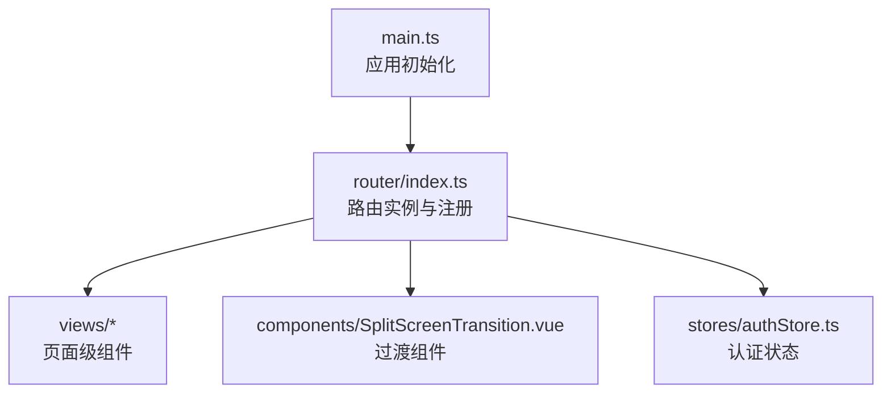
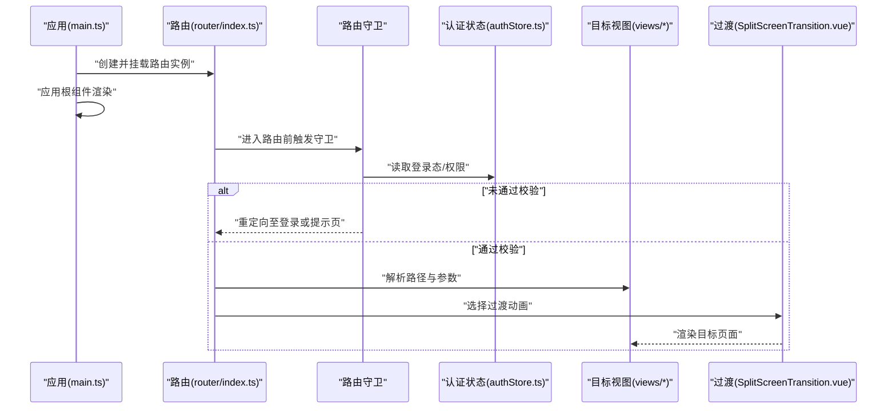
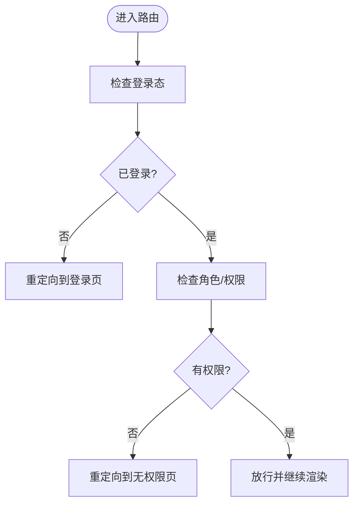
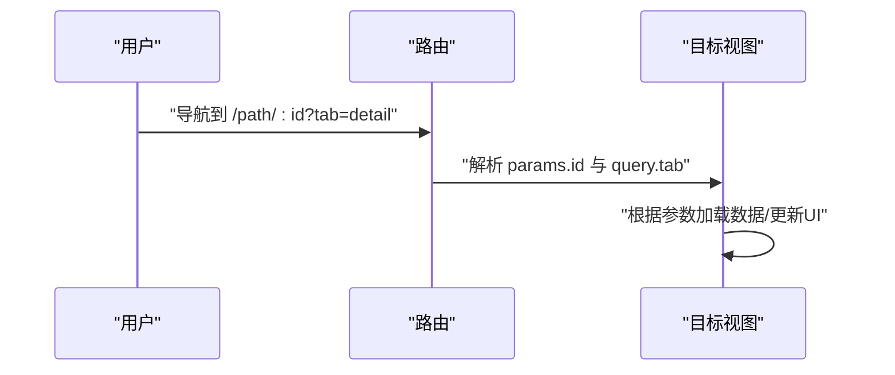
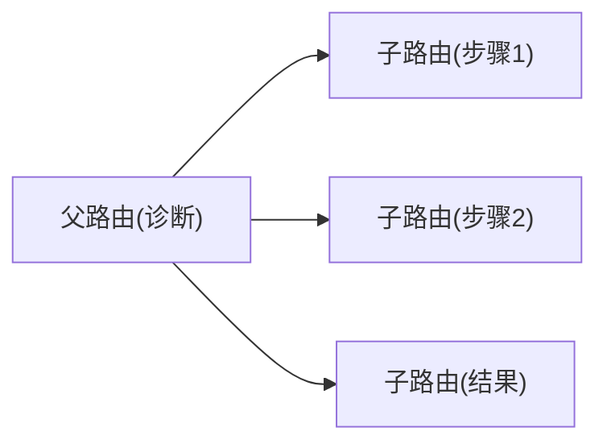
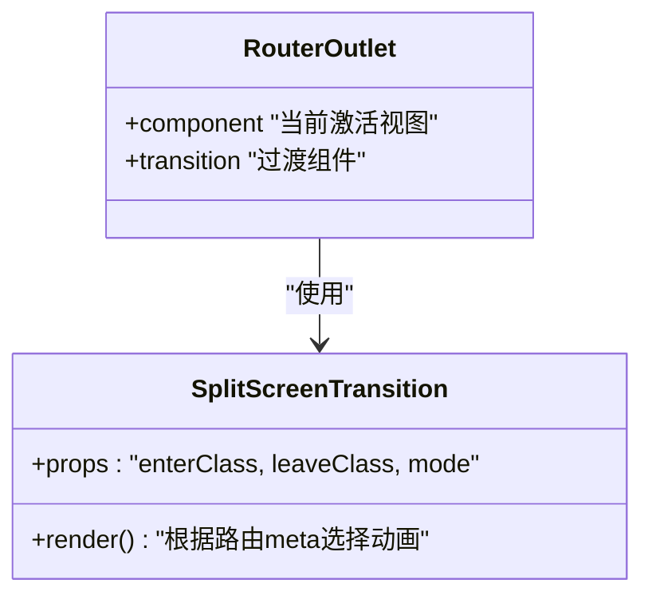
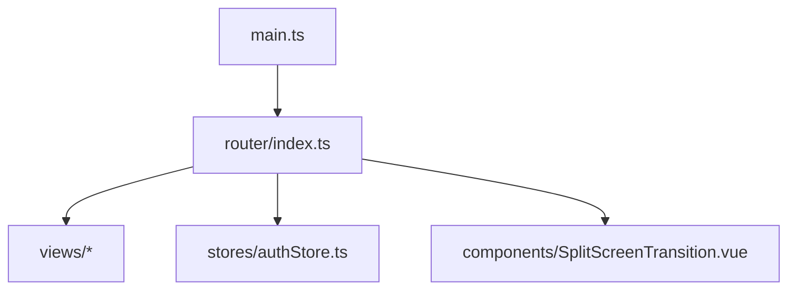

# 路由系统

<cite>
**本文引用的文件**   
- [frontend/src/router/index.ts](file://frontend/src/router/index.ts)
- [frontend/src/main.ts](file://frontend/src/main.ts)
- [frontend/src/views/HomeView.vue](file://frontend/src/views/HomeView.vue)
- [frontend/src/views/LoginView.vue](file://frontend/src/views/LoginView.vue)
- [frontend/src/views/WelcomeView.vue](file://frontend/src/views/WelcomeView.vue)
- [frontend/src/views/OnboardingView.vue](file://frontend/src/views/OnboardingView.vue)
- [frontend/src/views/CareerView.vue](file://frontend/src/views/CareerView.vue)
- [frontend/src/views/DiagnosisView.vue](file://frontend/src/views/DiagnosisView.vue)
- [frontend/src/views/PathView.vue](file://frontend/src/views/PathView.vue)
- [frontend/src/views/ResourcesView.vue](file://frontend/src/views/ResourcesView.vue)
- [frontend/src/views/ChatView.vue](file://frontend/src/views/ChatView.vue)
- [frontend/src/views/SimulatorView.vue](file://frontend/src/views/SimulatorView.vue)
- [frontend/src/views/ChallengerView.vue](file://frontend/src/views/ChallengerView.vue)
- [frontend/src/views/InterviewView.vue](file://frontend/src/views/InterviewView.vue)
- [frontend/src/views/ExamView.vue](file://frontend/src/views/ExamView.vue)
- [frontend/src/views/LessonView.vue](file://frontend/src/views/LessonView.vue)
- [frontend/src/views/AIKGView.vue](file://frontend/src/views/AIKGView.vue)
- [frontend/src/views/BookHouseView.vue](file://frontend/src/views/BookHouseView.vue)
- [frontend/src/views/BookshelfView.vue](file://frontend/src/views/BookshelfView.vue)
- [frontend/src/views/BookReaderView.vue](file://frontend/src/views/BookReaderView.vue)
- [frontend/src/views/ProfileView.vue](file://frontend/src/views/ProfileView.vue)
- [frontend/src/views/OAuthCallbackView.vue](file://frontend/src/views/OAuthCallbackView.vue)
- [frontend/src/views/LogsView.vue](file://frontend/src/views/LogsView.vue)
- [frontend/src/views/ScenarioView.vue](file://frontend/src/views/ScenarioView.vue)
- [frontend/src/views/VideoGenView.vue](file://frontend/src/views/VideoGenView.vue)
- [frontend/src/views/Hardware3DView.vue](file://frontend/src/views/Hardware3DView.vue)
- [frontend/src/views/Device3DView.vue](file://frontend/src/views/Device3DView.vue)
- [frontend/src/stores/authStore.ts](file://frontend/src/stores/authStore.ts)
- [frontend/src/components/SplitScreenTransition.vue](file://frontend/src/components/SplitScreenTransition.vue)
</cite>

## 目录
1. [简介](#简介)
2. [项目结构](#项目结构)
3. [核心组件](#核心组件)
4. [架构总览](#架构总览)
5. [详细组件分析](#详细组件分析)
6. [依赖关系分析](#依赖关系分析)
7. [性能考虑](#性能考虑)
8. [故障排查指南](#故障排查指南)
9. [结论](#结论)
10. [附录](#附录)

## 简介
本文件聚焦前端路由系统的实现与最佳实践，围绕 Vue Router 的配置与使用展开，涵盖：
- 路由守卫、动态路由与嵌套路由的组织方式
- 页面级组件结构与懒加载策略
- 路由参数传递、查询字符串处理与元信息配置
- 权限控制、面包屑导航与路由动画效果
- 性能优化技巧与 SEO 友好配置
- 响应式路由与移动端适配思路

## 项目结构
前端采用基于文件的视图组织方式，路由定义集中于单一入口文件，配合全局初始化逻辑完成挂载。

图表来源
- [frontend/src/main.ts](file://frontend/src/main.ts)
- [frontend/src/router/index.ts](file://frontend/src/router/index.ts)
- [frontend/src/components/SplitScreenTransition.vue](file://frontend/src/components/SplitScreenTransition.vue)
- [frontend/src/stores/authStore.ts](file://frontend/src/stores/authStore.ts)

章节来源
- [frontend/src/main.ts](file://frontend/src/main.ts)
- [frontend/src/router/index.ts](file://frontend/src/router/index.ts)

## 核心组件
- 路由实例与注册：在路由文件中集中声明所有页面路由、元信息与可能的动态段，并统一挂载到应用。
- 全局初始化：应用入口创建路由实例并将其注入到应用上下文，确保导航可用。
- 页面组件：每个视图对应一个 .vue 文件，按功能域划分（学习、诊断、资源、模拟等）。
- 过渡组件：提供统一的页面切换动画能力，可在路由级别引用。

章节来源
- [frontend/src/router/index.ts](file://frontend/src/router/index.ts)
- [frontend/src/main.ts](file://frontend/src/main.ts)
- [frontend/src/components/SplitScreenTransition.vue](file://frontend/src/components/SplitScreenTransition.vue)

## 架构总览
下图展示了从应用启动到路由渲染的关键流程，以及路由与认证状态、过渡组件的交互关系。

图表来源
- [frontend/src/main.ts](file://frontend/src/main.ts)
- [frontend/src/router/index.ts](file://frontend/src/router/index.ts)
- [frontend/src/stores/authStore.ts](file://frontend/src/stores/authStore.ts)
- [frontend/src/components/SplitScreenTransition.vue](file://frontend/src/components/SplitScreenTransition.vue)

## 详细组件分析

### 路由配置与注册
- 路由表组织：建议以功能域分组（如“首页”、“学习”、“诊断”、“资源”、“模拟”、“个人中心”等），为每个页面添加 meta 字段描述标题、是否需要登录、是否可被搜索引擎收录等。
- 动态路由：对需要参数的页面（例如课程、书籍、场景）使用路径参数；对筛选、分页等使用查询字符串。
- 嵌套路由：将具有共同布局的子功能（如“诊断流程”、“路径规划”）作为子路由，复用父级布局与面包屑。
- 懒加载：为大型页面使用异步组件或路由级懒加载，减少首屏体积。
- 过渡与动画：在路由层引入过渡组件，结合 meta 字段选择不同动画策略。

章节来源
- [frontend/src/router/index.ts](file://frontend/src/router/index.ts)

### 路由守卫与权限控制
- 全局前置守卫：在进入路由前检查登录态与角色权限，必要时重定向到登录页或无权限提示页。
- 路由独享守卫：针对敏感页面（如个人资料、日志查看）单独设置访问条件。
- 状态同步：与认证状态存储联动，避免重复请求后端接口。

图表来源
- [frontend/src/router/index.ts](file://frontend/src/router/index.ts)
- [frontend/src/stores/authStore.ts](file://frontend/src/stores/authStore.ts)

章节来源
- [frontend/src/router/index.ts](file://frontend/src/router/index.ts)
- [frontend/src/stores/authStore.ts](file://frontend/src/stores/authStore.ts)

### 动态路由与参数传递
- 路径参数：用于标识具体资源（如 id、slug），在视图中通过路由对象获取。
- 查询字符串：用于筛选、排序、分页等，适合可组合且可分享的状态。
- 默认值与校验：为可选参数提供默认值，并在进入时进行基础校验，提升健壮性。

图表来源
- [frontend/src/router/index.ts](file://frontend/src/router/index.ts)

章节来源
- [frontend/src/router/index.ts](file://frontend/src/router/index.ts)

### 嵌套路由与面包屑导航
- 嵌套布局：为复杂功能（如诊断、路径、资源中心）提供共享布局与侧边栏/顶部导航。
- 面包屑：基于路由层级与 meta.title 自动生成面包屑，支持自定义别名与多语言键。
- 子路由命名：保持语义化，便于生成链接与维护。

图表来源
- [frontend/src/router/index.ts](file://frontend/src/router/index.ts)

章节来源
- [frontend/src/router/index.ts](file://frontend/src/router/index.ts)

### 路由元信息与 SEO 友好配置
- meta 字段：集中管理页面标题、描述、是否需要登录、是否允许索引等。
- 文档头更新：在路由切换时更新 <title> 与 meta 标签，提升 SEO 与社交分享体验。
- 预取与预加载：对高频页面启用预取，缩短二次访问延迟。

章节来源
- [frontend/src/router/index.ts](file://frontend/src/router/index.ts)

### 路由动画与过渡
- 全局过渡：在路由出口包裹过渡组件，实现淡入淡出、滑动等效果。
- 差异化动画：依据 meta.transition 选择不同动画策略（如分屏过渡）。
- 性能注意：避免过度复杂的动画导致掉帧，优先使用 CSS transform 与 opacity。

图表来源
- [frontend/src/components/SplitScreenTransition.vue](file://frontend/src/components/SplitScreenTransition.vue)
- [frontend/src/router/index.ts](file://frontend/src/router/index.ts)

章节来源
- [frontend/src/components/SplitScreenTransition.vue](file://frontend/src/components/SplitScreenTransition.vue)
- [frontend/src/router/index.ts](file://frontend/src/router/index.ts)

### 页面级组件组织与懒加载
- 组件粒度：每个视图文件对应一个页面，职责单一，便于测试与维护。
- 懒加载策略：对非首屏页面采用异步导入，降低初始包体。
- 错误边界：为懒加载组件增加错误回退与加载骨架，提升用户体验。

章节来源
- [frontend/src/views/HomeView.vue](file://frontend/src/views/HomeView.vue)
- [frontend/src/views/LoginView.vue](file://frontend/src/views/LoginView.vue)
- [frontend/src/views/WelcomeView.vue](file://frontend/src/views/WelcomeView.vue)
- [frontend/src/views/OnboardingView.vue](file://frontend/src/views/OnboardingView.vue)
- [frontend/src/views/CareerView.vue](file://frontend/src/views/CareerView.vue)
- [frontend/src/views/DiagnosisView.vue](file://frontend/src/views/DiagnosisView.vue)
- [frontend/src/views/PathView.vue](file://frontend/src/views/PathView.vue)
- [frontend/src/views/ResourcesView.vue](file://frontend/src/views/ResourcesView.vue)
- [frontend/src/views/ChatView.vue](file://frontend/src/views/ChatView.vue)
- [frontend/src/views/SimulatorView.vue](file://frontend/src/views/SimulatorView.vue)
- [frontend/src/views/ChallengerView.vue](file://frontend/src/views/ChallengerView.vue)
- [frontend/src/views/InterviewView.vue](file://frontend/src/views/InterviewView.vue)
- [frontend/src/views/ExamView.vue](file://frontend/src/views/ExamView.vue)
- [frontend/src/views/LessonView.vue](file://frontend/src/views/LessonView.vue)
- [frontend/src/views/AIKGView.vue](file://frontend/src/views/AIKGView.vue)
- [frontend/src/views/BookHouseView.vue](file://frontend/src/views/BookHouseView.vue)
- [frontend/src/views/BookshelfView.vue](file://frontend/src/views/BookshelfView.vue)
- [frontend/src/views/BookReaderView.vue](file://frontend/src/views/BookReaderView.vue)
- [frontend/src/views/ProfileView.vue](file://frontend/src/views/ProfileView.vue)
- [frontend/src/views/OAuthCallbackView.vue](file://frontend/src/views/OAuthCallbackView.vue)
- [frontend/src/views/LogsView.vue](file://frontend/src/views/LogsView.vue)
- [frontend/src/views/ScenarioView.vue](file://frontend/src/views/ScenarioView.vue)
- [frontend/src/views/VideoGenView.vue](file://frontend/src/views/VideoGenView.vue)
- [frontend/src/views/Hardware3DView.vue](file://frontend/src/views/Hardware3DView.vue)
- [frontend/src/views/Device3DView.vue](file://frontend/src/views/Device3DView.vue)

### 认证回调与第三方登录
- OAuth 回调：在回调页解析授权码或令牌，写入认证状态后跳转至目标页。
- 安全注意：避免在 URL 中暴露敏感信息，尽量使用 state 参数防 CSRF。

章节来源
- [frontend/src/views/OAuthCallbackView.vue](file://frontend/src/views/OAuthCallbackView.vue)
- [frontend/src/stores/authStore.ts](file://frontend/src/stores/authStore.ts)

## 依赖关系分析
- 入口依赖：应用入口负责创建并挂载路由实例，使导航在整个应用中可用。
- 路由依赖：路由文件集中管理页面映射、元信息与守卫逻辑。
- 状态依赖：认证状态由独立 store 管理，供守卫与页面组件共享。
- 组件依赖：过渡组件在路由层按需使用，不侵入业务视图。

图表来源
- [frontend/src/main.ts](file://frontend/src/main.ts)
- [frontend/src/router/index.ts](file://frontend/src/router/index.ts)
- [frontend/src/stores/authStore.ts](file://frontend/src/stores/authStore.ts)
- [frontend/src/components/SplitScreenTransition.vue](file://frontend/src/components/SplitScreenTransition.vue)

章节来源
- [frontend/src/main.ts](file://frontend/src/main.ts)
- [frontend/src/router/index.ts](file://frontend/src/router/index.ts)
- [frontend/src/stores/authStore.ts](file://frontend/src/stores/authStore.ts)
- [frontend/src/components/SplitScreenTransition.vue](file://frontend/src/components/SplitScreenTransition.vue)

## 性能考虑
- 路由级懒加载：对大体积页面使用异步组件或路由懒加载，减少首屏时间。
- 预取与预加载：对常用页面启用预取，提高二次访问速度。
- 动画优化：优先使用 GPU 加速属性（transform、opacity），避免强制回流。
- 缓存策略：对静态资源与 API 响应合理缓存，减少重复请求。
- 路由去重：避免重复注册相同路径，防止内存泄漏与冲突。

[本节为通用指导，无需代码来源]

## 故障排查指南
- 白屏或无法渲染：检查路由实例是否正确挂载，是否存在循环重定向。
- 权限拦截异常：确认认证状态初始化时机与守卫执行顺序。
- 参数丢失：核对动态段命名与视图中的取值方式是否一致。
- 动画卡顿：检查过渡类名与样式复杂度，必要时降级为简单淡入淡出。
- SEO 不生效：确认路由切换时更新了 <title> 与 meta 标签，且页面内容可被爬虫抓取。

章节来源
- [frontend/src/router/index.ts](file://frontend/src/router/index.ts)
- [frontend/src/stores/authStore.ts](file://frontend/src/stores/authStore.ts)

## 结论
通过将路由配置集中在单一入口、结合元信息与守卫机制，可实现清晰的路由治理与权限控制。配合懒加载、预取与轻量动画，可在保证体验的同时兼顾性能与 SEO。对于复杂功能，建议使用嵌套路由与面包屑提升可导航性；对移动端，可通过响应式布局与触摸友好的交互增强可用性。

[本节为总结性内容，无需代码来源]

## 附录

### 常见路由模式清单
- 首页与引导：Home、Welcome、Onboarding
- 学习与课程：Lesson、Career、AIKG
- 诊断与路径：Diagnosis、Path
- 资源与工具：Resources、Chat、Simulator、Challenger、Interview、Exam、VideoGen
- 图书与阅读：BookHouse、Bookshelf、BookReader
- 个人中心与系统：Profile、Logs、Scenario、OAuth 回调
- 3D 展示：Hardware3D、Device3D

章节来源
- [frontend/src/views/HomeView.vue](file://frontend/src/views/HomeView.vue)
- [frontend/src/views/WelcomeView.vue](file://frontend/src/views/WelcomeView.vue)
- [frontend/src/views/OnboardingView.vue](file://frontend/src/views/OnboardingView.vue)
- [frontend/src/views/CareerView.vue](file://frontend/src/views/CareerView.vue)
- [frontend/src/views/AIKGView.vue](file://frontend/src/views/AIKGView.vue)
- [frontend/src/views/DiagnosisView.vue](file://frontend/src/views/DiagnosisView.vue)
- [frontend/src/views/PathView.vue](file://frontend/src/views/PathView.vue)
- [frontend/src/views/ResourcesView.vue](file://frontend/src/views/ResourcesView.vue)
- [frontend/src/views/ChatView.vue](file://frontend/src/views/ChatView.vue)
- [frontend/src/views/SimulatorView.vue](file://frontend/src/views/SimulatorView.vue)
- [frontend/src/views/ChallengerView.vue](file://frontend/src/views/ChallengerView.vue)
- [frontend/src/views/InterviewView.vue](file://frontend/src/views/InterviewView.vue)
- [frontend/src/views/ExamView.vue](file://frontend/src/views/ExamView.vue)
- [frontend/src/views/LessonView.vue](file://frontend/src/views/LessonView.vue)
- [frontend/src/views/BookHouseView.vue](file://frontend/src/views/BookHouseView.vue)
- [frontend/src/views/BookshelfView.vue](file://frontend/src/views/BookshelfView.vue)
- [frontend/src/views/BookReaderView.vue](file://frontend/src/views/BookReaderView.vue)
- [frontend/src/views/ProfileView.vue](file://frontend/src/views/ProfileView.vue)
- [frontend/src/views/LogsView.vue](file://frontend/src/views/LogsView.vue)
- [frontend/src/views/ScenarioView.vue](file://frontend/src/views/ScenarioView.vue)
- [frontend/src/views/VideoGenView.vue](file://frontend/src/views/VideoGenView.vue)
- [frontend/src/views/Hardware3DView.vue](file://frontend/src/views/Hardware3DView.vue)
- [frontend/src/views/Device3DView.vue](file://frontend/src/views/Device3DView.vue)
- [frontend/src/views/OAuthCallbackView.vue](file://frontend/src/views/OAuthCallbackView.vue)