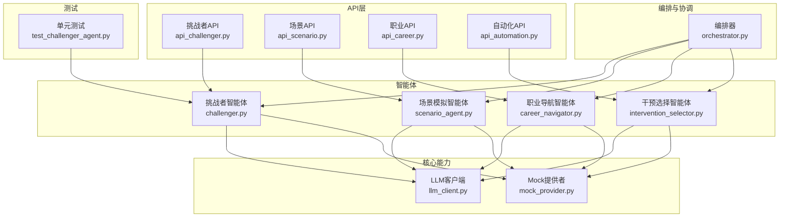
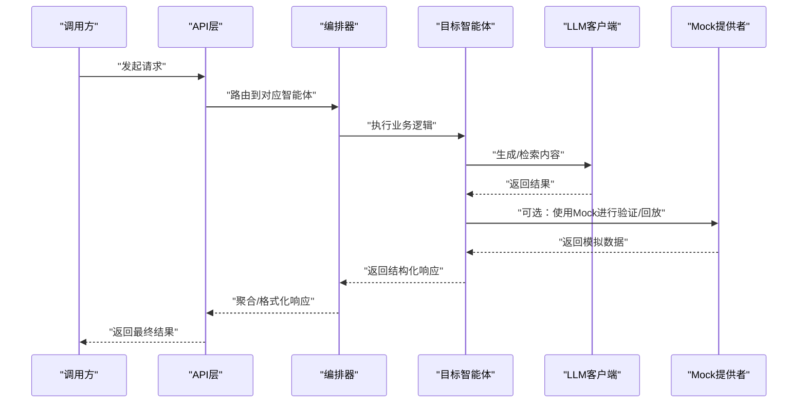
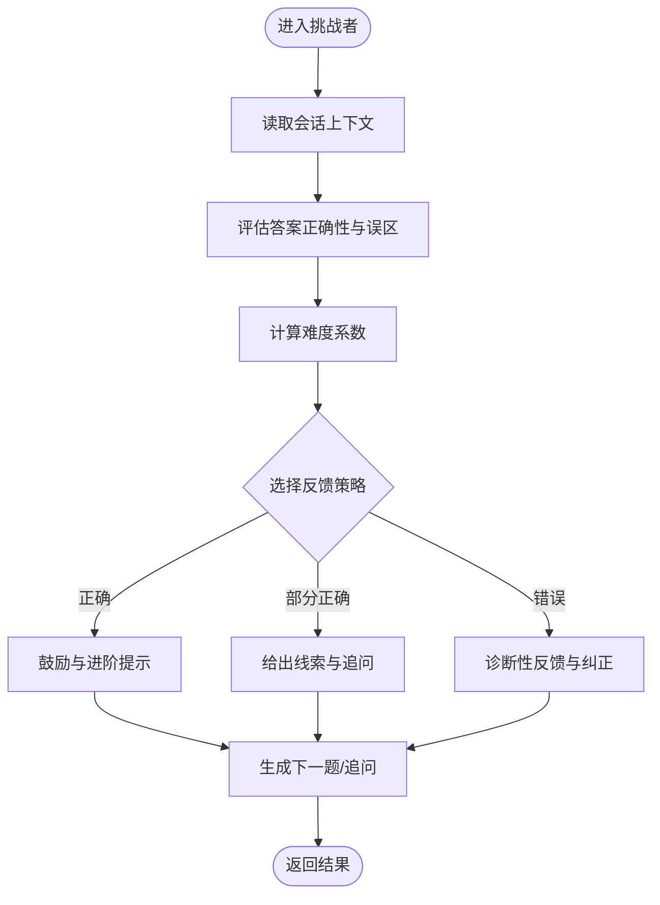
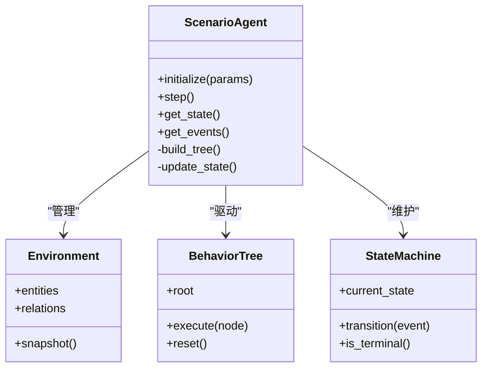
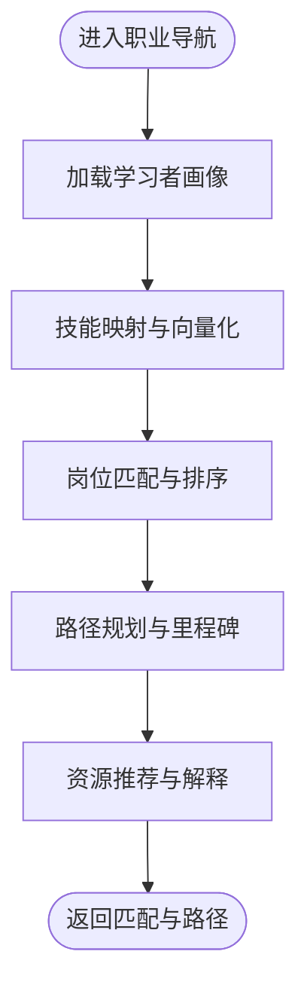
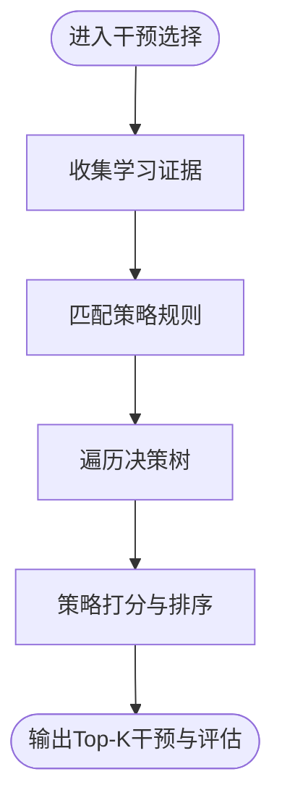
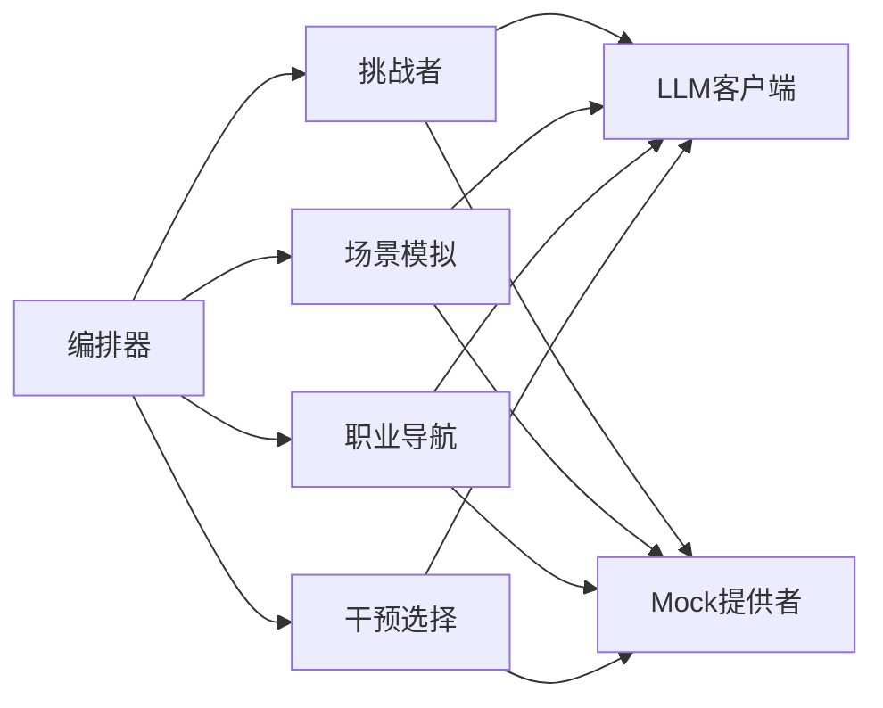

# 专业领域智能体

<cite>
**本文引用的文件**   
- [challenger.py](file://src/loopse/agent/challenger.py)
- [scenario_agent.py](file://src/loopse/agent/scenario_agent.py)
- [career_navigator.py](file://src/loopse/agent/career_navigator.py)
- [intervention_selector.py](file://src/loopse/agent/intervention_selector.py)
- [orchestrator.py](file://src/loopse/agent/orchestrator.py)
- [api_challenger.py](file://src/loopse/api/challenger.py)
- [api_scenario.py](file://src/loopse/api/scenario.py)
- [api_career.py](file://src/loopse/api/career.py)
- [api_automation.py](file://src/loopse/api/automation.py)
- [llm_client.py](file://src/loopse/core/llm_client.py)
- [mock_provider.py](file://src/loopse/core/mock_provider.py)
- [test_challenger_agent.py](file://tests/unit/test_challenger_agent.py)
</cite>

## 目录
1. [简介](#简介)
2. [项目结构](#项目结构)
3. [核心组件](#核心组件)
4. [架构总览](#架构总览)
5. [详细组件分析](#详细组件分析)
6. [依赖关系分析](#依赖关系分析)
7. [性能考量](#性能考量)
8. [故障排查指南](#故障排查指南)
9. [结论](#结论)
10. [附录](#附录)

## 简介
本技术文档聚焦于四个专业领域智能体：挑战者智能体（Challenger）、场景模拟智能体（ScenarioAgent）、职业导航智能体（CareerNavigator）与干预选择智能体（InterventionSelector）。文档从系统架构、数据流、处理逻辑、集成接口与配置参数等维度，深入解析其工作机制与实现要点，并提供可视化图示与排障建议，帮助开发者快速理解与集成。

## 项目结构
围绕四大智能体的关键代码位于后端服务模块中，API层提供对外调用入口，核心LLM客户端与Mock提供者作为通用能力支撑。测试用例覆盖关键路径，便于回归验证。

图表来源
- [challenger.py](file://src/loopse/agent/challenger.py)
- [scenario_agent.py](file://src/loopse/agent/scenario_agent.py)
- [career_navigator.py](file://src/loopse/agent/career_navigator.py)
- [intervention_selector.py](file://src/loopse/agent/intervention_selector.py)
- [orchestrator.py](file://src/loopse/agent/orchestrator.py)
- [api_challenger.py](file://src/loopse/api/challenger.py)
- [api_scenario.py](file://src/loopse/api/scenario.py)
- [api_career.py](file://src/loopse/api/career.py)
- [api_automation.py](file://src/loopse/api/automation.py)
- [llm_client.py](file://src/loopse/core/llm_client.py)
- [mock_provider.py](file://src/loopse/core/mock_provider.py)
- [test_challenger_agent.py](file://tests/unit/test_challenger_agent.py)

章节来源
- [challenger.py](file://src/loopse/agent/challenger.py)
- [scenario_agent.py](file://src/loopse/agent/scenario_agent.py)
- [career_navigator.py](file://src/loopse/agent/career_navigator.py)
- [intervention_selector.py](file://src/loopse/agent/intervention_selector.py)
- [orchestrator.py](file://src/loopse/agent/orchestrator.py)
- [api_challenger.py](file://src/loopse/api/challenger.py)
- [api_scenario.py](file://src/loopse/api/scenario.py)
- [api_career.py](file://src/loopse/api/career.py)
- [api_automation.py](file://src/loopse/api/automation.py)
- [llm_client.py](file://src/loopse/core/llm_client.py)
- [mock_provider.py](file://src/loopse/core/mock_provider.py)
- [test_challenger_agent.py](file://tests/unit/test_challenger_agent.py)

## 核心组件
- 挑战者智能体（Challenger）
  - 功能要点：问答对抗生成、难度自适应调节、反馈策略输出。
  - 关键流程：接收用户回答与上下文 → 评估正确性与认知偏差 → 动态调整难度 → 生成引导式反馈或追问。
  - 外部依赖：LLM客户端用于生成高质量问题与反馈；Mock提供者用于离线验证。
- 场景模拟智能体（ScenarioAgent）
  - 功能要点：环境建模、行为树执行、状态机管理。
  - 关键流程：初始化场景参数 → 构建环境与实体状态 → 驱动行为树节点 → 更新状态机并产出事件。
  - 外部依赖：LLM客户端用于情境文本生成；Mock提供者用于回放与断言。
- 职业导航智能体（CareerNavigator）
  - 功能要点：技能映射、岗位匹配、发展路径规划。
  - 关键流程：读取学习者画像 → 映射到技能图谱 → 匹配目标岗位 → 生成阶段性发展路径与资源建议。
  - 外部依赖：LLM客户端用于路径解释与资源推荐；Mock提供者用于离线走查。
- 干预选择智能体（InterventionSelector）
  - 功能要点：策略库检索、决策树推理、效果评估。
  - 关键流程：收集学习证据 → 匹配策略规则 → 选择最优干预 → 预估效果并记录评估指标。
  - 外部依赖：LLM客户端用于策略解释与个性化微调；Mock提供者用于A/B对比。

章节来源
- [challenger.py](file://src/loopse/agent/challenger.py)
- [scenario_agent.py](file://src/loopse/agent/scenario_agent.py)
- [career_navigator.py](file://src/loopse/agent/career_navigator.py)
- [intervention_selector.py](file://src/loopse/agent/intervention_selector.py)
- [llm_client.py](file://src/loopse/core/llm_client.py)
- [mock_provider.py](file://src/loopse/core/mock_provider.py)

## 架构总览
整体采用“编排器 + 多智能体 + API网关”的分层架构。编排器负责跨智能体的任务路由与协同；各智能体通过统一的LLM客户端进行对话与内容生成；API层暴露REST接口供前端或第三方系统集成。

图表来源
- [orchestrator.py](file://src/loopse/agent/orchestrator.py)
- [api_challenger.py](file://src/loopse/api/challenger.py)
- [api_scenario.py](file://src/loopse/api/scenario.py)
- [api_career.py](file://src/loopse/api/career.py)
- [api_automation.py](file://src/loopse/api/automation.py)
- [llm_client.py](file://src/loopse/core/llm_client.py)
- [mock_provider.py](file://src/loopse/core/mock_provider.py)

## 详细组件分析

### 挑战者智能体（Challenger）
- 设计要点
  - 问答对抗机制：基于当前知识掌握度与错误模式，生成具有区分度的题目与追问。
  - 难度自适应：依据历史作答表现与置信度估计，动态提升或降低难度。
  - 反馈生成策略：提供诊断性反馈、提示线索与元认知反思问题。
- 关键数据结构
  - 会话上下文：包含历史问答、知识点标签、错误类型统计。
  - 难度指标：正确率、反应时间、混淆项分布。
  - 反馈模板：按错误类别与掌握程度分类的反馈片段。
- 算法流程
  - 输入：用户答案、上下文、画像特征。
  - 处理：评估正确性 → 识别误区 → 计算难度系数 → 选择反馈策略。
  - 输出：下一题/追问、难度等级、反馈内容。
- 复杂度与优化
  - 评估与策略选择为常数级查找+轻量评分，适合在线实时。
  - 可引入缓存与预生成题库以缩短首字延迟。
- 错误处理
  - 对LLM超时与格式异常进行降级与重试。
  - 对缺失上下文进行兜底默认策略。

图表来源
- [challenger.py](file://src/loopse/agent/challenger.py)
- [test_challenger_agent.py](file://tests/unit/test_challenger_agent.py)

章节来源
- [challenger.py](file://src/loopse/agent/challenger.py)
- [test_challenger_agent.py](file://tests/unit/test_challenger_agent.py)

### 场景模拟智能体（ScenarioAgent）
- 设计要点
  - 环境建模：将现实业务抽象为实体、属性与关系，支持参数化配置。
  - 行为树执行：以节点形式组织动作、条件与序列，支持并行与中断。
  - 状态机管理：维护全局与局部状态，驱动场景演进与事件发布。
- 关键数据结构
  - 场景定义：实体清单、初始状态、行为树根节点。
  - 运行时状态：实体状态表、事件队列、计时器。
  - 日志与快照：用于回放与调试。
- 执行流程
  - 初始化：加载场景定义 → 构建状态机 → 注册行为树。
  - 步进：根据时间片或事件触发 → 执行行为树节点 → 更新状态 → 产出事件。
  - 终止：达到目标或失败条件时结束并汇总报告。
- 性能与扩展
  - 行为树节点可插拔，支持自定义动作与条件。
  - 状态变更批量合并，减少锁竞争。

图表来源
- [scenario_agent.py](file://src/loopse/agent/scenario_agent.py)

章节来源
- [scenario_agent.py](file://src/loopse/agent/scenario_agent.py)

### 职业导航智能体（CareerNavigator）
- 设计要点
  - 技能映射：将学习者画像中的知识与经验映射到岗位所需技能集合。
  - 岗位匹配：基于相似度与约束条件筛选候选岗位。
  - 发展路径规划：生成阶段目标、里程碑与资源清单。
- 关键数据结构
  - 学习者画像：技能向量、兴趣标签、历史成就。
  - 岗位模型：职责描述、技能要求、难度等级。
  - 路径计划：阶段目标、前置依赖、资源链接。
- 算法流程
  - 输入：学习者画像与偏好。
  - 处理：技能对齐 → 岗位排序 → 路径分解 → 资源推荐。
  - 输出：匹配岗位列表与发展路径。
- 可解释性
  - 为每个匹配与路径提供理由说明，增强信任。

图表来源
- [career_navigator.py](file://src/loopse/agent/career_navigator.py)

章节来源
- [career_navigator.py](file://src/loopse/agent/career_navigator.py)

### 干预选择智能体（InterventionSelector）
- 设计要点
  - 策略库：按学习阶段、错误类型与动机水平组织干预策略。
  - 决策树：基于规则与阈值选择最优干预。
  - 效果评估：预估短期与长期收益，支持A/B实验。
- 关键数据结构
  - 策略条目：适用条件、干预内容、预期增益。
  - 证据集：答题表现、交互日志、生理信号（可选）。
  - 评估指标：命中率、停留时长、迁移效果。
- 决策流程
  - 输入：证据集与上下文。
  - 处理：规则匹配 → 决策树遍历 → 策略打分与排序。
  - 输出：Top-K干预方案及评估摘要。
- 可观测性
  - 记录决策路径与命中规则，便于审计与调优。

图表来源
- [intervention_selector.py](file://src/loopse/agent/intervention_selector.py)

章节来源
- [intervention_selector.py](file://src/loopse/agent/intervention_selector.py)

## 依赖关系分析
- 内部依赖
  - 编排器与各智能体松耦合，通过统一接口通信。
  - 智能体均依赖LLM客户端进行自然语言生成与检索增强。
  - Mock提供者用于离线测试与回放，避免强依赖外部服务。
- 外部依赖
  - LLM服务：需考虑超时、限流与降级策略。
  - 存储与检索：知识库与向量库在扩展时可接入。
- 潜在风险
  - 循环依赖：编排器不应直接持有智能体实例，应通过工厂或注册表获取。
  - 单点故障：LLM不可用时需回退至规则引擎与缓存。

图表来源
- [orchestrator.py](file://src/loopse/agent/orchestrator.py)
- [challenger.py](file://src/loopse/agent/challenger.py)
- [scenario_agent.py](file://src/loopse/agent/scenario_agent.py)
- [career_navigator.py](file://src/loopse/agent/career_navigator.py)
- [intervention_selector.py](file://src/loopse/agent/intervention_selector.py)
- [llm_client.py](file://src/loopse/core/llm_client.py)
- [mock_provider.py](file://src/loopse/core/mock_provider.py)

章节来源
- [orchestrator.py](file://src/loopse/agent/orchestrator.py)
- [challenger.py](file://src/loopse/agent/challenger.py)
- [scenario_agent.py](file://src/loopse/agent/scenario_agent.py)
- [career_navigator.py](file://src/loopse/agent/career_navigator.py)
- [intervention_selector.py](file://src/loopse/agent/intervention_selector.py)
- [llm_client.py](file://src/loopse/core/llm_client.py)
- [mock_provider.py](file://src/loopse/core/mock_provider.py)

## 性能考量
- 首字延迟优化
  - 预取与缓存：对高频问题与反馈模板进行缓存。
  - 增量生成：优先返回简要提示，再逐步展开详细内容。
- 并发与吞吐
  - 行为树与状态机操作尽量无锁或细粒度锁。
  - 对LLM调用进行批处理与连接池复用。
- 资源控制
  - 设置最大递归深度与超时阈值，防止无限循环与长尾请求。
  - 对大对象进行分页与流式传输。

[本节为通用指导，不直接分析具体文件]

## 故障排查指南
- 常见问题
  - LLM服务不可用：检查网络连通性与鉴权，启用Mock提供者进行降级。
  - 行为树死锁：打印节点执行栈，确认条件分支是否收敛。
  - 状态不一致：比对快照与当前状态，定位未处理的异步事件。
- 定位手段
  - 开启详细日志，记录关键决策路径与中间状态。
  - 使用单元测试复现问题，缩小范围。
- 恢复策略
  - 自动重试与熔断，避免雪崩。
  - 回滚到上一稳定版本或切换备用策略库。

章节来源
- [test_challenger_agent.py](file://tests/unit/test_challenger_agent.py)
- [llm_client.py](file://src/loopse/core/llm_client.py)
- [mock_provider.py](file://src/loopse/core/mock_provider.py)

## 结论
四大智能体围绕“评测—模拟—导航—干预”的学习闭环形成互补能力。通过编排器统一调度、LLM客户端统一生成与Mock提供者统一验证，系统在可扩展性、可观测性与稳定性方面具备良好基础。后续可在策略库规模、行为树表达力与评估指标体系上持续深化。

[本节为总结性内容，不直接分析具体文件]

## 附录

### 配置参数参考
- 挑战者智能体
  - 难度基线、难度步长、反馈风格、重试次数、超时阈值。
- 场景模拟智能体
  - 实体数量上限、时间步长、行为树深度限制、快照频率。
- 职业导航智能体
  - 相似度阈值、岗位数量上限、路径长度上限、资源权重。
- 干预选择智能体
  - 策略库版本、规则优先级、评估窗口、A/B分流比例。

[本节为概念性说明，不直接分析具体文件]

### 调用接口与集成示例
- 挑战者API
  - 端点：POST /api/challenger/question
  - 入参：用户答案、上下文ID、难度偏好
  - 出参：下一题、难度等级、反馈内容
  - 示例：见 [api_challenger.py](file://src/loopse/api/challenger.py)
- 场景API
  - 端点：POST /api/scenario/start
  - 入参：场景ID、初始参数
  - 出参：场景快照、事件列表
  - 示例：见 [api_scenario.py](file://src/loopse/api/scenario.py)
- 职业API
  - 端点：POST /api/career/match
  - 入参：学习者画像、偏好
  - 出参：匹配岗位、发展路径
  - 示例：见 [api_career.py](file://src/loopse/api/career.py)
- 自动化API
  - 端点：POST /api/automation/intervene
  - 入参：证据集、上下文
  - 出参：Top-K干预与评估摘要
  - 示例：见 [api_automation.py](file://src/loopse/api/automation.py)

章节来源
- [api_challenger.py](file://src/loopse/api/challenger.py)
- [api_scenario.py](file://src/loopse/api/scenario.py)
- [api_career.py](file://src/loopse/api/career.py)
- [api_automation.py](file://src/loopse/api/automation.py)