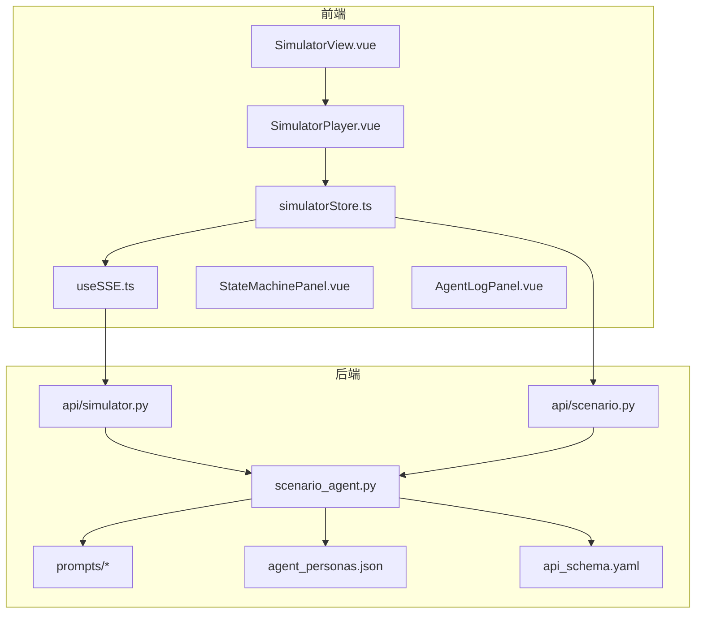
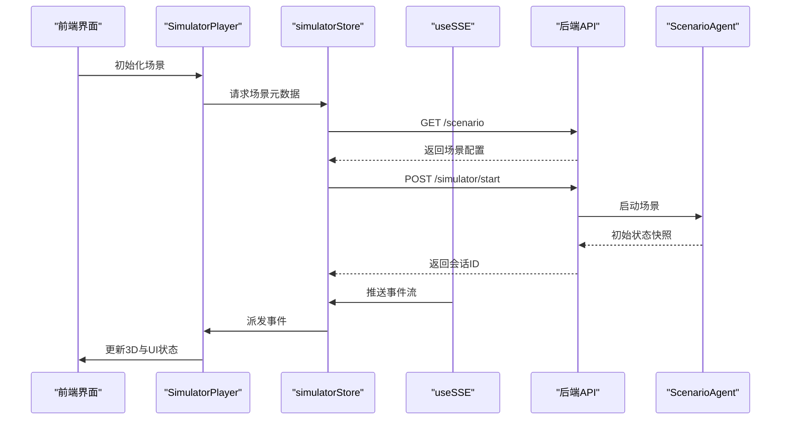
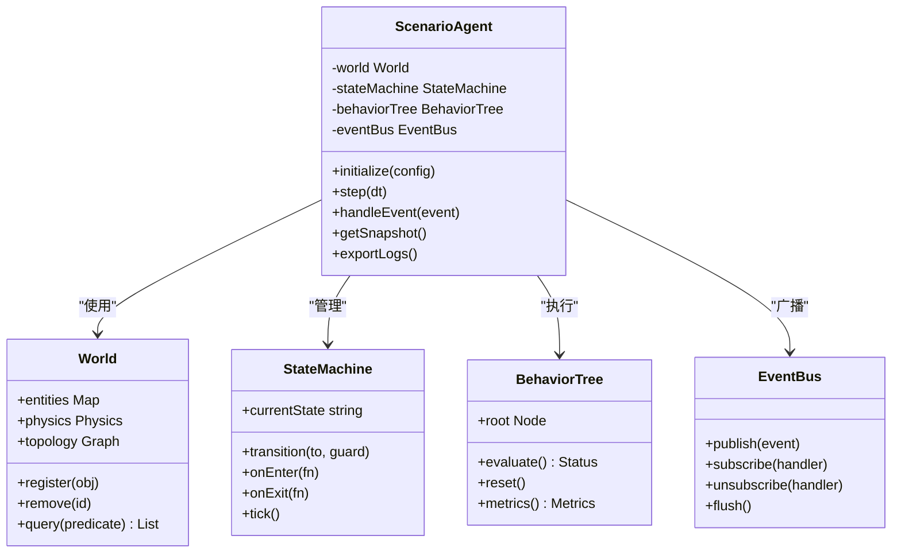
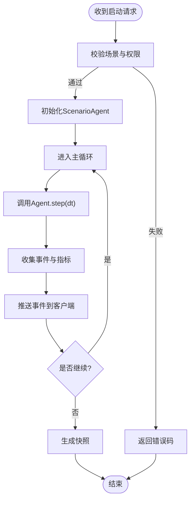
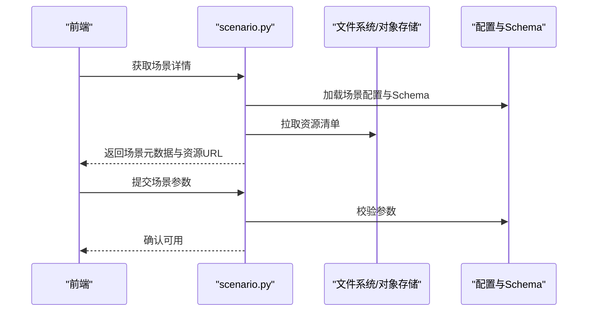
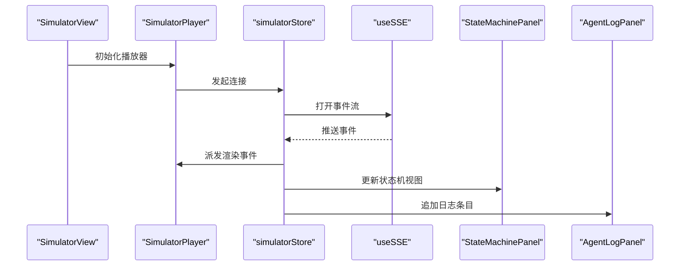
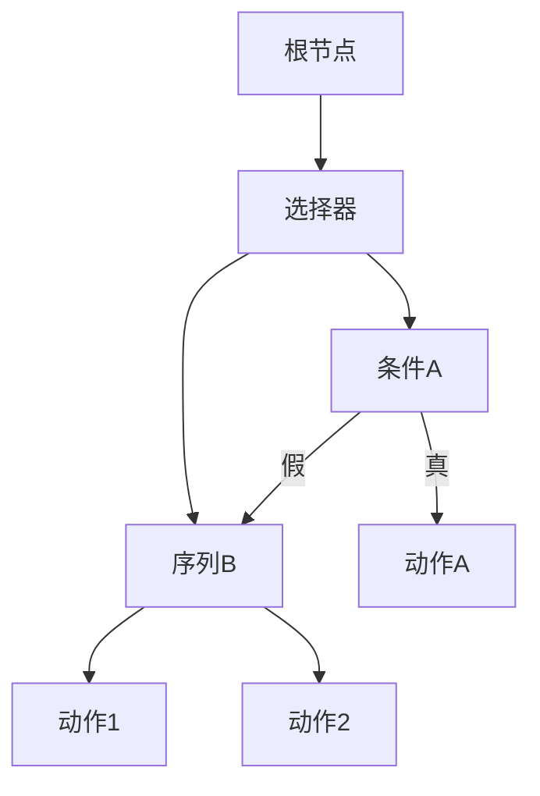
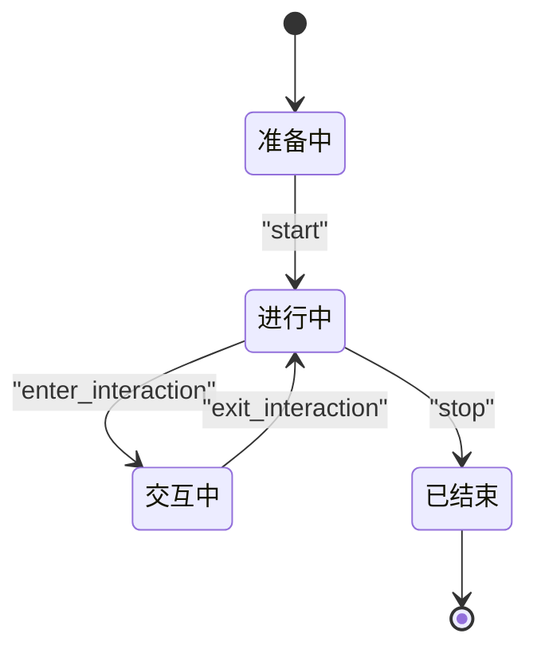
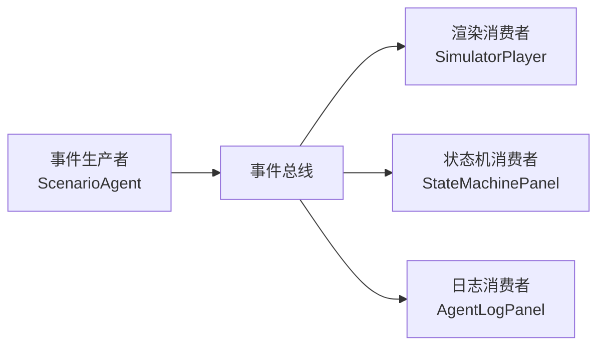
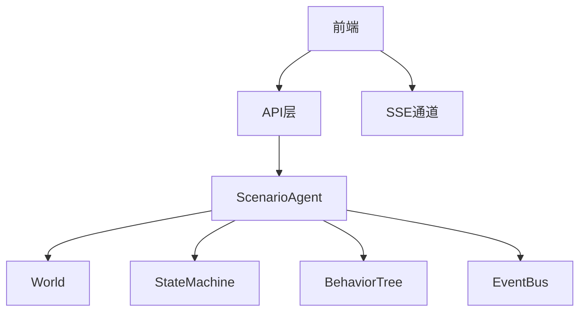

# 场景模拟智能体

<cite>
**本文引用的文件**   
- [src/loopse/agent/scenario_agent.py](file://src/loopse/agent/scenario_agent.py)
- [src/loopse/api/simulator.py](file://src/loopse/api/simulator.py)
- [src/loopse/api/scenario.py](file://src/loopse/api/scenario.py)
- [frontend/src/views/SimulatorView.vue](file://frontend/src/views/SimulatorView.vue)
- [frontend/src/components/SimulatorPlayer.vue](file://frontend/src/components/SimulatorPlayer.vue)
- [frontend/src/stores/simulatorStore.ts](file://frontend/src/stores/simulatorStore.ts)
- [frontend/src/types/sse.ts](file://frontend/src/types/sse.ts)
- [frontend/src/composables/useSSE.ts](file://frontend/src/composables/useSSE.ts)
- [frontend/src/components/StateMachinePanel.vue](file://frontend/src/components/StateMachinePanel.vue)
- [frontend/src/components/AgentLogPanel.vue](file://frontend/src/components/AgentLogPanel.vue)
- [config/prompts/orchestrator/route.txt](file://config/prompts/orchestrator/route.txt)
- [config/prompts/path_planner/plan_path.txt](file://config/prompts/path_planner/plan_path.txt)
- [config/prompts/profiler/onboarding.txt](file://config/prompts/profiler/onboarding.txt)
- [config/prompts/profiler/update_profile.txt](file://config/prompts/profiler/update_profile.txt)
- [config/prompts/challenger/*](file://config/prompts/challenger/)
- [config/prompts/retriever/query_expansion.txt](file://config/prompts/retriever/query_expansion.txt)
- [config/prompts/retriever/search_query.txt](file://config/prompts/retriever/search_query.txt)
- [config/prompts/resource_generator/generate_code.txt](file://config/prompts/resource_generator/generate_code.txt)
- [config/prompts/resource_generator/generate_doc.txt](file://config/prompts/resource_generator/generate_doc.txt)
- [config/prompts/resource_generator/generate_exercise.txt](file://config/prompts/resource_generator/generate_exercise.txt)
- [config/prompts/resource_generator/generate_infographic.txt](file://config/prompts/resource_generator/generate_infographic.txt)
- [config/prompts/resource_generator/generate_script.txt](file://config/prompts/resource_generator/generate_script.txt)
- [config/prompts/trust/scope_check.txt](file://config/prompts/trust/scope_check.txt)
- [config/prompts/trust/source_citation.txt](file://config/prompts/trust/source_citation.txt)
- [config/agent_personas.json](file://config/agent_personas.json)
- [config/api_schema.yaml](file://config/api_schema.yaml)
</cite>

## 目录
1. [简介](#简介)
2. [项目结构](#项目结构)
3. [核心组件](#核心组件)
4. [架构总览](#架构总览)
5. [详细组件分析](#详细组件分析)
6. [依赖关系分析](#依赖关系分析)
7. [性能考虑](#性能考虑)
8. [故障排查指南](#故障排查指南)
9. [结论](#结论)
10. [附录](#附录)

## 简介
本技术文档聚焦“场景模拟智能体”（ScenarioAgent）及其相关系统，围绕以下目标展开：
- 环境建模机制：虚拟世界构建、物理规则定义、交互对象管理
- 执行引擎与状态管理：行为树执行引擎、状态机管理、事件驱动架构
- 配置与协议：场景配置格式、角色行为定义、交互协议
- 渲染与同步：3D渲染集成、实时同步机制
- 工具与调试：场景开发工具链与调试方法
- 性能优化：关键策略与实践建议

## 项目结构
本项目采用前后端分离的模块化架构。后端以Python服务为核心，提供场景与模拟器API；前端基于Vue3+TypeScript，负责3D可视化、状态面板与日志展示。

图表来源
- [frontend/src/views/SimulatorView.vue](file://frontend/src/views/SimulatorView.vue)
- [frontend/src/components/SimulatorPlayer.vue](file://frontend/src/components/SimulatorPlayer.vue)
- [frontend/src/stores/simulatorStore.ts](file://frontend/src/stores/simulatorStore.ts)
- [frontend/src/composables/useSSE.ts](file://frontend/src/composables/useSSE.ts)
- [src/loopse/api/simulator.py](file://src/loopse/api/simulator.py)
- [src/loopse/api/scenario.py](file://src/loopse/api/scenario.py)
- [src/loopse/agent/scenario_agent.py](file://src/loopse/agent/scenario_agent.py)
- [config/agent_personas.json](file://config/agent_personas.json)
- [config/api_schema.yaml](file://config/api_schema.yaml)

章节来源
- [src/loopse/agent/scenario_agent.py](file://src/loopse/agent/scenario_agent.py)
- [src/loopse/api/simulator.py](file://src/loopse/api/simulator.py)
- [src/loopse/api/scenario.py](file://src/loopse/api/scenario.py)
- [frontend/src/views/SimulatorView.vue](file://frontend/src/views/SimulatorView.vue)
- [frontend/src/components/SimulatorPlayer.vue](file://frontend/src/components/SimulatorPlayer.vue)
- [frontend/src/stores/simulatorStore.ts](file://frontend/src/stores/simulatorStore.ts)
- [frontend/src/composables/useSSE.ts](file://frontend/src/composables/useSSE.ts)
- [config/agent_personas.json](file://config/agent_personas.json)
- [config/api_schema.yaml](file://config/api_schema.yaml)

## 核心组件
- 场景模拟智能体（ScenarioAgent）：封装环境建模、行为决策、事件分发与状态更新的核心逻辑。
- 模拟器API（simulator.py）：暴露场景运行、步骤推进、回放与快照等接口。
- 场景API（scenario.py）：提供场景元数据、资源加载、角色与规则配置能力。
- 前端播放器（SimulatorPlayer.vue）：驱动3D渲染、接收事件流并驱动UI状态。
- 状态机面板（StateMachinePanel.vue）：可视化当前状态机节点与转移。
- 日志面板（AgentLogPanel.vue）：聚合Agent运行日志与诊断信息。
- 提示词与配置：orchestrator、path_planner、profiler、retriever、resource_generator、trust等提示模板与角色人设、API Schema。

章节来源
- [src/loopse/agent/scenario_agent.py](file://src/loopse/agent/scenario_agent.py)
- [src/loopse/api/simulator.py](file://src/loopse/api/simulator.py)
- [src/loopse/api/scenario.py](file://src/loopse/api/scenario.py)
- [frontend/src/components/SimulatorPlayer.vue](file://frontend/src/components/SimulatorPlayer.vue)
- [frontend/src/components/StateMachinePanel.vue](file://frontend/src/components/StateMachinePanel.vue)
- [frontend/src/components/AgentLogPanel.vue](file://frontend/src/components/AgentLogPanel.vue)
- [config/prompts/orchestrator/route.txt](file://config/prompts/orchestrator/route.txt)
- [config/prompts/path_planner/plan_path.txt](file://config/prompts/path_planner/plan_path.txt)
- [config/prompts/profiler/onboarding.txt](file://config/prompts/profiler/onboarding.txt)
- [config/prompts/profiler/update_profile.txt](file://config/prompts/profiler/update_profile.txt)
- [config/prompts/retriever/query_expansion.txt](file://config/prompts/retriever/query_expansion.txt)
- [config/prompts/retriever/search_query.txt](file://config/prompts/retriever/search_query.txt)
- [config/prompts/resource_generator/generate_code.txt](file://config/prompts/resource_generator/generate_code.txt)
- [config/prompts/resource_generator/generate_doc.txt](file://config/prompts/resource_generator/generate_doc.txt)
- [config/prompts/resource_generator/generate_exercise.txt](file://config/prompts/resource_generator/generate_exercise.txt)
- [config/prompts/resource_generator/generate_infographic.txt](file://config/prompts/resource_generator/generate_infographic.txt)
- [config/prompts/resource_generator/generate_script.txt](file://config/prompts/resource_generator/generate_script.txt)
- [config/prompts/trust/scope_check.txt](file://config/prompts/trust/scope_check.txt)
- [config/prompts/trust/source_citation.txt](file://config/prompts/trust/source_citation.txt)
- [config/agent_personas.json](file://config/agent_personas.json)
- [config/api_schema.yaml](file://config/api_schema.yaml)

## 架构总览
整体采用“事件驱动 + 状态机 + 行为树”的混合架构：
- 事件总线：统一承载场景内动作、传感器输入与系统通知。
- 状态机：管理场景生命周期与角色状态迁移。
- 行为树：为角色提供可组合、可观测的决策流程。
- 渲染层：前端通过3D播放器订阅事件流，驱动模型动画与UI。

图表来源
- [frontend/src/components/SimulatorPlayer.vue](file://frontend/src/components/SimulatorPlayer.vue)
- [frontend/src/stores/simulatorStore.ts](file://frontend/src/stores/simulatorStore.ts)
- [frontend/src/composables/useSSE.ts](file://frontend/src/composables/useSSE.ts)
- [src/loopse/api/simulator.py](file://src/loopse/api/simulator.py)
- [src/loopse/api/scenario.py](file://src/loopse/api/scenario.py)
- [src/loopse/agent/scenario_agent.py](file://src/loopse/agent/scenario_agent.py)

## 详细组件分析

### 场景模拟智能体（ScenarioAgent）
职责边界
- 环境建模：维护虚拟世界实体、空间拓扑、物理约束与交互对象集合。
- 行为决策：基于行为树与状态机驱动角色行为序列。
- 事件编排：将内部状态变化转换为标准化事件，供渲染与外部系统消费。
- 配置解析：读取场景描述、角色人设、提示词模板与API契约。

关键实现要点
- 环境建模
  - 世界图：节点表示区域/房间/物体，边表示可达性与约束。
  - 物理规则：碰撞检测、重力/摩擦力参数、时间步长与步进器。
  - 交互对象：可拾取、可操作、可对话的对象注册表与生命周期。
- 行为树执行引擎
  - 节点类型：选择器、序列、条件、动作、装饰器等。
  - 调度策略：每帧或事件触发时评估根节点，支持优先级与中断。
  - 可观测性：记录节点命中次数、耗时与失败原因。
- 状态机管理
  - 状态定义：全局场景状态与角色局部状态。
  - 转移条件：基于事件、计时器与外部信号。
  - 钩子：进入/退出/循环回调用于副作用与持久化。
- 事件驱动架构
  - 事件总线：发布/订阅模式，支持过滤与节流。
  - 事件规范：统一载荷结构、版本兼容与幂等处理。
  - 可靠性：重试、去重与顺序保证策略。

图表来源
- [src/loopse/agent/scenario_agent.py](file://src/loopse/agent/scenario_agent.py)

章节来源
- [src/loopse/agent/scenario_agent.py](file://src/loopse/agent/scenario_agent.py)

### 模拟器API（simulator.py）
职责边界
- 暴露场景运行控制：开始、暂停、步进、停止。
- 提供回放与快照：导出中间状态、断点续跑。
- 事件流输出：通过SSE或WebSocket推送运行时事件。

关键流程
- 启动：校验场景ID与权限，创建Agent实例，预热资源。
- 步进：按dt调用Agent.step，收集事件与指标。
- 快照：序列化World与State，落盘或缓存。
- 回放：从快照恢复状态，重放事件序列。

图表来源
- [src/loopse/api/simulator.py](file://src/loopse/api/simulator.py)

章节来源
- [src/loopse/api/simulator.py](file://src/loopse/api/simulator.py)

### 场景API（scenario.py）
职责边界
- 场景元数据：名称、描述、难度、适用人群。
- 资源清单：3D模型、贴图、音效、脚本。
- 角色与规则：角色人设、初始状态、行为模板、物理参数。
- 提示词装配：根据上下文动态组装提示词模板。

关键能力
- 场景加载：按需懒加载资源，预取关键资产。
- 配置校验：基于API Schema进行强校验与回退策略。
- 多租户隔离：按会话隔离场景实例与资源缓存。

图表来源
- [src/loopse/api/scenario.py](file://src/loopse/api/scenario.py)
- [config/api_schema.yaml](file://config/api_schema.yaml)

章节来源
- [src/loopse/api/scenario.py](file://src/loopse/api/scenario.py)
- [config/api_schema.yaml](file://config/api_schema.yaml)

### 前端播放器与状态机面板
职责边界
- SimulatorPlayer：驱动3D渲染、播放动画、响应交互。
- simulatorStore：集中管理会话、事件队列与状态映射。
- useSSE：建立与服务端的事件通道，处理断线重连。
- StateMachinePanel：可视化状态机节点与转移路径。
- AgentLogPanel：聚合Agent日志，支持筛选与导出。

关键流程
- 连接：建立SSE通道，订阅事件流。
- 渲染：将事件映射为3D变换与材质更新。
- 状态：维护当前状态机节点与历史栈。
- 日志：异步写入本地存储，支持分页与搜索。

图表来源
- [frontend/src/views/SimulatorView.vue](file://frontend/src/views/SimulatorView.vue)
- [frontend/src/components/SimulatorPlayer.vue](file://frontend/src/components/SimulatorPlayer.vue)
- [frontend/src/stores/simulatorStore.ts](file://frontend/src/stores/simulatorStore.ts)
- [frontend/src/composables/useSSE.ts](file://frontend/src/composables/useSSE.ts)
- [frontend/src/components/StateMachinePanel.vue](file://frontend/src/components/StateMachinePanel.vue)
- [frontend/src/components/AgentLogPanel.vue](file://frontend/src/components/AgentLogPanel.vue)
- [frontend/src/types/sse.ts](file://frontend/src/types/sse.ts)

章节来源
- [frontend/src/components/SimulatorPlayer.vue](file://frontend/src/components/SimulatorPlayer.vue)
- [frontend/src/stores/simulatorStore.ts](file://frontend/src/stores/simulatorStore.ts)
- [frontend/src/composables/useSSE.ts](file://frontend/src/composables/useSSE.ts)
- [frontend/src/components/StateMachinePanel.vue](file://frontend/src/components/StateMachinePanel.vue)
- [frontend/src/components/AgentLogPanel.vue](file://frontend/src/components/AgentLogPanel.vue)
- [frontend/src/types/sse.ts](file://frontend/src/types/sse.ts)

### 行为树执行引擎（概念说明）
- 节点设计：条件节点判断环境事实，动作节点执行原子操作，组合节点组织复杂逻辑。
- 执行语义：自上而下短路求值，支持抢占与超时。
- 可观测性：节点级耗时统计、命中计数与失败分支追踪。
- 扩展点：自定义节点类型、插件式IO适配器。

[此图为概念示意，不直接映射具体源码文件]

### 状态机管理（概念说明）
- 状态定义：全局状态（如“准备中/进行中/已结束”）与角色状态（如“空闲/移动/交互”）。
- 转移守卫：基于事件、计时器与外部信号的条件检查。
- 钩子函数：在进入/退出状态时执行副作用（如播放音效、更新UI）。
- 可视化：在面板中高亮当前节点与最近转移路径。

[此图为概念示意，不直接映射具体源码文件]

### 事件驱动架构（概念说明）
- 事件总线：解耦生产者与消费者，支持主题过滤与优先级。
- 事件规范：统一字段（id、type、payload、timestamp），版本兼容策略。
- 可靠性：去重、重试、顺序保证与背压控制。
- 前端适配：批量合并、节流与增量渲染。

[此图为概念示意，不直接映射具体源码文件]

### 场景配置格式与角色行为定义
- 场景配置
  - 元数据：名称、版本、难度、标签。
  - 资源清单：模型、贴图、音频、脚本路径与哈希。
  - 物理参数：重力、摩擦、时间步长、碰撞层。
  - 角色定义：人设、初始位置、行为模板、技能集。
  - 提示词装配：根据上下文注入变量，支持多语言。
- 角色行为
  - 行为模板：基于行为树的可复用片段。
  - 技能库：动作原语与组合策略。
  - 约束：安全边界、冷却时间、资源配额。
- 交互协议
  - 事件类型：用户输入、系统通知、环境变化。
  - 消息格式：JSON Schema校验，包含必要字段与可选扩展。
  - 幂等与顺序：事件ID去重，分区有序。

章节来源
- [config/api_schema.yaml](file://config/api_schema.yaml)
- [config/agent_personas.json](file://config/agent_personas.json)
- [config/prompts/orchestrator/route.txt](file://config/prompts/orchestrator/route.txt)
- [config/prompts/path_planner/plan_path.txt](file://config/prompts/path_planner/plan_path.txt)
- [config/prompts/profiler/onboarding.txt](file://config/prompts/profiler/onboarding.txt)
- [config/prompts/profiler/update_profile.txt](file://config/prompts/profiler/update_profile.txt)
- [config/prompts/retriever/query_expansion.txt](file://config/prompts/retriever/query_expansion.txt)
- [config/prompts/retriever/search_query.txt](file://config/prompts/retriever/search_query.txt)
- [config/prompts/resource_generator/generate_code.txt](file://config/prompts/resource_generator/generate_code.txt)
- [config/prompts/resource_generator/generate_doc.txt](file://config/prompts/resource_generator/generate_doc.txt)
- [config/prompts/resource_generator/generate_exercise.txt](file://config/prompts/resource_generator/generate_exercise.txt)
- [config/prompts/resource_generator/generate_infographic.txt](file://config/prompts/resource_generator/generate_infographic.txt)
- [config/prompts/resource_generator/generate_script.txt](file://config/prompts/resource_generator/generate_script.txt)
- [config/prompts/trust/scope_check.txt](file://config/prompts/trust/scope_check.txt)
- [config/prompts/trust/source_citation.txt](file://config/prompts/trust/source_citation.txt)

### 3D渲染集成与实时同步
- 渲染管线
  - 模型加载：GLTF/OBJ导入，纹理压缩与LOD。
  - 动画系统：关键帧与状态机驱动的骨骼动画。
  - 光照与后处理：实时阴影、泛光、景深。
- 同步机制
  - 事件映射：将后端事件转换为渲染指令。
  - 插值与预测：平滑过渡与网络抖动补偿。
  - 断线重连：自动恢复与状态对齐。
- 性能优化
  - 批渲染：合并Draw Call，减少状态切换。
  - 内存管理：按需卸载未使用资源。
  - 帧率控制：自适应降采样与延迟预算。

章节来源
- [frontend/src/components/SimulatorPlayer.vue](file://frontend/src/components/SimulatorPlayer.vue)
- [frontend/src/stores/simulatorStore.ts](file://frontend/src/stores/simulatorStore.ts)
- [frontend/src/composables/useSSE.ts](file://frontend/src/composables/useSSE.ts)

### 场景开发工具与调试方法
- 开发工具
  - 场景编辑器：可视化编辑世界图与角色行为。
  - 资源管理器：上传、预览与版本管理。
  - 提示词工作台：在线编辑与A/B测试。
- 调试方法
  - 状态机面板：高亮当前节点与转移路径。
  - 日志面板：筛选级别、关键字与时间范围。
  - 回放模式：从快照恢复并逐步步进。
  - 指标看板：CPU/GPU占用、事件吞吐与延迟分布。

章节来源
- [frontend/src/components/StateMachinePanel.vue](file://frontend/src/components/StateMachinePanel.vue)
- [frontend/src/components/AgentLogPanel.vue](file://frontend/src/components/AgentLogPanel.vue)

## 依赖关系分析
- 模块耦合
  - ScenarioAgent依赖World、StateMachine、BehaviorTree与EventBus，形成高内聚低耦合。
  - API层仅暴露稳定接口，屏蔽内部实现细节。
  - 前端通过Store与SSE解耦渲染与业务逻辑。
- 外部依赖
  - 3D渲染库：按需引入，避免首屏体积过大。
  - 事件传输：SSE优先，必要时降级为轮询。
  - 配置与Schema：严格校验，提供默认回退。

图表来源
- [src/loopse/agent/scenario_agent.py](file://src/loopse/agent/scenario_agent.py)
- [src/loopse/api/simulator.py](file://src/loopse/api/simulator.py)
- [frontend/src/stores/simulatorStore.ts](file://frontend/src/stores/simulatorStore.ts)
- [frontend/src/composables/useSSE.ts](file://frontend/src/composables/useSSE.ts)

章节来源
- [src/loopse/agent/scenario_agent.py](file://src/loopse/agent/scenario_agent.py)
- [src/loopse/api/simulator.py](file://src/loopse/api/simulator.py)
- [frontend/src/stores/simulatorStore.ts](file://frontend/src/stores/simulatorStore.ts)
- [frontend/src/composables/useSSE.ts](file://frontend/src/composables/useSSE.ts)

## 性能考虑
- 服务端
  - 步进器：固定时间步长，避免抖动；支持可变步长与插值。
  - 事件批处理：合并高频事件，降低网络开销。
  - 快照压缩：差量快照与索引化查询。
- 前端
  - 渲染优化：实例化渲染、GPU Instancing、纹理图集。
  - 内存回收：及时释放不再使用的模型与纹理。
  - 节流与防抖：对鼠标/触摸输入进行节流。
- 网络
  - 压缩传输：启用Gzip/Brotli。
  - 断线重连：指数退避与心跳保活。
  - 带宽自适应：根据RTT调整事件粒度。

[本节为通用指导，不直接分析具体文件]

## 故障排查指南
- 常见问题
  - 事件丢失：检查事件ID去重与顺序保证；查看SSE连接状态。
  - 状态不同步：对比服务端快照与前端状态机；定位转移守卫条件。
  - 渲染卡顿：监控Draw Call与三角面数；启用LOD与遮挡剔除。
  - 资源加载失败：校验资源URL与跨域策略；检查缓存命中。
- 定位手段
  - 日志面板：过滤错误级别，导出完整堆栈。
  - 状态机面板：回放最近转移路径，定位异常节点。
  - 指标看板：观察CPU/GPU峰值与事件吞吐。
  - 回放模式：从快照恢复，逐步步进复现问题。

章节来源
- [frontend/src/components/AgentLogPanel.vue](file://frontend/src/components/AgentLogPanel.vue)
- [frontend/src/components/StateMachinePanel.vue](file://frontend/src/components/StateMachinePanel.vue)
- [frontend/src/composables/useSSE.ts](file://frontend/src/composables/useSSE.ts)

## 结论
场景模拟智能体通过“环境建模 + 行为树 + 状态机 + 事件驱动”的组合，提供了可扩展、可观测、可回放的高保真仿真能力。配合前端3D渲染与实时同步机制，实现了端到端的沉浸式体验。建议在工程实践中强化配置校验、事件幂等与性能监控，以提升稳定性与用户体验。

[本节为总结性内容，不直接分析具体文件]

## 附录
- 术语表
  - 行为树：一种用于表达AI行为的树形结构，便于组合与调试。
  - 状态机：有限状态自动机，用于管理系统与角色的状态迁移。
  - 事件驱动：以事件为中心的消息传递范式，解耦生产与消费。
- 参考配置
  - 角色人设：agent_personas.json
  - API契约：api_schema.yaml
  - 提示词模板：prompts下各子目录

章节来源
- [config/agent_personas.json](file://config/agent_personas.json)
- [config/api_schema.yaml](file://config/api_schema.yaml)
- [config/prompts/orchestrator/route.txt](file://config/prompts/orchestrator/route.txt)
- [config/prompts/path_planner/plan_path.txt](file://config/prompts/path_planner/plan_path.txt)
- [config/prompts/profiler/onboarding.txt](file://config/prompts/profiler/onboarding.txt)
- [config/prompts/profiler/update_profile.txt](file://config/prompts/profiler/update_profile.txt)
- [config/prompts/retriever/query_expansion.txt](file://config/prompts/retriever/query_expansion.txt)
- [config/prompts/retriever/search_query.txt](file://config/prompts/retriever/search_query.txt)
- [config/prompts/resource_generator/generate_code.txt](file://config/prompts/resource_generator/generate_code.txt)
- [config/prompts/resource_generator/generate_doc.txt](file://config/prompts/resource_generator/generate_doc.txt)
- [config/prompts/resource_generator/generate_exercise.txt](file://config/prompts/resource_generator/generate_exercise.txt)
- [config/prompts/resource_generator/generate_infographic.txt](file://config/prompts/resource_generator/generate_infographic.txt)
- [config/prompts/resource_generator/generate_script.txt](file://config/prompts/resource_generator/generate_script.txt)
- [config/prompts/trust/scope_check.txt](file://config/prompts/trust/scope_check.txt)
- [config/prompts/trust/source_citation.txt](file://config/prompts/trust/source_citation.txt)