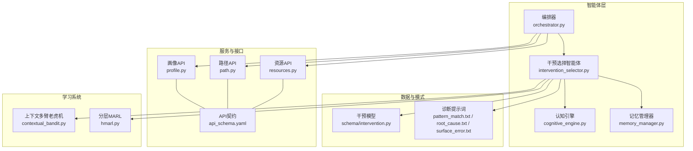
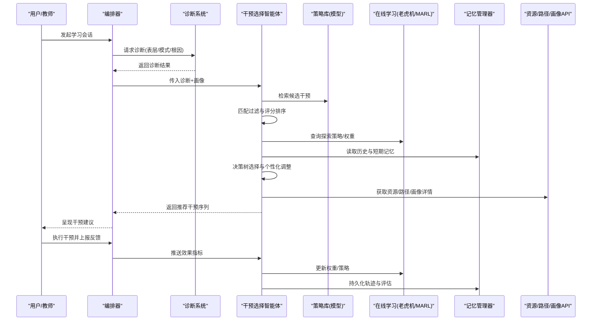
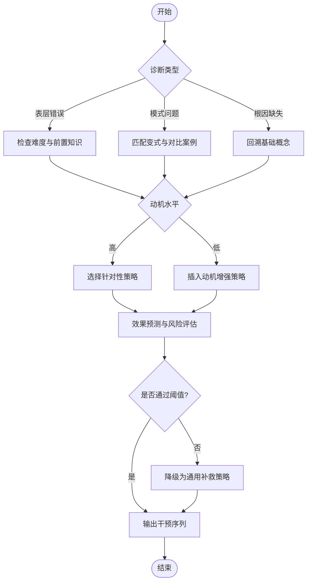
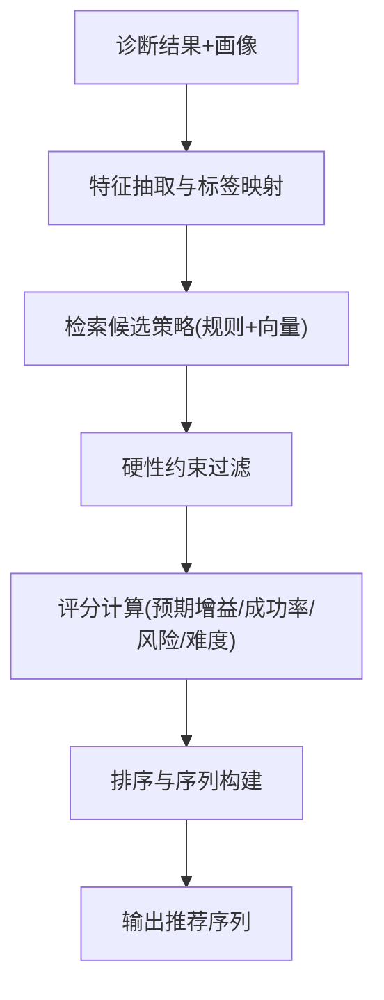
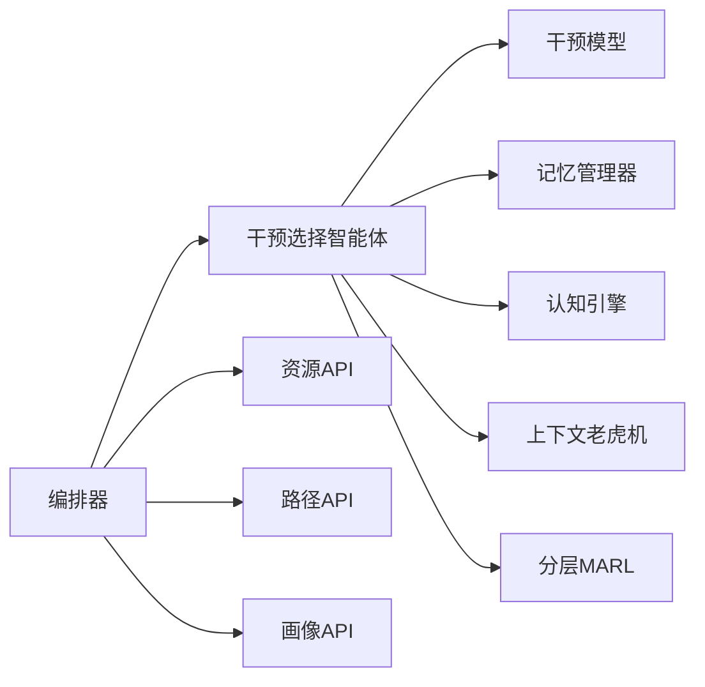

# 干预选择智能体

<cite>
**本文引用的文件**   
- [intervention_selector.py](file://src/loopse/agent/intervention_selector.py)
- [intervention.py](file://src/loopse/schema/intervention.py)
- [orchestrator.py](file://src/loopse/agent/orchestrator.py)
- [diagnosis/pattern_match.txt](file://config/prompts/diagnosis/pattern_match.txt)
- [diagnosis/root_cause.txt](file://config/prompts/diagnosis/root_cause.txt)
- [diagnosis/surface_error.txt](file://config/prompts/diagnosis/surface_error.txt)
- [api_schema.yaml](file://config/api_schema.yaml)
- [resources.py](file://src/loopse/api/resources.py)
- [path.py](file://src/loopse/api/path.py)
- [profile.py](file://src/loopse/api/profile.py)
- [cognitive_engine.py](file://src/loopse/agent/cognitive_engine.py)
- [memory_manager.py](file://src/loopse/agent/memory_manager.py)
- [contextual_bandit.py](file://src/loopse/rl/contextual_bandit.py)
- [hmarl.py](file://src/loopse/rl/hmarl.py)
</cite>

## 目录
1. [简介](#简介)
2. [项目结构](#项目结构)
3. [核心组件](#核心组件)
4. [架构总览](#架构总览)
5. [详细组件分析](#详细组件分析)
6. [依赖关系分析](#依赖关系分析)
7. [性能考量](#性能考量)
8. [故障排查指南](#故障排查指南)
9. [结论](#结论)
10. [附录](#附录)

## 简介
本技术文档聚焦于“干预选择智能体”（InterventionSelector），系统性阐述其策略库设计、基于诊断结果的匹配算法、个性化调整机制与效果评估体系，并给出配置、优先级排序与动态更新方法。同时覆盖与诊断系统的协作接口、学习效果的量化评估与长期追踪分析，以及策略定制与扩展指南，帮助读者快速理解并高效使用该模块。

## 项目结构
围绕干预选择智能体的关键代码与资源分布如下：
- 智能体实现：src/loopse/agent/intervention_selector.py
- 策略数据模型：src/loopse/schema/intervention.py
- 编排与调度：src/loopse/agent/orchestrator.py
- 诊断提示词模板：config/prompts/diagnosis/*.txt
- 对外API契约与路由：config/api_schema.yaml, src/loopse/api/resources.py, path.py, profile.py
- 认知引擎与记忆管理：src/loopse/agent/cognitive_engine.py, memory_manager.py
- 强化学习与在线学习：src/loopse/rl/contextual_bandit.py, hmarl.py

图表来源
- [intervention_selector.py](file://src/loopse/agent/intervention_selector.py)
- [intervention.py](file://src/loopse/schema/intervention.py)
- [orchestrator.py](file://src/loopse/agent/orchestrator.py)
- [diagnosis/pattern_match.txt](file://config/prompts/diagnosis/pattern_match.txt)
- [diagnosis/root_cause.txt](file://config/prompts/diagnosis/root_cause.txt)
- [diagnosis/surface_error.txt](file://config/prompts/diagnosis/surface_error.txt)
- [api_schema.yaml](file://config/api_schema.yaml)
- [resources.py](file://src/loopse/api/resources.py)
- [path.py](file://src/loopse/api/path.py)
- [profile.py](file://src/loopse/api/profile.py)
- [cognitive_engine.py](file://src/loopse/agent/cognitive_engine.py)
- [memory_manager.py](file://src/loopse/agent/memory_manager.py)
- [contextual_bandit.py](file://src/loopse/rl/contextual_bandit.py)
- [hmarl.py](file://src/loopse/rl/hmarl.py)

章节来源
- [intervention_selector.py](file://src/loopse/agent/intervention_selector.py)
- [intervention.py](file://src/loopse/schema/intervention.py)
- [orchestrator.py](file://src/loopse/agent/orchestrator.py)
- [diagnosis/pattern_match.txt](file://config/prompts/diagnosis/pattern_match.txt)
- [diagnosis/root_cause.txt](file://config/prompts/diagnosis/root_cause.txt)
- [diagnosis/surface_error.txt](file://config/prompts/diagnosis/surface_error.txt)
- [api_schema.yaml](file://config/api_schema.yaml)
- [resources.py](file://src/loopse/api/resources.py)
- [path.py](file://src/loopse/api/path.py)
- [profile.py](file://src/loopse/api/profile.py)
- [cognitive_engine.py](file://src/loopse/agent/cognitive_engine.py)
- [memory_manager.py](file://src/loopse/agent/memory_manager.py)
- [contextual_bandit.py](file://src/loopse/rl/contextual_bandit.py)
- [hmarl.py](file://src/loopse/rl/hmarl.py)

## 核心组件
- 干预选择智能体：负责接收诊断结果与学习者画像，检索策略库，执行匹配与排序，输出推荐干预序列，并记录反馈以驱动在线学习。
- 策略数据模型：定义干预措施的类型、标签、适用条件、预期效果、难度适配、资源映射等元信息，作为策略库的标准化载体。
- 编排器：协调诊断、路径规划、资源生成与干预选择，形成端到端闭环。
- 认知引擎与记忆管理器：提供学习者状态、历史交互与短期/长期记忆，支撑个性化与动态更新。
- 在线学习组件：上下文多臂老虎机与分层MARL用于探索-利用平衡与长期回报优化。

章节来源
- [intervention_selector.py](file://src/loopse/agent/intervention_selector.py)
- [intervention.py](file://src/loopse/schema/intervention.py)
- [orchestrator.py](file://src/loopse/agent/orchestrator.py)
- [cognitive_engine.py](file://src/loopse/agent/cognitive_engine.py)
- [memory_manager.py](file://src/loopse/agent/memory_manager.py)
- [contextual_bandit.py](file://src/loopse/rl/contextual_bandit.py)
- [hmarl.py](file://src/loopse/rl/hmarl.py)

## 架构总览
干预选择智能体在整体系统中的位置与交互如下：
- 输入：来自诊断系统的结构化诊断（表层错误、模式识别、根因定位）与学习者画像（能力、偏好、历史表现）。
- 处理：策略检索→匹配过滤→评分排序→决策树选择→个性化调整→效果预测。
- 输出：推荐干预序列（含顺序、强度、资源链接、触发条件）。
- 反馈：学习行为与成效指标回写至记忆与在线学习模块，驱动策略权重与阈值自适应更新。

图表来源
- [orchestrator.py](file://src/loopse/agent/orchestrator.py)
- [intervention_selector.py](file://src/loopse/agent/intervention_selector.py)
- [intervention.py](file://src/loopse/schema/intervention.py)
- [resources.py](file://src/loopse/api/resources.py)
- [path.py](file://src/loopse/api/path.py)
- [profile.py](file://src/loopse/api/profile.py)
- [contextual_bandit.py](file://src/loopse/rl/contextual_bandit.py)
- [hmarl.py](file://src/loopse/rl/hmarl.py)
- [memory_manager.py](file://src/loopse/agent/memory_manager.py)

## 详细组件分析

### 策略库设计与分类
- 分类维度
  - 按目标：概念澄清、技能训练、动机提升、元认知引导、情感支持等。
  - 按形式：讲解型、练习型、交互式、情境模拟、同伴互评等。
  - 按难度：入门、进阶、挑战；与学习者当前水平对齐。
  - 按领域：知识点、技能点、常见误区、跨学科迁移。
- 元数据结构
  - 标识、名称、类型、标签、适用条件、前置要求、预期效果、难度系数、资源映射、版本与生效时间、权重与优先级、评估指标集合。
- 检索与索引
  - 基于标签与条件的倒排索引；向量相似度检索用于语义匹配；规则引擎用于硬性约束过滤。

章节来源
- [intervention.py](file://src/loopse/schema/intervention.py)

### 效果预测模型
- 输入特征：学习者画像、历史表现、当前诊断、环境上下文（时间、任务阶段）、策略元信息。
- 模型形态：轻量回归或排序模型，输出预期增益、成功率、耗时估计、风险概率。
- 校准与置信度：对预测进行不确定性估计，结合安全阈值控制高风险策略使用。
- 冷启动：对新策略采用保守探索与A/B测试，逐步积累证据。

章节来源
- [intervention_selector.py](file://src/loopse/agent/intervention_selector.py)
- [contextual_bandit.py](file://src/loopse/rl/contextual_bandit.py)
- [hmarl.py](file://src/loopse/rl/hmarl.py)

### 选择决策树
- 入口：诊断类别（表层错误/模式/根因）与学习者画像。
- 分支逻辑：
  - 若为表层错误且低难度：优先纠错与巩固练习。
  - 若为模式问题：引入对比示例与变式训练。
  - 若为根因缺失：先补基础概念，再过渡到应用。
  - 若动机不足：插入微目标与即时反馈。
- 终止条件：满足学习目标或达到最大步数；必要时降级为通用补救策略。

图表来源
- [intervention_selector.py](file://src/loopse/agent/intervention_selector.py)
- [diagnosis/pattern_match.txt](file://config/prompts/diagnosis/pattern_match.txt)
- [diagnosis/root_cause.txt](file://config/prompts/diagnosis/root_cause.txt)
- [diagnosis/surface_error.txt](file://config/prompts/diagnosis/surface_error.txt)

### 基于诊断结果的干预匹配算法
- 输入：诊断结果（表层错误、模式识别、根因定位）与学习者画像。
- 步骤：
  1) 解析诊断标签与置信度，提取关键特征。
  2) 基于规则与向量相似度检索候选策略集。
  3) 应用硬性约束（前置知识、难度上限、资源可用性）过滤。
  4) 计算综合评分（预期增益×成功率−风险惩罚×难度系数）。
  5) 排序并生成可执行序列（考虑依赖与时长预算）。
- 特性：可解释性（保留匹配依据与评分分解）、可回滚（失败时自动降级）。

图表来源
- [intervention_selector.py](file://src/loopse/agent/intervention_selector.py)
- [intervention.py](file://src/loopse/schema/intervention.py)

### 个性化调整机制
- 画像融合：能力维度、学习风格、偏好、最近表现趋势。
- 动态权重：根据近期反馈调整策略权重与探索率。
- 情境感知：时间压力、任务阶段、疲劳度等上下文因子。
- 安全护栏：避免过度挑战或重复无效策略，保障学习体验。

章节来源
- [intervention_selector.py](file://src/loopse/agent/intervention_selector.py)
- [memory_manager.py](file://src/loopse/agent/memory_manager.py)
- [profile.py](file://src/loopse/api/profile.py)

### 效果评估体系
- 指标：知识掌握度变化、技能熟练度、错误率下降、完成时长、参与度、满意度。
- 采集：前后测、过程日志、行为事件、主观问卷。
- 分析：个体内对比、群体统计、因果推断（倾向得分匹配/差分法）。
- 报告：可视化仪表盘与可导出报告，支持教学复盘。

章节来源
- [intervention_selector.py](file://src/loopse/agent/intervention_selector.py)
- [resources.py](file://src/loopse/api/resources.py)
- [path.py](file://src/loopse/api/path.py)

### 干预策略配置、优先级与动态更新
- 配置项：策略元数据、适用条件、权重、阈值、版本与生效时间。
- 优先级：由业务目标与实时效果共同决定，支持A/B与灰度发布。
- 动态更新：在线学习模块持续修正权重与阈值；异常策略自动下线。

章节来源
- [intervention.py](file://src/loopse/schema/intervention.py)
- [contextual_bandit.py](file://src/loopse/rl/contextual_bandit.py)
- [hmarl.py](file://src/loopse/rl/hmarl.py)

### 与诊断系统的协作接口
- 输入协议：诊断结果JSON（包含表层错误、模式、根因及置信度）。
- 输出协议：推荐干预序列（含ID、顺序、强度、资源链接、触发条件）。
- 错误码与重试：网络异常、模型不可用、资源不可达时的降级策略。
- 契约规范：遵循统一API Schema，确保前后端与服务间一致性。

章节来源
- [api_schema.yaml](file://config/api_schema.yaml)
- [orchestrator.py](file://src/loopse/agent/orchestrator.py)

### 学习效果的量化评估与长期追踪
- 短期：单次会话内的正确率、响应时延、互动深度。
- 中期：单元/主题维度的掌握曲线与留存率。
- 长期：跨学期/跨课程的能力增长与迁移效果。
- 追踪：以学习者为中心的全生命周期数据归档与分析。

章节来源
- [intervention_selector.py](file://src/loopse/agent/intervention_selector.py)
- [memory_manager.py](file://src/loopse/agent/memory_manager.py)

### 干预策略定制与扩展指南
- 新增策略：在策略模型中定义元数据与适用条件，注册到策略库索引。
- 验证流程：离线评测→小流量灰度→全量上线；监控关键指标。
- 回滚机制：版本管理与一键回滚，确保稳定性。
- 最佳实践：保持策略原子性与可组合性，明确边界与副作用。

章节来源
- [intervention.py](file://src/loopse/schema/intervention.py)
- [intervention_selector.py](file://src/loopse/agent/intervention_selector.py)

## 依赖关系分析
- 内部依赖
  - 干预选择智能体依赖策略模型、记忆管理器、认知引擎与在线学习组件。
  - 编排器协调诊断、路径规划、资源生成与干预选择。
- 外部依赖
  - 资源/路径/画像API提供运行时数据。
  - 诊断提示词模板影响诊断质量，间接影响匹配精度。

图表来源
- [intervention_selector.py](file://src/loopse/agent/intervention_selector.py)
- [intervention.py](file://src/loopse/schema/intervention.py)
- [orchestrator.py](file://src/loopse/agent/orchestrator.py)
- [resources.py](file://src/loopse/api/resources.py)
- [path.py](file://src/loopse/api/path.py)
- [profile.py](file://src/loopse/api/profile.py)
- [memory_manager.py](file://src/loopse/agent/memory_manager.py)
- [cognitive_engine.py](file://src/loopse/agent/cognitive_engine.py)
- [contextual_bandit.py](file://src/loopse/rl/contextual_bandit.py)
- [hmarl.py](file://src/loopse/rl/hmarl.py)

章节来源
- [intervention_selector.py](file://src/loopse/agent/intervention_selector.py)
- [orchestrator.py](file://src/loopse/agent/orchestrator.py)
- [resources.py](file://src/loopse/api/resources.py)
- [path.py](file://src/loopse/api/path.py)
- [profile.py](file://src/loopse/api/profile.py)
- [memory_manager.py](file://src/loopse/agent/memory_manager.py)
- [cognitive_engine.py](file://src/loopse/agent/cognitive_engine.py)
- [contextual_bandit.py](file://src/loopse/rl/contextual_bandit.py)
- [hmarl.py](file://src/loopse/rl/hmarl.py)

## 性能考量
- 检索加速：倒排索引与向量近似检索结合，降低候选集规模。
- 批处理：批量评分与并行调用资源API，减少延迟。
- 缓存：热点策略与画像片段缓存，提高命中率。
- 限流与熔断：对下游服务进行保护，避免雪崩。
- 增量更新：在线学习参数增量更新，避免全量重训。

[本节为通用指导，不直接分析具体文件]

## 故障排查指南
- 常见问题
  - 诊断结果缺失或置信度过低：检查诊断提示词与上游链路。
  - 策略库为空或过期：确认策略注册与版本生效时间。
  - 资源不可用：校验资源API连通性与权限。
  - 在线学习震荡：调整探索率与平滑参数，增加正则化。
- 定位手段
  - 查看编排日志与API调用链。
  - 核对策略匹配依据与评分分解。
  - 回放学习者轨迹与反馈事件。

章节来源
- [orchestrator.py](file://src/loopse/agent/orchestrator.py)
- [intervention_selector.py](file://src/loopse/agent/intervention_selector.py)
- [resources.py](file://src/loopse/api/resources.py)
- [path.py](file://src/loopse/api/path.py)
- [profile.py](file://src/loopse/api/profile.py)

## 结论
干预选择智能体以策略库为核心，结合诊断结果与学习者画像，通过匹配、评分与决策树输出个性化干预序列，并借助在线学习实现动态优化。其模块化设计与清晰接口便于扩展与维护，配合完善的评估与追踪体系，可有效提升学习效果与教学效率。

[本节为总结性内容，不直接分析具体文件]

## 附录
- 术语表
  - 干预：针对学习者问题的教学或训练措施。
  - 策略：可复用的干预方案及其元数据。
  - 在线学习：基于实时反馈持续优化策略权重的学习范式。
- 参考
  - API契约：config/api_schema.yaml
  - 诊断提示词：config/prompts/diagnosis/*.txt

[本节为补充信息，不直接分析具体文件]