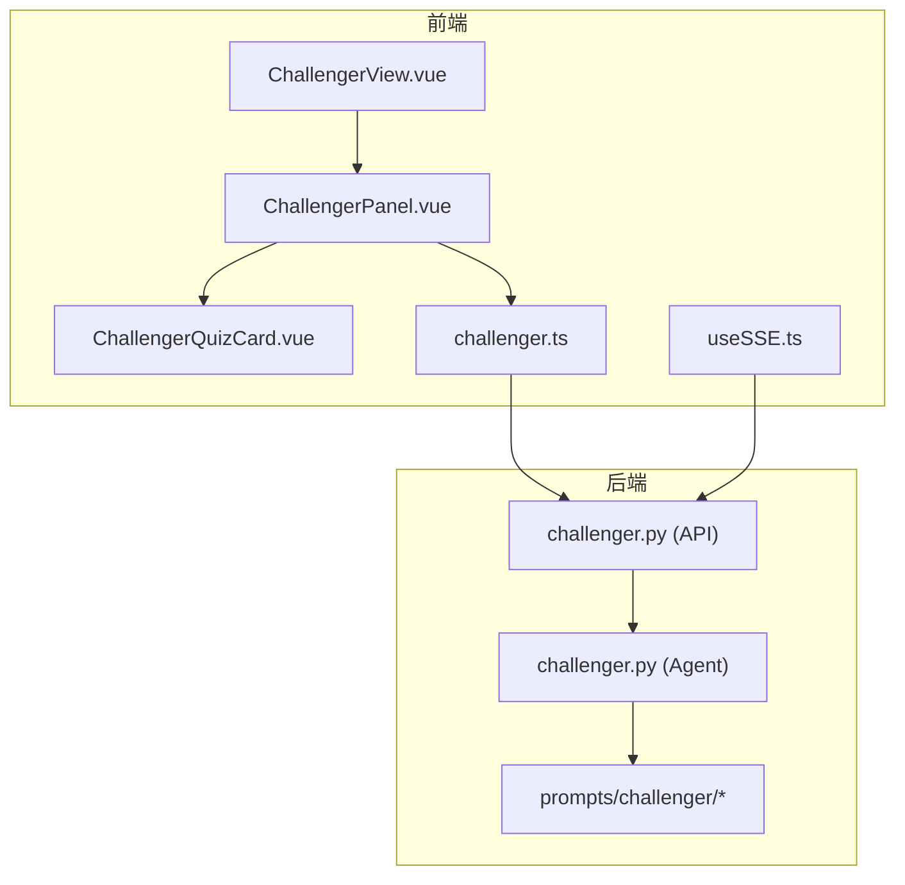
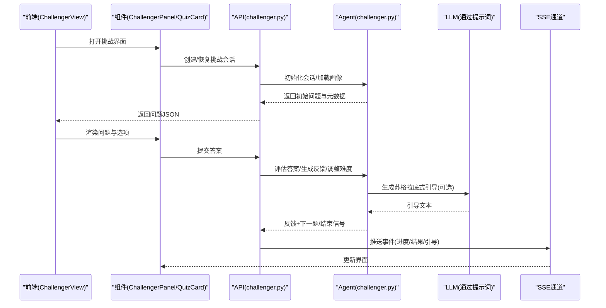
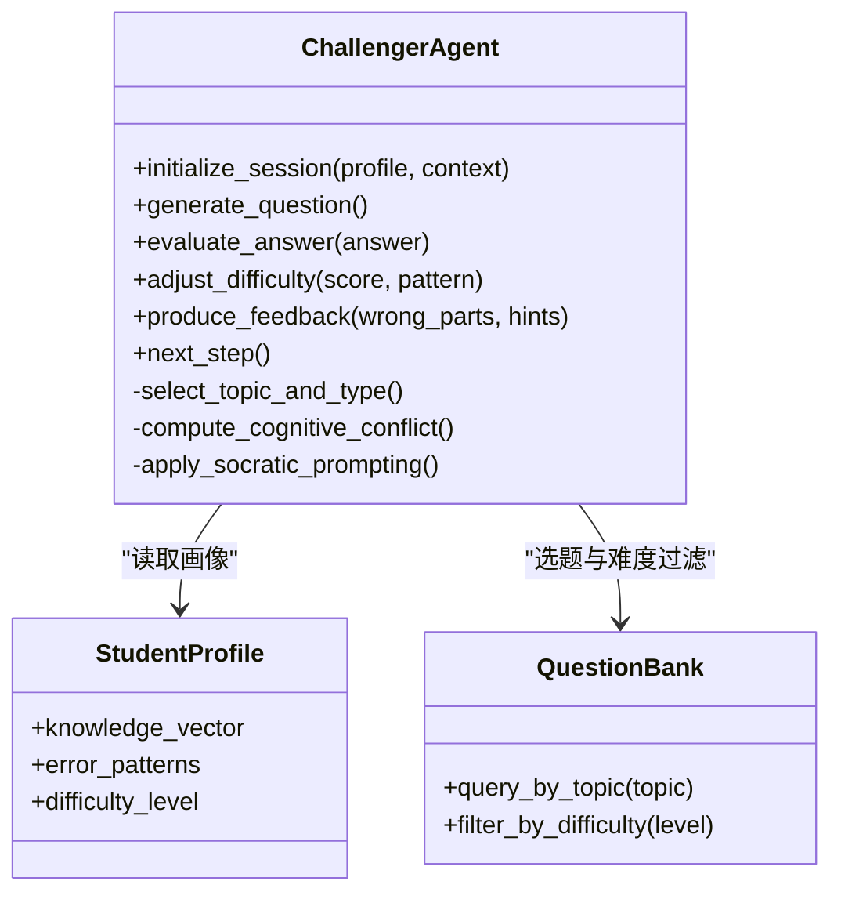
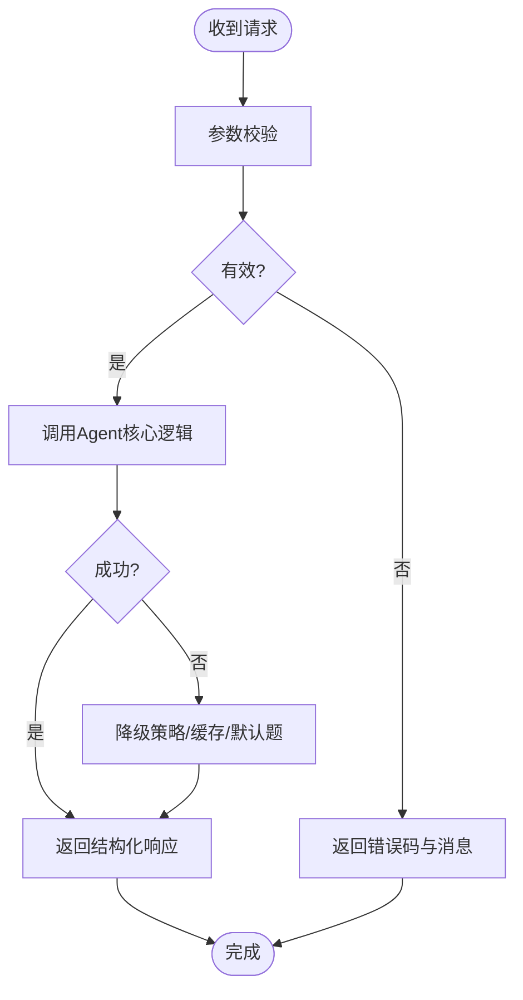
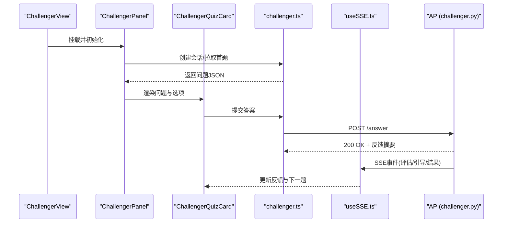
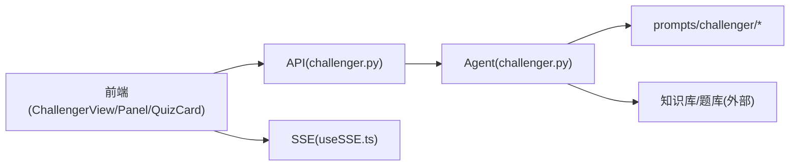

# 挑战者智能体

<cite>
**本文引用的文件**   
- [challenger.py](file://src/loopse/agent/challenger.py)
- [api_challenger.py](file://src/loopse/api/challenger.py)
- [challenger.ts](file://frontend/src/api/challenger.ts)
- [ChallengerPanel.vue](file://frontend/src/components/ChallengerPanel.vue)
- [ChallengerQuizCard.vue](file://frontend/src/components/ChallengerQuizCard.vue)
- [ChallengerView.vue](file://frontend/src/views/ChallengerView.vue)
- [useSSE.ts](file://frontend/src/composables/useSSE.ts)
- [sse.ts](file://frontend/src/types/sse.ts)
- [test_challenger_agent.py](file://tests/unit/test_challenger_agent.py)
- [prompts/challenger/...](file://config/prompts/challenger)
</cite>

## 目录
1. [简介](#简介)
2. [项目结构](#项目结构)
3. [核心组件](#核心组件)
4. [架构总览](#架构总览)
5. [详细组件分析](#详细组件分析)
6. [依赖分析](#依赖分析)
7. [性能考虑](#性能考虑)
8. [故障排查指南](#故障排查指南)
9. [结论](#结论)
10. [附录](#附录)

## 简介
本技术文档聚焦于“挑战者智能体”（Challenger Agent），围绕其问答对抗机制、苏格拉底式提问方法、认知冲突构建与思维引导技巧进行系统化说明。文档覆盖问题生成算法、难度自适应策略、动态反馈系统，以及挑战模式配置参数、问题类型定义与评估标准；同时给出前后端交互的API接口、实时通信协议与状态同步机制，并提供实际使用示例与集成指南，帮助开发者快速理解与落地该能力。

## 项目结构
挑战者智能体在系统中由后端Agent、API层、前端视图与组件、以及测试用例共同构成：
- 后端Agent实现：位于 src/loopse/agent/challenger.py，负责对话流程控制、问题生成、难度自适应与反馈计算等核心逻辑。
- API服务：位于 src/loopse/api/challenger.py，暴露REST/SSE接口供前端调用。
- 前端交互：包括页面路由与视图（ChallengerView.vue）、面板与卡片组件（ChallengerPanel.vue、ChallengerQuizCard.vue）、API客户端（challenger.ts）与SSE工具（useSSE.ts）。
- 提示词模板：位于 config/prompts/challenger，用于驱动LLM生成符合苏格拉底式风格的问题与引导语。
- 单元测试：tests/unit/test_challenger_agent.py，覆盖关键路径与边界条件。

图表来源
- [ChallengerView.vue](file://frontend/src/views/ChallengerView.vue)
- [ChallengerPanel.vue](file://frontend/src/components/ChallengerPanel.vue)
- [ChallengerQuizCard.vue](file://frontend/src/components/ChallengerQuizCard.vue)
- [challenger.ts](file://frontend/src/api/challenger.ts)
- [useSSE.ts](file://frontend/src/composables/useSSE.ts)
- [api_challenger.py](file://src/loopse/api/challenger.py)
- [challenger.py](file://src/loopse/agent/challenger.py)
- [prompts/challenger/...](file://config/prompts/challenger)

章节来源
- [challenger.py](file://src/loopse/agent/challenger.py)
- [api_challenger.py](file://src/loopse/api/challenger.py)
- [challenger.ts](file://frontend/src/api/challenger.ts)
- [ChallengerPanel.vue](file://frontend/src/components/ChallengerPanel.vue)
- [ChallengerQuizCard.vue](file://frontend/src/components/ChallengerQuizCard.vue)
- [ChallengerView.vue](file://frontend/src/views/ChallengerView.vue)
- [useSSE.ts](file://frontend/src/composables/useSSE.ts)
- [sse.ts](file://frontend/src/types/sse.ts)
- [test_challenger_agent.py](file://tests/unit/test_challenger_agent.py)
- [prompts/challenger/...](file://config/prompts/challenger)

## 核心组件
- 挑战者智能体（Agent）
  - 职责：维护会话状态、生成问题、评估回答质量、调整难度、输出反馈与引导。
  - 关键能力：苏格拉底式提问、认知冲突构建、思维引导、难度自适应、动态反馈。
- API服务层
  - 职责：接收前端请求、编排Agent调用、返回结构化响应、推送SSE事件。
- 前端组件与视图
  - 职责：渲染挑战界面、展示问题与选项、处理用户输入、通过SSE接收实时进展与结果。
- 提示词模板
  - 职责：约束问题风格、难度梯度、反馈语气与引导方式，确保一致性体验。

章节来源
- [challenger.py](file://src/loopse/agent/challenger.py)
- [api_challenger.py](file://src/loopse/api/challenger.py)
- [ChallengerPanel.vue](file://frontend/src/components/ChallengerPanel.vue)
- [ChallengerQuizCard.vue](file://frontend/src/components/ChallengerQuizCard.vue)
- [ChallengerView.vue](file://frontend/src/views/ChallengerView.vue)
- [prompts/challenger/...](file://config/prompts/challenger)

## 架构总览
挑战者智能体的端到端流程如下：
- 前端发起挑战会话或答题请求。
- API层校验参数并调用Agent。
- Agent基于当前学生画像与上下文生成问题，必要时触发LLM生成苏格拉底式引导。
- 用户作答后，Agent评估答案质量、计算反馈与难度调整，并通过SSE推送进度与结果。
- 前端实时更新UI，呈现问题、选项、反馈与下一步建议。

图表来源
- [api_challenger.py](file://src/loopse/api/challenger.py)
- [challenger.py](file://src/loopse/agent/challenger.py)
- [ChallengerView.vue](file://frontend/src/views/ChallengerView.vue)
- [ChallengerPanel.vue](file://frontend/src/components/ChallengerPanel.vue)
- [ChallengerQuizCard.vue](file://frontend/src/components/ChallengerQuizCard.vue)
- [useSSE.ts](file://frontend/src/composables/useSSE.ts)
- [sse.ts](file://frontend/src/types/sse.ts)

## 详细组件分析

### 挑战者智能体（Agent）
- 设计要点
  - 会话状态机：管理“待出题/已出题/等待作答/评估中/反馈中/结束”等状态。
  - 问题生成：结合知识点图谱、错误模式库与学生画像，选择合适题型与难度。
  - 苏格拉底式提问：以追问、反例、类比等方式引导学生自我修正。
  - 认知冲突构建：在学生已有信念与正确概念之间制造张力，促发反思。
  - 思维引导技巧：分步提示、脚手架式支持、渐进式撤除。
  - 难度自适应：根据正确率、反应时、错误类型分布动态调节。
  - 动态反馈：即时正向强化与建设性纠错并重，附带可操作改进建议。
- 数据结构与复杂度
  - 会话上下文包含历史问答、错误模式计数、知识掌握度向量等。
  - 问题选择与难度调整通常涉及O(n)遍历候选题库或O(log n)检索索引。
- 错误处理
  - 对LLM超时、空响应、格式异常进行兜底与降级策略。
  - 对非法输入进行校验与友好提示。

图表来源
- [challenger.py](file://src/loopse/agent/challenger.py)

章节来源
- [challenger.py](file://src/loopse/agent/challenger.py)

### API服务层
- 接口职责
  - 会话生命周期：创建、恢复、重置。
  - 题目与作答：获取问题、提交答案、获取反馈与下一题。
  - 实时事件：SSE推送评估进度、引导语、结果汇总。
- 安全与校验
  - 参数校验、权限检查、速率限制（如需要）。
- 错误码与重试
  - 明确的状态码与错误消息，前端据此做重试与降级。

图表来源
- [api_challenger.py](file://src/loopse/api/challenger.py)

章节来源
- [api_challenger.py](file://src/loopse/api/challenger.py)

### 前端交互与实时通信
- 组件职责
  - ChallengerView：页面级路由与全局状态管理。
  - ChallengerPanel：挑战会话容器，协调子组件与API。
  - ChallengerQuizCard：单题渲染、选项交互、提交与反馈展示。
- API客户端
  - challenger.ts：封装REST调用，统一错误处理与重试。
- SSE实时通信
  - useSSE.ts：连接SSE、解析事件流、分发到组件状态。
  - sse.ts：事件类型定义与数据结构。

图表来源
- [ChallengerView.vue](file://frontend/src/views/ChallengerView.vue)
- [ChallengerPanel.vue](file://frontend/src/components/ChallengerPanel.vue)
- [ChallengerQuizCard.vue](file://frontend/src/components/ChallengerQuizCard.vue)
- [challenger.ts](file://frontend/src/api/challenger.ts)
- [useSSE.ts](file://frontend/src/composables/useSSE.ts)
- [sse.ts](file://frontend/src/types/sse.ts)
- [api_challenger.py](file://src/loopse/api/challenger.py)

章节来源
- [ChallengerView.vue](file://frontend/src/views/ChallengerView.vue)
- [ChallengerPanel.vue](file://frontend/src/components/ChallengerPanel.vue)
- [ChallengerQuizCard.vue](file://frontend/src/components/ChallengerQuizCard.vue)
- [challenger.ts](file://frontend/src/api/challenger.ts)
- [useSSE.ts](file://frontend/src/composables/useSSE.ts)
- [sse.ts](file://frontend/src/types/sse.ts)

### 提示词与苏格拉底式风格
- 目标
  - 通过提示词模板约束问题风格、难度梯度与反馈语气，确保一致性与教育有效性。
- 内容组织
  - 按主题/难度/题型分类存放，便于扩展与维护。
- 使用方式
  - Agent在生成问题与引导语时按需加载对应模板，注入上下文变量（如学生画像、错误模式、上一轮回答）。

章节来源
- [prompts/challenger/...](file://config/prompts/challenger)

## 依赖分析
- 模块耦合
  - API层依赖Agent与提示词模板；前端依赖API与SSE工具。
  - Agent依赖学生画像与题库资源（可能来自外部存储或内存缓存）。
- 外部依赖
  - LLM服务：用于生成高质量问题与引导语。
  - 数据库/知识库：用于持久化会话、画像与题库。
- 潜在循环依赖
  - 当前分层清晰，未见明显循环依赖。

图表来源
- [api_challenger.py](file://src/loopse/api/challenger.py)
- [challenger.py](file://src/loopse/agent/challenger.py)
- [ChallengerView.vue](file://frontend/src/views/ChallengerView.vue)
- [ChallengerPanel.vue](file://frontend/src/components/ChallengerPanel.vue)
- [ChallengerQuizCard.vue](file://frontend/src/components/ChallengerQuizCard.vue)
- [useSSE.ts](file://frontend/src/composables/useSSE.ts)
- [prompts/challenger/...](file://config/prompts/challenger)

章节来源
- [api_challenger.py](file://src/loopse/api/challenger.py)
- [challenger.py](file://src/loopse/agent/challenger.py)
- [ChallengerView.vue](file://frontend/src/views/ChallengerView.vue)
- [ChallengerPanel.vue](file://frontend/src/components/ChallengerPanel.vue)
- [ChallengerQuizCard.vue](file://frontend/src/components/ChallengerQuizCard.vue)
- [useSSE.ts](file://frontend/src/composables/useSSE.ts)
- [prompts/challenger/...](file://config/prompts/challenger)

## 性能考虑
- 问题生成优化
  - 预缓存高频题型与模板，减少LLM调用频率。
  - 采用增量更新与批处理，降低网络开销。
- 难度自适应
  - 滑动窗口统计正确率与错误模式，避免频繁波动。
- SSE事件节流
  - 合并相近事件，减少前端渲染压力。
- 前端渲染
  - 虚拟列表与懒加载，提升长会话体验。

[本节为通用指导，不直接分析具体文件]

## 故障排查指南
- 常见问题
  - LLM超时或空响应：检查提示词模板与模型可用性，启用降级策略（默认题/缓存）。
  - SSE断连：前端自动重连与指数退避，记录断连次数与原因。
  - 参数校验失败：核对请求字段类型与必填项，查看错误码定位。
- 调试建议
  - 开启日志与追踪ID，串联前后端请求链路。
  - 使用单元测试复现问题路径，验证边界条件。

章节来源
- [test_challenger_agent.py](file://tests/unit/test_challenger_agent.py)

## 结论
挑战者智能体通过苏格拉底式提问、认知冲突构建与思维引导技巧，形成高参与度的问答对抗机制。其难度自适应与动态反馈系统能显著提升学习效果。配合清晰的API契约与SSE实时通信，前端可实现流畅的用户体验。建议在后续迭代中持续优化题库质量、提示词工程与性能指标，以提升整体教学成效。

[本节为总结性内容，不直接分析具体文件]

## 附录

### 挑战模式配置参数（示例）
- 会话参数
  - session_id：会话标识
  - profile_id：学生画像标识
  - mode：挑战模式（如“循序渐进”、“随机混合”、“专项突破”）
  - difficulty_init：初始难度等级
  - max_questions：最大题目数
  - feedback_style：反馈风格（“简洁”、“详细”、“苏格拉底式”）
- 难度自适应
  - window_size：滑动窗口大小
  - threshold_correct：正确率阈值
  - step_up/down：难度步进幅度
- 题库与提示词
  - topic_filter：主题过滤
  - prompt_template：提示词模板名称
  - fallback_enabled：是否启用降级策略

[本节为概念性说明，不直接分析具体文件]

### 问题类型定义（示例）
- 单选/多选/填空/简答/排序/匹配
- 每类题型包含：题干、选项/占位符、正确答案、干扰项设计原则、评分规则

[本节为概念性说明，不直接分析具体文件]

### 评估标准（示例）
- 正确率与错误模式分布
- 反应时间与思考深度（基于回答长度与结构）
- 反馈接受度（后续题目表现改善程度）
- 学习增益（前后测对比）

[本节为概念性说明，不直接分析具体文件]

### 前端集成指南
- 初始化
  - 在ChallengerView中创建会话并加载首题。
- 渲染
  - 将问题与选项传入ChallengerQuizCard进行渲染。
- 交互
  - 用户选择后调用challenger.ts提交答案。
- 实时
  - 使用useSSE.ts监听SSE事件，更新反馈与下一题。
- 错误处理
  - 捕获网络与业务错误，显示友好提示并支持重试。

章节来源
- [ChallengerView.vue](file://frontend/src/views/ChallengerView.vue)
- [ChallengerPanel.vue](file://frontend/src/components/ChallengerPanel.vue)
- [ChallengerQuizCard.vue](file://frontend/src/components/ChallengerQuizCard.vue)
- [challenger.ts](file://frontend/src/api/challenger.ts)
- [useSSE.ts](file://frontend/src/composables/useSSE.ts)
- [sse.ts](file://frontend/src/types/sse.ts)

### 实际使用示例（步骤）
- 启动后端服务并确认健康检查通过。
- 前端登录并进入挑战页面。
- 创建会话并获取首题。
- 作答并提交，观察SSE推送的反馈与下一题。
- 结束会话并查看总结报告。

[本节为概念性说明，不直接分析具体文件]