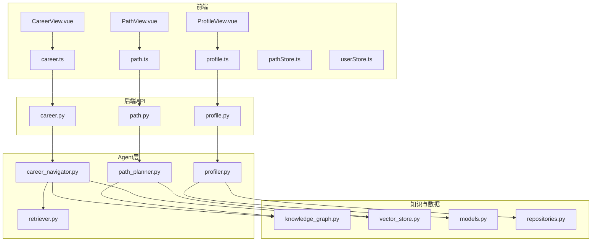
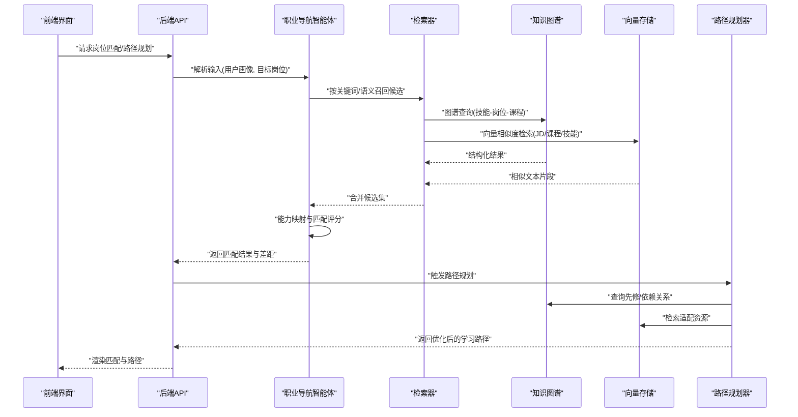
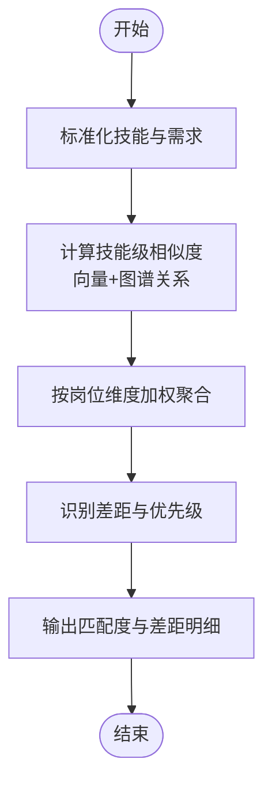
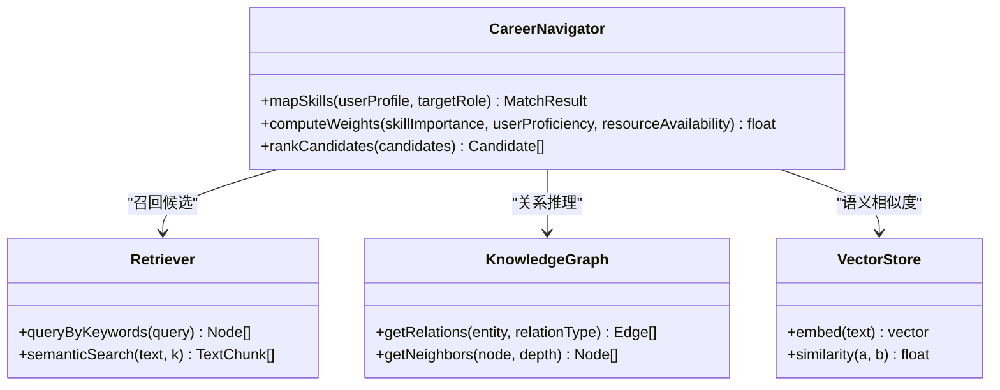
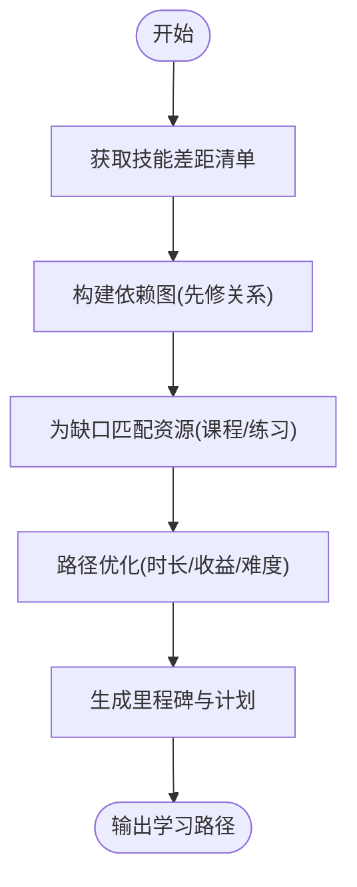
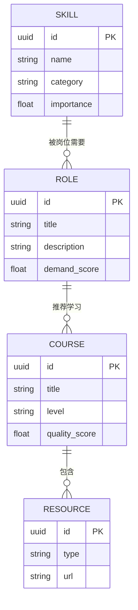
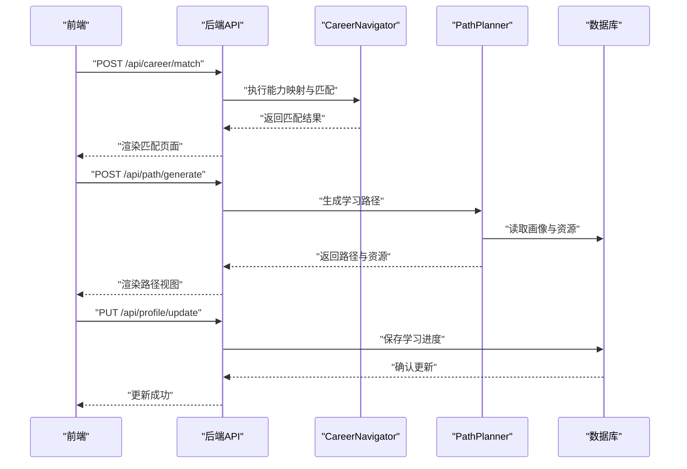
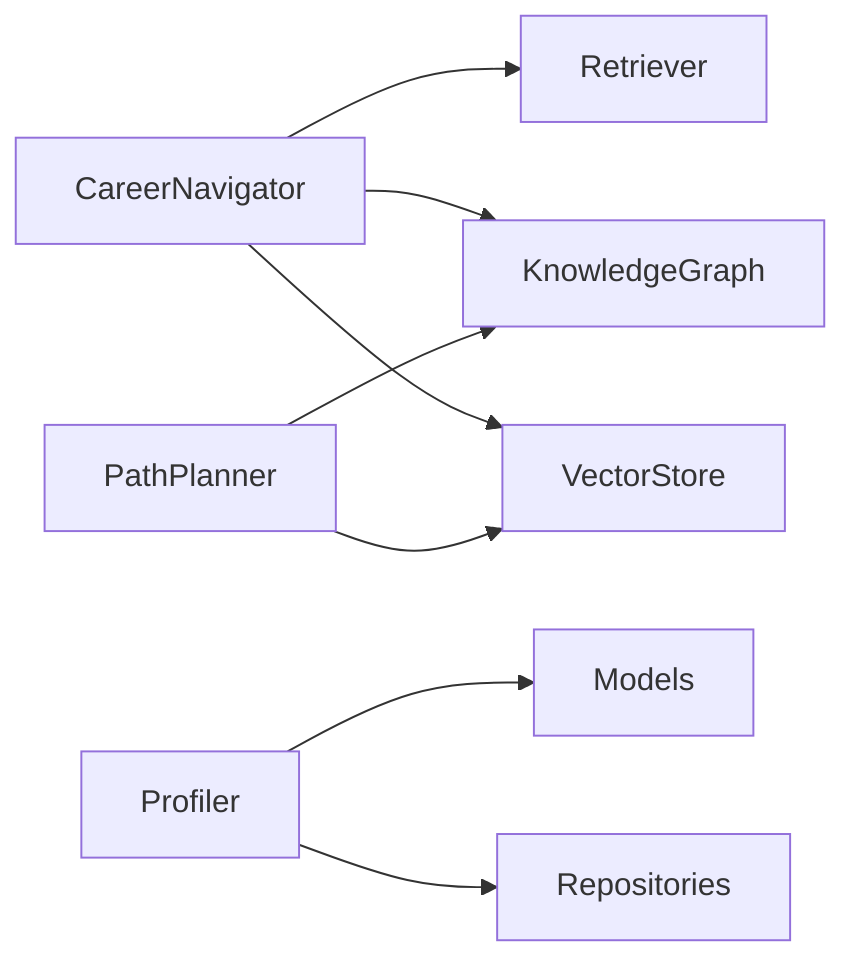

# 职业导航智能体

<cite>
**本文引用的文件**   
- [career_navigator.py](file://src/loopse/agent/career_navigator.py)
- [path_planner.py](file://src/loopse/agent/path_planner.py)
- [profiler.py](file://src/loopse/agent/profiler.py)
- [retriever.py](file://src/loopse/agent/retriever.py)
- [knowledge_graph.py](file://src/loopse/kb/knowledge_graph.py)
- [vector_store.py](file://src/loopse/kb/vector_store.py)
- [models.py](file://src/loopse/db/models.py)
- [repositories.py](file://src/loopse/db/repositories.py)
- [career.py](file://src/loopse/api/career.py)
- [path.py](file://src/loopse/api/path.py)
- [profile.py](file://src/loopse/api/profile.py)
- [api_schema.yaml](file://config/api_schema.yaml)
- [CareerView.vue](file://frontend/src/views/CareerView.vue)
- [PathView.vue](file://frontend/src/views/PathView.vue)
- [ProfileView.vue](file://frontend/src/views/ProfileView.vue)
- [career.ts](file://frontend/src/api/career.ts)
- [path.ts](file://frontend/src/api/path.ts)
- [profile.ts](file://frontend/src/api/profile.ts)
- [pathStore.ts](file://frontend/src/stores/pathStore.ts)
- [userStore.ts](file://frontend/src/stores/userStore.ts)
- [agent_personas.json](file://config/agent_personas.json)
</cite>

## 目录
1. [简介](#简介)
2. [项目结构](#项目结构)
3. [核心组件](#核心组件)
4. [架构总览](#架构总览)
5. [详细组件分析](#详细组件分析)
6. [依赖关系分析](#依赖关系分析)
7. [性能考量](#性能考量)
8. [故障排查指南](#故障排查指南)
9. [结论](#结论)
10. [附录](#附录)

## 简介
本技术文档聚焦于“职业导航智能体”（CareerNavigator）在Socrates-Cube系统中的设计与实现，覆盖技能映射算法、能力评估模型、岗位匹配策略、发展路径规划、技能图谱构建、职业趋势分析与个性化推荐机制。同时文档化职业数据库结构、匹配权重计算与路径优化算法，并说明与学习系统的集成接口、进度跟踪机制与效果评估指标，最终给出职业发展建议与技能培训建议的落地方案。

## 项目结构
围绕职业导航智能体的关键代码分布在后端Agent层、知识图谱与向量检索、数据库模型与仓库、API服务以及前端视图与状态管理模块中。整体采用分层架构：前端通过REST API调用后端服务；后端由编排器协调多个Agent完成用户画像更新、技能图谱查询、岗位匹配与路径规划；底层依赖知识图谱与向量存储进行语义检索与关联推理。

图表来源
- [CareerView.vue](file://frontend/src/views/CareerView.vue)
- [PathView.vue](file://frontend/src/views/PathView.vue)
- [ProfileView.vue](file://frontend/src/views/ProfileView.vue)
- [career.ts](file://frontend/src/api/career.ts)
- [path.ts](file://frontend/src/api/path.ts)
- [profile.ts](file://frontend/src/api/profile.ts)
- [career.py](file://src/loopse/api/career.py)
- [path.py](file://src/loopse/api/path.py)
- [profile.py](file://src/loopse/api/profile.py)
- [career_navigator.py](file://src/loopse/agent/career_navigator.py)
- [path_planner.py](file://src/loopse/agent/path_planner.py)
- [profiler.py](file://src/loopse/agent/profiler.py)
- [retriever.py](file://src/loopse/agent/retriever.py)
- [knowledge_graph.py](file://src/loopse/kb/knowledge_graph.py)
- [vector_store.py](file://src/loopse/kb/vector_store.py)
- [models.py](file://src/loopse/db/models.py)
- [repositories.py](file://src/loopse/db/repositories.py)

章节来源
- [career_navigator.py](file://src/loopse/agent/career_navigator.py)
- [path_planner.py](file://src/loopse/agent/path_planner.py)
- [profiler.py](file://src/loopse/agent/profiler.py)
- [retriever.py](file://src/loopse/agent/retriever.py)
- [knowledge_graph.py](file://src/loopse/kb/knowledge_graph.py)
- [vector_store.py](file://src/loopse/kb/vector_store.py)
- [models.py](file://src/loopse/db/models.py)
- [repositories.py](file://src/loopse/db/repositories.py)
- [career.py](file://src/loopse/api/career.py)
- [path.py](file://src/loopse/api/path.py)
- [profile.py](file://src/loopse/api/profile.py)
- [CareerView.vue](file://frontend/src/views/CareerView.vue)
- [PathView.vue](file://frontend/src/views/PathView.vue)
- [ProfileView.vue](file://frontend/src/views/ProfileView.vue)
- [career.ts](file://frontend/src/api/career.ts)
- [path.ts](file://frontend/src/api/path.ts)
- [profile.ts](file://frontend/src/api/profile.ts)
- [pathStore.ts](file://frontend/src/stores/pathStore.ts)
- [userStore.ts](file://frontend/src/stores/userStore.ts)

## 核心组件
- 职业导航智能体（CareerNavigator）：负责将用户当前能力与目标岗位所需能力进行映射，输出匹配度与差距分析，驱动后续路径规划。
- 路径规划器（PathPlanner）：基于差距分析生成可执行的学习与发展路径，考虑先修关系、资源可用性与时间约束。
- 用户画像器（Profiler）：维护与更新用户能力画像、学习历史与偏好，为匹配与推荐提供输入。
- 检索器（Retriever）：结合知识图谱与向量检索，召回相关岗位、技能、课程与案例，支撑匹配与推荐。
- 知识图谱（KnowledgeGraph）：维护“技能-岗位-课程-资源”等实体及关系，支持多跳查询与路径发现。
- 向量存储（VectorStore）：对文本型描述（如岗位JD、课程大纲、技能说明）进行向量化，用于语义相似度检索。
- 数据库模型与仓库（Models & Repositories）：持久化用户画像、路径、学习记录与系统配置。
- API层（Career/Path/Profile）：对外暴露REST接口，供前端调用。

章节来源
- [career_navigator.py](file://src/loopse/agent/career_navigator.py)
- [path_planner.py](file://src/loopse/agent/path_planner.py)
- [profiler.py](file://src/loopse/agent/profiler.py)
- [retriever.py](file://src/loopse/agent/retriever.py)
- [knowledge_graph.py](file://src/loopse/kb/knowledge_graph.py)
- [vector_store.py](file://src/loopse/kb/vector_store.py)
- [models.py](file://src/loopse/db/models.py)
- [repositories.py](file://src/loopse/db/repositories.py)
- [career.py](file://src/loopse/api/career.py)
- [path.py](file://src/loopse/api/path.py)
- [profile.py](file://src/loopse/api/profile.py)

## 架构总览
职业导航智能体采用“检索增强+图谱推理+路径优化”的混合架构。前端发起请求后，后端API路由到对应Agent；Agent通过检索器从知识图谱和向量库召回候选集，再由导航智能体进行能力映射与匹配评分，最后由路径规划器生成个性化路径。

图表来源
- [career.py](file://src/loopse/api/career.py)
- [path.py](file://src/loopse/api/path.py)
- [career_navigator.py](file://src/loopse/agent/career_navigator.py)
- [retriever.py](file://src/loopse/agent/retriever.py)
- [knowledge_graph.py](file://src/loopse/kb/knowledge_graph.py)
- [vector_store.py](file://src/loopse/kb/vector_store.py)
- [path_planner.py](file://src/loopse/agent/path_planner.py)

## 详细组件分析

### 能力评估模型与技能映射算法
- 输入：用户能力画像（技能项、熟练度等级、学习历史）、目标岗位JD或技能要求。
- 处理流程：
  - 标准化：对齐技能命名与粒度，使用图谱中的同义词与层级关系归一化。
  - 相似度计算：结合向量相似度与图谱关系强度，得到技能级匹配分数。
  - 加权聚合：按岗位维度对技能分数进行加权汇总，形成岗位匹配总分。
  - 差距识别：对比用户现有水平与岗位要求，输出短板清单与优先级。
- 输出：岗位匹配度、技能差距明细、提升建议方向。

图表来源
- [career_navigator.py](file://src/loopse/agent/career_navigator.py)
- [retriever.py](file://src/loopse/agent/retriever.py)
- [knowledge_graph.py](file://src/loopse/kb/knowledge_graph.py)
- [vector_store.py](file://src/loopse/kb/vector_store.py)

章节来源
- [career_navigator.py](file://src/loopse/agent/career_navigator.py)
- [retriever.py](file://src/loopse/agent/retriever.py)
- [knowledge_graph.py](file://src/loopse/kb/knowledge_graph.py)
- [vector_store.py](file://src/loopse/kb/vector_store.py)

### 岗位匹配策略与权重计算
- 匹配策略：
  - 硬门槛过滤：基于必需技能或证书进行快速淘汰。
  - 软匹配排序：基于综合相似度与权重得分进行排序。
- 权重计算：
  - 技能重要性权重：来源于岗位JD词频、行业统计或图谱中心性。
  - 用户掌握度权重：依据熟练度等级与近期学习成效动态调整。
  - 资源可得性权重：根据课程/练习资源的可用性与质量加分。
- 输出：Top-N岗位列表及其匹配分数、关键差异点与建议。

图表来源
- [career_navigator.py](file://src/loopse/agent/career_navigator.py)
- [retriever.py](file://src/loopse/agent/retriever.py)
- [knowledge_graph.py](file://src/loopse/kb/knowledge_graph.py)
- [vector_store.py](file://src/loopse/kb/vector_store.py)

章节来源
- [career_navigator.py](file://src/loopse/agent/career_navigator.py)
- [retriever.py](file://src/loopse/agent/retriever.py)
- [knowledge_graph.py](file://src/loopse/kb/knowledge_graph.py)
- [vector_store.py](file://src/loopse/kb/vector_store.py)

### 发展路径规划与路径优化算法
- 输入：技能差距清单、用户时间预算、学习目标与偏好。
- 处理流程：
  - 依赖解析：基于知识图谱的先修关系构建任务依赖图。
  - 资源匹配：利用向量检索为每个技能缺口匹配课程、练习与案例。
  - 路径优化：以最短学习时长与最高收益为目标，求解近似最优序列。
- 输出：分阶段学习路径、里程碑与资源清单。

图表来源
- [path_planner.py](file://src/loopse/agent/path_planner.py)
- [knowledge_graph.py](file://src/loopse/kb/knowledge_graph.py)
- [vector_store.py](file://src/loopse/kb/vector_store.py)

章节来源
- [path_planner.py](file://src/loopse/agent/path_planner.py)
- [knowledge_graph.py](file://src/loopse/kb/knowledge_graph.py)
- [vector_store.py](file://src/loopse/kb/vector_store.py)

### 技能图谱构建与职业趋势分析
- 图谱构建：
  - 实体：技能、岗位、课程、资源、认证。
  - 关系：属于、先修、需要、包含、关联。
  - 数据来源：结构化数据、文档解析、外部知识库导入。
- 趋势分析：
  - 基于向量检索与图谱中心性，识别热门技能与新兴岗位。
  - 结合用户画像进行个性化趋势提示。

图表来源
- [knowledge_graph.py](file://src/loopse/kb/knowledge_graph.py)
- [models.py](file://src/loopse/db/models.py)

章节来源
- [knowledge_graph.py](file://src/loopse/kb/knowledge_graph.py)
- [models.py](file://src/loopse/db/models.py)

### 个性化推荐机制
- 推荐信号：
  - 用户画像：技能掌握度、学习历史、兴趣标签。
  - 行为反馈：点击、完成、测评成绩。
  - 环境因素：岗位热度、资源更新频率。
- 推荐策略：
  - 协同过滤：基于相似用户群体的选择。
  - 内容匹配：基于技能-课程-资源的语义相似度。
  - 探索与利用：平衡热门资源与长尾优质资源。

章节来源
- [career_navigator.py](file://src/loopse/agent/career_navigator.py)
- [retriever.py](file://src/loopse/agent/retriever.py)
- [vector_store.py](file://src/loopse/kb/vector_store.py)

### 与学习系统的集成接口
- 接口概览：
  - 职业匹配：提交用户画像与目标岗位，返回匹配结果与差距。
  - 路径规划：提交差距与约束条件，返回学习路径与资源。
  - 画像更新：同步学习进度与测评结果，更新用户画像。
- 协议规范：遵循统一API Schema定义，确保前后端契约一致。

图表来源
- [career.py](file://src/loopse/api/career.py)
- [path.py](file://src/loopse/api/path.py)
- [profile.py](file://src/loopse/api/profile.py)
- [career_navigator.py](file://src/loopse/agent/career_navigator.py)
- [path_planner.py](file://src/loopse/agent/path_planner.py)
- [models.py](file://src/loopse/db/models.py)
- [repositories.py](file://src/loopse/db/repositories.py)

章节来源
- [career.py](file://src/loopse/api/career.py)
- [path.py](file://src/loopse/api/path.py)
- [profile.py](file://src/loopse/api/profile.py)
- [api_schema.yaml](file://config/api_schema.yaml)

### 进度跟踪机制与效果评估指标
- 进度跟踪：
  - 里程碑达成率：按路径阶段统计完成比例。
  - 技能提升曲线：对比初始与当前技能掌握度变化。
  - 资源利用率：课程/练习完成率与停留时长。
- 效果评估：
  - 匹配准确率：预测岗位匹配与实际面试/录用结果的对照。
  - 路径有效性：完成路径后技能提升幅度与时间成本。
  - 用户满意度：问卷与NPS评分。

章节来源
- [models.py](file://src/loopse/db/models.py)
- [repositories.py](file://src/loopse/db/repositories.py)
- [career_navigator.py](file://src/loopse/agent/career_navigator.py)
- [path_planner.py](file://src/loopse/agent/path_planner.py)

### 职业发展建议与技能培训建议
- 职业发展建议：
  - 短期：聚焦高权重技能缺口，优先补齐关键能力。
  - 中期：拓展相邻领域技能，提升岗位适应面。
  - 长期：关注行业趋势，布局新兴技能组合。
- 技能培训建议：
  - 选择高质量课程与实战练习，注重项目经验积累。
  - 定期复盘与测评，动态调整学习路径。
  - 参与社区与实践，提升问题解决与协作能力。

章节来源
- [career_navigator.py](file://src/loopse/agent/career_navigator.py)
- [path_planner.py](file://src/loopse/agent/path_planner.py)
- [agent_personas.json](file://config/agent_personas.json)

## 依赖关系分析
- 组件耦合：
  - CareerNavigator依赖Retriever、KnowledgeGraph与VectorStore进行召回与评分。
  - PathPlanner依赖KnowledgeGraph与VectorStore进行依赖解析与资源匹配。
  - Profiler依赖数据库模型与仓库进行画像持久化。
- 外部依赖：
  - 向量检索与嵌入模型用于语义相似度计算。
  - 图谱查询引擎用于关系推理与路径发现。

图表来源
- [career_navigator.py](file://src/loopse/agent/career_navigator.py)
- [path_planner.py](file://src/loopse/agent/path_planner.py)
- [profiler.py](file://src/loopse/agent/profiler.py)
- [retriever.py](file://src/loopse/agent/retriever.py)
- [knowledge_graph.py](file://src/loopse/kb/knowledge_graph.py)
- [vector_store.py](file://src/loopse/kb/vector_store.py)
- [models.py](file://src/loopse/db/models.py)
- [repositories.py](file://src/loopse/db/repositories.py)

章节来源
- [career_navigator.py](file://src/loopse/agent/career_navigator.py)
- [path_planner.py](file://src/loopse/agent/path_planner.py)
- [profiler.py](file://src/loopse/agent/profiler.py)
- [retriever.py](file://src/loopse/agent/retriever.py)
- [knowledge_graph.py](file://src/loopse/kb/knowledge_graph.py)
- [vector_store.py](file://src/loopse/kb/vector_store.py)
- [models.py](file://src/loopse/db/models.py)
- [repositories.py](file://src/loopse/db/repositories.py)

## 性能考量
- 检索优化：
  - 使用索引与缓存减少重复查询开销。
  - 向量检索采用近似最近邻算法提升召回速度。
- 图谱查询：
  - 限制深度与分支因子，避免全图遍历。
  - 预计算常用关系与中心性指标。
- 路径优化：
  - 采用启发式搜索与剪枝策略降低复杂度。
  - 分批生成与增量更新路径，提高响应时间。

[本节为通用性能指导，不直接分析具体文件]

## 故障排查指南
- 常见问题：
  - 匹配结果为空：检查技能标准化与图谱关系是否完整。
  - 路径不可达：验证先修关系与资源可用性。
  - 推荐偏差：调整权重参数与探索策略。
- 调试手段：
  - 查看Agent日志与中间结果。
  - 校验API Schema与前后端数据结构一致性。
  - 使用Mock数据进行回归测试。

章节来源
- [career_navigator.py](file://src/loopse/agent/career_navigator.py)
- [path_planner.py](file://src/loopse/agent/path_planner.py)
- [api_schema.yaml](file://config/api_schema.yaml)

## 结论
职业导航智能体通过“检索增强+图谱推理+路径优化”的混合架构，实现了精准的能力映射、科学的岗位匹配与个性化的发展路径规划。配合完善的进度跟踪与效果评估体系，能够有效指导用户的职业发展与技能培训。未来可进一步引入强化学习与因果推断，提升推荐的长期收益与稳健性。

[本节为总结性内容，不直接分析具体文件]

## 附录
- 前端集成要点：
  - 使用career.ts、path.ts、profile.ts调用后端API。
  - 在CareerView.vue、PathView.vue、ProfileView.vue中渲染结果与交互。
  - 通过pathStore.ts与userStore.ts管理本地状态与用户信息。

章节来源
- [CareerView.vue](file://frontend/src/views/CareerView.vue)
- [PathView.vue](file://frontend/src/views/PathView.vue)
- [ProfileView.vue](file://frontend/src/views/ProfileView.vue)
- [career.ts](file://frontend/src/api/career.ts)
- [path.ts](file://frontend/src/api/path.ts)
- [profile.ts](file://frontend/src/api/profile.ts)
- [pathStore.ts](file://frontend/src/stores/pathStore.ts)
- [userStore.ts](file://frontend/src/stores/userStore.ts)