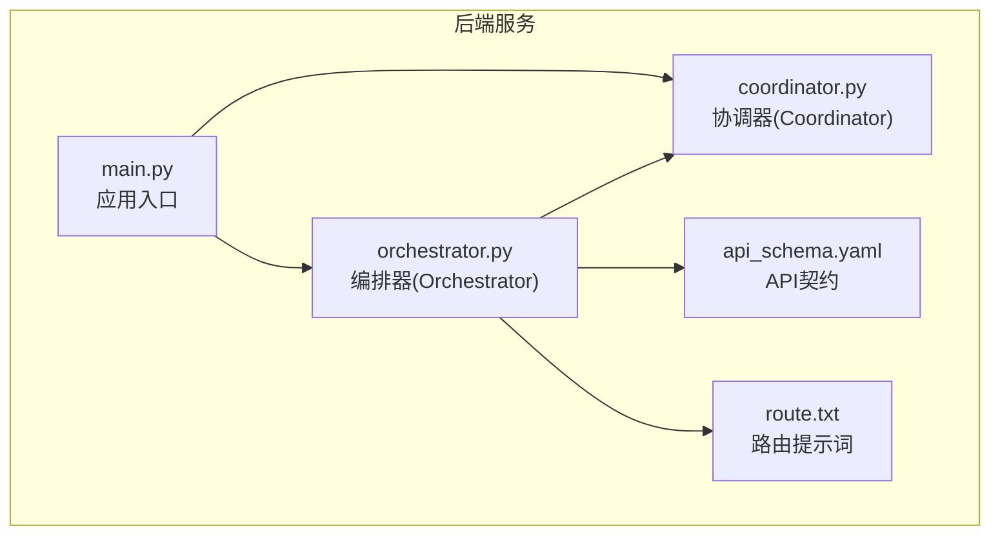
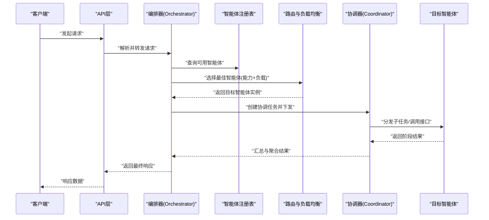
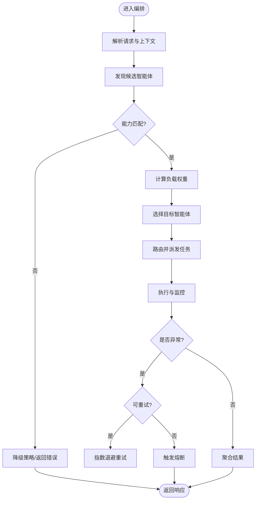
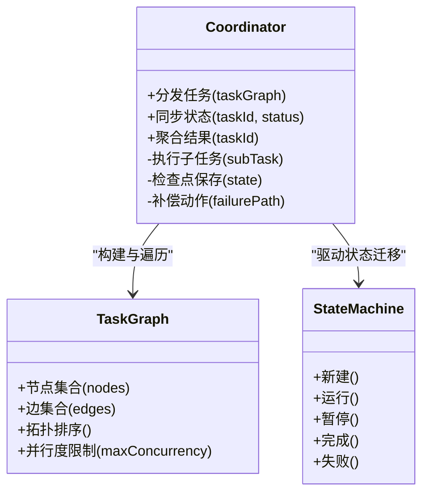
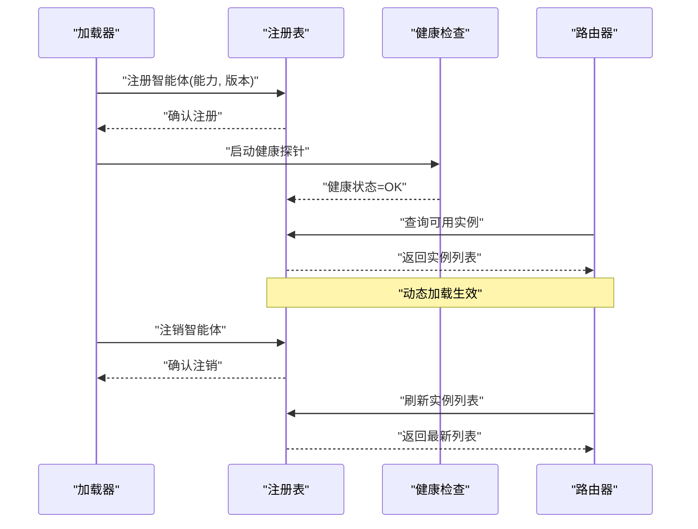
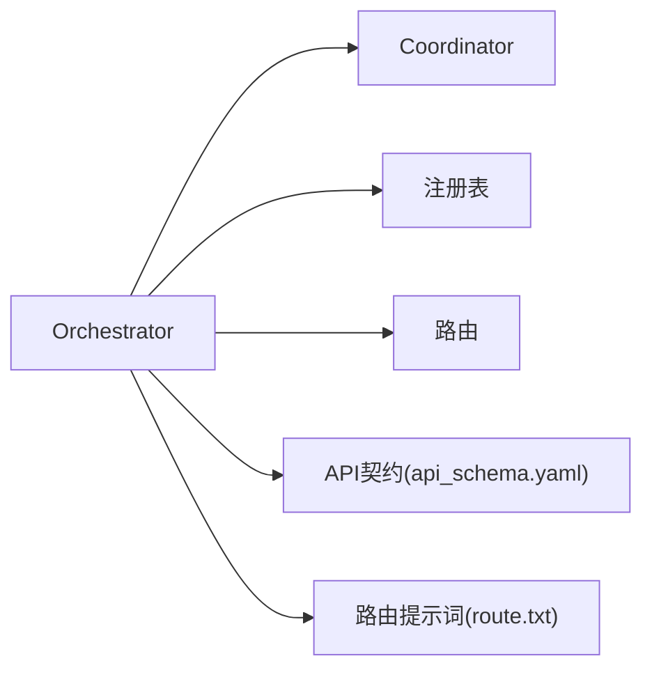

# 协调器与路由系统

<cite>
**本文引用的文件**   
- [orchestrator.py](file://src/loopse/agent/orchestrator.py)
- [coordinator.py](file://src/loopse/agent/coordinator.py)
- [api_schema.yaml](file://config/api_schema.yaml)
- [route.txt](file://config/prompts/orchestrator/route.txt)
- [main.py](file://src/loopse/main.py)
- [test_orchestrator_integration.py](file://tests/unit/test_orchestrator_integration.py)
</cite>

## 目录
1. [简介](#简介)
2. [项目结构](#项目结构)
3. [核心组件](#核心组件)
4. [架构总览](#架构总览)
5. [详细组件分析](#详细组件分析)
6. [依赖关系分析](#依赖关系分析)
7. [性能考量](#性能考量)
8. [故障排查指南](#故障排查指南)
9. [结论](#结论)
10. [附录](#附录)

## 简介
本技术文档聚焦于协调器与路由系统，围绕 Orchestrator 协调器的核心设计模式、智能体发现机制、请求路由算法与负载均衡策略展开；同时详细说明 Coordinator 的职责边界，包括任务分发、状态同步与结果聚合。文档还覆盖智能体注册与注销流程、动态加载机制、版本兼容性处理、错误处理策略、重试机制与熔断器模式的实现思路，并提供配置项、性能调优参数与监控指标说明，帮助读者快速理解并高效使用该系统。

## 项目结构
与协调器和路由相关的核心代码位于后端服务模块中，主要包含：
- 编排与协调逻辑：Orchestrator 与 Coordinator
- API 契约与提示词：API Schema 与路由提示词
- 应用入口：主程序初始化与生命周期管理
- 集成测试：编排与协调的端到端验证

图表来源
- [main.py](file://src/loopse/main.py)
- [orchestrator.py](file://src/loopse/agent/orchestrator.py)
- [coordinator.py](file://src/loopse/agent/coordinator.py)
- [api_schema.yaml](file://config/api_schema.yaml)
- [route.txt](file://config/prompts/orchestrator/route.txt)

章节来源
- [main.py](file://src/loopse/main.py)
- [orchestrator.py](file://src/loopse/agent/orchestrator.py)
- [coordinator.py](file://src/loopse/agent/coordinator.py)
- [api_schema.yaml](file://config/api_schema.yaml)
- [route.txt](file://config/prompts/orchestrator/route.txt)

## 核心组件
- Orchestrator（编排器）
  - 职责：全局编排、智能体发现、请求路由、负载均衡、上下文装配、结果汇聚与降级。
  - 关键能力：
    - 智能体注册表维护与动态加载
    - 基于能力标签与负载指标的决策路由
    - 多智能体协作流程编排
    - 错误处理、重试与熔断控制
- Coordinator（协调器）
  - 职责：具体任务的执行协调，包括任务拆分与分发、状态同步、中间结果收集与最终结果聚合。
  - 关键能力：
    - 子任务调度与并行度控制
    - 状态机驱动的执行跟踪
    - 结果合并与一致性保障
    - 失败隔离与局部重试

章节来源
- [orchestrator.py](file://src/loopse/agent/orchestrator.py)
- [coordinator.py](file://src/loopse/agent/coordinator.py)

## 架构总览
整体架构以 Orchestrator 为中枢，负责将外部请求解析为可执行的智能体调用计划，并通过 Coordinator 进行细粒度任务编排与执行。API 契约定义输入输出规范，路由提示词辅助在复杂场景下的语义路由决策。

图表来源
- [orchestrator.py](file://src/loopse/agent/orchestrator.py)
- [coordinator.py](file://src/loopse/agent/coordinator.py)
- [api_schema.yaml](file://config/api_schema.yaml)

## 详细组件分析

### Orchestrator 编排器
- 设计模式
  - 工厂模式：根据能力标签与版本信息动态创建或获取智能体实例
  - 观察者模式：监听智能体健康状态与负载变化，更新路由权重
  - 责任链模式：对请求进行预处理、校验、路由、编排、后处理
- 智能体发现机制
  - 注册表维护：集中式注册表记录智能体的能力标签、版本、健康状态与负载指标
  - 动态加载：按需加载智能体模块，支持热插拔与灰度发布
  - 版本兼容：通过能力矩阵与最小版本约束确保向后兼容
- 请求路由算法
  - 能力匹配：基于请求意图与智能体能力标签进行筛选
  - 负载感知：结合队列长度、CPU/内存占用、延迟分位等指标计算权重
  - 容错优先：当首选实例不可用时自动回退到次优实例
- 负载均衡策略
  - 加权轮询：按健康与负载权重分配请求
  - 最少连接：优先选择当前并发较低的实例
  - 亲和路由：同一会话或用户维度的粘性路由
- 错误处理与重试
  - 幂等性保证：对可重试操作采用幂等键避免重复执行
  - 指数退避：失败后按指数退避策略重试，限制最大次数
  - 熔断器：连续失败超过阈值时快速失败，周期性探测恢复
- 结果聚合
  - 部分成功：允许部分子任务失败，返回可解释的降级结果
  - 一致性：对强一致场景采用两阶段提交或补偿事务

图表来源
- [orchestrator.py](file://src/loopse/agent/orchestrator.py)
- [route.txt](file://config/prompts/orchestrator/route.txt)

章节来源
- [orchestrator.py](file://src/loopse/agent/orchestrator.py)
- [route.txt](file://config/prompts/orchestrator/route.txt)

### Coordinator 协调器
- 职责边界
  - 任务分发：将高层任务拆分为子任务，按依赖关系组织执行图
  - 状态同步：维护子任务状态机，提供进度与中间结果上报
  - 结果聚合：合并各子任务输出，生成最终结果或降级方案
- 执行模型
  - 有向无环图(DAG)：表达任务依赖与并行度
  - 背压控制：防止下游过载，必要时限流或丢弃低优先级任务
  - 超时与取消：统一超时控制与任务取消传播
- 可靠性保障
  - 检查点：关键步骤持久化，支持断点续跑
  - 幂等写入：结果落库前去重，避免重复写入
  - 补偿动作：失败路径的清理与回滚
- 监控与可观测性
  - 指标采集：任务数、成功率、平均耗时、P95/P99延迟
  - 日志追踪：跨任务链路ID，便于定位问题
  - 告警规则：失败率、延迟、资源利用率阈值告警

图表来源
- [coordinator.py](file://src/loopse/agent/coordinator.py)

章节来源
- [coordinator.py](file://src/loopse/agent/coordinator.py)

### 智能体注册与注销流程
- 注册流程
  - 启动时扫描模块，读取能力标签与版本信息
  - 写入注册表，设置初始健康状态与负载指标
  - 暴露健康检查与元数据查询接口
- 注销流程
  - 优雅关闭：停止接收新请求，等待进行中任务完成
  - 从注册表移除：更新路由权重，触发重新均衡
  - 资源释放：清理临时文件、连接池与缓存
- 动态加载与热更新
  - 增量加载：仅加载变更的智能体，减少重启开销
  - 灰度发布：按比例分流到新实例，逐步放量
  - 回滚机制：新版本异常时快速切回旧版本

图表来源
- [orchestrator.py](file://src/loopse/agent/orchestrator.py)

章节来源
- [orchestrator.py](file://src/loopse/agent/orchestrator.py)

### 版本兼容性处理
- 能力矩阵：定义每个版本的智能体所支持的能力集
- 最小版本约束：上游组件声明最低兼容版本
- 适配层：在不兼容时通过适配器桥接差异
- 灰度与回滚：按版本维度进行流量切换与快速回滚

章节来源
- [orchestrator.py](file://src/loopse/agent/orchestrator.py)

### 错误处理策略、重试与熔断
- 错误分类
  - 可重试错误：网络抖动、瞬时超时
  - 不可重试错误：参数非法、权限不足
  - 业务降级：部分功能不可用时的替代路径
- 重试机制
  - 指数退避与抖动：降低雪崩风险
  - 最大重试次数与超时上限：防止无限重试
  - 幂等键：确保重复执行不影响结果正确性
- 熔断器模式
  - 失败率阈值：超过阈值触发熔断
  - 半开探测：周期性尝试放行少量请求探测恢复
  - 快速失败：熔断期间直接返回降级响应

章节来源
- [orchestrator.py](file://src/loopse/agent/orchestrator.py)

### 配置选项、性能调优与监控指标
- 配置选项
  - 路由策略：加权轮询/最少连接/亲和路由
  - 负载均衡参数：权重、亲和键、亲和过期时间
  - 重试与熔断：最大重试次数、退避基数、熔断阈值、半开探测间隔
  - 动态加载：灰度比例、回滚条件、热更新开关
- 性能调优
  - 并发度：协调器并行度、I/O线程池大小
  - 背压与限流：令牌桶/漏桶参数
  - 缓存策略：热点结果缓存、TTL与失效策略
- 监控指标
  - 业务指标：请求量、成功率、错误码分布
  - 性能指标：平均耗时、P95/P99延迟、吞吐
  - 资源指标：CPU/内存/磁盘/网络使用率
  - 稳定性指标：熔断触发次数、重试次数、降级比例

章节来源
- [orchestrator.py](file://src/loopse/agent/orchestrator.py)
- [coordinator.py](file://src/loopse/agent/coordinator.py)

## 依赖关系分析
- 内部依赖
  - Orchestrator 依赖 Coordinator 进行任务级编排
  - 两者共同依赖注册表与路由模块
- 外部依赖
  - API 契约：输入输出结构与校验规则
  - 提示词：用于复杂场景的语义路由决策
- 耦合与内聚
  - 高内聚：编排与协调职责清晰分离
  - 低耦合：通过注册表与路由接口解耦智能体实现

图表来源
- [orchestrator.py](file://src/loopse/agent/orchestrator.py)
- [coordinator.py](file://src/loopse/agent/coordinator.py)
- [api_schema.yaml](file://config/api_schema.yaml)
- [route.txt](file://config/prompts/orchestrator/route.txt)

章节来源
- [orchestrator.py](file://src/loopse/agent/orchestrator.py)
- [coordinator.py](file://src/loopse/agent/coordinator.py)
- [api_schema.yaml](file://config/api_schema.yaml)
- [route.txt](file://config/prompts/orchestrator/route.txt)

## 性能考量
- 路由与负载均衡
  - 预计算权重：减少在线计算开销
  - 本地缓存：缓存热门智能体实例元数据
- 协调器执行
  - DAG优化：最大化并行度，减少关键路径长度
  - 背压控制：避免下游过载导致级联失败
- 错误与重试
  - 快速失败：缩短失败路径，提升整体吞吐
  - 重试节流：避免雪崩效应
- 监控与可观测性
  - 指标采样：高频指标降采样，保留趋势
  - 分布式追踪：跨组件链路追踪，定位瓶颈

[本节为通用指导，不直接分析具体文件]

## 故障排查指南
- 常见问题
  - 路由失败：检查能力标签匹配与版本约束
  - 负载均衡异常：查看健康状态与负载指标
  - 协调器卡住：检查DAG依赖与超时设置
  - 熔断频繁触发：评估重试与退避参数
- 诊断步骤
  - 查看注册表状态与实例健康
  - 检查路由日志与决策依据
  - 分析协调器任务图与状态迁移
  - 核对错误类型与重试策略
- 恢复建议
  - 调整路由权重与亲和策略
  - 增加重试上限与退避基数
  - 放宽熔断阈值或修复根因
  - 灰度回滚至稳定版本

章节来源
- [orchestrator.py](file://src/loopse/agent/orchestrator.py)
- [coordinator.py](file://src/loopse/agent/coordinator.py)

## 结论
本系统通过 Orchestrator 与 Coordinator 的协同工作，实现了高可用的智能体编排与路由能力。借助注册表、路由与负载均衡机制，系统在动态环境中具备弹性与鲁棒性。完善的错误处理、重试与熔断策略进一步提升了稳定性。通过合理的配置与性能调优，以及全面的监控指标，系统可在复杂业务场景中保持高效与可靠。

[本节为总结性内容，不直接分析具体文件]

## 附录
- 端到端集成测试参考
  - 编排与协调的集成用例有助于验证路由、负载均衡与错误处理策略的有效性

章节来源
- [test_orchestrator_integration.py](file://tests/unit/test_orchestrator_integration.py)