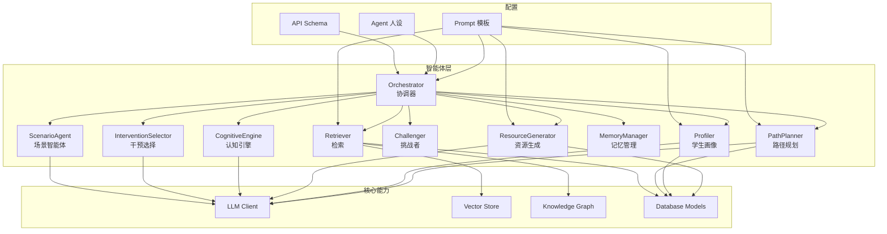
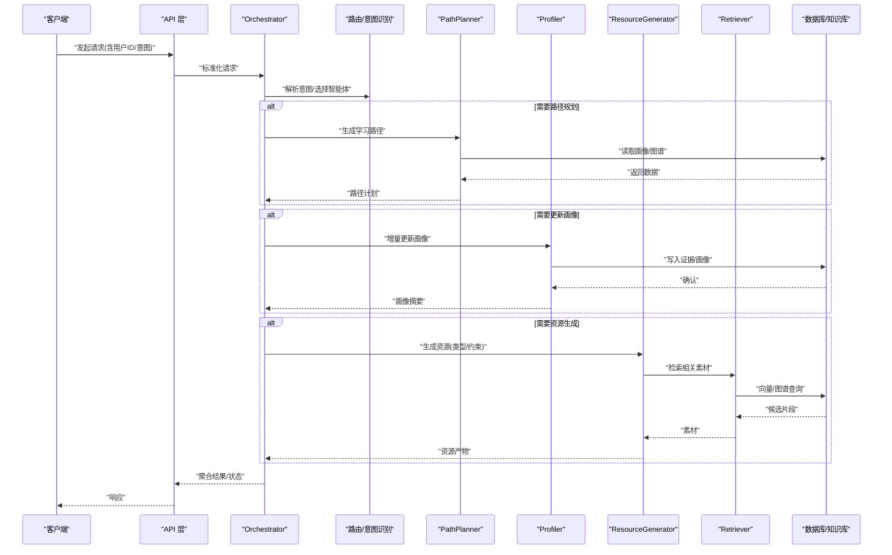
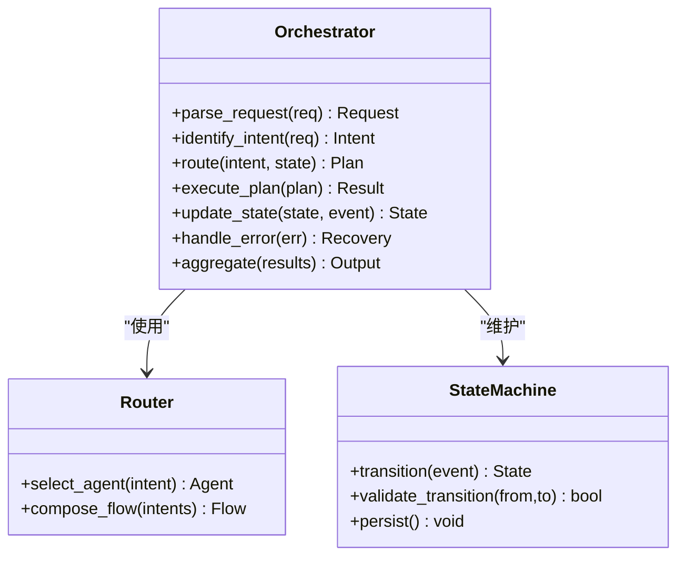
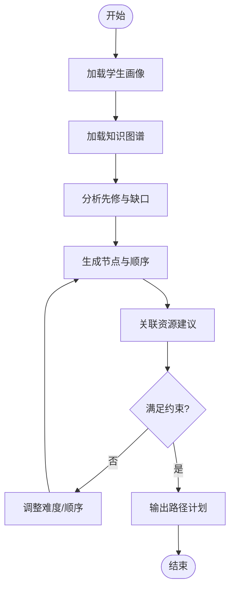
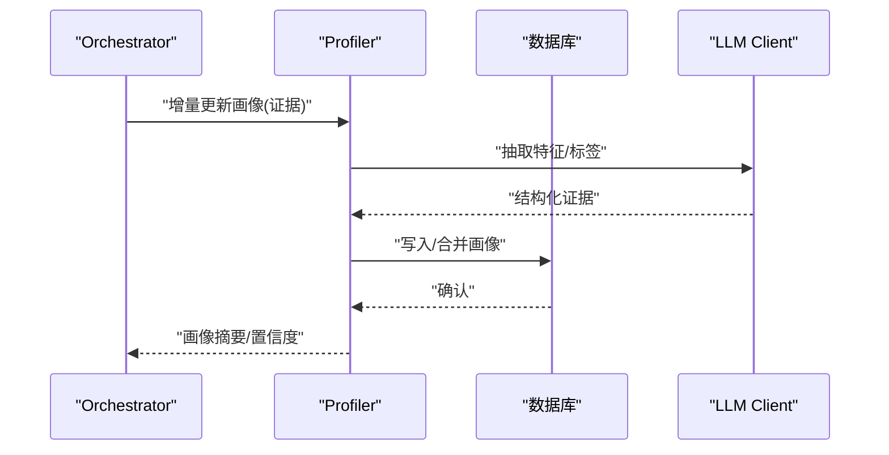
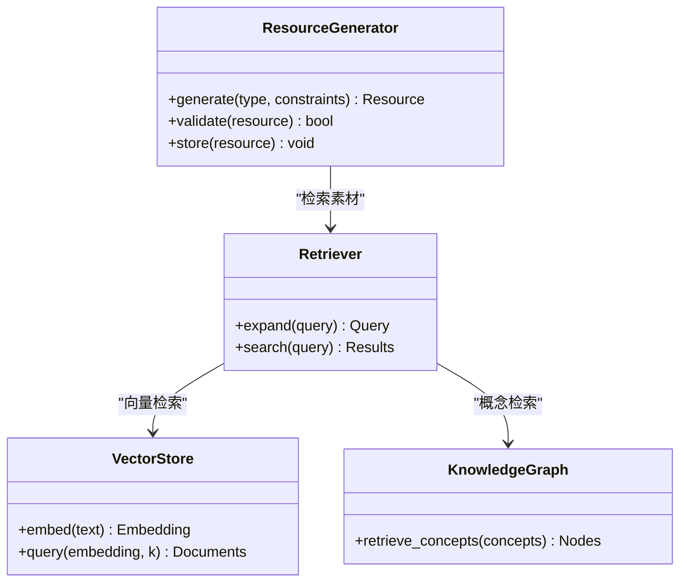
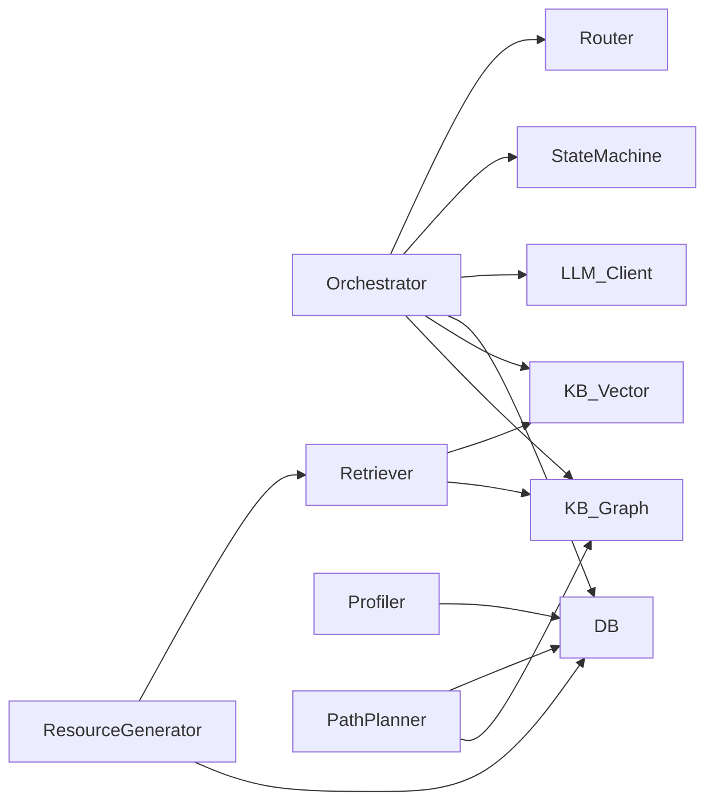

# 多智能体系统

<cite>
**本文引用的文件**   
- [src/loopse/agent/orchestrator.py](file://src/loopse/agent/orchestrator.py)
- [src/loopse/agent/coordinator.py](file://src/loopse/agent/coordinator.py)
- [src/loopse/agent/path_planner.py](file://src/loopse/agent/path_planner.py)
- [src/loopse/agent/profiler.py](file://src/loopse/agent/profiler.py)
- [src/loopse/agent/resource_generator.py](file://src/loopse/agent/resource_generator.py)
- [src/loopse/agent/retriever.py](file://src/loopse/agent/retriever.py)
- [src/loopse/agent/challenger.py](file://src/loopse/agent/challenger.py)
- [src/loopse/agent/cognitive_engine.py](file://src/loopse/agent/cognitive_engine.py)
- [src/loopse/agent/memory_manager.py](file://src/loopse/agent/memory_manager.py)
- [src/loopse/agent/intervention_selector.py](file://src/loopse/agent/intervention_selector.py)
- [src/loopse/agent/scenario_agent.py](file://src/loopse/agent/scenario_agent.py)
- [config/prompts/orchestrator/route.txt](file://config/prompts/orchestrator/route.txt)
- [config/prompts/path_planner/plan_path.txt](file://config/prompts/path_planner/plan_path.txt)
- [config/prompts/profiler/onboarding.txt](file://config/prompts/profiler/onboarding.txt)
- [config/prompts/profiler/update_profile.txt](file://config/prompts/profiler/update_profile.txt)
- [config/prompts/resource_generator/generate_code.txt](file://config/prompts/resource_generator/generate_code.txt)
- [config/prompts/resource_generator/generate_doc.txt](file://config/prompts/resource_generator/generate_doc.txt)
- [config/prompts/resource_generator/generate_exercise.txt](file://config/prompts/resource_generator/generate_exercise.txt)
- [config/prompts/resource_generator/generate_infographic.txt](file://config/prompts/resource_generator/generate_infographic.txt)
- [config/prompts/resource_generator/generate_script.txt](file://config/prompts/resource_generator/generate_script.txt)
- [config/prompts/retriever/query_expansion.txt](file://config/prompts/retriever/query_expansion.txt)
- [config/prompts/retriever/search_query.txt](file://config/prompts/retriever/search_query.txt)
- [config/agent_personas.json](file://config/agent_personas.json)
- [config/api_schema.yaml](file://config/api_schema.yaml)
- [src/loopse/core/llm_client.py](file://src/loopse/core/llm_client.py)
- [src/loopse/db/models.py](file://src/loopse/db/models.py)
- [src/loopse/kb/vector_store.py](file://src/loopse/kb/vector_store.py)
- [src/loopse/kb/knowledge_graph.py](file://src/loopse/kb/knowledge_graph.py)
- [tests/unit/test_orchestrator_integration.py](file://tests/unit/test_orchestrator_integration.py)
- [tests/unit/test_resource_generator.py](file://tests/unit/test_resource_generator.py)
- [tests/unit/test_challenger_agent.py](file://tests/unit/test_challenger_agent.py)
</cite>

## 目录
1. [简介](#简介)
2. [项目结构](#项目结构)
3. [核心组件](#核心组件)
4. [架构总览](#架构总览)
5. [详细组件分析](#详细组件分析)
6. [依赖关系分析](#依赖关系分析)
7. [性能考量](#性能考量)
8. [故障排查指南](#故障排查指南)
9. [结论](#结论)
10. [附录](#附录)

## 简介
本技术文档面向“多智能体系统”的 Orchestrator 协调器与各专业智能体，系统性阐述其设计目标、架构模式、通信协议、状态管理、错误处理与生命周期策略。重点覆盖：
- Orchestrator 的智能体路由、状态管理与错误恢复机制
- 专业智能体的职责分工：PathPlanner（学习路径规划）、Profiler（学生画像构建）、ResourceGenerator（资源生成）等
- 智能体间通信协议、消息格式与异步处理模式
- 智能体生命周期管理、负载均衡与故障恢复策略
- 自定义智能体开发指南与最佳实践

## 项目结构
仓库采用分层与按功能域组织相结合的结构：
- agents 层：实现各智能体与协调器逻辑
- core 层：LLM 客户端、信任机制等通用能力
- db 层：数据模型与仓储
- kb 层：向量检索与知识图谱
- config 层：提示词模板、Agent 人设与 API 契约
- tests 层：单元与集成测试
- frontend 与 scripts 为前端与工具脚本

图表来源
- [src/loopse/agent/orchestrator.py](file://src/loopse/agent/orchestrator.py)
- [src/loopse/agent/path_planner.py](file://src/loopse/agent/path_planner.py)
- [src/loopse/agent/profiler.py](file://src/loopse/agent/profiler.py)
- [src/loopse/agent/resource_generator.py](file://src/loopse/agent/resource_generator.py)
- [src/loopse/agent/retriever.py](file://src/loopse/agent/retriever.py)
- [src/loopse/agent/challenger.py](file://src/loopse/agent/challenger.py)
- [src/loopse/agent/cognitive_engine.py](file://src/loopse/agent/cognitive_engine.py)
- [src/loopse/agent/memory_manager.py](file://src/loopse/agent/memory_manager.py)
- [src/loopse/agent/intervention_selector.py](file://src/loopse/agent/intervention_selector.py)
- [src/loopse/agent/scenario_agent.py](file://src/loopse/agent/scenario_agent.py)
- [config/prompts/orchestrator/route.txt](file://config/prompts/orchestrator/route.txt)
- [config/prompts/path_planner/plan_path.txt](file://config/prompts/path_planner/plan_path.txt)
- [config/prompts/profiler/onboarding.txt](file://config/prompts/profiler/onboarding.txt)
- [config/prompts/profiler/update_profile.txt](file://config/prompts/profiler/update_profile.txt)
- [config/prompts/resource_generator/generate_code.txt](file://config/prompts/resource_generator/generate_code.txt)
- [config/prompts/resource_generator/generate_doc.txt](file://config/prompts/resource_generator/generate_doc.txt)
- [config/prompts/resource_generator/generate_exercise.txt](file://config/prompts/resource_generator/generate_exercise.txt)
- [config/prompts/resource_generator/generate_infographic.txt](file://config/prompts/resource_generator/generate_infographic.txt)
- [config/prompts/resource_generator/generate_script.txt](file://config/prompts/resource_generator/generate_script.txt)
- [config/prompts/retriever/query_expansion.txt](file://config/prompts/retriever/query_expansion.txt)
- [config/prompts/retriever/search_query.txt](file://config/prompts/retriever/search_query.txt)
- [config/agent_personas.json](file://config/agent_personas.json)
- [config/api_schema.yaml](file://config/api_schema.yaml)

章节来源
- [src/loopse/agent/orchestrator.py](file://src/loopse/agent/orchestrator.py)
- [config/api_schema.yaml](file://config/api_schema.yaml)

## 核心组件
- Orchestrator 协调器：负责请求解析、意图识别、智能体路由、任务编排、状态机推进、错误重试与降级、结果聚合与回写。
- PathPlanner 学习路径规划：基于学生画像与知识点图谱，生成个性化学习路径与阶段目标。
- Profiler 学生画像构建：收集交互证据，更新学生能力维度、迷思概念与偏好。
- ResourceGenerator 资源生成：根据路径与需求，生成代码示例、文档、练习、信息图、脚本等多模态资源。
- Retriever 检索：对向量库与知识图谱进行查询扩展与检索，支撑其他智能体决策。
- Challenger 挑战者：构造对抗性问题与情境，用于评估与强化理解。
- CognitiveEngine 认知引擎：整合认知理论与学习科学原则，指导干预与反馈策略。
- MemoryManager 记忆管理：维护短期上下文与长期记忆，提供检索与压缩。
- InterventionSelector 干预选择：依据当前状态与目标，选择教学干预手段。
- ScenarioAgent 场景智能体：生成与管理真实世界场景，驱动沉浸式学习体验。

章节来源
- [src/loopse/agent/orchestrator.py](file://src/loopse/agent/orchestrator.py)
- [src/loopse/agent/path_planner.py](file://src/loopse/agent/path_planner.py)
- [src/loopse/agent/profiler.py](file://src/loopse/agent/profiler.py)
- [src/loopse/agent/resource_generator.py](file://src/loopse/agent/resource_generator.py)
- [src/loopse/agent/retriever.py](file://src/loopse/agent/retriever.py)
- [src/loopse/agent/challenger.py](file://src/loopse/agent/challenger.py)
- [src/loopse/agent/cognitive_engine.py](file://src/loopse/agent/cognitive_engine.py)
- [src/loopse/agent/memory_manager.py](file://src/loopse/agent/memory_manager.py)
- [src/loopse/agent/intervention_selector.py](file://src/loopse/agent/intervention_selector.py)
- [src/loopse/agent/scenario_agent.py](file://src/loopse/agent/scenario_agent.py)

## 架构总览
系统以 Orchestrator 为中心，通过统一的消息协议在各智能体之间传递任务与结果。外部请求经 API 层进入 Orchestrator，由路由模块决定调用哪些智能体，并组合执行。关键特性包括：
- 声明式路由：基于 API Schema 与 Prompt 模板进行意图识别与路由
- 状态机驱动：每个会话维护状态机，记录阶段、输入输出与错误
- 异步编排：支持并行子任务与超时控制
- 可观测性：结构化日志与指标上报

图表来源
- [src/loopse/agent/orchestrator.py](file://src/loopse/agent/orchestrator.py)
- [src/loopse/agent/path_planner.py](file://src/loopse/agent/path_planner.py)
- [src/loopse/agent/profiler.py](file://src/loopse/agent/profiler.py)
- [src/loopse/agent/resource_generator.py](file://src/loopse/agent/resource_generator.py)
- [src/loopse/agent/retriever.py](file://src/loopse/agent/retriever.py)
- [src/loopse/db/models.py](file://src/loopse/db/models.py)
- [src/loopse/kb/vector_store.py](file://src/loopse/kb/vector_store.py)
- [src/loopse/kb/knowledge_graph.py](file://src/loopse/kb/knowledge_graph.py)

## 详细组件分析

### Orchestrator 协调器
职责与能力
- 请求解析与校验：基于 API Schema 验证入参，规范化消息
- 意图识别与路由：结合 Prompt 模板与历史状态，选择目标智能体或编排流程
- 状态机管理：维护会话状态（新建、规划中、画像更新中、生成中、完成、失败），持久化关键节点
- 错误处理与重试：捕获异常、分类错误、指数退避重试、降级到默认策略
- 并发与超时：并行调度子任务，设置超时与熔断
- 结果聚合与回写：合并多智能体输出，落库并返回

图表来源
- [src/loopse/agent/orchestrator.py](file://src/loopse/agent/orchestrator.py)
- [config/api_schema.yaml](file://config/api_schema.yaml)
- [config/prompts/orchestrator/route.txt](file://config/prompts/orchestrator/route.txt)

章节来源
- [src/loopse/agent/orchestrator.py](file://src/loopse/agent/orchestrator.py)
- [config/api_schema.yaml](file://config/api_schema.yaml)
- [config/prompts/orchestrator/route.txt](file://config/prompts/orchestrator/route.txt)

### PathPlanner 学习路径规划
职责
- 基于学生画像与知识图谱，生成阶段性学习目标与活动序列
- 考虑先修关系、难度梯度与学习者偏好
- 输出结构化路径（节点、边、条件、资源建议）

图表来源
- [src/loopse/agent/path_planner.py](file://src/loopse/agent/path_planner.py)
- [config/prompts/path_planner/plan_path.txt](file://config/prompts/path_planner/plan_path.txt)
- [src/loopse/kb/knowledge_graph.py](file://src/loopse/kb/knowledge_graph.py)

章节来源
- [src/loopse/agent/path_planner.py](file://src/loopse/agent/path_planner.py)
- [config/prompts/path_planner/plan_path.txt](file://config/prompts/path_planner/plan_path.txt)
- [src/loopse/kb/knowledge_graph.py](file://src/loopse/kb/knowledge_graph.py)

### Profiler 学生画像构建
职责
- 从对话、测验、行为日志中提取证据
- 更新能力维度、迷思概念、兴趣与风格
- 提供画像快照与变更摘要

图表来源
- [src/loopse/agent/profiler.py](file://src/loopse/agent/profiler.py)
- [config/prompts/profiler/onboarding.txt](file://config/prompts/profiler/onboarding.txt)
- [config/prompts/profiler/update_profile.txt](file://config/prompts/profiler/update_profile.txt)
- [src/loopse/db/models.py](file://src/loopse/db/models.py)

章节来源
- [src/loopse/agent/profiler.py](file://src/loopse/agent/profiler.py)
- [config/prompts/profiler/onboarding.txt](file://config/prompts/profiler/onboarding.txt)
- [config/prompts/profiler/update_profile.txt](file://config/prompts/profiler/update_profile.txt)
- [src/loopse/db/models.py](file://src/loopse/db/models.py)

### ResourceGenerator 资源生成
职责
- 根据路径与需求，生成代码示例、文档、练习、信息图、脚本等资源
- 结合检索结果与约束条件（难度、受众、格式）
- 产出结构化资源元数据与内容引用

图表来源
- [src/loopse/agent/resource_generator.py](file://src/loopse/agent/resource_generator.py)
- [src/loopse/agent/retriever.py](file://src/loopse/agent/retriever.py)
- [src/loopse/kb/vector_store.py](file://src/loopse/kb/vector_store.py)
- [src/loopse/kb/knowledge_graph.py](file://src/loopse/kb/knowledge_graph.py)
- [config/prompts/resource_generator/generate_code.txt](file://config/prompts/resource_generator/generate_code.txt)
- [config/prompts/resource_generator/generate_doc.txt](file://config/prompts/resource_generator/generate_doc.txt)
- [config/prompts/resource_generator/generate_exercise.txt](file://config/prompts/resource_generator/generate_exercise.txt)
- [config/prompts/resource_generator/generate_infographic.txt](file://config/prompts/resource_generator/generate_infographic.txt)
- [config/prompts/resource_generator/generate_script.txt](file://config/prompts/resource_generator/generate_script.txt)

章节来源
- [src/loopse/agent/resource_generator.py](file://src/loopse/agent/resource_generator.py)
- [src/loopse/agent/retriever.py](file://src/loopse/agent/retriever.py)
- [src/loopse/kb/vector_store.py](file://src/loopse/kb/vector_store.py)
- [src/loopse/kb/knowledge_graph.py](file://src/loopse/kb/knowledge_graph.py)
- [config/prompts/resource_generator/generate_code.txt](file://config/prompts/resource_generator/generate_code.txt)
- [config/prompts/resource_generator/generate_doc.txt](file://config/prompts/resource_generator/generate_doc.txt)
- [config/prompts/resource_generator/generate_exercise.txt](file://config/prompts/resource_generator/generate_exercise.txt)
- [config/prompts/resource_generator/generate_infographic.txt](file://config/prompts/resource_generator/generate_infographic.txt)
- [config/prompts/resource_generator/generate_script.txt](file://config/prompts/resource_generator/generate_script.txt)

### 其他智能体概览
- Retriever：查询扩展与搜索，支撑检索增强
- Challenger：构造问题与挑战，促进深度思考
- CognitiveEngine：提供认知策略与干预理论
- MemoryManager：上下文窗口管理与长期记忆存取
- InterventionSelector：选择合适教学干预
- ScenarioAgent：生成与管理学习场景

章节来源
- [src/loopse/agent/retriever.py](file://src/loopse/agent/retriever.py)
- [src/loopse/agent/challenger.py](file://src/loopse/agent/challenger.py)
- [src/loopse/agent/cognitive_engine.py](file://src/loopse/agent/cognitive_engine.py)
- [src/loopse/agent/memory_manager.py](file://src/loopse/agent/memory_manager.py)
- [src/loopse/agent/intervention_selector.py](file://src/loopse/agent/intervention_selector.py)
- [src/loopse/agent/scenario_agent.py](file://src/loopse/agent/scenario_agent.py)

## 依赖关系分析
- 内部依赖
  - Orchestrator 依赖 Router 与 StateMachine；各智能体依赖 LLM Client、DB、KB
  - ResourceGenerator 依赖 Retriever、VectorStore、KnowledgeGraph
- 外部依赖
  - LLM 服务：通过 LLM Client 抽象
  - 向量数据库与图数据库：通过 KB 层封装
  - 关系型数据库：通过 DB 层模型访问

图表来源
- [src/loopse/agent/orchestrator.py](file://src/loopse/agent/orchestrator.py)
- [src/loopse/agent/resource_generator.py](file://src/loopse/agent/resource_generator.py)
- [src/loopse/agent/retriever.py](file://src/loopse/agent/retriever.py)
- [src/loopse/agent/path_planner.py](file://src/loopse/agent/path_planner.py)
- [src/loopse/agent/profiler.py](file://src/loopse/agent/profiler.py)
- [src/loopse/core/llm_client.py](file://src/loopse/core/llm_client.py)
- [src/loopse/db/models.py](file://src/loopse/db/models.py)
- [src/loopse/kb/vector_store.py](file://src/loopse/kb/vector_store.py)
- [src/loopse/kb/knowledge_graph.py](file://src/loopse/kb/knowledge_graph.py)

章节来源
- [src/loopse/agent/orchestrator.py](file://src/loopse/agent/orchestrator.py)
- [src/loopse/core/llm_client.py](file://src/loopse/core/llm_client.py)
- [src/loopse/db/models.py](file://src/loopse/db/models.py)
- [src/loopse/kb/vector_store.py](file://src/loopse/kb/vector_store.py)
- [src/loopse/kb/knowledge_graph.py](file://src/loopse/kb/knowledge_graph.py)

## 性能考量
- 并发与批处理：对独立子任务并行执行，批量嵌入与检索减少往返
- 缓存与去重：热点知识与资源结果缓存，避免重复生成
- 流式输出：长文本资源采用流式返回，降低首字节延迟
- 限流与熔断：对 LLM 与外部服务设置速率限制与熔断阈值
- 索引优化：向量索引与图索引调优，提升检索命中率与速度

[本节为通用指导，不直接分析具体文件]

## 故障排查指南
常见问题与定位步骤
- 路由失败或意图误判
  - 检查 API Schema 与路由 Prompt 是否匹配
  - 查看 Orchestrator 的状态机转换日志
- LLM 调用超时或失败
  - 检查 LLM Client 配置与重试策略
  - 观察错误码与降级路径
- 检索结果为空或质量低
  - 检查查询扩展与关键词
  - 验证向量索引与图谱关系完整性
- 资源生成失败
  - 核对生成约束与模板
  - 查看中间素材与校验结果

章节来源
- [config/api_schema.yaml](file://config/api_schema.yaml)
- [config/prompts/orchestrator/route.txt](file://config/prompts/orchestrator/route.txt)
- [src/loopse/core/llm_client.py](file://src/loopse/core/llm_client.py)
- [src/loopse/agent/retriever.py](file://src/loopse/agent/retriever.py)
- [src/loopse/agent/resource_generator.py](file://src/loopse/agent/resource_generator.py)

## 结论
本系统以 Orchestrator 为核心，通过声明式路由与状态机编排，将多个专业智能体协同工作，形成从路径规划、画像更新到资源生成的完整闭环。借助统一的通信协议与异步处理模式，系统在可扩展性与稳定性方面具备良好基础。后续可在可观测性、自动化评测与自适应路由方面持续优化。

[本节为总结性内容，不直接分析具体文件]

## 附录

### 智能体间通信协议与消息格式
- 协议要点
  - 统一消息头：包含会话ID、时间戳、版本、来源、优先级
  - 载荷结构：包含动作、参数、上下文引用、期望输出格式
  - 事件流：支持 SSE/WebSocket 推送进度与中间结果
- 典型消息
  - 路由请求：意图、用户上下文、约束
  - 子任务：智能体类型、输入、参数、超时
  - 结果：结构化数据、引用、置信度、错误码
- 异步模式
  - 生产者-消费者队列：解耦高耗时任务
  - 幂等与去重：基于消息ID保证一致性
  - 补偿与回滚：失败时触发补偿流程

章节来源
- [config/api_schema.yaml](file://config/api_schema.yaml)
- [src/loopse/agent/orchestrator.py](file://src/loopse/agent/orchestrator.py)

### 智能体生命周期管理
- 启动与注册：启动时向 Orchestrator 注册能力与接口
- 健康检查：周期性心跳与能力自检
- 优雅关闭：保存状态、释放资源、通知下游
- 扩缩容：水平扩展实例，配合负载均衡

章节来源
- [src/loopse/agent/orchestrator.py](file://src/loopse/agent/orchestrator.py)

### 负载均衡与故障恢复策略
- 负载均衡
  - 基于能力的加权轮询与最少连接数
  - 区域亲和与就近路由
- 故障恢复
  - 指数退避重试与抖动
  - 熔断与快速失败
  - 降级到默认策略或缓存结果
  - 自动重启与自愈

章节来源
- [src/loopse/agent/orchestrator.py](file://src/loopse/agent/orchestrator.py)

### 自定义智能体开发指南与最佳实践
- 开发步骤
  - 定义能力与接口：在 API Schema 中声明
  - 实现处理逻辑：遵循输入校验、错误分类、结果结构化
  - 接入 Prompt 模板：在 config/prompts 下新增模板
  - 注册与路由：在 Orchestrator 路由表中登记
  - 编写测试：覆盖正常、边界与异常路径
- 最佳实践
  - 单一职责：每个智能体聚焦一个领域
  - 无副作用优先：尽量纯函数式处理，副作用集中管理
  - 幂等设计：支持重试与回放
  - 可观测性：结构化日志、指标埋点
  - 安全与隐私：最小权限与数据脱敏

章节来源
- [config/api_schema.yaml](file://config/api_schema.yaml)
- [config/agent_personas.json](file://config/agent_personas.json)
- [src/loopse/agent/orchestrator.py](file://src/loopse/agent/orchestrator.py)

### 测试与验收参考
- 集成测试：端到端编排流程验证
- 单元测试：各智能体核心逻辑与边界条件
- 回归测试：Prompt 与 Schema 变更后的兼容性

章节来源
- [tests/unit/test_orchestrator_integration.py](file://tests/unit/test_orchestrator_integration.py)
- [tests/unit/test_resource_generator.py](file://tests/unit/test_resource_generator.py)
- [tests/unit/test_challenger_agent.py](file://tests/unit/test_challenger_agent.py)