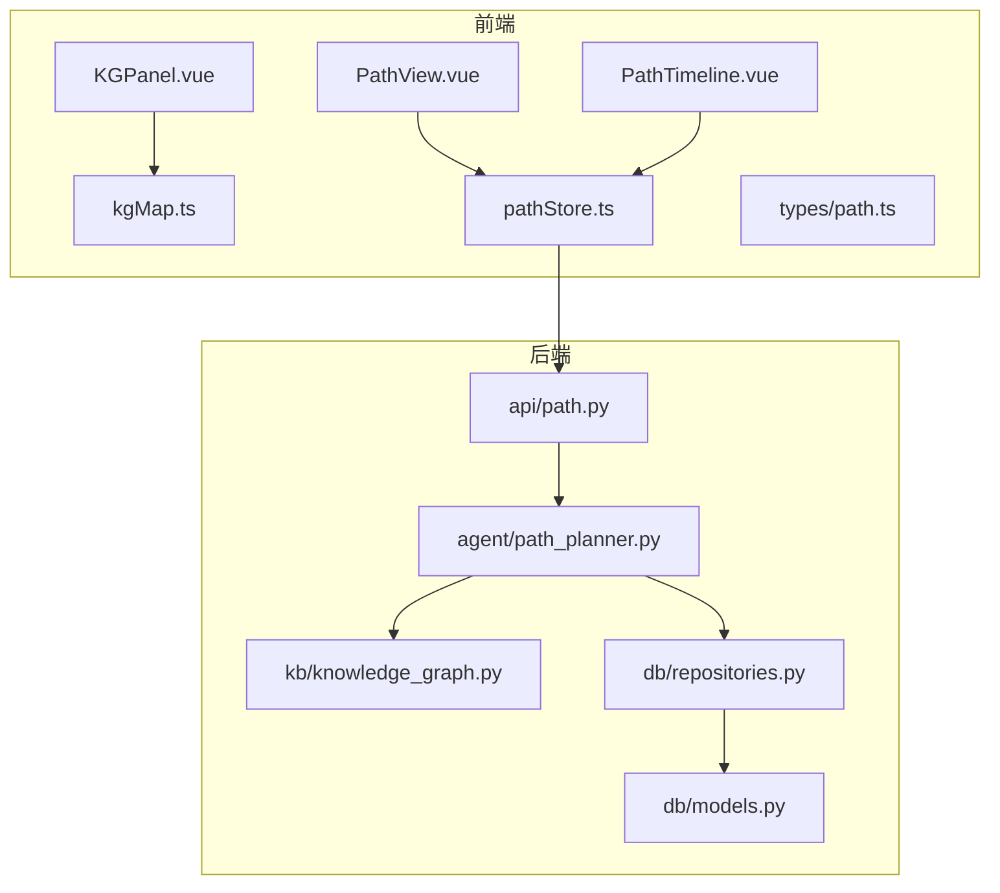
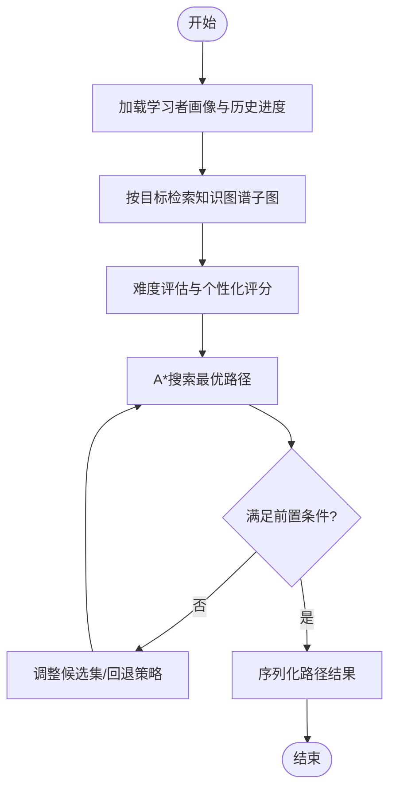
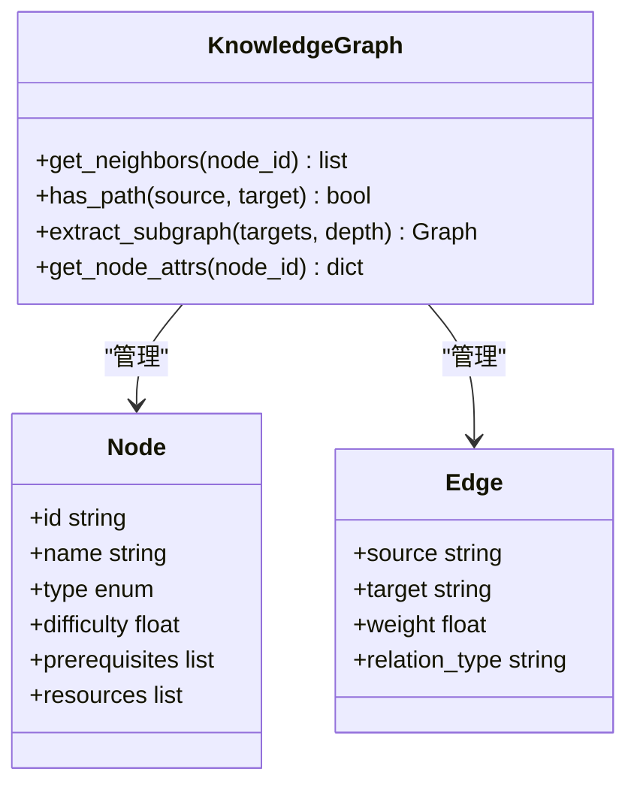
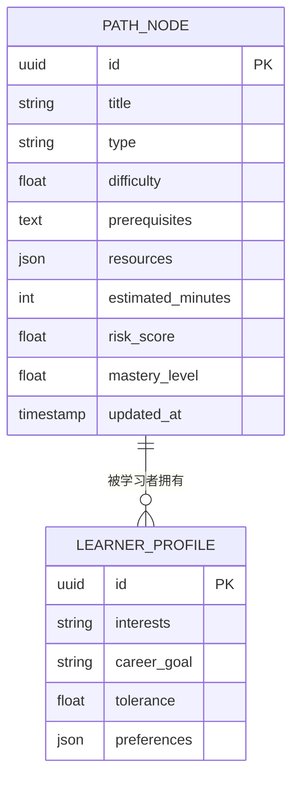
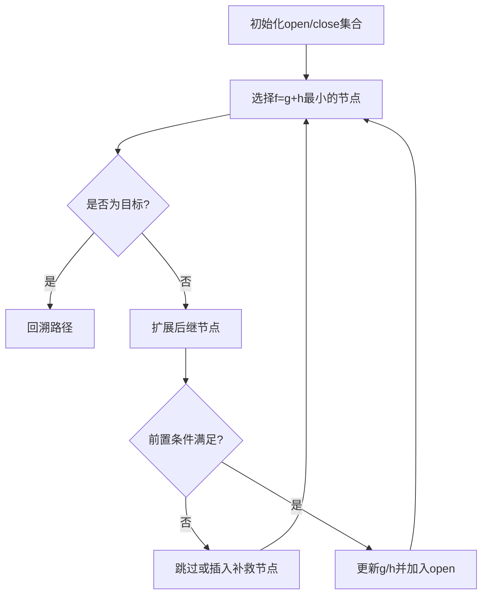
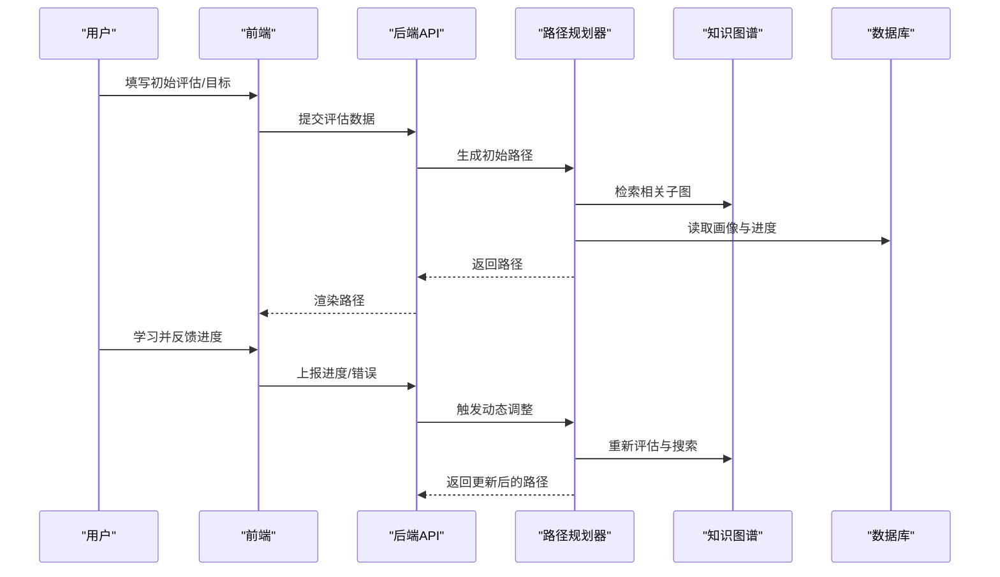
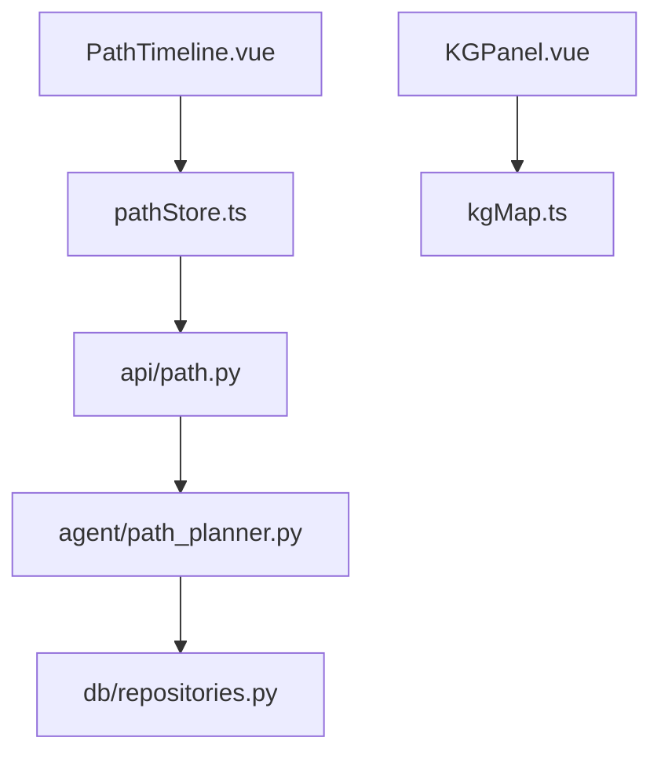
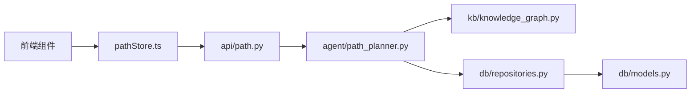

# 学习路径规划智能体

<cite>
**本文引用的文件**   
- [src/loopse/agent/path_planner.py](file://src/loopse/agent/path_planner.py)
- [src/loopse/api/path.py](file://src/loopse/api/path.py)
- [src/loopse/kb/knowledge_graph.py](file://src/loopse/kb/knowledge_graph.py)
- [src/loopse/db/models.py](file://src/loopse/db/models.py)
- [src/loopse/db/repositories.py](file://src/loopse/db/repositories.py)
- [config/prompts/path_planner/plan_path.txt](file://config/prompts/path_planner/plan_path.txt)
- [frontend/src/types/path.ts](file://frontend/src/types/path.ts)
- [frontend/src/stores/pathStore.ts](file://frontend/src/stores/pathStore.ts)
- [frontend/src/views/PathView.vue](file://frontend/src/views/PathView.vue)
- [frontend/src/components/path/PathTimeline.vue](file://frontend/src/components/path/PathTimeline.vue)
- [frontend/src/components/KGPanel.vue](file://frontend/src/components/KGPanel.vue)
- [frontend/src/utils/kgMap.ts](file://frontend/src/utils/kgMap.ts)
- [frontend/public/mock/path_mock.json](file://frontend/public/mock/path_mock.json)
</cite>

## 目录
1. [简介](#简介)
2. [项目结构](#项目结构)
3. [核心组件](#核心组件)
4. [架构总览](#架构总览)
5. [详细组件分析](#详细组件分析)
6. [依赖关系分析](#依赖关系分析)
7. [性能考量](#性能考量)
8. [故障排查指南](#故障排查指南)
9. [结论](#结论)
10. [附录](#附录)

## 简介
本技术文档聚焦于“学习路径规划智能体”（PathPlanner）的实现与使用，覆盖知识图谱遍历、难度评估模型、个性化推荐策略、路径生成流程（从用户初始评估到动态调整）、节点数据结构与前置条件检查、路径优化算法（含A*搜索与启发式函数设计）、可视化接口、进度跟踪机制以及干预触发条件。文档面向具备不同技术背景的读者，提供由浅入深的说明与图示。

## 项目结构
围绕学习路径规划的关键代码分布在后端智能体、API层、知识库、数据库模型与前端展示层：
- 智能体层：路径规划器负责基于知识图谱与学习者画像生成与更新学习路径。
- API层：对外暴露路径规划、查询、更新等接口。
- 知识库层：提供知识图谱的构建、查询与遍历能力。
- 数据层：持久化存储学习者画像、路径节点、依赖关系与进度。
- 前端层：提供路径可视化、时间线展示、知识图谱交互与进度跟踪。

**图表来源**
- [frontend/src/views/PathView.vue](file://frontend/src/views/PathView.vue)
- [frontend/src/components/path/PathTimeline.vue](file://frontend/src/components/path/PathTimeline.vue)
- [frontend/src/components/KGPanel.vue](file://frontend/src/components/KGPanel.vue)
- [frontend/src/utils/kgMap.ts](file://frontend/src/utils/kgMap.ts)
- [frontend/src/stores/pathStore.ts](file://frontend/src/stores/pathStore.ts)
- [frontend/src/types/path.ts](file://frontend/src/types/path.ts)
- [src/loopse/api/path.py](file://src/loopse/api/path.py)
- [src/loopse/agent/path_planner.py](file://src/loopse/agent/path_planner.py)
- [src/loopse/kb/knowledge_graph.py](file://src/loopse/kb/knowledge_graph.py)
- [src/loopse/db/models.py](file://src/loopse/db/models.py)
- [src/loopse/db/repositories.py](file://src/loopse/db/repositories.py)

**章节来源**
- [src/loopse/agent/path_planner.py](file://src/loopse/agent/path_planner.py)
- [src/loopse/api/path.py](file://src/loopse/api/path.py)
- [src/loopse/kb/knowledge_graph.py](file://src/loopse/kb/knowledge_graph.py)
- [src/loopse/db/models.py](file://src/loopse/db/models.py)
- [src/loopse/db/repositories.py](file://src/loopse/db/repositories.py)
- [frontend/src/types/path.ts](file://frontend/src/types/path.ts)
- [frontend/src/stores/pathStore.ts](file://frontend/src/stores/pathStore.ts)
- [frontend/src/views/PathView.vue](file://frontend/src/views/PathView.vue)
- [frontend/src/components/path/PathTimeline.vue](file://frontend/src/components/path/PathTimeline.vue)
- [frontend/src/components/KGPanel.vue](file://frontend/src/components/KGPanel.vue)
- [frontend/src/utils/kgMap.ts](file://frontend/src/utils/kgMap.ts)

## 核心组件
- 路径规划器（PathPlanner）：整合学习者画像、知识图谱与偏好，执行图遍历与A*搜索，输出可执行的学习路径序列，并支持动态重规划。
- 知识图谱（KnowledgeGraph）：维护知识点、技能、资源及其依赖关系，提供邻居查询、可达性判断与最短路径计算。
- 难度评估模型：结合先验难度、学习者历史表现与当前状态，估计节点完成成本与成功率。
- 个性化推荐策略：依据兴趣、职业目标、学习风格与可用时间，对候选节点进行排序与裁剪。
- 路径持久化与进度追踪：记录已学节点、掌握程度、耗时与错误模式，驱动后续路径调整。
- 可视化与交互：前端通过时间线与图谱面板呈现路径、依赖与进度，并提供干预入口。

**章节来源**
- [src/loopse/agent/path_planner.py](file://src/loopse/agent/path_planner.py)
- [src/loopse/kb/knowledge_graph.py](file://src/loopse/kb/knowledge_graph.py)
- [src/loopse/db/models.py](file://src/loopse/db/models.py)
- [src/loopse/db/repositories.py](file://src/loopse/db/repositories.py)
- [frontend/src/types/path.ts](file://frontend/src/types/path.ts)
- [frontend/src/stores/pathStore.ts](file://frontend/src/stores/pathStore.ts)
- [frontend/src/components/path/PathTimeline.vue](file://frontend/src/components/path/PathTimeline.vue)
- [frontend/src/components/KGPanel.vue](file://frontend/src/components/KGPanel.vue)

## 架构总览
下图展示了从用户请求到路径生成的端到端流程，包括前端调用、API路由、智能体决策、知识图谱查询与数据库读写。

```mermaid
sequenceDiagram
participant FE as "前端<br/>PathView/PathTimeline"
participant Store as "pathStore.ts"
participant API as "api/path.py"
participant Planner as "agent/path_planner.py"
participant KG as "kb/knowledge_graph.py"
participant Repo as "db/repositories.py"
participant Model as "db/models.py"
FE->>Store : 发起“生成/更新路径”请求
Store->>API : POST /api/path/generate
API->>Planner : 调用规划方法(传入用户ID/目标/约束)
Planner->>KG : 查询起点/终点及依赖子图
Planner->>Repo : 读取学习者画像/历史进度
Planner->>Planner : 难度评估+个性化排序+A*搜索
Planner->>Repo : 写入新路径/节点进度
Repo->>Model : 持久化
Planner-->>API : 返回路径序列与元信息
API-->>Store : JSON响应
Store-->>FE : 渲染时间线与图谱
```

**图表来源**
- [frontend/src/views/PathView.vue](file://frontend/src/views/PathView.vue)
- [frontend/src/components/path/PathTimeline.vue](file://frontend/src/components/path/PathTimeline.vue)
- [frontend/src/stores/pathStore.ts](file://frontend/src/stores/pathStore.ts)
- [src/loopse/api/path.py](file://src/loopse/api/path.py)
- [src/loopse/agent/path_planner.py](file://src/loopse/agent/path_planner.py)
- [src/loopse/kb/knowledge_graph.py](file://src/loopse/kb/knowledge_graph.py)
- [src/loopse/db/repositories.py](file://src/loopse/db/repositories.py)
- [src/loopse/db/models.py](file://src/loopse/db/models.py)

## 详细组件分析

### 路径规划器（PathPlanner）
- 职责
  - 解析用户目标与约束（如时间窗口、兴趣标签、职业方向）。
  - 基于知识图谱定位起点与目标集合，构建局部子图。
  - 执行难度评估与个性化排序，选择候选节点。
  - 使用A*搜索在依赖图中寻找最优路径序列。
  - 输出路径节点列表、预估耗时、风险点与干预建议。
- 关键流程
  - 初始化：加载学习者画像、历史进度、偏好设置。
  - 图检索：根据目标关键词或技能树定位相关节点与边。
  - 评估：为每个候选节点计算难度、收益与失败概率。
  - 搜索：以A*在依赖有向无环图（DAG）上求解最短/最优路径。
  - 输出：序列化路径结果，包含节点顺序、前置条件、预计时长与风险提示。
- 提示工程
  - 使用配置中的提示模板辅助生成解释与理由，增强可解释性与透明度。

**图表来源**
- [src/loopse/agent/path_planner.py](file://src/loopse/agent/path_planner.py)
- [src/loopse/kb/knowledge_graph.py](file://src/loopse/kb/knowledge_graph.py)
- [config/prompts/path_planner/plan_path.txt](file://config/prompts/path_planner/plan_path.txt)

**章节来源**
- [src/loopse/agent/path_planner.py](file://src/loopse/agent/path_planner.py)
- [config/prompts/path_planner/plan_path.txt](file://config/prompts/path_planner/plan_path.txt)

### 知识图谱（KnowledgeGraph）
- 数据结构
  - 节点：知识点/技能/资源，包含标识、名称、类型、难度、先决条件、关联资源等属性。
  - 边：依赖关系（先修/后继），权重可表示难度或相似度。
- 操作
  - 邻居查询：获取某节点的直接前驱与后继。
  - 可达性：判断两节点间是否存在依赖路径。
  - 子图提取：围绕目标节点抽取最小必要子图用于搜索。
- 复杂度
  - 邻接表存储下，邻居查询O(k)，k为度；可达性检测通常采用DFS/BFS，最坏O(V+E)。

**图表来源**
- [src/loopse/kb/knowledge_graph.py](file://src/loopse/kb/knowledge_graph.py)

**章节来源**
- [src/loopse/kb/knowledge_graph.py](file://src/loopse/kb/knowledge_graph.py)

### 难度评估模型与个性化推荐
- 难度评估
  - 输入：节点先验难度、学习者历史正确率、最近错误模式、时间压力。
  - 输出：节点完成成本（期望时长）、成功概率、风险等级。
- 个性化策略
  - 兴趣匹配：优先选择与兴趣标签高相关的节点。
  - 职业导向：强化与目标岗位技能强相关的子图。
  - 学习风格：自适应调整探索与利用比例，避免过难或过易。
- 组合评分
  - 综合得分 = f(难度, 收益, 兴趣匹配, 职业相关性, 风险容忍度)

**章节来源**
- [src/loopse/agent/path_planner.py](file://src/loopse/agent/path_planner.py)
- [src/loopse/db/models.py](file://src/loopse/db/models.py)

### 路径节点数据结构与依赖管理
- 节点字段
  - 标识、名称、类型、难度、先决条件、资源链接、预估时长、风险等级、掌握程度、最后更新时间。
- 依赖管理
  - 显式先决条件列表；拓扑校验确保无环；变更传播影响下游节点。
- 前置条件检查
  - 在加入路径前验证所有前置节点是否已完成或豁免；不满足则插入补救节点或调整顺序。

**图表来源**
- [src/loopse/db/models.py](file://src/loopse/db/models.py)
- [frontend/src/types/path.ts](file://frontend/src/types/path.ts)

**章节来源**
- [src/loopse/db/models.py](file://src/loopse/db/models.py)
- [frontend/src/types/path.ts](file://frontend/src/types/path.ts)

### A*搜索实现与启发式函数设计
- 搜索空间
  - 节点为知识点，边为依赖关系，目标为技能集合或最终能力节点。
- 代价函数
  - g(n)：从起点到n的实际累计成本（基于预估时长与难度）。
  - h(n)：从n到目标的启发式估计（如剩余依赖的最小深度加权平均）。
- 终止条件
  - 到达目标集合且满足前置条件；或搜索预算耗尽。
- 可行性保证
  - 若h(n)一致单调且不超估，A*可保证最优解。

**图表来源**
- [src/loopse/agent/path_planner.py](file://src/loopse/agent/path_planner.py)
- [src/loopse/kb/knowledge_graph.py](file://src/loopse/kb/knowledge_graph.py)

**章节来源**
- [src/loopse/agent/path_planner.py](file://src/loopse/agent/path_planner.py)
- [src/loopse/kb/knowledge_graph.py](file://src/loopse/kb/knowledge_graph.py)

### 路径生成流程：从初始评估到动态调整
- 初始评估
  - 收集学习者画像、目标、可用时间与约束。
  - 基于画像确定起点与目标集合。
- 路径生成
  - 检索知识图谱子图，评估节点难度与收益，执行A*搜索得到初始路径。
- 动态调整
  - 在学习过程中根据实际进度、错误模式与反馈重新评估与重规划。
  - 触发条件：连续失败、超时、兴趣变化、外部事件（考试/面试）。

**图表来源**
- [frontend/src/views/PathView.vue](file://frontend/src/views/PathView.vue)
- [frontend/src/stores/pathStore.ts](file://frontend/src/stores/pathStore.ts)
- [src/loopse/api/path.py](file://src/loopse/api/path.py)
- [src/loopse/agent/path_planner.py](file://src/loopse/agent/path_planner.py)
- [src/loopse/kb/knowledge_graph.py](file://src/loopse/kb/knowledge_graph.py)
- [src/loopse/db/repositories.py](file://src/loopse/db/repositories.py)

**章节来源**
- [frontend/src/views/PathView.vue](file://frontend/src/views/PathView.vue)
- [frontend/src/stores/pathStore.ts](file://frontend/src/stores/pathStore.ts)
- [src/loopse/api/path.py](file://src/loopse/api/path.py)
- [src/loopse/agent/path_planner.py](file://src/loopse/agent/path_planner.py)
- [src/loopse/kb/knowledge_graph.py](file://src/loopse/kb/knowledge_graph.py)
- [src/loopse/db/repositories.py](file://src/loopse/db/repositories.py)

### 路径可视化接口与进度跟踪
- 可视化
  - 时间线：按顺序展示节点、状态、耗时与风险。
  - 知识图谱：交互式查看依赖关系与当前路径高亮。
- 进度跟踪
  - 记录每节点的掌握程度、尝试次数、错误模式与用时。
  - 实时更新前端状态，支持回放与对比。
- 干预触发条件
  - 连续失败阈值、超时未推进、高风险节点、兴趣漂移、目标变更。

**图表来源**
- [frontend/src/components/path/PathTimeline.vue](file://frontend/src/components/path/PathTimeline.vue)
- [frontend/src/stores/pathStore.ts](file://frontend/src/stores/pathStore.ts)
- [frontend/src/components/KGPanel.vue](file://frontend/src/components/KGPanel.vue)
- [frontend/src/utils/kgMap.ts](file://frontend/src/utils/kgMap.ts)
- [src/loopse/api/path.py](file://src/loopse/api/path.py)
- [src/loopse/agent/path_planner.py](file://src/loopse/agent/path_planner.py)
- [src/loopse/db/repositories.py](file://src/loopse/db/repositories.py)

**章节来源**
- [frontend/src/components/path/PathTimeline.vue](file://frontend/src/components/path/PathTimeline.vue)
- [frontend/src/stores/pathStore.ts](file://frontend/src/stores/pathStore.ts)
- [frontend/src/components/KGPanel.vue](file://frontend/src/components/KGPanel.vue)
- [frontend/src/utils/kgMap.ts](file://frontend/src/utils/kgMap.ts)
- [frontend/public/mock/path_mock.json](file://frontend/public/mock/path_mock.json)

## 依赖关系分析
- 组件耦合
  - PathPlanner依赖KnowledgeGraph与Repositories；API作为编排层协调前后端。
  - 前端通过pathStore聚合API调用，视图组件消费store状态。
- 外部依赖
  - 数据库模型定义实体与关系；提示模板增强可解释性。
- 潜在循环
  - 通过分层与接口隔离避免循环依赖；API仅调用Agent，Agent不反向调用API。

**图表来源**
- [frontend/src/stores/pathStore.ts](file://frontend/src/stores/pathStore.ts)
- [src/loopse/api/path.py](file://src/loopse/api/path.py)
- [src/loopse/agent/path_planner.py](file://src/loopse/agent/path_planner.py)
- [src/loopse/kb/knowledge_graph.py](file://src/loopse/kb/knowledge_graph.py)
- [src/loopse/db/repositories.py](file://src/loopse/db/repositories.py)
- [src/loopse/db/models.py](file://src/loopse/db/models.py)

**章节来源**
- [frontend/src/stores/pathStore.ts](file://frontend/src/stores/pathStore.ts)
- [src/loopse/api/path.py](file://src/loopse/api/path.py)
- [src/loopse/agent/path_planner.py](file://src/loopse/agent/path_planner.py)
- [src/loopse/kb/knowledge_graph.py](file://src/loopse/kb/knowledge_graph.py)
- [src/loopse/db/repositories.py](file://src/loopse/db/repositories.py)
- [src/loopse/db/models.py](file://src/loopse/db/models.py)

## 性能考量
- 图规模控制
  - 限制子图深度与节点数量，避免全图搜索带来的开销。
- 缓存与预取
  - 缓存常用子图与评估结果；对热点节点进行预计算。
- 搜索剪枝
  - 基于难度阈值与风险上限剪枝；对低收益分支提前终止。
- 异步与批处理
  - 前端批量上报进度，后端合并更新；减少频繁IO。
- 启发式调优
  - 定期校准h(n)参数，使其更贴近真实剩余成本，提升A*效率。

[本节为通用指导，无需特定文件引用]

## 故障排查指南
- 常见问题
  - 前置条件不满足：检查依赖边与节点状态，必要时插入补救节点。
  - 路径不可达：确认目标集合与起点连通性，扩大检索范围。
  - 评估偏差：复核难度模型参数与学习者历史数据质量。
  - 前端渲染异常：核对pathStore状态与mock数据一致性。
- 诊断步骤
  - 查看API日志与响应体，确认路径生成阶段报错位置。
  - 检查知识图谱查询结果是否符合预期。
  - 比对数据库中的节点掌握程度与前端显示是否同步。
  - 使用Mock数据快速复现问题，逐步替换为真实数据定位。

**章节来源**
- [src/loopse/api/path.py](file://src/loopse/api/path.py)
- [src/loopse/agent/path_planner.py](file://src/loopse/agent/path_planner.py)
- [src/loopse/kb/knowledge_graph.py](file://src/loopse/kb/knowledge_graph.py)
- [src/loopse/db/repositories.py](file://src/loopse/db/repositories.py)
- [frontend/src/stores/pathStore.ts](file://frontend/src/stores/pathStore.ts)
- [frontend/public/mock/path_mock.json](file://frontend/public/mock/path_mock.json)

## 结论
学习路径规划智能体通过知识图谱遍历、难度评估与个性化策略，结合A*搜索在依赖图中高效生成与动态调整学习路径。系统在后端以清晰的模块划分与接口契约支撑前端可视化与进度跟踪，具备良好的可扩展性与可解释性。未来可在启发式函数校准、在线学习与多目标优化方面持续改进。

[本节为总结性内容，无需特定文件引用]

## 附录
- 术语
  - 知识图谱：描述知识点、技能与资源的结构化网络。
  - 前置条件：完成某节点必须满足的先修要求。
  - 启发式函数：估计从当前节点到目标的剩余成本的近似值。
- 参考数据
  - Mock路径数据可用于前端联调与演示。

**章节来源**
- [frontend/public/mock/path_mock.json](file://frontend/public/mock/path_mock.json)