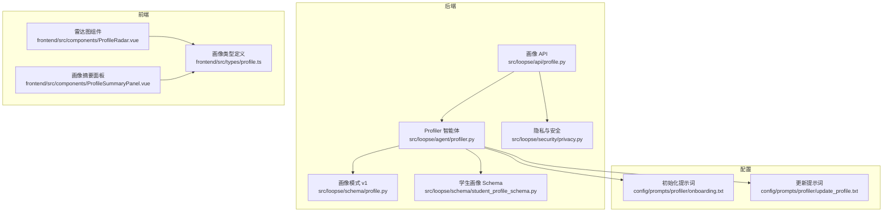
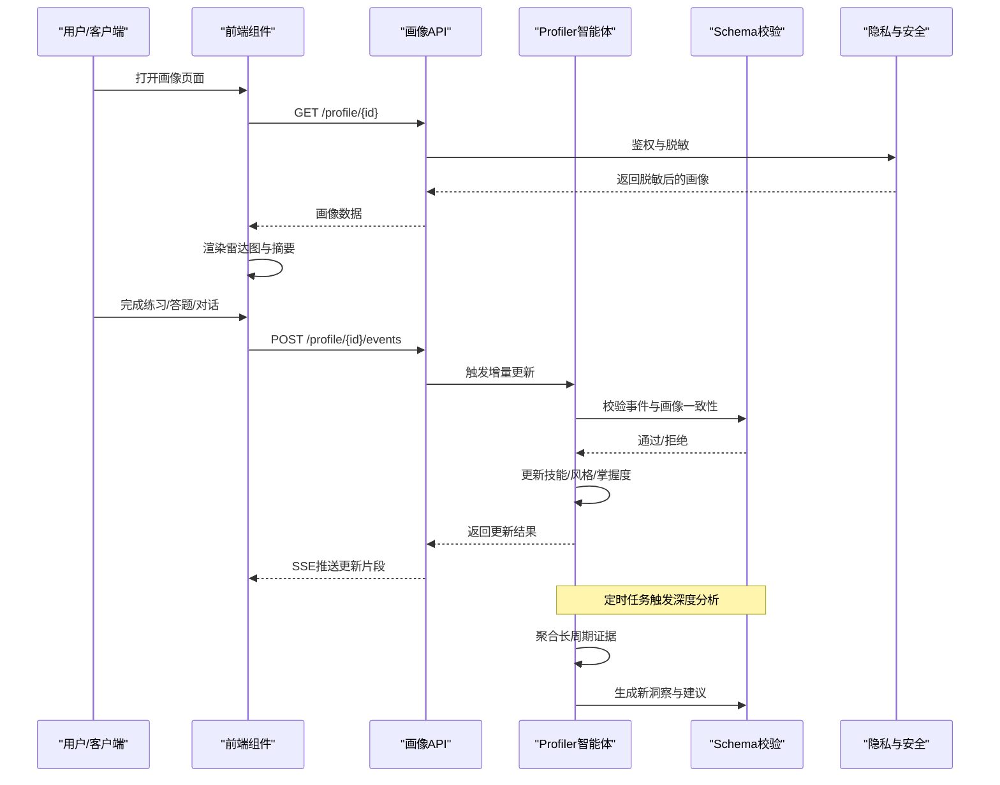
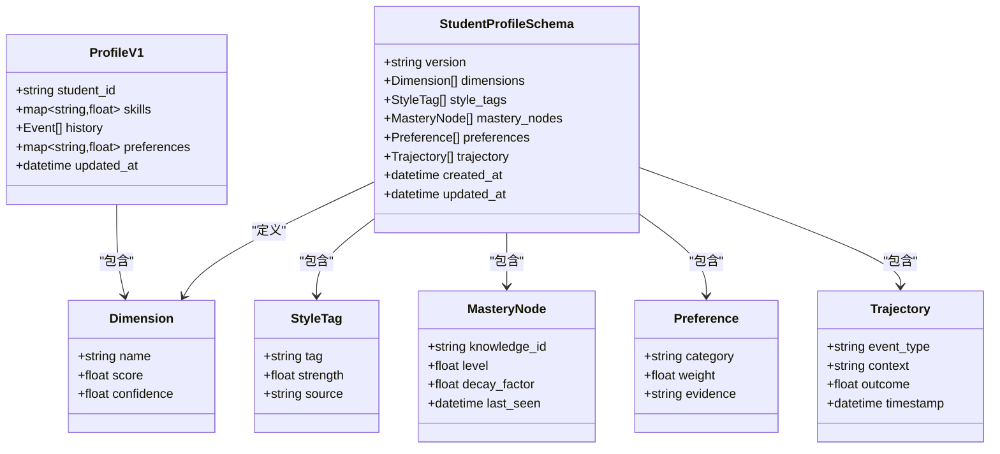
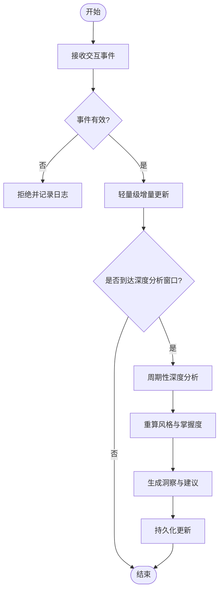
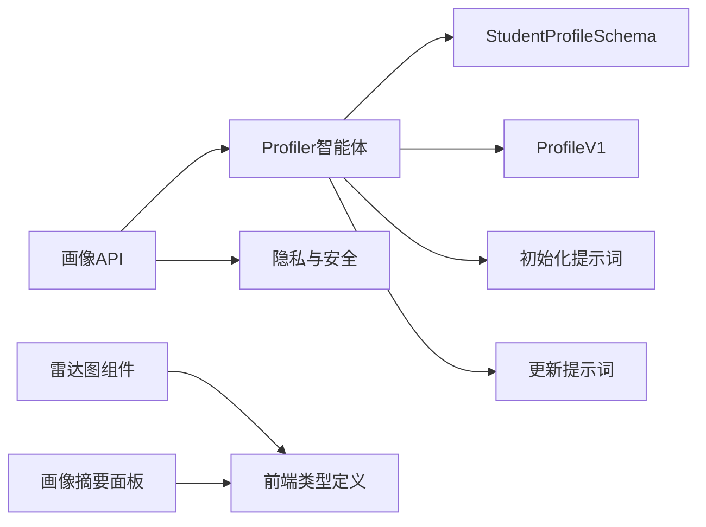

# 学生画像构建智能体

<cite>
**本文引用的文件**   
- [profiler.py](file://src/loopse/agent/profiler.py)
- [profile.py](file://src/loopse/schema/profile.py)
- [student_profile_schema.py](file://src/loopse/schema/student_profile_schema.py)
- [profile_api.py](file://src/loopse/api/profile.py)
- [privacy.py](file://src/loopse/security/privacy.py)
- [onboarding.txt](file://config/prompts/profiler/onboarding.txt)
- [update_profile.txt](file://config/prompts/profiler/update_profile.txt)
- [ProfileRadar.vue](file://frontend/src/components/ProfileRadar.vue)
- [ProfileSummaryPanel.vue](file://frontend/src/components/ProfileSummaryPanel.vue)
- [profile.ts](file://frontend/src/types/profile.ts)
- [test_student_profile_schema.py](file://tests/test_student_profile_schema.py)
</cite>

## 目录
1. [简介](#简介)
2. [项目结构](#项目结构)
3. [核心组件](#核心组件)
4. [架构总览](#架构总览)
5. [详细组件分析](#详细组件分析)
6. [依赖关系分析](#依赖关系分析)
7. [性能考虑](#性能考虑)
8. [故障排查指南](#故障排查指南)
9. [结论](#结论)
10. [附录](#附录)

## 简介
本技术文档聚焦于“学生画像构建智能体”（Profiler）的设计与实现，系统阐述其画像建模方法、数据模型、更新机制、隐私保护策略以及查询与分析接口。目标读者包括后端工程师、前端开发者、教育数据分析师与产品负责人。

## 项目结构
围绕学生画像的核心代码分布在以下位置：
- 智能体与业务逻辑：src/loopse/agent/profiler.py
- 画像数据模式定义：src/loopse/schema/profile.py、src/loopse/schema/student_profile_schema.py
- 画像API服务：src/loopse/api/profile.py
- 隐私与安全：src/loopse/security/privacy.py
- 提示词模板：config/prompts/profiler/onboarding.txt、config/prompts/profiler/update_profile.txt
- 前端可视化与类型：frontend/src/components/ProfileRadar.vue、frontend/src/components/ProfileSummaryPanel.vue、frontend/src/types/profile.ts
- 测试用例：tests/test_student_profile_schema.py

图表来源
- [profiler.py:1-200](file://src/loopse/agent/profiler.py#L1-L200)
- [profile.py:1-200](file://src/loopse/schema/profile.py#L1-L200)
- [student_profile_schema.py:1-200](file://src/loopse/schema/student_profile_schema.py#L1-L200)
- [profile_api.py:1-200](file://src/loopse/api/profile.py#L1-L200)
- [privacy.py:1-200](file://src/loopse/security/privacy.py#L1-L200)
- [onboarding.txt:1-200](file://config/prompts/profiler/onboarding.txt#L1-L200)
- [update_profile.txt:1-200](file://config/prompts/profiler/update_profile.txt#L1-L200)
- [ProfileRadar.vue:1-200](file://frontend/src/components/ProfileRadar.vue#L1-L200)
- [ProfileSummaryPanel.vue:1-200](file://frontend/src/components/ProfileSummaryPanel.vue#L1-L200)
- [profile.ts:1-200](file://frontend/src/types/profile.ts#L1-L200)

章节来源
- [profiler.py:1-200](file://src/loopse/agent/profiler.py#L1-L200)
- [profile.py:1-200](file://src/loopse/schema/profile.py#L1-L200)
- [student_profile_schema.py:1-200](file://src/loopse/schema/student_profile_schema.py#L1-L200)
- [profile_api.py:1-200](file://src/loopse/api/profile.py#L1-L200)
- [privacy.py:1-200](file://src/loopse/security/privacy.py#L1-L200)
- [onboarding.txt:1-200](file://config/prompts/profiler/onboarding.txt#L1-L200)
- [update_profile.txt:1-200](file://config/prompts/profiler/update_profile.txt#L1-L200)
- [ProfileRadar.vue:1-200](file://frontend/src/components/ProfileRadar.vue#L1-L200)
- [ProfileSummaryPanel.vue:1-200](file://frontend/src/components/ProfileSummaryPanel.vue#L1-L200)
- [profile.ts:1-200](file://frontend/src/types/profile.ts#L1-L200)

## 核心组件
- Profiler 智能体：负责基于交互行为与学习证据进行认知能力评估、学习风格分析与知识掌握度量化，并维护画像生命周期（初始化、增量更新、深度分析）。
- 画像数据模式：定义技能维度、学习轨迹、偏好特征等结构化字段，确保前后端一致性与可验证性。
- 画像 API：提供画像创建、读取、更新、批量查询、相似度计算与群体分析等接口，并在访问层实施隐私脱敏与权限控制。
- 隐私与安全：对敏感字段进行脱敏、最小化暴露与审计记录，支持按角色或范围的数据访问控制。
- 前端可视化：雷达图展示多维技能分布，摘要面板呈现关键洞察与建议。

章节来源
- [profiler.py:1-200](file://src/loopse/agent/profiler.py#L1-L200)
- [profile.py:1-200](file://src/loopse/schema/profile.py#L1-L200)
- [student_profile_schema.py:1-200](file://src/loopse/schema/student_profile_schema.py#L1-L200)
- [profile_api.py:1-200](file://src/loopse/api/profile.py#L1-L200)
- [privacy.py:1-200](file://src/loopse/security/privacy.py#L1-L200)
- [ProfileRadar.vue:1-200](file://frontend/src/components/ProfileRadar.vue#L1-L200)
- [ProfileSummaryPanel.vue:1-200](file://frontend/src/components/ProfileSummaryPanel.vue#L1-L200)
- [profile.ts:1-200](file://frontend/src/types/profile.ts#L1-L200)

## 架构总览
下图展示了从用户交互到画像更新的端到端流程，涵盖实时增量更新与周期性深度分析两条路径。

图表来源
- [profile_api.py:1-200](file://src/loopse/api/profile.py#L1-L200)
- [profiler.py:1-200](file://src/loopse/agent/profiler.py#L1-L200)
- [student_profile_schema.py:1-200](file://src/loopse/schema/student_profile_schema.py#L1-L200)
- [privacy.py:1-200](file://src/loopse/security/privacy.py#L1-L200)
- [ProfileRadar.vue:1-200](file://frontend/src/components/ProfileRadar.vue#L1-L200)
- [ProfileSummaryPanel.vue:1-200](file://frontend/src/components/ProfileSummaryPanel.vue#L1-L200)

## 详细组件分析

### 画像建模方法
- 认知能力评估
  - 依据交互事件（如答题正确率、用时、重试次数、错误类型）推断各维度的认知水平，采用加权融合与置信度估计，避免单次噪声影响。
  - 结合历史窗口进行平滑更新，降低短期波动。
- 学习风格分析
  - 基于行为序列（如先概念后练习、先示例后自测、偏好视频/文本/交互式资源）聚类识别风格标签与强度。
  - 使用提示词模板引导大模型输出结构化风格特征，并与规则引擎交叉验证。
- 知识掌握度量化
  - 以知识点为粒度，建立掌握度指标（熟练度、遗忘曲线修正、迁移应用表现），随时间衰减与强化更新。
  - 将掌握度映射至技能维度，形成雷达图所需的多维评分。

章节来源
- [profiler.py:1-200](file://src/loopse/agent/profiler.py#L1-L200)
- [onboarding.txt:1-200](file://config/prompts/profiler/onboarding.txt#L1-L200)
- [update_profile.txt:1-200](file://config/prompts/profiler/update_profile.txt#L1-L200)

### 画像数据模型
- 技能雷达图
  - 维度集合：例如“抽象思维、逻辑推理、空间想象、记忆巩固、元认知监控”等（具体维度以Schema为准）。
  - 分值范围与权重：统一归一化，支持动态权重调整以适配课程阶段。
- 学习轨迹记录
  - 事件流：包含时间戳、事件类型、上下文（题目ID、资源ID）、结果与耗时。
  - 聚合视图：按日/周/月统计趋势，支撑可视化与干预策略。
- 偏好特征提取
  - 资源偏好：视频/文本/交互式/代码生成的点击与完成率。
  - 交互偏好：问答轮次、提问方式、反馈敏感度。
  - 风格标签：视觉型、听觉型、动手型、反思型等及其置信度。

图表来源
- [profile.py:1-200](file://src/loopse/schema/profile.py#L1-L200)
- [student_profile_schema.py:1-200](file://src/loopse/schema/student_profile_schema.py#L1-L200)

章节来源
- [profile.py:1-200](file://src/loopse/schema/profile.py#L1-L200)
- [student_profile_schema.py:1-200](file://src/loopse/schema/student_profile_schema.py#L1-L200)
- [profile.ts:1-200](file://frontend/src/types/profile.ts#L1-L200)

### 画像更新机制
- 实时增量更新
  - 触发条件：每次交互事件到达即触发轻量级更新，仅刷新受影响维度与近期轨迹。
  - 更新策略：指数移动平均、置信度加权、异常值过滤。
- 周期性深度分析
  - 触发条件：定时任务（如每日/每周）聚合长窗口证据，重新评估风格标签与掌握度，生成洞察与建议。
  - 产出：更新雷达图、新增风格标签、优化掌握度节点、沉淀可解释证据链。

图表来源
- [profiler.py:1-200](file://src/loopse/agent/profiler.py#L1-L200)
- [update_profile.txt:1-200](file://config/prompts/profiler/update_profile.txt#L1-L200)

章节来源
- [profiler.py:1-200](file://src/loopse/agent/profiler.py#L1-L200)
- [update_profile.txt:1-200](file://config/prompts/profiler/update_profile.txt#L1-L200)

### 隐私保护、数据脱敏与访问控制
- 隐私保护
  - 最小化采集：仅收集画像必需的行为与结果字段。
  - 本地化处理：在可信边界内完成敏感数据处理，减少跨域传输。
- 数据脱敏
  - 对外响应时自动移除或泛化敏感字段（如姓名、联系方式、精确地理位置）。
  - 对数值型指标进行区间化或分桶处理，防止反推个体信息。
- 访问控制
  - 基于角色的访问控制（RBAC）：教师、管理员、学生本人可见范围不同。
  - 细粒度授权：按班级/课程/时间段限制访问。
  - 审计日志：记录所有画像访问与导出操作。

章节来源
- [privacy.py:1-200](file://src/loopse/security/privacy.py#L1-L200)
- [profile_api.py:1-200](file://src/loopse/api/profile.py#L1-L200)

### 画像查询接口、相似度计算与群体分析
- 查询接口
  - 获取单个画像：GET /profile/{id}
  - 批量查询：POST /profiles/query（支持筛选条件与分页）
  - 事件写入：POST /profile/{id}/events
- 相似度计算
  - 向量相似度：基于雷达图向量与风格标签的加权余弦相似度。
  - 掌握度对齐：按知识点匹配度进行加权，突出共同薄弱点。
- 群体分析
  - 聚类分组：KMeans/层次聚类划分学习风格与掌握度相似群体。
  - 分布统计：维度均值、方差、百分位，辅助教学决策。
  - 趋势对比：跨时间段的群体变化，评估干预效果。

章节来源
- [profile_api.py:1-200](file://src/loopse/api/profile.py#L1-L200)
- [student_profile_schema.py:1-200](file://src/loopse/schema/student_profile_schema.py#L1-L200)

### 前端可视化与类型
- 雷达图组件
  - 输入：维度名称与分数数组，支持动画过渡与悬停详情。
  - 交互：切换维度权重、查看置信度区间。
- 画像摘要面板
  - 内容：关键洞察、建议行动项、最近轨迹摘要。
  - 联动：点击某维度跳转相关资源或练习。
- 类型定义
  - 前后端一致的画像数据结构，确保字段命名、类型与取值范围一致。

章节来源
- [ProfileRadar.vue:1-200](file://frontend/src/components/ProfileRadar.vue#L1-L200)
- [ProfileSummaryPanel.vue:1-200](file://frontend/src/components/ProfileSummaryPanel.vue#L1-L200)
- [profile.ts:1-200](file://frontend/src/types/profile.ts#L1-L200)

## 依赖关系分析
- 模块耦合
  - Profiler 依赖 Schema 进行数据校验与版本管理。
  - API 层依赖 Profiler 执行更新与查询，同时依赖隐私模块进行脱敏与鉴权。
  - 前端依赖类型定义与可视化组件，通过 API 拉取与推送数据。
- 外部依赖
  - 提示词模板驱动大模型生成结构化画像要素，需保证模板稳定与可回滚。
  - 可选：向量库用于相似度与聚类计算。

图表来源
- [profile_api.py:1-200](file://src/loopse/api/profile.py#L1-L200)
- [profiler.py:1-200](file://src/loopse/agent/profiler.py#L1-L200)
- [student_profile_schema.py:1-200](file://src/loopse/schema/student_profile_schema.py#L1-L200)
- [profile.py:1-200](file://src/loopse/schema/profile.py#L1-L200)
- [privacy.py:1-200](file://src/loopse/security/privacy.py#L1-L200)
- [onboarding.txt:1-200](file://config/prompts/profiler/onboarding.txt#L1-L200)
- [update_profile.txt:1-200](file://config/prompts/profiler/update_profile.txt#L1-L200)
- [ProfileRadar.vue:1-200](file://frontend/src/components/ProfileRadar.vue#L1-L200)
- [ProfileSummaryPanel.vue:1-200](file://frontend/src/components/ProfileSummaryPanel.vue#L1-L200)
- [profile.ts:1-200](file://frontend/src/types/profile.ts#L1-L200)

章节来源
- [profile_api.py:1-200](file://src/loopse/api/profile.py#L1-L200)
- [profiler.py:1-200](file://src/loopse/agent/profiler.py#L1-L200)
- [student_profile_schema.py:1-200](file://src/loopse/schema/student_profile_schema.py#L1-L200)
- [profile.py:1-200](file://src/loopse/schema/profile.py#L1-L200)
- [privacy.py:1-200](file://src/loopse/security/privacy.py#L1-L200)
- [onboarding.txt:1-200](file://config/prompts/profiler/onboarding.txt#L1-L200)
- [update_profile.txt:1-200](file://config/prompts/profiler/update_profile.txt#L1-L200)
- [ProfileRadar.vue:1-200](file://frontend/src/components/ProfileRadar.vue#L1-L200)
- [ProfileSummaryPanel.vue:1-200](file://frontend/src/components/ProfileSummaryPanel.vue#L1-L200)
- [profile.ts:1-200](file://frontend/src/types/profile.ts#L1-L200)

## 性能考虑
- 增量更新优先：高频事件走轻量路径，避免全量重算。
- 批处理与异步：深度分析任务异步执行，避免阻塞在线请求。
- 缓存策略：热点画像与聚合统计结果缓存，设置合理失效时间。
- 向量化与索引：对相似度与聚类计算引入向量索引，提升检索效率。
- 前端渲染优化：雷达图按需加载与懒渲染，减少首屏压力。

[本节为通用性能指导，不直接分析具体文件]

## 故障排查指南
- 常见问题
  - 画像未更新：检查事件写入接口是否成功、Profiler是否被触发、Schema校验是否通过。
  - 雷达图显示异常：确认前端类型定义与后端返回字段一致，检查维度名称与数值范围。
  - 隐私脱敏缺失：核对API层的脱敏策略与访问控制是否生效。
- 定位步骤
  - 查看API日志与Profiler运行日志，确认调用链路与错误码。
  - 回放事件序列，验证增量更新逻辑与置信度计算。
  - 使用测试用例验证Schema兼容性与边界情况。

章节来源
- [profile_api.py:1-200](file://src/loopse/api/profile.py#L1-L200)
- [profiler.py:1-200](file://src/loopse/agent/profiler.py#L1-L200)
- [test_student_profile_schema.py:1-200](file://tests/test_student_profile_schema.py#L1-L200)

## 结论
学生画像构建智能体通过“实时增量+周期深度”的双轨更新机制，结合严谨的Schema与隐私安全策略，实现了可解释、可扩展、可审计的学生画像体系。前端可视化与查询分析接口进一步提升了教学与管理效率。后续可在向量相似度与群体分析方面持续优化，以提升个性化推荐与教学干预的精准度。

[本节为总结性内容，不直接分析具体文件]

## 附录
- 术语表
  - 画像：对学生认知能力、学习风格与知识掌握度的结构化描述。
  - 增量更新：基于单条或多条事件的局部画像更新。
  - 深度分析：基于长窗口数据的全面画像重算与洞察生成。
  - 脱敏：去除或泛化敏感信息以降低隐私风险。
- 参考文件
  - 画像模式与Schema：[profile.py](file://src/loopse/schema/profile.py)、[student_profile_schema.py](file://src/loopse/schema/student_profile_schema.py)
  - 智能体实现：[profiler.py](file://src/loopse/agent/profiler.py)
  - API与服务：[profile_api.py](file://src/loopse/api/profile.py)
  - 隐私与安全：[privacy.py](file://src/loopse/security/privacy.py)
  - 提示词模板：[onboarding.txt](file://config/prompts/profiler/onboarding.txt)、[update_profile.txt](file://config/prompts/profiler/update_profile.txt)
  - 前端组件与类型：[ProfileRadar.vue](file://frontend/src/components/ProfileRadar.vue)、[ProfileSummaryPanel.vue](file://frontend/src/components/ProfileSummaryPanel.vue)、[profile.ts](file://frontend/src/types/profile.ts)
  - 测试用例：[test_student_profile_schema.py](file://tests/test_student_profile_schema.py)