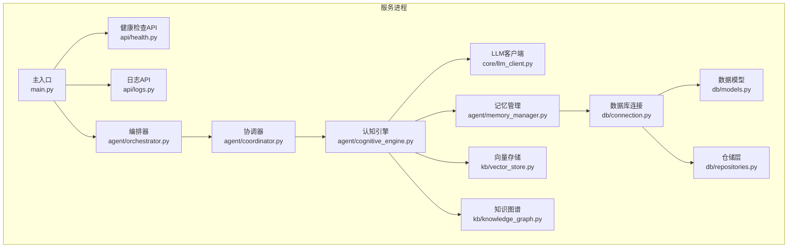
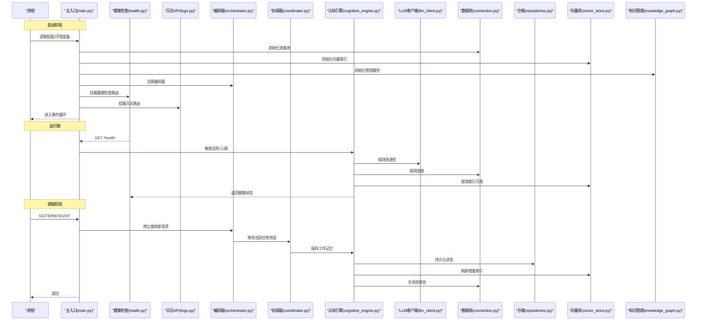
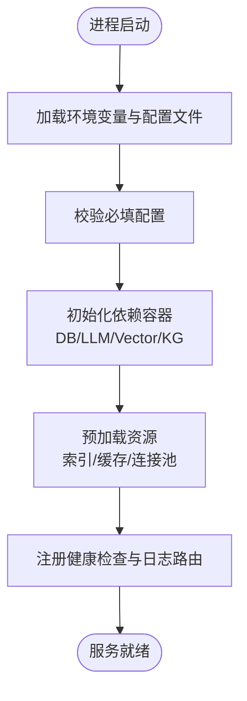
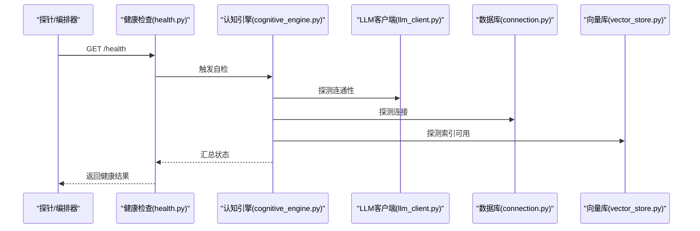
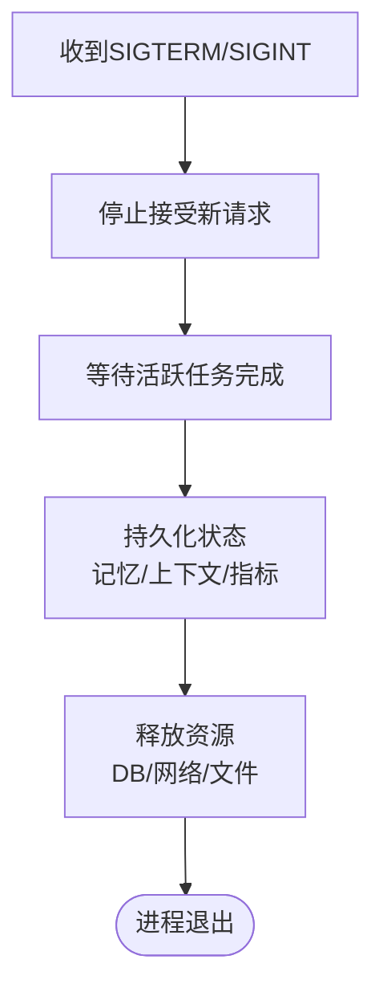
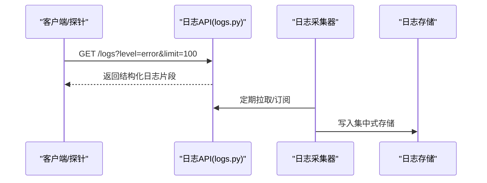
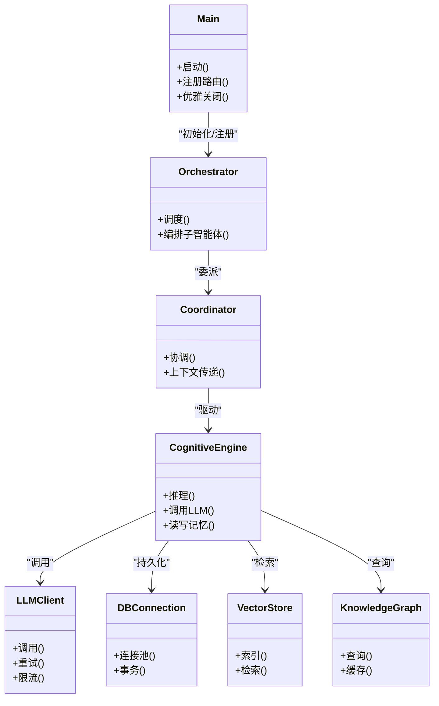

# 智能体生命周期管理

<cite>
**本文引用的文件**   
- [src/loopse/main.py](file://src/loopse/main.py)
- [src/loopse/api/health.py](file://src/loopse/api/health.py)
- [src/loopse/api/logs.py](file://src/loopse/api/logs.py)
- [src/loopse/core/llm_client.py](file://src/loopse/core/llm_client.py)
- [src/loopse/db/connection.py](file://src/loopse/db/connection.py)
- [src/loopse/db/models.py](file://src/loopse/db/models.py)
- [src/loopse/db/repositories.py](file://src/loopse/db/repositories.py)
- [src/loopse/agent/orchestrator.py](file://src/loopse/agent/orchestrator.py)
- [src/loopse/agent/coordinator.py](file://src/loopse/agent/coordinator.py)
- [src/loopse/agent/cognitive_engine.py](file://src/loopse/agent/cognitive_engine.py)
- [src/loopse/agent/memory_manager.py](file://src/loopse/agent/memory_manager.py)
- [src/loopse/kb/vector_store.py](file://src/loopse/kb/vector_store.py)
- [src/loopse/kb/knowledge_graph.py](file://src/loopse/kb/knowledge_graph.py)
- [pyproject.toml](file://pyproject.toml)
- [requirements.txt](file://requirements.txt)
- [start.sh](file://start.sh)
</cite>

## 目录
1. [简介](#简介)
2. [项目结构](#项目结构)
3. [核心组件](#核心组件)
4. [架构总览](#架构总览)
5. [详细组件分析](#详细组件分析)
6. [依赖关系分析](#依赖关系分析)
7. [性能考量](#性能考量)
8. [故障排查指南](#故障排查指南)
9. [结论](#结论)
10. [附录](#附录)

## 简介
本技术文档聚焦于“智能体生命周期管理”，覆盖从启动、运行期到销毁的全流程，包括：
- 启动流程：初始化配置、依赖注入与资源预加载
- 运行期管理：健康检查、心跳机制与自动重启策略
- 销毁流程：优雅关闭、资源释放与状态持久化
- 负载均衡策略：动态扩缩容、流量分配与容量规划
- 监控告警、日志收集规范与调试工具使用指南

目标读者既包括后端工程师，也包括运维与产品侧同学。

## 项目结构
本项目采用分层与按领域组织相结合的结构：
- src/loopse：后端服务主体，包含 API、Agent 编排、核心能力（LLM 客户端）、数据库访问、知识库等
- agents：智能体定义与扩展点（当前为空目录）
- config：提示词模板与系统配置
- frontend：前端应用
- scripts：数据准备与运维脚本
- tests：单元测试与集成测试

图表来源
- [src/loopse/main.py](file://src/loopse/main.py)
- [src/loopse/api/health.py](file://src/loopse/api/health.py)
- [src/loopse/api/logs.py](file://src/loopse/api/logs.py)
- [src/loopse/agent/orchestrator.py](file://src/loopse/agent/orchestrator.py)
- [src/loopse/agent/coordinator.py](file://src/loopse/agent/coordinator.py)
- [src/loopse/agent/cognitive_engine.py](file://src/loopse/agent/cognitive_engine.py)
- [src/loopse/agent/memory_manager.py](file://src/loopse/agent/memory_manager.py)
- [src/loopse/core/llm_client.py](file://src/loopse/core/llm_client.py)
- [src/loopse/db/connection.py](file://src/loopse/db/connection.py)
- [src/loopse/db/models.py](file://src/loopse/db/models.py)
- [src/loopse/db/repositories.py](file://src/loopse/db/repositories.py)
- [src/loopse/kb/vector_store.py](file://src/loopse/kb/vector_store.py)
- [src/loopse/kb/knowledge_graph.py](file://src/loopse/kb/knowledge_graph.py)

章节来源
- [src/loopse/main.py](file://src/loopse/main.py)
- [src/loopse/api/health.py](file://src/loopse/api/health.py)
- [src/loopse/api/logs.py](file://src/loopse/api/logs.py)
- [src/loopse/core/llm_client.py](file://src/loopse/core/llm_client.py)
- [src/loopse/db/connection.py](file://src/loopse/db/connection.py)
- [src/loopse/db/models.py](file://src/loopse/db/models.py)
- [src/loopse/db/repositories.py](file://src/loopse/db/repositories.py)
- [src/loopse/agent/orchestrator.py](file://src/loopse/agent/orchestrator.py)
- [src/loopse/agent/coordinator.py](file://src/loopse/agent/coordinator.py)
- [src/loopse/agent/cognitive_engine.py](file://src/loopse/agent/cognitive_engine.py)
- [src/loopse/agent/memory_manager.py](file://src/loopse/agent/memory_manager.py)
- [src/loopse/kb/vector_store.py](file://src/loopse/kb/vector_store.py)
- [src/loopse/kb/knowledge_graph.py](file://src/loopse/kb/knowledge_graph.py)

## 核心组件
- 主入口与进程管理：负责解析配置、创建并注册中间件与路由、启动事件循环、处理信号以实现优雅关闭
- 健康检查与日志接口：提供 /health 与日志拉取端点，支撑外部探针与可观测性
- Agent 编排层：orchestrator 与 coordinator 负责任务调度、子智能体协作与上下文传递
- 认知引擎：cognitive_engine 作为推理中枢，调用 LLM 客户端、检索与生成模块，维护短期工作记忆
- 记忆管理：memory_manager 负责会话级与长期记忆的读写、压缩与清理
- 外部依赖：
  - LLM 客户端：封装大模型调用、重试与限流
  - 数据库：连接池、模型映射与仓储抽象
  - 知识库：向量检索与知识图谱查询

章节来源
- [src/loopse/main.py](file://src/loopse/main.py)
- [src/loopse/api/health.py](file://src/loopse/api/health.py)
- [src/loopse/api/logs.py](file://src/loopse/api/logs.py)
- [src/loopse/agent/orchestrator.py](file://src/loopse/agent/orchestrator.py)
- [src/loopse/agent/coordinator.py](file://src/loopse/agent/coordinator.py)
- [src/loopse/agent/cognitive_engine.py](file://src/loopse/agent/cognitive_engine.py)
- [src/loopse/agent/memory_manager.py](file://src/loopse/agent/memory_manager.py)
- [src/loopse/core/llm_client.py](file://src/loopse/core/llm_client.py)
- [src/loopse/db/connection.py](file://src/loopse/db/connection.py)
- [src/loopse/db/models.py](file://src/loopse/db/models.py)
- [src/loopse/db/repositories.py](file://src/loopse/db/repositories.py)
- [src/loopse/kb/vector_store.py](file://src/loopse/kb/vector_store.py)
- [src/loopse/kb/knowledge_graph.py](file://src/loopse/kb/knowledge_graph.py)

## 架构总览
下图展示生命周期关键阶段在代码中的落点与交互关系。

图表来源
- [src/loopse/main.py](file://src/loopse/main.py)
- [src/loopse/api/health.py](file://src/loopse/api/health.py)
- [src/loopse/api/logs.py](file://src/loopse/api/logs.py)
- [src/loopse/agent/orchestrator.py](file://src/loopse/agent/orchestrator.py)
- [src/loopse/agent/coordinator.py](file://src/loopse/agent/coordinator.py)
- [src/loopse/agent/cognitive_engine.py](file://src/loopse/agent/cognitive_engine.py)
- [src/loopse/core/llm_client.py](file://src/loopse/core/llm_client.py)
- [src/loopse/db/connection.py](file://src/loopse/db/connection.py)
- [src/loopse/db/repositories.py](file://src/loopse/db/repositories.py)
- [src/loopse/kb/vector_store.py](file://src/loopse/kb/vector_store.py)
- [src/loopse/kb/knowledge_graph.py](file://src/loopse/kb/knowledge_graph.py)

## 详细组件分析

### 启动流程：初始化配置、依赖注入与资源预加载
- 配置与环境
  - 通过环境变量与配置文件加载运行时参数（如端口、并发、超时、特征开关）
  - 校验必填项并提供默认值，记录关键配置摘要用于排障
- 依赖注入
  - 构建共享容器：数据库连接池、向量库实例、LLM 客户端、缓存与会话工厂
  - 将依赖以单例或作用域对象形式注入至各模块
- 资源预加载
  - 预热向量索引与知识图谱缓存，减少冷启动延迟
  - 建立数据库连接池最小连接数，确保首请求低延迟
  - 注册健康检查与日志路由，暴露可观测性接口

图表来源
- [src/loopse/main.py](file://src/loopse/main.py)
- [src/loopse/db/connection.py](file://src/loopse/db/connection.py)
- [src/loopse/kb/vector_store.py](file://src/loopse/kb/vector_store.py)
- [src/loopse/kb/knowledge_graph.py](file://src/loopse/kb/knowledge_graph.py)
- [src/loopse/core/llm_client.py](file://src/loopse/core/llm_client.py)

章节来源
- [src/loopse/main.py](file://src/loopse/main.py)
- [src/loopse/db/connection.py](file://src/loopse/db/connection.py)
- [src/loopse/kb/vector_store.py](file://src/loopse/kb/vector_store.py)
- [src/loopse/kb/knowledge_graph.py](file://src/loopse/kb/knowledge_graph.py)
- [src/loopse/core/llm_client.py](file://src/loopse/core/llm_client.py)

### 运行期管理：健康检查、心跳机制与自动重启策略
- 健康检查
  - 提供 /health 端点，聚合子系统状态（LLM 连通性、数据库连接、向量索引可用性）
  - 支持分级健康状态（例如：未就绪、部分降级、完全健康）
- 心跳机制
  - 内部定时任务周期性上报心跳与指标（CPU/内存、队列长度、错误率）
  - 对外暴露心跳接口供编排器或网关探测存活
- 自动重启策略
  - 结合进程管理器（如 systemd/supervisor）实现崩溃自愈
  - 基于健康检查失败阈值触发重启；避免频繁抖动需引入退避与冷却时间

图表来源
- [src/loopse/api/health.py](file://src/loopse/api/health.py)
- [src/loopse/agent/cognitive_engine.py](file://src/loopse/agent/cognitive_engine.py)
- [src/loopse/core/llm_client.py](file://src/loopse/core/llm_client.py)
- [src/loopse/db/connection.py](file://src/loopse/db/connection.py)
- [src/loopse/kb/vector_store.py](file://src/loopse/kb/vector_store.py)

章节来源
- [src/loopse/api/health.py](file://src/loopse/api/health.py)
- [src/loopse/agent/cognitive_engine.py](file://src/loopse/agent/cognitive_engine.py)
- [src/loopse/core/llm_client.py](file://src/loopse/core/llm_client.py)
- [src/loopse/db/connection.py](file://src/loopse/db/connection.py)
- [src/loopse/kb/vector_store.py](file://src/loopse/kb/vector_store.py)

### 销毁流程：优雅关闭、资源释放与状态持久化
- 优雅关闭
  - 捕获 SIGTERM/SIGINT，停止接受新请求，标记为 draining
  - 等待活跃任务完成或设置最大等待时限后强制终止
- 资源释放
  - 关闭数据库连接池、释放网络句柄、清理临时文件
  - 刷新向量库增量写入，保证一致性
- 状态持久化
  - 将工作记忆、会话上下文与关键指标持久化到数据库
  - 记录关闭原因与耗时，便于事后审计

图表来源
- [src/loopse/main.py](file://src/loopse/main.py)
- [src/loopse/agent/memory_manager.py](file://src/loopse/agent/memory_manager.py)
- [src/loopse/db/connection.py](file://src/loopse/db/connection.py)
- [src/loopse/kb/vector_store.py](file://src/loopse/kb/vector_store.py)

章节来源
- [src/loopse/main.py](file://src/loopse/main.py)
- [src/loopse/agent/memory_manager.py](file://src/loopse/agent/memory_manager.py)
- [src/loopse/db/connection.py](file://src/loopse/db/connection.py)
- [src/loopse/kb/vector_store.py](file://src/loopse/kb/vector_store.py)

### 负载均衡策略：动态扩缩容、流量分配与容量规划
- 动态扩缩容
  - 基于健康检查与 CPU/内存/队列深度等指标进行水平扩容
  - 使用无状态设计原则，将会话状态外置到数据库或缓存
- 流量分配
  - 网关层基于权重或最少连接算法分发请求
  - 对长时任务采用异步队列+回调模式，避免阻塞
- 容量规划
  - 根据峰值 QPS、平均响应时间与错误预算设定副本数
  - 预留缓冲容量应对突发流量与模型服务抖动

[本节为概念性说明，不直接分析具体文件]

### 监控告警、日志收集与调试工具
- 监控告警
  - 指标：健康状态、QPS、P95/P99 延迟、错误率、LLM 调用成功率、数据库连接池使用率、向量索引大小
  - 告警规则：健康失败、错误率超阈、延迟飙升、资源耗尽
- 日志收集
  - 结构化 JSON 日志，统一字段：trace_id、level、component、message、duration_ms、tags
  - 建议接入集中式日志系统（如 ELK/Loki），并按组件与级别分流
- 调试工具
  - 提供 /logs 接口拉取最近日志片段，辅助快速定位问题
  - 开启慢请求追踪与堆栈采样，配合分布式追踪 ID 串联链路

图表来源
- [src/loopse/api/logs.py](file://src/loopse/api/logs.py)

章节来源
- [src/loopse/api/logs.py](file://src/loopse/api/logs.py)

## 依赖关系分析
- 组件耦合
  - main 作为装配中心，低内聚地组合各子系统
  - orchestrator 与 coordinator 解耦业务编排与执行细节
  - cognitive_engine 仅依赖抽象的 LLM 客户端与存储接口，便于替换实现
- 外部依赖
  - 数据库：连接池与事务边界由 connection 统一管理
  - 向量库：索引热更新与只读路径分离
  - LLM 客户端：重试、熔断与限流策略集中配置

图表来源
- [src/loopse/main.py](file://src/loopse/main.py)
- [src/loopse/agent/orchestrator.py](file://src/loopse/agent/orchestrator.py)
- [src/loopse/agent/coordinator.py](file://src/loopse/agent/coordinator.py)
- [src/loopse/agent/cognitive_engine.py](file://src/loopse/agent/cognitive_engine.py)
- [src/loopse/core/llm_client.py](file://src/loopse/core/llm_client.py)
- [src/loopse/db/connection.py](file://src/loopse/db/connection.py)
- [src/loopse/kb/vector_store.py](file://src/loopse/kb/vector_store.py)
- [src/loopse/kb/knowledge_graph.py](file://src/loopse/kb/knowledge_graph.py)

章节来源
- [src/loopse/main.py](file://src/loopse/main.py)
- [src/loopse/agent/orchestrator.py](file://src/loopse/agent/orchestrator.py)
- [src/loopse/agent/coordinator.py](file://src/loopse/agent/coordinator.py)
- [src/loopse/agent/cognitive_engine.py](file://src/loopse/agent/cognitive_engine.py)
- [src/loopse/core/llm_client.py](file://src/loopse/core/llm_client.py)
- [src/loopse/db/connection.py](file://src/loopse/db/connection.py)
- [src/loopse/kb/vector_store.py](file://src/loopse/kb/vector_store.py)
- [src/loopse/kb/knowledge_graph.py](file://src/loopse/kb/knowledge_graph.py)

## 性能考量
- 启动优化
  - 并行初始化非关键依赖，关键路径串行以保证正确性
  - 预加载热点数据，降低首次请求延迟
- 运行期优化
  - 连接池复用与批量写入，减少 I/O 次数
  - 向量检索使用近似最近邻与分页限制，控制响应时间
  - LLM 调用增加超时与重试上限，避免雪崩
- 销毁优化
  - 持久化采用异步落盘与合并策略，缩短关闭窗口
  - 资源释放顺序遵循“先业务后基础设施”的原则

[本节为通用指导，不直接分析具体文件]

## 故障排查指南
- 常见问题
  - 健康检查失败：检查 LLM 连通性、数据库连接池、向量索引是否可用
  - 启动缓慢：确认预加载资源是否过大，必要时分阶段预热
  - 优雅关闭卡住：排查长时间运行的任务与锁竞争
- 定位手段
  - 使用 /logs 拉取最近错误日志，结合 trace_id 追踪链路
  - 查看健康检查聚合状态，快速缩小范围
  - 核对进程管理器日志，确认是否因 OOM/CPU 高导致重启

章节来源
- [src/loopse/api/health.py](file://src/loopse/api/health.py)
- [src/loopse/api/logs.py](file://src/loopse/api/logs.py)

## 结论
通过将生命周期管理拆分为“启动—运行—销毁”三阶段，并在代码中明确职责边界与依赖注入，系统实现了可观测、可恢复与可扩展的智能体运行环境。配合健康检查、心跳与自动重启策略，以及完善的日志与调试工具，可在复杂生产环境中保持稳定与高效。

[本节为总结性内容，不直接分析具体文件]

## 附录
- 部署与启动
  - 使用 start.sh 启动服务，或通过进程管理器托管
  - 参考 pyproject.toml 与 requirements.txt 安装依赖
- 配置清单
  - 端口、并发、超时、重试、限流、健康检查间隔、日志级别等

章节来源
- [start.sh](file://start.sh)
- [pyproject.toml](file://pyproject.toml)
- [requirements.txt](file://requirements.txt)