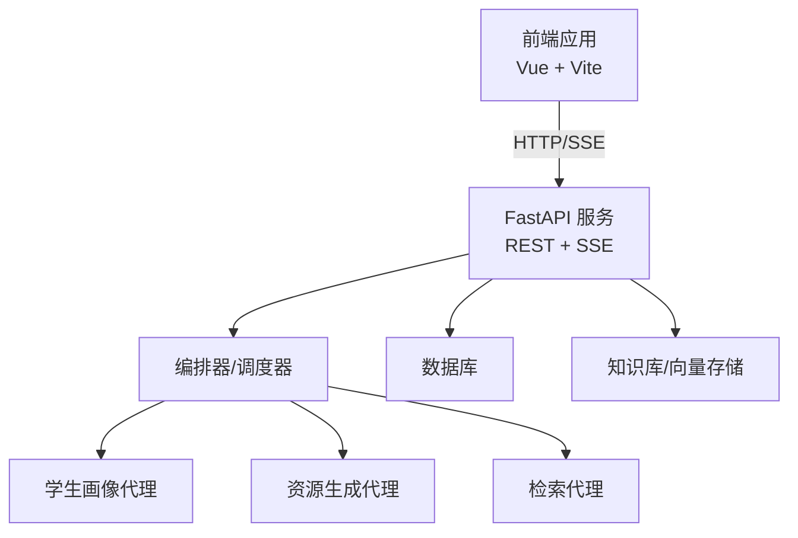
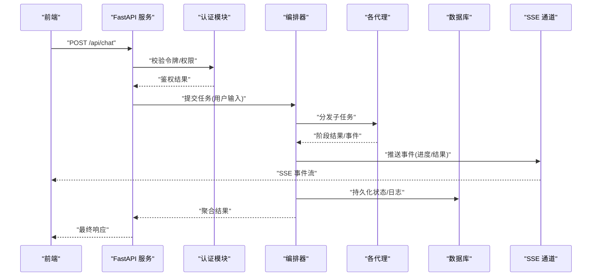
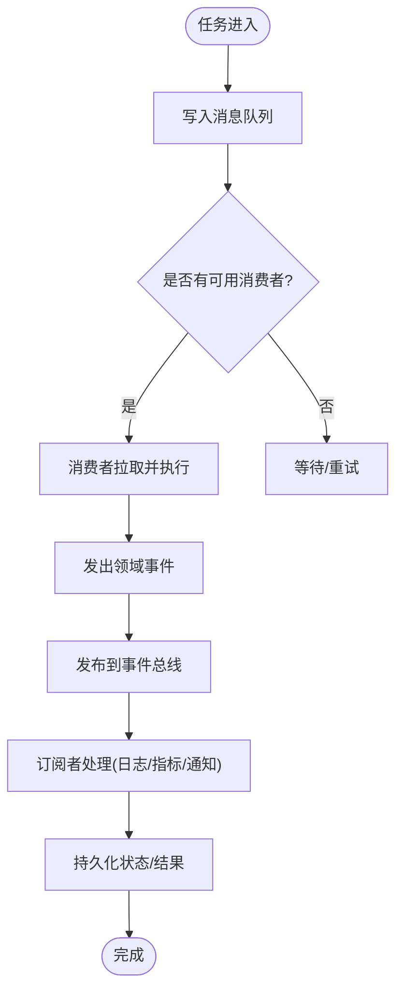
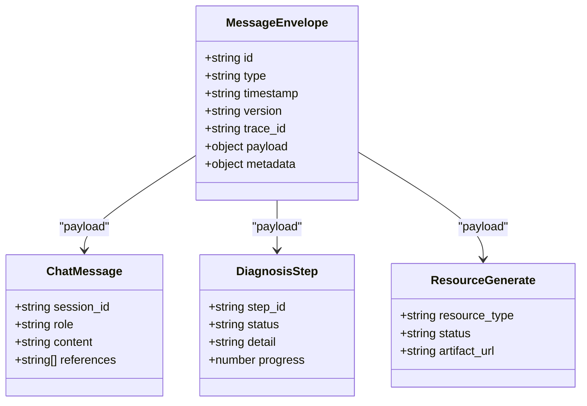
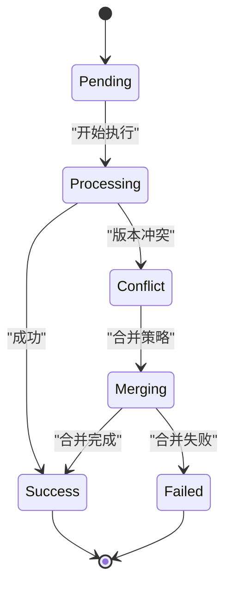
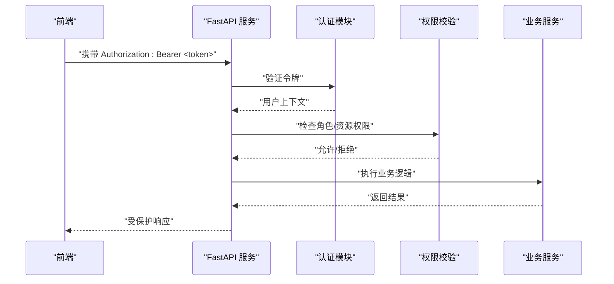
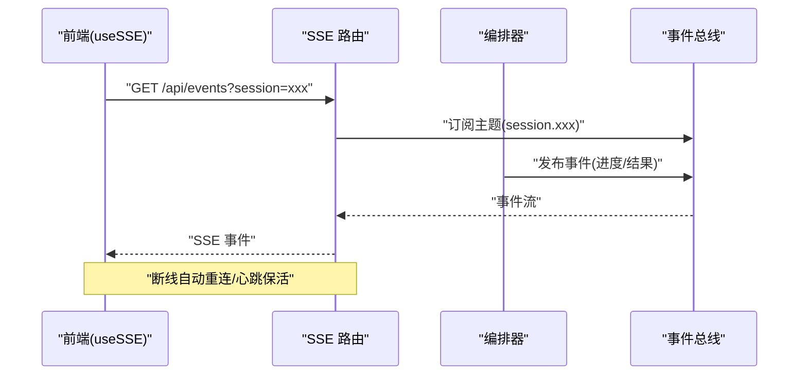
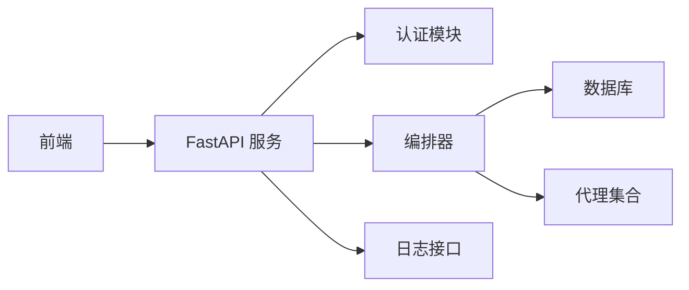

# 智能体通信协议

<cite>
**本文引用的文件**   
- [src/loopse/main.py](file://src/loopse/main.py)
- [src/loopse/api/chat.py](file://src/loopse/api/chat.py)
- [src/loopse/api/auth.py](file://src/loopse/api/auth.py)
- [src/loopse/api/logs.py](file://src/loopse/api/logs.py)
- [src/loopse/api/knowledge_base.py](file://src/loopse/api/knowledge_base.py)
- [src/loopse/core/trust_mechanism.py](file://src/loopse/core/trust_mechanism.py)
- [src/loopse/db/connection.py](file://src/loopse/db/connection.py)
- [src/loopse/db/models.py](file://src/loopse/db/models.py)
- [config/api_schema.yaml](file://config/api_schema.yaml)
- [docs/architecture/API契约_final.yaml](file://docs/architecture/API契约_final.yaml)
- [docs/architecture/Agent通信State设计.md](file://docs/architecture/Agent通信State设计.md)
- [frontend/src/composables/useSSE.ts](file://frontend/src/composables/useSSE.ts)
- [frontend/src/types/sse.ts](file://frontend/src/types/sse.ts)
- [frontend/src/api/client.ts](file://frontend/src/api/client.ts)
</cite>

## 目录
1. [简介](#简介)
2. [项目结构](#项目结构)
3. [核心组件](#核心组件)
4. [架构总览](#架构总览)
5. [详细组件分析](#详细组件分析)
6. [依赖关系分析](#依赖关系分析)
7. [性能考虑](#性能考虑)
8. [故障排查指南](#故障排查指南)
9. [结论](#结论)
10. [附录](#附录)

## 简介
本技术文档围绕“智能体通信协议”展开，聚焦以下目标：
- 消息传递机制：异步消息队列、事件驱动架构与发布订阅模式
- 通信协议规范：消息格式定义、序列化方案与版本兼容策略
- 状态同步机制：分布式一致性、冲突解决与最终一致性保证
- 安全通信措施：身份认证、权限控制与数据加密传输
- 中间件配置、性能调优与故障排查

为便于读者理解，文档从系统架构到代码级实现逐层展开，并辅以图示说明。

## 项目结构
本项目采用前后端分离的架构：前端通过 HTTP/SSE 与后端交互；后端以 FastAPI 提供 REST API 与 SSE 流式接口，内部由编排器协调多个 Agent 完成复杂任务。关键目录与职责如下：
- src/loopse/api：HTTP 路由与请求处理（聊天、日志、知识库等）
- src/loopse/core：核心能力（LLM 客户端、信任机制）
- src/loopse/db：数据库连接与模型定义
- config：API 契约与提示词模板
- frontend：Web 前端，包含 SSE 客户端封装与类型定义

[此图为概念性架构图，不直接映射具体源码文件]

## 核心组件
- 编排器与代理协作：编排器负责将用户意图拆解为子任务，分发给不同代理执行，并将结果聚合返回。
- 事件驱动与 SSE：服务端通过 SSE 推送实时事件（如进度、诊断步骤、资源生成状态），前端使用专用 composable 管理连接与重连。
- 认证与授权：基于 JWT 的身份认证与权限校验，保护敏感接口。
- 数据持久化：通过数据库连接与模型定义，持久化会话、日志与结构化状态。

章节来源
- [src/loopse/main.py](file://src/loopse/main.py)
- [src/loopse/api/chat.py](file://src/loopse/api/chat.py)
- [src/loopse/api/auth.py](file://src/loopse/api/auth.py)
- [src/loopse/api/logs.py](file://src/loopse/api/logs.py)
- [src/loopse/api/knowledge_base.py](file://src/loopse/api/knowledge_base.py)
- [src/loopse/core/trust_mechanism.py](file://src/loopse/core/trust_mechanism.py)
- [src/loopse/db/connection.py](file://src/loopse/db/connection.py)
- [src/loopse/db/models.py](file://src/loopse/db/models.py)
- [frontend/src/composables/useSSE.ts](file://frontend/src/composables/useSSE.ts)
- [frontend/src/types/sse.ts](file://frontend/src/types/sse.ts)
- [frontend/src/api/client.ts](file://frontend/src/api/client.ts)

## 架构总览
下图展示了端到端的通信流程：前端发起请求，后端进行鉴权与路由，编排器协调代理执行，并通过 SSE 向前端推送事件与结果。

图表来源
- [src/loopse/api/chat.py](file://src/loopse/api/chat.py)
- [src/loopse/api/auth.py](file://src/loopse/api/auth.py)
- [src/loopse/api/logs.py](file://src/loopse/api/logs.py)
- [src/loopse/db/connection.py](file://src/loopse/db/connection.py)
- [frontend/src/composables/useSSE.ts](file://frontend/src/composables/useSSE.ts)

章节来源
- [src/loopse/main.py](file://src/loopse/main.py)
- [src/loopse/api/chat.py](file://src/loopse/api/chat.py)
- [src/loopse/api/auth.py](file://src/loopse/api/auth.py)
- [src/loopse/api/logs.py](file://src/loopse/api/logs.py)
- [src/loopse/db/connection.py](file://src/loopse/db/connection.py)
- [frontend/src/composables/useSSE.ts](file://frontend/src/composables/useSSE.ts)

## 详细组件分析

### 消息传递机制：异步队列、事件驱动与发布订阅
- 异步消息队列
  - 建议采用轻量消息队列（如 Redis Streams 或 RabbitMQ）承载高吞吐任务，例如资源批量生成、离线索引构建。
  - 生产者（编排器/任务入口）将任务写入队列，消费者（工作进程）拉取并执行，完成后回写结果与事件。
- 事件驱动架构
  - 以领域事件为中心，事件包含事件类型、时间戳、关联 ID、负载与版本信息。
  - 事件总线解耦生产与消费，支持多订阅者（日志、审计、指标采集）。
- 发布订阅模式
  - 主题命名空间按业务域划分（如 chat.diagnosis.progress、resource.generate.status）。
  - 订阅者可按前缀匹配订阅，避免广播风暴。

[此图为概念性流程图，不直接映射具体源码文件]

章节来源
- [src/loopse/api/chat.py](file://src/loopse/api/chat.py)
- [src/loopse/api/logs.py](file://src/loopse/api/logs.py)
- [src/loopse/db/connection.py](file://src/loopse/db/connection.py)

### 通信协议规范：消息格式、序列化与版本兼容
- 消息格式定义
  - 统一信封结构：header（id、type、timestamp、version、trace_id）、payload（业务负载）、metadata（扩展字段）。
  - 事件类型枚举：chat.message、diagnosis.step、resource.generate、profile.update 等。
- 序列化方案
  - 推荐 JSON Schema 约束 payload 结构，确保跨语言一致性与可演进性。
  - 对大对象采用压缩或分片传输，结合 SSE 的文本块边界。
- 版本兼容策略
  - header.version 标识消息版本，服务端根据版本选择解析器。
  - 向后兼容：新增字段默认值，删除字段标记 deprecated。
  - 灰度升级：双写新旧版本，逐步切换流量。

图表来源
- [config/api_schema.yaml](file://config/api_schema.yaml)
- [docs/architecture/API契约_final.yaml](file://docs/architecture/API契约_final.yaml)

章节来源
- [config/api_schema.yaml](file://config/api_schema.yaml)
- [docs/architecture/API契约_final.yaml](file://docs/architecture/API契约_final.yaml)

### 状态同步机制：一致性、冲突解决与最终一致性
- 分布式一致性
  - 采用乐观锁与版本号字段，更新时比较版本，失败则重试或合并。
  - 对于强一致场景（如会话元数据），使用事务与行级锁。
- 冲突解决
  - 基于 LWW（Last Write Wins）策略，结合时间戳与因果序（vector clock）减少冲突。
  - 对不可逆操作引入幂等键（idempotency key），防止重复提交。
- 最终一致性保证
  - 通过事件溯源与补偿事件，在异常路径上恢复状态。
  - 定期快照与增量回放，保障可观测性与可恢复性。

[此图为概念性状态图，不直接映射具体源码文件]

章节来源
- [src/loopse/db/models.py](file://src/loopse/db/models.py)
- [src/loopse/db/connection.py](file://src/loopse/db/connection.py)

### 安全通信措施：认证、权限与加密
- 身份认证
  - 使用 JWT 作为访问令牌，服务端校验签名与过期时间。
  - 刷新令牌机制，降低频繁登录成本。
- 权限控制
  - 基于角色的访问控制（RBAC），在路由层校验角色与资源权限。
  - 细粒度权限：会话级、资源级、操作级。
- 数据加密传输
  - 全链路 HTTPS，强制 TLS 1.2+。
  - 敏感字段在落盘前加密，密钥由 KMS 管理。

图表来源
- [src/loopse/api/auth.py](file://src/loopse/api/auth.py)
- [src/loopse/core/trust_mechanism.py](file://src/loopse/core/trust_mechanism.py)

章节来源
- [src/loopse/api/auth.py](file://src/loopse/api/auth.py)
- [src/loopse/core/trust_mechanism.py](file://src/loopse/core/trust_mechanism.py)

### 实时通信：SSE 事件流与前端集成
- 服务端 SSE
  - 路由暴露 /api/events 或特定资源事件流，持续推送结构化事件。
  - 事件包含类型、时间戳、关联 ID 与负载，支持断线重连与心跳。
- 前端 SSE 客户端
  - 使用 useSSE composable 管理连接、重连与错误处理。
  - 类型定义 sse.ts 约束事件结构，提升开发体验与稳定性。

图表来源
- [src/loopse/api/chat.py](file://src/loopse/api/chat.py)
- [frontend/src/composables/useSSE.ts](file://frontend/src/composables/useSSE.ts)
- [frontend/src/types/sse.ts](file://frontend/src/types/sse.ts)

章节来源
- [src/loopse/api/chat.py](file://src/loopse/api/chat.py)
- [frontend/src/composables/useSSE.ts](file://frontend/src/composables/useSSE.ts)
- [frontend/src/types/sse.ts](file://frontend/src/types/sse.ts)

### 日志与可观测性
- 结构化日志
  - 所有关键事件记录 trace_id、user_id、session_id，便于追踪。
- 日志查询
  - 提供 /api/logs 接口，支持按时间范围、级别、关键字过滤。
- 指标与告警
  - 收集延迟、吞吐、错误率，设置阈值告警。

章节来源
- [src/loopse/api/logs.py](file://src/loopse/api/logs.py)

## 依赖关系分析
- 外部依赖
  - FastAPI：HTTP 与 SSE 服务框架
  - 数据库：持久化会话、日志与结构化状态
  - 消息队列/事件总线：异步任务与事件分发（可选，建议引入）
- 内部依赖
  - API 层依赖认证与编排器
  - 编排器依赖各代理与数据库
  - 前端依赖 SSE 客户端与类型定义

图表来源
- [src/loopse/main.py](file://src/loopse/main.py)
- [src/loopse/api/auth.py](file://src/loopse/api/auth.py)
- [src/loopse/api/chat.py](file://src/loopse/api/chat.py)
- [src/loopse/api/logs.py](file://src/loopse/api/logs.py)
- [src/loopse/db/connection.py](file://src/loopse/db/connection.py)

章节来源
- [src/loopse/main.py](file://src/loopse/main.py)
- [src/loopse/api/auth.py](file://src/loopse/api/auth.py)
- [src/loopse/api/chat.py](file://src/loopse/api/chat.py)
- [src/loopse/api/logs.py](file://src/loopse/api/logs.py)
- [src/loopse/db/connection.py](file://src/loopse/db/connection.py)

## 性能考虑
- 连接与并发
  - 合理设置 Uvicorn workers 与线程池，避免阻塞 I/O。
  - SSE 长连接需限制单会话事件速率，防止雪崩。
- 缓存与去重
  - 热点数据入缓存（Redis），减少数据库压力。
  - 幂等键去重，避免重复计算。
- 批处理与背压
  - 批量写入数据库与消息队列，降低开销。
  - 背压控制：当消费者慢于生产者时，限流与降级。
- 监控与容量规划
  - 建立 QPS、P99 延迟、错误率看板，动态扩缩容。

[本节为通用指导，不直接分析具体文件]

## 故障排查指南
- 常见问题
  - SSE 断连：检查网络、反向代理超时、心跳间隔。
  - 鉴权失败：核对 JWT 签名、过期时间与权限策略。
  - 状态不一致：查看版本冲突日志，确认合并策略是否生效。
- 定位手段
  - 使用 trace_id 串联请求链路。
  - 通过 /api/logs 过滤错误级别与关键字。
  - 开启调试日志，关注编排器与代理的执行轨迹。
- 恢复策略
  - 事件回放：基于事件日志重放，恢复状态。
  - 幂等重试：对失败任务带幂等键重试。
  - 熔断降级：对下游不稳定服务快速失败，保护整体可用性。

章节来源
- [src/loopse/api/logs.py](file://src/loopse/api/logs.py)
- [src/loopse/api/auth.py](file://src/loopse/api/auth.py)
- [src/loopse/db/models.py](file://src/loopse/db/models.py)

## 结论
本通信协议以事件驱动为核心，结合发布订阅与异步队列，实现高内聚、低耦合的智能体协作。通过统一的信封结构与版本兼容策略，保障协议的演进与互操作性。配合 JWT 认证、RBAC 权限与 HTTPS 加密，形成完整的安全体系。借助 SSE 实时推送与完善的日志可观测性，系统在可扩展性与可维护性方面具备良好基础。后续建议引入标准化消息队列与事件总线，进一步完善最终一致性与容错能力。

## 附录
- 术语表
  - 编排器：负责任务拆分、调度与结果聚合的核心组件
  - SSE：Server-Sent Events，服务端向客户端单向推送事件的技术
  - 幂等键：用于去重的唯一标识，确保重复提交不会产生副作用
- 参考契约
  - API 契约与数据结构定义参见配置文件与文档

章节来源
- [config/api_schema.yaml](file://config/api_schema.yaml)
- [docs/architecture/API契约_final.yaml](file://docs/architecture/API契约_final.yaml)