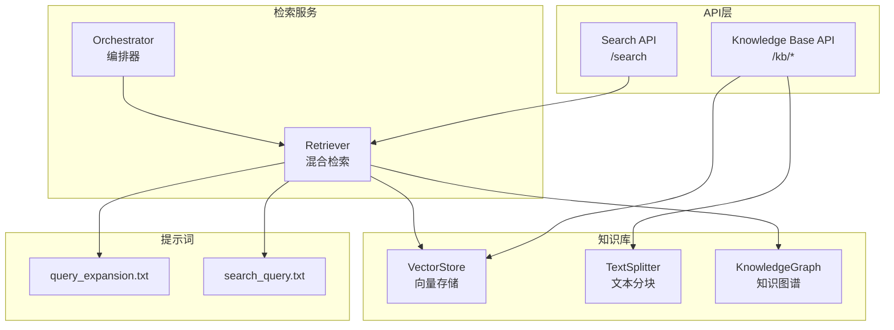
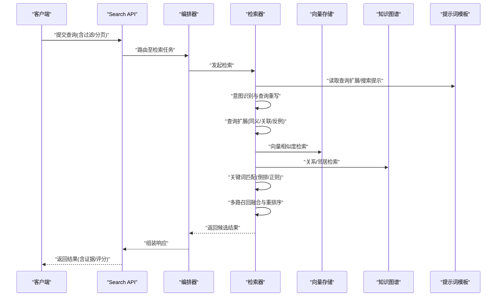
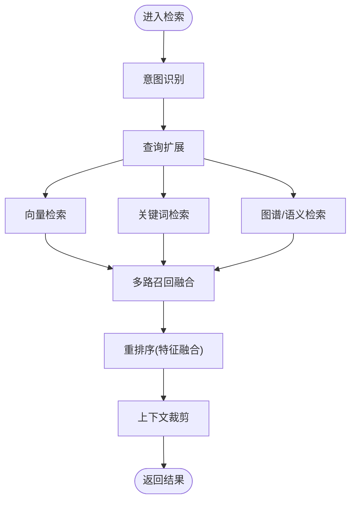
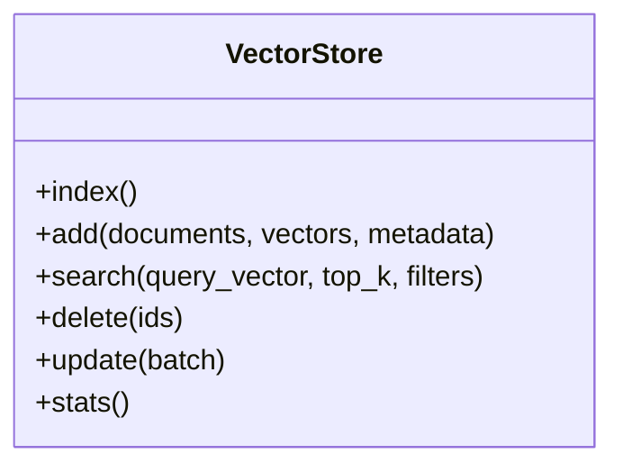
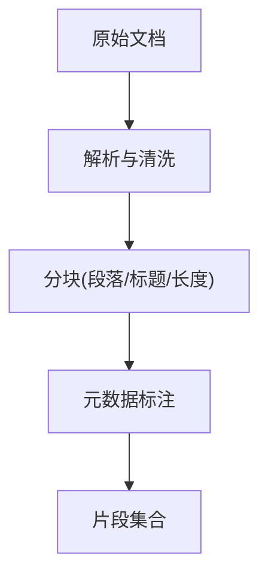
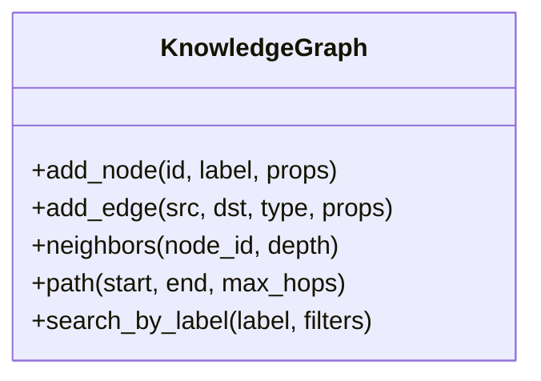
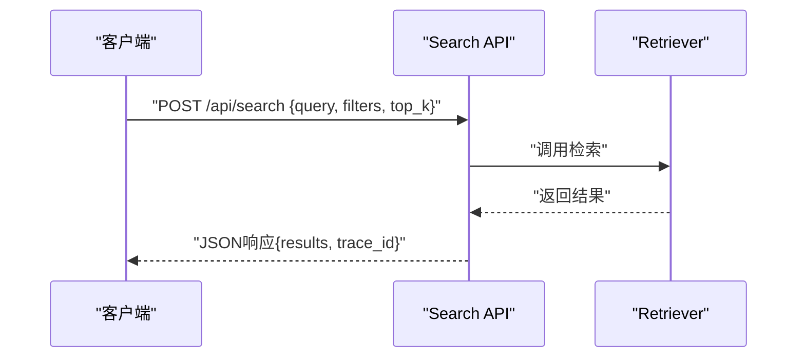
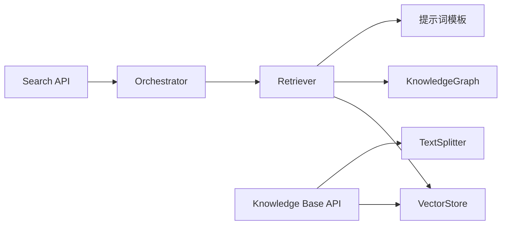

# 知识检索智能体

<cite>
**本文引用的文件**   
- [retriever.py](file://src/loopse/agent/retriever.py)
- [vector_store.py](file://src/loopse/kb/vector_store.py)
- [text_splitter.py](file://src/loopse/kb/text_splitter.py)
- [knowledge_graph.py](file://src/loopse/kb/knowledge_graph.py)
- [search.py](file://src/loopse/api/search.py)
- [knowledge_base.py](file://src/loopse/api/knowledge_base.py)
- [query_expansion.txt](file://config/prompts/retriever/query_expansion.txt)
- [search_query.txt](file://config/prompts/retriever/search_query.txt)
- [orchestrator.py](file://src/loopse/agent/orchestrator.py)
- [api_schema.yaml](file://config/api_schema.yaml)
</cite>

## 目录
1. [简介](#简介)
2. [项目结构](#项目结构)
3. [核心组件](#核心组件)
4. [架构总览](#架构总览)
5. [详细组件分析](#详细组件分析)
6. [依赖关系分析](#依赖关系分析)
7. [性能考虑](#性能考虑)
8. [故障排查指南](#故障排查指南)
9. [结论](#结论)
10. [附录](#附录)

## 简介
本技术文档围绕“知识检索智能体”的检索能力展开，重点阐述Retriever的混合检索架构（向量相似度搜索、关键词匹配与语义理解）、查询处理流程（意图识别、查询扩展与结果重排序）、知识库索引策略（分块算法、元数据标注与增量更新机制），以及检索质量评估、相关性反馈学习与个性化排序优化。同时提供检索API接口说明、批量查询能力与性能监控指标建议，帮助读者快速理解并高效使用该系统。

## 项目结构
与检索相关的关键代码与配置分布如下：
- 检索Agent与编排：src/loopse/agent/retriever.py、src/loopse/agent/orchestrator.py
- 知识库基础设施：src/loopse/kb/vector_store.py、src/loopse/kb/text_splitter.py、src/loopse/kb/knowledge_graph.py
- 检索API层：src/loopse/api/search.py、src/loopse/api/knowledge_base.py
- 提示词模板：config/prompts/retriever/query_expansion.txt、config/prompts/retriever/search_query.txt
- API契约：config/api_schema.yaml

图表来源
- [retriever.py:1-200](file://src/loopse/agent/retriever.py#L1-L200)
- [vector_store.py:1-200](file://src/loopse/kb/vector_store.py#L1-L200)
- [text_splitter.py:1-200](file://src/loopse/kb/text_splitter.py#L1-L200)
- [knowledge_graph.py:1-200](file://src/loopse/kb/knowledge_graph.py#L1-L200)
- [search.py:1-200](file://src/loopse/api/search.py#L1-L200)
- [knowledge_base.py:1-200](file://src/loopse/api/knowledge_base.py#L1-L200)
- [query_expansion.txt:1-200](file://config/prompts/retriever/query_expansion.txt#L1-L200)
- [search_query.txt:1-200](file://config/prompts/retriever/search_query.txt#L1-L200)

章节来源
- [retriever.py:1-200](file://src/loopse/agent/retriever.py#L1-L200)
- [vector_store.py:1-200](file://src/loopse/kb/vector_store.py#L1-L200)
- [text_splitter.py:1-200](file://src/loopse/kb/text_splitter.py#L1-L200)
- [knowledge_graph.py:1-200](file://src/loopse/kb/knowledge_graph.py#L1-L200)
- [search.py:1-200](file://src/loopse/api/search.py#L1-L200)
- [knowledge_base.py:1-200](file://src/loopse/api/knowledge_base.py#L1-L200)
- [query_expansion.txt:1-200](file://config/prompts/retriever/query_expansion.txt#L1-L200)
- [search_query.txt:1-200](file://config/prompts/retriever/search_query.txt#L1-L200)

## 核心组件
- Retriever（检索器）
  - 职责：统一接收查询，执行混合检索（向量+关键词+语义），进行结果融合与重排序，输出带证据的检索结果。
  - 关键能力：意图识别、查询扩展、多路召回、相关性打分与重排、上下文裁剪。
- VectorStore（向量存储）
  - 职责：维护文档/片段向量索引，支持高维向量相似度检索与过滤条件检索。
  - 关键能力：向量化、索引构建、Top-K检索、元数据过滤、批量写入。
- TextSplitter（文本分块）
  - 职责：将长文档切分为可检索的片段，附带元数据（来源、层级、时间戳等）。
  - 关键能力：按段落/标题/长度自适应分块、重叠窗口、保留上下文。
- KnowledgeGraph（知识图谱）
  - 职责：以图结构组织实体与关系，支撑基于关系的检索与推理路径发现。
  - 关键能力：节点/边检索、邻居扩展、路径查询。
- Search API（检索接口）
  - 职责：对外暴露检索与批量检索接口，封装参数校验、权限控制与响应格式。
  - 关键能力：单条/批量查询、分页、过滤、排序、追踪埋点。
- Orchestrator（编排器）
  - 职责：协调各Agent协作，驱动检索流程与其他业务流（如诊断、生成）联动。
  - 关键能力：任务路由、状态管理、错误恢复。

章节来源
- [retriever.py:1-200](file://src/loopse/agent/retriever.py#L1-L200)
- [vector_store.py:1-200](file://src/loopse/kb/vector_store.py#L1-L200)
- [text_splitter.py:1-200](file://src/loopse/kb/text_splitter.py#L1-L200)
- [knowledge_graph.py:1-200](file://src/loopse/kb/knowledge_graph.py#L1-L200)
- [search.py:1-200](file://src/loopse/api/search.py#L1-L200)
- [orchestrator.py:1-200](file://src/loopse/agent/orchestrator.py#L1-L200)

## 架构总览
下图展示了从用户请求到检索结果返回的整体流程，包括意图识别、查询扩展、混合检索、结果重排序与最终响应。

图表来源
- [search.py:1-200](file://src/loopse/api/search.py#L1-L200)
- [orchestrator.py:1-200](file://src/loopse/agent/orchestrator.py#L1-L200)
- [retriever.py:1-200](file://src/loopse/agent/retriever.py#L1-L200)
- [vector_store.py:1-200](file://src/loopse/kb/vector_store.py#L1-L200)
- [knowledge_graph.py:1-200](file://src/loopse/kb/knowledge_graph.py#L1-L200)
- [query_expansion.txt:1-200](file://config/prompts/retriever/query_expansion.txt#L1-L200)
- [search_query.txt:1-200](file://config/prompts/retriever/search_query.txt#L1-L200)

## 详细组件分析

### Retriever（检索器）
- 设计要点
  - 混合检索：向量相似度、关键词匹配、语义理解（基于提示词与图谱）三路并行或串行组合。
  - 查询处理：意图识别→查询扩展→多路召回→融合重排→上下文裁剪。
  - 可扩展性：通过提示词模板与外部模型/索引插件化接入。
- 关键流程
  - 意图识别：根据输入与上下文推断查询类型（事实问答、对比、步骤指导等），用于选择检索策略与权重。
  - 查询扩展：利用提示词模板生成同义词、上下位概念、相关术语与否定约束，提升召回率。
  - 多路召回：
    - 向量检索：对查询与片段进行向量化，计算相似度Top-K。
    - 关键词检索：基于倒排索引或正则匹配，保证精确命中。
    - 语义/图谱检索：基于实体/关系扩展，增强语义覆盖。
  - 融合与重排：采用加权融合与学习排序（LTR）思想，结合元数据、位置、时效性等特征进行重排。
  - 结果裁剪：按最大上下文长度与证据完整性裁剪，避免信息冗余。
- 异常与容错
  - 降级策略：当某一路检索失败时自动回退到其他路径；超时与限流保护。
  - 日志与追踪：记录每步耗时、召回数量、分数分布，便于定位问题。

图表来源
- [retriever.py:1-200](file://src/loopse/agent/retriever.py#L1-L200)
- [query_expansion.txt:1-200](file://config/prompts/retriever/query_expansion.txt#L1-L200)
- [search_query.txt:1-200](file://config/prompts/retriever/search_query.txt#L1-L200)

章节来源
- [retriever.py:1-200](file://src/loopse/agent/retriever.py#L1-L200)
- [query_expansion.txt:1-200](file://config/prompts/retriever/query_expansion.txt#L1-L200)
- [search_query.txt:1-200](file://config/prompts/retriever/search_query.txt#L1-L200)

### VectorStore（向量存储）
- 设计要点
  - 支持高维向量索引与元数据过滤，提供Top-K相似检索与范围查询。
  - 批量写入与增量更新，保障索引一致性。
- 关键能力
  - 向量化：调用嵌入模型将文本转为向量。
  - 索引构建：建立HNSW/IVF等近似最近邻索引。
  - 检索：相似度阈值、Top-K、元数据过滤、去重与合并。
  - 持久化：落盘快照与增量事务。
- 复杂度与性能
  - 建索引：O(N log N)~O(N^2)取决于算法与维度。
  - 检索：近似O(log N)~O(k log N)，k为Top-K。
  - 内存占用：与向量维度、索引结构与缓存命中率相关。

图表来源
- [vector_store.py:1-200](file://src/loopse/kb/vector_store.py#L1-L200)

章节来源
- [vector_store.py:1-200](file://src/loopse/kb/vector_store.py#L1-L200)

### TextSplitter（文本分块）
- 设计要点
  - 按段落/标题/长度自适应分块，保留上下文重叠，确保跨段语义连贯。
  - 元数据标注：来源、章节、页码、时间戳、作者等。
- 关键能力
  - 分块策略：固定长度、语义边界、层级感知。
  - 重叠窗口：防止边界信息丢失。
  - 元数据注入：便于后续过滤与溯源。
- 适用场景
  - 长文档入库、PDF/Markdown解析后切片、课程资料结构化。

图表来源
- [text_splitter.py:1-200](file://src/loopse/kb/text_splitter.py#L1-L200)

章节来源
- [text_splitter.py:1-200](file://src/loopse/kb/text_splitter.py#L1-L200)

### KnowledgeGraph（知识图谱）
- 设计要点
  - 以节点表示实体/概念，边表示关系，支持邻居扩展与路径查询。
  - 与向量检索互补：在模糊语义下通过关系增强召回。
- 关键能力
  - 节点/边检索、K跳邻居扩展、最短路径/多跳推理。
  - 与Retriever协同：将图谱结果作为语义召回的一路。

图表来源
- [knowledge_graph.py:1-200](file://src/loopse/kb/knowledge_graph.py#L1-L200)

章节来源
- [knowledge_graph.py:1-200](file://src/loopse/kb/knowledge_graph.py#L1-L200)

### Search API（检索接口）
- 设计要点
  - 标准化REST接口，支持单条与批量查询、分页、过滤、排序与追踪。
  - 参数校验、鉴权、限流与审计日志。
- 关键端点
  - 单条检索：POST /api/search
  - 批量检索：POST /api/search/batch
  - 知识库管理：GET/POST/PUT/DELETE /api/kb/*
- 响应结构
  - 包含结果列表、证据片段、评分、来源、分页信息与追踪ID。

图表来源
- [search.py:1-200](file://src/loopse/api/search.py#L1-L200)
- [api_schema.yaml:1-200](file://config/api_schema.yaml#L1-L200)

章节来源
- [search.py:1-200](file://src/loopse/api/search.py#L1-L200)
- [api_schema.yaml:1-200](file://config/api_schema.yaml#L1-L200)

### Orchestrator（编排器）
- 设计要点
  - 负责将检索任务纳入整体工作流，协调其他Agent（如诊断、生成）与资源。
  - 提供重试、熔断与状态同步能力。
- 关键职责
  - 任务路由、上下文传递、错误恢复、指标上报。

章节来源
- [orchestrator.py:1-200](file://src/loopse/agent/orchestrator.py#L1-L200)

## 依赖关系分析
- 组件耦合
  - Retriever依赖VectorStore、KnowledgeGraph与提示词模板；Search API依赖Retriever与Orchestrator。
  - TextSplitter主要服务于入库阶段，供KnowledgeBase API调用。
- 外部依赖
  - 嵌入模型（向量化）、倒排索引/正则引擎、图数据库或内存图实现。
- 潜在循环依赖
  - 当前分层清晰，未见直接循环；需确保API层不反向依赖Agent内部实现细节。

图表来源
- [search.py:1-200](file://src/loopse/api/search.py#L1-L200)
- [orchestrator.py:1-200](file://src/loopse/agent/orchestrator.py#L1-L200)
- [retriever.py:1-200](file://src/loopse/agent/retriever.py#L1-L200)
- [vector_store.py:1-200](file://src/loopse/kb/vector_store.py#L1-L200)
- [knowledge_graph.py:1-200](file://src/loopse/kb/knowledge_graph.py#L1-L200)
- [text_splitter.py:1-200](file://src/loopse/kb/text_splitter.py#L1-L200)
- [query_expansion.txt:1-200](file://config/prompts/retriever/query_expansion.txt#L1-L200)
- [search_query.txt:1-200](file://config/prompts/retriever/search_query.txt#L1-L200)

章节来源
- [search.py:1-200](file://src/loopse/api/search.py#L1-L200)
- [orchestrator.py:1-200](file://src/loopse/agent/orchestrator.py#L1-L200)
- [retriever.py:1-200](file://src/loopse/agent/retriever.py#L1-L200)
- [vector_store.py:1-200](file://src/loopse/kb/vector_store.py#L1-L200)
- [knowledge_graph.py:1-200](file://src/loopse/kb/knowledge_graph.py#L1-L200)
- [text_splitter.py:1-200](file://src/loopse/kb/text_splitter.py#L1-L200)
- [query_expansion.txt:1-200](file://config/prompts/retriever/query_expansion.txt#L1-L200)
- [search_query.txt:1-200](file://config/prompts/retriever/search_query.txt#L1-L200)

## 性能考虑
- 索引与检索
  - 选择合适的向量索引结构（HNSW/IVF）平衡精度与延迟。
  - 控制Top-K与相似度阈值，减少下游重排压力。
- 批处理与并发
  - 批量写入与检索，提高吞吐；合理设置并发度与队列长度。
- 缓存与预热
  - 热点查询缓存、索引预热、常用过滤器预计算。
- 资源与成本
  - 嵌入模型选择（精度vs速度）、向量维度压缩、定期清理冷数据。
- 监控指标
  - P95/P99延迟、QPS、召回率、NDCG@K、误报率、索引大小、内存占用、错误率。

[本节为通用性能建议，无需特定文件引用]

## 故障排查指南
- 常见问题
  - 检索结果为空：检查过滤条件是否过严、索引是否构建成功、向量维度是否一致。
  - 延迟过高：查看Top-K与相似度阈值、索引结构、并发与缓存命中率。
  - 结果不相关：调整查询扩展策略、重排特征权重、引入相关性反馈。
- 定位方法
  - 启用Trace ID，串联API→Orchestrator→Retriever→VectorStore/KG链路。
  - 打印每路召回数量与分数分布，定位瓶颈与偏差。
- 恢复策略
  - 降级到关键词检索或仅向量检索；重试与熔断；回滚到上一版本索引。

章节来源
- [search.py:1-200](file://src/loopse/api/search.py#L1-L200)
- [retriever.py:1-200](file://src/loopse/agent/retriever.py#L1-L200)
- [vector_store.py:1-200](file://src/loopse/kb/vector_store.py#L1-L200)

## 结论
本系统通过Retriever的混合检索架构，将向量相似度、关键词匹配与语义理解有机结合，配合查询处理流程（意图识别、查询扩展、重排序）与知识库索引策略（分块、元数据、增量更新），实现了高召回与高相关的检索体验。通过API层与编排器的解耦设计，系统具备良好的可扩展性与可观测性。建议持续完善相关性反馈学习与个性化排序优化，并结合监控指标进行闭环调优。

[本节为总结性内容，无需特定文件引用]

## 附录

### 检索API接口定义
- 单条检索
  - 方法：POST
  - 路径：/api/search
  - 请求体字段：query、filters、top_k、page、sort、trace_id
  - 响应体字段：results、evidence、score、source、page_info、trace_id
- 批量检索
  - 方法：POST
  - 路径：/api/search/batch
  - 请求体字段：queries（数组）、公共参数
  - 响应体字段：results（数组）、errors（可选）、trace_id
- 知识库管理
  - 路径：/api/kb/*
  - 功能：文档上传、分块入库、元数据更新、删除与重建索引

章节来源
- [search.py:1-200](file://src/loopse/api/search.py#L1-L200)
- [api_schema.yaml:1-200](file://config/api_schema.yaml#L1-L200)

### 提示词模板参考
- 查询扩展：用于生成同义、上下位、相关术语与否定约束，提升召回覆盖面。
- 搜索查询：用于将用户自然语言转换为适合检索的查询形式，辅助意图识别与重写。

章节来源
- [query_expansion.txt:1-200](file://config/prompts/retriever/query_expansion.txt#L1-L200)
- [search_query.txt:1-200](file://config/prompts/retriever/search_query.txt#L1-L200)

### 检索质量评估与优化
- 评估指标
  - 召回率、准确率、NDCG@K、MRR、平均响应时间、错误率。
- 相关性反馈学习
  - 收集点击/停留/收藏等行为信号，训练轻量排序模型，动态调整权重。
- 个性化排序优化
  - 基于用户画像（兴趣、历史行为、领域偏好）进行个性化重排，提升长期满意度。

[本节为方法论说明，无需特定文件引用]