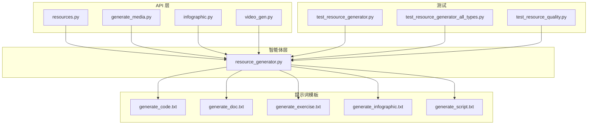
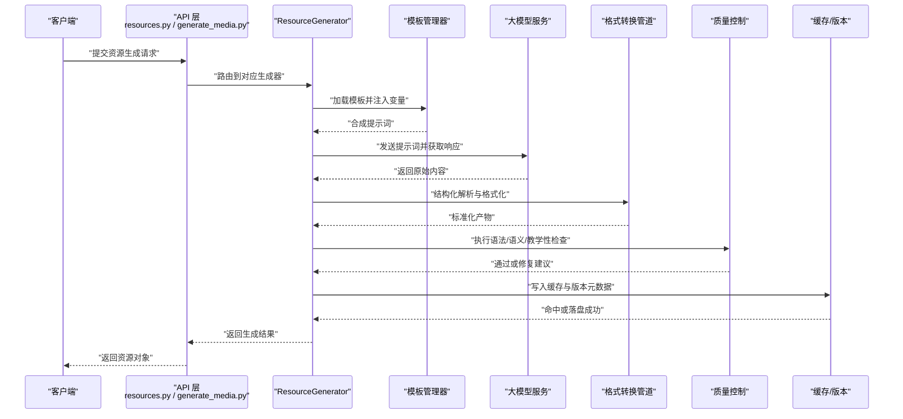
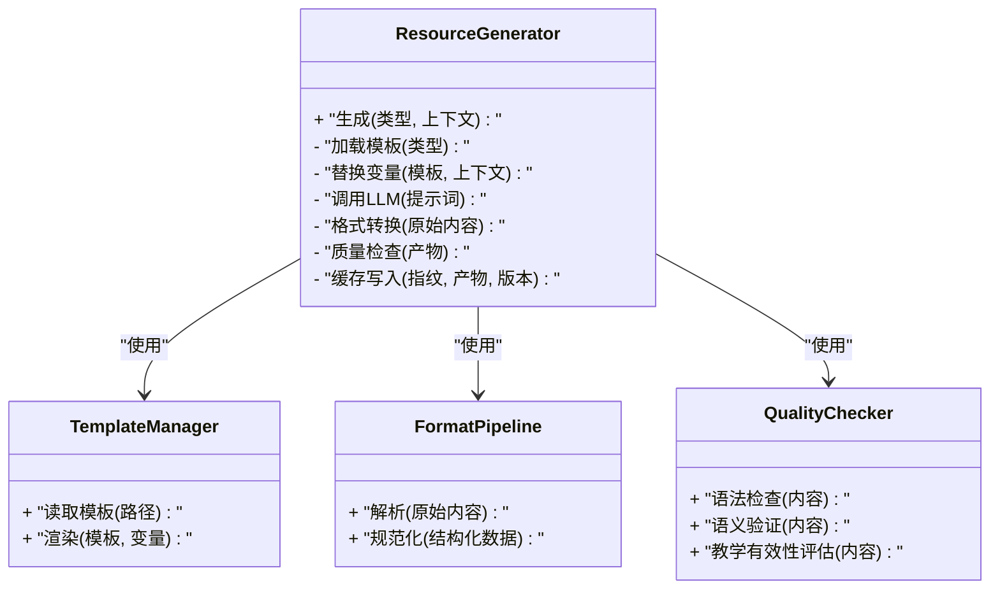
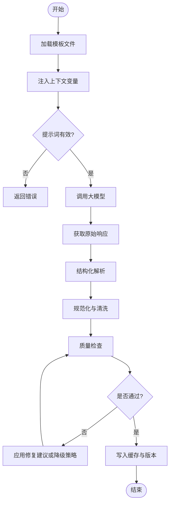
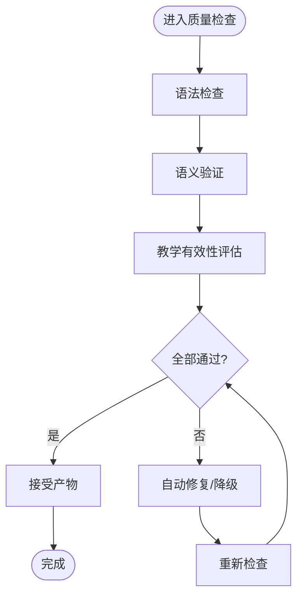
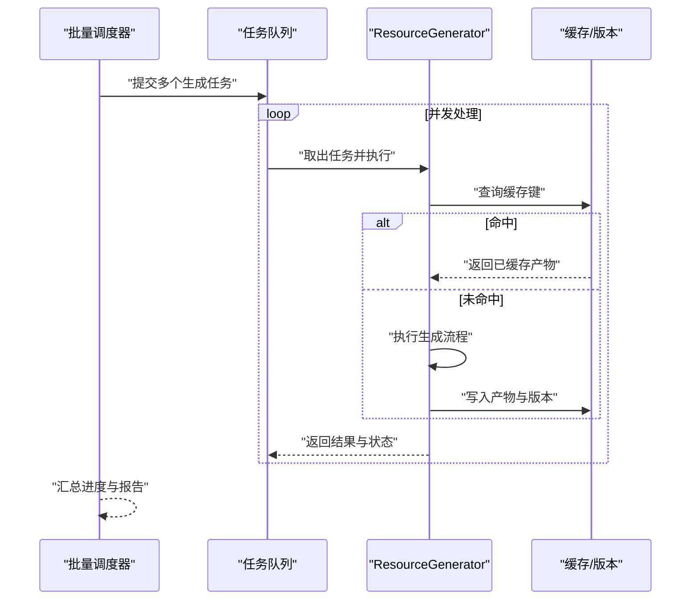
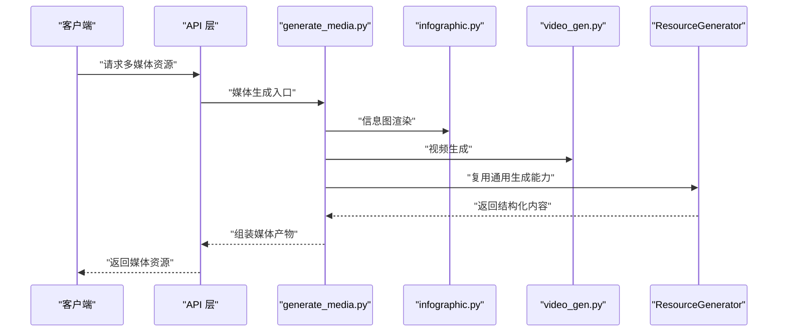
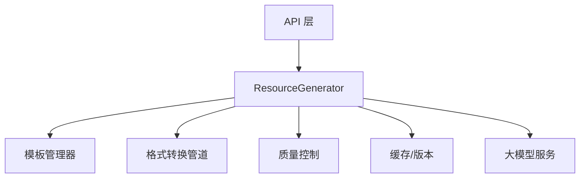

# 资源生成智能体

<cite>
**本文引用的文件**   
- [src/loopse/agent/resource_generator.py](file://src/loopse/agent/resource_generator.py)
- [config/prompts/resource_generator/generate_code.txt](file://config/prompts/resource_generator/generate_code.txt)
- [config/prompts/resource_generator/generate_doc.txt](file://config/prompts/resource_generator/generate_doc.txt)
- [config/prompts/resource_generator/generate_exercise.txt](file://config/prompts/resource_generator/generate_exercise.txt)
- [config/prompts/resource_generator/generate_infographic.txt](file://config/prompts/resource_generator/generate_infographic.txt)
- [config/prompts/resource_generator/generate_script.txt](file://config/prompts/resource_generator/generate_script.txt)
- [src/loopse/api/resources.py](file://src/loopse/api/resources.py)
- [src/loopse/api/generate_media.py](file://src/loopse/api/generate_media.py)
- [src/loopse/api/infographic.py](file://src/loopse/api/infographic.py)
- [src/loopse/api/video_gen.py](file://src/loopse/api/video_gen.py)
- [tests/unit/test_resource_generator.py](file://tests/unit/test_resource_generator.py)
- [tests/unit/test_resource_generator_all_types.py](file://tests/unit/test_resource_generator_all_types.py)
- [tests/unit/test_resource_quality.py](file://tests/unit/test_resource_quality.py)
</cite>

## 目录
1. [简介](#简介)
2. [项目结构](#项目结构)
3. [核心组件](#核心组件)
4. [架构总览](#架构总览)
5. [详细组件分析](#详细组件分析)
6. [依赖关系分析](#依赖关系分析)
7. [性能考虑](#性能考虑)
8. [故障排查指南](#故障排查指南)
9. [结论](#结论)
10. [附录](#附录)

## 简介
本技术文档聚焦于“资源生成智能体”的体系与实现，围绕 ResourceGenerator 的多模态内容生成能力展开，覆盖代码生成、文档编写、练习设计、多媒体制作（信息图、脚本、视频）等。文档同时阐述模板引擎设计（提示词模板管理、变量替换机制、格式转换管道）、质量控制流程（语法检查、语义验证、教学有效性评估），以及缓存、版本管理与批量处理策略。最后提供自定义生成器扩展接口与插件开发指南，帮助开发者快速接入新的资源类型或渲染后端。

## 项目结构
资源生成相关的关键位置如下：
- 智能体实现：src/loopse/agent/resource_generator.py
- API 层：src/loopse/api/resources.py、src/loopse/api/generate_media.py、src/loopse/api/infographic.py、src/loopse/api/video_gen.py
- 提示词模板：config/prompts/resource_generator/*.txt
- 测试用例：tests/unit/test_resource_generator*.py、tests/unit/test_resource_quality.py

图表来源
- [src/loopse/api/resources.py](file://src/loopse/api/resources.py)
- [src/loopse/api/generate_media.py](file://src/loopse/api/generate_media.py)
- [src/loopse/api/infographic.py](file://src/loopse/api/infographic.py)
- [src/loopse/api/video_gen.py](file://src/loopse/api/video_gen.py)
- [src/loopse/agent/resource_generator.py](file://src/loopse/agent/resource_generator.py)
- [config/prompts/resource_generator/generate_code.txt](file://config/prompts/resource_generator/generate_code.txt)
- [config/prompts/resource_generator/generate_doc.txt](file://config/prompts/resource_generator/generate_doc.txt)
- [config/prompts/resource_generator/generate_exercise.txt](file://config/prompts/resource_generator/generate_exercise.txt)
- [config/prompts/resource_generator/generate_infographic.txt](file://config/prompts/resource_generator/generate_infographic.txt)
- [config/prompts/resource_generator/generate_script.txt](file://config/prompts/resource_generator/generate_script.txt)
- [tests/unit/test_resource_generator.py](file://tests/unit/test_resource_generator.py)
- [tests/unit/test_resource_generator_all_types.py](file://tests/unit/test_resource_generator_all_types.py)
- [tests/unit/test_resource_quality.py](file://tests/unit/test_resource_quality.py)

章节来源
- [src/loopse/agent/resource_generator.py](file://src/loopse/agent/resource_generator.py)
- [src/loopse/api/resources.py](file://src/loopse/api/resources.py)
- [src/loopse/api/generate_media.py](file://src/loopse/api/generate_media.py)
- [src/loopse/api/infographic.py](file://src/loopse/api/infographic.py)
- [src/loopse/api/video_gen.py](file://src/loopse/api/video_gen.py)
- [config/prompts/resource_generator/generate_code.txt](file://config/prompts/resource_generator/generate_code.txt)
- [config/prompts/resource_generator/generate_doc.txt](file://config/prompts/resource_generator/generate_doc.txt)
- [config/prompts/resource_generator/generate_exercise.txt](file://config/prompts/resource_generator/generate_exercise.txt)
- [config/prompts/resource_generator/generate_infographic.txt](file://config/prompts/resource_generator/generate_infographic.txt)
- [config/prompts/resource_generator/generate_script.txt](file://config/prompts/resource_generator/generate_script.txt)
- [tests/unit/test_resource_generator.py](file://tests/unit/test_resource_generator.py)
- [tests/unit/test_resource_generator_all_types.py](file://tests/unit/test_resource_generator_all_types.py)
- [tests/unit/test_resource_quality.py](file://tests/unit/test_resource_quality.py)

## 核心组件
- 多模态资源生成器（ResourceGenerator）
  - 负责统一编排不同资源类型的生成流程，包括代码、文档、练习、信息图、脚本、视频等。
  - 内部维护模板加载器、变量替换器、格式转换器与质量校验器。
- 提示词模板管理
  - 以文本文件形式集中管理各资源类型的提示词模板，支持按类型选择与参数注入。
- 变量替换机制
  - 将上下文数据（如知识点、难度、受众、风格等）安全地注入到模板中，形成最终提示词。
- 格式转换管道
  - 对 LLM 输出进行结构化解析、规范化与二次加工，确保下游消费端可直接使用。
- 质量控制
  - 集成语法检查、语义一致性校验与教学有效性评估规则，保障生成结果可用性与教育价值。
- 缓存与版本管理
  - 基于输入指纹与模板版本生成缓存键，避免重复计算；为每次生成记录版本元数据以便追溯。
- 批量处理
  - 支持并发任务队列与进度上报，便于大批量资源生成与异步消费。

章节来源
- [src/loopse/agent/resource_generator.py](file://src/loopse/agent/resource_generator.py)
- [config/prompts/resource_generator/generate_code.txt](file://config/prompts/resource_generator/generate_code.txt)
- [config/prompts/resource_generator/generate_doc.txt](file://config/prompts/resource_generator/generate_doc.txt)
- [config/prompts/resource_generator/generate_exercise.txt](file://config/prompts/resource_generator/generate_exercise.txt)
- [config/prompts/resource_generator/generate_infographic.txt](file://config/prompts/resource_generator/generate_infographic.txt)
- [config/prompts/resource_generator/generate_script.txt](file://config/prompts/resource_generator/generate_script.txt)

## 架构总览
下图展示了从 API 请求到资源生成的端到端流程，涵盖模板加载、变量替换、LLM 调用、格式转换与质量校验。

图表来源
- [src/loopse/api/resources.py](file://src/loopse/api/resources.py)
- [src/loopse/api/generate_media.py](file://src/loopse/api/generate_media.py)
- [src/loopse/agent/resource_generator.py](file://src/loopse/agent/resource_generator.py)

## 详细组件分析

### 多模态资源生成器（ResourceGenerator）
- 职责
  - 统一入口：根据资源类型分发到具体生成策略。
  - 模板编排：选择并渲染对应模板，注入上下文变量。
  - 后处理：调用格式转换管道与质量控制模块。
  - 可观测性：记录生成耗时、模板版本、缓存命中状态。
- 关键流程
  - 输入校验与上下文构建
  - 模板选择与变量替换
  - LLM 调用与重试/熔断策略
  - 结构化解析与规范化
  - 质量检查与修复建议
  - 缓存写入与版本记录
- 扩展点
  - 新增资源类型：注册新策略与模板路径
  - 自定义格式转换器：接入新的解析/渲染逻辑
  - 自定义质量规则：插入新的检查项

图表来源
- [src/loopse/agent/resource_generator.py](file://src/loopse/agent/resource_generator.py)

章节来源
- [src/loopse/agent/resource_generator.py](file://src/loopse/agent/resource_generator.py)

### 模板引擎设计
- 提示词模板管理
  - 模板文件位于 config/prompts/resource_generator 下，按资源类型组织。
  - 模板管理器负责读取、缓存与版本化模板，支持热更新。
- 变量替换机制
  - 支持命名占位符与安全替换，防止注入攻击。
  - 上下文变量包含：主题、目标受众、难度等级、语言风格、示例数量等。
- 格式转换管道
  - 将 LLM 输出的自由文本转换为结构化数据（如 JSON Schema）。
  - 提供多种后置处理器：去噪、补全、对齐、摘要、抽取要点。

图表来源
- [config/prompts/resource_generator/generate_code.txt](file://config/prompts/resource_generator/generate_code.txt)
- [config/prompts/resource_generator/generate_doc.txt](file://config/prompts/resource_generator/generate_doc.txt)
- [config/prompts/resource_generator/generate_exercise.txt](file://config/prompts/resource_generator/generate_exercise.txt)
- [config/prompts/resource_generator/generate_infographic.txt](file://config/prompts/resource_generator/generate_infographic.txt)
- [config/prompts/resource_generator/generate_script.txt](file://config/prompts/resource_generator/generate_script.txt)
- [src/loopse/agent/resource_generator.py](file://src/loopse/agent/resource_generator.py)

章节来源
- [config/prompts/resource_generator/generate_code.txt](file://config/prompts/resource_generator/generate_code.txt)
- [config/prompts/resource_generator/generate_doc.txt](file://config/prompts/resource_generator/generate_doc.txt)
- [config/prompts/resource_generator/generate_exercise.txt](file://config/prompts/resource_generator/generate_exercise.txt)
- [config/prompts/resource_generator/generate_infographic.txt](file://config/prompts/resource_generator/generate_infographic.txt)
- [config/prompts/resource_generator/generate_script.txt](file://config/prompts/resource_generator/generate_script.txt)
- [src/loopse/agent/resource_generator.py](file://src/loopse/agent/resource_generator.py)

### 质量控制流程
- 语法检查
  - 针对代码类资源进行语法正确性验证；对文本类资源进行基础拼写与标点检查。
- 语义验证
  - 校验内容与上下文的关联性，避免偏离主题或产生矛盾信息。
- 教学有效性评估
  - 依据教学目标、难度匹配、认知负荷与学习路径适配度进行评估。
- 修复与降级
  - 当检查失败时，尝试自动修复或回退到更保守的生成策略。

图表来源
- [src/loopse/agent/resource_generator.py](file://src/loopse/agent/resource_generator.py)
- [tests/unit/test_resource_quality.py](file://tests/unit/test_resource_quality.py)

章节来源
- [src/loopse/agent/resource_generator.py](file://src/loopse/agent/resource_generator.py)
- [tests/unit/test_resource_quality.py](file://tests/unit/test_resource_quality.py)

### 缓存、版本管理与批量处理
- 缓存策略
  - 基于输入指纹（上下文+模板版本+参数哈希）生成缓存键，命中则直接返回。
  - 支持多级缓存：内存缓存优先，持久化存储兜底。
- 版本管理
  - 为每次生成记录模板版本、模型版本与参数快照，便于回溯与对比。
- 批量处理
  - 支持任务队列与并发控制，提供进度回调与失败重试。
  - 适合离线批量生成与定时任务。

图表来源
- [src/loopse/agent/resource_generator.py](file://src/loopse/agent/resource_generator.py)

章节来源
- [src/loopse/agent/resource_generator.py](file://src/loopse/agent/resource_generator.py)

### API 集成与多媒体生成
- 资源生成 API
  - resources.py 提供统一的资源生成接口，按类型路由到 ResourceGenerator。
- 多媒体生成
  - generate_media.py 封装媒体资源的生成流程（音频、图像、视频等）。
  - infographic.py 与信息图渲染后端对接，输出可视化素材。
  - video_gen.py 与视频生成服务交互，支持脚本转视频流水线。

图表来源
- [src/loopse/api/resources.py](file://src/loopse/api/resources.py)
- [src/loopse/api/generate_media.py](file://src/loopse/api/generate_media.py)
- [src/loopse/api/infographic.py](file://src/loopse/api/infographic.py)
- [src/loopse/api/video_gen.py](file://src/loopse/api/video_gen.py)
- [src/loopse/agent/resource_generator.py](file://src/loopse/agent/resource_generator.py)

章节来源
- [src/loopse/api/resources.py](file://src/loopse/api/resources.py)
- [src/loopse/api/generate_media.py](file://src/loopse/api/generate_media.py)
- [src/loopse/api/infographic.py](file://src/loopse/api/infographic.py)
- [src/loopse/api/video_gen.py](file://src/loopse/api/video_gen.py)
- [src/loopse/agent/resource_generator.py](file://src/loopse/agent/resource_generator.py)

### 自定义生成器扩展与插件开发
- 扩展点
  - 注册新资源类型：在生成器中声明类型映射与默认模板路径。
  - 自定义模板：在提示词模板目录下新增对应 .txt 文件。
  - 自定义格式转换器：实现解析与规范化逻辑，并在管道中注册。
  - 自定义质量规则：实现检查函数，并在质量控制阶段挂载。
- 插件生命周期
  - 初始化：加载配置与模板
  - 运行：接收上下文、渲染提示词、调用 LLM、后处理
  - 收尾：写入缓存、记录版本、上报指标
- 最佳实践
  - 保持模板与业务逻辑解耦
  - 为每个资源类型定义清晰的输入/输出契约
  - 为质量规则提供可配置的阈值与开关

章节来源
- [src/loopse/agent/resource_generator.py](file://src/loopse/agent/resource_generator.py)
- [config/prompts/resource_generator/generate_code.txt](file://config/prompts/resource_generator/generate_code.txt)
- [config/prompts/resource_generator/generate_doc.txt](file://config/prompts/resource_generator/generate_doc.txt)
- [config/prompts/resource_generator/generate_exercise.txt](file://config/prompts/resource_generator/generate_exercise.txt)
- [config/prompts/resource_generator/generate_infographic.txt](file://config/prompts/resource_generator/generate_infographic.txt)
- [config/prompts/resource_generator/generate_script.txt](file://config/prompts/resource_generator/generate_script.txt)

## 依赖关系分析
- 组件耦合
  - API 层仅依赖 ResourceGenerator 的统一接口，降低耦合度。
  - 模板管理器与格式转换管道作为独立模块，便于替换与升级。
- 外部依赖
  - 大模型服务：用于提示词推理与内容生成。
  - 缓存与版本存储：用于命中加速与溯源。
- 潜在循环依赖
  - 当前设计避免循环引用，所有依赖均单向指向基础设施模块。

图表来源
- [src/loopse/api/resources.py](file://src/loopse/api/resources.py)
- [src/loopse/agent/resource_generator.py](file://src/loopse/agent/resource_generator.py)

章节来源
- [src/loopse/api/resources.py](file://src/loopse/api/resources.py)
- [src/loopse/agent/resource_generator.py](file://src/loopse/agent/resource_generator.py)

## 性能考虑
- 缓存命中率优化
  - 合理设计输入指纹，减少无效缓存失效。
  - 分层缓存策略提升热点资源访问速度。
- 并发与限流
  - 批量任务采用并发控制与背压机制，避免过载。
  - 对 LLM 调用实施速率限制与重试退避。
- 模板与管道优化
  - 模板预编译与缓存，减少 I/O 开销。
  - 格式转换管道采用流式处理，降低内存占用。

[本节为通用指导，不直接分析具体文件]

## 故障排查指南
- 常见问题
  - 模板缺失或变量未注入：检查模板路径与上下文字段。
  - LLM 调用失败：查看超时、配额与重试策略。
  - 质量检查失败：定位具体检查项，调整阈值或修复策略。
  - 缓存未命中：核对指纹生成逻辑与版本变更。
- 诊断工具
  - 启用生成日志与指标上报，记录关键步骤耗时与状态。
  - 使用单元测试覆盖边界条件与异常路径。

章节来源
- [tests/unit/test_resource_generator.py](file://tests/unit/test_resource_generator.py)
- [tests/unit/test_resource_generator_all_types.py](file://tests/unit/test_resource_generator_all_types.py)
- [tests/unit/test_resource_quality.py](file://tests/unit/test_resource_quality.py)

## 结论
ResourceGenerator 在多模态资源生成方面提供了统一、可扩展且可观测的架构。通过模板引擎、格式转换管道与质量控制流程，系统能够稳定产出高质量的教学资源。结合缓存、版本管理与批量处理能力，满足大规模生产需求。开发者可通过明确的扩展点与插件机制，快速接入新的资源类型与渲染后端，持续增强平台能力。

[本节为总结性内容，不直接分析具体文件]

## 附录
- 资源类型清单
  - 代码生成：generate_code.txt
  - 文档编写：generate_doc.txt
  - 练习设计：generate_exercise.txt
  - 信息图：generate_infographic.txt
  - 脚本生成：generate_script.txt
- 测试覆盖
  - 功能测试：test_resource_generator.py、test_resource_generator_all_types.py
  - 质量测试：test_resource_quality.py

章节来源
- [config/prompts/resource_generator/generate_code.txt](file://config/prompts/resource_generator/generate_code.txt)
- [config/prompts/resource_generator/generate_doc.txt](file://config/prompts/resource_generator/generate_doc.txt)
- [config/prompts/resource_generator/generate_exercise.txt](file://config/prompts/resource_generator/generate_exercise.txt)
- [config/prompts/resource_generator/generate_infographic.txt](file://config/prompts/resource_generator/generate_infographic.txt)
- [config/prompts/resource_generator/generate_script.txt](file://config/prompts/resource_generator/generate_script.txt)
- [tests/unit/test_resource_generator.py](file://tests/unit/test_resource_generator.py)
- [tests/unit/test_resource_generator_all_types.py](file://tests/unit/test_resource_generator_all_types.py)
- [tests/unit/test_resource_quality.py](file://tests/unit/test_resource_quality.py)