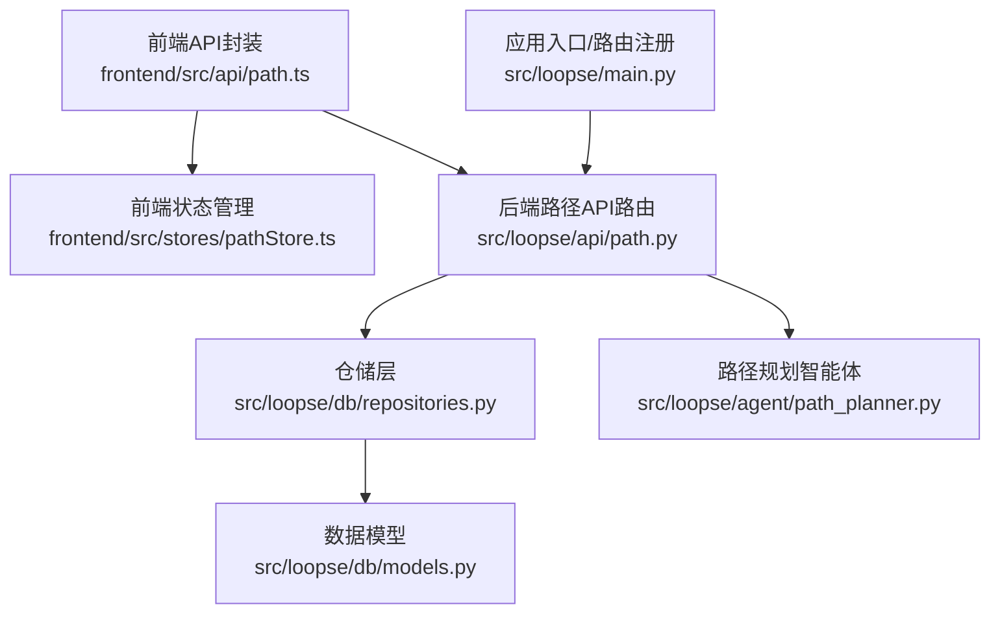
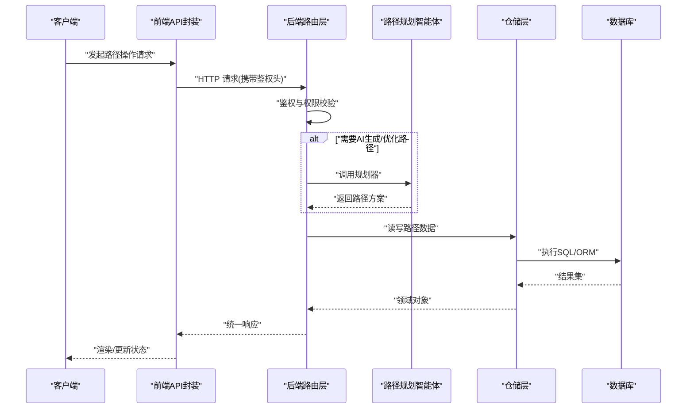
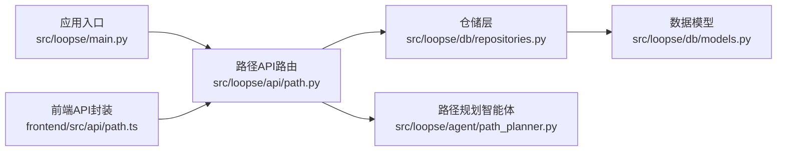
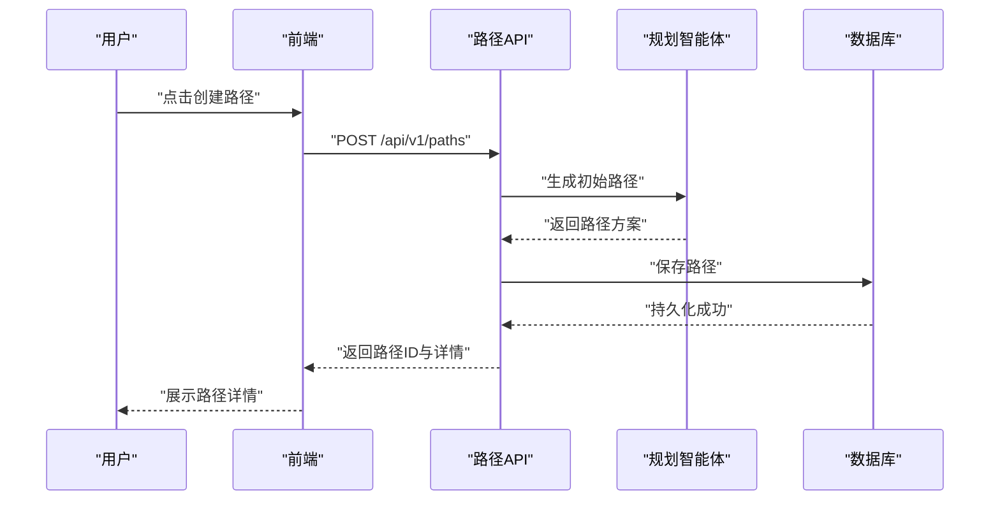

# API接口集成

<cite>
**本文引用的文件**   
- [src/loopse/api/path.py](file://src/loopse/api/path.py)
- [frontend/src/api/path.ts](file://frontend/src/api/path.ts)
- [frontend/src/stores/pathStore.ts](file://frontend/src/stores/pathStore.ts)
- [frontend/src/types/path.ts](file://frontend/src/types/path.ts)
- [config/api_schema.yaml](file://config/api_schema.yaml)
- [src/loopse/db/models.py](file://src/loopse/db/models.py)
- [src/loopse/db/repositories.py](file://src/loopse/db/repositories.py)
- [src/loopse/agent/path_planner.py](file://src/loopse/agent/path_planner.py)
- [src/loopse/main.py](file://src/loopse/main.py)
</cite>

## 目录
1. [简介](#简介)
2. [项目结构](#项目结构)
3. [核心组件](#核心组件)
4. [架构总览](#架构总览)
5. [详细组件分析](#详细组件分析)
6. [依赖分析](#依赖分析)
7. [性能考虑](#性能考虑)
8. [故障排查指南](#故障排查指南)
9. [结论](#结论)
10. [附录](#附录) 

## 简介
本文件面向“学习路径”相关RESTful API的集成与使用，覆盖路径创建、更新、删除、查询等核心操作，并补充认证授权、权限控制、错误码与异常处理、重试策略、批量与分页、高级搜索、版本管理与兼容性、以及性能监控与限流缓存配置等实践建议。文档同时提供前后端对接要点与最佳实践，帮助开发者快速、稳定地接入路径能力。

## 项目结构
围绕“学习路径”API的前后端关键位置如下：
- 后端路由与控制器：src/loopse/api/path.py
- 数据模型与仓储：src/loopse/db/models.py、src/loopse/db/repositories.py
- 路径规划智能体：src/loopse/agent/path_planner.py
- 应用入口与路由注册：src/loopse/main.py
- 前端API封装：frontend/src/api/path.ts
- 前端状态管理：frontend/src/stores/pathStore.ts
- 前端类型定义：frontend/src/types/path.ts
- 全局API契约（参考）：config/api_schema.yaml

图表来源
- [src/loopse/api/path.py](file://src/loopse/api/path.py)
- [src/loopse/db/repositories.py](file://src/loopse/db/repositories.py)
- [src/loopse/db/models.py](file://src/loopse/db/models.py)
- [src/loopse/agent/path_planner.py](file://src/loopse/agent/path_planner.py)
- [src/loopse/main.py](file://src/loopse/main.py)
- [frontend/src/api/path.ts](file://frontend/src/api/path.ts)
- [frontend/src/stores/pathStore.ts](file://frontend/src/stores/pathStore.ts)

章节来源
- [src/loopse/api/path.py](file://src/loopse/api/path.py)
- [src/loopse/db/models.py](file://src/loopse/db/models.py)
- [src/loopse/db/repositories.py](file://src/loopse/db/repositories.py)
- [src/loopse/agent/path_planner.py](file://src/loopse/agent/path_planner.py)
- [src/loopse/main.py](file://src/loopse/main.py)
- [frontend/src/api/path.ts](file://frontend/src/api/path.ts)
- [frontend/src/stores/pathStore.ts](file://frontend/src/stores/pathStore.ts)
- [config/api_schema.yaml](file://config/api_schema.yaml)

## 核心组件
- 后端API路由层：负责HTTP请求解析、参数校验、鉴权拦截、调用业务逻辑与仓储、返回统一响应格式。
- 仓储与模型层：负责持久化路径实体、关系与索引字段，提供CRUD与查询能力。
- 路径规划智能体：根据用户画像、目标与约束生成或优化学习路径。
- 前端API封装：统一请求构造、错误处理、重试与缓存策略，暴露给页面与状态管理。
- 前端状态管理：集中维护路径列表、当前路径、加载态与错误信息。
- 类型定义：前后端共享的路径数据结构约定，确保类型安全。

章节来源
- [src/loopse/api/path.py](file://src/loopse/api/path.py)
- [src/loopse/db/repositories.py](file://src/loopse/db/repositories.py)
- [src/loopse/db/models.py](file://src/loopse/db/models.py)
- [src/loopse/agent/path_planner.py](file://src/loopse/agent/path_planner.py)
- [frontend/src/api/path.ts](file://frontend/src/api/path.ts)
- [frontend/src/stores/pathStore.ts](file://frontend/src/stores/pathStore.ts)
- [frontend/src/types/path.ts](file://frontend/src/types/path.ts)

## 架构总览
下图展示了从前端到后端的完整调用链路，包括鉴权、路由分发、业务编排、智能体参与、数据持久化与响应返回。

图表来源
- [src/loopse/api/path.py](file://src/loopse/api/path.py)
- [src/loopse/agent/path_planner.py](file://src/loopse/agent/path_planner.py)
- [src/loopse/db/repositories.py](file://src/loopse/db/repositories.py)
- [src/loopse/db/models.py](file://src/loopse/db/models.py)
- [frontend/src/api/path.ts](file://frontend/src/api/path.ts)

## 详细组件分析

### 路径API端点规范
以下列出学习路径相关的典型REST端点。实际URL前缀与版本请以应用入口注册为准。

- 创建路径
  - 方法: POST
  - URL: /api/v1/paths
  - 鉴权: 需要
  - 请求体: 包含路径名称、描述、目标、阶段节点、排序、标签等
  - 响应: 返回新建路径ID与基础信息

- 更新路径
  - 方法: PUT/PATCH
  - URL: /api/v1/paths/{path_id}
  - 鉴权: 需要
  - 请求体: 可更新的字段集合
  - 响应: 返回更新后的路径信息

- 删除路径
  - 方法: DELETE
  - URL: /api/v1/paths/{path_id}
  - 鉴权: 需要
  - 响应: 成功空体或确认信息

- 获取路径详情
  - 方法: GET
  - URL: /api/v1/paths/{path_id}
  - 鉴权: 需要
  - 响应: 返回路径完整信息

- 查询路径列表（分页）
  - 方法: GET
  - URL: /api/v1/paths?page=1&size=20&sort_by=&order=asc
  - 鉴权: 需要
  - 响应: 返回分页结果与元信息

- 高级搜索
  - 方法: GET
  - URL: /api/v1/paths/search?q=&tags=&status=&owner_id=&created_after=&created_before=
  - 鉴权: 需要
  - 响应: 返回匹配路径列表

- 批量操作
  - 方法: POST
  - URL: /api/v1/paths/batch
  - 鉴权: 需要
  - 请求体: 操作数组（如批量更新状态、批量打标签）
  - 响应: 返回各操作的执行结果

说明
- 所有写操作需携带有效鉴权令牌；读操作按权限策略决定是否允许匿名访问。
- 分页默认值与最大页大小由服务端限制；越界将返回错误。
- 高级搜索字段以服务端实现为准，未支持的字段将被忽略或报错。

章节来源
- [src/loopse/api/path.py](file://src/loopse/api/path.py)
- [config/api_schema.yaml](file://config/api_schema.yaml)

### 认证与授权
- 认证方式
  - 基于令牌（例如JWT）的请求头传递，常见为Authorization: Bearer <token>。
  - 登录成功后由认证服务签发令牌，前端在后续请求中自动附加。
- 授权策略
  - 资源级权限：仅路径所有者或具备相应角色的用户可修改/删除。
  - 角色控制：管理员可跨租户/组织查看或管理路径。
- 安全加固
  - 传输加密：强制HTTPS。
  - 输入校验：对路径名、标签、阶段节点等进行长度与格式校验。
  - 防重放：必要时引入nonce/time-window校验。
  - 审计日志：记录关键写操作的用户、时间、变更摘要。

章节来源
- [src/loopse/api/path.py](file://src/loopse/api/path.py)
- [src/loopse/main.py](file://src/loopse/main.py)

### 数据模型与关系
- 路径实体
  - 标识：唯一ID
  - 基本信息：名称、描述、状态、标签、创建/更新时间
  - 结构：阶段节点序列、前置依赖、权重/难度
  - 归属：创建者/拥有者、可见范围
- 关系
  - 路径与用户：一对多（一个用户可有多条路径）
  - 路径与资源：多对多（通过中间表关联）
  - 路径与标签：多对多（便于检索与筛选）

章节来源
- [src/loopse/db/models.py](file://src/loopse/db/models.py)
- [src/loopse/db/repositories.py](file://src/loopse/db/repositories.py)

### 路径规划智能体
- 触发时机
  - 首次创建时自动生成初始路径。
  - 用户选择“智能优化”时重新规划。
- 输入
  - 用户画像、学习目标、已有知识掌握度、偏好与约束。
- 输出
  - 结构化路径方案（阶段、知识点、资源推荐、顺序与依赖）。
- 质量保障
  - 规则校验：依赖无环、阶段可达性检查。
  - 回退策略：当AI不可用时，返回模板路径或提示重试。

章节来源
- [src/loopse/agent/path_planner.py](file://src/loopse/agent/path_planner.py)

### 前端API封装与状态管理
- API封装职责
  - 统一URL前缀与版本控制。
  - 自动附加鉴权头、超时与重试。
  - 统一错误转换与提示。
- 状态管理
  - 集中维护路径列表、当前路径、加载与错误状态。
  - 提供增删改查与批量操作的Action。
- 类型安全
  - 使用TS类型定义保证前后端数据结构一致。

章节来源
- [frontend/src/api/path.ts](file://frontend/src/api/path.ts)
- [frontend/src/stores/pathStore.ts](file://frontend/src/stores/pathStore.ts)
- [frontend/src/types/path.ts](file://frontend/src/types/path.ts)

### 错误码与异常处理
- 通用错误分类
  - 客户端错误：参数缺失、校验失败、分页非法等。
  - 服务端错误：内部异常、依赖服务不可用、数据库异常等。
  - 鉴权错误：未认证、令牌过期、权限不足。
- 错误响应结构
  - 统一包含错误码、消息、可选的详情与追踪ID。
- 重试策略
  - 幂等读请求：支持指数退避重试。
  - 幂等写请求：仅在明确幂等语义下重试，避免重复提交。
  - 网络抖动：设置合理超时与最大重试次数。

章节来源
- [src/loopse/api/path.py](file://src/loopse/api/path.py)
- [frontend/src/api/path.ts](file://frontend/src/api/path.ts)

### 批量操作与事务
- 批量更新
  - 支持批量更新状态、标签、排序等。
  - 建议采用事务保证一致性，部分失败可返回逐条结果。
- 幂等设计
  - 为批量接口提供idempotency_key，防止重复提交导致副作用。

章节来源
- [src/loopse/api/path.py](file://src/loopse/api/path.py)
- [src/loopse/db/repositories.py](file://src/loopse/db/repositories.py)

### 分页与高级搜索
- 分页参数
  - page、size、sort_by、order，服务端限制最大size。
- 高级搜索
  - 支持关键词、标签、状态、时间范围、拥有者等多维过滤。
  - 复杂条件建议使用全文检索或向量检索扩展。

章节来源
- [src/loopse/api/path.py](file://src/loopse/api/path.py)

### API版本管理与兼容性
- 版本策略
  - URL前缀带版本号（如/api/v1），向后兼容期内不破坏性变更。
- 迁移指南
  - 废弃字段保留一段时间并提供迁移脚本。
  - 发布变更公告与示例代码更新。

章节来源
- [src/loopse/main.py](file://src/loopse/main.py)
- [config/api_schema.yaml](file://config/api_schema.yaml)

## 依赖分析
- 模块耦合
  - 路由层依赖鉴权中间件、仓储层与智能体。
  - 仓储层依赖模型与数据库连接。
  - 前端API封装依赖统一的HTTP客户端与错误处理。
- 外部依赖
  - 数据库、缓存、消息队列（可选）、AI服务（可选）。

图表来源
- [src/loopse/api/path.py](file://src/loopse/api/path.py)
- [src/loopse/db/repositories.py](file://src/loopse/db/repositories.py)
- [src/loopse/db/models.py](file://src/loopse/db/models.py)
- [src/loopse/agent/path_planner.py](file://src/loopse/agent/path_planner.py)
- [src/loopse/main.py](file://src/loopse/main.py)
- [frontend/src/api/path.ts](file://frontend/src/api/path.ts)

章节来源
- [src/loopse/api/path.py](file://src/loopse/api/path.py)
- [src/loopse/db/repositories.py](file://src/loopse/db/repositories.py)
- [src/loopse/db/models.py](file://src/loopse/db/models.py)
- [src/loopse/agent/path_planner.py](file://src/loopse/agent/path_planner.py)
- [src/loopse/main.py](file://src/loopse/main.py)
- [frontend/src/api/path.ts](file://frontend/src/api/path.ts)

## 性能考虑
- 缓存策略
  - 读多写少场景：对路径列表与详情启用短期缓存（如Redis），设置合理的TTL与失效策略。
  - 热点路径：预取与懒加载结合，减少首屏延迟。
- 限流与熔断
  - 针对写接口实施速率限制，保护系统稳定性。
  - 对AI规划接口增加熔断与降级，避免雪崩。
- 数据库优化
  - 常用查询建立索引（如owner_id、status、tags、updated_at）。
  - 分页查询使用游标或键集分页替代偏移量分页。
- 前端优化
  - 请求去抖与合并，避免频繁刷新。
  - 本地缓存与离线优先策略（可选）。

[本节为通用指导，无需具体文件引用]

## 故障排查指南
- 常见问题
  - 鉴权失败：检查令牌是否过期、作用域是否足够。
  - 参数校验错误：核对必填字段、长度与格式限制。
  - 分页异常：确认page与size在合法范围内。
  - AI规划失败：检查下游服务健康与配额。
- 定位手段
  - 查看统一错误响应中的错误码与追踪ID。
  - 开启调试日志，关注路由层与仓储层的关键步骤。
  - 前端捕获并上报异常堆栈与请求上下文。

章节来源
- [src/loopse/api/path.py](file://src/loopse/api/path.py)
- [frontend/src/api/path.ts](file://frontend/src/api/path.ts)

## 结论
学习路径API围绕清晰的REST风格、严格的鉴权与权限控制、可扩展的智能规划能力与稳健的错误处理机制构建。通过前后端一致的契约与类型定义、完善的分页与搜索、批量操作与版本管理，能够满足教育场景下的个性化学习需求。建议在上线前完善监控告警、限流熔断与缓存策略，持续优化性能与可用性。

## 附录

### 典型调用流程（序列图）

图表来源
- [src/loopse/api/path.py](file://src/loopse/api/path.py)
- [src/loopse/agent/path_planner.py](file://src/loopse/agent/path_planner.py)
- [src/loopse/db/repositories.py](file://src/loopse/db/repositories.py)
- [frontend/src/api/path.ts](file://frontend/src/api/path.ts)

### 前端SDK使用要点
- 初始化
  - 设置基础URL与鉴权头。
  - 配置超时与重试策略。
- 基本用法
  - 调用路径CRUD方法，处理加载与错误状态。
  - 使用分页与搜索参数进行列表查询。
- 最佳实践
  - 使用类型定义确保数据结构正确。
  - 对写操作添加幂等键，避免重复提交。
  - 对高频读操作启用本地缓存与按需刷新。

章节来源
- [frontend/src/api/path.ts](file://frontend/src/api/path.ts)
- [frontend/src/stores/pathStore.ts](file://frontend/src/stores/pathStore.ts)
- [frontend/src/types/path.ts](file://frontend/src/types/path.ts)