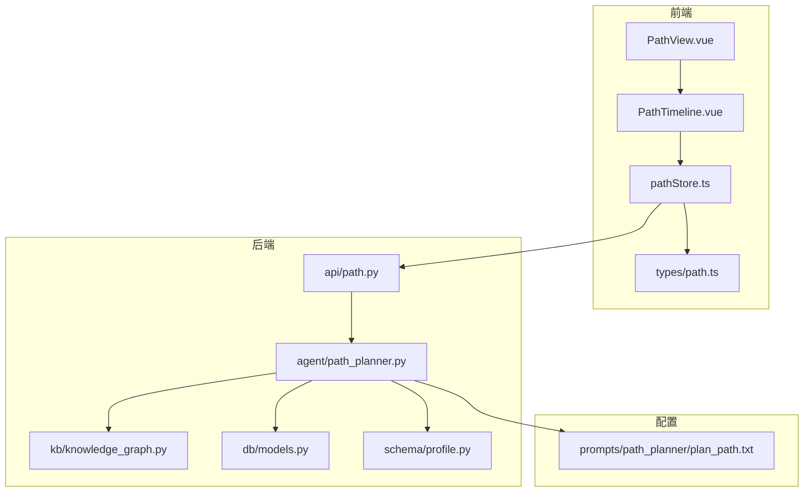
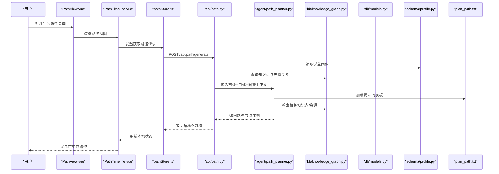
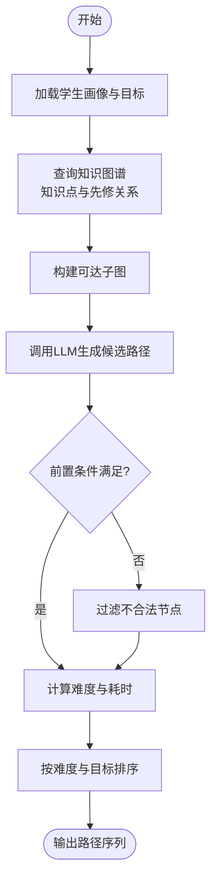
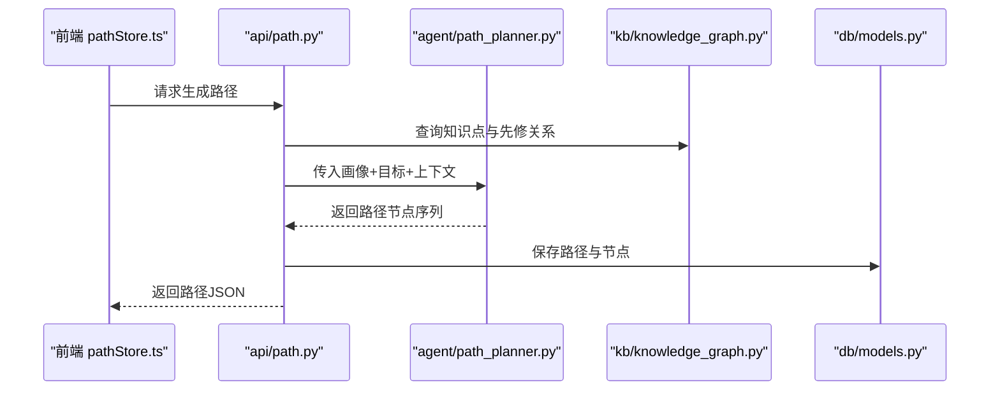
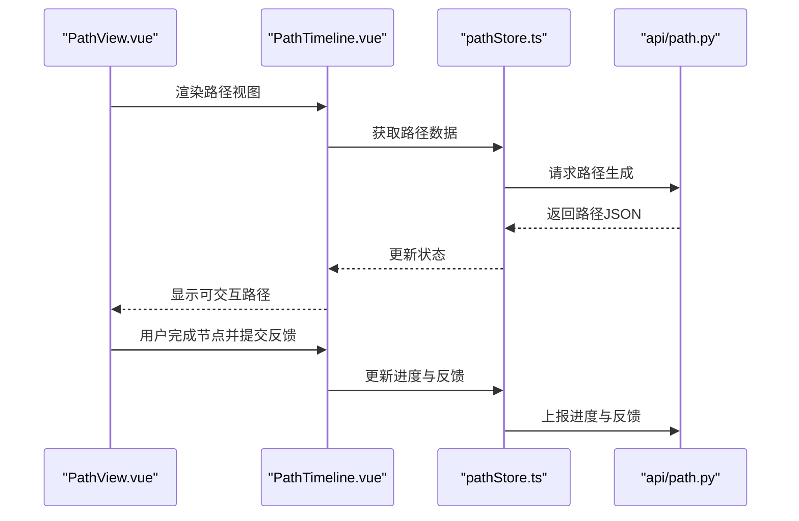
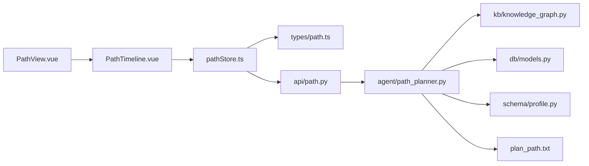

# 学习路径系统

<cite>
**本文引用的文件**   
- [src/loopse/agent/path_planner.py](file://src/loopse/agent/path_planner.py)
- [src/loopse/api/path.py](file://src/loopse/api/path.py)
- [frontend/src/stores/pathStore.ts](file://frontend/src/stores/pathStore.ts)
- [frontend/src/types/path.ts](file://frontend/src/types/path.ts)
- [config/prompts/path_planner/plan_path.txt](file://config/prompts/path_planner/plan_path.txt)
- [frontend/src/components/path/PathTimeline.vue](file://frontend/src/components/path/PathTimeline.vue)
- [frontend/src/views/PathView.vue](file://frontend/src/views/PathView.vue)
- [src/loopse/schema/profile.py](file://src/loopse/schema/profile.py)
- [src/loopse/db/models.py](file://src/loopse/db/models.py)
- [src/loopse/knowledge_graph.py](file://src/loopse/kb/knowledge_graph.py)
- [frontend/public/mock/path_mock.json](file://frontend/public/mock/path_mock.json)
</cite>

## 目录
1. [简介](#简介)
2. [项目结构](#项目结构)
3. [核心组件](#核心组件)
4. [架构总览](#架构总览)
5. [详细组件分析](#详细组件分析)
6. [依赖关系分析](#依赖关系分析)
7. [性能与可扩展性](#性能与可扩展性)
8. [故障排查指南](#故障排查指南)
9. [结论](#结论)
10. [附录](#附录)

## 简介
本文件面向“学习路径系统”的规划、实现与使用，聚焦以下目标：
- 个性化学习路径生成算法：如何基于学生画像、知识掌握程度和学习目标制定最优学习路线。
- 难度评估模型与动态调整机制：如何在执行过程中根据反馈与表现进行自适应调整。
- PathPlanner 设计：节点设计、前置条件检查、进度跟踪逻辑。
- 前端可视化与交互：路径渲染、导航与用户反馈收集。
- 优化与监控：参数调优指南与性能监控方法。
- 扩展能力：在现有路径规划基础上添加新内容与技能要求的方法。

## 项目结构
围绕学习路径系统的代码分布在后端（Python）、前端（Vue）与配置（Prompt）三个层面：
- 后端服务层：提供路径规划 API、持久化与知识图谱查询。
- 前端展示层：路径时间线可视化、交互导航与反馈采集。
- Prompt 配置：驱动 LLM 生成路径策略与解释。

图表来源
- [frontend/src/views/PathView.vue](file://frontend/src/views/PathView.vue)
- [frontend/src/components/path/PathTimeline.vue](file://frontend/src/components/path/PathTimeline.vue)
- [frontend/src/stores/pathStore.ts](file://frontend/src/stores/pathStore.ts)
- [frontend/src/types/path.ts](file://frontend/src/types/path.ts)
- [src/loopse/api/path.py](file://src/loopse/api/path.py)
- [src/loopse/agent/path_planner.py](file://src/loopse/agent/path_planner.py)
- [src/loopse/kb/knowledge_graph.py](file://src/loopse/kb/knowledge_graph.py)
- [src/loopse/db/models.py](file://src/loopse/db/models.py)
- [src/loopse/schema/profile.py](file://src/loopse/schema/profile.py)
- [config/prompts/path_planner/plan_path.txt](file://config/prompts/path_planner/plan_path.txt)

章节来源
- [frontend/src/views/PathView.vue](file://frontend/src/views/PathView.vue)
- [frontend/src/components/path/PathTimeline.vue](file://frontend/src/components/path/PathTimeline.vue)
- [frontend/src/stores/pathStore.ts](file://frontend/src/stores/pathStore.ts)
- [frontend/src/types/path.ts](file://frontend/src/types/path.ts)
- [src/loopse/api/path.py](file://src/loopse/api/path.py)
- [src/loopse/agent/path_planner.py](file://src/loopse/agent/path_planner.py)
- [src/loopse/kb/knowledge_graph.py](file://src/loopse/kb/knowledge_graph.py)
- [src/loopse/db/models.py](file://src/loopse/db/models.py)
- [src/loopse/schema/profile.py](file://src/loopse/schema/profile.py)
- [config/prompts/path_planner/plan_path.txt](file://config/prompts/path_planner/plan_path.txt)

## 核心组件
- 路径规划器（PathPlanner）：负责读取学生画像、学习目标与知识图谱，结合 Prompt 策略生成路径序列，并输出节点、前置条件与难度信息。
- 路径 API（path.py）：暴露 REST 接口，接收请求参数，调用规划器，返回结构化路径数据。
- 前端路径存储（pathStore.ts）：封装对路径 API 的调用、状态管理与缓存。
- 类型定义（types/path.ts）：统一前后端路径数据结构契约。
- 知识图谱（knowledge_graph.py）：提供知识点、先修关系与资源映射查询。
- 数据库模型（models.py）：持久化路径、节点、进度与反馈。
- 学生画像（profile.py）：描述学习者特征、掌握度与偏好。
- Prompt 模板（plan_path.txt）：指导 LLM 生成路径的策略与约束。

章节来源
- [src/loopse/agent/path_planner.py](file://src/loopse/agent/path_planner.py)
- [src/loopse/api/path.py](file://src/loopse/api/path.py)
- [frontend/src/stores/pathStore.ts](file://frontend/src/stores/pathStore.ts)
- [frontend/src/types/path.ts](file://frontend/src/types/path.ts)
- [src/loopse/kb/knowledge_graph.py](file://src/loopse/kb/knowledge_graph.py)
- [src/loopse/db/models.py](file://src/loopse/db/models.py)
- [src/loopse/schema/profile.py](file://src/loopse/schema/profile.py)
- [config/prompts/path_planner/plan_path.txt](file://config/prompts/path_planner/plan_path.txt)

## 架构总览
下图展示了从前端到后端的完整调用链，以及关键模块间的依赖关系。

图表来源
- [frontend/src/views/PathView.vue](file://frontend/src/views/PathView.vue)
- [frontend/src/components/path/PathTimeline.vue](file://frontend/src/components/path/PathTimeline.vue)
- [frontend/src/stores/pathStore.ts](file://frontend/src/stores/pathStore.ts)
- [src/loopse/api/path.py](file://src/loopse/api/path.py)
- [src/loopse/agent/path_planner.py](file://src/loopse/agent/path_planner.py)
- [src/loopse/kb/knowledge_graph.py](file://src/loopse/kb/knowledge_graph.py)
- [src/loopse/db/models.py](file://src/loopse/db/models.py)
- [src/loopse/schema/profile.py](file://src/loopse/schema/profile.py)
- [config/prompts/path_planner/plan_path.txt](file://config/prompts/path_planner/plan_path.txt)

## 详细组件分析

### 路径规划器（PathPlanner）
职责与流程
- 输入：学生画像（基础水平、兴趣、目标）、学习目标（短期/长期）、当前进度、知识图谱上下文。
- 处理：
  - 解析画像与目标，确定起点与终点节点集合。
  - 基于知识图谱的先修关系构建可达子图。
  - 使用 Prompt 驱动的 LLM 生成候选路径，并结合规则校验（前置条件、难度梯度）。
  - 计算难度评分与预计耗时，输出排序后的路径序列。
- 输出：路径节点列表（含 ID、名称、难度、前置条件、资源链接、预估时长等）。

关键设计要点
- 节点设计：每个节点包含知识点标识、难度等级、前置条件集合、资源映射、状态标记（未开始/进行中/已完成）。
- 前置条件检查：在生成阶段即过滤不满足先修的节点；在执行阶段再次校验跳转合法性。
- 动态调整：当用户完成节点或提交反馈时，重新评估后续节点的难度与顺序，必要时插入补救节点或跳过已掌握内容。

图表来源
- [src/loopse/agent/path_planner.py](file://src/loopse/agent/path_planner.py)
- [src/loopse/kb/knowledge_graph.py](file://src/loopse/kb/knowledge_graph.py)
- [config/prompts/path_planner/plan_path.txt](file://config/prompts/path_planner/plan_path.txt)

章节来源
- [src/loopse/agent/path_planner.py](file://src/loopse/agent/path_planner.py)
- [src/loopse/kb/knowledge_graph.py](file://src/loopse/kb/knowledge_graph.py)
- [config/prompts/path_planner/plan_path.txt](file://config/prompts/path_planner/plan_path.txt)

### 路径 API（path.py）
职责与接口
- 提供路径生成接口，接收学生 ID、学习目标、可选约束（如时间窗口、难度上限）。
- 组合画像与图谱上下文，调用 PathPlanner 生成路径。
- 将结果持久化至数据库，并返回标准化响应。

典型调用链
- 前端 pathStore 调用 /api/path/generate。
- API 层读取 profile 与 knowledge graph。
- 调用 planner 生成路径并落库。
- 返回路径 JSON 给前端。

图表来源
- [src/loopse/api/path.py](file://src/loopse/api/path.py)
- [src/loopse/agent/path_planner.py](file://src/loopse/agent/path_planner.py)
- [src/loopse/kb/knowledge_graph.py](file://src/loopse/kb/knowledge_graph.py)
- [src/loopse/db/models.py](file://src/loopse/db/models.py)

章节来源
- [src/loopse/api/path.py](file://src/loopse/api/path.py)
- [src/loopse/db/models.py](file://src/loopse/db/models.py)

### 前端路径可视化与交互（PathTimeline.vue / PathView.vue）
职责与功能
- 渲染路径时间线，支持点击节点进入详情、查看前置条件与资源。
- 提供导航控制（上一步/下一步），并在用户完成节点后触发进度更新。
- 收集用户反馈（难度感知、理解度评分、建议），用于后续动态调整。

交互流程
- 页面初始化：从 pathStore 拉取路径数据。
- 用户操作：选择节点、完成练习、提交反馈。
- 状态同步：更新本地 store 并调用后端接口记录进度与反馈。

图表来源
- [frontend/src/views/PathView.vue](file://frontend/src/views/PathView.vue)
- [frontend/src/components/path/PathTimeline.vue](file://frontend/src/components/path/PathTimeline.vue)
- [frontend/src/stores/pathStore.ts](file://frontend/src/stores/pathStore.ts)
- [src/loopse/api/path.py](file://src/loopse/api/path.py)

章节来源
- [frontend/src/components/path/PathTimeline.vue](file://frontend/src/components/path/PathTimeline.vue)
- [frontend/src/views/PathView.vue](file://frontend/src/views/PathView.vue)
- [frontend/src/stores/pathStore.ts](file://frontend/src/stores/pathStore.ts)

### 数据结构与契约（types/path.ts）
职责与要点
- 定义路径节点、前置条件、难度等级、资源映射、进度状态等字段。
- 确保前后端一致的数据契约，便于序列化与校验。
- 为前端渲染与后端持久化提供统一类型约束。

章节来源
- [frontend/src/types/path.ts](file://frontend/src/types/path.ts)

### 学生画像与目标（profile.py）
职责与要点
- 描述学习者基础水平、兴趣领域、学习目标与偏好。
- 作为路径生成的关键输入，影响起点选择与难度梯度。
- 可与历史学习记录结合，形成动态画像。

章节来源
- [src/loopse/schema/profile.py](file://src/loopse/schema/profile.py)

### 知识图谱与先修关系（knowledge_graph.py）
职责与要点
- 维护知识点、技能点与资源之间的关联。
- 提供先修关系查询，支撑路径可达性与前置条件校验。
- 支持按主题、难度、标签筛选知识点。

章节来源
- [src/loopse/kb/knowledge_graph.py](file://src/loopse/kb/knowledge_graph.py)

### 持久化模型（models.py）
职责与要点
- 定义路径、节点、进度、反馈等表结构。
- 支持路径版本管理、节点状态追踪与反馈聚合。
- 为统计分析与优化提供数据基础。

章节来源
- [src/loopse/db/models.py](file://src/loopse/db/models.py)

### Mock 数据与开发调试（path_mock.json）
用途
- 提供示例路径数据，便于前端联调与演示。
- 覆盖常见节点结构与状态，辅助测试渲染与交互。

章节来源
- [frontend/public/mock/path_mock.json](file://frontend/public/mock/path_mock.json)

## 依赖关系分析
- 前端依赖：
  - PathView 依赖 PathTimeline 与 pathStore。
  - pathStore 依赖 types/path 与后端 API。
- 后端依赖：
  - API 依赖 PathPlanner、Knowledge Graph、Database Models、Profile Schema。
  - PathPlanner 依赖 Knowledge Graph 与 Prompt 模板。
- 外部依赖：
  - LLM 客户端（由 Planner 调用，通过 Prompt 模板驱动）。
  - 向量/图谱存储（由 Knowledge Graph 访问）。

图表来源
- [frontend/src/views/PathView.vue](file://frontend/src/views/PathView.vue)
- [frontend/src/components/path/PathTimeline.vue](file://frontend/src/components/path/PathTimeline.vue)
- [frontend/src/stores/pathStore.ts](file://frontend/src/stores/pathStore.ts)
- [frontend/src/types/path.ts](file://frontend/src/types/path.ts)
- [src/loopse/api/path.py](file://src/loopse/api/path.py)
- [src/loopse/agent/path_planner.py](file://src/loopse/agent/path_planner.py)
- [src/loopse/kb/knowledge_graph.py](file://src/loopse/kb/knowledge_graph.py)
- [src/loopse/db/models.py](file://src/loopse/db/models.py)
- [src/loopse/schema/profile.py](file://src/loopse/schema/profile.py)
- [config/prompts/path_planner/plan_path.txt](file://config/prompts/path_planner/plan_path.txt)

章节来源
- [frontend/src/views/PathView.vue](file://frontend/src/views/PathView.vue)
- [frontend/src/components/path/PathTimeline.vue](file://frontend/src/components/path/PathTimeline.vue)
- [frontend/src/stores/pathStore.ts](file://frontend/src/stores/pathStore.ts)
- [frontend/src/types/path.ts](file://frontend/src/types/path.ts)
- [src/loopse/api/path.py](file://src/loopse/api/path.py)
- [src/loopse/agent/path_planner.py](file://src/loopse/agent/path_planner.py)
- [src/loopse/kb/knowledge_graph.py](file://src/loopse/kb/knowledge_graph.py)
- [src/loopse/db/models.py](file://src/loopse/db/models.py)
- [src/loopse/schema/profile.py](file://src/loopse/schema/profile.py)
- [config/prompts/path_planner/plan_path.txt](file://config/prompts/path_planner/plan_path.txt)

## 性能与可扩展性
- 生成性能
  - 减少不必要的图谱查询：缓存热点知识点与先修关系。
  - 并行化：在安全范围内并行检索多个知识点上下文。
  - 限制候选集：基于目标与画像预筛知识点，降低 LLM 输入规模。
- 动态调整效率
  - 增量重算：仅对受影响的后继节点进行局部重排。
  - 阈值控制：设置难度变化阈值，避免频繁震荡。
- 前端渲染
  - 虚拟滚动：长路径场景下按需渲染可见节点。
  - 懒加载：延迟加载节点详情与资源预览。
- 可扩展性
  - 插件式 Prompt：新增学科或技能时，替换或扩展 plan_path.txt 模板。
  - 图谱扩展：新增节点与边即可接入新内容，无需改动核心逻辑。
  - 指标埋点：在关键步骤记录耗时与错误率，支撑持续优化。

[本节为通用指导，不直接分析具体文件]

## 故障排查指南
常见问题与定位
- 路径为空或不合理
  - 检查学生画像是否完整（基础水平、目标）。
  - 验证知识图谱中是否存在目标知识点与先修关系。
  - 确认 Prompt 模板是否被正确加载与解析。
- 前置条件校验失败
  - 核对节点的前置条件集合与图谱中的边关系。
  - 检查用户进度是否正确写入数据库。
- 前端渲染异常
  - 确认 types/path.ts 与后端返回结构一致。
  - 检查 pathStore 的状态更新与缓存失效逻辑。
- 性能问题
  - 观察 API 耗时与图谱查询次数。
  - 评估 LLM 输入长度与候选节点数量。

章节来源
- [src/loopse/api/path.py](file://src/loopse/api/path.py)
- [src/loopse/agent/path_planner.py](file://src/loopse/agent/path_planner.py)
- [src/loopse/kb/knowledge_graph.py](file://src/loopse/kb/knowledge_graph.py)
- [src/loopse/db/models.py](file://src/loopse/db/models.py)
- [frontend/src/stores/pathStore.ts](file://frontend/src/stores/pathStore.ts)
- [frontend/src/types/path.ts](file://frontend/src/types/path.ts)

## 结论
学习路径系统以 PathPlanner 为核心，结合学生画像、知识图谱与 Prompt 策略，生成个性化且可执行的学习路线。通过严格的前置条件检查与动态调整机制，系统在保障学习连贯性的同时提升适配性。前端提供直观的可视化与交互体验，并收集用户反馈以驱动持续优化。整体架构清晰、模块化良好，具备较强的可扩展性与可维护性。

[本节为总结性内容，不直接分析具体文件]

## 附录

### 参数调优指南
- 难度权重
  - 提高难度梯度权重：适合基础较好、追求挑战的学习者。
  - 降低难度波动：适合初学者，保证平滑过渡。
- 前置条件严格度
  - 严格模式：确保先修知识完备，但可能延长路径。
  - 宽松模式：允许跳跃学习，配合补救节点弥补缺口。
- 资源多样性
  - 增加多模态资源（视频、练习、文档）以提升参与度。
  - 依据用户偏好加权推荐资源类型。
- 反馈敏感度
  - 高敏感：快速响应用户反馈，频繁微调路径。
  - 低敏感：保持路径稳定，减少震荡。

[本节为通用指导，不直接分析具体文件]

### 性能监控方法
- 指标采集
  - 路径生成耗时、图谱查询耗时、LLM 调用耗时。
  - 节点完成率、平均停留时长、反馈分布。
- 日志与埋点
  - 在 API 层记录请求参数与返回结构摘要。
  - 在前端记录用户操作序列与异常堆栈。
- 告警与回滚
  - 设定超时与错误率阈值，触发告警。
  - 保留上一版路径快照，支持快速回滚。

[本节为通用指导，不直接分析具体文件]

### 扩展新内容与技能要求
- 知识图谱扩展
  - 新增知识点节点与先修边，确保可达性。
  - 为节点标注难度、标签与资源映射。
- Prompt 模板扩展
  - 在 plan_path.txt 中新增学科或技能约束与生成规则。
  - 引入新的评估维度（如实践占比、协作任务）。
- 前端适配
  - 在 types/path.ts 中补充新字段。
  - 在 PathTimeline 中渲染新节点属性与交互。
- 后端集成
  - 在 models.py 中扩展持久化字段。
  - 在 API 层支持新参数的校验与传递。

章节来源
- [src/loopse/kb/knowledge_graph.py](file://src/loopse/kb/knowledge_graph.py)
- [config/prompts/path_planner/plan_path.txt](file://config/prompts/path_planner/plan_path.txt)
- [frontend/src/types/path.ts](file://frontend/src/types/path.ts)
- [frontend/src/components/path/PathTimeline.vue](file://frontend/src/components/path/PathTimeline.vue)
- [src/loopse/db/models.py](file://src/loopse/db/models.py)
- [src/loopse/api/path.py](file://src/loopse/api/path.py)