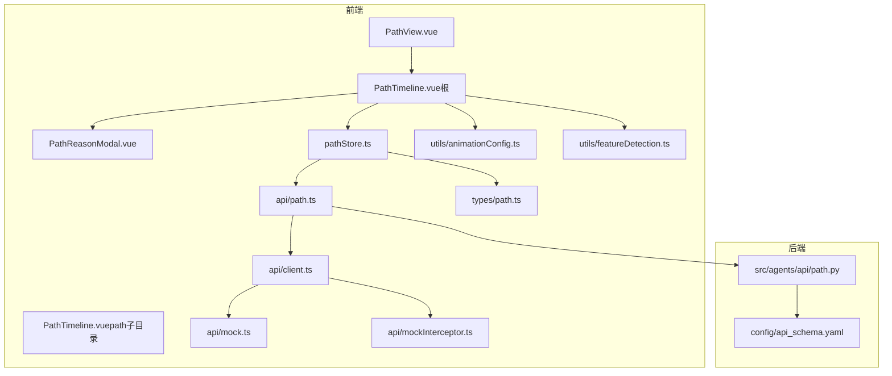
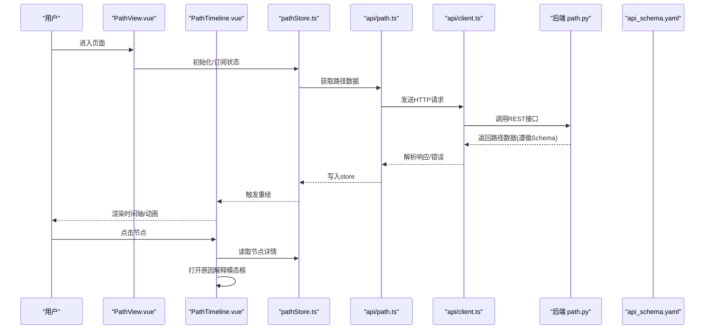
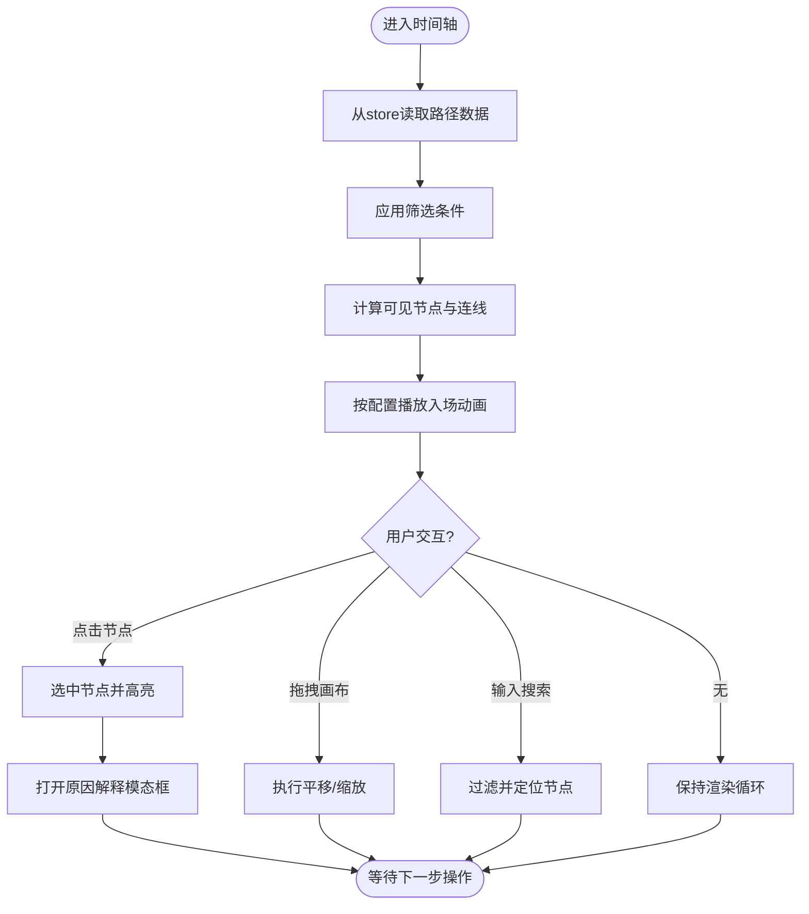
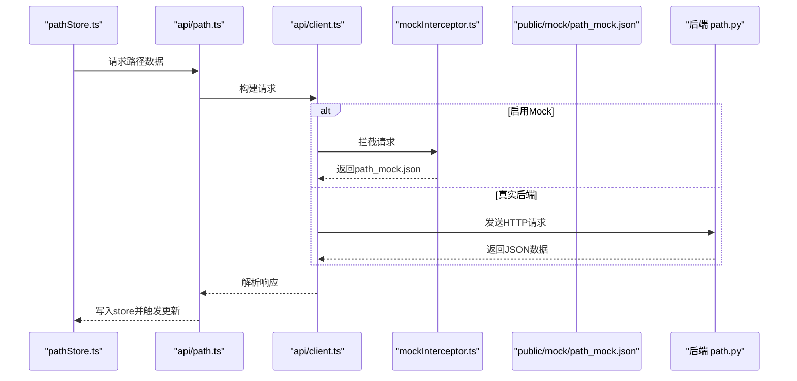
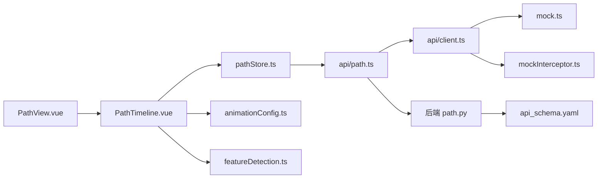

# 路径可视化展示

<cite>
**本文引用的文件**   
- [PathView.vue](file://frontend/src/views/PathView.vue)
- [PathTimeline.vue（根组件）](file://frontend/src/components/PathTimeline.vue)
- [PathTimeline.vue（path子目录）](file://frontend/src/components/path/PathTimeline.vue)
- [PathReasonModal.vue](file://frontend/src/components/path/PathReasonModal.vue)
- [path.ts（前端类型）](file://frontend/src/types/path.ts)
- [pathStore.ts](file://frontend/src/stores/pathStore.ts)
- [path.ts（前端API）](file://frontend/src/api/path.ts)
- [client.ts（HTTP客户端）](file://frontend/src/api/client.ts)
- [mock.ts（Mock开关）](file://frontend/src/api/mock.ts)
- [mockInterceptor.ts（Mock拦截器）](file://frontend/src/api/mockInterceptor.ts)
- [path_mock.json](file://frontend/public/mock/path_mock.json)
- [api_schema.yaml](file://config/api_schema.yaml)
- [path.py（后端API）](file://src/agents/api/path.py)
- [animationConfig.ts](file://frontend/src/utils/animationConfig.ts)
- [featureDetection.ts](file://frontend/src/utils/featureDetection.ts)
</cite>

## 目录
1. [简介](#简介)
2. [项目结构](#项目结构)
3. [核心组件](#核心组件)
4. [架构总览](#架构总览)
5. [详细组件分析](#详细组件分析)
6. [依赖关系分析](#依赖关系分析)
7. [性能考虑](#性能考虑)
8. [故障排查指南](#故障排查指南)
9. [结论](#结论)
10. [附录](#附录)

## 简介
本文件聚焦“路径可视化展示”的前端实现与前后端集成，围绕 PathView 页面、PathTimeline 时间轴组件、节点交互与动画、响应式布局、缩放平移、筛选、原因解释模态框、主题与国际化、3D图形集成方案、移动端适配、数据绑定与实时更新、错误处理等维度进行系统化说明。文档同时给出架构图、时序图与流程图，帮助读者快速理解从用户操作到渲染反馈的完整链路。

## 项目结构
路径可视化相关代码主要分布在以下位置：
- 视图层：PathView 作为入口页面，组织并承载时间轴与详情面板
- 组件层：PathTimeline 提供时间轴渲染、节点交互与动画；PathReasonModal 提供原因解释弹窗
- 状态层：pathStore 管理路径数据、选中项、筛选条件与加载状态
- API层：path.ts 封装路径相关接口调用，client.ts 提供统一 HTTP 客户端，mock.ts 与 mockInterceptor.ts 控制 Mock 行为
- 类型定义：types/path.ts 定义路径数据结构
- 配置与工具：animationConfig.ts 提供动画参数，featureDetection.ts 提供能力检测
- 后端：src/agents/api/path.py 暴露路径相关 REST 接口，config/api_schema.yaml 描述契约

图表来源
- [PathView.vue](file://frontend/src/views/PathView.vue)
- [PathTimeline.vue（根组件）](file://frontend/src/components/PathTimeline.vue)
- [PathTimeline.vue（path子目录）](file://frontend/src/components/path/PathTimeline.vue)
- [PathReasonModal.vue](file://frontend/src/components/path/PathReasonModal.vue)
- [pathStore.ts](file://frontend/src/stores/pathStore.ts)
- [path.ts（前端API）](file://frontend/src/api/path.ts)
- [client.ts（HTTP客户端）](file://frontend/src/api/client.ts)
- [mock.ts（Mock开关）](file://frontend/src/api/mock.ts)
- [mockInterceptor.ts（Mock拦截器）](file://frontend/src/api/mockInterceptor.ts)
- [path.ts（前端类型）](file://frontend/src/types/path.ts)
- [animationConfig.ts](file://frontend/src/utils/animationConfig.ts)
- [featureDetection.ts](file://frontend/src/utils/featureDetection.ts)
- [path.py（后端API）](file://src/agents/api/path.py)
- [api_schema.yaml](file://config/api_schema.yaml)

章节来源
- [PathView.vue](file://frontend/src/views/PathView.vue)
- [PathTimeline.vue（根组件）](file://frontend/src/components/PathTimeline.vue)
- [PathTimeline.vue（path子目录）](file://frontend/src/components/path/PathTimeline.vue)
- [PathReasonModal.vue](file://frontend/src/components/path/PathReasonModal.vue)
- [pathStore.ts](file://frontend/src/stores/pathStore.ts)
- [path.ts（前端API）](file://frontend/src/api/path.ts)
- [client.ts（HTTP客户端）](file://frontend/src/api/client.ts)
- [mock.ts（前端Mock开关）](file://frontend/src/api/mock.ts)
- [mockInterceptor.ts（Mock拦截器）](file://frontend/src/api/mockInterceptor.ts)
- [path.ts（前端类型）](file://frontend/src/types/path.ts)
- [animationConfig.ts](file://frontend/src/utils/animationConfig.ts)
- [featureDetection.ts](file://frontend/src/utils/featureDetection.ts)
- [path.py（后端API）](file://src/agents/api/path.py)
- [api_schema.yaml](file://config/api_schema.yaml)

## 核心组件
- PathView：页面级容器，负责初始化 pathStore、挂载 PathTimeline、承载详情面板与全局状态联动。
- PathTimeline：时间轴可视化核心，负责渲染节点序列、连线、标签、动画、缩放平移、筛选与交互事件派发。
- PathReasonModal：原因解释模态框，用于展示某节点的诊断依据、证据链与可操作反馈入口。
- pathStore：集中管理路径数据、当前选中节点、筛选条件、加载与错误状态，并提供异步获取与更新方法。
- api/path.ts：封装路径相关 API 调用，支持 Mock 切换与统一错误处理。
- client.ts：HTTP 客户端封装，提供请求/响应拦截、基础 URL、超时与重试策略。
- types/path.ts：路径模型、节点、步骤、指标等类型定义，保证前后端数据结构一致性。
- animationConfig.ts：动画时长、缓动函数、入场顺序等配置，便于主题化与性能调优。
- featureDetection.ts：浏览器能力检测（如 WebGL、Pointer Events），为 3D 与交互降级提供依据。

章节来源
- [PathView.vue](file://frontend/src/views/PathView.vue)
- [PathTimeline.vue（根组件）](file://frontend/src/components/PathTimeline.vue)
- [PathTimeline.vue（path子目录）](file://frontend/src/components/path/PathTimeline.vue)
- [PathReasonModal.vue](file://frontend/src/components/path/PathReasonModal.vue)
- [pathStore.ts](file://frontend/src/stores/pathStore.ts)
- [path.ts（前端API）](file://frontend/src/api/path.ts)
- [client.ts（HTTP客户端）](file://frontend/src/api/client.ts)
- [path.ts（前端类型）](file://frontend/src/types/path.ts)
- [animationConfig.ts](file://frontend/src/utils/animationConfig.ts)
- [featureDetection.ts](file://frontend/src/utils/featureDetection.ts)

## 架构总览
路径可视化的整体流程如下：
- 用户在 PathView 中触发加载或交互
- PathTimeline 通过 pathStore 发起数据请求（api/path.ts → client.ts）
- 后端 path.py 根据 api_schema.yaml 返回路径数据
- 前端将数据写入 store，驱动时间轴重绘
- 用户点击节点时，打开 PathReasonModal 展示原因解释
- 动画与交互由 animationConfig.ts 与 featureDetection.ts 协同控制

图表来源
- [PathView.vue](file://frontend/src/views/PathView.vue)
- [PathTimeline.vue（根组件）](file://frontend/src/components/PathTimeline.vue)
- [pathStore.ts](file://frontend/src/stores/pathStore.ts)
- [path.ts（前端API）](file://frontend/src/api/path.ts)
- [client.ts（HTTP客户端）](file://frontend/src/api/client.ts)
- [path.py（后端API）](file://src/agents/api/path.py)
- [api_schema.yaml](file://config/api_schema.yaml)

## 详细组件分析

### PathView 页面
- 职责：作为路径可视化页面的入口，负责初始化 pathStore、挂载 PathTimeline、承载详情区域与全局提示。
- 关键逻辑：
  - 在页面激活时触发路径数据加载
  - 监听路由参数变化以刷新路径上下文
  - 向子组件传递筛选条件与主题配置
- 交互：
  - 顶部导航与面包屑
  - 全屏/导出按钮（可选）
  - 与诊断、资源等模块的跳转

章节来源
- [PathView.vue](file://frontend/src/views/PathView.vue)

### PathTimeline 时间轴组件
- 职责：渲染路径节点序列、连线、标签、状态标记，并提供缩放平移、筛选、点击、悬停等交互。
- 渲染引擎要点：
  - 基于 DOM/SVG 的矢量绘制，结合 CSS Transform 实现缩放平移
  - 使用 requestAnimationFrame 与 animationConfig.ts 中的缓动函数驱动入场动画
  - 对大量节点采用虚拟滚动或分片渲染策略（按视口裁剪）
- 交互与事件：
  - 点击节点：选中并高亮，弹出原因解释模态框
  - 拖拽画布：平移与缩放，边界限制与惯性回弹
  - 键盘可达性：Tab 导航与 Enter/Space 选择
- 筛选与搜索：
  - 按阶段、难度、知识点、完成状态等多维筛选
  - 实时搜索匹配节点标题/标签
- 响应式布局：
  - 小屏自动切换为纵向时间轴或卡片模式
  - 字体、间距、图标尺寸随断点调整
- 主题与样式：
  - 通过 CSS 变量与 Tailwind 自定义类名实现主题切换
  - 支持明暗主题、品牌色替换、节点形状定制

图表来源
- [PathTimeline.vue（根组件）](file://frontend/src/components/PathTimeline.vue)
- [PathTimeline.vue（path子目录）](file://frontend/src/components/path/PathTimeline.vue)
- [pathStore.ts](file://frontend/src/stores/pathStore.ts)
- [animationConfig.ts](file://frontend/src/utils/animationConfig.ts)

章节来源
- [PathTimeline.vue（根组件）](file://frontend/src/components/PathTimeline.vue)
- [PathTimeline.vue（path子目录）](file://frontend/src/components/path/PathTimeline.vue)
- [animationConfig.ts](file://frontend/src/utils/animationConfig.ts)

### PathReasonModal 原因解释模态框
- 职责：展示选中节点的原因解释、证据链、关联知识与建议行动。
- 数据来源：
  - 从 pathStore 读取节点详情与诊断结果
  - 必要时通过 API 拉取更详细的解释文本或图片
- 交互：
  - 关闭、复制、分享、反馈收集
  - 跳转到相关资源或练习
- 可访问性：
  - 焦点陷阱、ESC 关闭、ARIA 属性完善

章节来源
- [PathReasonModal.vue](file://frontend/src/components/path/PathReasonModal.vue)
- [pathStore.ts](file://frontend/src/stores/pathStore.ts)

### pathStore 状态管理
- 职责：集中管理路径数据、当前选中节点、筛选条件、加载与错误状态。
- 关键方法：
  - 加载路径数据（支持分页/增量更新）
  - 更新筛选条件与搜索关键字
  - 设置选中节点与详情缓存
  - 错误捕获与重试
- 与 API 的协作：
  - 调用 api/path.ts 获取数据
  - 处理网络异常、超时与幂等性

章节来源
- [pathStore.ts](file://frontend/src/stores/pathStore.ts)
- [path.ts（前端API）](file://frontend/src/api/path.ts)

### API 层与数据绑定
- api/path.ts：
  - 封装 GET/POST 等路径相关接口
  - 统一序列化/反序列化，映射到 types/path.ts
  - 支持 Mock 开关与本地缓存
- client.ts：
  - 提供基础 URL、鉴权头、超时、重试、错误码映射
  - 请求/响应拦截日志与埋点
- Mock 机制：
  - mock.ts 控制是否启用 Mock
  - mockInterceptor.ts 拦截请求并返回 public/mock/path_mock.json 示例数据

图表来源
- [pathStore.ts](file://frontend/src/stores/pathStore.ts)
- [path.ts（前端API）](file://frontend/src/api/path.ts)
- [client.ts（HTTP客户端）](file://frontend/src/api/client.ts)
- [mockInterceptor.ts（Mock拦截器）](file://frontend/src/api/mockInterceptor.ts)
- [path_mock.json](file://frontend/public/mock/path_mock.json)
- [path.py（后端API）](file://src/agents/api/path.py)

章节来源
- [path.ts（前端API）](file://frontend/src/api/path.ts)
- [client.ts（HTTP客户端）](file://frontend/src/api/client.ts)
- [mock.ts（前端Mock开关）](file://frontend/src/api/mock.ts)
- [mockInterceptor.ts（Mock拦截器）](file://frontend/src/api/mockInterceptor.ts)
- [path_mock.json](file://frontend/public/mock/path_mock.json)
- [path.py（后端API）](file://src/agents/api/path.py)

### 类型定义与契约
- types/path.ts：
  - 定义路径、节点、步骤、指标、筛选条件等类型
  - 约束字段必填、枚举值与范围
- api_schema.yaml：
  - 描述后端接口契约（请求/响应结构、字段含义、错误码）
  - 用于前后端联调与自动化测试

章节来源
- [path.ts（前端类型）](file://frontend/src/types/path.ts)
- [api_schema.yaml](file://config/api_schema.yaml)

## 依赖关系分析
- 组件耦合：
  - PathView 仅负责装配与状态注入，低耦合
  - PathTimeline 依赖 pathStore 与 animationConfig，内聚于渲染与交互
  - PathReasonModal 依赖 pathStore 与资源/诊断模块
- 外部依赖：
  - HTTP 客户端与 Mock 拦截器
  - 浏览器能力检测（WebGL、Pointer Events）
- 潜在循环依赖：
  - 确保组件不直接互相引用，而是通过 store 或事件总线通信

图表来源
- [PathView.vue](file://frontend/src/views/PathView.vue)
- [PathTimeline.vue（根组件）](file://frontend/src/components/PathTimeline.vue)
- [pathStore.ts](file://frontend/src/stores/pathStore.ts)
- [animationConfig.ts](file://frontend/src/utils/animationConfig.ts)
- [featureDetection.ts](file://frontend/src/utils/featureDetection.ts)
- [path.ts（前端API）](file://frontend/src/api/path.ts)
- [client.ts（HTTP客户端）](file://frontend/src/api/client.ts)
- [mock.ts（前端Mock开关）](file://frontend/src/api/mock.ts)
- [mockInterceptor.ts（Mock拦截器）](file://frontend/src/api/mockInterceptor.ts)
- [path.py（后端API）](file://src/agents/api/path.py)
- [api_schema.yaml](file://config/api_schema.yaml)

章节来源
- [PathTimeline.vue（根组件）](file://frontend/src/components/PathTimeline.vue)
- [pathStore.ts](file://frontend/src/stores/pathStore.ts)
- [path.ts（前端API）](file://frontend/src/api/path.ts)
- [client.ts（HTTP客户端）](file://frontend/src/api/client.ts)
- [mock.ts（前端Mock开关）](file://frontend/src/api/mock.ts)
- [mockInterceptor.ts（Mock拦截器）](file://frontend/src/api/mockInterceptor.ts)
- [path.py（后端API）](file://src/agents/api/path.py)
- [api_schema.yaml](file://config/api_schema.yaml)

## 性能考虑
- 渲染优化：
  - 按需渲染：仅绘制视口内节点与连线
  - 防抖/节流：缩放与拖拽时使用节流减少重排
  - 动画合并：批量更新 transform，避免频繁回流
- 内存管理：
  - 大列表虚拟滚动，及时销毁不可见节点
  - 事件解绑与定时器清理
- 网络优化：
  - 请求缓存与增量更新
  - 失败重试与退避策略
- 移动端适配：
  - 触摸手势优化与长按菜单
  - 降低动画复杂度与帧率自适应

[本节为通用指导，无需列出具体文件来源]

## 故障排查指南
- 常见问题：
  - 路径数据为空：检查 pathStore 加载逻辑与 API 返回结构是否符合 types/path.ts
  - 节点无法点击：确认事件冒泡与 Pointer Events 兼容性
  - 动画卡顿：降低动画时长或禁用复杂效果
  - Mock 未生效：检查 mock.ts 开关与 mockInterceptor.ts 拦截规则
- 调试建议：
  - 在 client.ts 的请求/响应拦截处打印日志
  - 使用浏览器开发者工具观察重排与重绘
  - 对比 api_schema.yaml 与实际返回结构差异

章节来源
- [pathStore.ts](file://frontend/src/stores/pathStore.ts)
- [path.ts（前端API）](file://frontend/src/api/path.ts)
- [client.ts（HTTP客户端）](file://frontend/src/api/client.ts)
- [mock.ts（前端Mock开关）](file://frontend/src/api/mock.ts)
- [mockInterceptor.ts（Mock拦截器）](file://frontend/src/api/mockInterceptor.ts)
- [path.ts（前端类型）](file://frontend/src/types/path.ts)
- [api_schema.yaml](file://config/api_schema.yaml)

## 结论
PathView 与 PathTimeline 共同构成了路径可视化的核心体验：前者负责页面编排与状态注入，后者承担渲染、交互与动画。通过 pathStore 统一管理数据与状态，配合 api/path.ts 与 client.ts 的数据绑定与错误处理，实现了稳定可靠的路径展示。借助 animationConfig.ts 与 featureDetection.ts，系统可在不同设备与能力下提供一致的体验。未来可进一步引入 3D 图形、SSE 实时更新与更丰富的主题与国际化支持。

[本节为总结，无需列出具体文件来源]

## 附录

### 自定义主题配置
- 通过 CSS 变量与 Tailwind 自定义类名覆盖颜色、圆角、阴影与字体
- 在 PathTimeline 中读取主题配置并应用到节点、连线与标签
- 支持明暗主题切换与品牌色动态替换

章节来源
- [PathTimeline.vue（根组件）](file://frontend/src/components/PathTimeline.vue)
- [animationConfig.ts](file://frontend/src/utils/animationConfig.ts)

### 国际化支持
- 文案抽取至 i18n 资源文件，按语言包切换
- 时间轴标签、模态框文案与错误提示均支持多语言
- 日期、数字与单位格式化遵循区域设置

章节来源
- [PathTimeline.vue（根组件）](file://frontend/src/components/PathTimeline.vue)
- [PathReasonModal.vue](file://frontend/src/components/path/PathReasonModal.vue)

### 3D 路径图形集成方案
- 使用 featureDetection.ts 检测 WebGL 能力
- 在高性能设备上启用 3D 场景，否则回退到 2D 渲染
- 3D 场景与 2D 时间轴共享 pathStore 数据源，保持状态一致

章节来源
- [featureDetection.ts](file://frontend/src/utils/featureDetection.ts)
- [PathTimeline.vue（根组件）](file://frontend/src/components/PathTimeline.vue)

### 移动端适配策略
- 触控手势：单指平移、双指缩放、长按弹出菜单
- 布局断点：小屏切换为纵向时间轴或卡片模式
- 性能降级：减少粒子与阴影，降低动画帧率

章节来源
- [PathTimeline.vue（根组件）](file://frontend/src/components/PathTimeline.vue)
- [featureDetection.ts](file://frontend/src/utils/featureDetection.ts)

### 与后端 API 的数据绑定与实时更新
- 数据绑定：pathStore 调用 api/path.ts，client.ts 统一处理请求与响应
- 实时更新：可通过 SSE 或轮询方式推送路径变更，pathStore 接收后触发重绘
- 错误处理：网络异常、超时、业务错误码统一映射与提示

章节来源
- [pathStore.ts](file://frontend/src/stores/pathStore.ts)
- [path.ts（前端API）](file://frontend/src/api/path.ts)
- [client.ts（HTTP客户端）](file://frontend/src/api/client.ts)
- [path.py（后端API）](file://src/agents/api/path.py)