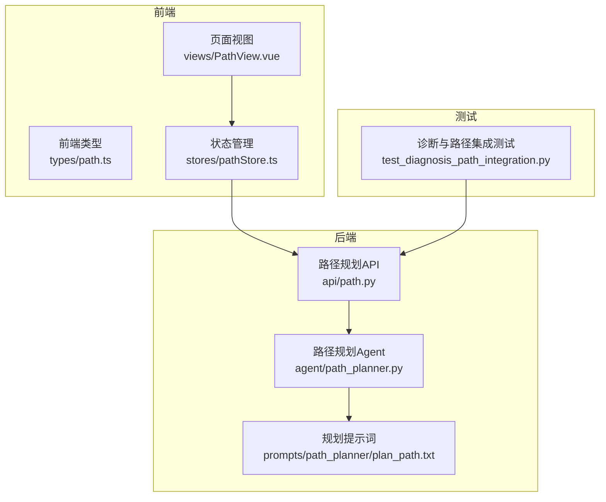
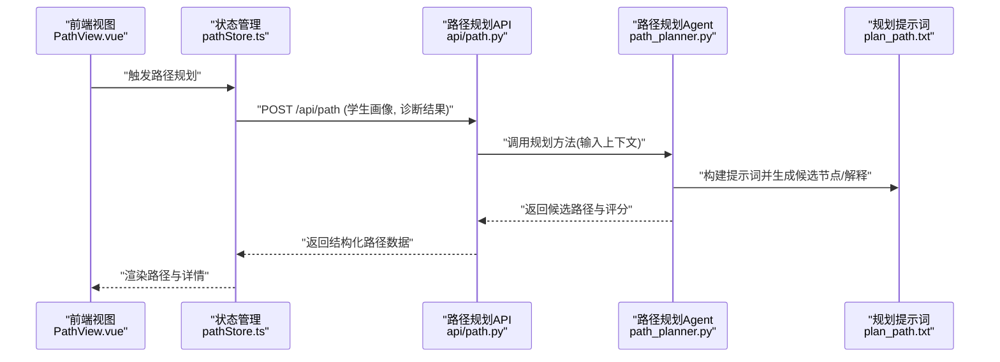
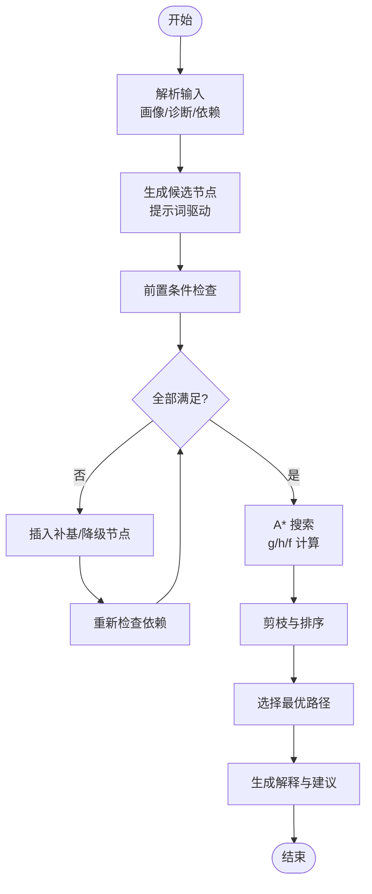
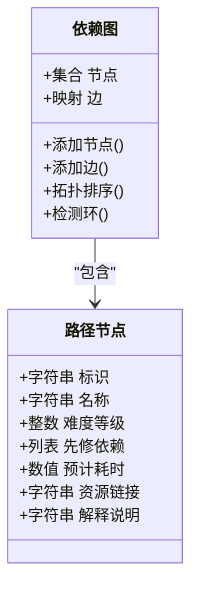
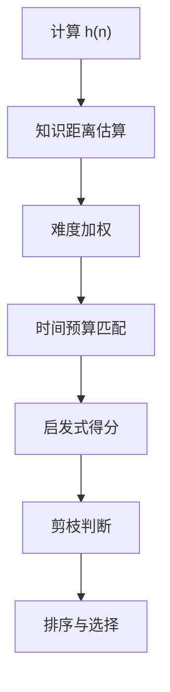
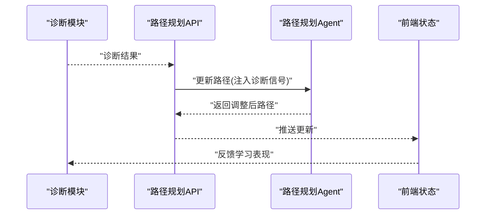
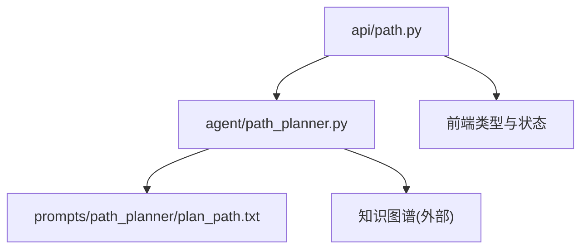

# 路径规划算法

<cite>
**本文引用的文件**   
- [src/loopse/agent/path_planner.py](file://src/loopse/agent/path_planner.py)
- [src/loopse/api/path.py](file://src/loopse/api/path.py)
- [config/prompts/path_planner/plan_path.txt](file://config/prompts/path_planner/plan_path.txt)
- [frontend/src/types/path.ts](file://frontend/src/types/path.ts)
- [frontend/src/stores/pathStore.ts](file://frontend/src/stores/pathStore.ts)
- [frontend/src/views/PathView.vue](file://frontend/src/views/PathView.vue)
- [tests/unit/test_diagnosis_path_integration.py](file://tests/unit/test_diagnosis_path_integration.py)
</cite>

## 目录
1. [简介](#简介)
2. [项目结构](#项目结构)
3. [核心组件](#核心组件)
4. [架构总览](#架构总览)
5. [详细组件分析](#详细组件分析)
6. [依赖分析](#依赖分析)
7. [性能考虑](#性能考虑)
8. [故障排查指南](#故障排查指南)
9. [结论](#结论)
10. [附录](#附录)

## 简介
本文件面向“路径规划算法”的技术文档，聚焦于 PathPlanner 的核心实现与工程化落地。内容覆盖：
- 基于学生画像的个性化路径生成
- 知识依赖关系分析与难度梯度计算
- 路径节点设计模式、前置条件检查与动态调整策略
- A* 搜索在路径规划中的应用、启发式函数设计与剪枝优化
- 路径质量评估指标、多目标优化与冲突解决机制
- 参数调优指南、基准测试方法与扩展新技能树的示例
- 将认知诊断结果集成到路径规划中，实现自适应学习路线的动态更新

## 项目结构
围绕路径规划的关键代码分布在后端 Agent、API 层、前端类型与视图以及提示词模板中：
- 后端 Agent：path_planner.py 提供路径规划核心逻辑
- API 层：path.py 暴露路径规划接口
- 提示词：plan_path.txt 定义 LLM 参与的路径规划提示模板
- 前端：types/path.ts、stores/pathStore.ts、views/PathView.vue 负责数据模型、状态管理与可视化
- 测试：test_diagnosis_path_integration.py 验证诊断与路径规划的集成

图表来源
- [src/loopse/api/path.py](file://src/loopse/api/path.py)
- [src/loopse/agent/path_planner.py](file://src/loopse/agent/path_planner.py)
- [config/prompts/path_planner/plan_path.txt](file://config/prompts/path_planner/plan_path.txt)
- [frontend/src/types/path.ts](file://frontend/src/types/path.ts)
- [frontend/src/stores/pathStore.ts](file://frontend/src/stores/pathStore.ts)
- [frontend/src/views/PathView.vue](file://frontend/src/views/PathView.vue)
- [tests/unit/test_diagnosis_path_integration.py](file://tests/unit/test_diagnosis_path_integration.py)

章节来源
- [src/loopse/agent/path_planner.py](file://src/loopse/agent/path_planner.py)
- [src/loopse/api/path.py](file://src/loopse/api/path.py)
- [config/prompts/path_planner/plan_path.txt](file://config/prompts/path_planner/plan_path.txt)
- [frontend/src/types/path.ts](file://frontend/src/types/path.ts)
- [frontend/src/stores/pathStore.ts](file://frontend/src/stores/pathStore.ts)
- [frontend/src/views/PathView.vue](file://frontend/src/views/PathView.vue)
- [tests/unit/test_diagnosis_path_integration.py](file://tests/unit/test_diagnosis_path_integration.py)

## 核心组件
- 路径规划 Agent（PathPlanner）
  - 输入：学生画像、当前能力证据、知识图谱依赖、诊断结果、约束（时间、资源、偏好）
  - 输出：个性化学习路径（节点序列）、难度梯度、前置条件校验结果、动态调整建议
  - 关键流程：需求解析 → 候选节点生成 → 依赖与前置条件检查 → A* 搜索 → 启发式评分 → 剪枝与排序 → 路径合成与解释
- 路径规划 API
  - 接收前端请求，调用 PathPlanner，返回结构化路径数据
- 提示词模板
  - 用于引导 LLM 生成符合教学目标的节点描述、难度标注与解释说明
- 前端类型与状态
  - 定义路径节点、依赖关系、难度等级等数据结构
  - 管理路径加载、渲染与交互
- 集成测试
  - 验证诊断结果对路径生成的影响与闭环反馈

章节来源
- [src/loopse/agent/path_planner.py](file://src/loopse/agent/path_planner.py)
- [src/loopse/api/path.py](file://src/loopse/api/path.py)
- [config/prompts/path_planner/plan_path.txt](file://config/prompts/path_planner/plan_path.txt)
- [frontend/src/types/path.ts](file://frontend/src/types/path.ts)
- [frontend/src/stores/pathStore.ts](file://frontend/src/stores/pathStore.ts)
- [frontend/src/views/PathView.vue](file://frontend/src/views/PathView.vue)
- [tests/unit/test_diagnosis_path_integration.py](file://tests/unit/test_diagnosis_path_integration.py)

## 架构总览
下图展示从前端到后端的端到端路径规划流程，包括 A* 搜索、启发式评分与剪枝优化的关键环节。

图表来源
- [frontend/src/views/PathView.vue](file://frontend/src/views/PathView.vue)
- [frontend/src/stores/pathStore.ts](file://frontend/src/stores/pathStore.ts)
- [src/loopse/api/path.py](file://src/loopse/api/path.py)
- [src/loopse/agent/path_planner.py](file://src/loopse/agent/path_planner.py)
- [config/prompts/path_planner/plan_path.txt](file://config/prompts/path_planner/plan_path.txt)

## 详细组件分析

### PathPlanner 核心算法
- 输入建模
  - 学生画像：兴趣、基础水平、学习目标、可用时间
  - 诊断结果：薄弱点、错误模式、根因分析
  - 知识依赖：节点间先修关系、难度层级
- 候选节点生成
  - 基于画像与诊断筛选相关知识点
  - 使用提示词模板生成节点描述、难度标签与解释
- 前置条件检查
  - 遍历依赖图，确保每个节点的前置条件已满足
  - 不满足时插入补基节点或降级路径
- A* 搜索
  - 节点代价 g(n)：累计难度与时间成本
  - 启发式 h(n)：估计到达目标的最小剩余难度与时间
  - f(n) = g(n) + h(n)，优先扩展更优节点
- 剪枝与排序
  - 剪枝：移除违反前置条件、超出时间预算、重复访问的节点
  - 排序：按 f(n)、难度梯度、多样性指标综合排序
- 路径合成与解释
  - 选择最优路径，生成可解释的学习顺序与理由
  - 输出动态调整建议（如遇到瓶颈时的回退策略）

图表来源
- [src/loopse/agent/path_planner.py](file://src/loopse/agent/path_planner.py)
- [config/prompts/path_planner/plan_path.txt](file://config/prompts/path_planner/plan_path.txt)

章节来源
- [src/loopse/agent/path_planner.py](file://src/loopse/agent/path_planner.py)
- [config/prompts/path_planner/plan_path.txt](file://config/prompts/path_planner/plan_path.txt)

### 节点设计模式与数据结构
- 节点属性
  - 标识、名称、难度等级、先修依赖、预计耗时、资源链接、解释说明
- 依赖关系
  - 有向无环图（DAG），支持多级先修与并行分支
- 难度梯度
  - 相邻节点难度差控制在合理区间，避免跳跃过大
- 动态调整
  - 根据学习进度与表现实时重算 f(n)，必要时切换分支

图表来源
- [frontend/src/types/path.ts](file://frontend/src/types/path.ts)
- [src/loopse/agent/path_planner.py](file://src/loopse/agent/path_planner.py)

章节来源
- [frontend/src/types/path.ts](file://frontend/src/types/path.ts)
- [src/loopse/agent/path_planner.py](file://src/loopse/agent/path_planner.py)

### 启发式函数设计与剪枝优化
- 启发式函数 h(n)
  - 基于剩余目标的知识距离与难度加权
  - 结合学生画像的兴趣权重与时间预算
- 剪枝策略
  - 前置条件不满足直接剪枝
  - 超过时间预算或重复访问剪枝
  - 低多样性或高冗余路径剪枝
- 排序与选择
  - 综合 f(n)、难度梯度、多样性、解释质量进行排序

图表来源
- [src/loopse/agent/path_planner.py](file://src/loopse/agent/path_planner.py)

章节来源
- [src/loopse/agent/path_planner.py](file://src/loopse/agent/path_planner.py)

### 多目标优化与冲突解决
- 多目标
  - 最短路径（时间最小）
  - 难度平滑（梯度稳定）
  - 个性化（兴趣与目标匹配）
  - 解释性（可理解性与透明度）
- 冲突解决
  - 权重调节：根据用户偏好动态调整各目标权重
  - 分层决策：先满足前置条件与时间预算，再优化其他目标
  - 回退策略：当某分支不可行时自动切换到次优路径

章节来源
- [src/loopse/agent/path_planner.py](file://src/loopse/agent/path_planner.py)

### 路径质量评估指标
- 完整性：是否覆盖所有必要知识点
- 可达性：是否存在可行的依赖路径
- 平滑度：难度梯度的方差与最大跳变
- 效率：总时长与平均节点耗时
- 个性化：与画像和目标的相关性
- 可解释性：解释文本的质量与一致性

章节来源
- [src/loopse/agent/path_planner.py](file://src/loopse/agent/path_planner.py)

### 集成诊断结果与动态更新
- 诊断输入
  - 薄弱点、错误模式、根因分析
- 路径调整
  - 针对薄弱点插入针对性练习与讲解
  - 根据错误模式调整资源类型与难度
- 动态更新
  - 学习过程中持续收集证据，重算 f(n) 并调整路径
  - 触发条件：连续失败、超时、兴趣变化

图表来源
- [src/loopse/api/path.py](file://src/loopse/api/path.py)
- [src/loopse/agent/path_planner.py](file://src/loopse/agent/path_planner.py)
- [frontend/src/stores/pathStore.ts](file://frontend/src/stores/pathStore.ts)
- [tests/unit/test_diagnosis_path_integration.py](file://tests/unit/test_diagnosis_path_integration.py)

章节来源
- [src/loopse/api/path.py](file://src/loopse/api/path.py)
- [src/loopse/agent/path_planner.py](file://src/loopse/agent/path_planner.py)
- [frontend/src/stores/pathStore.ts](file://frontend/src/stores/pathStore.ts)
- [tests/unit/test_diagnosis_path_integration.py](file://tests/unit/test_diagnosis_path_integration.py)

### 参数调优指南
- 启发式权重
  - 调整知识距离与难度权重的比例以平衡探索与利用
- 时间预算
  - 设置合理的总时长上限，避免过长路径
- 难度阈值
  - 控制相邻节点难度差，保证学习曲线平滑
- 多样性系数
  - 防止路径过于单一，提升学习兴趣
- 解释质量阈值
  - 过滤低质量解释，提高透明度

章节来源
- [src/loopse/agent/path_planner.py](file://src/loopse/agent/path_planner.py)

### 性能基准测试
- 测试场景
  - 不同规模知识图谱（节点数、边密度）
  - 不同画像复杂度（兴趣维度、目标数量）
  - 不同诊断信号强度（薄弱点数量、错误模式复杂度）
- 指标
  - 规划耗时、内存占用、路径长度、难度方差
- 工具与方法
  - 单元测试与集成测试结合
  - 模拟数据生成与压力测试

章节来源
- [tests/unit/test_diagnosis_path_integration.py](file://tests/unit/test_diagnosis_path_integration.py)

### 扩展新技能树开发示例
- 步骤
  - 定义新技能节点与依赖关系
  - 更新提示词模板以适配新领域
  - 在前端类型中添加新字段
  - 编写测试用例验证新技能树的路径生成
- 注意事项
  - 保持 DAG 无环
  - 确保难度梯度合理
  - 提供充分的解释文本

章节来源
- [config/prompts/path_planner/plan_path.txt](file://config/prompts/path_planner/plan_path.txt)
- [frontend/src/types/path.ts](file://frontend/src/types/path.ts)
- [src/loopse/agent/path_planner.py](file://src/loopse/agent/path_planner.py)

## 依赖分析
- 组件耦合
  - API 与 Agent 松耦合，通过明确接口通信
  - 前端与后端通过类型定义保持一致
- 外部依赖
  - LLM 服务用于生成解释与候选节点
  - 知识图谱存储用于依赖查询
- 潜在循环依赖
  - 需确保依赖图为 DAG，避免环

图表来源
- [src/loopse/api/path.py](file://src/loopse/api/path.py)
- [src/loopse/agent/path_planner.py](file://src/loopse/agent/path_planner.py)
- [config/prompts/path_planner/plan_path.txt](file://config/prompts/path_planner/plan_path.txt)
- [frontend/src/types/path.ts](file://frontend/src/types/path.ts)
- [frontend/src/stores/pathStore.ts](file://frontend/src/stores/pathStore.ts)

章节来源
- [src/loopse/api/path.py](file://src/loopse/api/path.py)
- [src/loopse/agent/path_planner.py](file://src/loopse/agent/path_planner.py)
- [config/prompts/path_planner/plan_path.txt](file://config/prompts/path_planner/plan_path.txt)
- [frontend/src/types/path.ts](file://frontend/src/types/path.ts)
- [frontend/src/stores/pathStore.ts](file://frontend/src/stores/pathStore.ts)

## 性能考虑
- 缓存策略
  - 缓存常用子路径与启发式结果
- 并行计算
  - 并行评估候选节点与依赖检查
- 增量更新
  - 仅重算受影响部分，避免全量重规划
- 资源限制
  - 控制 LLM 调用频率与上下文长度

[本节为通用指导，无需特定文件来源]

## 故障排查指南
- 常见问题
  - 前置条件不满足导致路径不可达
  - 启发式函数偏差导致搜索效率低下
  - 解释文本质量不稳定
- 排查步骤
  - 检查依赖图是否有环
  - 调整启发式权重与剪枝阈值
  - 优化提示词模板以提升解释质量
- 日志与监控
  - 记录规划过程的关键指标与中间结果

章节来源
- [src/loopse/agent/path_planner.py](file://src/loopse/agent/path_planner.py)
- [config/prompts/path_planner/plan_path.txt](file://config/prompts/path_planner/plan_path.txt)

## 结论
PathPlanner 通过结合学生画像、诊断结果与知识依赖，实现了个性化、可解释且动态可调的学习路径规划。A* 搜索与启发式函数确保了搜索效率，剪枝与多目标优化提升了路径质量。通过完善的测试与参数调优指南，系统具备良好的可扩展性与鲁棒性。

[本节为总结，无需特定文件来源]

## 附录
- 术语表
  - 学生画像：描述学习者特征的结构化数据
  - 知识依赖：知识点之间的先修关系
  - 启发式函数：估计剩余成本的函数
  - 剪枝：在搜索过程中排除无效分支
- 参考实现
  - 前端类型定义与状态管理
  - 后端 API 与 Agent 实现
  - 提示词模板与测试用例

[本节为补充信息，无需特定文件来源]