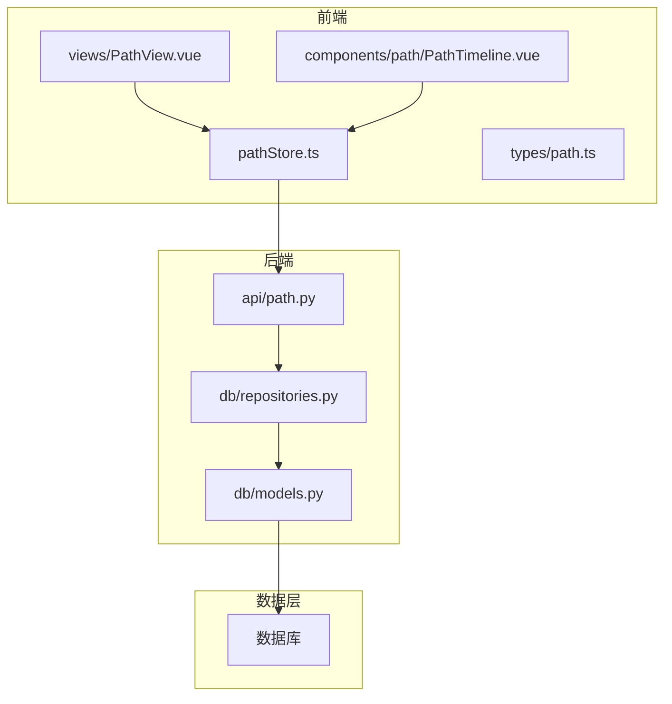
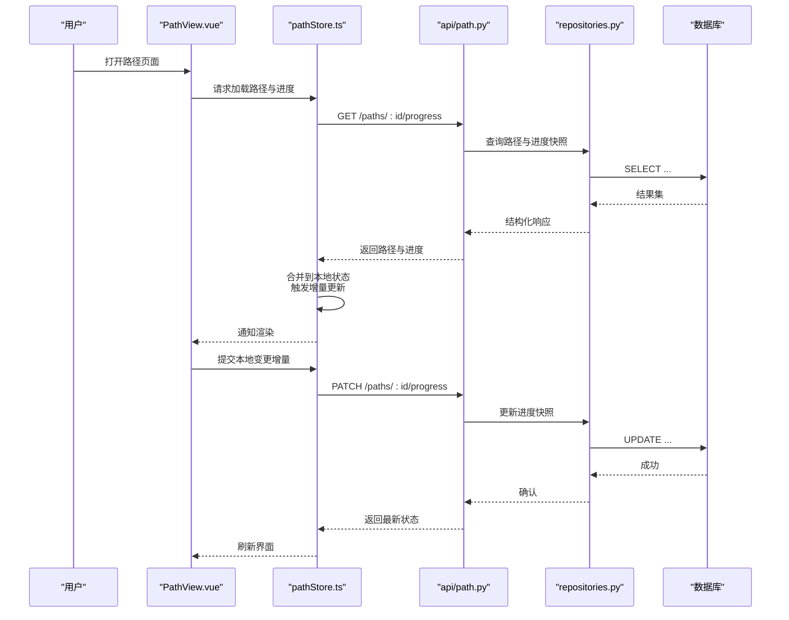
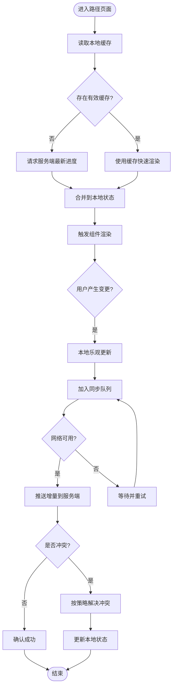
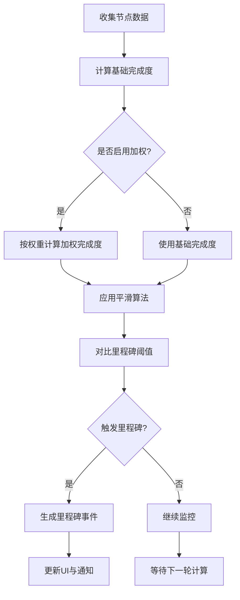
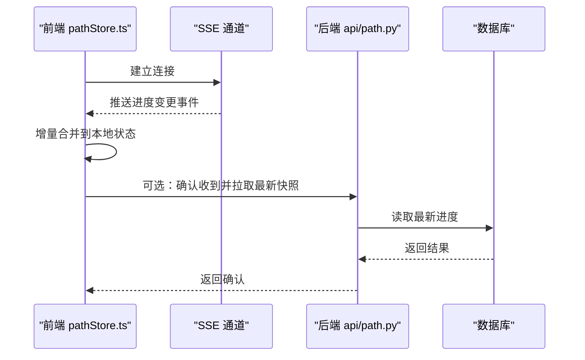
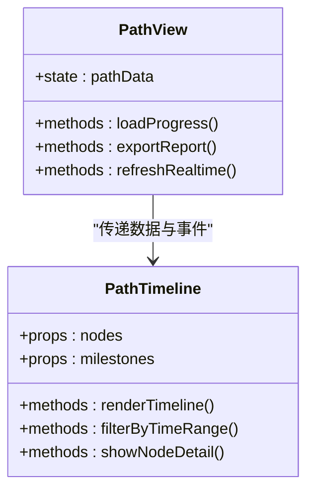
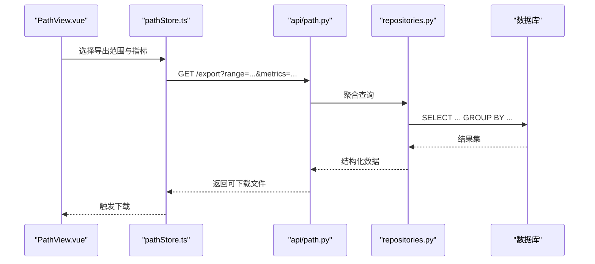
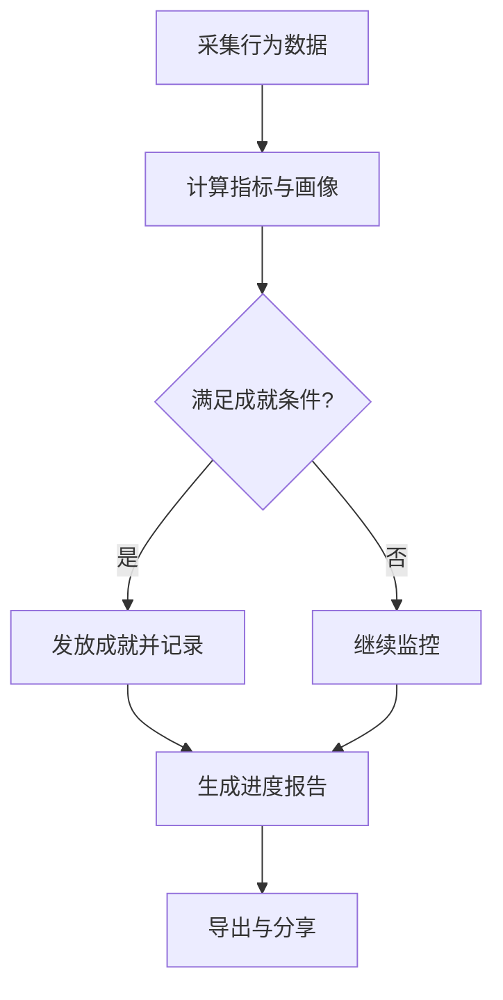
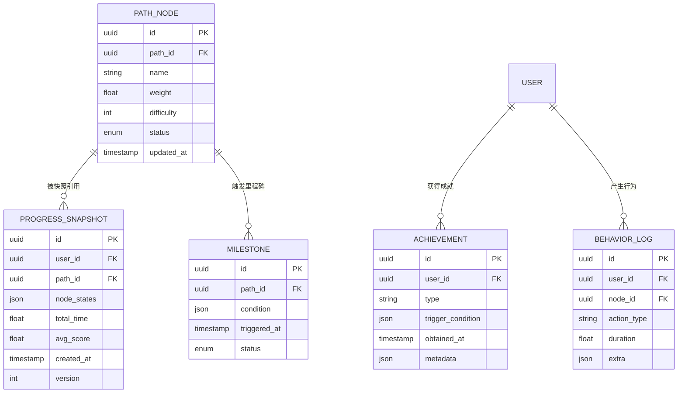
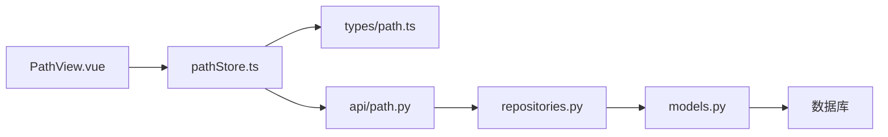

# 进度跟踪系统

<cite>
**本文引用的文件**   
- [src/loopse/db/models.py](file://src/loopse/db/models.py)
- [src/loopse/db/repositories.py](file://src/loopse/db/repositories.py)
- [src/loopse/api/path.py](file://src/loopse/api/path.py)
- [frontend/src/stores/pathStore.ts](file://frontend/src/stores/pathStore.ts)
- [frontend/src/types/path.ts](file://frontend/src/types/path.ts)
- [frontend/src/components/path/PathTimeline.vue](file://frontend/src/components/path/PathTimeline.vue)
- [frontend/src/views/PathView.vue](file://frontend/src/views/PathView.vue)
- [scripts/init_db.py](file://scripts/init_db.py)
</cite>

## 目录
1. [简介](#简介)
2. [项目结构](#项目结构)
3. [核心组件](#核心组件)
4. [架构总览](#架构总览)
5. [详细组件分析](#详细组件分析)
6. [依赖关系分析](#依赖关系分析)
7. [性能考虑](#性能考虑)
8. [故障排查指南](#故障排查指南)
9. [结论](#结论)
10. [附录](#附录)

## 简介
本文件面向“进度跟踪系统”的完整设计与实现，覆盖学习进度的数据采集、存储结构与更新机制；重点阐述 PathStore 的状态管理模式（路径状态同步、增量更新与冲突解决）；定义进度指标、完成度计算算法与里程碑检测逻辑；提供实时进度同步、离线缓存与网络异常处理方案；给出可视化组件使用指南、自定义指标配置与数据导出能力；并说明如何集成学习行为分析、成就系统与进度报告生成。同时包含数据库表结构设计、索引优化与查询性能调优方法。

## 项目结构
进度跟踪系统由前端状态管理、API 接口、后端持久化与脚本初始化等部分组成：
- 前端
  - 状态管理：pathStore.ts 负责路径与进度数据的本地状态、增量合并与冲突策略
  - 类型定义：path.ts 定义路径节点、任务、里程碑、进度快照等数据结构
  - 视图与组件：PathView.vue 页面承载整体流程，PathTimeline.vue 渲染时间线与里程碑
- 后端
  - API：path.py 暴露路径与进度相关接口，支持读取、写入、增量同步与批量操作
  - 数据模型与仓库：models.py 与 repositories.py 定义实体、关系与访问层
- 初始化
  - scripts/init_db.py 用于数据库建表与初始数据注入

**图示来源** 
- [frontend/src/stores/pathStore.ts](file://frontend/src/stores/pathStore.ts)
- [frontend/src/types/path.ts](file://frontend/src/types/path.ts)
- [frontend/src/views/PathView.vue](file://frontend/src/views/PathView.vue)
- [frontend/src/components/path/PathTimeline.vue](file://frontend/src/components/path/PathTimeline.vue)
- [src/loopse/api/path.py](file://src/loopse/api/path.py)
- [src/loopse/db/repositories.py](file://src/loopse/db/repositories.py)
- [src/loopse/db/models.py](file://src/loopse/db/models.py)

**章节来源**
- [frontend/src/stores/pathStore.ts](file://frontend/src/stores/pathStore.ts)
- [frontend/src/types/path.ts](file://frontend/src/types/path.ts)
- [frontend/src/views/PathView.vue](file://frontend/src/views/PathView.vue)
- [frontend/src/components/path/PathTimeline.vue](file://frontend/src/components/path/PathTimeline.vue)
- [src/loopse/api/path.py](file://src/loopse/api/path.py)
- [src/loopse/db/repositories.py](file://src/loopse/db/repositories.py)
- [src/loopse/db/models.py](file://src/loopse/db/models.py)

## 核心组件
- 前端状态管理（PathStore）
  - 职责：维护当前用户的路径与进度快照，提供增量更新、冲突合并、离线缓存与重试机制
  - 关键能力：
    - 路径状态同步：拉取服务端最新路径与进度，合并本地变更
    - 增量更新：基于差异字段或版本号进行局部更新，避免全量覆盖
    - 冲突解决：以服务端为权威源，结合时间戳与版本号进行幂等合并
- 类型定义（path.ts）
  - 定义路径节点、任务、里程碑、进度快照、统计指标等类型契约
- 可视化组件（PathTimeline.vue）
  - 展示路径时间线、节点状态、里程碑达成情况与完成度百分比
- 页面容器（PathView.vue）
  - 聚合状态与组件，驱动加载、刷新与交互事件
- 后端 API（path.py）
  - 提供路径与进度读写、增量同步、批量更新、导出等接口
- 数据模型与仓库（models.py, repositories.py）
  - 定义实体关系与访问方法，封装 SQL 与事务逻辑
- 初始化脚本（init_db.py）
  - 创建表结构、索引与种子数据

**章节来源**
- [frontend/src/stores/pathStore.ts](file://frontend/src/stores/pathStore.ts)
- [frontend/src/types/path.ts](file://frontend/src/types/path.ts)
- [frontend/src/components/path/PathTimeline.vue](file://frontend/src/components/path/PathTimeline.vue)
- [frontend/src/views/PathView.vue](file://frontend/src/views/PathView.vue)
- [src/loopse/api/path.py](file://src/loopse/api/path.py)
- [src/loopse/db/repositories.py](file://src/loopse/db/repositories.py)
- [src/loopse/db/models.py](file://src/loopse/db/models.py)
- [scripts/init_db.py](file://scripts/init_db.py)

## 架构总览
系统采用前后端分离架构，前端通过 REST/SSE 与后端交互，后端通过仓库层访问数据库。PathStore 作为状态中枢，协调 UI 渲染、离线缓存与网络同步。

**图示来源** 
- [frontend/src/views/PathView.vue](file://frontend/src/views/PathView.vue)
- [frontend/src/stores/pathStore.ts](file://frontend/src/stores/pathStore.ts)
- [src/loopse/api/path.py](file://src/loopse/api/path.py)
- [src/loopse/db/repositories.py](file://src/loopse/db/repositories.py)
- [src/loopse/db/models.py](file://src/loopse/db/models.py)

## 详细组件分析

### PathStore 状态管理
- 状态模式
  - 单一事实源：服务端为权威源，本地仅做缓存与乐观更新
  - 版本控制：每个进度快照携带版本号与时间戳，用于幂等合并
- 路径状态同步
  - 首次加载：拉取完整路径与进度快照，填充本地状态
  - 增量同步：基于差异字段（如节点完成状态、用时、得分）进行局部更新
- 增量更新
  - 按节点维度合并，避免覆盖未变更字段
  - 支持批量提交，减少网络往返
- 冲突解决
  - 以服务端时间戳为准，若本地时间戳更旧则回滚本地变更
  - 对并发修改采用“最后写入优先”策略，必要时提示用户重新加载
- 离线缓存与重试
  - 将待同步变更写入本地队列，网络恢复后自动重放
  - 失败指数退避重试，记录错误日志便于诊断

**图示来源** 
- [frontend/src/stores/pathStore.ts](file://frontend/src/stores/pathStore.ts)

**章节来源**
- [frontend/src/stores/pathStore.ts](file://frontend/src/stores/pathStore.ts)

### 进度指标与完成度计算
- 指标定义
  - 节点级：完成状态、用时、得分、尝试次数、掌握度评分
  - 路径级：已完成节点数、总节点数、平均用时、平均得分、里程碑达成数
  - 时间窗口：日/周/月活跃天数、连续学习天数
- 完成度计算
  - 基础公式：完成度 = 已完成节点数 / 总节点数
  - 加权完成度：按节点权重（难度、重要性）加权求和
  - 平滑曲线：使用移动平均降低短期波动
- 里程碑检测
  - 条件触发：达到指定节点完成比例、累计用时阈值、连续学习天数
  - 奖励与通知：触发成就、展示里程碑卡片、推送提醒

[本节为概念性说明，不直接分析具体文件]

### 实时进度同步与离线缓存
- 实时同步
  - 使用 SSE 或 WebSocket 接收服务端推送的进度变更
  - 前端订阅通道，增量更新 PathStore，避免轮询开销
- 离线缓存
  - 使用浏览器本地存储保存最近一次进度快照与变更队列
  - 网络恢复后自动回放队列，确保一致性
- 网络异常处理
  - 超时与重试：设置合理超时与最大重试次数
  - 降级策略：无网络时仅展示本地缓存，禁用写操作
  - 错误上报：记录错误码、请求ID与上下文，便于追踪

**图示来源** 
- [frontend/src/stores/pathStore.ts](file://frontend/src/stores/pathStore.ts)
- [src/loopse/api/path.py](file://src/loopse/api/path.py)
- [src/loopse/db/repositories.py](file://src/loopse/db/repositories.py)
- [src/loopse/db/models.py](file://src/loopse/db/models.py)

**章节来源**
- [frontend/src/stores/pathStore.ts](file://frontend/src/stores/pathStore.ts)
- [src/loopse/api/path.py](file://src/loopse/api/path.py)

### 可视化组件使用指南
- PathTimeline.vue
  - 输入：路径节点列表、节点状态、里程碑事件
  - 输出：时间线渲染、完成度百分比、里程碑标记
  - 交互：点击节点查看详情、筛选时间范围、切换主题
- PathView.vue
  - 聚合 PathTimeline 与其他面板（如雷达图、统计卡片）
  - 驱动加载、刷新与导出操作

**图示来源** 
- [frontend/src/components/path/PathTimeline.vue](file://frontend/src/components/path/PathTimeline.vue)
- [frontend/src/views/PathView.vue](file://frontend/src/views/PathView.vue)

**章节来源**
- [frontend/src/components/path/PathTimeline.vue](file://frontend/src/components/path/PathTimeline.vue)
- [frontend/src/views/PathView.vue](file://frontend/src/views/PathView.vue)

### 自定义指标配置与数据导出
- 自定义指标
  - 在类型定义中扩展指标字段（如掌握度、专注时长）
  - 在 PathStore 中增加计算管道，支持插件式指标接入
- 数据导出
  - 提供 CSV/JSON 导出接口，支持按时间范围与指标维度过滤
  - 前端调用导出 API，下载文件并显示进度条

**图示来源** 
- [frontend/src/views/PathView.vue](file://frontend/src/views/PathView.vue)
- [frontend/src/stores/pathStore.ts](file://frontend/src/stores/pathStore.ts)
- [src/loopse/api/path.py](file://src/loopse/api/path.py)
- [src/loopse/db/repositories.py](file://src/loopse/db/repositories.py)
- [src/loopse/db/models.py](file://src/loopse/db/models.py)

**章节来源**
- [frontend/src/types/path.ts](file://frontend/src/types/path.ts)
- [frontend/src/stores/pathStore.ts](file://frontend/src/stores/pathStore.ts)
- [frontend/src/views/PathView.vue](file://frontend/src/views/PathView.vue)
- [src/loopse/api/path.py](file://src/loopse/api/path.py)

### 学习行为分析、成就系统与进度报告
- 学习行为分析
  - 采集节点访问、停留时长、答题正确率、错误类型
  - 在仓库层聚合分析，生成行为画像
- 成就系统
  - 基于里程碑与行为阈值发放成就
  - 成就事件与进度快照关联，支持回溯
- 进度报告生成
  - 汇总指标、趋势图、里程碑与成就
  - 支持 PDF/HTML 导出，供教师或家长查看

[本节为概念性说明，不直接分析具体文件]

### 数据库表结构设计、索引优化与查询调优
- 表结构建议
  - 路径节点表：节点ID、路径ID、名称、权重、难度、状态、更新时间
  - 进度快照表：快照ID、用户ID、路径ID、节点完成状态、用时、得分、时间戳、版本号
  - 里程碑表：里程碑ID、路径ID、条件表达式、触发时间、状态
  - 成就表：成就ID、用户ID、类型、触发条件、获得时间、元数据
  - 行为日志表：日志ID、用户ID、节点ID、动作类型、持续时间、额外字段
- 索引优化
  - 用户ID+路径ID复合索引，加速进度查询
  - 时间戳索引，支持时间范围聚合
  - 里程碑条件表达式索引（如使用 JSON 索引或全文检索）
- 查询调优
  - 分页与懒加载：大路径分片加载
  - 物化视图：常用聚合指标预计算
  - 读写分离：读多写少场景下提升吞吐

**图示来源** 
- [src/loopse/db/models.py](file://src/loopse/db/models.py)
- [scripts/init_db.py](file://scripts/init_db.py)

**章节来源**
- [src/loopse/db/models.py](file://src/loopse/db/models.py)
- [scripts/init_db.py](file://scripts/init_db.py)

## 依赖关系分析
- 前端依赖
  - PathView.vue 依赖 pathStore.ts 与 PathTimeline.vue
  - pathStore.ts 依赖 types/path.ts 的类型契约
- 后端依赖
  - api/path.py 依赖 repositories.py 与 models.py
  - repositories.py 依赖 models.py 的实体定义
- 数据层
  - models.py 定义表结构，init_db.py 执行建表与索引

**图示来源** 
- [frontend/src/views/PathView.vue](file://frontend/src/views/PathView.vue)
- [frontend/src/stores/pathStore.ts](file://frontend/src/stores/pathStore.ts)
- [frontend/src/types/path.ts](file://frontend/src/types/path.ts)
- [src/loopse/api/path.py](file://src/loopse/api/path.py)
- [src/loopse/db/repositories.py](file://src/loopse/db/repositories.py)
- [src/loopse/db/models.py](file://src/loopse/db/models.py)

**章节来源**
- [frontend/src/views/PathView.vue](file://frontend/src/views/PathView.vue)
- [frontend/src/stores/pathStore.ts](file://frontend/src/stores/pathStore.ts)
- [frontend/src/types/path.ts](file://frontend/src/types/path.ts)
- [src/loopse/api/path.py](file://src/loopse/api/path.py)
- [src/loopse/db/repositories.py](file://src/loopse/db/repositories.py)
- [src/loopse/db/models.py](file://src/loopse/db/models.py)

## 性能考虑
- 前端
  - 增量更新与虚拟滚动，减少 DOM 重排
  - 防抖与节流，避免频繁网络请求
- 后端
  - 分页与投影查询，只返回必要字段
  - 缓存热点数据（如路径概览），缩短响应时间
- 数据库
  - 复合索引与覆盖索引，减少回表
  - 定期归档历史快照，保持主表轻量

[本节为通用指导，不直接分析具体文件]

## 故障排查指南
- 常见问题
  - 进度不同步：检查版本号与时间戳，确认冲突解决策略
  - 离线数据丢失：验证本地队列是否成功回放
  - 导出失败：检查权限与文件大小限制
- 定位步骤
  - 查看前端控制台与网络面板，确认请求与响应
  - 检查后端日志与数据库慢查询
  - 复现路径与里程碑触发条件，核对阈值

**章节来源**
- [frontend/src/stores/pathStore.ts](file://frontend/src/stores/pathStore.ts)
- [src/loopse/api/path.py](file://src/loopse/api/path.py)

## 结论
本进度跟踪系统以前端 PathStore 为核心，结合后端 API 与数据库仓库层，实现了路径状态的增量同步、冲突解决与离线缓存。通过明确的指标定义、完成度计算与里程碑检测，支撑了可视化展示、数据导出与行为分析。合理的表结构与索引设计保障了查询性能，配合实时同步与异常处理，提供了稳定可靠的学习进度体验。

## 附录
- 术语
  - 路径：学习内容的结构化序列
  - 节点：路径中的最小学习单元
  - 里程碑：基于条件触发的阶段性目标
  - 快照：某一时刻的进度与指标集合
- 最佳实践
  - 始终以后端为权威源，前端只做缓存与乐观更新
  - 使用版本号与时间戳保证幂等性与一致性
  - 对大数据量进行分页与懒加载，提升用户体验

[本节为补充信息，不直接分析具体文件]