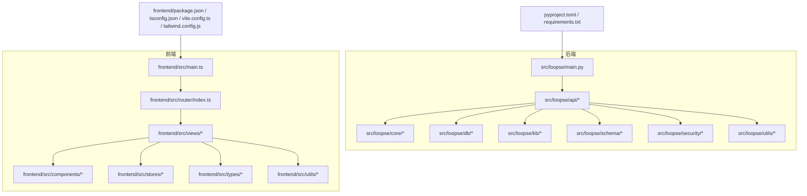
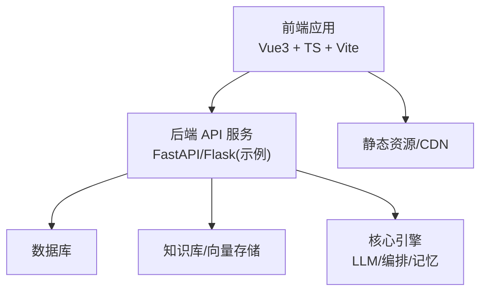
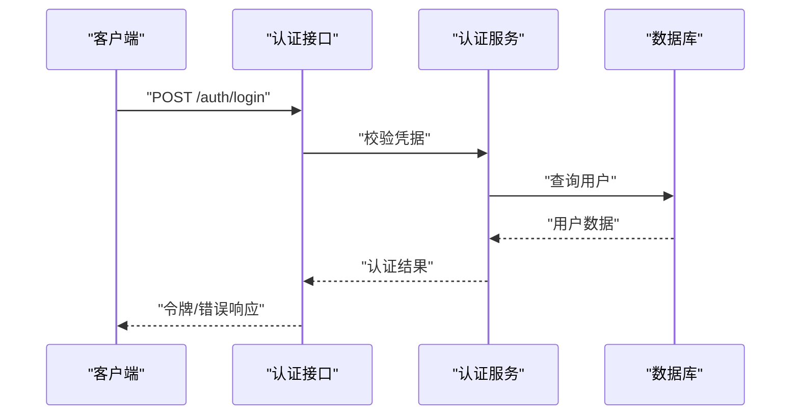
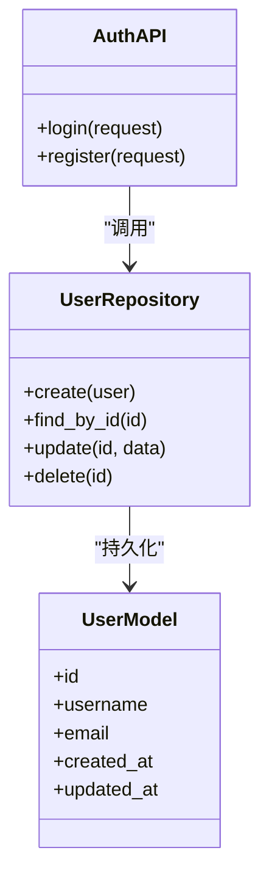
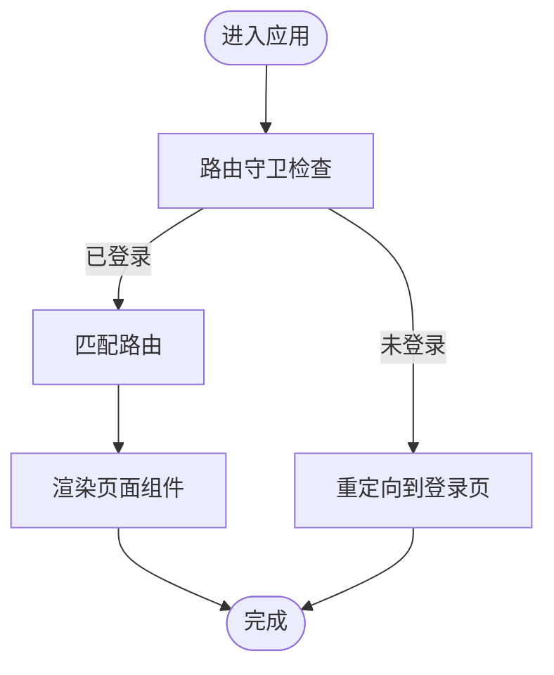
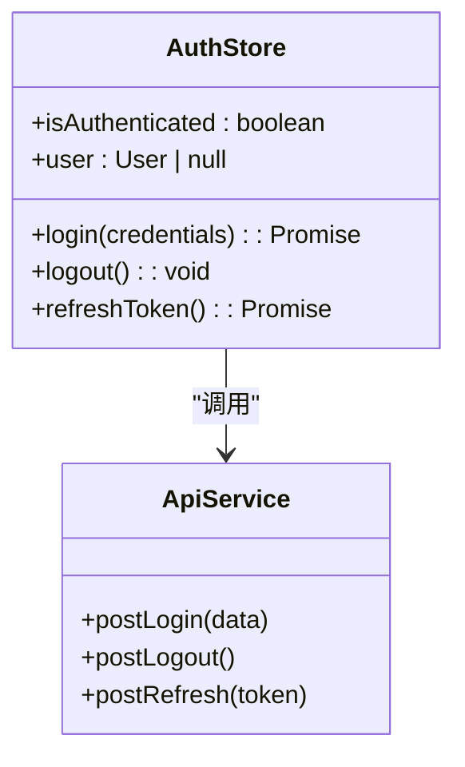
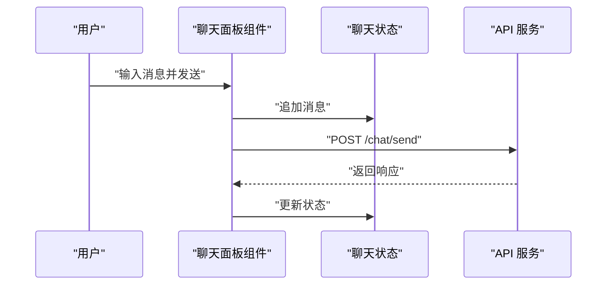
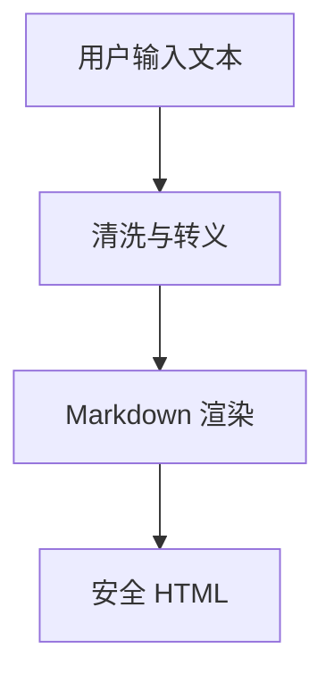
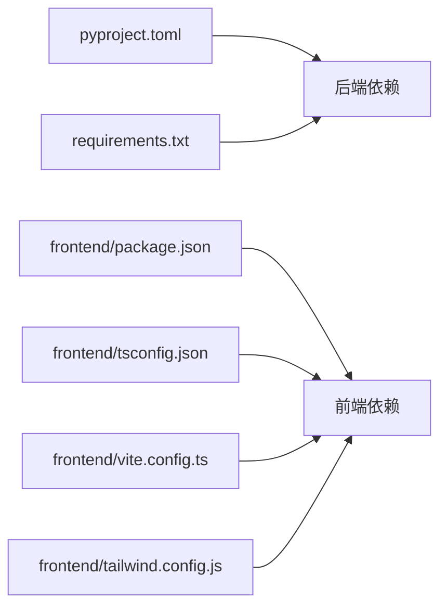

# 代码规范与风格

<cite>
**本文引用的文件**   
- [pyproject.toml](file://pyproject.toml)
- [requirements.txt](file://requirements.txt)
- [src/loopse/main.py](file://src/loopse/main.py)
- [src/loopse/api/auth.py](file://src/loopse/api/auth.py)
- [src/loopse/db/models.py](file://src/loopse/db/models.py)
- [frontend/package.json](file://frontend/package.json)
- [frontend/tsconfig.json](file://frontend/tsconfig.json)
- [frontend/vite.config.ts](file://frontend/vite.config.ts)
- [frontend/tailwind.config.js](file://frontend/tailwind.config.js)
- [frontend/src/main.ts](file://frontend/src/main.ts)
- [frontend/src/router/index.ts](file://frontend/src/router/index.ts)
- [frontend/src/stores/authStore.ts](file://frontend/src/stores/authStore.ts)
- [frontend/src/components/ChatPanel.vue](file://frontend/src/components/ChatPanel.vue)
- [frontend/src/views/HomeView.vue](file://frontend/src/views/HomeView.vue)
- [frontend/src/types/chat.ts](file://frontend/src/types/chat.ts)
- [frontend/src/utils/markdown.ts](file://frontend/src/utils/markdown.ts)
- [tests/conftest.py](file://tests/conftest.py)
- [tests/unit/test_llm_client.py](file://tests/unit/test_llm_client.py)
</cite>

## 目录
1. [简介](#简介)
2. [项目结构](#项目结构)
3. [核心组件](#核心组件)
4. [架构总览](#架构总览)
5. [详细组件分析](#详细组件分析)
6. [依赖分析](#依赖分析)
7. [性能考虑](#性能考虑)
8. [故障排查指南](#故障排查指南)
9. [结论](#结论)
10. [附录](#附录)

## 简介
本规范面向 Socrates-Cube 项目的后端（Python）与前端（Vue3 + TypeScript），覆盖命名约定、文件组织、注释标准、组件设计模式、样式编写、Git 提交信息格式、分支管理策略、代码审查流程，以及代码质量检查工具的配置与使用。目标是提升可读性、可维护性与协作效率，降低回归风险，确保前后端一致的开发体验。

## 项目结构
仓库采用前后端分离的组织方式：
- 后端位于 src/loopse，按领域分层（api、core、db、kb、rl、schema、security、utils），入口为 main.py。
- 前端位于 frontend，基于 Vite + Vue3 + TypeScript，路由、状态、组件、类型、工具函数等分别存放于对应目录。
- 测试位于 tests，包含单元测试与公共夹具。
- 配置与依赖通过 pyproject.toml、requirements.txt、package.json、tsconfig.json、vite.config.ts、tailwind.config.js 等集中管理。

图表来源
- [src/loopse/main.py](file://src/loopse/main.py)
- [src/loopse/api/auth.py](file://src/loopse/api/auth.py)
- [src/loopse/db/models.py](file://src/loopse/db/models.py)
- [frontend/src/main.ts](file://frontend/src/main.ts)
- [frontend/src/router/index.ts](file://frontend/src/router/index.ts)
- [frontend/package.json](file://frontend/package.json)
- [frontend/tsconfig.json](file://frontend/tsconfig.json)
- [frontend/vite.config.ts](file://frontend/vite.config.ts)
- [frontend/tailwind.config.js](file://frontend/tailwind.config.js)

章节来源
- [pyproject.toml](file://pyproject.toml)
- [requirements.txt](file://requirements.txt)
- [src/loopse/main.py](file://src/loopse/main.py)
- [frontend/package.json](file://frontend/package.json)
- [frontend/tsconfig.json](file://frontend/tsconfig.json)
- [frontend/vite.config.ts](file://frontend/vite.config.ts)
- [frontend/tailwind.config.js](file://frontend/tailwind.config.js)

## 核心组件
本节定义前后端通用与关键模块的编码规范要点，便于在后续章节中统一引用。

- Python 后端
  - 命名：模块与包使用小写加下划线；类名使用大驼峰；函数与方法使用小写加下划线；常量全大写加下划线。
  - 文件组织：按功能域划分 api、core、db、kb、rl、schema、security、utils；每个模块职责单一，避免跨层耦合。
  - 类型与校验：优先使用类型注解；对入参进行严格校验，返回结构化响应对象。
  - 错误处理：统一异常类型与错误码；对外接口返回一致的 JSON 结构。
  - 日志与可观测性：结构化日志，分级输出，敏感信息脱敏。
  - 数据库：模型定义与迁移分离；Repository 模式封装查询逻辑。
  - 安全：鉴权中间件、输入校验、权限控制、隐私合规。
  - 测试：pytest 为主，conftest.py 提供共享夹具，单测覆盖核心路径。

- Vue3 前端
  - 组件设计：组合式 API（Composition API）+ <script setup>；Props/Emits 显式声明；事件命名清晰；组件粒度适中。
  - TypeScript：严格模式开启；类型定义集中在 types 目录；API 响应与请求体强类型化；避免 any。
  - 状态管理：Pinia store 按业务域拆分；store 仅暴露必要方法；副作用在 actions 中处理。
  - 路由：按页面维度拆分视图；路由懒加载；守卫集中处理鉴权与权限。
  - 样式：Tailwind CSS 原子类为主；复杂样式抽取为局部样式或组合类；禁止全局污染。
  - 资源与工具：工具函数按能力分组；静态资源按类型归档；环境变量通过 .env 管理。
  - 构建与开发：Vite 插件按需启用；TS 编译选项严格；ESLint/Prettier 统一风格。

章节来源
- [src/loopse/api/auth.py](file://src/loopse/api/auth.py)
- [src/loopse/db/models.py](file://src/loopse/db/models.py)
- [frontend/src/stores/authStore.ts](file://frontend/src/stores/authStore.ts)
- [frontend/src/router/index.ts](file://frontend/src/router/index.ts)
- [frontend/src/types/chat.ts](file://frontend/src/types/chat.ts)
- [frontend/src/utils/markdown.ts](file://frontend/src/utils/markdown.ts)
- [tests/conftest.py](file://tests/conftest.py)
- [tests/unit/test_llm_client.py](file://tests/unit/test_llm_client.py)

## 架构总览
系统由前端 SPA 与后端 API 服务组成，前后端通过 HTTP/REST 通信。后端以领域驱动的方式组织模块，前端以页面与组件为中心组织视图与交互。

[此图为概念性架构图，不直接映射具体源码文件]

## 详细组件分析

### 后端 API 模块（认证示例）
- 职责边界：认证相关接口独立成模块，避免与业务逻辑耦合。
- 输入校验：请求体使用 Pydantic 模型校验；参数白名单与范围限制。
- 鉴权流程：令牌签发与验证；会话/无状态 JWT 选择需明确。
- 错误处理：统一错误码与消息；区分客户端错误与服务端错误。
- 日志记录：登录成功/失败、异常堆栈、IP 与用户标识（脱敏）。

图表来源
- [src/loopse/api/auth.py](file://src/loopse/api/auth.py)

章节来源
- [src/loopse/api/auth.py](file://src/loopse/api/auth.py)

### 数据库模型与仓储
- 模型定义：字段类型、约束、索引、默认值明确；避免隐式行为。
- 仓储模式：将 SQL 与 ORM 调用封装在 repositories，API 层只调用仓储方法。
- 事务与一致性：批量操作使用事务；读写分离策略明确。
- 迁移管理：变更通过迁移脚本版本化；回滚策略完备。

图表来源
- [src/loopse/db/models.py](file://src/loopse/db/models.py)

章节来源
- [src/loopse/db/models.py](file://src/loopse/db/models.py)

### 前端路由与页面组织
- 路由结构：按页面维度划分视图；嵌套路由用于子功能。
- 导航守卫：集中处理鉴权、角色权限、未登录跳转。
- 懒加载：路由级懒加载减少首屏体积。
- 错误页：统一错误视图与提示。

图表来源
- [frontend/src/router/index.ts](file://frontend/src/router/index.ts)

章节来源
- [frontend/src/router/index.ts](file://frontend/src/router/index.ts)

### 前端状态管理（认证 Store）
- Store 职责：仅管理认证状态与相关动作；避免承载业务逻辑。
- 异步处理：actions 内发起网络请求；错误捕获并抛出。
- 持久化：可选本地持久化；注意敏感信息保护。
- 类型安全：state、actions、getters 均强类型化。

图表来源
- [frontend/src/stores/authStore.ts](file://frontend/src/stores/authStore.ts)

章节来源
- [frontend/src/stores/authStore.ts](file://frontend/src/stores/authStore.ts)

### 前端组件（聊天面板）
- 组件职责：展示消息列表、输入框、发送按钮；与 store 解耦。
- Props/Emits：显式声明；事件命名动词化。
- 组合式逻辑：useApi/useSSE 等 composable 复用。
- 样式：Tailwind 原子类为主；复杂布局抽取为局部样式。

图表来源
- [frontend/src/components/ChatPanel.vue](file://frontend/src/components/ChatPanel.vue)

章节来源
- [frontend/src/components/ChatPanel.vue](file://frontend/src/components/ChatPanel.vue)

### 前端类型与工具（聊天类型与 Markdown 工具）
- 类型定义：集中存放于 types 目录；API 响应与请求体强类型化。
- 工具函数：纯函数优先；幂等与可测试性；文档注释说明用途与边界。
- 安全性：对用户输入进行清洗与转义；Markdown 渲染前过滤危险内容。

图表来源
- [frontend/src/types/chat.ts](file://frontend/src/types/chat.ts)
- [frontend/src/utils/markdown.ts](file://frontend/src/utils/markdown.ts)

章节来源
- [frontend/src/types/chat.ts](file://frontend/src/types/chat.ts)
- [frontend/src/utils/markdown.ts](file://frontend/src/utils/markdown.ts)

## 依赖分析
- 后端依赖：通过 pyproject.toml 与 requirements.txt 管理；建议锁定版本并在 CI 中校验。
- 前端依赖：package.json 管理；TS 配置与构建配置集中；Tailwind 主题与插件统一管理。
- 外部集成：数据库、向量库、LLM 客户端等通过配置注入；避免硬编码。

图表来源
- [pyproject.toml](file://pyproject.toml)
- [requirements.txt](file://requirements.txt)
- [frontend/package.json](file://frontend/package.json)
- [frontend/tsconfig.json](file://frontend/tsconfig.json)
- [frontend/vite.config.ts](file://frontend/vite.config.ts)
- [frontend/tailwind.config.js](file://frontend/tailwind.config.js)

章节来源
- [pyproject.toml](file://pyproject.toml)
- [requirements.txt](file://requirements.txt)
- [frontend/package.json](file://frontend/package.json)
- [frontend/tsconfig.json](file://frontend/tsconfig.json)
- [frontend/vite.config.ts](file://frontend/vite.config.ts)
- [frontend/tailwind.config.js](file://frontend/tailwind.config.js)

## 性能考虑
- 后端
  - 接口响应时间目标与超时策略；缓存热点数据；分页与限流。
  - 数据库查询优化：索引、连接池、慢查询监控。
  - 并发与异步：合理选择同步/异步 IO；避免阻塞主循环。
- 前端
  - 首屏优化：路由懒加载、组件按需引入、图片与字体压缩。
  - 渲染优化：虚拟列表、防抖节流、Web Worker 计算密集型任务。
  - 网络优化：HTTP/2、缓存策略、错误重试与退避。

[本节为通用指导，无需特定文件来源]

## 故障排查指南
- 后端
  - 日志定位：根据请求 ID 追踪链路；关注错误级别日志与堆栈。
  - 常见错误：参数校验失败、权限不足、数据库连接异常、第三方服务超时。
  - 调试技巧：断点、打印上下文、最小复现用例。
- 前端
  - 控制台与网络面板：检查请求/响应、CORS、令牌过期。
  - 状态问题：查看 store 快照与变更记录；确认副作用执行顺序。
  - 兼容性问题：浏览器特性检测与降级方案。

章节来源
- [tests/conftest.py](file://tests/conftest.py)
- [tests/unit/test_llm_client.py](file://tests/unit/test_llm_client.py)

## 结论
本规范从命名、组织、注释、组件设计、类型与样式、Git 工作流、代码审查与质量工具等方面提供了统一的实践指引。建议在团队内推广并纳入 CI 流水线，持续迭代完善，确保代码质量与团队协作效率稳步提升。

[本节为总结性内容，无需特定文件来源]

## 附录

### Git 提交信息格式
- 类型：feat、fix、docs、style、refactor、perf、test、build、ci、chore、revert
- 格式：<type>(scope): <subject>
- 规则：
  - subject 简洁明了，不超过 72 字符
  - 必要时在正文描述动机与影响
  - 关联 Issue/PR 编号
- 示例：feat(api): 新增用户注册接口

[本节为通用指导，无需特定文件来源]

### 分支管理策略
- 主干分支：main/master 稳定发布
- 功能分支：feature/<短名>
- 修复分支：fix/<短名>
- 发布分支：release/<版本号>
- 热修复分支：hotfix/<短名>
- 合并策略：Pull Request + 至少一名 Reviewer 批准 + CI 通过

[本节为通用指导，无需特定文件来源]

### 代码审查流程
- 提交 PR：附带变更说明与测试覆盖
- 自动检查：lint、类型检查、单元测试、覆盖率阈值
- 人工审查：关注架构、可读性、安全性、性能
- 合并条件：CI 全部通过、评论已解决、至少一名 Approve

[本节为通用指导，无需特定文件来源]

### 代码质量检查工具配置与使用

- Python 后端
  - 工具：ruff（替代 flake8/isort/black）、mypy、pytest、coverage
  - 配置位置：pyproject.toml
  - 常用命令：
    - ruff check .
    - mypy src
    - pytest tests -v --cov=src
  - 建议：
    - 在 pre-commit 钩子中运行 lint 与类型检查
    - 设置覆盖率阈值并在 CI 中阻断低覆盖率提交

- Vue3 前端
  - 工具：eslint、prettier、typescript、vite-plugin-checker、vitest
  - 配置位置：package.json、tsconfig.json、vite.config.ts、tailwind.config.js
  - 常用命令：
    - npm run lint
    - npm run typecheck
    - npm run test
  - 建议：
    - 编辑器集成 ESLint/Prettier，保存时自动格式化
    - 在 CI 中并行执行 lint、类型检查与测试

章节来源
- [pyproject.toml](file://pyproject.toml)
- [frontend/package.json](file://frontend/package.json)
- [frontend/tsconfig.json](file://frontend/tsconfig.json)
- [frontend/vite.config.ts](file://frontend/vite.config.ts)
- [frontend/tailwind.config.js](file://frontend/tailwind.config.js)