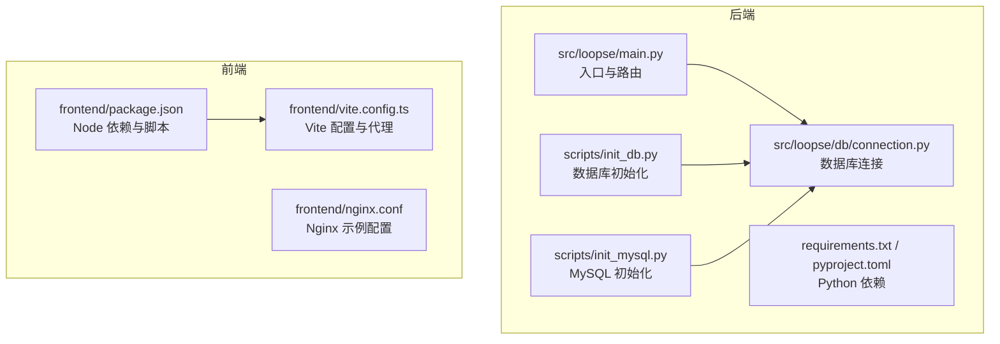
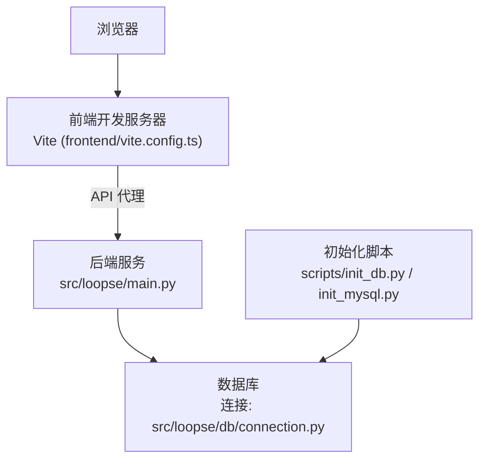
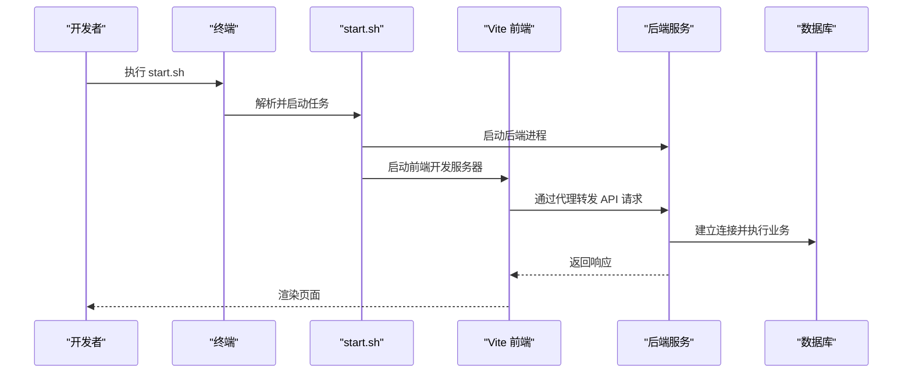
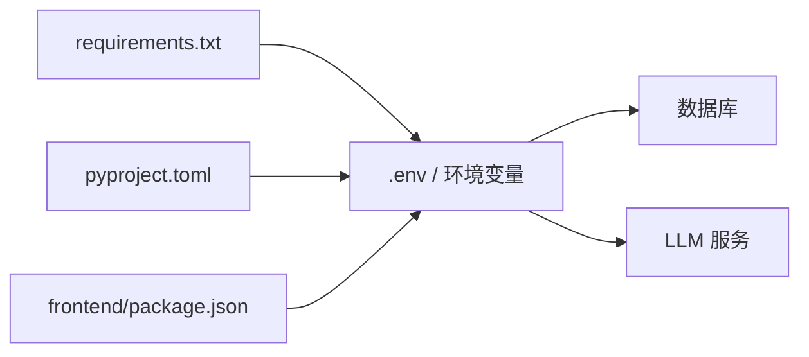

# 开发环境搭建

<cite>
**本文引用的文件**   
- [requirements.txt](file://requirements.txt)
- [pyproject.toml](file://pyproject.toml)
- [start.sh](file://start.sh)
- [scripts/init_db.py](file://scripts/init_db.py)
- [scripts/init_mysql.py](file://scripts/init_mysql.py)
- [scripts/verify_env.py](file://scripts/verify_env.py)
- [src/loopse/main.py](file://src/loopse/main.py)
- [src/loopse/db/connection.py](file://src/loopse/db/connection.py)
- [frontend/package.json](file://frontend/package.json)
- [frontend/vite.config.ts](file://frontend/vite.config.ts)
- [frontend/nginx.conf](file://frontend/nginx.conf)
</cite>

## 目录
1. [简介](#简介)
2. [项目结构](#项目结构)
3. [核心组件](#核心组件)
4. [架构总览](#架构总览)
5. [详细组件分析](#详细组件分析)
6. [依赖分析](#依赖分析)
7. [性能考虑](#性能考虑)
8. [故障排查指南](#故障排查指南)
9. [结论](#结论)
10. [附录](#附录)

## 简介
本指南面向本地开发，目标是帮助你在最短的时间内完成 Python 与 Node.js 环境的准备、依赖安装、数据库初始化、环境变量配置、端口设置与服务启动，并提供常见问题排查方法与验证步骤。本项目包含：
- 后端服务（Python）：提供 API、Agent 编排、知识库与向量检索等能力
- 前端应用（Vue + Vite）：提供交互式学习界面
- 脚本工具：用于数据库初始化、数据导入与环境校验

## 项目结构
仓库采用前后端分离的组织方式，关键目录说明如下：
- src：后端主程序与业务模块（API、Agent、数据库连接、知识库、RL 等）
- frontend：前端工程（Vue/Vite/Tailwind），含构建与代理配置
- scripts：数据库初始化、数据导入、环境校验等脚本
- config：提示词模板与系统配置
- tests：单元测试与集成测试
- docs：架构、需求、部署与结果文档

图表来源
- [src/loopse/main.py](file://src/loopse/main.py)
- [src/loopse/db/connection.py](file://src/loopse/db/connection.py)
- [scripts/init_db.py](file://scripts/init_db.py)
- [scripts/init_mysql.py](file://scripts/init_mysql.py)
- [requirements.txt](file://requirements.txt)
- [pyproject.toml](file://pyproject.toml)
- [frontend/package.json](file://frontend/package.json)
- [frontend/vite.config.ts](file://frontend/vite.config.ts)
- [frontend/nginx.conf](file://frontend/nginx.conf)

章节来源
- [requirements.txt](file://requirements.txt)
- [pyproject.toml](file://pyproject.toml)
- [start.sh](file://start.sh)
- [scripts/init_db.py](file://scripts/init_db.py)
- [scripts/init_mysql.py](file://scripts/init_mysql.py)
- [src/loopse/main.py](file://src/loopse/main.py)
- [src/loopse/db/connection.py](file://src/loopse/db/connection.py)
- [frontend/package.json](file://frontend/package.json)
- [frontend/vite.config.ts](file://frontend/vite.config.ts)
- [frontend/nginx.conf](file://frontend/nginx.conf)

## 核心组件
- 后端入口与运行
  - 后端主程序位于 src/loopse/main.py，负责注册路由、加载配置、启动服务。
  - 数据库连接由 src/loopse/db/connection.py 管理，集中处理连接参数与生命周期。
- 数据库初始化
  - scripts/init_db.py：通用数据库初始化逻辑（如建表、迁移）。
  - scripts/init_mysql.py：针对 MySQL 的初始化脚本（创建库、用户、权限等）。
- 前端开发与代理
  - frontend/package.json：定义 Node 依赖与开发脚本。
  - frontend/vite.config.ts：Vite 开发服务器与 API 代理配置。
  - frontend/nginx.conf：生产或反向代理示例配置。
- 环境与依赖
  - requirements.txt / pyproject.toml：Python 依赖声明。
  - start.sh：一键启动脚本（可能同时拉起后端与前端）。

章节来源
- [src/loopse/main.py](file://src/loopse/main.py)
- [src/loopse/db/connection.py](file://src/loopse/db/connection.py)
- [scripts/init_db.py](file://scripts/init_db.py)
- [scripts/init_mysql.py](file://scripts/init_mysql.py)
- [frontend/package.json](file://frontend/package.json)
- [frontend/vite.config.ts](file://frontend/vite.config.ts)
- [frontend/nginx.conf](file://frontend/nginx.conf)
- [requirements.txt](file://requirements.txt)
- [pyproject.toml](file://pyproject.toml)
- [start.sh](file://start.sh)

## 架构总览
下图展示了开发环境下各组件的交互关系：浏览器访问前端，Vite 开发服务器将 API 请求代理到后端；后端通过数据库连接模块访问数据库；初始化脚本在首次运行时执行。

图表来源
- [frontend/vite.config.ts](file://frontend/vite.config.ts)
- [src/loopse/main.py](file://src/loopse/main.py)
- [src/loopse/db/connection.py](file://src/loopse/db/connection.py)
- [scripts/init_db.py](file://scripts/init_db.py)
- [scripts/init_mysql.py](file://scripts/init_mysql.py)

## 详细组件分析

### Python 环境要求与依赖安装
- 版本建议
  - 使用与 requirements.txt 和 pyproject.toml 中声明兼容的 Python 版本（建议遵循官方推荐范围）。
- 虚拟环境
  - 推荐使用 venv 或 conda 创建独立环境，避免系统包冲突。
- 依赖安装
  - 使用 pip 安装 requirements.txt 中的依赖。
  - 若项目使用 pyproject.toml 作为主要依赖源，可结合对应工具进行安装。
- 可选扩展依赖
  - 如需向量检索或特定功能，参考 requirements-vector.txt 安装额外依赖。

章节来源
- [requirements.txt](file://requirements.txt)
- [pyproject.toml](file://pyproject.toml)

### Node.js 环境要求与前端依赖
- 版本建议
  - 根据 frontend/package.json 中的 engines 字段选择匹配的 Node.js 版本。
- 依赖安装
  - 在项目根目录下执行 npm install 或 pnpm/yarn 安装依赖。
- 开发脚本
  - 通过 package.json 中定义的脚本启动前端开发服务器。

章节来源
- [frontend/package.json](file://frontend/package.json)

### 数据库初始化步骤
- 首次运行前需完成数据库初始化
  - 使用 scripts/init_mysql.py 完成 MySQL 库、用户与权限的初始化（如需要）。
  - 使用 scripts/init_db.py 完成表结构与基础数据的初始化。
- 连接配置
  - 数据库连接参数由 src/loopse/db/connection.py 读取并管理，确保环境变量或配置文件正确设置。

章节来源
- [scripts/init_mysql.py](file://scripts/init_mysql.py)
- [scripts/init_db.py](file://scripts/init_db.py)
- [src/loopse/db/connection.py](file://src/loopse/db/connection.py)

### 环境变量与端口设置
- 环境变量
  - 常见变量包括数据库连接串、密钥、第三方服务凭据等。建议在项目根目录创建 .env 文件，并在后端与前端相应位置引用。
- 端口设置
  - 后端默认端口可在 main.py 或相关配置中查看与修改。
  - 前端开发服务器端口在 vite.config.ts 中配置，可通过环境变量覆盖。
- 反向代理
  - 生产或统一入口可使用 nginx.conf 进行反向代理与静态资源托管。

章节来源
- [src/loopse/main.py](file://src/loopse/main.py)
- [frontend/vite.config.ts](file://frontend/vite.config.ts)
- [frontend/nginx.conf](file://frontend/nginx.conf)

### 服务启动流程
- 一键启动
  - 使用 start.sh 可同时拉起后端与前端（具体行为以脚本内容为准）。
- 手动启动
  - 后端：进入后端目录，激活 Python 虚拟环境后运行主程序。
  - 前端：进入 frontend 目录，执行开发脚本启动 Vite 开发服务器。
- 代理与跨域
  - 开发阶段通过 Vite 的代理转发 API 请求至后端，避免跨域问题。

图表来源
- [start.sh](file://start.sh)
- [frontend/vite.config.ts](file://frontend/vite.config.ts)
- [src/loopse/main.py](file://src/loopse/main.py)
- [src/loopse/db/connection.py](file://src/loopse/db/connection.py)

章节来源
- [start.sh](file://start.sh)
- [frontend/vite.config.ts](file://frontend/vite.config.ts)
- [src/loopse/main.py](file://src/loopse/main.py)

### IDE 推荐配置
- VS Code
  - 安装 Python 与 Pylance 扩展，启用自动补全与类型检查。
  - 安装 ESLint、Prettier、Vue 语言支持插件，提升前端开发体验。
  - 配置工作区环境变量（.env）与调试器（Python/Node）。
- PyCharm
  - 配置解释器为虚拟环境路径，设置运行配置指向后端入口。
  - 开启数据库工具与 SQL 控制台，便于调试数据库操作。
- 前端
  - 使用 Vite 插件与 Vue 官方扩展，启用热重载与错误提示。

[本节为通用建议，不直接分析具体文件]

## 依赖分析
- Python 依赖
  - 通过 requirements.txt 与 pyproject.toml 声明，建议使用锁定文件（如 poetry.lock 或 pip-tools）保证一致性。
- Node 依赖
  - 通过 frontend/package.json 管理，建议使用锁文件（package-lock.json 或 pnpm-lock.yaml）。
- 外部服务
  - 数据库（如 MySQL）、向量存储、LLM 服务等，需在环境变量中配置连接信息。

图表来源
- [requirements.txt](file://requirements.txt)
- [pyproject.toml](file://pyproject.toml)
- [frontend/package.json](file://frontend/package.json)

章节来源
- [requirements.txt](file://requirements.txt)
- [pyproject.toml](file://pyproject.toml)
- [frontend/package.json](file://frontend/package.json)

## 性能考虑
- 数据库连接池
  - 合理配置连接池大小与超时时间，避免在高并发下耗尽连接。
- 缓存策略
  - 对热点查询与生成结果引入缓存层，降低数据库压力。
- 前端资源优化
  - 启用代码分割与懒加载，减少首屏体积。
- 日志与监控
  - 记录关键指标与慢查询，定位瓶颈。

[本节为通用指导，不直接分析具体文件]

## 故障排查指南
- 环境校验
  - 使用 scripts/verify_env.py 检查 Python/Node 版本、依赖与必要命令是否就绪。
- 数据库连接失败
  - 检查数据库地址、用户名、密码与端口是否正确。
  - 确认防火墙与安全组放行数据库端口。
  - 使用 scripts/init_mysql.py 与 scripts/init_db.py 重新初始化。
- 端口占用
  - 修改后端或前端默认端口，避免冲突。
- 代理与跨域
  - 确认 vite.config.ts 的代理规则与后端实际路径一致。
- 依赖缺失或版本不匹配
  - 清理虚拟环境与 node_modules，重新安装依赖。
- 启动失败
  - 查看 start.sh 输出与后端日志，定位异常堆栈。

章节来源
- [scripts/verify_env.py](file://scripts/verify_env.py)
- [scripts/init_mysql.py](file://scripts/init_mysql.py)
- [scripts/init_db.py](file://scripts/init_db.py)
- [frontend/vite.config.ts](file://frontend/vite.config.ts)
- [start.sh](file://start.sh)

## 结论
按照本指南完成 Python 与 Node.js 环境准备、依赖安装、数据库初始化、环境变量与端口配置后，即可通过 start.sh 或手动方式启动前后端服务。建议配合 IDE 插件与日志监控，提高开发效率与问题定位速度。

[本节为总结性内容，不直接分析具体文件]

## 附录
- 快速清单
  - 安装 Python 与 Node.js（版本见依赖声明）
  - 创建虚拟环境并安装 Python 依赖
  - 安装前端依赖
  - 初始化数据库（init_mysql.py 与 init_db.py）
  - 配置环境变量与端口
  - 启动服务（start.sh 或分别启动）
  - 运行 verify_env.py 进行环境自检
- 常用命令
  - 后端启动：运行后端主程序
  - 前端启动：执行前端开发脚本
  - 初始化数据库：依次执行 MySQL 初始化与通用初始化脚本

[本节为补充信息，不直接分析具体文件]