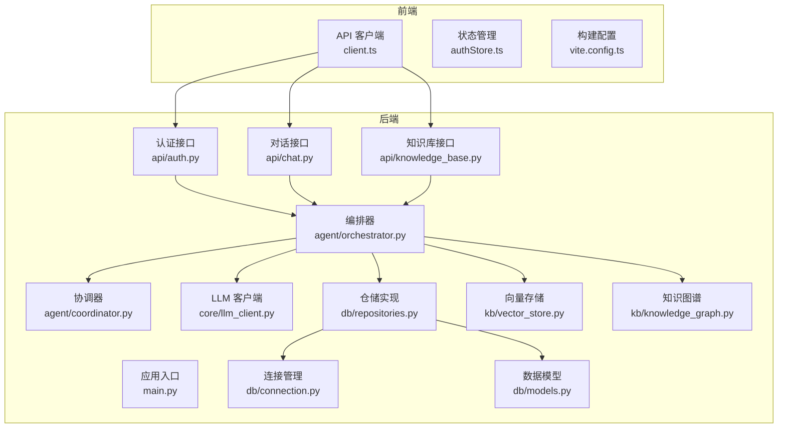
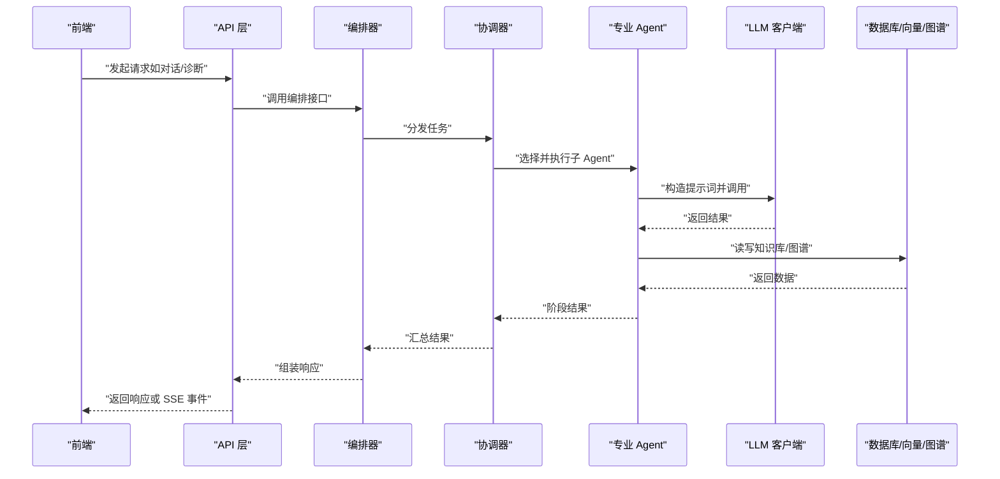
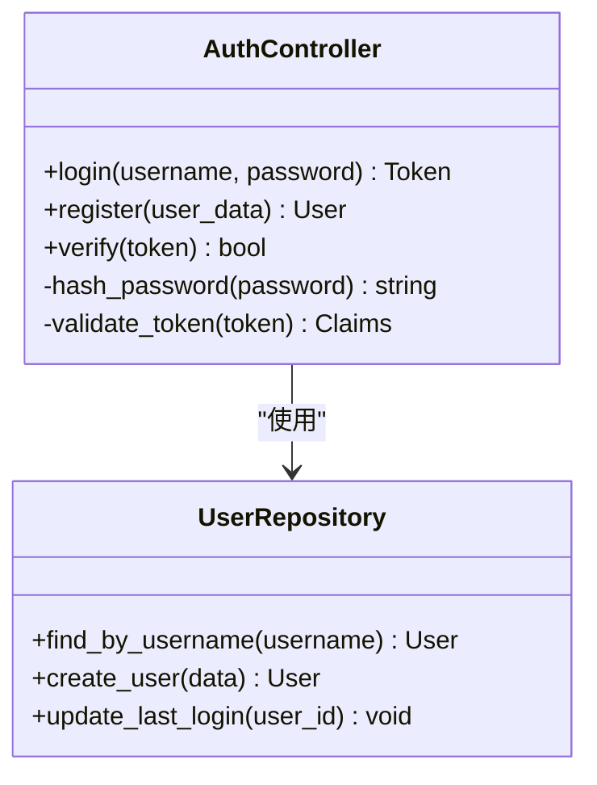
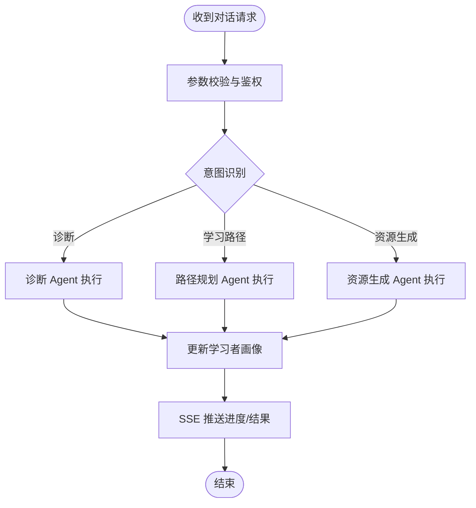
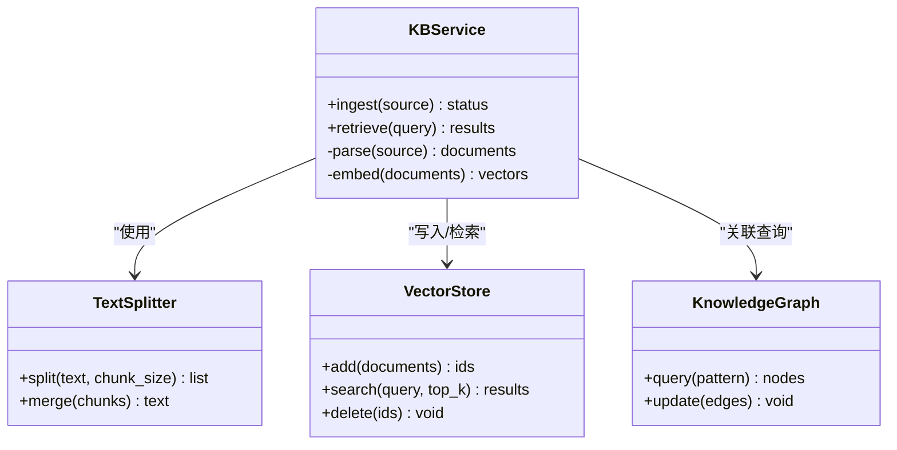
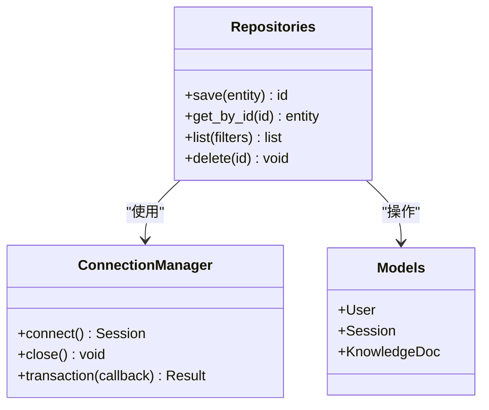
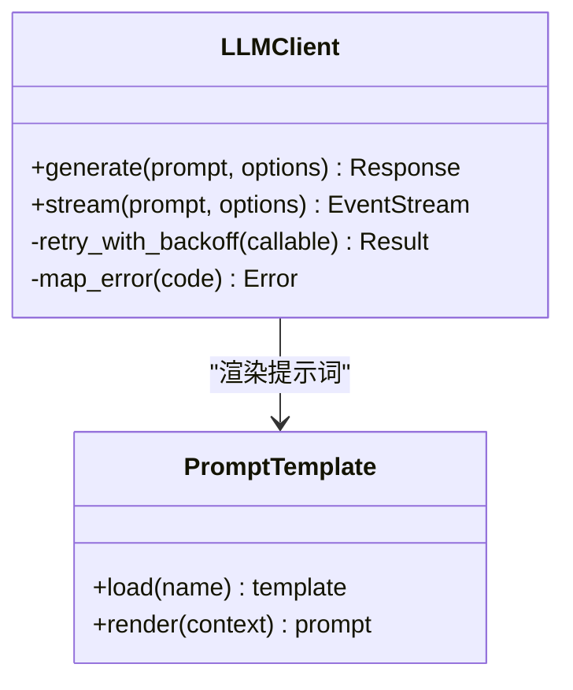
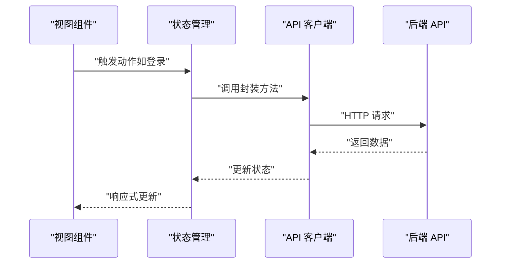
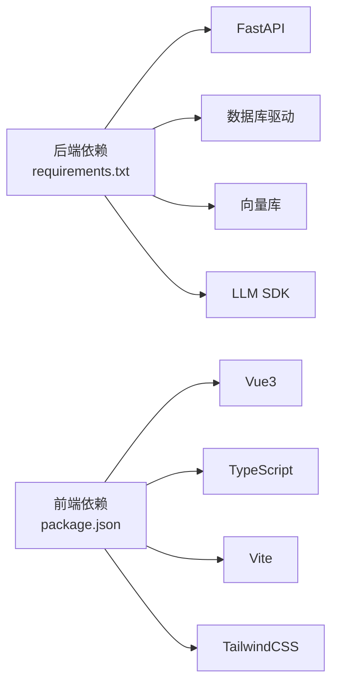

# 开发者指南

<cite>
**本文引用的文件**   
- [pyproject.toml](file://pyproject.toml)
- [requirements.txt](file://requirements.txt)
- [start.sh](file://start.sh)
- [src/loopse/main.py](file://src/loopse/main.py)
- [src/loopse/api/auth.py](file://src/loopse/api/auth.py)
- [src/loopse/api/chat.py](file://src/loopse/api/chat.py)
- [src/loopse/api/knowledge_base.py](file://src/loopse/api/knowledge_base.py)
- [src/loopse/core/llm_client.py](file://src/loopse/core/llm_client.py)
- [src/loopse/db/connection.py](file://src/loopse/db/connection.py)
- [src/loopse/db/models.py](file://src/loopse/db/models.py)
- [src/loopse/db/repositories.py](file://src/loopse/db/repositories.py)
- [src/loopse/agent/orchestrator.py](file://src/loopse/agent/orchestrator.py)
- [src/loopse/agent/coordinator.py](file://src/loopse/agent/coordinator.py)
- [src/loopse/agent/challenger.py](file://src/loopse/agent/challenger.py)
- [src/loopse/agent/profiler.py](file://src/loopse/agent/profiler.py)
- [src/loopse/agent/path_planner.py](file://src/loopse/agent/path_planner.py)
- [src/loopse/agent/resource_generator.py](file://src/loopse/agent/resource_generator.py)
- [src/loopse/agent/retriever.py](file://src/loopse/agent/retriever.py)
- [src/loopse/kb/vector_store.py](file://src/loopse/kb/vector_store.py)
- [src/loopse/kb/knowledge_graph.py](file://src/loopse/kb/knowledge_graph.py)
- [src/loopse/kb/text_splitter.py](file://src/loopse/kb/text_splitter.py)
- [frontend/package.json](file://frontend/package.json)
- [frontend/vite.config.ts](file://frontend/vite.config.ts)
- [frontend/src/api/client.ts](file://frontend/src/api/client.ts)
- [frontend/src/stores/authStore.ts](file://frontend/src/stores/authStore.ts)
- [tests/conftest.py](file://tests/conftest.py)
- [tests/unit/test_llm_client.py](file://tests/unit/test_llm_client.py)
- [config/prompts/orchestrator/route.txt](file://config/prompts/orchestrator/route.txt)
- [config/prompts/profiler/update_profile.txt](file://config/prompts/profiler/update_profile.txt)
- [config/prompts/resource_generator/generate_code.txt](file://config/prompts/resource_generator/generate_code.txt)
</cite>

## 目录
1. [简介](#简介)
2. [项目结构](#项目结构)
3. [核心组件](#核心组件)
4. [架构总览](#架构总览)
5. [详细组件分析](#详细组件分析)
6. [依赖关系分析](#依赖关系分析)
7. [性能考虑](#性能考虑)
8. [故障排查指南](#故障排查指南)
9. [结论](#结论)
10. [附录](#附录)

## 简介
本指南面向希望参与 Socrates-Cube 后端与前端开发的贡献者，提供从代码风格、Git 工作流、PR 审查标准到扩展开发、调试与性能分析、发布管理的完整规范。文档同时覆盖模块依赖关系、常见问题定位方法以及社区贡献流程，帮助新成员快速上手并高效协作。

## 项目结构
Socrates-Cube 采用前后端分离的模块化架构：
- 后端（Python）：基于 FastAPI 的 API 服务，Agent 编排层、知识库与向量检索、数据库访问、LLM 客户端等。
- 前端（Vue3 + Vite + TypeScript）：多视图页面、状态管理、API 客户端、Mock 与 SSE 支持。
- 配置与提示词：集中式 prompts 与 schema 定义，便于统一管理与迭代。
- 测试与脚本：单元测试、集成验证与数据初始化脚本。

图表来源
- [src/loopse/main.py](file://src/loopse/main.py)
- [src/loopse/api/auth.py](file://src/loopse/api/auth.py)
- [src/loopse/api/chat.py](file://src/loopse/api/chat.py)
- [src/loopse/api/knowledge_base.py](file://src/loopse/api/knowledge_base.py)
- [src/loopse/agent/orchestrator.py](file://src/loopse/agent/orchestrator.py)
- [src/loopse/agent/coordinator.py](file://src/loopse/agent/coordinator.py)
- [src/loopse/core/llm_client.py](file://src/loopse/core/llm_client.py)
- [src/loopse/db/connection.py](file://src/loopse/db/connection.py)
- [src/loopse/db/models.py](file://src/loopse/db/models.py)
- [src/loopse/db/repositories.py](file://src/loopse/db/repositories.py)
- [src/loopse/kb/vector_store.py](file://src/loopse/kb/vector_store.py)
- [src/loopse/kb/knowledge_graph.py](file://src/loopse/kb/knowledge_graph.py)
- [frontend/src/api/client.ts](file://frontend/src/api/client.ts)
- [frontend/src/stores/authStore.ts](file://frontend/src/stores/authStore.ts)
- [frontend/vite.config.ts](file://frontend/vite.config.ts)

章节来源
- [pyproject.toml](file://pyproject.toml)
- [requirements.txt](file://requirements.txt)
- [start.sh](file://start.sh)
- [frontend/package.json](file://frontend/package.json)
- [frontend/vite.config.ts](file://frontend/vite.config.ts)

## 核心组件
- 应用入口与路由挂载：负责启动服务、注册中间件与路由。
- 认证与会话：JWT 签发与校验、用户上下文注入。
- 对话与编排：对话接口触发 Agent 编排，协调各子 Agent 完成诊断、路径规划、资源生成等任务。
- 知识库与检索：文本切分、向量化、检索与图谱查询。
- 数据持久化：ORM 模型、连接池与仓储封装。
- LLM 客户端：统一抽象外部大模型调用，支持重试、超时与错误处理。

章节来源
- [src/loopse/main.py](file://src/loopse/main.py)
- [src/loopse/api/auth.py](file://src/loopse/api/auth.py)
- [src/loopse/api/chat.py](file://src/loopse/api/chat.py)
- [src/loopse/agent/orchestrator.py](file://src/loopse/agent/orchestrator.py)
- [src/loopse/core/llm_client.py](file://src/loopse/core/llm_client.py)
- [src/loopse/db/connection.py](file://src/loopse/db/connection.py)
- [src/loopse/db/models.py](file://src/loopse/db/models.py)
- [src/loopse/db/repositories.py](file://src/loopse/db/repositories.py)
- [src/loopse/kb/vector_store.py](file://src/loopse/kb/vector_store.py)
- [src/loopse/kb/knowledge_graph.py](file://src/loopse/kb/knowledge_graph.py)

## 架构总览
系统以“API 层 -> Agent 编排层 -> 基础设施层”的分层组织：
- API 层：REST/SSE 接口，参数校验、鉴权、响应格式化。
- Agent 编排层：Orchestrator 统筹 Coordinator 与各专业 Agent（Challenger、Profiler、PathPlanner、ResourceGenerator、Retriever）。
- 基础设施层：LLM 客户端、数据库、向量库、知识图谱、配置与提示词。

图表来源
- [src/loopse/api/chat.py](file://src/loopse/api/chat.py)
- [src/loopse/agent/orchestrator.py](file://src/loopse/agent/orchestrator.py)
- [src/loopse/agent/coordinator.py](file://src/loopse/agent/coordinator.py)
- [src/loopse/core/llm_client.py](file://src/loopse/core/llm_client.py)
- [src/loopse/kb/vector_store.py](file://src/loopse/kb/vector_store.py)
- [src/loopse/kb/knowledge_graph.py](file://src/loopse/kb/knowledge_graph.py)

## 详细组件分析

### 认证与会话（Auth）
- 职责：登录、注册、令牌签发与校验、用户上下文注入。
- 关键点：密码哈希、令牌过期策略、跨域与安全头。
- 扩展点：新增第三方登录时，在认证流程中接入 Provider 适配器。

图表来源
- [src/loopse/api/auth.py](file://src/loopse/api/auth.py)
- [src/loopse/db/repositories.py](file://src/loopse/db/repositories.py)
- [src/loopse/db/models.py](file://src/loopse/db/models.py)

章节来源
- [src/loopse/api/auth.py](file://src/loopse/api/auth.py)
- [src/loopse/db/repositories.py](file://src/loopse/db/repositories.py)
- [src/loopse/db/models.py](file://src/loopse/db/models.py)

### 对话与编排（Chat & Orchestrator）
- 职责：接收对话输入，驱动编排器进行意图识别、路径规划、资源生成与评估。
- 关键点：SSE 流式输出、状态机推进、提示词模板加载。
- 扩展点：新增 Agent 类型需在编排器注册路由与调度策略。

图表来源
- [src/loopse/api/chat.py](file://src/loopse/api/chat.py)
- [src/loopse/agent/orchestrator.py](file://src/loopse/agent/orchestrator.py)
- [src/loopse/agent/profiler.py](file://src/loopse/agent/profiler.py)
- [src/loopse/agent/path_planner.py](file://src/loopse/agent/path_planner.py)
- [src/loopse/agent/resource_generator.py](file://src/loopse/agent/resource_generator.py)
- [config/prompts/orchestrator/route.txt](file://config/prompts/orchestrator/route.txt)
- [config/prompts/profiler/update_profile.txt](file://config/prompts/profiler/update_profile.txt)

章节来源
- [src/loopse/api/chat.py](file://src/loopse/api/chat.py)
- [src/loopse/agent/orchestrator.py](file://src/loopse/agent/orchestrator.py)
- [src/loopse/agent/profiler.py](file://src/loopse/agent/profiler.py)
- [src/loopse/agent/path_planner.py](file://src/loopse/agent/path_planner.py)
- [src/loopse/agent/resource_generator.py](file://src/loopse/agent/resource_generator.py)
- [config/prompts/orchestrator/route.txt](file://config/prompts/orchestrator/route.txt)
- [config/prompts/profiler/update_profile.txt](file://config/prompts/profiler/update_profile.txt)

### 知识库与检索（KB & Vector）
- 职责：文档解析、文本切分、向量化入库、相似检索与图谱查询。
- 关键点：分块策略、嵌入模型选择、索引维护与增量更新。
- 扩展点：新增数据源需适配解析器与入库流程。

图表来源
- [src/loopse/kb/text_splitter.py](file://src/loopse/kb/text_splitter.py)
- [src/loopse/kb/vector_store.py](file://src/loopse/kb/vector_store.py)
- [src/loopse/kb/knowledge_graph.py](file://src/loopse/kb/knowledge_graph.py)

章节来源
- [src/loopse/kb/text_splitter.py](file://src/loopse/kb/text_splitter.py)
- [src/loopse/kb/vector_store.py](file://src/loopse/kb/vector_store.py)
- [src/loopse/kb/knowledge_graph.py](file://src/loopse/kb/knowledge_graph.py)

### 数据持久化（DB）
- 职责：连接管理、ORM 模型定义、仓储封装事务与查询。
- 关键点：连接池、迁移策略、读写分离与缓存。
- 扩展点：新增实体需在 models 定义并在 repositories 提供 CRUD。

图表来源
- [src/loopse/db/connection.py](file://src/loopse/db/connection.py)
- [src/loopse/db/models.py](file://src/loopse/db/models.py)
- [src/loopse/db/repositories.py](file://src/loopse/db/repositories.py)

章节来源
- [src/loopse/db/connection.py](file://src/loopse/db/connection.py)
- [src/loopse/db/models.py](file://src/loopse/db/models.py)
- [src/loopse/db/repositories.py](file://src/loopse/db/repositories.py)

### LLM 客户端
- 职责：统一对外部大模型的调用抽象，包括重试、超时、限流与错误码映射。
- 关键点：提示词拼装、流式读取、降级策略。
- 扩展点：新增模型供应商只需实现适配器接口。

图表来源
- [src/loopse/core/llm_client.py](file://src/loopse/core/llm_client.py)
- [config/prompts/resource_generator/generate_code.txt](file://config/prompts/resource_generator/generate_code.txt)

章节来源
- [src/loopse/core/llm_client.py](file://src/loopse/core/llm_client.py)
- [config/prompts/resource_generator/generate_code.txt](file://config/prompts/resource_generator/generate_code.txt)

### 前端工程（Vue3 + Vite）
- 职责：页面展示、交互逻辑、API 调用、状态管理与 Mock。
- 关键点：环境变量、代理配置、SSE 订阅、组件复用。
- 扩展点：新增页面需在路由注册，新增 API 需在 client 封装。

图表来源
- [frontend/src/api/client.ts](file://frontend/src/api/client.ts)
- [frontend/src/stores/authStore.ts](file://frontend/src/stores/authStore.ts)
- [frontend/vite.config.ts](file://frontend/vite.config.ts)

章节来源
- [frontend/package.json](file://frontend/package.json)
- [frontend/vite.config.ts](file://frontend/vite.config.ts)
- [frontend/src/api/client.ts](file://frontend/src/api/client.ts)
- [frontend/src/stores/authStore.ts](file://frontend/src/stores/authStore.ts)

## 依赖关系分析
- 后端依赖：FastAPI、数据库驱动、向量库、LLM SDK、配置与日志。
- 前端依赖：Vue3、TypeScript、Vite、TailwindCSS、SSE 客户端。
- 关键耦合点：API 契约、提示词模板、数据模型。

图表来源
- [requirements.txt](file://requirements.txt)
- [frontend/package.json](file://frontend/package.json)

章节来源
- [requirements.txt](file://requirements.txt)
- [frontend/package.json](file://frontend/package.json)

## 性能考虑
- 后端
  - 连接池与并发：合理设置数据库连接池大小，避免阻塞；对长耗时任务使用异步或队列。
  - 缓存策略：热点数据缓存（用户画像、检索结果），注意失效与一致性。
  - LLM 调用优化：批量请求、流式输出、重试退避与超时控制。
- 前端
  - 懒加载与分包：按路由拆分，减少首屏体积。
  - 图片与媒体：压缩与 CDN，按需加载。
  - SSE 节流：合并事件、去抖与断线重连。

[本节为通用指导，不直接分析具体文件]

## 故障排查指南
- 常见症状与定位
  - 登录失败：检查 JWT 密钥、时间同步、密码哈希算法。
  - 对话无响应：查看编排器日志、LLM 客户端错误码、SSE 连接状态。
  - 检索为空：确认向量索引是否构建、查询向量维度与相似度阈值。
- 日志与监控
  - 结构化日志：记录请求 ID、关键步骤耗时与异常堆栈。
  - 指标上报：QPS、延迟分布、错误率、LLM 调用成功率。
- 复现与回归
  - 最小用例：构造可复现的最小数据集与请求。
  - 单测覆盖：针对边界条件与异常分支补充测试。

章节来源
- [tests/conftest.py](file://tests/conftest.py)
- [tests/unit/test_llm_client.py](file://tests/unit/test_llm_client.py)

## 结论
通过分层清晰的架构与模块化设计，Socrates-Cube 具备良好的可扩展性与可维护性。遵循本指南的代码风格、Git 工作流与 PR 审查标准，配合完善的测试与文档，将显著提升团队协作效率与交付质量。

## 附录

### 代码风格规范
- Python
  - 命名：模块小写下划线，类名驼峰，函数与变量小写下划线。
  - 格式：遵循 PEP8，使用统一格式化器与导入排序。
  - 类型：优先使用类型注解，复杂结构使用 Pydantic 模型。
  - 日志：使用结构化日志，包含上下文信息。
- TypeScript/Vue
  - 命名：组件 PascalCase，文件 kebab-case，常量 UPPER_SNAKE_CASE。
  - 类型：严格模式开启，避免 any，使用泛型约束。
  - 样式：Tailwind 原子类为主，必要时抽取自定义 CSS。
  - 组件：单一职责，Props/Emits 明确声明。

[本节为通用指导，不直接分析具体文件]

### Git 工作流程
- 分支策略
  - main：稳定版本，仅接受合并请求。
  - develop：集成分支，日常开发合并目标。
  - feature/*：功能分支，从 develop 拉取，完成后提交 PR。
  - hotfix/*：紧急修复，从 main 拉取，完成后回合并至 develop。
- 提交信息
  - 格式：type(scope): subject
  - 类型：feat、fix、docs、style、refactor、test、chore。
  - 示例：feat(api): 新增资源生成接口
- 标签与版本
  - 语义化版本：major.minor.patch
  - 发布前打 tag 并生成变更日志。

[本节为通用指导，不直接分析具体文件]

### Pull Request 审查标准
- 必备项
  - 描述：背景、改动范围、影响面、风险与回滚方案。
  - 测试：新增/更新单测与集成测试，覆盖率达标。
  - 文档：接口变更、配置项、部署说明更新。
- 审查要点
  - 正确性：逻辑正确、边界与异常处理完备。
  - 可读性：命名清晰、注释必要、复杂度可控。
  - 性能：无显著退化，必要时提供基准对比。
  - 安全：敏感信息脱敏、权限校验、输入校验。
- 自动化
  - CI：编译、测试、静态检查、安全扫描。
  - 门禁：必须通过所有检查方可合并。

[本节为通用指导，不直接分析具体文件]

### 扩展开发方法
- 新增 Agent
  - 在 agent 目录创建新模块，实现统一接口。
  - 在编排器注册路由与调度策略。
  - 编写提示词模板与单测。
- 新增数据源
  - 实现解析器与入库流程，更新向量索引。
  - 提供检索接口与权限控制。
- 新增 API
  - 定义路由、请求/响应模型、鉴权与限流。
  - 编写 OpenAPI 文档与前端对接说明。

[本节为通用指导，不直接分析具体文件]

### 调试技巧
- 后端
  - 本地运行：使用启动脚本或命令行参数指定环境。
  - 断点调试：IDE 配置远程调试，打印关键变量。
  - 日志追踪：启用请求链路 ID，聚合日志平台。
- 前端
  - 网络面板：检查请求/响应、SSE 事件。
  - 状态面板：观察 Store 变化与副作用。
  - 控制台：捕获异常与警告，定位组件问题。

章节来源
- [start.sh](file://start.sh)
- [src/loopse/main.py](file://src/loopse/main.py)
- [frontend/vite.config.ts](file://frontend/vite.config.ts)

### 性能分析
- 后端
  - 压测工具：Locust/JMeter，模拟高并发场景。
  - 性能剖析：cProfile/py-spy，定位热点函数。
  - 数据库：慢查询分析与索引优化。
- 前端
  - 构建分析：Webpack/Vite Bundle Analyzer。
  - 运行时：浏览器 Performance 面板，Lighthouse 评分。

[本节为通用指导，不直接分析具体文件]

### 新功能开发流程
- 需求评审：明确目标、范围与验收标准。
- 设计与评审：技术方案、接口契约、数据模型。
- 开发与自测：分支开发、单测与集成测试。
- 联调与验收：前后端联调、UAT 验收。
- 上线与回滚：灰度发布、监控告警、回滚预案。

[本节为通用指导，不直接分析具体文件]

### 文档编写规范
- 结构：概述、安装、配置、使用、API、FAQ。
- 语言：简洁准确，术语一致，配图说明。
- 版本：随代码变更同步更新，变更记录清晰。

[本节为通用指导，不直接分析具体文件]

### 发布管理流程
- 版本计划：里程碑、冻结期、候选版本。
- 构建与打包：CI 流水线、制品归档。
- 发布清单：变更日志、已知问题、升级指引。
- 回滚策略：快照备份、一键回滚脚本。

[本节为通用指导，不直接分析具体文件]

### 开发工具配置与 IDE 设置
- Python
  - 解释器：虚拟环境或 venv。
  - 插件：Lint、Format、Type Check、Test Runner。
  - 调试：断点、变量监视、日志输出。
- Vue/TS
  - 插件：ESLint、Prettier、Vue Language Features。
  - 调试：Chrome DevTools、Vue Devtools。
  - 构建：Vite 热重载、代理配置。

章节来源
- [pyproject.toml](file://pyproject.toml)
- [frontend/package.json](file://frontend/package.json)
- [frontend/vite.config.ts](file://frontend/vite.config.ts)

### 效率提升技巧
- 快捷键与片段：常用命令与代码片段。
- 脚手架：自动生成模块与测试骨架。
- 自动化：预提交钩子、CI 加速、缓存依赖。

[本节为通用指导，不直接分析具体文件]

### 社区贡献与问题反馈
- 贡献方式
  - Fork 仓库，创建 feature 分支，提交 PR。
  - 参与讨论：Issue 评论、RFC 提案。
- 问题报告
  - 模板：环境信息、复现步骤、期望与实际行为。
  - 附件：日志、截图、最小复现代码。
- 改进建议
  - 背景与动机、方案对比、收益与风险。

[本节为通用指导，不直接分析具体文件]