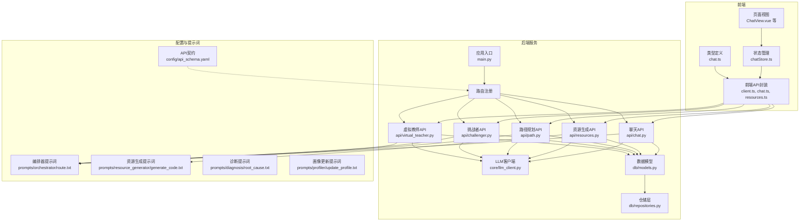
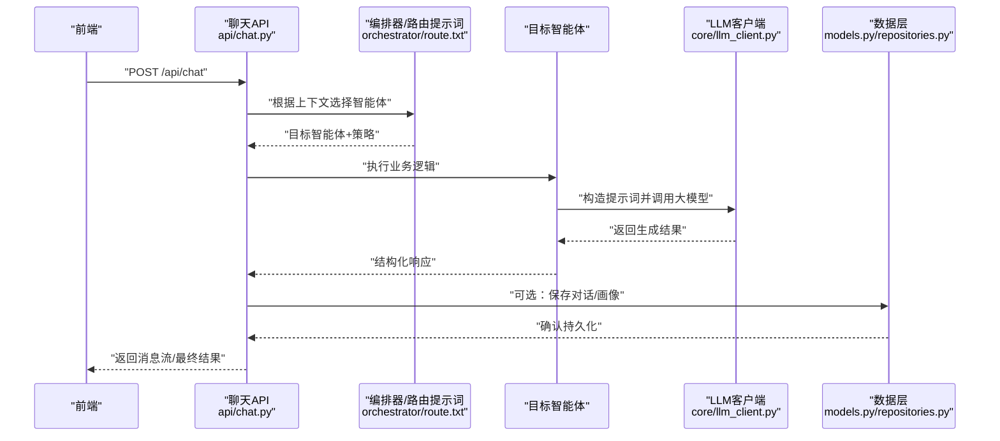
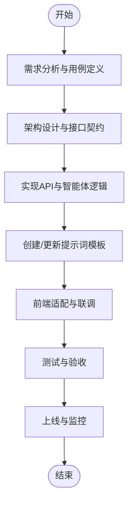
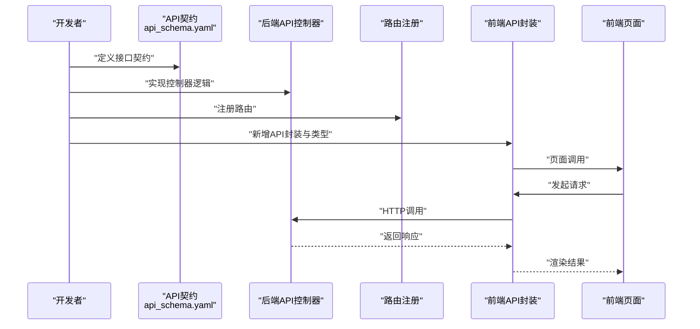
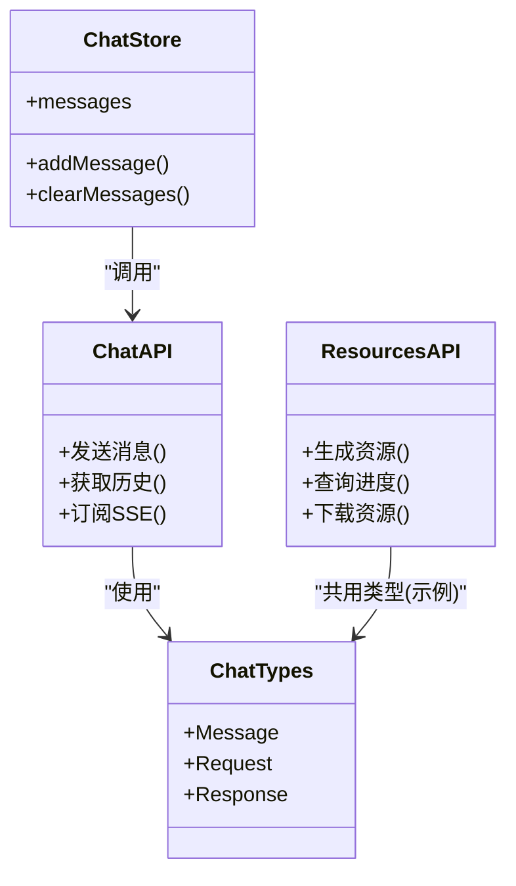
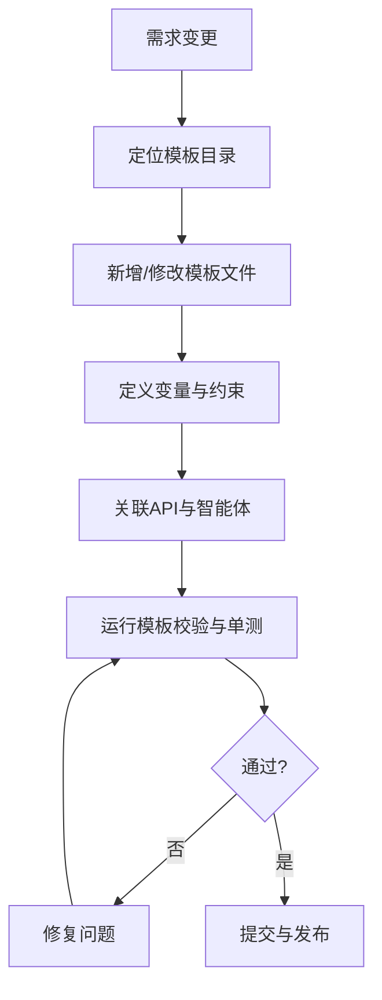
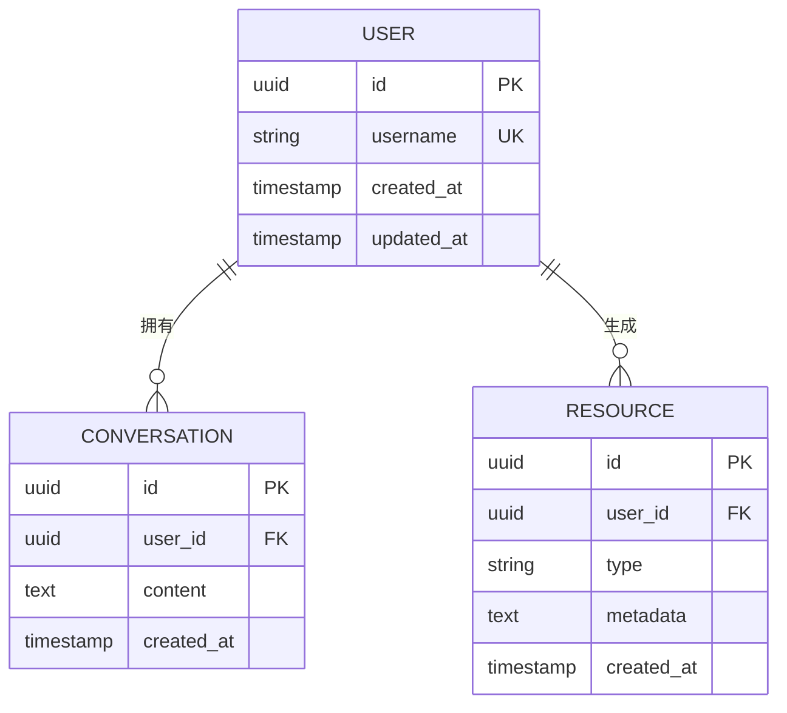
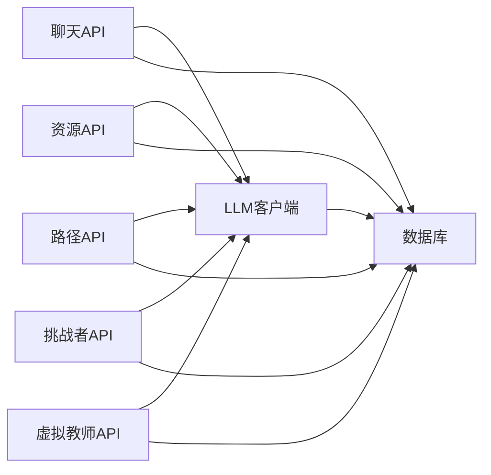

# 新功能开发流程

<cite>
**本文引用的文件**   
- [src/loopse/main.py](file://src/loopse/main.py)
- [src/loopse/api/chat.py](file://src/loopse/api/chat.py)
- [src/loopse/api/resources.py](file://src/loopse/api/resources.py)
- [src/loopse/api/path.py](file://src/loopse/api/path.py)
- [src/loopse/api/challenger.py](file://src/loopse/api/challenger.py)
- [src/loopse/api/virtual_teacher.py](file://src/loopse/api/virtual_teacher.py)
- [src/loopse/api/auth.py](file://src/loopse/api/auth.py)
- [src/loopse/api/health.py](file://src/loopse/api/health.py)
- [src/loopse/core/llm_client.py](file://src/loopse/core/llm_client.py)
- [src/loopse/db/models.py](file://src/loopse/db/models.py)
- [src/loopse/db/repositories.py](file://src/loopse/db/repositories.py)
- [config/prompts/orchestrator/route.txt](file://config/prompts/orchestrator/route.txt)
- [config/prompts/resource_generator/generate_code.txt](file://config/prompts/resource_generator/generate_code.txt)
- [config/prompts/diagnosis/root_cause.txt](file://config/prompts/diagnosis/root_cause.txt)
- [config/prompts/profiler/update_profile.txt](file://config/prompts/profiler/update_profile.txt)
- [config/api_schema.yaml](file://config/api_schema.yaml)
- [frontend/src/api/client.ts](file://frontend/src/api/client.ts)
- [frontend/src/api/chat.ts](file://frontend/src/api/chat.ts)
- [frontend/src/api/resources.ts](file://frontend/src/api/resources.ts)
- [frontend/src/stores/chatStore.ts](file://frontend/src/stores/chatStore.ts)
- [frontend/src/types/chat.ts](file://frontend/src/types/chat.ts)
- [tests/unit/test_orchestrator_integration.py](file://tests/unit/test_orchestrator_integration.py)
- [tests/unit/test_resource_generator.py](file://tests/unit/test_resource_generator.py)
- [tests/unit/test_llm_client.py](file://tests/unit/test_llm_client.py)
</cite>

## 目录
1. [引言](#引言)
2. [项目结构](#项目结构)
3. [核心组件](#核心组件)
4. [架构总览](#架构总览)
5. [详细组件分析](#详细组件分析)
6. [依赖关系分析](#依赖关系分析)
7. [性能考虑](#性能考虑)
8. [故障排查指南](#故障排查指南)
9. [结论](#结论)
10. [附录](#附录)

## 引言
本文件面向希望在多智能体系统中新增功能（如新智能体、API接口、前端页面与提示词模板）的开发者，提供从需求分析到上线验收的完整流程。文档覆盖：
- 系统架构与关键组件职责
- 新增智能体的方法
- API接口的添加流程
- 前端页面开发规范
- 提示词模板的创建与管理
- 测试要求与验收标准

## 项目结构
本项目采用前后端分离与模块化后端设计：
- 后端服务位于 src/loopse，包含 API、Agent、Core、DB、KB、RL 等模块
- 配置与提示词模板位于 config，包括 api_schema.yaml 与各智能体提示词
- 前端位于 frontend，使用 Vue + TypeScript，按功能域组织 API、类型、视图与状态管理
- 测试位于 tests，包含单元测试与集成测试

图表来源
- [src/loopse/main.py](file://src/loopse/main.py)
- [src/loopse/api/chat.py](file://src/loopse/api/chat.py)
- [src/loopse/api/resources.py](file://src/loopse/api/resources.py)
- [src/loopse/api/path.py](file://src/loopse/api/path.py)
- [src/loopse/api/challenger.py](file://src/loopse/api/challenger.py)
- [src/loopse/api/virtual_teacher.py](file://src/loopse/api/virtual_teacher.py)
- [src/loopse/core/llm_client.py](file://src/loopse/core/llm_client.py)
- [src/loopse/db/models.py](file://src/loopse/db/models.py)
- [src/loopse/db/repositories.py](file://src/loopse/db/repositories.py)
- [config/api_schema.yaml](file://config/api_schema.yaml)
- [config/prompts/orchestrator/route.txt](file://config/prompts/orchestrator/route.txt)
- [config/prompts/resource_generator/generate_code.txt](file://config/prompts/resource_generator/generate_code.txt)
- [config/prompts/diagnosis/root_cause.txt](file://config/prompts/diagnosis/root_cause.txt)
- [config/prompts/profiler/update_profile.txt](file://config/prompts/profiler/update_profile.txt)

章节来源
- [src/loopse/main.py](file://src/loopse/main.py)
- [config/api_schema.yaml](file://config/api_schema.yaml)

## 核心组件
- 应用入口与路由：负责启动服务、注册API路由、加载配置与中间件
- API层：按功能域划分，统一请求校验、参数解析、调用Agent或工具、返回响应
- Agent层：各智能体实现具体业务逻辑（对话、资源生成、路径规划、挑战者、虚拟教师等）
- LLM客户端：封装大模型调用、重试、超时、错误处理
- 数据层：模型定义与仓储访问，持久化用户画像、对话历史、资源元数据等
- 配置与提示词：API契约与提示词模板集中管理，便于版本化与灰度切换

章节来源
- [src/loopse/api/chat.py](file://src/loopse/api/chat.py)
- [src/loopse/api/resources.py](file://src/loopse/api/resources.py)
- [src/loopse/api/path.py](file://src/loopse/api/path.py)
- [src/loopse/api/challenger.py](file://src/loopse/api/challenger.py)
- [src/loopse/api/virtual_teacher.py](file://src/loopse/api/virtual_teacher.py)
- [src/loopse/core/llm_client.py](file://src/loopse/core/llm_client.py)
- [src/loopse/db/models.py](file://src/loopse/db/models.py)
- [src/loopse/db/repositories.py](file://src/loopse/db/repositories.py)

## 架构总览
下图展示一次“对话”端到端流程：前端发起请求，后端路由到聊天API，调用编排器与相关智能体，结合提示词与大模型生成回复，并可选地写入数据库。

图表来源
- [src/loopse/api/chat.py](file://src/loopse/api/chat.py)
- [config/prompts/orchestrator/route.txt](file://config/prompts/orchestrator/route.txt)
- [src/loopse/core/llm_client.py](file://src/loopse/core/llm_client.py)
- [src/loopse/db/models.py](file://src/loopse/db/models.py)
- [src/loopse/db/repositories.py](file://src/loopse/db/repositories.py)

## 详细组件分析

### 新增智能体开发流程
步骤概览：
1. 需求分析与用例定义
   - 明确输入输出、触发条件、与其他智能体的协作关系
   - 定义成功指标与失败回退策略
2. 架构设计与接口契约
   - 在 API 契约文件中补充新接口定义（方法、路径、请求/响应结构）
   - 确定是否需要新的数据模型与存储字段
3. 实现方案
   - 新建 API 控制器（参考现有 chat/resources/path/challenger/virtual_teacher）
   - 实现智能体逻辑（可复用编排器与提示词机制）
   - 通过 LLM 客户端调用大模型，统一错误与重试
   - 如需持久化，扩展数据模型与仓储访问
4. 提示词模板
   - 在 config/prompts 下新增对应模板文件，遵循命名与结构规范
   - 将模板变量与运行时上下文绑定
5. 前端适配
   - 新增前端 API 封装与类型定义
   - 新增页面或增强现有页面以支持交互
6. 测试与验收
   - 编写单测与集成测试，覆盖正常、异常与边界场景
   - 进行端到端验证与性能压测
7. 上线与监控
   - 配置灰度开关与日志埋点
   - 建立告警与回滚预案

[此图为概念流程图，不直接映射具体源码文件]

章节来源
- [config/api_schema.yaml](file://config/api_schema.yaml)
- [src/loopse/api/chat.py](file://src/loopse/api/chat.py)
- [src/loopse/api/resources.py](file://src/loopse/api/resources.py)
- [src/loopse/api/path.py](file://src/loopse/api/path.py)
- [src/loopse/api/challenger.py](file://src/loopse/api/challenger.py)
- [src/loopse/api/virtual_teacher.py](file://src/loopse/api/virtual_teacher.py)
- [config/prompts/orchestrator/route.txt](file://config/prompts/orchestrator/route.txt)
- [config/prompts/resource_generator/generate_code.txt](file://config/prompts/resource_generator/generate_code.txt)
- [config/prompts/diagnosis/root_cause.txt](file://config/prompts/diagnosis/root_cause.txt)
- [config/prompts/profiler/update_profile.txt](file://config/prompts/profiler/update_profile.txt)

### API接口添加流程
- 在 API 契约中声明新接口（方法、路径、请求体、响应体、错误码）
- 在后端新增控制器，实现参数校验、业务调用、响应序列化
- 在应用入口注册路由，确保中间件与安全策略生效
- 在前端新增 API 封装与类型定义，并在页面中调用
- 编写测试用例，覆盖正常路径与异常分支

图表来源
- [config/api_schema.yaml](file://config/api_schema.yaml)
- [src/loopse/api/chat.py](file://src/loopse/api/chat.py)
- [src/loopse/api/resources.py](file://src/loopse/api/resources.py)
- [src/loopse/api/path.py](file://src/loopse/api/path.py)
- [src/loopse/api/challenger.py](file://src/loopse/api/challenger.py)
- [src/loopse/api/virtual_teacher.py](file://src/loopse/api/virtual_teacher.py)
- [frontend/src/api/client.ts](file://frontend/src/api/client.ts)
- [frontend/src/api/chat.ts](file://frontend/src/api/chat.ts)
- [frontend/src/api/resources.ts](file://frontend/src/api/resources.ts)

章节来源
- [config/api_schema.yaml](file://config/api_schema.yaml)
- [src/loopse/api/chat.py](file://src/loopse/api/chat.py)
- [frontend/src/api/client.ts](file://frontend/src/api/client.ts)

### 前端页面开发规范
- 类型先行：在 types 目录定义接口与实体类型，保证前后端一致
- API封装：在 api 目录按功能域组织，统一错误处理与重试策略
- 状态管理：在 stores 目录维护页面级状态，避免跨组件共享混乱
- 组件化：通用能力抽取为组件，保持页面简洁
- 样式与主题：遵循 Tailwind 约定，避免内联样式污染
- 可访问性与国际化：预留 i18n 键值与无障碍属性

图表来源
- [frontend/src/api/chat.ts](file://frontend/src/api/chat.ts)
- [frontend/src/api/resources.ts](file://frontend/src/api/resources.ts)
- [frontend/src/stores/chatStore.ts](file://frontend/src/stores/chatStore.ts)
- [frontend/src/types/chat.ts](file://frontend/src/types/chat.ts)

章节来源
- [frontend/src/api/client.ts](file://frontend/src/api/client.ts)
- [frontend/src/api/chat.ts](file://frontend/src/api/chat.ts)
- [frontend/src/api/resources.ts](file://frontend/src/api/resources.ts)
- [frontend/src/stores/chatStore.ts](file://frontend/src/stores/chatStore.ts)
- [frontend/src/types/chat.ts](file://frontend/src/types/chat.ts)

### 提示词模板的创建与管理
- 目录结构：按智能体与任务维度组织，例如 orchestrator、resource_generator、diagnosis、profiler 等
- 命名规范：使用小写英文与下划线，描述任务语义
- 变量注入：通过运行时上下文替换占位符，避免硬编码
- 版本控制：配合 API 契约与配置中心，支持灰度与回滚
- 质量保障：提供模板校验脚本与回归测试，确保格式与必填字段

图表来源
- [config/prompts/orchestrator/route.txt](file://config/prompts/orchestrator/route.txt)
- [config/prompts/resource_generator/generate_code.txt](file://config/prompts/resource_generator/generate_code.txt)
- [config/prompts/diagnosis/root_cause.txt](file://config/prompts/diagnosis/root_cause.txt)
- [config/prompts/profiler/update_profile.txt](file://config/prompts/profiler/update_profile.txt)

章节来源
- [config/prompts/orchestrator/route.txt](file://config/prompts/orchestrator/route.txt)
- [config/prompts/resource_generator/generate_code.txt](file://config/prompts/resource_generator/generate_code.txt)
- [config/prompts/diagnosis/root_cause.txt](file://config/prompts/diagnosis/root_cause.txt)
- [config/prompts/profiler/update_profile.txt](file://config/prompts/profiler/update_profile.txt)

### 数据模型与持久化
- 模型定义：在 models 中声明表结构与字段约束
- 仓储访问：在 repositories 中封装增删改查与事务操作
- 一致性：API 层仅持有引用，复杂逻辑下沉至仓储层
- 迁移与回滚：配合数据库迁移脚本，确保升级安全

图表来源
- [src/loopse/db/models.py](file://src/loopse/db/models.py)
- [src/loopse/db/repositories.py](file://src/loopse/db/repositories.py)

章节来源
- [src/loopse/db/models.py](file://src/loopse/db/models.py)
- [src/loopse/db/repositories.py](file://src/loopse/db/repositories.py)

## 依赖关系分析
- 耦合与内聚
  - API 层与 Agent 层解耦，通过明确的接口契约与提示词驱动
  - LLM 客户端作为外部依赖的统一入口，屏蔽底层差异
  - 数据层独立于业务逻辑，便于替换存储实现
- 外部依赖
  - 大模型服务：需考虑限流、重试与降级
  - 数据库：连接池、索引与慢查询优化
  - 前端构建：静态资源缓存与CDN加速

图表来源
- [src/loopse/api/chat.py](file://src/loopse/api/chat.py)
- [src/loopse/api/resources.py](file://src/loopse/api/resources.py)
- [src/loopse/api/path.py](file://src/loopse/api/path.py)
- [src/loopse/api/challenger.py](file://src/loopse/api/challenger.py)
- [src/loopse/api/virtual_teacher.py](file://src/loopse/api/virtual_teacher.py)
- [src/loopse/core/llm_client.py](file://src/loopse/core/llm_client.py)
- [src/loopse/db/models.py](file://src/loopse/db/models.py)

章节来源
- [src/loopse/core/llm_client.py](file://src/loopse/core/llm_client.py)
- [src/loopse/db/models.py](file://src/loopse/db/models.py)

## 性能考虑
- 并发与异步
  - 对长耗时任务采用异步处理与事件流（SSE/WebSocket）
  - 合理设置超时与重试次数，避免雪崩
- 缓存与去重
  - 对热点提示词与生成结果进行缓存
  - 基于内容指纹去重，减少重复计算
- 数据库优化
  - 针对高频查询建立索引
  - 分页与游标读取，避免全表扫描
- 前端体验
  - 骨架屏与增量渲染
  - 图片与媒体资源懒加载

[本节为通用指导，无需特定文件来源]

## 故障排查指南
- 常见问题定位
  - 接口报错：检查请求参数、鉴权与路由注册
  - 大模型调用失败：查看重试策略、配额与网络连通性
  - 数据不一致：核对事务边界与仓储实现
- 日志与追踪
  - 关键节点打点，记录请求ID与耗时
  - 聚合日志与链路追踪，快速定位瓶颈
- 回滚与降级
  - 灰度发布与开关控制
  - 降级策略：返回缓存或默认答案

章节来源
- [src/loopse/api/auth.py](file://src/loopse/api/auth.py)
- [src/loopse/api/health.py](file://src/loopse/api/health.py)
- [src/loopse/core/llm_client.py](file://src/loopse/core/llm_client.py)

## 结论
通过标准化的需求分析、架构设计、接口契约、实现方案、提示词管理与测试验收流程，团队可以高效地在多智能体系统中新增功能并保持系统稳定与可演进。建议持续完善自动化测试与监控体系，提升交付质量与运维效率。

## 附录

### 测试要求与验收标准
- 单元测试
  - 覆盖核心逻辑与边界条件
  - 模拟外部依赖（LLM、数据库）
- 集成测试
  - 端到端流程验证，包括鉴权、路由与数据持久化
- 性能测试
  - 压测关键接口，评估吞吐与延迟
- 验收标准
  - 功能正确性、稳定性、安全性与可观测性达标
  - 文档与代码审查通过

章节来源
- [tests/unit/test_orchestrator_integration.py](file://tests/unit/test_orchestrator_integration.py)
- [tests/unit/test_resource_generator.py](file://tests/unit/test_resource_generator.py)
- [tests/unit/test_llm_client.py](file://tests/unit/test_llm_client.py)