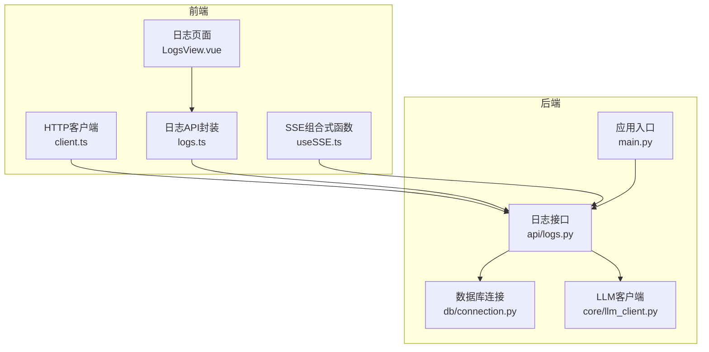
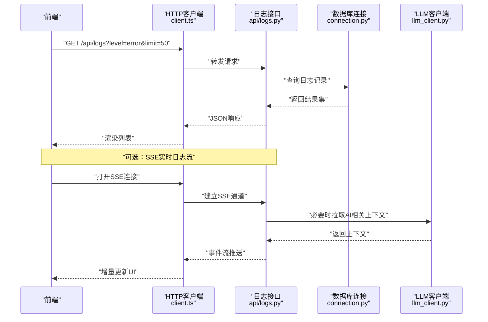
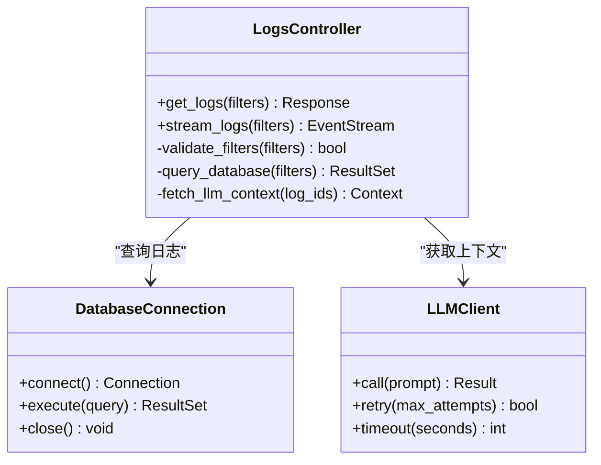
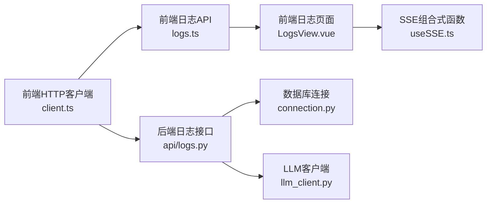

# 调试与问题排查

<cite>
**本文引用的文件**   
- [src/loopse/main.py](file://src/loopse/main.py)
- [src/loopse/api/logs.py](file://src/loopse/api/logs.py)
- [src/loopse/db/connection.py](file://src/loopse/db/connection.py)
- [src/loopse/core/llm_client.py](file://src/loopse/core/llm_client.py)
- [frontend/src/api/client.ts](file://frontend/src/api/client.ts)
- [frontend/src/api/logs.ts](file://frontend/src/api/logs.ts)
- [frontend/src/views/LogsView.vue](file://frontend/src/views/LogsView.vue)
- [frontend/src/composables/useSSE.ts](file://frontend/src/composables/useSSE.ts)
- [scripts/init_db.py](file://scripts/init_db.py)
- [start.sh](file://start.sh)
</cite>

## 目录
1. [简介](#简介)
2. [项目结构](#项目结构)
3. [核心组件](#核心组件)
4. [架构总览](#架构总览)
5. [详细组件分析](#详细组件分析)
6. [依赖关系分析](#依赖关系分析)
7. [性能考虑](#性能考虑)
8. [故障排查指南](#故障排查指南)
9. [结论](#结论)
10. [附录](#附录)

## 简介
本指南面向开发与运维人员，聚焦于后端日志查看与分析、前端调试工具与技巧、性能分析与内存泄漏检测、瓶颈定位方法，以及常见错误模式与解决方案（数据库连接、AI服务调用失败、前端渲染异常等）。文档同时提供调试脚本使用方法和监控指标解读建议，帮助快速定位并解决问题。

## 项目结构
本项目采用前后端分离架构：
- 后端基于Python，提供REST API、日志接口、数据库连接与LLM客户端封装。
- 前端基于Vue生态，提供日志查看页面、SSE实时流式展示、统一HTTP客户端与拦截器。
- 脚本目录包含初始化、数据导入与验证工具。

图表来源
- [src/loopse/main.py](file://src/loopse/main.py)
- [src/loopse/api/logs.py](file://src/loopse/api/logs.py)
- [src/loopse/db/connection.py](file://src/loopse/db/connection.py)
- [src/loopse/core/llm_client.py](file://src/loopse/core/llm_client.py)
- [frontend/src/api/client.ts](file://frontend/src/api/client.ts)
- [frontend/src/api/logs.ts](file://frontend/src/api/logs.ts)
- [frontend/src/views/LogsView.vue](file://frontend/src/views/LogsView.vue)
- [frontend/src/composables/useSSE.ts](file://frontend/src/composables/useSSE.ts)

章节来源
- [src/loopse/main.py](file://src/loopse/main.py)
- [src/loopse/api/logs.py](file://src/loopse/api/logs.py)
- [src/loopse/db/connection.py](file://src/loopse/db/connection.py)
- [src/loopse/core/llm_client.py](file://src/loopse/core/llm_client.py)
- [frontend/src/api/client.ts](file://frontend/src/api/client.ts)
- [frontend/src/api/logs.ts](file://frontend/src/api/logs.ts)
- [frontend/src/views/LogsView.vue](file://frontend/src/views/LogsView.vue)
- [frontend/src/composables/useSSE.ts](file://frontend/src/composables/useSSE.ts)

## 核心组件
- 后端日志接口：提供查询、过滤与分页能力，支持将日志持久化到数据库或外部存储。
- 数据库连接层：负责连接池配置、重试与错误处理，确保高可用。
- LLM客户端：封装对外部AI服务的调用，具备超时、重试与降级策略。
- 前端HTTP客户端：统一请求头、鉴权、错误码映射与重试逻辑。
- 前端日志页面与SSE：实现实时日志流展示与交互。

章节来源
- [src/loopse/api/logs.py](file://src/loopse/api/logs.py)
- [src/loopse/db/connection.py](file://src/loopse/db/connection.py)
- [src/loopse/core/llm_client.py](file://src/loopse/core/llm_client.py)
- [frontend/src/api/client.ts](file://frontend/src/api/client.ts)
- [frontend/src/api/logs.ts](file://frontend/src/api/logs.ts)
- [frontend/src/views/LogsView.vue](file://frontend/src/views/LogsView.vue)
- [frontend/src/composables/useSSE.ts](file://frontend/src/composables/useSSE.ts)

## 架构总览
下图展示了从前端发起日志查询到后端返回结果的完整流程，包括SSE实时推送路径。

图表来源
- [frontend/src/api/client.ts](file://frontend/src/api/client.ts)
- [frontend/src/api/logs.ts](file://frontend/src/api/logs.ts)
- [frontend/src/views/LogsView.vue](file://frontend/src/views/LogsView.vue)
- [frontend/src/composables/useSSE.ts](file://frontend/src/composables/useSSE.ts)
- [src/loopse/api/logs.py](file://src/loopse/api/logs.py)
- [src/loopse/db/connection.py](file://src/loopse/db/connection.py)
- [src/loopse/core/llm_client.py](file://src/loopse/core/llm_client.py)

## 详细组件分析

### 后端日志接口（api/logs.py）
- 职责：接收前端日志查询请求，执行过滤与分页，返回结构化日志；在需要时联动LLM获取上下文信息。
- 关键点：
  - 参数校验：级别、时间范围、关键词、分页大小。
  - 错误处理：数据库异常、外部服务异常的统一包装与可观测性输出。
  - SSE支持：对长连接进行心跳与断线重连提示。
- 常见问题：
  - 大查询导致超时：需限制limit与时间窗口。
  - 外部AI服务不可用：应启用降级策略，仅返回本地日志。

章节来源
- [src/loopse/api/logs.py](file://src/loopse/api/logs.py)

#### 类图（概念映射）

图表来源
- [src/loopse/api/logs.py](file://src/loopse/api/logs.py)
- [src/loopse/db/connection.py](file://src/loopse/db/connection.py)
- [src/loopse/core/llm_client.py](file://src/loopse/core/llm_client.py)

### 数据库连接层（db/connection.py）
- 职责：管理连接池、重试机制、事务边界与错误分类。
- 关键点：
  - 连接池大小与超时配置。
  - 自动重试与退避策略。
  - 健康检查与优雅关闭。
- 常见问题：
  - 连接耗尽：需调整池大小与最大等待时间。
  - 网络抖动：增加重试次数与指数退避。

章节来源
- [src/loopse/db/connection.py](file://src/loopse/db/connection.py)

### LLM客户端（core/llm_client.py）
- 职责：封装AI服务调用，提供重试、超时与降级。
- 关键点：
  - 幂等性与去抖。
  - 错误码映射与用户友好提示。
  - 限流与熔断保护。
- 常见问题：
  - 服务不可用：触发熔断与缓存回退。
  - 响应过长：设置合理超时与分块处理。

章节来源
- [src/loopse/core/llm_client.py](file://src/loopse/core/llm_client.py)

### 前端HTTP客户端（api/client.ts）
- 职责：统一请求拦截、鉴权注入、错误码映射与重试。
- 关键点：
  - 全局错误处理与用户提示。
  - 请求/响应日志打印（开发环境）。
  - 重试策略与退避。
- 常见问题：
  - CORS与跨域：检查代理与CORS配置。
  - Token过期：刷新令牌并重试一次。

章节来源
- [frontend/src/api/client.ts](file://frontend/src/api/client.ts)

### 前端日志API封装（api/logs.ts）
- 职责：封装日志查询与SSE订阅的API调用。
- 关键点：
  - 参数序列化与分页游标。
  - SSE连接状态管理与重连。
- 常见问题：
  - SSE断开：自动重连与进度提示。
  - 大数据量：分页加载与虚拟滚动。

章节来源
- [frontend/src/api/logs.ts](file://frontend/src/api/logs.ts)

### 前端日志页面（views/LogsView.vue）
- 职责：展示日志列表、筛选条件、分页与SSE实时更新。
- 关键点：
  - 防抖搜索与节流滚动。
  - 错误边界与空状态处理。
  - 性能优化：按需加载与懒渲染。
- 常见问题：
  - 渲染卡顿：减少DOM节点与使用虚拟列表。
  - 内存泄漏：清理定时器与事件监听。

章节来源
- [frontend/src/views/LogsView.vue](file://frontend/src/views/LogsView.vue)

### 前端SSE组合式函数（composables/useSSE.ts）
- 职责：管理SSE连接生命周期、消息解析与错误恢复。
- 关键点：
  - 心跳检测与断线重连。
  - 消息去重与顺序保证。
- 常见问题：
  - 重复订阅：确保单例连接。
  - 内存占用：及时释放资源。

章节来源
- [frontend/src/composables/useSSE.ts](file://frontend/src/composables/useSSE.ts)

## 依赖关系分析

图表来源
- [frontend/src/api/client.ts](file://frontend/src/api/client.ts)
- [frontend/src/api/logs.ts](file://frontend/src/api/logs.ts)
- [frontend/src/views/LogsView.vue](file://frontend/src/views/LogsView.vue)
- [frontend/src/composables/useSSE.ts](file://frontend/src/composables/useSSE.ts)
- [src/loopse/api/logs.py](file://src/loopse/api/logs.py)
- [src/loopse/db/connection.py](file://src/loopse/db/connection.py)
- [src/loopse/core/llm_client.py](file://src/loopse/core/llm_client.py)

章节来源
- [frontend/src/api/client.ts](file://frontend/src/api/client.ts)
- [frontend/src/api/logs.ts](file://frontend/src/api/logs.ts)
- [frontend/src/views/LogsView.vue](file://frontend/src/views/LogsView.vue)
- [frontend/src/composables/useSSE.ts](file://frontend/src/composables/useSSE.ts)
- [src/loopse/api/logs.py](file://src/loopse/api/logs.py)
- [src/loopse/db/connection.py](file://src/loopse/db/connection.py)
- [src/loopse/core/llm_client.py](file://src/loopse/core/llm_client.py)

## 性能考虑
- 后端
  - 数据库查询优化：索引、分页与字段裁剪。
  - 连接池调优：根据并发与延迟调整池大小与超时。
  - AI服务调用：超时、重试与熔断，避免雪崩。
- 前端
  - 列表渲染：虚拟滚动与按需加载。
  - SSE流：消息批处理与去重。
  - 内存管理：清理定时器、事件监听与大型对象引用。

[本节为通用指导，不直接分析具体文件]

## 故障排查指南

### 后端日志查看与分析
- 通过前端日志页面查看最近错误与关键事件。
- 使用后端日志接口按级别、时间与关键词过滤。
- 结合SSE实时观察问题复现时的动态变化。

章节来源
- [frontend/src/views/LogsView.vue](file://frontend/src/views/LogsView.vue)
- [frontend/src/api/logs.ts](file://frontend/src/api/logs.ts)
- [src/loopse/api/logs.py](file://src/loopse/api/logs.py)

### 前端调试工具与技巧
- 浏览器开发者工具：Network面板查看请求与响应，Console面板查看错误堆栈。
- Vue Devtools：检查组件状态与事件流。
- 自定义拦截器：在HTTP客户端中打印请求/响应摘要（开发环境）。

章节来源
- [frontend/src/api/client.ts](file://frontend/src/api/client.ts)

### 性能分析方法
- 前端
  - Performance面板录制关键操作，识别长任务与布局抖动。
  - Memory面板对比快照，定位未释放对象与闭包引用。
- 后端
  - 监控数据库慢查询与连接池等待。
  - 统计AI服务调用耗时与失败率。

[本节为通用指导，不直接分析具体文件]

### 内存泄漏检测
- 前端
  - 检查SSE连接是否在所有场景下正确关闭。
  - 避免在组件销毁后仍持有定时器或事件监听。
- 后端
  - 确认数据库连接在异常路径上被释放。
  - 避免长时间持有的全局缓存无淘汰策略。

章节来源
- [frontend/src/composables/useSSE.ts](file://frontend/src/composables/useSSE.ts)
- [src/loopse/db/connection.py](file://src/loopse/db/connection.py)

### 瓶颈定位
- 端到端链路追踪：从前端请求到后端处理与外部服务调用。
- 热点接口：关注日志查询与AI上下文获取接口的P95/P99延迟。
- 资源竞争：数据库连接池与AI服务限流。

章节来源
- [src/loopse/api/logs.py](file://src/loopse/api/logs.py)
- [src/loopse/core/llm_client.py](file://src/loopse/core/llm_client.py)

### 常见错误模式与解决方案
- 数据库连接问题
  - 现象：连接超时、连接池耗尽。
  - 排查：检查连接池配置、网络连通性与数据库负载。
  - 解决：增大池大小、优化查询、增加重试与退避。
- AI服务调用失败
  - 现象：超时、限流、服务不可用。
  - 排查：查看客户端重试与熔断状态、外部服务健康检查。
  - 解决：调整超时与重试策略、启用降级与缓存。
- 前端渲染异常
  - 现象：页面空白、列表不更新、内存增长。
  - 排查：检查SSE连接状态、组件生命周期与事件监听清理。
  - 解决：修复订阅与清理逻辑、优化渲染策略。

章节来源
- [src/loopse/db/connection.py](file://src/loopse/db/connection.py)
- [src/loopse/core/llm_client.py](file://src/loopse/core/llm_client.py)
- [frontend/src/composables/useSSE.ts](file://frontend/src/composables/useSSE.ts)
- [frontend/src/views/LogsView.vue](file://frontend/src/views/LogsView.vue)

### 调试脚本使用方法
- 初始化数据库：运行数据库初始化脚本，确保表结构与种子数据就绪。
- 启动服务：使用启动脚本拉起后端与前端服务，便于联调。

章节来源
- [scripts/init_db.py](file://scripts/init_db.py)
- [start.sh](file://start.sh)

### 监控指标解读
- 后端
  - 日志接口QPS与延迟分布。
  - 数据库连接池使用率与等待队列长度。
  - AI服务调用成功率与平均耗时。
- 前端
  - 首屏加载时间与关键交互响应时间。
  - SSE连接稳定性与消息吞吐。

[本节为通用指导，不直接分析具体文件]

## 结论
通过系统化的日志查看、前端调试、性能分析与常见错误排查方法，可以快速定位并解决数据库连接、AI服务调用与前端渲染等问题。配合调试脚本与监控指标，能够持续提升系统的稳定性与用户体验。

[本节为总结性内容，不直接分析具体文件]

## 附录
- 常用命令
  - 初始化数据库：参考初始化脚本。
  - 启动服务：参考启动脚本。
- 参考文件
  - 后端入口与应用装配：参见应用入口文件。
  - 前端路由与视图：参见前端视图与路由定义。

章节来源
- [scripts/init_db.py](file://scripts/init_db.py)
- [start.sh](file://start.sh)
- [src/loopse/main.py](file://src/loopse/main.py)