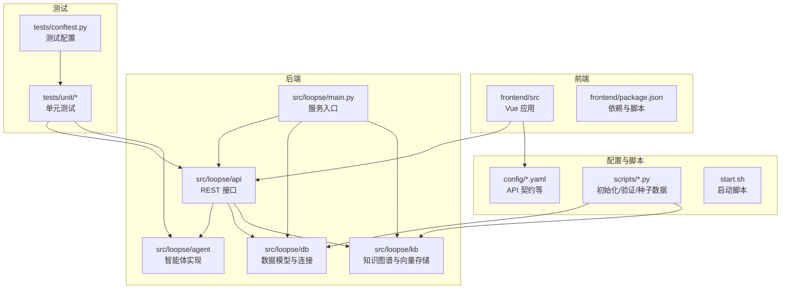
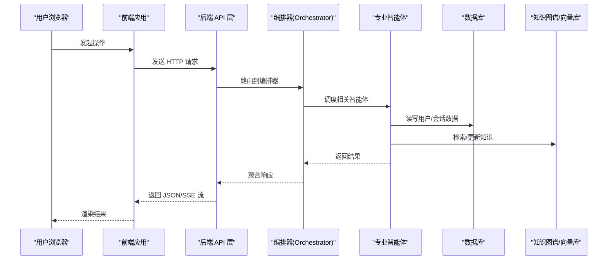
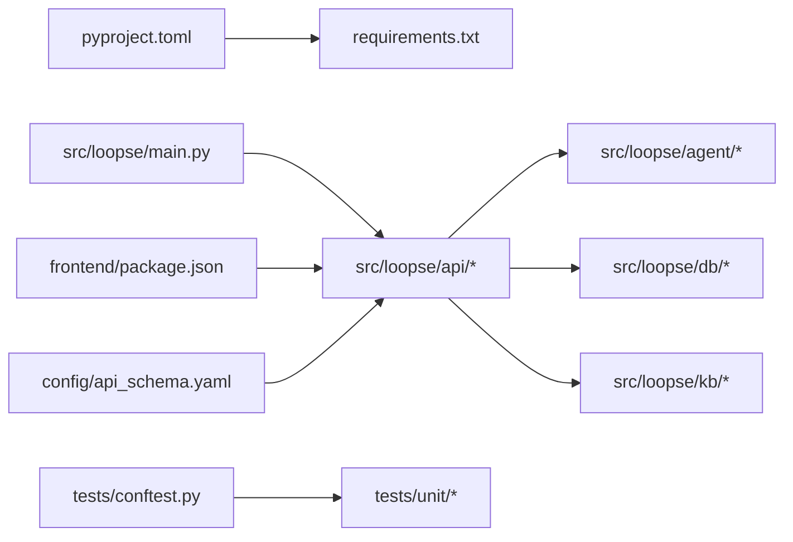

# 贡献指南

<cite>
**本文引用的文件**   
- [README.md](file://README.md)
- [CONTRIBUTING.md](file://CONTRIBUTING.md)
- [CODE_OF_CONDUCT.md](file://CODE_OF_CONDUCT.md)
- [pyproject.toml](file://pyproject.toml)
- [requirements.txt](file://requirements.txt)
- [start.sh](file://start.sh)
- [frontend/package.json](file://frontend/package.json)
- [tests/conftest.py](file://tests/conftest.py)
- [src/loopse/main.py](file://src/loopse/main.py)
- [scripts/init_db.py](file://scripts/init_db.py)
- [scripts/verify_env.py](file://scripts/verify_env.py)
- [config/api_schema.yaml](file://config/api_schema.yaml)
</cite>

## 目录
1. [简介](#简介)
2. [项目结构](#项目结构)
3. [核心组件](#核心组件)
4. [架构总览](#架构总览)
5. [详细组件分析](#详细组件分析)
6. [依赖关系分析](#依赖关系分析)
7. [性能与可维护性建议](#性能与可维护性建议)
8. [故障排查指南](#故障排查指南)
9. [结论](#结论)
10. [附录](#附录)

## 简介
本贡献指南面向希望参与 Socrates-Cube 开源项目的开发者、测试人员与技术文档作者。文档涵盖：
- 如何报告 Bug、提出功能请求与参与讨论
- Pull Request 提交流程、代码审查标准与合并要求
- 测试用例编写规范、文档更新要求与版本发布流程
- 贡献者行为准则与社区交流方式
- 参与开源项目的最佳实践

为保证一致性与可复现性，请遵循本指南中的分支策略、提交信息规范、测试与文档要求。

## 项目结构
仓库采用前后端分离与多语言工程组织方式：
- 后端服务与智能体逻辑位于 src/loopse，API 路由、数据模型、知识库与工具脚本位于 scripts 与 config
- 前端应用位于 frontend，使用现代前端构建与包管理工具
- 测试集中于 tests，包含单元测试与集成测试配置
- 部署与环境初始化脚本位于根目录与 scripts

图表来源
- [src/loopse/main.py](file://src/loopse/main.py)
- [src/loopse/api](file://src/loopse/api)
- [src/loopse/agent](file://src/loopse/agent)
- [src/loopse/db](file://src/loopse/db)
- [src/loopse/kb](file://src/loopse/kb)
- [config/api_schema.yaml](file://config/api_schema.yaml)
- [scripts](file://scripts)
- [tests/conftest.py](file://tests/conftest.py)
- [frontend/package.json](file://frontend/package.json)

章节来源
- [README.md](file://README.md)
- [CONTRIBUTING.md](file://CONTRIBUTING.md)
- [pyproject.toml](file://pyproject.toml)
- [requirements.txt](file://requirements.txt)
- [start.sh](file://start.sh)
- [frontend/package.json](file://frontend/package.json)
- [tests/conftest.py](file://tests/conftest.py)
- [src/loopse/main.py](file://src/loopse/main.py)
- [scripts/init_db.py](file://scripts/init_db.py)
- [scripts/verify_env.py](file://scripts/verify_env.py)
- [config/api_schema.yaml](file://config/api_schema.yaml)

## 核心组件
- 服务入口与生命周期管理：负责加载配置、初始化数据库与知识库、注册路由与中间件、启动 HTTP 服务
- API 层：按领域划分的路由模块（如认证、聊天、路径规划、资源生成等），对外暴露 REST 接口
- 智能体层：协调器与各专业智能体（诊断、挑战者、资源生成、检索器等）的协作编排
- 数据与知识层：数据库模型与仓储、知识图谱与向量存储、文本切分与解析
- 前端应用：基于 Vue 的前端页面与状态管理，调用后端 API 并渲染交互界面
- 测试与配置：统一的测试夹具、环境校验脚本、API 契约与依赖声明

章节来源
- [src/loopse/main.py](file://src/loopse/main.py)
- [src/loopse/api](file://src/loopse/api)
- [src/loopse/agent](file://src/loopse/agent)
- [src/loopse/db](file://src/loopse/db)
- [src/loopse/kb](file://src/loopse/kb)
- [frontend/package.json](file://frontend/package.json)
- [tests/conftest.py](file://tests/conftest.py)

## 架构总览
系统采用分层架构与模块化设计：
- 表现层：前端通过 HTTP/SSE 与后端交互
- 接口层：REST API 提供统一访问点，遵循 API 契约定义
- 业务层：智能体编排与领域逻辑
- 数据层：数据库与知识图谱/向量库
- 支撑层：配置、安全、日志与监控

图表来源
- [src/loopse/main.py](file://src/loopse/main.py)
- [src/loopse/api](file://src/loopse/api)
- [src/loopse/agent/orchestrator.py](file://src/loopse/agent/orchestrator.py)
- [src/loopse/db](file://src/loopse/db)
- [src/loopse/kb](file://src/loopse/kb)
- [config/api_schema.yaml](file://config/api_schema.yaml)

## 详细组件分析

### 贡献工作流与分支策略
- 分支命名
  - feature/xxx：新功能开发
  - fix/xxx：缺陷修复
  - docs/xxx：文档改进
  - refactor/xxx：重构优化
  - release/vX.Y.Z：版本发布
- 分支保护与合并
  - main/master 分支受保护，禁止直接推送
  - 所有变更需通过 Pull Request 合并
  - 至少一名维护者审查并通过
  - CI 全绿后方可合并
- 提交信息规范
  - 类型前缀：feat、fix、docs、style、refactor、test、chore、revert
  - 主题行不超过 72 字符，描述问题与动机
  - 关联 Issue 编号（如 #123）

章节来源
- [CONTRIBUTING.md](file://CONTRIBUTING.md)

### 报告 Bug 与功能请求
- 报告 Bug
  - 搜索现有 Issue，避免重复
  - 提供复现步骤、期望与实际行为、环境与版本信息
  - 附上错误日志或截图链接
- 功能请求
  - 说明需求背景与价值
  - 给出用例与验收标准
  - 评估影响范围与兼容性
- 讨论与沟通
  - 在 Issue 中保持建设性对话
  - 使用标签分类（bug、enhancement、question、help wanted）

章节来源
- [CONTRIBUTING.md](file://CONTRIBUTING.md)

### Pull Request 提交流程
- 前置条件
  - 本地运行测试通过
  - 更新相关文档与示例
  - 遵循代码风格与命名约定
- 提交 PR
  - 选择正确的目标分支
  - 填写 PR 模板：变更概述、影响范围、测试覆盖、风险与回滚方案
  - 关联 Issue 与相关文档
- 审查与修改
  - 根据审查意见快速迭代
  - 保持小步提交，便于审阅
- 合并要求
  - 至少一位维护者批准
  - CI 检查全部通过
  - 无冲突且符合分支策略

章节来源
- [CONTRIBUTING.md](file://CONTRIBUTING.md)

### 代码审查标准与合并要求
- 可读性与一致性
  - 清晰的变量与函数命名
  - 合理的模块拆分与职责单一
  - 注释与文档同步更新
- 健壮性与安全性
  - 输入校验与异常处理
  - 敏感信息不硬编码
  - 权限与隐私控制
- 性能与可维护性
  - 避免不必要的 I/O 与循环
  - 缓存与分页策略合理
  - 可观测性（日志、指标）完善
- 自动化检查
  - Lint 与格式化通过
  - 单元测试覆盖率达标
  - 集成测试稳定

章节来源
- [CONTRIBUTING.md](file://CONTRIBUTING.md)

### 测试用例编写规范
- 测试结构
  - 使用 pytest 框架，conftest.py 集中配置夹具
  - 单元、集成与端到端测试分层清晰
- 命名与组织
  - 文件名以 test_*.py 或 *_test.py 形式
  - 测试类与方法语义明确，覆盖正常与异常路径
- 数据与依赖
  - 使用 Mock 与 Fixture 隔离外部依赖
  - 种子数据与测试数据库独立
- 断言与可观测性
  - 精确断言返回值与副作用
  - 记录必要日志以便调试

章节来源
- [tests/conftest.py](file://tests/conftest.py)
- [tests/unit](file://tests/unit)

### 文档更新要求
- 文档位置
  - 架构与设计：docs/architecture
  - 部署与运维：docs/deployment
  - 需求与参考：docs/requirements, docs/references
  - 测试结果与演示：docs/results
- 更新原则
  - 变更即更新，确保文档与代码一致
  - 新增功能需补充使用说明与示例
  - 重要变更在变更日志中记录

章节来源
- [docs](file://docs)

### 版本发布流程
- 版本号规则
  - 遵循语义化版本：主版本.次版本.修订号
- 发布清单
  - 更新变更日志与里程碑
  - 回归测试与性能基准
  - 打包与签名（如适用）
- 发布后
  - 通知社区与渠道
  - 监控线上问题与回滚预案

章节来源
- [CONTRIBUTING.md](file://CONTRIBUTING.md)

### 贡献者行为准则与社区交流
- 行为准则
  - 尊重与包容，拒绝骚扰与歧视
  - 聚焦问题与解决方案
  - 遵守法律法规与知识产权
- 交流方式
  - Issue 用于问题与需求
  - 讨论区用于方案探讨
  - 邮件列表或即时通讯用于紧急事项

章节来源
- [CODE_OF_CONDUCT.md](file://CODE_OF_CONDUCT.md)

### 最佳实践：如何高效参与开源项目
- 从小处入手
  - 先阅读贡献指南与行为准则
  - 从文档改进与小修复开始
- 建立上下文
  - 了解架构与关键模块
  - 运行本地环境并完成基础测试
- 有效沟通
  - 在 Issue 中清晰表达问题与建议
  - 主动寻求反馈与指导
- 持续学习
  - 关注变更记录与讨论历史
  - 分享经验与总结教训

章节来源
- [CONTRIBUTING.md](file://CONTRIBUTING.md)
- [README.md](file://README.md)

## 依赖关系分析
- 后端依赖
  - Python 运行时与第三方库由 pyproject.toml 与 requirements.txt 声明
  - 服务入口与模块间耦合度低，API 与 Agent 解耦清晰
- 前端依赖
  - package.json 管理前端依赖与构建脚本
- 配置与契约
  - api_schema.yaml 定义接口契约，驱动前后端一致性
- 测试依赖
  - conftest.py 集中配置测试夹具与全局设置

图表来源
- [pyproject.toml](file://pyproject.toml)
- [requirements.txt](file://requirements.txt)
- [src/loopse/main.py](file://src/loopse/main.py)
- [src/loopse/api](file://src/loopse/api)
- [src/loopse/agent](file://src/loopse/agent)
- [src/loopse/db](file://src/loopse/db)
- [src/loopse/kb](file://src/loopse/kb)
- [frontend/package.json](file://frontend/package.json)
- [config/api_schema.yaml](file://config/api_schema.yaml)
- [tests/conftest.py](file://tests/conftest.py)

章节来源
- [pyproject.toml](file://pyproject.toml)
- [requirements.txt](file://requirements.txt)
- [frontend/package.json](file://frontend/package.json)
- [config/api_schema.yaml](file://config/api_schema.yaml)
- [tests/conftest.py](file://tests/conftest.py)

## 性能与可维护性建议
- 接口层
  - 合理使用缓存与分页，减少大对象传输
  - 对耗时操作采用异步与 SSE 流式返回
- 智能体层
  - 限制并发与超时，避免级联失败
  - 引入重试与熔断机制
- 数据层
  - 索引与查询优化，避免 N+1 问题
  - 向量检索与图查询参数调优
- 前端层
  - 懒加载与增量渲染
  - 资源压缩与 CDN 加速

[本节为通用建议，无需特定文件引用]

## 故障排查指南
- 环境初始化
  - 使用 init_db.py 初始化数据库与种子数据
  - 使用 verify_env.py 校验运行环境
- 服务启动
  - 通过 start.sh 启动服务，观察端口与日志
- 常见问题
  - 依赖缺失：检查 pyproject.toml 与 requirements.txt
  - 数据库连接失败：确认连接参数与网络可达
  - 前端构建失败：清理缓存并重新安装依赖
- 日志与调试
  - 开启调试模式，收集堆栈与上下文
  - 使用结构化日志与追踪 ID 定位问题

章节来源
- [scripts/init_db.py](file://scripts/init_db.py)
- [scripts/verify_env.py](file://scripts/verify_env.py)
- [start.sh](file://start.sh)
- [pyproject.toml](file://pyproject.toml)
- [requirements.txt](file://requirements.txt)

## 结论
本贡献指南旨在帮助贡献者高效、高质量地参与 Socrates-Cube 项目。通过明确的流程、标准与实践，我们期望提升协作效率与代码质量，共同推动项目发展。感谢每一位贡献者的付出与支持。

[本节为总结性内容，无需特定文件引用]

## 附录
- 快速上手
  - 克隆仓库并安装依赖
  - 初始化数据库与环境
  - 启动服务与前端
- 常用命令
  - 运行测试：见测试配置与脚本
  - 构建前端：见 package.json 脚本
  - 启动服务：见 start.sh

章节来源
- [README.md](file://README.md)
- [CONTRIBUTING.md](file://CONTRIBUTING.md)
- [frontend/package.json](file://frontend/package.json)
- [start.sh](file://start.sh)