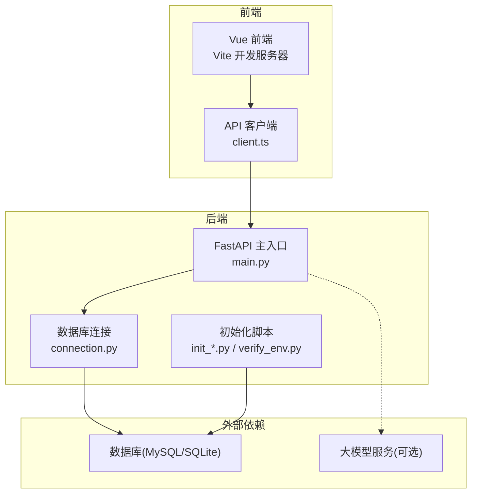
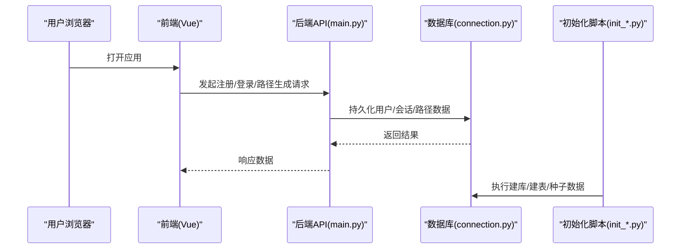
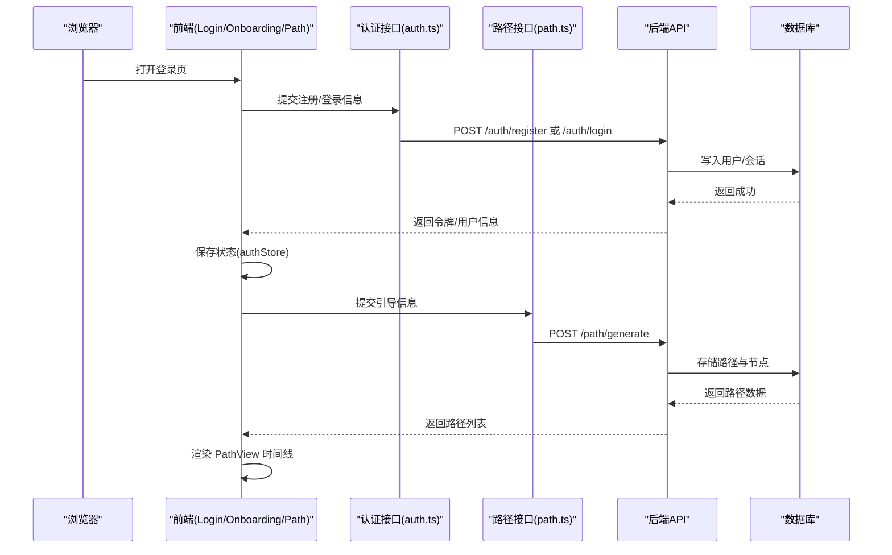
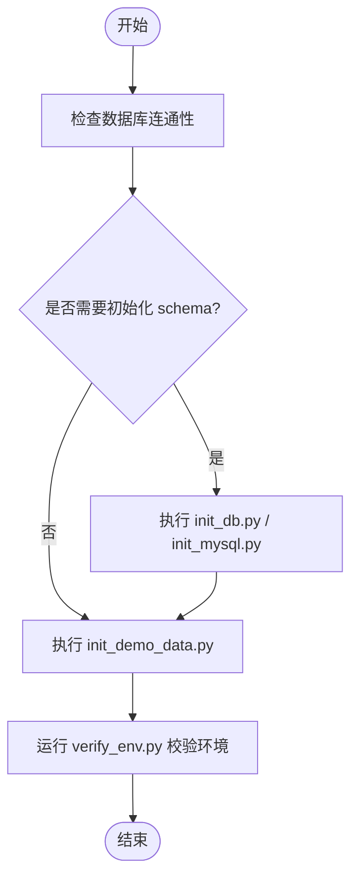
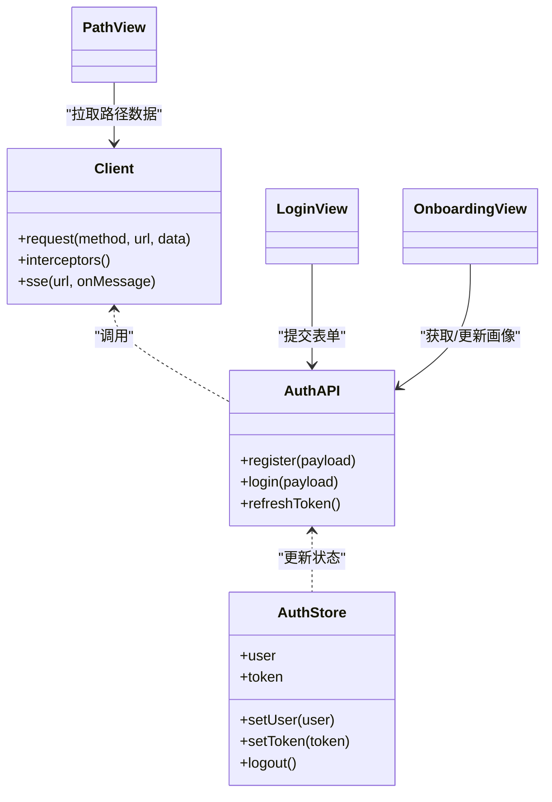
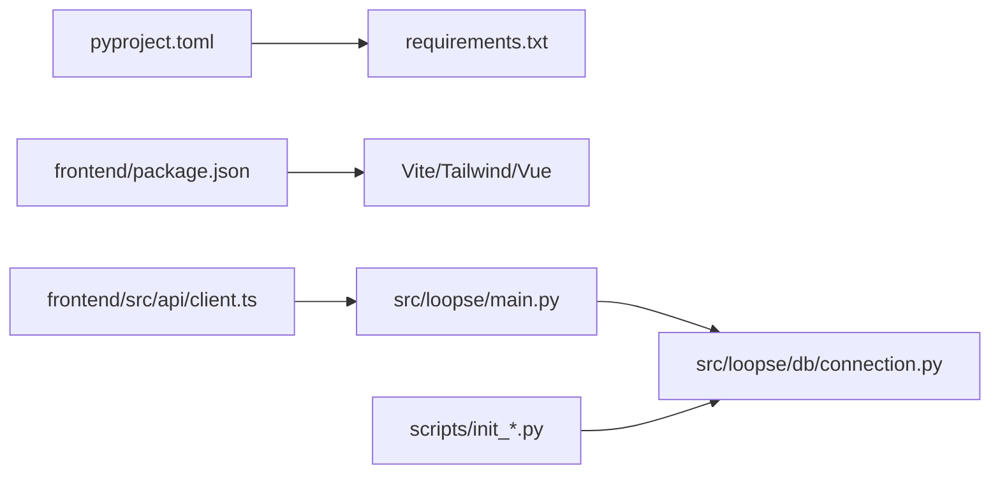

# 快速开始

<cite>
**本文引用的文件**   
- [start.sh](file://start.sh)
- [pyproject.toml](file://pyproject.toml)
- [requirements.txt](file://requirements.txt)
- [frontend/package.json](file://frontend/package.json)
- [frontend/vite.config.ts](file://frontend/vite.config.ts)
- [src/loopse/main.py](file://src/loopse/main.py)
- [src/loopse/db/connection.py](file://src/loopse/db/connection.py)
- [scripts/init_db.py](file://scripts/init_db.py)
- [scripts/init_mysql.py](file://scripts/init_mysql.py)
- [scripts/init_demo_data.py](file://scripts/init_demo_data.py)
- [scripts/verify_env.py](file://scripts/verify_env.py)
- [config/api_schema.yaml](file://config/api_schema.yaml)
- [frontend/src/api/client.ts](file://frontend/src/api/client.ts)
- [frontend/src/stores/authStore.ts](file://frontend/src/stores/authStore.ts)
- [frontend/src/views/LoginView.vue](file://frontend/src/views/LoginView.vue)
- [frontend/src/views/OnboardingView.vue](file://frontend/src/views/OnboardingView.vue)
- [frontend/src/views/PathView.vue](file://frontend/src/views/PathView.vue)
- [frontend/src/api/path.ts](file://frontend/src/api/path.ts)
- [frontend/src/api/auth.ts](file://frontend/src/api/auth.ts)
- [frontend/nginx.conf](file://frontend/nginx.conf)
</cite>

## 目录
1. [简介](#简介)
2. [项目结构](#项目结构)
3. [核心组件](#核心组件)
4. [架构总览](#架构总览)
5. [详细组件分析](#详细组件分析)
6. [依赖关系分析](#依赖关系分析)
7. [性能考虑](#性能考虑)
8. [故障排查指南](#故障排查指南)
9. [结论](#结论)
10. [附录](#附录)

## 简介
本快速开始指南面向首次接触 Socrates-Cube 平台的开发者与学习者，目标是在 30 分钟内完成环境搭建、数据库初始化、服务启动，并完成“用户注册 + 学习路径生成”的完整体验流程。文档覆盖：
- Python 环境与后端依赖安装
- 前端依赖安装与开发服务器启动
- 数据库初始化与基础数据准备
- 环境变量与 API 密钥配置（含开发与生产差异）
- 常见问题排查与解决方案
- 端到端示例：从注册到生成个性化学习路径

## 项目结构
Socrates-Cube 采用前后端分离架构：
- 后端：Python 应用，提供 REST/SSE 接口，连接数据库与向量知识库，编排多 Agent 协作
- 前端：Vue 3 + Vite，提供登录、引导、对话、诊断、资源生成、学习路径等页面
- 脚本：提供数据库初始化、演示数据注入与环境校验工具
- 配置：API 契约、提示词模板、Agent 人设等

图表来源
- [src/loopse/main.py](file://src/loopse/main.py)
- [src/loopse/db/connection.py](file://src/loopse/db/connection.py)
- [scripts/init_db.py](file://scripts/init_db.py)
- [scripts/init_mysql.py](file://scripts/init_mysql.py)
- [scripts/init_demo_data.py](file://scripts/init_demo_data.py)
- [scripts/verify_env.py](file://scripts/verify_env.py)
- [frontend/src/api/client.ts](file://frontend/src/api/client.ts)

章节来源
- [start.sh](file://start.sh)
- [pyproject.toml](file://pyproject.toml)
- [requirements.txt](file://requirements.txt)
- [frontend/package.json](file://frontend/package.json)
- [frontend/vite.config.ts](file://frontend/vite.config.ts)
- [src/loopse/main.py](file://src/loopse/main.py)
- [src/loopse/db/connection.py](file://src/loopse/db/connection.py)
- [scripts/init_db.py](file://scripts/init_db.py)
- [scripts/init_mysql.py](file://scripts/init_mysql.py)
- [scripts/init_demo_data.py](file://scripts/init_demo_data.py)
- [scripts/verify_env.py](file://scripts/verify_env.py)
- [frontend/src/api/client.ts](file://frontend/src/api/client.ts)

## 核心组件
- 后端主入口：负责路由挂载、中间件、生命周期钩子与对外暴露的 API
- 数据库连接：封装连接池、迁移与读写策略
- 初始化脚本：建库建表、填充演示数据、环境校验
- 前端 API 客户端：统一请求拦截、鉴权头注入、错误处理
- 认证与引导：登录/注册、新手引导、学习路径生成

章节来源
- [src/loopse/main.py](file://src/loopse/main.py)
- [src/loopse/db/connection.py](file://src/loopse/db/connection.py)
- [scripts/init_db.py](file://scripts/init_db.py)
- [scripts/init_mysql.py](file://scripts/init_mysql.py)
- [scripts/init_demo_data.py](file://scripts/init_demo_data.py)
- [frontend/src/api/client.ts](file://frontend/src/api/client.ts)
- [frontend/src/stores/authStore.ts](file://frontend/src/stores/authStore.ts)
- [frontend/src/views/LoginView.vue](file://frontend/src/views/LoginView.vue)
- [frontend/src/views/OnboardingView.vue](file://frontend/src/views/OnboardingView.vue)
- [frontend/src/views/PathView.vue](file://frontend/src/views/PathView.vue)
- [frontend/src/api/path.ts](file://frontend/src/api/path.ts)
- [frontend/src/api/auth.ts](file://frontend/src/api/auth.ts)

## 架构总览
下图展示从浏览器到后端、再到数据库与可选大模型的调用链路，以及初始化脚本的作用域。

图表来源
- [src/loopse/main.py](file://src/loopse/main.py)
- [src/loopse/db/connection.py](file://src/loopse/db/connection.py)
- [scripts/init_db.py](file://scripts/init_db.py)
- [scripts/init_mysql.py](file://scripts/init_mysql.py)
- [scripts/init_demo_data.py](file://scripts/init_demo_data.py)

## 详细组件分析

### 环境搭建与启动（30 分钟达成）
- 前置条件
  - Python 版本满足 pyproject.toml 要求
  - Node.js 与包管理器（npm/pnpm/yarn）可用
  - 数据库：MySQL 或 SQLite（根据连接配置选择）
- 后端安装与启动
  - 使用 requirements.txt 或 pyproject.toml 安装依赖
  - 通过 start.sh 或 main.py 启动后端服务
- 前端安装与启动
  - 进入 frontend 目录，安装依赖并启动开发服务器
  - 配置 Vite 代理以指向后端地址
- 数据库初始化与基础数据
  - 运行 init_db.py 或 init_mysql.py 完成建库建表
  - 运行 init_demo_data.py 注入演示数据
- 环境变量与 API 密钥
  - 参考 scripts/verify_env.py 检查必要变量
  - 设置数据库连接、LLM 相关密钥（如需要）

章节来源
- [pyproject.toml](file://pyproject.toml)
- [requirements.txt](file://requirements.txt)
- [start.sh](file://start.sh)
- [src/loopse/main.py](file://src/loopse/main.py)
- [frontend/package.json](file://frontend/package.json)
- [frontend/vite.config.ts](file://frontend/vite.config.ts)
- [scripts/init_db.py](file://scripts/init_db.py)
- [scripts/init_mysql.py](file://scripts/init_mysql.py)
- [scripts/init_demo_data.py](file://scripts/init_demo_data.py)
- [scripts/verify_env.py](file://scripts/verify_env.py)

### 环境变量与 API 密钥配置（开发 vs 生产）
- 通用变量
  - 数据库连接串、时区、日志级别、跨域白名单等
- 开发环境
  - 本地调试模式、热重载、Mock 开关、CORS 宽松策略
- 生产环境
  - 关闭调试、启用 HTTPS、严格 CORS、限流与鉴权、外部 LLM 密钥管理
- 验证方式
  - 使用 verify_env.py 进行一致性检查与缺失项提示

章节来源
- [scripts/verify_env.py](file://scripts/verify_env.py)
- [frontend/vite.config.ts](file://frontend/vite.config.ts)
- [frontend/nginx.conf](file://frontend/nginx.conf)

### 第一个用户注册与学习路径生成（端到端示例）
- 步骤概览
  - 访问前端登录页，完成注册/登录
  - 进入引导页，填写兴趣与目标
  - 触发学习路径生成，查看可视化时间线
- 关键交互
  - 前端调用认证接口创建用户与会话
  - 引导完成后调用路径规划接口生成个性化路径
  - 前端渲染路径节点与详情

图表来源
- [frontend/src/views/LoginView.vue](file://frontend/src/views/LoginView.vue)
- [frontend/src/views/OnboardingView.vue](file://frontend/src/views/OnboardingView.vue)
- [frontend/src/views/PathView.vue](file://frontend/src/views/PathView.vue)
- [frontend/src/api/auth.ts](file://frontend/src/api/auth.ts)
- [frontend/src/api/path.ts](file://frontend/src/api/path.ts)
- [frontend/src/stores/authStore.ts](file://frontend/src/stores/authStore.ts)
- [src/loopse/main.py](file://src/loopse/main.py)
- [src/loopse/db/connection.py](file://src/loopse/db/connection.py)

章节来源
- [frontend/src/views/LoginView.vue](file://frontend/src/views/LoginView.vue)
- [frontend/src/views/OnboardingView.vue](file://frontend/src/views/OnboardingView.vue)
- [frontend/src/views/PathView.vue](file://frontend/src/views/PathView.vue)
- [frontend/src/api/auth.ts](file://frontend/src/api/auth.ts)
- [frontend/src/api/path.ts](file://frontend/src/api/path.ts)
- [frontend/src/stores/authStore.ts](file://frontend/src/stores/authStore.ts)
- [src/loopse/main.py](file://src/loopse/main.py)
- [src/loopse/db/connection.py](file://src/loopse/db/connection.py)

### 数据库与初始化脚本
- 建库建表
  - init_db.py：通用初始化（适配不同数据库驱动）
  - init_mysql.py：MySQL 专用初始化（字符集、引擎、索引）
- 演示数据
  - init_demo_data.py：注入课程、资源、示例路径等基础数据
- 连接管理
  - connection.py：连接池、事务、重试与错误映射

图表来源
- [scripts/init_db.py](file://scripts/init_db.py)
- [scripts/init_mysql.py](file://scripts/init_mysql.py)
- [scripts/init_demo_data.py](file://scripts/init_demo_data.py)
- [scripts/verify_env.py](file://scripts/verify_env.py)
- [src/loopse/db/connection.py](file://src/loopse/db/connection.py)

章节来源
- [scripts/init_db.py](file://scripts/init_db.py)
- [scripts/init_mysql.py](file://scripts/init_mysql.py)
- [scripts/init_demo_data.py](file://scripts/init_demo_data.py)
- [scripts/verify_env.py](file://scripts/verify_env.py)
- [src/loopse/db/connection.py](file://src/loopse/db/connection.py)

### 前端 API 客户端与鉴权
- 统一客户端
  - client.ts：请求拦截、超时、错误码处理、SSE 支持
- 认证模块
  - auth.ts：注册/登录/刷新令牌
  - authStore.ts：本地状态与令牌持久化
- 视图集成
  - LoginView.vue：表单校验与跳转
  - OnboardingView.vue：收集用户画像
  - PathView.vue：展示路径与详情

图表来源
- [frontend/src/api/client.ts](file://frontend/src/api/client.ts)
- [frontend/src/api/auth.ts](file://frontend/src/api/auth.ts)
- [frontend/src/stores/authStore.ts](file://frontend/src/stores/authStore.ts)
- [frontend/src/views/LoginView.vue](file://frontend/src/views/LoginView.vue)
- [frontend/src/views/OnboardingView.vue](file://frontend/src/views/OnboardingView.vue)
- [frontend/src/views/PathView.vue](file://frontend/src/views/PathView.vue)

章节来源
- [frontend/src/api/client.ts](file://frontend/src/api/client.ts)
- [frontend/src/api/auth.ts](file://frontend/src/api/auth.ts)
- [frontend/src/stores/authStore.ts](file://frontend/src/stores/authStore.ts)
- [frontend/src/views/LoginView.vue](file://frontend/src/views/LoginView.vue)
- [frontend/src/views/OnboardingView.vue](file://frontend/src/views/OnboardingView.vue)
- [frontend/src/views/PathView.vue](file://frontend/src/views/PathView.vue)

## 依赖关系分析
- 后端依赖
  - Python 包：由 requirements.txt 与 pyproject.toml 声明
  - 数据库驱动：根据连接配置选择 MySQL/SQLite
- 前端依赖
  - Vue 3、Vite、TypeScript、TailwindCSS 等
- 外部服务
  - 可选大模型服务（需配置密钥与端点）

图表来源
- [pyproject.toml](file://pyproject.toml)
- [requirements.txt](file://requirements.txt)
- [frontend/package.json](file://frontend/package.json)
- [src/loopse/main.py](file://src/loopse/main.py)
- [src/loopse/db/connection.py](file://src/loopse/db/connection.py)
- [scripts/init_db.py](file://scripts/init_db.py)
- [scripts/init_mysql.py](file://scripts/init_mysql.py)
- [scripts/init_demo_data.py](file://scripts/init_demo_data.py)
- [frontend/src/api/client.ts](file://frontend/src/api/client.ts)

章节来源
- [pyproject.toml](file://pyproject.toml)
- [requirements.txt](file://requirements.txt)
- [frontend/package.json](file://frontend/package.json)
- [src/loopse/main.py](file://src/loopse/main.py)
- [src/loopse/db/connection.py](file://src/loopse/db/connection.py)
- [scripts/init_db.py](file://scripts/init_db.py)
- [scripts/init_mysql.py](file://scripts/init_mysql.py)
- [scripts/init_demo_data.py](file://scripts/init_demo_data.py)
- [frontend/src/api/client.ts](file://frontend/src/api/client.ts)

## 性能考虑
- 数据库连接池与慢查询优化
- 前端静态资源压缩与缓存策略
- SSE 长连接的资源占用与断线重连
- 大模型调用的并发控制与降级策略

[本节为通用指导，不直接分析具体文件]

## 故障排查指南
- 无法连接数据库
  - 检查连接串、端口、用户名密码与权限
  - 使用 init_mysql.py 或 init_db.py 重新初始化
- 环境变量缺失或不匹配
  - 运行 verify_env.py 定位缺失项
- 前端无法访问后端
  - 检查 vite.config.ts 代理配置与 CORS
  - 确认后端服务已启动且监听端口可达
- 认证失败或令牌过期
  - 检查 authStore 状态与刷新逻辑
  - 核对后端鉴权中间件与密钥配置
- 路径生成无结果
  - 确认演示数据已注入
  - 检查路径规划接口与数据库记录

章节来源
- [scripts/verify_env.py](file://scripts/verify_env.py)
- [frontend/vite.config.ts](file://frontend/vite.config.ts)
- [frontend/src/stores/authStore.ts](file://frontend/src/stores/authStore.ts)
- [src/loopse/db/connection.py](file://src/loopse/db/connection.py)
- [scripts/init_mysql.py](file://scripts/init_mysql.py)
- [scripts/init_db.py](file://scripts/init_db.py)

## 结论
通过本指南，您可以在 30 分钟内完成 Socrates-Cube 的环境搭建与服务启动，并完成从注册到学习路径生成的全流程体验。建议在后续迭代中完善环境变量管理、监控告警与自动化测试，以提升稳定性与可维护性。

[本节为总结，不直接分析具体文件]

## 附录
- API 契约参考：config/api_schema.yaml
- 部署参考：frontend/nginx.conf（反向代理与静态资源）

章节来源
- [config/api_schema.yaml](file://config/api_schema.yaml)
- [frontend/nginx.conf](file://frontend/nginx.conf)