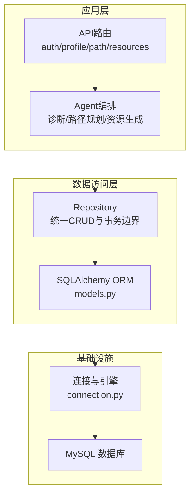
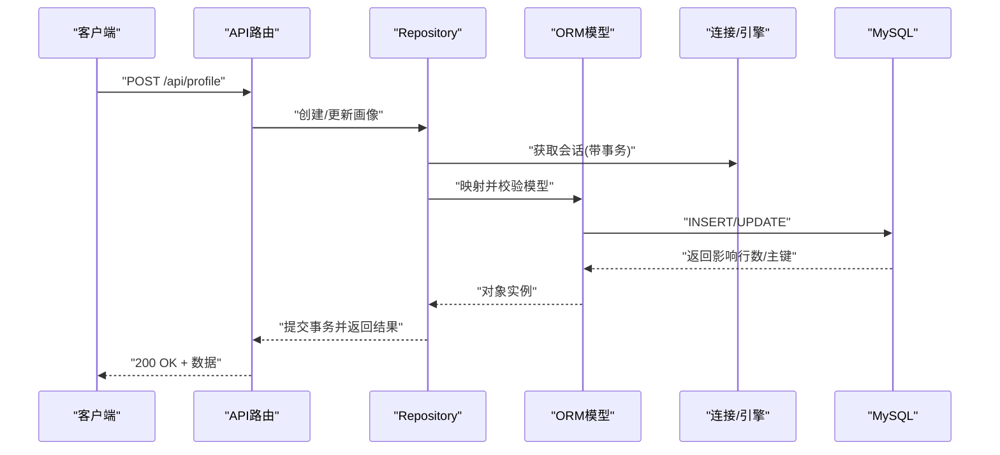
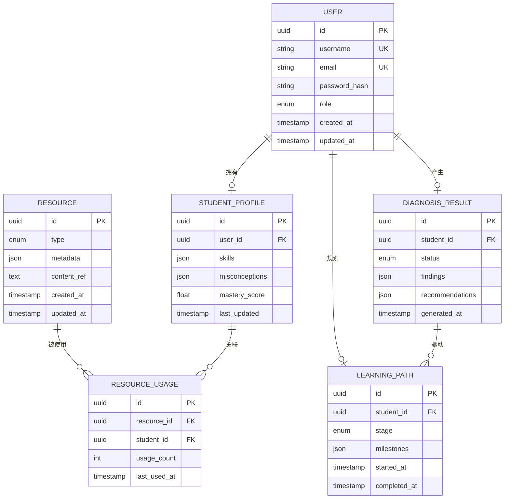
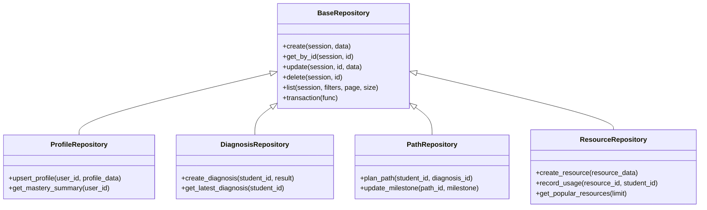
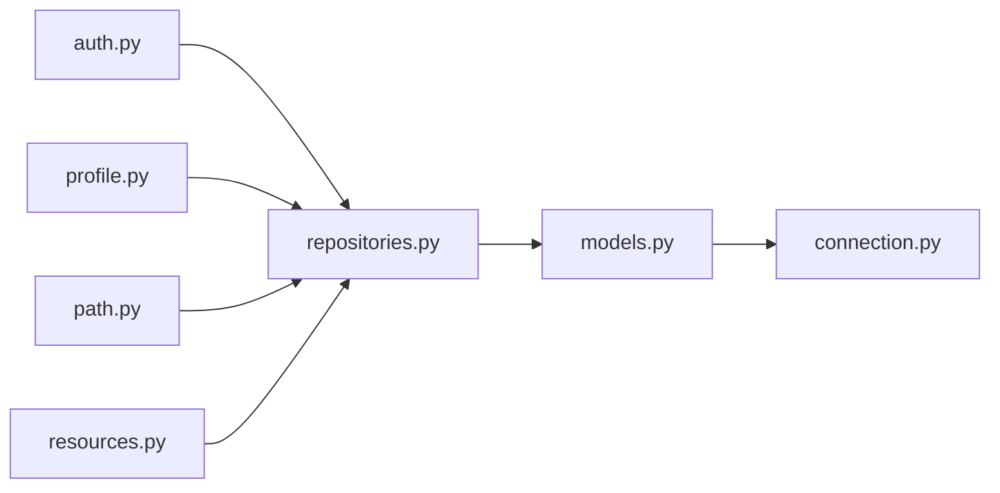

# 关系型数据库设计

<cite>
**本文引用的文件**   
- [src/loopse/db/models.py](file://src/loopse/db/models.py)
- [src/loopse/db/repositories.py](file://src/loopse/db/repositories.py)
- [src/loopse/db/connection.py](file://src/loopse/db/connection.py)
- [scripts/init_db.py](file://scripts/init_db.py)
- [scripts/init_mysql.py](file://scripts/init_mysql.py)
- [scripts/init_demo_data.py](file://scripts/init_demo_data.py)
- [scripts/seed_resources.py](file://scripts/seed_resources.py)
- [src/loopse/api/auth.py](file://src/loopse/api/auth.py)
- [src/loopse/api/profile.py](file://src/loopse/api/profile.py)
- [src/loopse/api/path.py](file://src/loopse/api/path.py)
- [src/loopse/api/resources.py](file://src/loopse/api/resources.py)
- [src/loopse/api/diagnosis.py](file://src/loopse/api/diagnosis.py)
</cite>

## 目录
1. [引言](#引言)
2. [项目结构](#项目结构)
3. [核心组件](#核心组件)
4. [架构总览](#架构总览)
5. [详细组件分析](#详细组件分析)
6. [依赖分析](#依赖分析)
7. [性能考虑](#性能考虑)
8. [故障排查指南](#故障排查指南)
9. [结论](#结论)
10. [附录](#附录)

## 引言
本文件面向Socrates-Cube项目的关系型数据库设计与实现，聚焦MySQL的ER模型、SQLAlchemy ORM映射、Repository数据访问层、事务与连接池配置、索引与查询优化策略、迁移与备份恢复流程，以及扩展新表与复杂查询的实现模式。文档以“学生画像、学习路径、诊断结果、资源管理、用户认证”为核心主题，提供从概念到代码级落地的完整说明。

## 项目结构
本项目采用分层架构：API层暴露REST接口，业务逻辑由Agent与领域服务编排，数据访问通过Repository封装，底层使用SQLAlchemy ORM与MySQL持久化。数据库相关核心文件位于src/loopse/db与scripts目录。

图表来源
- [src/loopse/db/models.py](file://src/loopse/db/models.py)
- [src/loopse/db/repositories.py](file://src/loopse/db/repositories.py)
- [src/loopse/db/connection.py](file://src/loopse/db/connection.py)
- [src/loopse/api/auth.py](file://src/loopse/api/auth.py)
- [src/loopse/api/profile.py](file://src/loopse/api/profile.py)
- [src/loopse/api/path.py](file://src/loopse/api/path.py)
- [src/loopse/api/resources.py](file://src/loopse/api/resources.py)

章节来源
- [src/loopse/db/models.py](file://src/loopse/db/models.py)
- [src/loopse/db/repositories.py](file://src/loopse/db/repositories.py)
- [src/loopse/db/connection.py](file://src/loopse/db/connection.py)

## 核心组件
- 数据模型（ORM）：定义实体、字段类型、约束、关系与索引，对应MySQL表结构。
- Repository：封装CRUD、批量操作、事务边界与重试策略，屏蔽SQL细节。
- 连接与引擎：集中管理数据库URL、连接池参数、会话生命周期。
- 初始化脚本：建库建表、种子数据、演示数据注入。
- API集成：认证、画像、路径、资源等接口通过Repository访问数据。

章节来源
- [src/loopse/db/models.py](file://src/loopse/db/models.py)
- [src/loopse/db/repositories.py](file://src/loopse/db/repositories.py)
- [src/loopse/db/connection.py](file://src/loopse/db/connection.py)
- [scripts/init_db.py](file://scripts/init_db.py)
- [scripts/init_mysql.py](file://scripts/init_mysql.py)
- [scripts/init_demo_data.py](file://scripts/init_demo_data.py)
- [scripts/seed_resources.py](file://scripts/seed_resources.py)

## 架构总览
下图展示从API请求到数据库写入的端到端流程，体现Repository的事务边界与ORM映射。

图表来源
- [src/loopse/api/profile.py](file://src/loopse/api/profile.py)
- [src/loopse/db/repositories.py](file://src/loopse/db/repositories.py)
- [src/loopse/db/models.py](file://src/loopse/db/models.py)
- [src/loopse/db/connection.py](file://src/loopse/db/connection.py)

## 详细组件分析

### ER图与核心实体
围绕“学生画像、学习路径、诊断结果、资源管理、用户认证”五大域，建议如下ER结构（以实际ORM为准）：

图表来源
- [src/loopse/db/models.py](file://src/loopse/db/models.py)

章节来源
- [src/loopse/db/models.py](file://src/loopse/db/models.py)

### 表结构与字段规范（按域）
- 用户认证
  - 主键：自增或UUID；唯一索引：用户名、邮箱；密码哈希存储；角色枚举；时间戳审计。
  - 约束：非空、长度限制、格式校验（邮箱正则）。
- 学生画像
  - 主键：自增或UUID；外键：用户ID；技能与误区以JSON存储，便于扩展；掌握度分数为浮点；最后更新时间。
  - 约束：JSON Schema校验（在Repository或API层进行）。
- 诊断结果
  - 主键：自增或UUID；外键：学生ID；状态枚举；发现与建议以JSON存储；生成时间。
  - 约束：状态机（待处理/进行中/已完成/失败）。
- 学习路径
  - 主键：自增或UUID；外键：学生ID；阶段枚举；里程碑JSON；开始/完成时间。
  - 约束：阶段顺序校验；完成时间晚于开始时间。
- 资源管理
  - 主键：自增或UUID；类型枚举；元数据JSON；内容引用（文本/链接/二进制指针）；时间戳。
  - 约束：类型与元数据一致性校验。
- 资源使用统计
  - 主键：自增或UUID；外键：资源ID、学生ID；使用次数；最近使用时间。
  - 约束：唯一复合索引（resource_id, student_id）。

章节来源
- [src/loopse/db/models.py](file://src/loopse/db/models.py)

### SQLAlchemy ORM模型定义与验证
- 模型映射：每个实体对应一个ORM类，字段类型与约束与MySQL一致。
- 关系映射：一对多、一对一关系通过relationship声明，配合外键约束。
- 索引策略：在ORM中声明索引与唯一约束，确保查询性能与数据一致性。
- 数据验证：
  - 字段级：必填、长度、范围、枚举值。
  - 记录级：跨字段约束（如时间先后、状态流转）。
  - JSON级：Schema校验（技能、误区、里程碑等）。
- 业务约束：在Repository层执行，避免在ORM层承载过多业务逻辑。

章节来源
- [src/loopse/db/models.py](file://src/loopse/db/models.py)

### Repository模式与事务管理
- 职责分离：Repository封装所有数据访问，API仅调用方法，不直接操作ORM。
- 事务边界：每个写操作在一个事务内完成，失败时回滚；读操作可独立会话。
- 重试与幂等：对网络抖动或死锁进行有限次重试；幂等键保证重复提交安全。
- 批量操作：支持批量插入/更新，减少往返开销。
- 错误处理：统一异常包装，区分业务异常与系统异常。

图表来源
- [src/loopse/db/repositories.py](file://src/loopse/db/repositories.py)

章节来源
- [src/loopse/db/repositories.py](file://src/loopse/db/repositories.py)

### 连接池与引擎配置
- 连接池：设置最大连接数、空闲超时、预取大小，适配并发读写。
- 引擎参数：SQL日志级别、连接超时、重连策略。
- 会话管理：请求级会话，自动提交/回滚；长事务避免。
- 健康检查：定期ping，异常时快速失败。

章节来源
- [src/loopse/db/connection.py](file://src/loopse/db/connection.py)

### 数据迁移与初始化
- 建库建表：通过init_db或init_mysql脚本执行DDL。
- 种子数据：seed_resources与init_demo_data注入初始资源与演示数据。
- 版本控制：建议使用Alembic进行增量迁移（若未引入，可在现有脚本基础上演进）。

章节来源
- [scripts/init_db.py](file://scripts/init_db.py)
- [scripts/init_mysql.py](file://scripts/init_mysql.py)
- [scripts/init_demo_data.py](file://scripts/init_demo_data.py)
- [scripts/seed_resources.py](file://scripts/seed_resources.py)

### API集成与业务约束
- 认证：登录/注册/鉴权，结合JWT或Session，权限控制到资源级。
- 画像：创建/更新画像，触发诊断与路径规划。
- 诊断：生成诊断结果，驱动学习路径调整。
- 资源：创建/检索/使用统计，支持推荐与热门排行。

章节来源
- [src/loopse/api/auth.py](file://src/loopse/api/auth.py)
- [src/loopse/api/profile.py](file://src/loopse/api/profile.py)
- [src/loopse/api/path.py](file://src/loopse/api/path.py)
- [src/loopse/api/resources.py](file://src/loopse/api/resources.py)

## 依赖分析
- 模块耦合：API依赖Repository，Repository依赖ORM，ORM依赖连接与引擎。
- 外部依赖：MySQL驱动、SQLAlchemy、可选Alembic。
- 潜在循环：确保API不直接导入ORM，Repository不反向依赖API。

图表来源
- [src/loopse/api/auth.py](file://src/loopse/api/auth.py)
- [src/loopse/api/profile.py](file://src/loopse/api/profile.py)
- [src/loopse/api/path.py](file://src/loopse/api/path.py)
- [src/loopse/api/resources.py](file://src/loopse/api/resources.py)
- [src/loopse/db/repositories.py](file://src/loopse/db/repositories.py)
- [src/loopse/db/models.py](file://src/loopse/db/models.py)
- [src/loopse/db/connection.py](file://src/loopse/db/connection.py)

章节来源
- [src/loopse/api/auth.py](file://src/loopse/api/auth.py)
- [src/loopse/api/profile.py](file://src/loopse/api/profile.py)
- [src/loopse/api/path.py](file://src/loopse/api/path.py)
- [src/loopse/api/resources.py](file://src/loopse/api/resources.py)
- [src/loopse/db/repositories.py](file://src/loopse/db/repositories.py)
- [src/loopse/db/models.py](file://src/loopse/db/models.py)
- [src/loopse/db/connection.py](file://src/loopse/db/connection.py)

## 性能考虑
- 索引策略
  - 高频查询列建立B-Tree索引（如user_id、student_id、resource_id）。
  - 复合索引覆盖常见过滤条件（如status+generated_at）。
  - 唯一索引保障数据一致性（用户名、邮箱、资源使用组合）。
- 查询优化
  - 分页与投影：只返回必要字段，避免大对象。
  - 批量写入：合并多次插入为批量操作。
  - 缓存热点：对热门资源与画像摘要使用Redis缓存。
- 连接池调优
  - 根据并发量调整max_connections与pool_size。
  - 合理设置timeout与retry，避免雪崩。
- 监控与告警
  - 慢查询日志、连接池使用率、事务耗时分布。
  - 关键指标：QPS、P95延迟、错误率、锁等待。

[本节为通用指导，无需特定文件来源]

## 故障排查指南
- 常见问题
  - 连接失败：检查数据库URL、端口、防火墙、账号权限。
  - 事务冲突：捕获Deadlock与Lock wait timeout，实施重试与退避。
  - 数据不一致：核对唯一约束与外键约束，检查JSON校验失败原因。
- 定位手段
  - 开启SQL日志，查看执行计划与索引命中。
  - 使用EXPLAIN分析慢查询，补充缺失索引。
  - 监控连接池耗尽与长事务。
- 恢复流程
  - 备份：全量+增量备份策略，保留多份副本。
  - 恢复：先恢复全量，再回放增量，校验完整性。
  - 回滚：基于迁移版本回退，注意数据兼容。

章节来源
- [src/loopse/db/connection.py](file://src/loopse/db/connection.py)
- [scripts/init_db.py](file://scripts/init_db.py)
- [scripts/init_mysql.py](file://scripts/init_mysql.py)

## 结论
本设计以清晰的ER模型为基础，通过SQLAlchemy ORM与Repository模式实现高内聚、低耦合的数据访问层。结合合理的索引策略、事务管理与连接池配置，满足学生画像、学习路径、诊断结果、资源管理与用户认证等核心业务的性能与一致性要求。后续可通过Alembic完善迁移体系，并通过监控与压测持续优化。

[本节为总结性内容，无需特定文件来源]

## 附录

### 扩展新表的实现模式
- 新增ORM模型：定义字段、约束、关系与索引。
- 新增Repository：封装CRUD与业务规则，保持事务边界清晰。
- 新增API：路由、校验、调用Repository，返回标准化响应。
- 更新迁移：生成DDL变更，编写回滚脚本。
- 测试覆盖：单元测试与集成测试覆盖关键路径。

章节来源
- [src/loopse/db/models.py](file://src/loopse/db/models.py)
- [src/loopse/db/repositories.py](file://src/loopse/db/repositories.py)
- [scripts/init_db.py](file://scripts/init_db.py)

### 复杂查询示例模式
- 聚合统计：按维度分组计数/求和，使用窗口函数计算排名。
- 多表关联：JOIN画像、诊断、路径与资源使用，过滤时间窗口。
- 全文检索：对资源标题/描述建立全文索引，提升搜索性能。
- 异步任务：将耗时查询放入后台任务，前端轮询进度。

章节来源
- [src/loopse/db/repositories.py](file://src/loopse/db/repositories.py)
- [src/loopse/db/models.py](file://src/loopse/db/models.py)