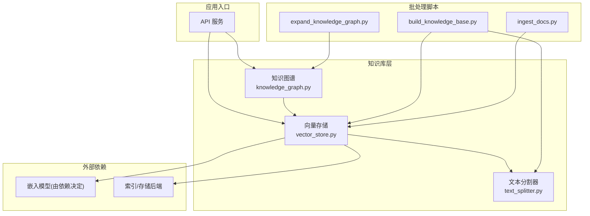
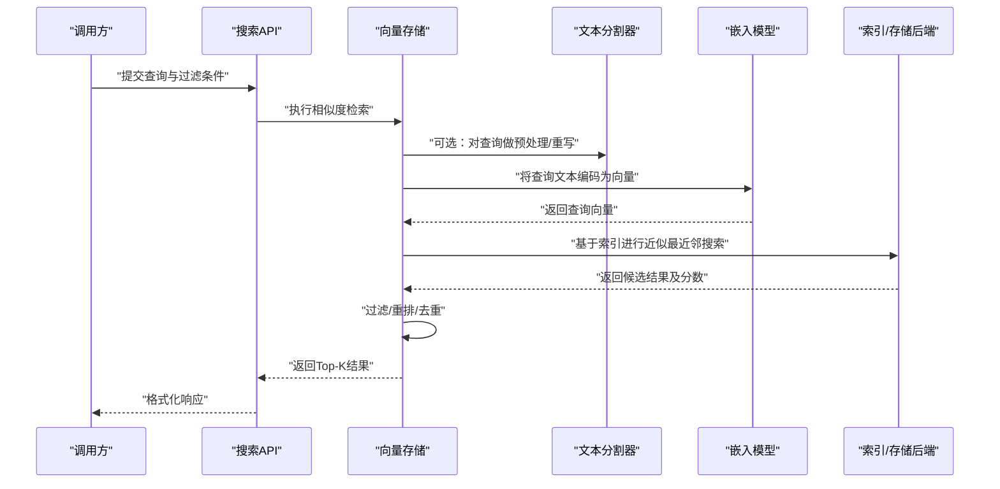
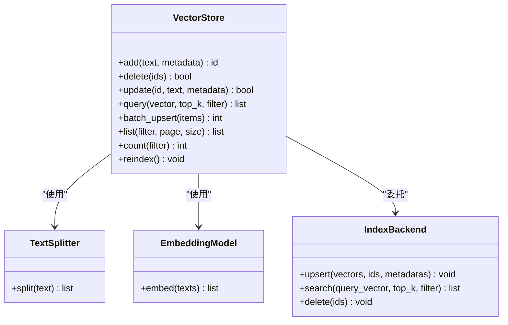
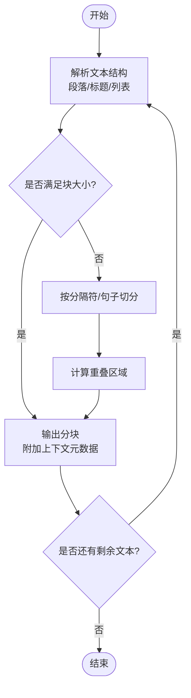
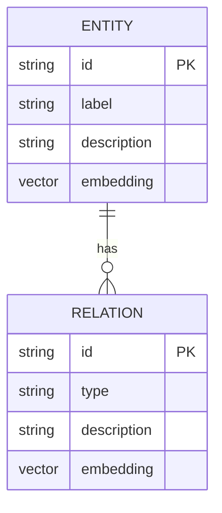
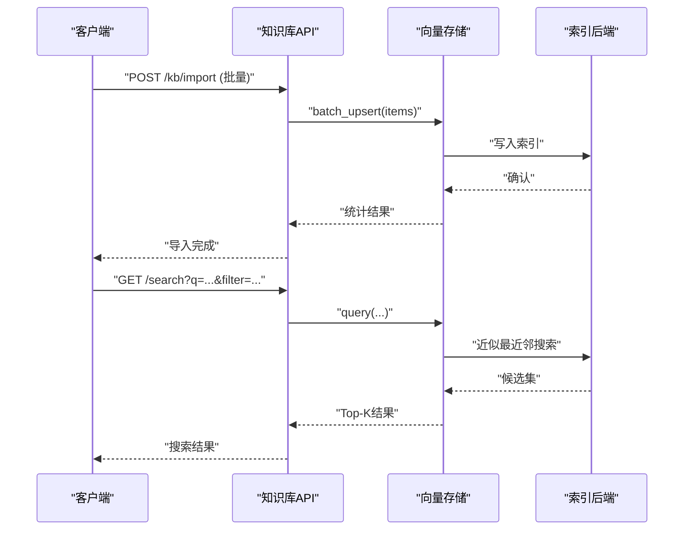
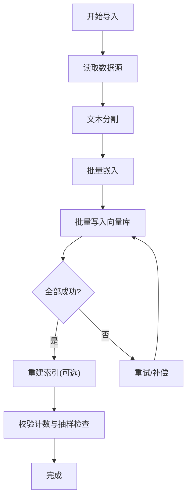
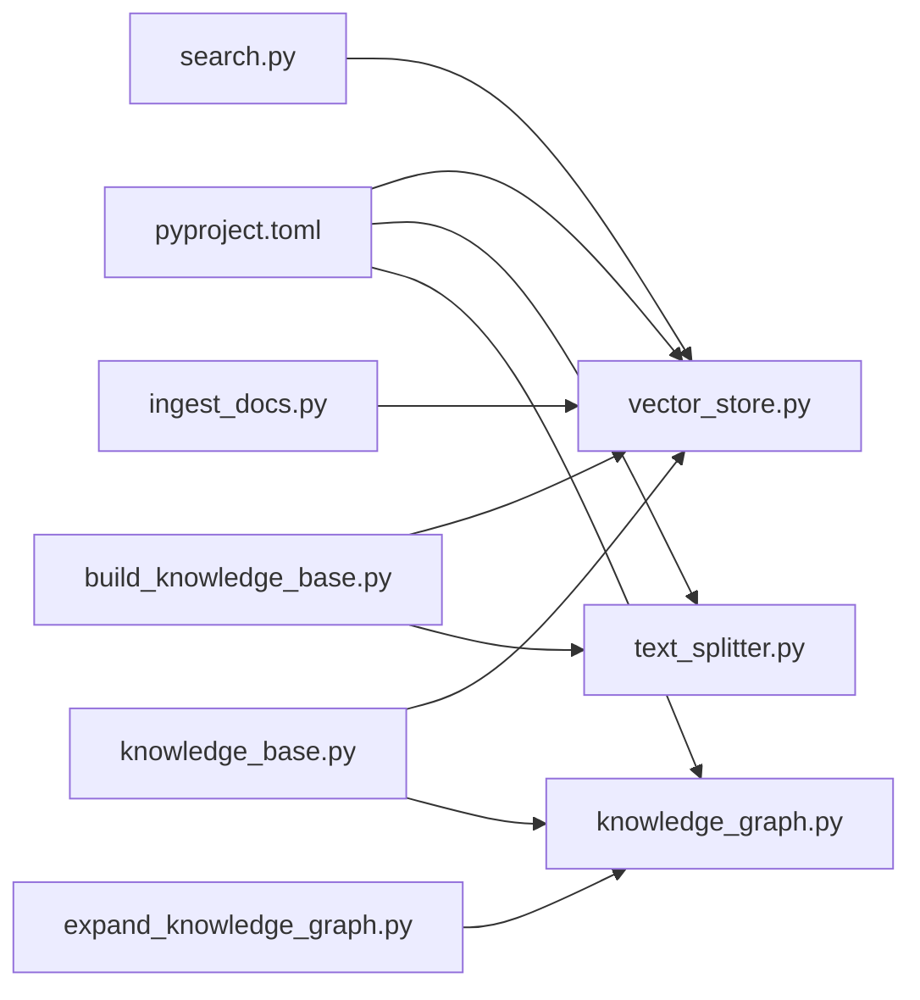

# 向量数据库设计

<cite>
**本文引用的文件**   
- [src/loopse/kb/vector_store.py](file://src/loopse/kb/vector_store.py)
- [src/loopse/kb/text_splitter.py](file://src/loopse/kb/text_splitter.py)
- [src/loopse/kb/knowledge_graph.py](file://src/loopse/kb/knowledge_graph.py)
- [src/loopse/api/search.py](file://src/loopse/api/search.py)
- [src/loopse/api/knowledge_base.py](file://src/loopse/api/knowledge_base.py)
- [scripts/build_knowledge_base.py](file://scripts/build_knowledge_base.py)
- [scripts/ingest_docs.py](file://scripts/ingest_docs.py)
- [scripts/expand_knowledge_graph.py](file://scripts/expand_knowledge_graph.py)
- [pyproject.toml](file://pyproject.toml)
</cite>

## 目录
1. [简介](#简介)
2. [项目结构](#项目结构)
3. [核心组件](#核心组件)
4. [架构总览](#架构总览)
5. [详细组件分析](#详细组件分析)
6. [依赖关系分析](#依赖关系分析)
7. [性能与内存优化](#性能与内存优化)
8. [故障排查指南](#故障排查指南)
9. [结论](#结论)
10. [附录](#附录)

## 简介
本文件面向“向量数据库设计”目标，系统化梳理文本向量化、相似度检索、索引优化、知识图谱向量表示、嵌入模型选择与维度配置、文本分割器与分块策略、上下文保持机制、CRUD 与批量导入导出、增量更新流程、阈值调优、检索性能优化、内存管理方案，以及多后端集成与自定义相似度计算等主题。文档以仓库中现有实现为依据，提供可落地的工程化建议与可视化图示，帮助读者快速理解并扩展系统能力。

## 项目结构
围绕向量知识库的核心代码主要分布在以下模块：
- kb 层：向量存储抽象与实现、文本分割器、知识图谱处理
- api 层：搜索与知识库管理接口
- scripts 层：构建知识库、文档入库、图谱扩充分批脚本
- 配置与依赖：pyproject.toml 定义运行依赖

图表来源
- [src/loopse/api/search.py](file://src/loopse/api/search.py)
- [src/loopse/api/knowledge_base.py](file://src/loopse/api/knowledge_base.py)
- [src/loopse/kb/vector_store.py](file://src/loopse/kb/vector_store.py)
- [src/loopse/kb/text_splitter.py](file://src/loopse/kb/text_splitter.py)
- [src/loopse/kb/knowledge_graph.py](file://src/loopse/kb/knowledge_graph.py)
- [scripts/build_knowledge_base.py](file://scripts/build_knowledge_base.py)
- [scripts/ingest_docs.py](file://scripts/ingest_docs.py)
- [scripts/expand_knowledge_graph.py](file://scripts/expand_knowledge_graph.py)

章节来源
- [src/loopse/kb/vector_store.py](file://src/loopse/kb/vector_store.py)
- [src/loopse/kb/text_splitter.py](file://src/loopse/kb/text_splitter.py)
- [src/loopse/kb/knowledge_graph.py](file://src/loopse/kb/knowledge_graph.py)
- [src/loopse/api/search.py](file://src/loopse/api/search.py)
- [src/loopse/api/knowledge_base.py](file://src/loopse/api/knowledge_base.py)
- [scripts/build_knowledge_base.py](file://scripts/build_knowledge_base.py)
- [scripts/ingest_docs.py](file://scripts/ingest_docs.py)
- [scripts/expand_knowledge_graph.py](file://scripts/expand_knowledge_graph.py)
- [pyproject.toml](file://pyproject.toml)

## 核心组件
- 向量存储（Vector Store）
  - 职责：封装向量的增删改查、批量写入、相似度检索、元数据过滤、索引维护与持久化。
  - 关键点：统一接口抽象、支持多后端、可插拔的嵌入模型与相似度函数、分页与游标式遍历、事务性批量操作。
- 文本分割器（Text Splitter）
  - 职责：将长文本切分为语义连贯的分块，保留必要上下文信息（如标题、段落边界、重叠窗口）。
  - 关键点：按字符/句子/段落/层级结构切分；可配置 chunk_size、overlap、separator；支持语言感知的断句。
- 知识图谱（Knowledge Graph）
  - 职责：组织实体与关系，生成可用于向量化的结构化片段或摘要；与向量库联动进行混合检索。
  - 关键点：节点/边序列化、子图抽取、三元组转自然语言描述、图谱路径切片。
- API 层
  - 职责：对外暴露搜索、知识库管理、批量导入导出、增量更新等接口。
  - 关键点：请求校验、分页参数、过滤条件、结果排序与评分、错误码与重试。
- 批处理脚本
  - 职责：离线构建知识库、批量导入文档、扩展现有图谱。
  - 关键点：并发控制、失败重试、进度上报、幂等写入。

章节来源
- [src/loopse/kb/vector_store.py](file://src/loopse/kb/vector_store.py)
- [src/loopse/kb/text_splitter.py](file://src/loopse/kb/text_splitter.py)
- [src/loopse/kb/knowledge_graph.py](file://src/loopse/kb/knowledge_graph.py)
- [src/loopse/api/search.py](file://src/loopse/api/search.py)
- [src/loopse/api/knowledge_base.py](file://src/loopse/api/knowledge_base.py)
- [scripts/build_knowledge_base.py](file://scripts/build_knowledge_base.py)
- [scripts/ingest_docs.py](file://scripts/ingest_docs.py)
- [scripts/expand_knowledge_graph.py](file://scripts/expand_knowledge_graph.py)

## 架构总览
下图展示从用户查询到返回结果的端到端流程，包括文本预处理、向量化、相似度检索、后处理与结果组装。

图表来源
- [src/loopse/api/search.py](file://src/loopse/api/search.py)
- [src/loopse/kb/vector_store.py](file://src/loopse/kb/vector_store.py)
- [src/loopse/kb/text_splitter.py](file://src/loopse/kb/text_splitter.py)

## 详细组件分析

### 向量存储组件
- 设计要点
  - 统一接口：提供 add、delete、update、query、batch_upsert、list、count 等方法。
  - 多后端适配：通过配置切换不同后端（例如本地磁盘、内存、分布式向量库），对外暴露一致行为。
  - 元数据与过滤：在写入时附带业务元数据，检索时支持按字段精确/范围过滤。
  - 相似度函数：默认余弦相似度，可扩展至内积、欧氏距离、Jaccard 等。
  - 索引策略：根据数据规模与延迟要求选择 HNSW、IVF-PQ、DiskANN 等。
- 关键流程
  - 写入：文本→分割→嵌入→向量化→写入索引→持久化。
  - 读取：查询→嵌入→近似最近邻→过滤→重排→返回。
- 复杂度与权衡
  - 时间：写入 O(N·D)，检索 O(log N)~O(N^α) 取决于索引；空间：O(N·D)。
  - 精度-速度-内存三角：增大 M/efConstruction 提升召回但增加内存与构建时间。

图表来源
- [src/loopse/kb/vector_store.py](file://src/loopse/kb/vector_store.py)
- [src/loopse/kb/text_splitter.py](file://src/loopse/kb/text_splitter.py)

章节来源
- [src/loopse/kb/vector_store.py](file://src/loopse/kb/vector_store.py)

### 文本分割器与分块策略
- 工作原理
  - 输入：原始文本、分隔符、最大块大小、重叠比例、是否保留段落/标题等上下文标记。
  - 输出：一组带上下文的分块，每个分块包含内容、起始位置、父级标题、相邻块引用等元数据。
- 分块策略
  - 固定长度+重叠：简单高效，适合通用场景。
  - 语义切分：按句子/段落/标题层级切分，保证语义完整性。
  - 自适应：依据标点、换行、缩进、列表结构动态调整。
- 上下文保持
  - 重叠窗口：相邻块共享若干句子，避免跨段语义断裂。
  - 锚点信息：记录原文档ID、页码、章节、时间戳，便于溯源与精确定位。
- 适用场景
  - 技术文档、教材、论文、FAQ、对话日志等。

图表来源
- [src/loopse/kb/text_splitter.py](file://src/loopse/kb/text_splitter.py)

章节来源
- [src/loopse/kb/text_splitter.py](file://src/loopse/kb/text_splitter.py)

### 知识图谱的向量表示
- 表示方法
  - 节点/边序列化为自然语言片段，再经嵌入模型编码为向量。
  - 子图/路径切片：抽取相关子图，生成“实体-关系-实体”的描述文本。
  - 聚合表示：对同一实体的多条描述取平均或加权融合，形成更稳健的向量。
- 与向量库联动
  - 图谱检索先定位候选实体，再用向量检索细化匹配。
  - 混合检索：关键词/图谱过滤 + 向量相似度打分。
- 维度与模型选择
  - 常用维度：768、1024、1536、3072 等，需与嵌入模型对齐。
  - 模型选择：中文任务优先选择中文预训练模型；领域微调可显著提升召回质量。

图表来源
- [src/loopse/kb/knowledge_graph.py](file://src/loopse/kb/knowledge_graph.py)

章节来源
- [src/loopse/kb/knowledge_graph.py](file://src/loopse/kb/knowledge_graph.py)

### 搜索与知识库管理 API
- 搜索接口
  - 输入：查询文本、top_k、过滤条件、排序方式、是否开启重排。
  - 输出：命中条目、相似度分数、命中片段、来源元数据。
- 知识库管理接口
  - 批量导入：上传文档集合，触发分割、嵌入、写入。
  - 增量更新：按文档版本/时间戳判断差异，仅更新变更部分。
  - 导出：按条件导出分块与元数据，支持 JSON/CSV。
- 错误与重试
  - 网络/IO 异常重试、幂等写入、失败回滚、审计日志。

图表来源
- [src/loopse/api/knowledge_base.py](file://src/loopse/api/knowledge_base.py)
- [src/loopse/api/search.py](file://src/loopse/api/search.py)
- [src/loopse/kb/vector_store.py](file://src/loopse/kb/vector_store.py)

章节来源
- [src/loopse/api/search.py](file://src/loopse/api/search.py)
- [src/loopse/api/knowledge_base.py](file://src/loopse/api/knowledge_base.py)

### 批量导入与增量更新流程
- 批量导入
  - 步骤：读取源数据→文本分割→批量嵌入→批量写入→重建索引（可选）→校验计数。
  - 并发与限流：控制并发度、批次大小、失败重试与退避。
- 增量更新
  - 策略：基于版本号/时间戳/哈希差异，仅处理新增与变更项。
  - 幂等：相同输入多次执行结果一致，避免重复写入。
  - 回滚：写入失败时回滚已写部分或进入补偿流程。

图表来源
- [scripts/build_knowledge_base.py](file://scripts/build_knowledge_base.py)
- [scripts/ingest_docs.py](file://scripts/ingest_docs.py)
- [src/loopse/kb/vector_store.py](file://src/loopse/kb/vector_store.py)

章节来源
- [scripts/build_knowledge_base.py](file://scripts/build_knowledge_base.py)
- [scripts/ingest_docs.py](file://scripts/ingest_docs.py)
- [src/loopse/kb/vector_store.py](file://src/loopse/kb/vector_store.py)

### 相似度阈值调优与检索优化
- 阈值调优
  - 指标：准确率、召回率、F1、MRR、NDCG。
  - 方法：在验证集上扫描阈值，绘制 PR 曲线，结合业务容忍度选择。
  - 动态阈值：按类别/领域/查询类型设置差异化阈值。
- 检索优化
  - 索引参数：M、efConstruction、efSearch 等平衡速度与召回。
  - 过滤前置：先用规则/图谱/关键词缩小候选集，再做向量检索。
  - 重排：引入交叉编码器或业务规则对 Top-N 重排。
- 内存管理
  - 分批加载、惰性加载、缓存热点向量、定期清理未引用对象。

[本节为通用指导，不直接分析具体文件]

## 依赖关系分析
- 运行时依赖
  - 嵌入模型与向量库驱动由 pyproject.toml 声明，确保环境一致性。
- 模块耦合
  - API 层依赖向量存储与知识图谱；向量存储依赖文本分割器与嵌入模型；脚本层复用上述组件。
- 潜在循环依赖
  - 通过分层与接口隔离避免循环；必要时引入事件总线或消息队列解耦。

图表来源
- [pyproject.toml](file://pyproject.toml)
- [src/loopse/kb/vector_store.py](file://src/loopse/kb/vector_store.py)
- [src/loopse/kb/text_splitter.py](file://src/loopse/kb/text_splitter.py)
- [src/loopse/kb/knowledge_graph.py](file://src/loopse/kb/knowledge_graph.py)
- [src/loopse/api/search.py](file://src/loopse/api/search.py)
- [src/loopse/api/knowledge_base.py](file://src/loopse/api/knowledge_base.py)
- [scripts/build_knowledge_base.py](file://scripts/build_knowledge_base.py)
- [scripts/ingest_docs.py](file://scripts/ingest_docs.py)
- [scripts/expand_knowledge_graph.py](file://scripts/expand_knowledge_graph.py)

章节来源
- [pyproject.toml](file://pyproject.toml)
- [src/loopse/kb/vector_store.py](file://src/loopse/kb/vector_store.py)
- [src/loopse/kb/text_splitter.py](file://src/loopse/kb/text_splitter.py)
- [src/loopse/kb/knowledge_graph.py](file://src/loopse/kb/knowledge_graph.py)
- [src/loopse/api/search.py](file://src/loopse/api/search.py)
- [src/loopse/api/knowledge_base.py](file://src/loopse/api/knowledge_base.py)
- [scripts/build_knowledge_base.py](file://scripts/build_knowledge_base.py)
- [scripts/ingest_docs.py](file://scripts/ingest_docs.py)
- [scripts/expand_knowledge_graph.py](file://scripts/expand_knowledge_graph.py)

## 性能与内存优化
- 索引与检索
  - 选择合适的索引算法与参数，针对 QPS 与延迟目标进行压测。
  - 冷热分离：热数据常驻内存，冷数据落盘。
- 批处理与并发
  - 合理设置 batch_size、worker 数、连接池大小，避免资源争用。
- 内存与GC
  - 及时释放中间向量与临时对象；限制单进程内存上限；监控堆栈与泄漏。
- 缓存与预热
  - 缓存高频查询向量与热门分块；启动时预热索引。
- 监控与告警
  - 记录检索耗时、命中率、失败率、内存占用，设置阈值告警。

[本节为通用指导，不直接分析具体文件]

## 故障排查指南
- 常见问题
  - 向量维度不一致：检查嵌入模型与写入逻辑是否一致。
  - 索引损坏或不可用：重建索引、校验计数、回滚到快照。
  - 导入失败：查看重试次数、批次大小、网络超时与磁盘空间。
  - 检索结果差：调整阈值、扩大候选集、引入重排或更多上下文。
- 诊断手段
  - 启用详细日志与追踪ID；采样回放失败查询；对比不同索引参数效果。
  - 对分块质量进行人工抽检，评估重叠与上下文有效性。

[本节为通用指导，不直接分析具体文件]

## 结论
本设计围绕“文本→分块→嵌入→索引→检索→后处理”的主线，提供了可扩展的向量存储抽象、灵活的文本分割策略、与知识图谱联动的混合检索思路，并通过 API 与脚本层支撑批量导入、增量更新与导出。配合合理的阈值调优、索引参数与内存管理，可在大规模语料下获得稳定高效的检索体验。后续可按需接入更多后端与自定义相似度函数，持续优化召回与性能。

[本节为总结性内容，不直接分析具体文件]

## 附录
- 术语
  - 向量：高维数值表示，用于度量语义相似性。
  - 近似最近邻（ANN）：在高维空间中快速查找近邻的算法族。
  - 元数据：与向量关联的业务信息，用于过滤与溯源。
- 参考实践
  - 中文嵌入模型选择与维度对齐
  - HNSW/IVF-PQ 参数调优手册
  - 混合检索（关键词+向量+图谱）最佳实践

[本节为补充说明，不直接分析具体文件]