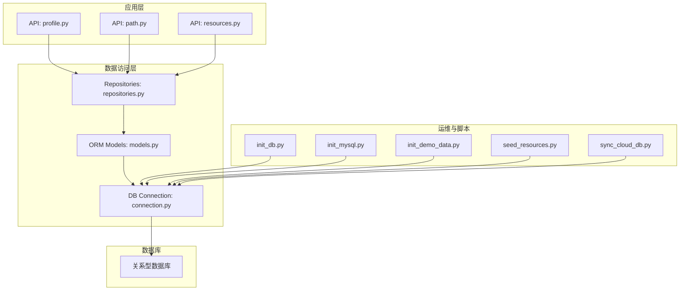
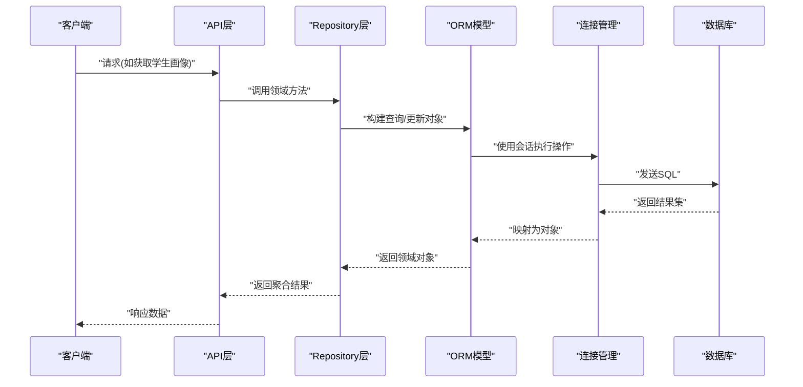
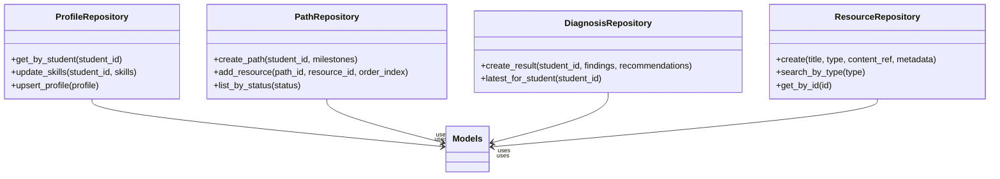
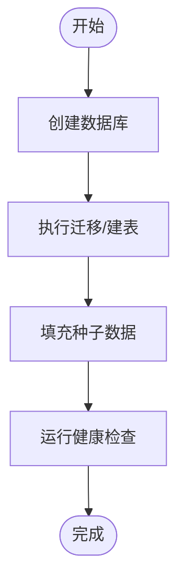
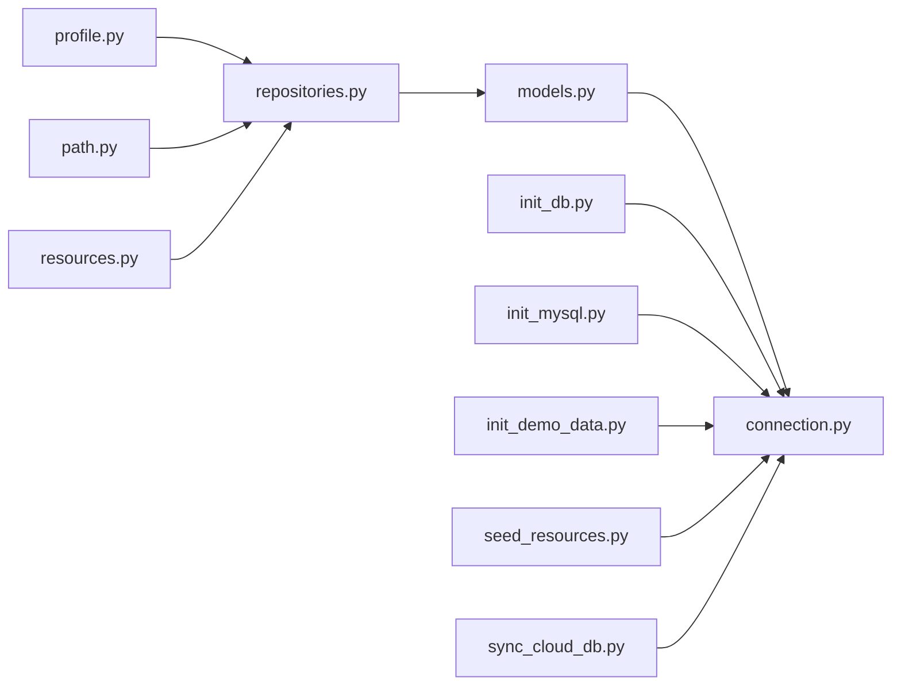

# 数据库设计

<cite>
**本文引用的文件**   
- [src/loopse/db/models.py](file://src/loopse/db/models.py)
- [src/loopse/db/repositories.py](file://src/loopse/db/repositories.py)
- [src/loopse/db/connection.py](file://src/loopse/db/connection.py)
- [scripts/init_db.py](file://scripts/init_db.py)
- [scripts/init_mysql.py](file://scripts/init_mysql.py)
- [scripts/init_demo_data.py](file://scripts/init_demo_data.py)
- [scripts/seed_resources.py](file://scripts/seed_resources.py)
- [scripts/sync_cloud_db.py](file://scripts/sync_cloud_db.py)
- [src/loopse/api/profile.py](file://src/loopse/api/profile.py)
- [src/loopse/api/path.py](file://src/loopse/api/path.py)
- [src/loopse/api/resources.py](file://src/loopse/api/resources.py)
- [src/loopse/schema/student_profile_schema.py](file://src/loopse/schema/student_profile_schema.py)
</cite>

## 目录
1. [引言](#引言)
2. [项目结构](#项目结构)
3. [核心组件](#核心组件)
4. [架构总览](#架构总览)
5. [详细组件分析](#详细组件分析)
6. [依赖关系分析](#依赖关系分析)
7. [性能考虑](#性能考虑)
8. [故障排查指南](#故障排查指南)
9. [结论](#结论)
10. [附录](#附录)

## 引言
本文件面向数据与后端工程师，系统化梳理本项目关系型数据库的ER模型、表结构与索引策略，覆盖学生画像、学习路径、诊断结果、资源管理等核心实体及其关系映射；同时文档化数据访问层（ORM模型、Repository模式）、迁移与初始化脚本、备份恢复方案与性能调优建议，并给出数据验证规则、业务约束与完整性检查机制，以及扩展新表与查询优化的实践方法。

## 项目结构
与数据库相关的关键代码位于以下位置：
- ORM模型定义：src/loopse/db/models.py
- 数据访问层（Repository）：src/loopse/db/repositories.py
- 连接与引擎配置：src/loopse/db/connection.py
- 数据库初始化与种子数据：scripts/init_db.py、scripts/init_mysql.py、scripts/init_demo_data.py、scripts/seed_resources.py
- 云库同步工具：scripts/sync_cloud_db.py
- API层对数据的消费入口：src/loopse/api/profile.py、src/loopse/api/path.py、src/loopse/api/resources.py
- 学生画像Schema校验：src/loopse/schema/student_profile_schema.py



图表来源
- [src/loopse/api/profile.py](file://src/loopse/api/profile.py)
- [src/loopse/api/path.py](file://src/loopse/api/path.py)
- [src/loopse/api/resources.py](file://src/loopse/api/resources.py)
- [src/loopse/db/repositories.py](file://src/loopse/db/repositories.py)
- [src/loopse/db/models.py](file://src/loopse/db/models.py)
- [src/loopse/db/connection.py](file://src/loopse/db/connection.py)
- [scripts/init_db.py](file://scripts/init_db.py)
- [scripts/init_mysql.py](file://scripts/init_mysql.py)
- [scripts/init_demo_data.py](file://scripts/init_demo_data.py)
- [scripts/seed_resources.py](file://scripts/seed_resources.py)
- [scripts/sync_cloud_db.py](file://scripts/sync_cloud_db.py)

章节来源
- [src/loopse/db/models.py](file://src/loopse/db/models.py)
- [src/loopse/db/repositories.py](file://src/loopse/db/repositories.py)
- [src/loopse/db/connection.py](file://src/loopse/db/connection.py)
- [scripts/init_db.py](file://scripts/init_db.py)
- [scripts/init_mysql.py](file://scripts/init_mysql.py)
- [scripts/init_demo_data.py](file://scripts/init_demo_data.py)
- [scripts/seed_resources.py](file://scripts/seed_resources.py)
- [scripts/sync_cloud_db.py](file://scripts/sync_cloud_db.py)
- [src/loopse/api/profile.py](file://src/loopse/api/profile.py)
- [src/loopse/api/path.py](file://src/loopse/api/path.py)
- [src/loopse/api/resources.py](file://src/loopse/api/resources.py)
- [src/loopse/schema/student_profile_schema.py](file://src/loopse/schema/student_profile_schema.py)

## 核心组件
- ORM模型层：集中定义核心实体与字段类型、约束与关联关系，作为数据访问的基础契约。
- Repository层：封装CRUD与复杂查询，向上提供领域语义化的接口，屏蔽SQL细节。
- 连接管理：统一数据库连接、会话生命周期与事务边界。
- 初始化与种子：负责建库、建表、初始数据填充与演示数据注入。
- 云库同步：在本地与云端之间进行数据一致性同步。
- API消费端：通过Repository读取/写入数据，驱动用户界面与业务流程。

章节来源
- [src/loopse/db/models.py](file://src/loopse/db/models.py)
- [src/loopse/db/repositories.py](file://src/loopse/db/repositories.py)
- [src/loopse/db/connection.py](file://src/loopse/db/connection.py)
- [scripts/init_db.py](file://scripts/init_db.py)
- [scripts/init_mysql.py](file://scripts/init_mysql.py)
- [scripts/init_demo_data.py](file://scripts/init_demo_data.py)
- [scripts/seed_resources.py](file://scripts/seed_resources.py)
- [scripts/sync_cloud_db.py](file://scripts/sync_cloud_db.py)
- [src/loopse/api/profile.py](file://src/loopse/api/profile.py)
- [src/loopse/api/path.py](file://src/loopse/api/path.py)
- [src/loopse/api/resources.py](file://src/loopse/api/resources.py)

## 架构总览
下图展示从API到数据库的整体调用链路与职责划分。



图表来源
- [src/loopse/api/profile.py](file://src/loopse/api/profile.py)
- [src/loopse/api/path.py](file://src/loopse/api/path.py)
- [src/loopse/api/resources.py](file://src/loopse/api/resources.py)
- [src/loopse/db/repositories.py](file://src/loopse/db/repositories.py)
- [src/loopse/db/models.py](file://src/loopse/db/models.py)
- [src/loopse/db/connection.py](file://src/loopse/db/connection.py)

## 详细组件分析

### ER图与核心实体关系
围绕“学生画像、学习路径、诊断结果、资源管理”的核心实体关系如下：

```mermaid
erDiagram
STUDENT {
uuid id PK
string name
string email UK
timestamp created_at
timestamp updated_at
}
PROFILE {
uuid id PK
uuid student_id FK
json skills
json interests
timestamp last_updated
}
DIAGNOSIS_RESULT {
uuid id PK
uuid student_id FK
json findings
json recommendations
timestamp generated_at
}
LEARNING_PATH {
uuid id PK
uuid student_id FK
json milestones
enum status
timestamp started_at
timestamp completed_at
}
RESOURCE {
uuid id PK
string title
string type
text content_ref
json metadata
timestamp created_at
timestamp updated_at
}
PATH_RESOURCE {
uuid path_id FK
uuid resource_id FK
int order_index
PRIMARY KEY(path_id, resource_id)
}
STUDENT ||--o{ PROFILE : "拥有"
STUDENT ||--o{ DIAGNOSIS_RESULT : "产生"
STUDENT ||--o{ LEARNING_PATH : "规划"
LEARNING_PATH ||--o{ PATH_RESOURCE : "包含"
RESOURCE ||--o{ PATH_RESOURCE : "被引用"
```

图表来源
- [src/loopse/db/models.py](file://src/loopse/db/models.py)

章节来源
- [src/loopse/db/models.py](file://src/loopse/db/models.py)

### 表结构与字段说明
- 学生表：主键、唯一邮箱、时间戳等基础信息。
- 学生画像表：JSON字段存储技能与兴趣，便于灵活扩展。
- 诊断结果表：JSON存储诊断发现与建议，支持多轮诊断记录。
- 学习路径表：里程碑以JSON表示，状态枚举控制生命周期。
- 资源表：标题、类型、内容引用与元数据，支持多种资源形态。
- 路径-资源关联表：多对多关系，含顺序字段用于排序。

章节来源
- [src/loopse/db/models.py](file://src/loopse/db/models.py)

### 索引优化策略
- 外键索引：为student_id建立索引，加速按学生维度的JOIN与过滤。
- 查询热点索引：
  - 学习路径：status、started_at、completed_at组合索引，支持按状态与时间范围检索。
  - 诊断结果：generated_at索引，支持按生成时间排序与分页。
  - 资源：type、created_at索引，支持按类型筛选与创建时间倒序。
- 复合索引：PATH_RESOURCE中path_id+order_index，提升路径内资源排序效率。
- 唯一性约束：学生邮箱唯一，避免重复注册。

章节来源
- [src/loopse/db/models.py](file://src/loopse/db/models.py)

### 数据访问层设计（Repository模式）
- 职责分离：Repository暴露领域方法（如“按学生ID获取画像”、“为路径追加资源”），内部封装ORM查询。
- 事务边界：写操作在Repository中开启事务，保证一致性。
- 缓存友好：读多写少场景可在Repository层引入缓存键（如按学生ID）。
- 错误处理：将底层异常转换为领域异常，便于上层统一处理。



图表来源
- [src/loopse/db/repositories.py](file://src/loopse/db/repositories.py)
- [src/loopse/db/models.py](file://src/loopse/db/models.py)

章节来源
- [src/loopse/db/repositories.py](file://src/loopse/db/repositories.py)
- [src/loopse/db/models.py](file://src/loopse/db/models.py)

### 连接管理与会话生命周期
- 连接池：配置最大连接数、超时与重试策略。
- 会话作用域：每个请求或任务持有独立会话，避免并发污染。
- 事务管理：显式提交/回滚，确保写操作的原子性。

章节来源
- [src/loopse/db/connection.py](file://src/loopse/db/connection.py)

### 数据迁移与初始化策略
- 初始化脚本：
  - init_db.py：创建数据库与必要权限。
  - init_mysql.py：针对MySQL的特定初始化步骤。
  - init_demo_data.py：注入演示数据，便于联调与演示。
  - seed_resources.py：批量导入资源种子数据。
- 版本化迁移：建议在后续阶段引入Alembic或等效工具，实现DDL的版本控制与回滚。



图表来源
- [scripts/init_db.py](file://scripts/init_db.py)
- [scripts/init_mysql.py](file://scripts/init_mysql.py)
- [scripts/init_demo_data.py](file://scripts/init_demo_data.py)
- [scripts/seed_resources.py](file://scripts/seed_resources.py)

章节来源
- [scripts/init_db.py](file://scripts/init_db.py)
- [scripts/init_mysql.py](file://scripts/init_mysql.py)
- [scripts/init_demo_data.py](file://scripts/init_demo_data.py)
- [scripts/seed_resources.py](file://scripts/seed_resources.py)

### 备份与恢复方案
- 逻辑备份：定期导出关键表（学生、画像、诊断、路径、资源）为结构化文件。
- 增量备份：基于数据库日志或变更捕获（如Binlog）实现增量备份。
- 恢复演练：在测试环境定期演练恢复流程，验证RTO/RPO目标。
- 云库同步：通过sync_cloud_db.py在本地与云端之间保持数据一致。

章节来源
- [scripts/sync_cloud_db.py](file://scripts/sync_cloud_db.py)

### 数据验证规则、业务约束与完整性检查
- Schema校验：学生画像输入遵循student_profile_schema.py定义的规则，确保必填字段、类型与取值范围正确。
- 业务约束：
  - 学生邮箱唯一。
  - 学习路径状态机（如进行中、已完成）由应用层与数据库约束共同保障。
  - 路径-资源顺序不可为负。
- 完整性检查：
  - 外键约束：确保关联记录存在。
  - 非空约束：关键字段不允许为空。
  - 唯一性约束：避免重复数据。

章节来源
- [src/loopse/schema/student_profile_schema.py](file://src/loopse/schema/student_profile_schema.py)
- [src/loopse/db/models.py](file://src/loopse/db/models.py)

### 扩展新数据表与查询优化方法
- 新增表步骤：
  1. 在models.py中定义ORM模型与约束。
  2. 在repositories.py中实现对应Repository方法与事务边界。
  3. 在API层增加路由与处理器，调用Repository。
  4. 编写迁移脚本或更新初始化脚本，确保部署一致性。
- 查询优化：
  - 使用EXPLAIN分析慢查询，补充合适索引。
  - 分页与投影：仅返回必要字段，减少网络与序列化开销。
  - 批量操作：合并多次写入为批量插入/更新，降低事务次数。
  - 读写分离：只读查询走副本库，提升吞吐。

章节来源
- [src/loopse/db/models.py](file://src/loopse/db/models.py)
- [src/loopse/db/repositories.py](file://src/loopse/db/repositories.py)
- [src/loopse/api/profile.py](file://src/loopse/api/profile.py)
- [src/loopse/api/path.py](file://src/loopse/api/path.py)
- [src/loopse/api/resources.py](file://src/loopse/api/resources.py)

## 依赖关系分析
- API层依赖Repository层，不直接操作ORM。
- Repository层依赖ORM模型与连接管理。
- 初始化与种子脚本依赖连接管理，独立于业务API。
- 云库同步脚本与连接管理交互，实现跨库一致性。



图表来源
- [src/loopse/api/profile.py](file://src/loopse/api/profile.py)
- [src/loopse/api/path.py](file://src/loopse/api/path.py)
- [src/loopse/api/resources.py](file://src/loopse/api/resources.py)
- [src/loopse/db/repositories.py](file://src/loopse/db/repositories.py)
- [src/loopse/db/models.py](file://src/loopse/db/models.py)
- [src/loopse/db/connection.py](file://src/loopse/db/connection.py)
- [scripts/init_db.py](file://scripts/init_db.py)
- [scripts/init_mysql.py](file://scripts/init_mysql.py)
- [scripts/init_demo_data.py](file://scripts/init_demo_data.py)
- [scripts/seed_resources.py](file://scripts/seed_resources.py)
- [scripts/sync_cloud_db.py](file://scripts/sync_cloud_db.py)

章节来源
- [src/loopse/api/profile.py](file://src/loopse/api/profile.py)
- [src/loopse/api/path.py](file://src/loopse/api/path.py)
- [src/loopse/api/resources.py](file://src/loopse/api/resources.py)
- [src/loopse/db/repositories.py](file://src/loopse/db/repositories.py)
- [src/loopse/db/models.py](file://src/loopse/db/models.py)
- [src/loopse/db/connection.py](file://src/loopse/db/connection.py)
- [scripts/init_db.py](file://scripts/init_db.py)
- [scripts/init_mysql.py](file://scripts/init_mysql.py)
- [scripts/init_demo_data.py](file://scripts/init_demo_data.py)
- [scripts/seed_resources.py](file://scripts/seed_resources.py)
- [scripts/sync_cloud_db.py](file://scripts/sync_cloud_db.py)

## 性能考虑
- 索引设计：优先为高频过滤与排序字段建立索引，避免过度索引导致写入退化。
- JSON字段：谨慎使用JSON列的查询条件，必要时拆分为规范化表以提升性能。
- 连接池参数：根据并发量调整最大连接数与空闲回收策略。
- 事务粒度：缩小事务范围，减少锁竞争与死锁概率。
- 读写分离与缓存：读多写少场景引入缓存层（如Redis）与副本库。

[本节为通用指导，无需列出具体文件来源]

## 故障排查指南
- 连接失败：检查连接配置、网络可达性与认证凭据。
- 事务异常：定位Repository中的事务边界，确认提交/回滚逻辑。
- 慢查询：使用EXPLAIN分析，补充缺失索引或改写SQL。
- 数据不一致：核对云库同步脚本的执行日志与幂等性。
- 约束冲突：检查唯一性与非空约束，定位上游输入校验。

章节来源
- [src/loopse/db/connection.py](file://src/loopse/db/connection.py)
- [src/loopse/db/repositories.py](file://src/loopse/db/repositories.py)
- [scripts/sync_cloud_db.py](file://scripts/sync_cloud_db.py)

## 结论
本数据库设计围绕学生画像、学习路径、诊断结果与资源管理四大核心实体展开，采用ORM模型与Repository模式实现清晰的数据访问分层。通过合理的索引策略、事务边界与初始化/同步脚本，保障了数据一致性与可维护性。后续建议引入版本化迁移与更完善的监控告警体系，持续提升系统稳定性与性能。

[本节为总结性内容，无需列出具体文件来源]

## 附录
- 术语表：
  - ORM：对象关系映射，将数据库表映射为编程语言对象。
  - Repository：数据访问抽象层，封装CRUD与复杂查询。
  - 迁移：对数据库结构的版本化管理与演进。
- 参考文件路径：
  - 模型定义：[src/loopse/db/models.py](file://src/loopse/db/models.py)
  - 数据访问层：[src/loopse/db/repositories.py](file://src/loopse/db/repositories.py)
  - 连接管理：[src/loopse/db/connection.py](file://src/loopse/db/connection.py)
  - 初始化脚本：[scripts/init_db.py](file://scripts/init_db.py)、[scripts/init_mysql.py](file://scripts/init_mysql.py)、[scripts/init_demo_data.py](file://scripts/init_demo_data.py)、[scripts/seed_resources.py](file://scripts/seed_resources.py)
  - 云库同步：[scripts/sync_cloud_db.py](file://scripts/sync_cloud_db.py)
  - API消费端：[src/loopse/api/profile.py](file://src/loopse/api/profile.py)、[src/loopse/api/path.py](file://src/loopse/api/path.py)、[src/loopse/api/resources.py](file://src/loopse/api/resources.py)
  - 画像Schema校验：[src/loopse/schema/student_profile_schema.py](file://src/loopse/schema/student_profile_schema.py)