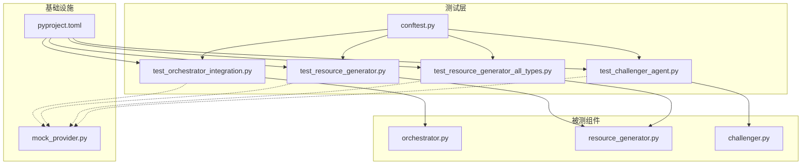
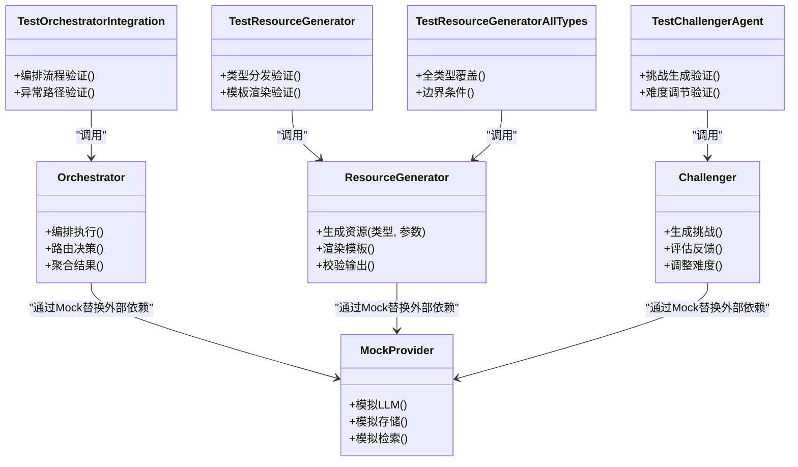
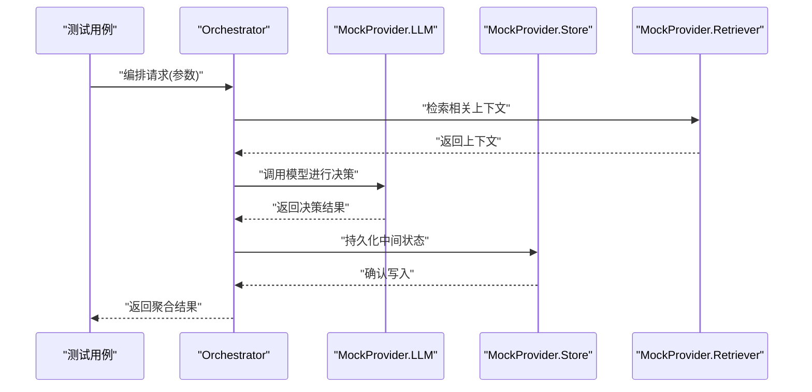
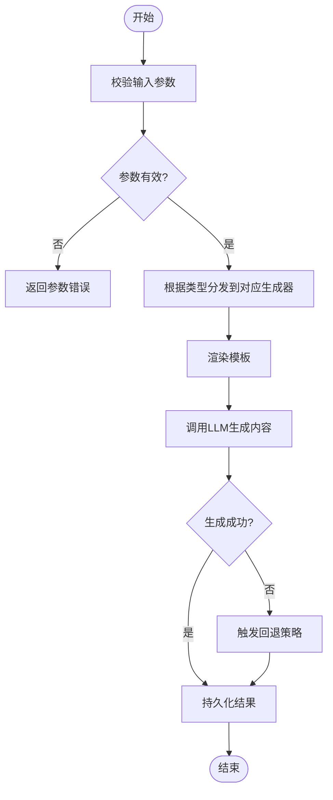
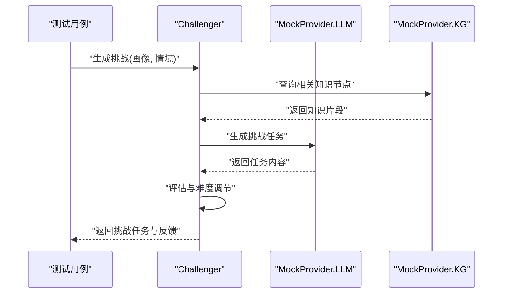
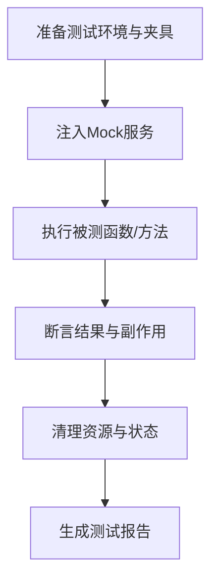
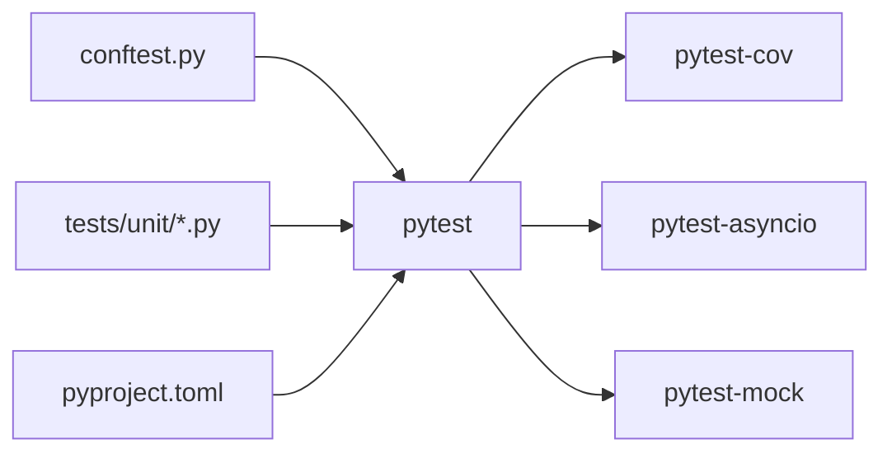

# 单元测试

<cite>
**本文引用的文件**   
- [tests/conftest.py](file://tests/conftest.py)
- [tests/unit/test_challenger_agent.py](file://tests/unit/test_challenger_agent.py)
- [tests/unit/test_resource_generator.py](file://tests/unit/test_resource_generator.py)
- [tests/unit/test_resource_generator_all_types.py](file://tests/unit/test_resource_generator_all_types.py)
- [tests/unit/test_orchestrator_integration.py](file://tests/unit/test_orchestrator_integration.py)
- [src/loopse/agent/challenger.py](file://src/loopse/agent/challenger.py)
- [src/loopse/agent/resource_generator.py](file://src/loopse/agent/resource_generator.py)
- [src/loopse/agent/orchestrator.py](file://src/loopse/agent/orchestrator.py)
- [src/loopse/core/mock_provider.py](file://src/loopse/core/mock_provider.py)
- [pyproject.toml](file://pyproject.toml)
</cite>

## 目录
1. [简介](#简介)
2. [项目结构](#项目结构)
3. [核心组件](#核心组件)
4. [架构总览](#架构总览)
5. [详细组件分析](#详细组件分析)
6. [依赖分析](#依赖分析)
7. [性能考虑](#性能考虑)
8. [故障排查指南](#故障排查指南)
9. [结论](#结论)
10. [附录](#附录)

## 简介
本文件面向多智能体系统的单元测试实践，聚焦以下目标：
- 明确测试设计原则、测试框架选择与最佳实践
- 针对 Orchestrator（协调器）、ResourceGenerator（资源生成器）、Challenger（挑战者）等核心组件提供可操作的测试方法
- 文档化 Mock 服务使用、测试数据准备与断言策略
- 覆盖异步代码测试、异常处理测试与边界条件测试
- 给出覆盖率要求、命名规范与代码组织模式
- 基于 pytest 的高效开发流程

## 项目结构
仓库采用“按功能分层 + 测试隔离”的组织方式。后端核心逻辑位于 src/loopse，测试用例集中于 tests 目录，其中 unit 子目录存放单测。关键路径如下：
- 被测组件：src/loopse/agent/*
- 测试配置与夹具：tests/conftest.py
- 单测用例：tests/unit/*.py
- 测试依赖与运行配置：pyproject.toml

图表来源
- [src/loopse/agent/orchestrator.py](file://src/loopse/agent/orchestrator.py)
- [src/loopse/agent/resource_generator.py](file://src/loopse/agent/resource_generator.py)
- [src/loopse/agent/challenger.py](file://src/loopse/agent/challenger.py)
- [tests/unit/test_orchestrator_integration.py](file://tests/unit/test_orchestrator_integration.py)
- [tests/unit/test_resource_generator.py](file://tests/unit/test_resource_generator.py)
- [tests/unit/test_resource_generator_all_types.py](file://tests/unit/test_resource_generator_all_types.py)
- [tests/unit/test_challenger_agent.py](file://tests/unit/test_challenger_agent.py)
- [tests/conftest.py](file://tests/conftest.py)
- [src/loopse/core/mock_provider.py](file://src/loopse/core/mock_provider.py)
- [pyproject.toml](file://pyproject.toml)

章节来源
- [tests/conftest.py](file://tests/conftest.py)
- [tests/unit/test_orchestrator_integration.py](file://tests/unit/test_orchestrator_integration.py)
- [tests/unit/test_resource_generator.py](file://tests/unit/test_resource_generator.py)
- [tests/unit/test_resource_generator_all_types.py](file://tests/unit/test_resource_generator_all_types.py)
- [tests/unit/test_challenger_agent.py](file://tests/unit/test_challenger_agent.py)
- [src/loopse/agent/orchestrator.py](file://src/loopse/agent/orchestrator.py)
- [src/loopse/agent/resource_generator.py](file://src/loopse/agent/resource_generator.py)
- [src/loopse/agent/challenger.py](file://src/loopse/agent/challenger.py)
- [src/loopse/core/mock_provider.py](file://src/loopse/core/mock_provider.py)
- [pyproject.toml](file://pyproject.toml)

## 核心组件
本节概述被测核心组件的职责与交互关系，为后续单测设计提供上下文。

- Orchestrator（协调器）
  - 职责：编排各 Agent 的执行顺序、路由决策、状态流转与结果聚合
  - 外部依赖：LLM 客户端、知识库检索、持久化存储、其他 Agent
  - 测试关注点：路由分支、并发调用、错误恢复、超时与重试、最终一致性

- ResourceGenerator（资源生成器）
  - 职责：根据输入参数与提示模板生成多种资源（代码、文档、练习、信息图、脚本等）
  - 外部依赖：LLM 客户端、模板引擎、存储与版本管理
  - 测试关注点：类型分发、模板渲染、输出校验、失败回退、幂等性

- Challenger（挑战者）
  - 职责：基于学习者画像与当前情境生成挑战任务、评估反馈与自适应难度
  - 外部依赖：学习者画像、知识图谱、LLM 客户端
  - 测试关注点：难度调节、内容多样性、安全性与合规性、异常降级

章节来源
- [src/loopse/agent/orchestrator.py](file://src/loopse/agent/orchestrator.py)
- [src/loopse/agent/resource_generator.py](file://src/loopse/agent/resource_generator.py)
- [src/loopse/agent/challenger.py](file://src/loopse/agent/challenger.py)

## 架构总览
下图展示被测组件与测试层的交互关系，以及 Mock 服务的注入位置。

图表来源
- [src/loopse/agent/orchestrator.py](file://src/loopse/agent/orchestrator.py)
- [src/loopse/agent/resource_generator.py](file://src/loopse/agent/resource_generator.py)
- [src/loopse/agent/challenger.py](file://src/loopse/agent/challenger.py)
- [src/loopse/core/mock_provider.py](file://src/loopse/core/mock_provider.py)
- [tests/unit/test_orchestrator_integration.py](file://tests/unit/test_orchestrator_integration.py)
- [tests/unit/test_resource_generator.py](file://tests/unit/test_resource_generator.py)
- [tests/unit/test_resource_generator_all_types.py](file://tests/unit/test_resource_generator_all_types.py)
- [tests/unit/test_challenger_agent.py](file://tests/unit/test_challenger_agent.py)

## 详细组件分析

### Orchestrator 协调器测试
- 测试目标
  - 验证编排流程在不同输入下的正确性
  - 验证异常路径（如下游服务不可用、超时、非法输入）的健壮性
  - 验证并发调用的顺序与结果聚合
- 测试策略
  - 使用 conftest 中的夹具构造最小可用上下文
  - 使用 MockProvider 替换 LLM、存储与检索等外部依赖
  - 对关键分支进行正向与反向用例覆盖
- 典型用例
  - 正常编排：输入合法参数，期望返回聚合结果
  - 异常编排：下游抛出异常或返回空结果，期望系统降级并记录日志
  - 超时与重试：模拟延迟与失败，验证重试策略与熔断行为
- 断言要点
  - 检查最终状态机转换是否符合预期
  - 检查中间步骤的副作用（如写入日志、缓存更新）
  - 检查错误码与消息的可观测性

图表来源
- [src/loopse/agent/orchestrator.py](file://src/loopse/agent/orchestrator.py)
- [src/loopse/core/mock_provider.py](file://src/loopse/core/mock_provider.py)
- [tests/unit/test_orchestrator_integration.py](file://tests/unit/test_orchestrator_integration.py)

章节来源
- [tests/unit/test_orchestrator_integration.py](file://tests/unit/test_orchestrator_integration.py)
- [src/loopse/agent/orchestrator.py](file://src/loopse/agent/orchestrator.py)
- [src/loopse/core/mock_provider.py](file://src/loopse/core/mock_provider.py)

### ResourceGenerator 资源生成器测试
- 测试目标
  - 验证不同类型资源的生成路径与输出格式
  - 验证模板渲染的正确性与容错性
  - 验证失败回退与幂等性
- 测试策略
  - 使用 conftest 提供的模板与参数夹具
  - 使用 MockProvider 模拟 LLM 输出与存储写入
  - 对每种资源类型编写独立用例，确保全覆盖
- 典型用例
  - 类型分发：传入不同资源类型，期望进入对应分支
  - 模板渲染：传入有效/无效模板变量，期望成功或优雅报错
  - 输出校验：对生成内容进行结构与语义断言
  - 失败回退：当 LLM 返回异常时，期望使用默认模板或降级策略
- 断言要点
  - 输出字段完整性与类型正确性
  - 模板占位符替换是否完成
  - 幂等性：重复生成相同输入应得到一致结果

图表来源
- [src/loopse/agent/resource_generator.py](file://src/loopse/agent/resource_generator.py)
- [src/loopse/core/mock_provider.py](file://src/loopse/core/mock_provider.py)
- [tests/unit/test_resource_generator.py](file://tests/unit/test_resource_generator.py)
- [tests/unit/test_resource_generator_all_types.py](file://tests/unit/test_resource_generator_all_types.py)

章节来源
- [tests/unit/test_resource_generator.py](file://tests/unit/test_resource_generator.py)
- [tests/unit/test_resource_generator_all_types.py](file://tests/unit/test_resource_generator_all_types.py)
- [src/loopse/agent/resource_generator.py](file://src/loopse/agent/resource_generator.py)
- [src/loopse/core/mock_provider.py](file://src/loopse/core/mock_provider.py)

### Challenger 挑战者测试
- 测试目标
  - 验证挑战任务的生成质量与多样性
  - 验证难度调节机制与反馈评估
  - 验证安全与合规约束（如内容过滤）
- 测试策略
  - 使用 conftest 提供学习者画像与情境数据
  - 使用 MockProvider 模拟 LLM 与知识图谱查询
  - 对边界输入（极端画像、缺失字段）进行健壮性测试
- 典型用例
  - 正常生成：输入完整画像，期望返回结构化挑战任务
  - 难度调节：根据表现动态调整难度，期望符合策略
  - 异常处理：画像缺失或模型异常，期望降级与告警
- 断言要点
  - 挑战任务的结构与字段完整性
  - 难度等级与画像特征的匹配度
  - 安全规则命中后的处理是否正确

图表来源
- [src/loopse/agent/challenger.py](file://src/loopse/agent/challenger.py)
- [src/loopse/core/mock_provider.py](file://src/loopse/core/mock_provider.py)
- [tests/unit/test_challenger_agent.py](file://tests/unit/test_challenger_agent.py)

章节来源
- [tests/unit/test_challenger_agent.py](file://tests/unit/test_challenger_agent.py)
- [src/loopse/agent/challenger.py](file://src/loopse/agent/challenger.py)
- [src/loopse/core/mock_provider.py](file://src/loopse/core/mock_provider.py)

### 概念总览
以下为通用测试工作流示意，不直接映射具体源码文件：

[此图为概念流程图，无需图表来源]

## 依赖分析
- 测试框架与插件
  - pytest：主测试框架
  - pytest-cov：覆盖率统计
  - pytest-asyncio：异步测试支持
  - pytest-mock：Mock 能力增强
- 运行入口与配置
  - pyproject.toml 中定义测试命令与覆盖率阈值
  - conftest.py 提供全局夹具与共享配置

图表来源
- [pyproject.toml](file://pyproject.toml)
- [tests/conftest.py](file://tests/conftest.py)

章节来源
- [pyproject.toml](file://pyproject.toml)
- [tests/conftest.py](file://tests/conftest.py)

## 性能考虑
- 避免在单测中发起真实网络请求与数据库操作，统一使用 MockProvider
- 控制并发测试规模，避免阻塞 CI 流水线
- 对耗时较长的生成类用例使用参数化与并行执行
- 合理设置超时与重试上限，防止测试挂起

[本节为通用指导，无需章节来源]

## 故障排查指南
- 常见问题
  - 测试环境未安装依赖：检查 pyproject.toml 与 requirements.txt
  - 异步测试未标记：确保使用正确的异步装饰器与事件循环配置
  - Mock 未生效：确认依赖注入路径与 patch 范围
  - 覆盖率不达标：定位未覆盖分支，补充边界用例
- 调试技巧
  - 使用 pytest -v 与 --tb=short 快速定位失败用例
  - 使用 --cov-report=term-missing 查看缺失行
  - 在 conftest 中打印关键上下文，辅助复现问题

章节来源
- [pyproject.toml](file://pyproject.toml)
- [tests/conftest.py](file://tests/conftest.py)

## 结论
通过以 pytest 为核心的测试体系，结合 MockProvider 与 conftest 夹具，能够高效覆盖多智能体系统的关键路径与异常场景。建议持续完善用例库、提升覆盖率并优化测试执行效率，保障系统稳定性与可维护性。

[本节为总结，无需章节来源]

## 附录

### 测试设计原则
- 单一职责：每个用例只验证一个行为或分支
- 可重复性：用例之间相互独立，无隐式状态依赖
- 可读性：命名清晰、结构扁平、断言明确
- 可维护性：集中管理夹具与公共逻辑，减少重复

### 测试框架选择与最佳实践
- 选择 pytest 的原因
  - 生态丰富、插件成熟、学习成本低
  - 强大的参数化与 fixture 机制
- 最佳实践
  - 使用 conftest 管理共享夹具
  - 使用 pytest.mark.parametrize 进行数据驱动
  - 使用 pytest-asyncio 处理协程与异步 IO
  - 使用 pytest-mock 简化 Mock 创建与断言

### 多智能体系统单测方法
- Orchestrator
  - 重点：编排流程、路由分支、错误恢复
  - 方法：端到端编排用例 + 分支覆盖 + 异常注入
- ResourceGenerator
  - 重点：类型分发、模板渲染、输出校验
  - 方法：类型参数化 + 模板变量矩阵 + 失败回退
- Challenger
  - 重点：挑战生成、难度调节、安全合规
  - 方法：画像矩阵 + 边界输入 + 规则命中验证

### Mock 服务使用
- 使用 MockProvider 统一替换 LLM、存储与检索
- 在 conftest 中提供可配置的 Mock 实例
- 对关键接口进行断言，确保调用次数与参数正确

### 测试数据准备
- 使用 fixtures 提供标准输入与期望输出
- 对复杂对象使用工厂函数生成
- 对敏感数据使用脱敏与占位符

### 断言策略
- 结构断言：检查返回对象的字段与类型
- 行为断言：检查副作用（日志、缓存、存储）
- 时序断言：检查异步调用顺序与超时

### 异步代码测试
- 使用 pytest-asyncio 的 async def 与 @pytest.mark.asyncio
- 合理设置事件循环与超时
- 对并发调用进行顺序与结果一致性断言

### 异常处理测试
- 注入异常：模拟下游服务异常、超时、网络错误
- 验证降级：检查回退策略与错误上报
- 验证幂等：重复调用不应产生副作用

### 边界条件测试
- 空输入、超长输入、特殊字符、缺失字段
- 极限数值与时间边界
- 并发与竞争条件

### 覆盖率要求
- 语句覆盖率 ≥ 80%
- 分支覆盖率 ≥ 70%
- 关键路径覆盖率 ≥ 90%
- 使用 pytest-cov 生成报告并在 CI 中卡点

### 测试命名规范
- 文件名：test_<模块名>.py
- 用例名：test_<被测试函数>_<场景>_<期望>
- 示例：test_generate_code_with_valid_params_returns_success

### 代码组织模式
- 按被测模块划分测试文件
- 使用 conftest 管理共享夹具
- 使用 fixtures 与参数化减少重复
- 将复杂用例拆分为子用例与组合用例

### 使用 pytest 进行高效开发
- 增量运行：pytest -k 指定关键字
- 并行执行：pytest-xdist 加速
- 可视化报告：pytest-html 或 allure
- 覆盖率集成：pytest-cov 与 CI 卡点

章节来源
- [tests/conftest.py](file://tests/conftest.py)
- [pyproject.toml](file://pyproject.toml)
- [tests/unit/test_orchestrator_integration.py](file://tests/unit/test_orchestrator_integration.py)
- [tests/unit/test_resource_generator.py](file://tests/unit/test_resource_generator.py)
- [tests/unit/test_resource_generator_all_types.py](file://tests/unit/test_resource_generator_all_types.py)
- [tests/unit/test_challenger_agent.py](file://tests/unit/test_challenger_agent.py)