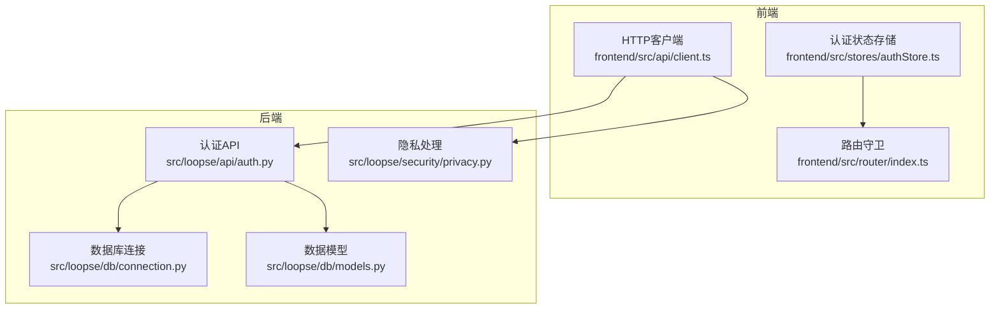
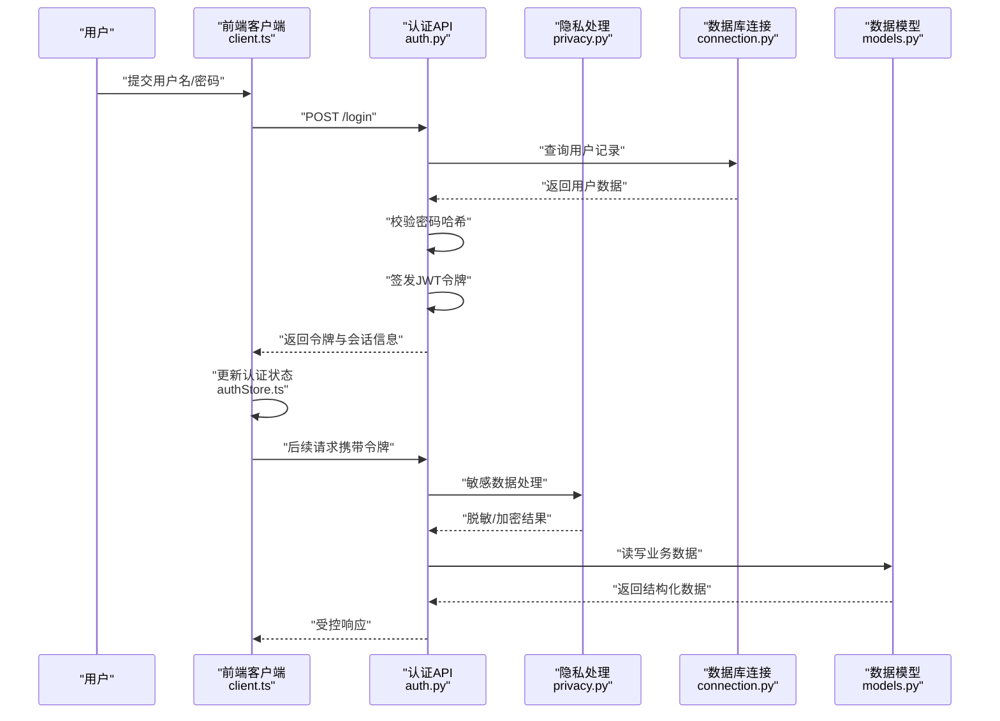
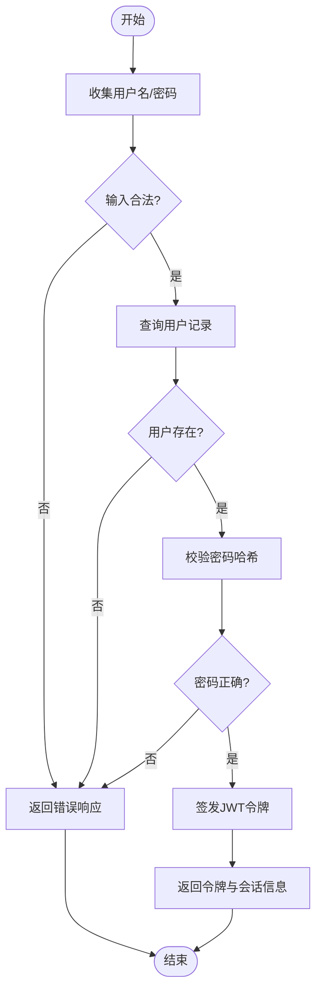
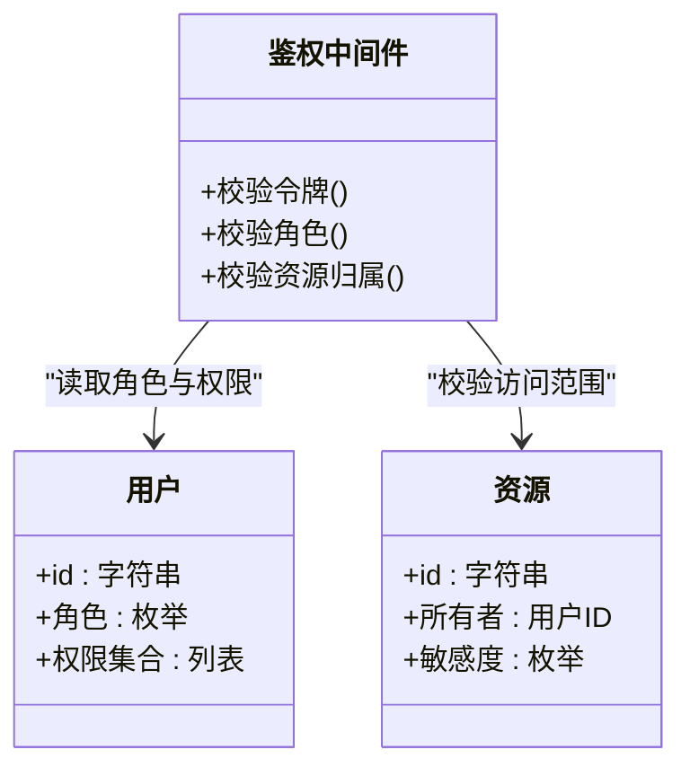
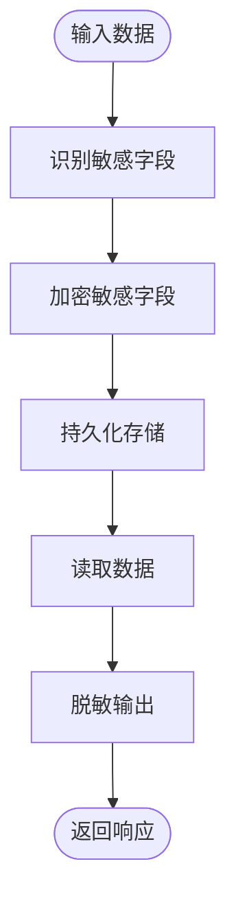
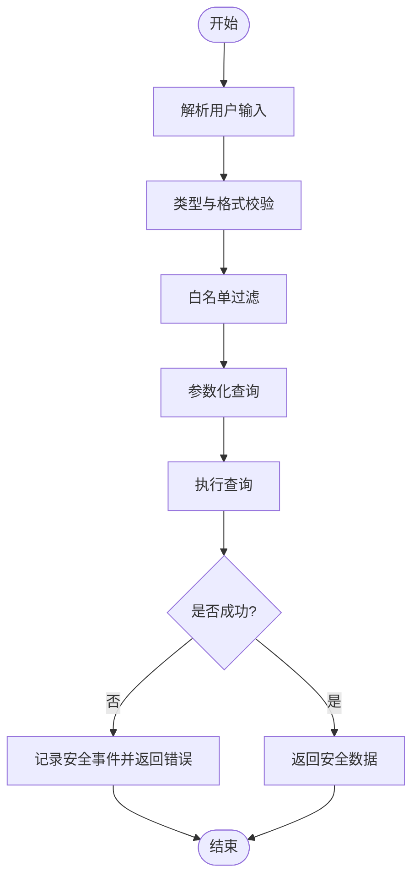
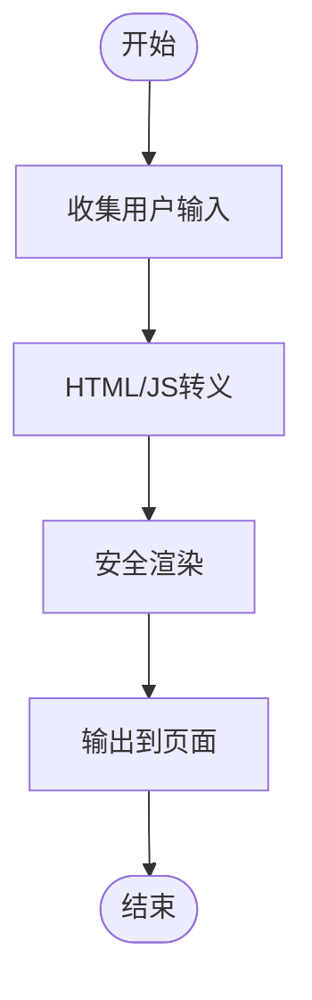
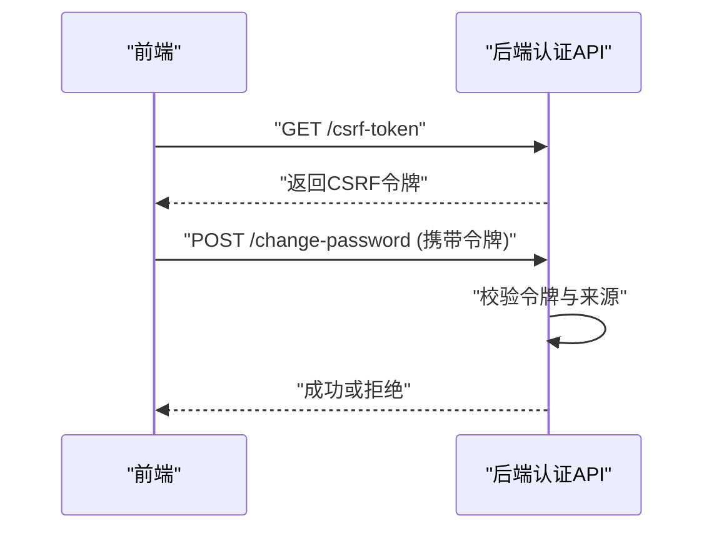
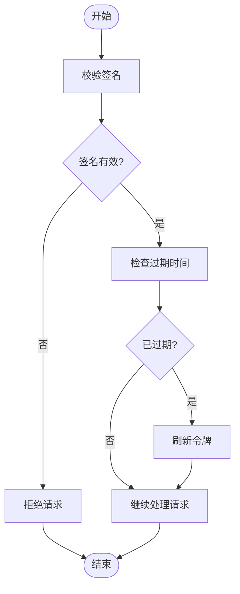
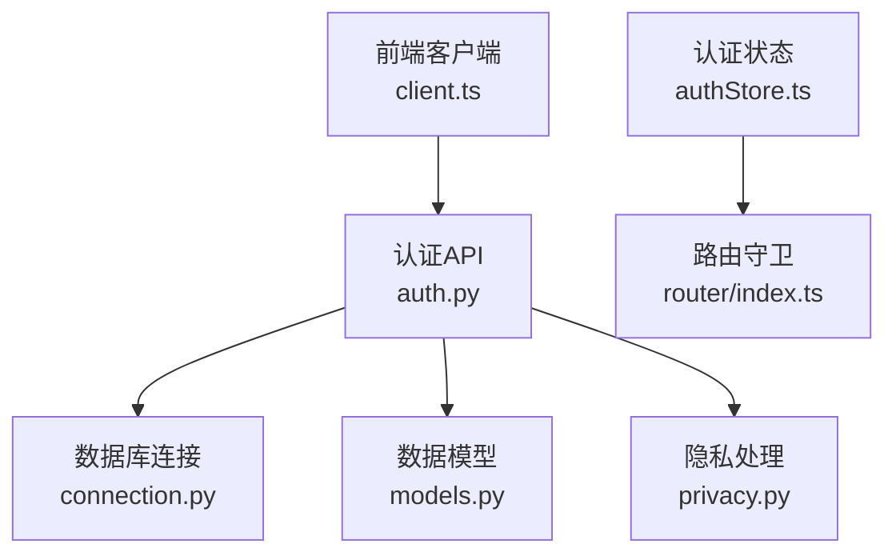

# 安全测试

<cite>
**本文引用的文件**   
- [src/loopse/api/auth.py](file://src/loopse/api/auth.py)
- [src/loopse/security/privacy.py](file://src/loopse/security/privacy.py)
- [src/loopse/db/connection.py](file://src/loopse/db/connection.py)
- [src/loopse/db/models.py](file://src/loopse/db/models.py)
- [frontend/src/api/client.ts](file://frontend/src/api/client.ts)
- [frontend/src/stores/authStore.ts](file://frontend/src/stores/authStore.ts)
- [frontend/src/router/index.ts](file://frontend/src/router/index.ts)
- [tests/unit/test_llm_client.py](file://tests/unit/test_llm_client.py)
- [pyproject.toml](file://pyproject.toml)
</cite>

## 目录
1. [简介](#简介)
2. [项目结构](#项目结构)
3. [核心组件](#核心组件)
4. [架构总览](#架构总览)
5. [详细组件分析](#详细组件分析)
6. [依赖分析](#依赖分析)
7. [性能考虑](#性能考虑)
8. [故障排查指南](#故障排查指南)
9. [结论](#结论)
10. [附录](#附录)

## 简介
本指南面向开发与测试团队，提供覆盖身份认证、授权控制与数据隐私的安全测试实施方法。文档聚焦以下目标：
- 身份认证测试：登录、注册、令牌签发与校验、会话管理
- 授权控制测试：基于角色的访问控制（RBAC）、权限边界、越权访问
- 数据隐私保护测试：敏感数据加密、脱敏输出、最小化采集
- 常见攻击防护测试：SQL注入、XSS、CSRF
- JWT令牌安全验证：签名算法、过期时间、刷新机制、撤销策略
- OWASP Top 10漏洞扫描与安全审计工具使用
- 用户输入验证、API访问控制、会话管理的自动化测试
- 渗透测试模拟、安全日志审计与合规性检查

## 项目结构
本项目采用前后端分离架构：
- 后端：FastAPI应用，包含认证、业务API、数据库模型与连接、隐私处理等模块
- 前端：Vue3 + TypeScript，包含认证状态管理、路由守卫、HTTP客户端拦截器
- 测试：单元测试与集成测试脚本，覆盖关键逻辑与外部依赖

图表来源
- [frontend/src/api/client.ts](file://frontend/src/api/client.ts)
- [frontend/src/stores/authStore.ts](file://frontend/src/stores/authStore.ts)
- [frontend/src/router/index.ts](file://frontend/src/router/index.ts)
- [src/loopse/api/auth.py](file://src/loopse/api/auth.py)
- [src/loopse/security/privacy.py](file://src/loopse/security/privacy.py)
- [src/loopse/db/connection.py](file://src/loopse/db/connection.py)
- [src/loopse/db/models.py](file://src/loopse/db/models.py)

章节来源
- [src/loopse/api/auth.py](file://src/loopse/api/auth.py)
- [src/loopse/security/privacy.py](file://src/loopse/security/privacy.py)
- [src/loopse/db/connection.py](file://src/loopse/db/connection.py)
- [src/loopse/db/models.py](file://src/loopse/db/models.py)
- [frontend/src/api/client.ts](file://frontend/src/api/client.ts)
- [frontend/src/stores/authStore.ts](file://frontend/src/stores/authStore.ts)
- [frontend/src/router/index.ts](file://frontend/src/router/index.ts)

## 核心组件
- 认证与授权
  - 认证API负责用户登录、注册、令牌签发与校验；应实现密码哈希、令牌签名、过期与刷新策略
  - 授权控制应在API层进行权限校验，结合角色与资源范围，防止水平/垂直越权
- 数据隐私
  - 隐私处理模块负责敏感字段加密、脱敏输出与最小化采集策略
- 数据库
  - 连接与模型层需确保参数化查询、字段约束与索引优化，避免注入与明文存储
- 前端安全
  - HTTP客户端应统一设置请求头、错误处理与重定向策略
  - 认证状态存储应避免持久化敏感信息，路由守卫应强制鉴权

章节来源
- [src/loopse/api/auth.py](file://src/loopse/api/auth.py)
- [src/loopse/security/privacy.py](file://src/loopse/security/privacy.py)
- [src/loopse/db/connection.py](file://src/loopse/db/connection.py)
- [src/loopse/db/models.py](file://src/loopse/db/models.py)
- [frontend/src/api/client.ts](file://frontend/src/api/client.ts)
- [frontend/src/stores/authStore.ts](file://frontend/src/stores/authStore.ts)
- [frontend/src/router/index.ts](file://frontend/src/router/index.ts)

## 架构总览
下图展示从前端到后端的认证与授权流程，以及隐私处理与数据库交互的关键路径。

图表来源
- [frontend/src/api/client.ts](file://frontend/src/api/client.ts)
- [frontend/src/stores/authStore.ts](file://frontend/src/stores/authStore.ts)
- [src/loopse/api/auth.py](file://src/loopse/api/auth.py)
- [src/loopse/security/privacy.py](file://src/loopse/security/privacy.py)
- [src/loopse/db/connection.py](file://src/loopse/db/connection.py)
- [src/loopse/db/models.py](file://src/loopse/db/models.py)

## 详细组件分析

### 身份认证测试
- 测试目标
  - 登录成功与失败路径、密码强度与复杂度校验、账户锁定与重试限制
  - JWT令牌签发、校验、过期与刷新流程
  - 会话管理与跨域安全配置
- 关键用例
  - 正常登录：正确凭据返回有效令牌
  - 异常登录：错误凭据返回明确错误码且不泄露细节
  - 令牌过期：自动刷新或引导重新登录
  - 并发登录：会话一致性与时钟漂移处理
- 参考实现位置
  - 认证API入口与逻辑：[src/loopse/api/auth.py](file://src/loopse/api/auth.py)
  - 前端认证状态管理：[frontend/src/stores/authStore.ts](file://frontend/src/stores/authStore.ts)
  - 前端HTTP客户端：[frontend/src/api/client.ts](file://frontend/src/api/client.ts)

图表来源
- [src/loopse/api/auth.py](file://src/loopse/api/auth.py)
- [frontend/src/api/client.ts](file://frontend/src/api/client.ts)
- [frontend/src/stores/authStore.ts](file://frontend/src/stores/authStore.ts)

章节来源
- [src/loopse/api/auth.py](file://src/loopse/api/auth.py)
- [frontend/src/stores/authStore.ts](file://frontend/src/stores/authStore.ts)
- [frontend/src/api/client.ts](file://frontend/src/api/client.ts)

### 授权控制测试
- 测试目标
  - 基于角色的访问控制（RBAC）：不同角色对资源的读/写/删除权限
  - 权限边界：水平越权（访问他人资源）与垂直越权（提升权限）
  - API级鉴权：中间件或装饰器校验令牌与权限范围
- 关键用例
  - 未认证访问：拒绝并返回401
  - 无权限访问：拒绝并返回403
  - 越权访问：尝试修改他人资源，应被拒绝
  - 资源范围校验：按租户/部门/项目维度隔离
- 参考实现位置
  - 认证与授权API：[src/loopse/api/auth.py](file://src/loopse/api/auth.py)
  - 数据模型与约束：[src/loopse/db/models.py](file://src/loopse/db/models.py)

图表来源
- [src/loopse/api/auth.py](file://src/loopse/api/auth.py)
- [src/loopse/db/models.py](file://src/loopse/db/models.py)

章节来源
- [src/loopse/api/auth.py](file://src/loopse/api/auth.py)
- [src/loopse/db/models.py](file://src/loopse/db/models.py)

### 数据隐私保护测试
- 测试目标
  - 敏感字段加密存储与解密读取
  - 输出脱敏：日志与响应中不暴露敏感信息
  - 最小化采集：仅收集必要数据，并提供删除与导出能力
- 关键用例
  - 写入敏感数据：确认密文存储
  - 读取敏感数据：确认脱敏输出
  - 日志审计：确认无敏感字段落盘
- 参考实现位置
  - 隐私处理模块：[src/loopse/security/privacy.py](file://src/loopse/security/privacy.py)
  - 数据模型字段定义：[src/loopse/db/models.py](file://src/loopse/db/models.py)

图表来源
- [src/loopse/security/privacy.py](file://src/loopse/security/privacy.py)
- [src/loopse/db/models.py](file://src/loopse/db/models.py)

章节来源
- [src/loopse/security/privacy.py](file://src/loopse/security/privacy.py)
- [src/loopse/db/models.py](file://src/loopse/db/models.py)

### SQL注入防护测试
- 测试目标
  - 所有数据库查询必须使用参数化语句或ORM安全接口
  - 禁止拼接用户输入到SQL字符串
  - 输入校验与白名单过滤
- 关键用例
  - 在查询参数中注入恶意片段，预期返回错误或空结果
  - 批量操作与复杂条件组合的注入点覆盖
- 参考实现位置
  - 数据库连接与查询封装：[src/loopse/db/connection.py](file://src/loopse/db/connection.py)
  - 数据模型与查询构造：[src/loopse/db/models.py](file://src/loopse/db/models.py)

图表来源
- [src/loopse/db/connection.py](file://src/loopse/db/connection.py)
- [src/loopse/db/models.py](file://src/loopse/db/models.py)

章节来源
- [src/loopse/db/connection.py](file://src/loopse/db/connection.py)
- [src/loopse/db/models.py](file://src/loopse/db/models.py)

### XSS攻击防护测试
- 测试目标
  - 前端渲染时对所有用户输入进行转义或沙箱化处理
  - 后端输出JSON而非HTML，避免直接渲染不可信内容
  - CSP策略与Content-Type设置
- 关键用例
  - 在富文本或评论字段插入脚本标签，预期被转义或拒绝
  - 动态URL参数注入，预期被编码
- 参考实现位置
  - 前端HTTP客户端与视图渲染：[frontend/src/api/client.ts](file://frontend/src/api/client.ts)
  - 认证与路由守卫（影响页面加载与跳转）：[frontend/src/router/index.ts](file://frontend/src/router/index.ts)

图表来源
- [frontend/src/api/client.ts](file://frontend/src/api/client.ts)
- [frontend/src/router/index.ts](file://frontend/src/router/index.ts)

章节来源
- [frontend/src/api/client.ts](file://frontend/src/api/client.ts)
- [frontend/src/router/index.ts](file://frontend/src/router/index.ts)

### CSRF攻击防护测试
- 测试目标
  - 状态变更接口需校验CSRF令牌或同源策略
  - 前端请求携带必要的令牌或SameSite Cookie策略
- 关键用例
  - 跨站伪造请求：缺少或无效令牌应被拒绝
  - 多站点场景：严格同源校验与CORS白名单
- 参考实现位置
  - 认证API与前端客户端：[src/loopse/api/auth.py](file://src/loopse/api/auth.py), [frontend/src/api/client.ts](file://frontend/src/api/client.ts)

图表来源
- [src/loopse/api/auth.py](file://src/loopse/api/auth.py)
- [frontend/src/api/client.ts](file://frontend/src/api/client.ts)

章节来源
- [src/loopse/api/auth.py](file://src/loopse/api/auth.py)
- [frontend/src/api/client.ts](file://frontend/src/api/client.ts)

### JWT令牌安全验证
- 测试目标
  - 签名算法与密钥管理：强算法、轮换与吊销
  - 过期时间与刷新机制：短期访问令牌与长期刷新令牌
  - 载荷最小化：不包含敏感信息
- 关键用例
  - 篡改令牌：签名校验失败
  - 过期令牌：触发刷新或重新登录
  - 撤销令牌：黑名单或短生命周期
- 参考实现位置
  - 认证API：[src/loopse/api/auth.py](file://src/loopse/api/auth.py)
  - 前端状态管理：[frontend/src/stores/authStore.ts](file://frontend/src/stores/authStore.ts)

图表来源
- [src/loopse/api/auth.py](file://src/loopse/api/auth.py)
- [frontend/src/stores/authStore.ts](file://frontend/src/stores/authStore.ts)

章节来源
- [src/loopse/api/auth.py](file://src/loopse/api/auth.py)
- [frontend/src/stores/authStore.ts](file://frontend/src/stores/authStore.ts)

### 用户输入验证、API访问控制与会话管理
- 用户输入验证
  - 类型、长度、格式与白名单校验
  - 防注入与防XSS的前后端双重校验
- API访问控制
  - 统一鉴权中间件，按角色与资源范围校验
  - 速率限制与异常熔断
- 会话管理
  - 会话绑定IP/UA、超时与清理策略
  - 前端安全存储与传输加密
- 参考实现位置
  - 认证API与客户端：[src/loopse/api/auth.py](file://src/loopse/api/auth.py), [frontend/src/api/client.ts](file://frontend/src/api/client.ts)
  - 路由守卫：[frontend/src/router/index.ts](file://frontend/src/router/index.ts)

章节来源
- [src/loopse/api/auth.py](file://src/loopse/api/auth.py)
- [frontend/src/api/client.ts](file://frontend/src/api/client.ts)
- [frontend/src/router/index.ts](file://frontend/src/router/index.ts)

### OWASP Top 10漏洞扫描与安全审计工具使用
- 推荐工具
  - SAST：Semgrep、Bandit（Python静态分析）
  - DAST：OWASP ZAP、Burp Suite（动态扫描）
  - 依赖漏洞：pip-audit、npm audit
- 使用方法
  - 将工具集成至CI流水线，定期运行并生成报告
  - 针对Top 10类别（注入、失效的身份认证、敏感数据泄露等）定制规则与用例
- 参考实现位置
  - 项目依赖与构建配置：[pyproject.toml](file://pyproject.toml)

章节来源
- [pyproject.toml](file://pyproject.toml)

### 渗透测试模拟、安全日志审计与合规性检查
- 渗透测试模拟
  - 设计攻击面清单：认证、授权、输入、输出、会话、第三方依赖
  - 自动化脚本与手动验证结合，记录证据与修复建议
- 安全日志审计
  - 记录认证与授权事件、异常与告警
  - 日志脱敏与集中化管理
- 合规性检查
  - 数据最小化、保留周期与用户同意
  - 加密与密钥管理符合规范
- 参考实现位置
  - 隐私处理与日志相关模块：[src/loopse/security/privacy.py](file://src/loopse/security/privacy.py)
  - 认证与授权API：[src/loopse/api/auth.py](file://src/loopse/api/auth.py)

章节来源
- [src/loopse/security/privacy.py](file://src/loopse/security/privacy.py)
- [src/loopse/api/auth.py](file://src/loopse/api/auth.py)

## 依赖分析
- 组件耦合
  - 认证API依赖数据库连接与数据模型，同时调用隐私处理模块
  - 前端客户端与认证状态管理紧密耦合，路由守卫依赖认证状态
- 外部依赖
  - 依赖库版本与已知漏洞通过包管理器与审计工具管理
- 潜在风险
  - 循环依赖与隐式全局状态可能导致安全策略不一致
  - 第三方库供应链风险需持续监控

图表来源
- [src/loopse/api/auth.py](file://src/loopse/api/auth.py)
- [src/loopse/db/connection.py](file://src/loopse/db/connection.py)
- [src/loopse/db/models.py](file://src/loopse/db/models.py)
- [src/loopse/security/privacy.py](file://src/loopse/security/privacy.py)
- [frontend/src/api/client.ts](file://frontend/src/api/client.ts)
- [frontend/src/stores/authStore.ts](file://frontend/src/stores/authStore.ts)
- [frontend/src/router/index.ts](file://frontend/src/router/index.ts)

章节来源
- [src/loopse/api/auth.py](file://src/loopse/api/auth.py)
- [src/loopse/db/connection.py](file://src/loopse/db/connection.py)
- [src/loopse/db/models.py](file://src/loopse/db/models.py)
- [src/loopse/security/privacy.py](file://src/loopse/security/privacy.py)
- [frontend/src/api/client.ts](file://frontend/src/api/client.ts)
- [frontend/src/stores/authStore.ts](file://frontend/src/stores/authStore.ts)
- [frontend/src/router/index.ts](file://frontend/src/router/index.ts)

## 性能考虑
- 认证与授权开销
  - 减少不必要的数据库查询，缓存常用权限集
  - JWT校验尽量无状态，避免频繁黑名单查询
- 输入验证与加密
  - 批量校验与懒加载，避免阻塞主流程
  - 对称加密用于大数据段，非对称用于密钥交换
- 日志与审计
  - 异步写入与采样策略，降低I/O压力

## 故障排查指南
- 常见问题
  - 认证失败：检查密码哈希算法与密钥配置
  - 授权拒绝：核对角色映射与资源归属
  - 敏感数据泄露：审查输出脱敏与日志策略
- 调试步骤
  - 启用详细日志与追踪ID
  - 复现最小用例并定位断点
  - 对比期望与实际响应差异
- 参考实现位置
  - 认证与隐私处理：[src/loopse/api/auth.py](file://src/loopse/api/auth.py), [src/loopse/security/privacy.py](file://src/loopse/security/privacy.py)
  - 前端客户端错误处理：[frontend/src/api/client.ts](file://frontend/src/api/client.ts)

章节来源
- [src/loopse/api/auth.py](file://src/loopse/api/auth.py)
- [src/loopse/security/privacy.py](file://src/loopse/security/privacy.py)
- [frontend/src/api/client.ts](file://frontend/src/api/client.ts)

## 结论
通过系统化的安全测试与审计，可有效降低认证、授权与数据隐私方面的风险。建议将安全测试纳入持续集成流程，结合SAST/DAST与人工渗透测试，形成闭环改进。

## 附录
- 测试用例模板与检查清单
- 工具安装与配置示例
- 合规性对照表（如个人信息保护法、数据安全法）